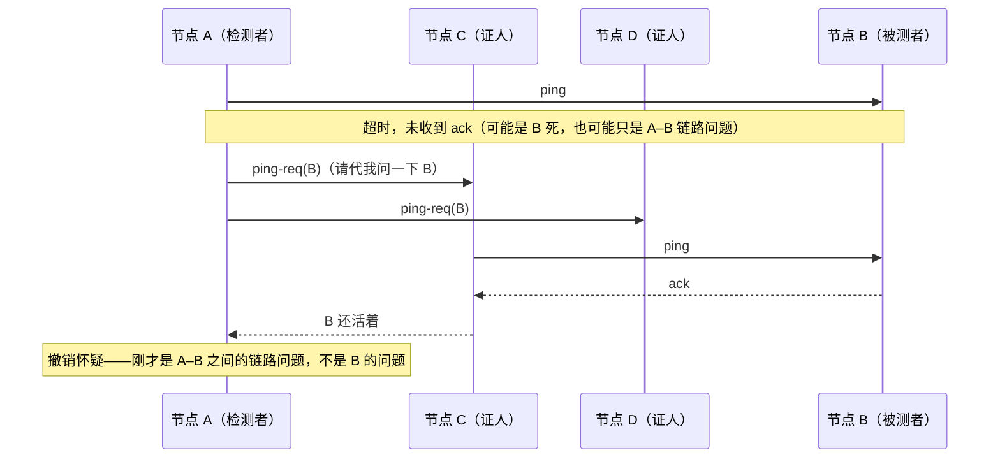

---
tags:
  - 高性能存储
status: 已完成
---

# Membership 与故障检测

> [[7.14 Split Brain]] 反复用到一个分母："多数派"是**成员名单**的多数。这一篇就讲名单本身：**membership（成员集合）**——集群承认哪些节点存在；以及维护名单的传感器：**故障检测（failure detection）**——判断名单上的节点此刻是否可用。两件事看似朴素，却各藏一个深坑：故障检测的深坑是**理论上不可能做准**（"没回复"永远区分不了死/慢/断），只能在"误判率"与"检测延迟"之间买卖；成员变更的深坑是**名单就是 quorum 的分母**——换分母的过程若不走共识，两拨人各拿一个分母算多数，[[7.14 Split Brain]] 的防线一当场作废。本篇按"检测器怎么造 → 误判的代价怎么算 → 名单怎么安全地换 → 控制面怎么与数据面隔离"的顺序展开，这是 Ceph（Monitor + osdmap）、3FS（cluster manager）等一切分布式存储控制面的公共骨架。

前置：[[7.14 Split Brain]]（误判的最坏后果）、[[7.11 Primary-Backup 与 Multi-Raft]]（"没收到回复"的不可区分性；共识协议）。

---

## 1. 名词与背景：花名册与传感器

先把两个概念分干净【事实】：

- **Membership（成员集合）**：集群的"花名册"——哪些节点**被承认属于**这个集群。它是一份需要所有人达成一致的配置数据，变更是低频、重量级的操作（加机器、退役机器）；
- **存活视图（liveness view）**：花名册上每个节点**此刻**是 up 还是 down 的判断。它是高频、易变、且**本质上是猜测**的观测数据。

两者组合出四种状态，处理方式完全不同【实现】：

| 在名单上？ | 判活？ | 含义 | 系统动作 |
| --- | --- | --- | --- |
| 是 | up | 正常成员 | 参与放置、承接读写 |
| 是 | down | 疑似故障 | 不再路由新请求；超过宽限期触发数据重建（[[7.17 Recovery 与 Rebuild]]） |
| 否 | —— | 已退役/未加入 | 其请求应被拒绝（防"僵尸旧成员"） |
| 是（旧名单）/否（新名单） | —— | **变更进行中** | 最危险的窗口，第 5 节专门处理 |

**为什么不能让每个节点各自判活、各自路由**【事实】：判活是猜测，不同节点的猜测天然不一致（网络位置不同、超时参数抖动）。如果 A 认为 X 活着而 B 认为 X 死了，A 把写发给 X、B 把同一分片的写发给替补——路由分歧就是数据分歧的前奏。所以存活视图最终要**收敛成一个全局一致的版本**（哪怕它是错的，也要错得一致），由控制面统一发布：Ceph 里是 Monitor 用 Paxos 定版的 osdmap（带 epoch），3FS 里是 cluster manager 分发的链表（[[7.4 3FS 架构]]），本质都是"**猜测民主化 → 结论集中化**"【设计】。

---

## 2. 故障检测的理论底线：做不准，只能买卖

**完美的故障检测器不存在**【事实】。在异步网络（消息延迟无上界）里，你无法区分"进程死了"与"消息还在路上"——这是 FLP 不可能结果的日常表述。学术上把检测器按两个性质分级（Chandra-Toueg）：

- **完备性（completeness）**：真死的节点，最终会被怀疑——不漏报；
- **准确性（accuracy）**：活着的节点，不被（或最终不再被）错误怀疑——不误报。

异步网络里两者不可兼得，实用系统全部选择**保完备、弃准确**：宁可误判活人，不可漏掉死人——因为漏判死人 = 数据永远缺副本，而误判活人的代价（无谓切换）可以用机制兜住（fencing、宽限期）。**超时是唯一的检测手段**，一切花样都只是在回答"超时该设多长、怎么自适应"。

超时参数的两难【取舍】：

$$
T_{timeout} > RTT_{p99.9} + pause_{p99.9} \quad \text{（防误判）}
$$

$$
T_{timeout} < T_{可容忍不可用窗口} \quad \text{（防迟钝）}
$$

左边不满足 → 网络抖动、GC/STW 停顿被当成死亡，触发无谓切换；右边不满足 → 真故障后系统盲等太久。两个不等式之间的空间就是你的设计余地——**当这个空间为空（网络抖动大到与故障不可区分）时，任何参数都救不了，只能改善网络或把检测搬到更稳的通道上**【实践】。

---

## 3. 检测机制谱系：从心跳到怀疑度

### 3.1 心跳的三种拓扑

**心跳（heartbeat）**：节点周期性发"我还活着"消息，超时未收到即怀疑【事实】。同样的心跳，拓扑不同，账完全不同【实现】：

| 拓扑 | 消息量/周期 | 优点 | 缺点 |
| --- | --- | --- | --- |
| **中心式**（全员 → 控制节点） | O(N) | 视图天然集中、实现最简 | 控制节点是单点+热点；它与某节点之间的链路问题会被当成节点问题 |
| **全互联**（两两互测） | O(N²) | 无单点、视角最全 | 万节点集群每周期亿级消息，不可行 |
| **Gossip / SWIM**（随机抽查+转发） | O(N) | 无单点、可扩展、自带非传递分区的免疫力 | 视图收敛是概率性的（O(log N) 轮），实现最复杂 |

生产系统的常见组合【实践】：**数据节点间用去中心化检测收集证据，最终由共识小集群定版发布**——Ceph 的 OSD 互相心跳、向 Monitor 上报"我怀疑 osd.12"，Monitor 攒够独立证词再走 Paxos 改地图。既避免中心节点亲自 ping 全员（视角单一 + 热点），又保住"结论只有一个版本"。

### 3.2 SWIM：间接探测解决"我的网络问题 ≠ 你的故障"

SWIM 的核心创新是**用第三方视角过滤误判**【事实】。A 直接 ping B 失败后，不立刻宣判，而是随机拉 k 个证人代问：



若证人也全部失败，B 进入 **suspect（被怀疑）**状态并随 gossip 传播；宽限期内 B 可以自己辟谣（带更高的化身号 incarnation 反驳），到期无人辟谣才定案为 dead【实现】。suspect 这个中间态的价值：把"一票定罪"改成"公示期 + 抗辩"，大幅压低误判率——代价是检测延迟多了一个公示期【取舍】。这也正是 §2 两难的一个工程解：不是把超时调得更准，而是**给误判加一道可撤销的缓冲**。

### 3.3 Phi accrual：输出怀疑度而不是布尔值

固定超时的尴尬：网络好时 5s 太迟钝，网络抖时 5s 疯狂误报。**Phi accrual 检测器**（Cassandra/Akka 使用）换了输出类型【事实】：维护最近心跳间隔的分布，输出一个连续值

$$
\varphi(t) = -\log_{10} P(\text{间隔} > t_{now} - t_{last})
$$

含义：按历史分布，当前这么久没收到心跳有多反常。φ=1 表示约 10% 概率是误判，φ=3 约 0.1%。使用者按场景选阈值：路由摘除用低阈值（宁可多摘，反正可以摘回来，[[10.6 健康检查与故障摘除]]），触发数据重建用高阈值（搬数据代价大）——**同一个传感器，不同动作用不同置信度**，这是布尔输出给不了的能力【设计】。第 7 节给出可运行实现。

### 3.4 为什么 TCP keepalive 不够

新手最容易犯的偷懒【实践】：拿 TCP 连接状态当健康信号。三条硬伤：

1. 默认参数不可用：`tcp_keepalive_time` 默认 **2 小时**才发第一个探测；
2. 半开连接：对端整机断电/网线拔掉后，本端连接仍显示 `ESTABLISHED`，直到你真的发数据（[[7.14 Split Brain]] §2 的单向可达形态）；
3. **连接活 ≠ 进程健康 ≠ 服务健康**：内核替你回 ACK，此时应用线程可能已死锁；进程活着，磁盘可能已只读。正确分层：应用层心跳（证明事件循环活着）+ 心跳里捎带健康摘要（盘可写、队列深度、[[7.18 Backpressure 与过载保护]] 的负载信号）——检测"能否服务"，而不是"能否 ACK"。

---

## 4. 误判的代价账：两个方向都是真金白银

**误报（false positive，活人判死）的代价链**【事实】：判死 → 触发主备切换（选举 + 客户端重路由 + 缓存重建）→ 超过宽限期还触发数据重建（搬副本，[[7.17 Recovery 与 Rebuild]]）→ 重建流量挤压前台（[[7.16 数据放置与 Rebalance]] §7 的账）。最恶劣的形态是**正反馈雪崩**【实践】：网络拥塞 → 心跳超时 → 判死若干节点 → 触发重建 → 重建流量加剧拥塞 → 更多心跳超时——Ceph 集群"抖动放大"事故的标准剧本（[[7.5 Ceph RADOS 与 CRUSH]] §7 陷阱 7）。

**漏报/迟钝（真死了没发现）的代价**【事实】：故障节点上的分片持续不可用；更隐蔽的是**半死节点（limping/gray failure）**——能回心跳但慢如蜗牛，检测器眼里它是活的，它却把落在它身上的所有请求拖成尾延迟。对策：健康信号不只看"心跳通"，还要看**服务质量指标**（该节点的请求延迟 p99、错误率），慢到阈值同样摘除【实践】。

三个标准缓冲机制【实现】：

- **宽限期分层**：路由摘除（秒级，可逆，代价小）与数据重建（分钟级，昂贵）用不同的确认门槛——快摘慢建；
- **抖动抑制（滞回/冷却）**：一个节点短时间内反复 up/down（flapping），第 k 次恢复后要求观察期加倍才重新纳入路由——防止它把整个集群拖入"反复迁移"；
- **摘除比例上限**：同时被判死的节点超过集群的某个比例（如 1/3）时，**冻结自动动作、只报警**——大面积"死亡"更可能是检测路径自身的故障（监控网络断了），此时自动化是灾难放大器（[[10.6 健康检查与故障摘除]]）。

---

## 5. 成员变更：换 quorum 的分母必须走共识

现在到花名册本身。**为什么变更危险**【事实】：多数派的"多数"是相对名单而言的。设集群 {A,B,C}，一次性加入 D、E。若消息传播有先后，某时刻 A、B 还拿旧名单 {A,B,C}（多数=2），D、E 与 C 已用新名单 {A,B,C,D,E}（多数=3）：{A,B} 凑出旧口径的多数，{C,D,E} 凑出新口径的多数，**两个"多数"互不相交**——可以各选一个主、各提交各的写。这不是分区造成的脑裂，是**配置不一致造成的脑裂**，防线一在数学上就没了。

两条安全路线（Raft 的答案）【事实】：

1. **单步变更（single-server change）**：每次只加或只减**一个**节点。可以证明：新旧名单的任意多数必然相交（差一个成员不足以造出两个不相交的多数），所以旧口径与新口径不可能同时选出两个主。加三台机器就走三轮，每轮本身作为一条日志提交；
2. **联合共识（joint consensus）**：变更期间要求**新旧两个名单各自的多数**都同意才算数（C_old,new 阶段），两阶段切换。更复杂，换来一次变更任意多台。

工程共识【实践】：绝大多数系统（etcd 等）选单步变更——慢一点但简单可验证。另一个必须遵守的纪律：**新节点先以不计票身份（learner/non-voting）追数据，追平后再提升为投票成员**——否则一台空节点入伙立刻抬高多数派门槛，而它自己还投不出有意义的票，等于凭空降低了集群容错能力【实现】。

**名单的发布：带版本的地图 + 惰性纠正**【实现】。定版后的名单不需要"所有人同时切换"（做不到），通用手法是 [[7.5 Ceph RADOS 与 CRUSH]] §2.2 的 epoch 机制：名单/地图带单调版本号，每条消息捎带发送方的版本；收到旧版本消息的一方回推新地图，对方更新后重试。一致性不靠同步广播，靠"**旧版本的请求会被识别并纠正**"。被移除的旧成员因此也自然失效：它的请求带着旧 epoch，处处被拒——这本质上就是 [[7.12 Lease 与 Fencing]] 的 fencing 思想用在成员维度【设计】。

对照两处实例【事实】：Ceph——osdmap 由 3/5 个 Monitor 用 Paxos 定版，OSD/client 惰性拉取，数据面（对象读写）不经过 Monitor；3FS——cluster manager 维护成员与复制链表，客户端缓存链表、按版本校正（[[7.4 3FS 架构]] §2）。共同点：**名单的定版走共识（强一致、低频），名单的传播走惰性（最终一致、高频）**——把昂贵的一致性只花在刀刃上。

---

## 6. 与数据面隔离：控制面的抖动不该放大成数据面的事故

三条隔离纪律（[[10.1 数据面与控制面分工]] 在本主题的具体化）【实践】：

1. **数据路径不做控制面的每请求依赖**：客户端缓存地图/名单本地路由，控制面宕机只影响"变更"不影响"进行中的 IO"（Ceph：Monitor 全挂，已建立的对象读写照常）。反例：每次 IO 前先问一次"谁是主"——控制面成了全局热点与单点；
2. **检测信道与数据信道尽量解耦**：数据网打满导致心跳超时 → 误判 → 重建流量加剧打满，是 §4 雪崩的根。可行手段：心跳走独立网卡/VLAN、或至少独立的 QoS 队列与线程（心跳线程不与 IO 线程共享池，避免 IO 阻塞把心跳饿死——cgroup CPU 配额打满饿死心跳线程是容器环境的高频事故，[[7.12 Lease 与 Fencing]] §8）；
3. **控制面动作限速**：一次发布地图影响的分片数、单位时间触发的迁移量都要设上限——控制面的一个决定可能让数据面搬几个小时的数据，决定本身必须节流（衔接 [[7.16 数据放置与 Rebalance]] §7）。

---

## 7. Modern C++：Phi accrual 检测器最小实现

滑动窗口记录心跳间隔，按指数分布近似计算"当前静默时长的反常度"。RAII、无裸内存，`steady_clock` 计时（墙钟会被 NTP 拨动，[[7.12 Lease 与 Fencing]] §2 同一纪律）：

```cpp
#include <chrono>
#include <cmath>
#include <deque>
#include <numeric>
#include <optional>

using Clock = std::chrono::steady_clock;

class PhiAccrualDetector {
public:
    explicit PhiAccrualDetector(std::size_t window = 100) : window_{window} {}

    void on_heartbeat(Clock::time_point now) {
        if (last_) {
            intervals_.push_back(std::chrono::duration<double>(now - *last_).count());
            if (intervals_.size() > window_) intervals_.pop_front();
        }
        last_ = now;
    }

    // 怀疑度：phi = -log10( P(间隔 > 当前静默时长) )，指数分布近似
    // phi ≈ 1 → 约 10% 概率是误判；phi ≈ 3 → 约 0.1%
    std::optional<double> phi(Clock::time_point now) const {
        if (!last_ || intervals_.empty()) return std::nullopt;   // 证据不足，不判
        const double mean = std::accumulate(intervals_.begin(), intervals_.end(), 0.0)
                            / static_cast<double>(intervals_.size());
        const double silence = std::chrono::duration<double>(now - *last_).count();
        return silence / (mean * std::numbers::ln10);            // -log10(e^{-t/mean})
    }

private:
    std::size_t window_;
    std::deque<double> intervals_;               // 最近 window 次心跳间隔（秒）
    std::optional<Clock::time_point> last_;
};
```

使用侧的分层阈值（§3.3 的观点落成代码）：

```cpp
// 同一传感器，不同动作用不同置信度：
if (auto p = det.phi(Clock::now()); p) {
    if (*p > 8.0)      trigger_rebuild(node);    // 极高置信才搬数据（昂贵、难回退）
    else if (*p > 3.0) mark_suspect(node);       // 公示 + 停发新请求（可逆）
    else if (*p > 1.0) deprioritize(node);       // 只降路由权重（几乎零代价）
}
```

要点【实践】：① 心跳间隔的历史分布是**自适应**的核心——网络变慢，mean 变大，同样的静默时长 φ 自动变低，误报随之下降；② 真实实现（Cassandra）会加最小方差下限与初始预热期，防止窗口未满时 mean 失真；③ 窗口里记录的是"收到心跳的间隔"，它混合了对端发送抖动与网络抖动——这正是想要的：检测的是**端到端可用性**，不是网络单项。

---

## 8. 观测与演练

**该采的指标**【实践】：

| 指标 | 含义 | 判读 |
| --- | --- | --- |
| 心跳 RTT 分布（p50/p99/p99.9） | 检测信道的健康度 | p99.9 逼近超时阈值 = 误判随时爆发；先扩这个余量再谈别的 |
| suspect 事件率 / 误判率（suspect 后又恢复的比例） | 检测器的准确性 | 误判率持续 >10% 说明阈值贴着抖动分布，按 §2 两个不等式重夹 |
| 成员地图 epoch 变化频率 | 控制面稳定度 | 无变更操作时 epoch 仍频繁 +1 = 有节点 flapping，找到它并隔离 |
| flapping 计数（单节点 up/down 翻转次数） | 抖动源定位 | 集中在个别节点 → 查该机网卡/负载；均匀分布 → 查共享网络 |
| 判死 → 摘除 → 重建各阶段耗时 | 端到端故障响应 | 与 SLO 对表：检测延迟 + 宽限期 + 重建时长 = 降级窗口总账 |

**演练矩阵**（对应 [[9.6 故障注入矩阵]]，每行验证一类误判源）【实践】：

```bash
kill -9 <pid>                                   # 干净死亡：检测延迟基线
kill -STOP <pid>                                # 冻结进程：进程"活着"但不心跳——
                                                #   预期 suspect → 宽限期 → 判死；SIGCONT 后验证辟谣路径
tc qdisc add dev eth0 root netem delay 800ms 400ms   # 抖动：验证 phi 自适应，不应立刻判死
iptables -A INPUT -p tcp --dport 7000 -j DROP   # 只断心跳端口：数据面还通——
                                                #   暴露"检测信道 ≠ 服务信道"的判定分歧
stress-ng --cpu $(nproc) --timeout 120          # CPU 打满：心跳线程是否被饿死（线程隔离是否生效）
```

每项注入后核对：suspect 是否先于 dead、宽限期是否生效、恢复后 flapping 抑制是否介入、以及**误判期间数据面是否被无谓迁移**——最后一条是这套机制的最终考卷。

---

## 9. 排障清单：症状 → 原因 → 检查

| 症状 | 常见原因 | 检查动作 |
| --- | --- | --- |
| 节点被反复判死又恢复（flapping） | 超时贴着网络/GC 抖动分布；或该机负载打满 | 拉心跳 RTT p99.9 与超时阈值对比；查该机 CPU throttling、GC 日志 |
| 无变更操作但地图 epoch 频繁增长 | 个别节点 flapping 驱动控制面反复定版 | 按节点分解 suspect 事件，找到抖动源；给它上抖动抑制 |
| 网络抖一下，集群大面积"死亡" | 检测与数据共信道 + 无摘除比例上限 | 核对摘除比例熔断配置；心跳是否独立 QoS/线程 |
| 半死节点拖高全局 p99，检测器却说一切正常 | 只检测"心跳通"，未检测服务质量 | 给健康信号加请求延迟/错误率维度；按节点分解 p99 找 limping 机 |
| 容器里节点频繁被误判 | cgroup CPU 配额打满，心跳线程饿死 | `throttled_time` 计数；心跳线程独立配额/提优先级 |
| 加节点期间集群短暂出现双主 | 成员变更未走共识 / 一次多台直接生效 | 审计变更协议：单步？learner 先追数据？两侧名单版本 |
| 移除的旧节点还在接收/发起请求 | 名单发布无版本校验，旧成员未被 fence | 请求是否携带 epoch 并在服务端校验；见 [[7.12 Lease 与 Fencing]] |
| 控制面（Monitor 类）宕机后 IO 也停了 | 数据面对控制面做了每请求依赖 | 客户端是否缓存地图本地路由；把控制面查询移出 IO 路径 |
| 判死很准但重建总是"迟到" | 路由摘除与数据重建共用同一宽限期 | 分层门槛：摘除用低阈值秒级，重建用高阈值分钟级 |

---

## 10. 陷阱与误区

> [!warning] 常见错误
> 1. **追求"判得准"**：异步网络里做不到。正确目标是"错得一致 + 错得起"——视图集中定版，误判由 fencing/宽限期兜底。
> 2. **拿 TCP 连接状态当健康检查**：keepalive 默认 2 小时、半开连接照样 `ESTABLISHED`、内核代答 ACK 时应用可能已死锁。必须应用层双向心跳。
> 3. **一个超时阈值包打天下**：路由摘除（便宜、可逆）和数据重建（昂贵、难回退）必须用不同置信度门槛——phi 类连续输出天然支持分层。
> 4. **成员变更"一把梭"**：一次加多台且立即计票 → 新旧名单各凑多数 → 配置型脑裂。单步变更 + learner 先追数据。
> 5. **空节点直接当投票成员**：抬高了多数派分母却贡献不了有效票，容错能力凭空下降。
> 6. **忽略半死（gray failure）**：能 ACK 不等于能服务；健康信号必须包含服务质量维度。
> 7. **检测、心跳、数据共用一条信道且无熔断**：拥塞 → 误判 → 重建 → 更拥塞的正反馈；大面积判死时应冻结自动化只报警。
> 8. **把"名单"与"存活"混为一谈**：退役要走成员变更（改名单），故障只改存活视图——用错通道会把临时抖动变成永久搬迁。

---

## 11. 关键结论

| 结论 | 性质 |
| --- | --- |
| Membership（名单，共识定版、低频）与存活视图（猜测，高频）是两个对象，变更走不同通道 | 事实 / 设计 |
| 完美故障检测在异步网络中不存在；实用系统保完备弃准确：宁可误判活人，用机制兜住误判 | 事实 |
| 超时被两个不等式夹：> RTT+停顿的 p99.9（防误判），< 可容忍不可用窗口（防迟钝）；空间为空时改网络而非调参 | 实践结论 |
| 判活证据可以分散采集（gossip/互测），结论必须集中定版（共识）+ 带 epoch 惰性传播 | 设计 |
| SWIM 间接探测过滤"我的链路问题"；suspect 公示期把一票定罪改成可抗辩，降误判换检测延迟 | 事实 / 取舍 |
| Phi accrual 输出连续怀疑度：自适应网络抖动，且允许"摘除低门槛、重建高门槛"的分层动作 | 实现 |
| TCP keepalive 不是健康检查：连接活 ≠ 进程健康 ≠ 服务健康 | 事实 |
| 误报代价 = 切换 + 重建风暴（可正反馈成雪崩）；漏报代价 = 降级窗口拉长 + 半死节点拖垮 p99 | 事实 |
| 名单是 quorum 的分母：变更不走共识会造出两个互不相交的"多数"——单步变更或联合共识 | 事实 |
| 新成员先当 learner 追平数据再计票；旧成员靠 epoch 校验自然 fence | 实现 |
| 控制面与数据面隔离三纪律：IO 不依赖控制面、检测信道解耦、控制面决定限速 | 实践结论 |

---

## 关联知识

- [[7.14 Split Brain]] - 误判与名单不一致的最坏后果
- [[7.12 Lease 与 Fencing]] - 判死后的安全兜底；epoch 校验即成员维度的 fencing
- [[7.11 Primary-Backup 与 Multi-Raft]] - 名单定版所用的共识协议本体
- [[7.16 数据放置与 Rebalance]] - 名单变更的直接下游：数据搬到哪、搬多快
- [[7.17 Recovery 与 Rebuild]] - 判死超过宽限期后触发的重建
- [[7.5 Ceph RADOS 与 CRUSH]] - Monitor/osdmap：定版走 Paxos、传播走惰性的实例
- [[7.4 3FS 架构]] - cluster manager：同一骨架的另一实例
- [[7.18 Backpressure 与过载保护]] - 心跳捎带的负载信号与过载时的行为
- [[10.1 数据面与控制面分工]] - 隔离纪律的一般化
- [[10.6 健康检查与故障摘除]] - 摘除策略、滞回与熔断的运维面

## 参考

- Das, Gupta, Motivala. *SWIM: Scalable Weakly-consistent Infection-style Process Group Membership Protocol*, DSN 2002
- Hayashibara et al. *The φ Accrual Failure Detector*, SRDS 2004
- Chandra, Toueg. *Unreliable Failure Detectors for Reliable Distributed Systems*, JACM 1996（完备性/准确性分级）
- Ongaro. *Consensus: Bridging Theory and Practice*（Raft 博士论文）第 4 章：成员变更（单步变更与 joint consensus）
- Huang et al. *Gray Failure: The Achilles' Heel of Cloud-Scale Systems*, HotOS 2017（半死节点）
- Kleppmann. *Designing Data-Intensive Applications* 第 8 章（超时与不可区分性）
- Ceph 文档：Monitor/OSD heartbeat、osdmap epoch；HashiCorp Serf/memberlist 文档（SWIM 工程实现）
