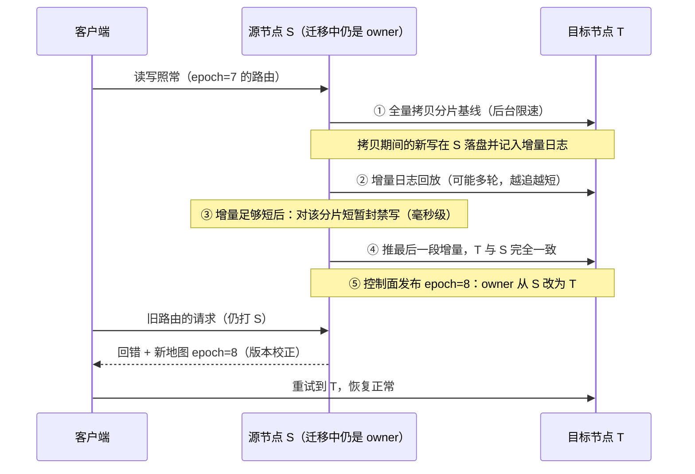

---
tags:
  - 高性能存储/分布式存储
status: 已完成
---

# 数据放置与 Rebalance

> [[7.15 Membership 与故障检测]] 结尾留下一个直接的下游问题：花名册变了，数据怎么办？这就是**数据放置（placement）**——把亿级对象/分片映射到千级节点的那个函数；以及 **rebalance（再均衡）**——当函数的输入（成员、权重、拓扑）变化后，把数据从旧位置搬到新位置的过程。放置函数的好坏可以用三个指标一次问清：**均衡吗**（每块盘存得差不多多）、**跨故障域吗**（副本不同机架）、**成员变化时搬得少吗**（加一台机器不至于全局洗牌）。朴素的 `hash % N` 三项全输——第三项输得最惨：加一台机器，约 80% 的数据要搬家。一致性哈希与 CRUSH 的全部价值，就是把"搬多少"从**全量**压到**变化占比**。而 rebalance 本身是一场用后台流量换布局的交易：迁移读源盘、写目标盘、占网络，与前台请求抢同一批资源——**不节流，前台 p99 先死；节流狠了，倾斜与降级窗口拉长**。本篇把函数与搬迁两笔账分开算清。

前置：[[7.5 Ceph RADOS 与 CRUSH]]（计算式放置的完整实例：两级映射与受控搬迁）、[[7.1 副本 vs EC]]（放置的对象是谁：副本/条带为何必须跨故障域）。

---

## 1. 名词与背景：放置是一个函数

**放置问题的定义**【事实】：给定 K 个数据单位（对象/分片/PG）和 N 个节点（或盘），维护一个映射 `place: key → 节点列表`（副本场景输出一个有序列表，[[7.1 副本 vs EC]]），要求任何读写方都能找到数据。两条实现路线（[[7.2 元数据路径瓶颈]] 的老对手）：

- **查表派**：维护一张目录（key → 位置），灵活但目录本身要存储、要一致、要抗单点；
- **计算派**：位置 = 纯函数输出，任何人现场算，零查表——Ceph 的 CRUSH（[[7.5 Ceph RADOS 与 CRUSH]]）、Dynamo/Cassandra 的一致性哈希都是这一派。本篇主讲这一派，因为"搬多少数据"恰恰由这个函数的**连续性**决定。

**分片（shard / partition / PG）是放置的操作单位**【设计】：不按对象逐个放置（亿级状态不可管理），而是先把对象 hash 进几千到几万个分片，再放置分片——管理单位与数据单位解耦（[[7.5 Ceph RADOS 与 CRUSH]] §2.1 同一思想）。后文说"搬数据"，单位都是分片。

**Rebalance 与 recovery 必须分开**【事实】——两者都搬数据，语义完全不同：

| | Rebalance | Recovery / Rebuild |
| --- | --- | --- |
| 起因 | 布局不优（扩容、倾斜、权重调整） | **冗余缺失**（盘坏、节点死） |
| 搬迁期间数据 | 全副本健在，只是位置不理想 | 少一份副本，再坏一台就可能丢数据 |
| 紧迫性 | 可以慢慢搬、可以暂停 | 有 durability 倒计时，优先级更高 |
| 详见 | 本篇 | [[7.17 Recovery 与 Rebuild]] |

把两者混在同一个限速池里，会出现"为了给扩容搬迁让路而拖慢补副本"的倒挂——调度上必须给 recovery 更高优先级【实践】。

---

## 2. 朴素方案为什么失败

**`hash % N`**：把 key 的哈希对节点数取模。均衡性尚可（哈希均匀），但另两项全崩【事实】：

- **搬迁灾难**：N 变成 N+1 后，只有满足 `h % N == h % (N+1)` 的 key 不动——比例约 1/(N+1)，即**约 N/(N+1) 的数据要搬**（4 → 5 节点：80%）。原因一句话：模数改变后几乎每个哈希值的余数都变了，函数没有任何"局部性"；
- **无故障域概念**：函数只输出一个编号，"三副本放三个机架"表达不出来。

**Range 分片**（按 key 区间切，HBase/TiKV 元区间路线）：搬迁性质好（区间可以单独移动、分裂），但【事实】：① 顺序写负载（日志、时间序列 key）永远砸在最后一个区间上——**写热点结构性存在**，需要不断分裂尾部区间；② 区间 → 节点的映射必须查表（目录服务），又回到查表派的成本。它适合需要范围扫描的数据库负载，对象存储类负载通常不选它【取舍】。

---

## 3. 一致性哈希：让函数具有"局部性"

![[图片/SVG/8_7_16_1.svg|900]]

**构造**【事实】：把哈希空间首尾相接成环（0 ~ 2⁶⁴−1）；节点按自己 id 的哈希落在环上；key 也哈希到环上，**顺时针走遇到的第一个节点就是归属**。副本 = 顺时针再走 R−1 个不同节点。

**为什么搬得少**【事实】：加入新节点 X（落在 B、C 之间），只有 (B, X] 这段区间的 key 归属从 C 变成 X——**其余 key 的归属判定完全不受影响**（它们顺时针遇到的第一个节点没变）。期望搬迁量 = K/N（新节点应得的份额），这是理论下界：搬得再少，新节点就没数据了。同理，删除节点只把它的区间交给顺时针邻居。对比 `hash % N` 的 N/(N+1)：**从"几乎全搬"降到"只搬该搬的"**——这就是"函数的连续性/局部性"的含义：输入的小变化只引起输出的小变化。

**裸环的两个缺陷与虚拟节点（vnode）**【实现】：

1. **方差大**：N 个节点随机落在环上，区间长度极不均匀（最长区间可达平均的 O(log N) 倍）——单点位置的"运气"直接变成容量倾斜；
2. **邻居诅咒**：一个节点下线，它的全部区间砸给顺时针的**单个**邻居——那台机器瞬间承压双份。

解法是每个物理节点在环上撒 V 个虚拟节点（V 通常 100~200）：① 大数定律抹平方差；② 权重 = 点数，异构容量（8 TB 的机器撒两倍的点）自然表达；③ 一台下线，它的 V 个区间散落给**全环**分摊，邻居诅咒消失。代价：环的元数据从 N 条变成 N×V 条，查找结构变大——对内存中的有序表可忽略【取舍】。

**与 CRUSH 的关系**【事实】：CRUSH（[[7.5 Ceph RADOS 与 CRUSH]]）目标相同（确定性、受控搬迁、权重），多买了一样东西——**故障域层级**：放置规则可以写"三副本取自三个不同机架"，约束进入函数本身。一致性哈希要做到同样效果，需要在选副本时跳过同故障域的节点（Cassandra 的 NetworkTopologyStrategy 就是这么打补丁的）。可以把谱系记成：`hash % N`（无局部性）→ 一致性哈希（局部性）→ CRUSH / 加权 rendezvous（局部性 + 层级故障域 + 权重内建）【设计】。

**放置目标的三角**【取舍】：均衡、故障域约束、最小搬迁互相牵制——均衡拉满意味着对每次小扰动都重新优化（搬迁频繁）；搬迁最少意味着容忍一定倾斜；故障域约束压缩了均衡可用的自由度（约束越多，能选的位置越少）。生产系统的均衡器（Ceph balancer、Cassandra 的 token 调整）都提供"倾斜容忍度"参数——**它本质上是三角里的显式权重，不是可有可无的杂项**。另注意均衡有两种口径【前提】：**容量均衡**（每盘存多少）与**负载均衡**（每盘多热）——放置函数只保证前者的期望值；热点 key 属于后者，要靠缓存、分片再切分或请求路由解决，别指望换放置函数治热点。

---

## 4. Rebalance 的触发与迁移集计算

**触发源**【事实】：① 扩容/缩容（成员变更落地，上游是 [[7.15 Membership 与故障检测]] §5 定版的新名单）；② 容量倾斜超阈值 / 个别盘将满（垂直方向的再均衡）；③ 权重或故障域拓扑调整（换大盘、机架重排）；④ 运维手工触发（排空一台待退役节点）。

**迁移集 = diff(旧映射, 新映射)**【实现】：对每个分片分别用旧、新参数各算一次放置函数，输出不同者进迁移集。这一步便宜（纯计算，万级分片毫秒级）；贵的是搬。**受控搬迁的性质在这里兑现**：函数局部性好，diff 就小——这是第 3 节全部铺垫的收款时刻。

**版本化发布**【实现】：新映射连同递增的 epoch 一起发布（[[7.5 Ceph RADOS 与 CRUSH]] §2.2 的地图机制）；迁移期间新旧映射共存，路由按"分片粒度的迁移状态"决定打给谁——下一节的核心问题。

---

## 5. 迁移执行：谁在搬迁期间服务读写

一个分片从源节点 S 搬到目标节点 T，天然矛盾：搬要时间（GB 级分片、限速下分钟级），期间写还在进来。标准解法是**边服务边追赶，最后一瞬间切换**【实现】：



要点【事实/实现】：

- **正确性靠"封禁窗口 + 版本切换"**：只要 ⑤ 的发布在 ④ 完成之后，任何时刻每个分片都恰有一个定序者，迁移不破坏 [[7.9 一致性模型]] 承诺的语义；旧路由请求靠 epoch 校正兜底，不要求全员同时更新；
- **封禁窗口是尾延迟毛刺的来源**：落在该分片上的写会看到一次毫秒到亚秒级的停顿——与 [[7.5 Ceph RADOS 与 CRUSH]] §4 的 peering 毛刺同源。批量迁移 = 毛刺按分片数重复出现，这是"迁移伤 p99"的第一条路径；
- **迁移中副本数短暂 +1**（S、T 各有一份）：占额外容量。排空整台节点时要先确认目标侧有空间，否则"越搬越满"连锁触发更多再均衡【实践】。

---

## 6. 对前台的伤害与节流：Rebalance 的性能账

迁移伤前台的三条路径【事实】：

1. **盘带宽竞争**：迁移在源盘顺序读、目标盘顺序写，抢走前台 IO 的带宽与队列深度——HDD 上还叠加寻道干扰，SSD 上大量写会推高 GC 写放大（[[3.5 GC 写放大与 Over-Provisioning]] 的账）；
2. **网络竞争**：迁移流量与副本复制、前台读写共享网卡与交换机；拥塞还会误伤心跳 → 误判 → 触发更多迁移——[[7.15 Membership 与故障检测]] §4 的正反馈雪崩，rebalance 是那个循环里的放大器；
3. **CPU 与缓存**：校验和计算、序列化、以及迁移线程对 page cache / 应用缓存的污染。

**节流旋钮**（各系统同构）【实现】：单分片迁移带宽上限、**并发迁移分片数**（Ceph 的 `osd_max_backfills` 同类）、低峰时间窗、以及更聪明的**按前台压力自适应退让**（前台 p99 超阈值即降速——把 [[7.18 Backpressure 与过载保护]] 的背压思想用到后台任务上）。

**节流的另一端**【取舍】：限速越狠，倾斜存在得越久、排空一台节点的窗口越长。量级感【量级】：搬空 10 TB @ 500 MB/s ≈ 5.8 小时；砍到 250 MB/s 就是近 12 小时——如果这台节点是为了换故障风险盘而排空，窗口翻倍意味着风险敞口翻倍。**与 [[7.1 副本 vs EC]] 的修复窗口是同一根跷跷板**：快搬伤 p99，慢搬伤 durability/布局，平衡点必须按业务 SLO 显式选定，没有普适默认值。

计算迁移量的粗账【量级】：扩容比例 ≈ 需搬数据比例（受控搬迁的性质）。100 节点集群加 10 台 → 搬 ~9% 的总数据；若总量 1 PB 即 ~90 TB，按全集群聚合 5 GB/s 的迁移预算 ≈ 5 小时。**扩容规划时把这笔时间算进去**：容量告急才扩容，意味着迁移高峰撞上业务高峰【实践】。

---

## 7. Modern C++：一致性哈希环 + 搬迁比例实验

`std::map`（有序表）做环，`upper_bound` 即"顺时针第一个节点"。实验：4 → 5 节点，对比裸环与 150 vnode 的搬迁比例与容量方差：

```cpp
#include <algorithm>
#include <cmath>
#include <cstdint>
#include <functional>
#include <map>
#include <print>
#include <string>
#include <vector>

class HashRing {
public:
    HashRing(const std::vector<std::string>& nodes, int vnodes) {
        for (const auto& n : nodes)
            for (int v = 0; v < vnodes; ++v)
                ring_.emplace(std::hash<std::string>{}(n + "#" + std::to_string(v)), n);
    }

    // 顺时针第一个节点；走过环尾则回绕到环首
    const std::string& owner(std::uint64_t key_hash) const {
        auto it = ring_.upper_bound(key_hash);
        return (it == ring_.end() ? ring_.begin() : it)->second;
    }

private:
    std::map<std::uint64_t, std::string> ring_;   // 位置 → 物理节点
};

int main() {
    constexpr int kKeys = 200'000;
    std::vector<std::string> old_nodes{"n0", "n1", "n2", "n3"};
    auto new_nodes = old_nodes; new_nodes.push_back("n4");

    for (int vnodes : {1, 150}) {
        HashRing before{old_nodes, vnodes}, after{new_nodes, vnodes};
        int moved = 0;
        std::map<std::string, int> load;
        for (int k = 0; k < kKeys; ++k) {
            const auto h = std::hash<int>{}(k);
            if (before.owner(h) != after.owner(h)) ++moved;
            ++load[after.owner(h)];
        }
        double mean = kKeys / 5.0, var = 0;
        for (const auto& [n, c] : load) var += (c - mean) * (c - mean);
        std::println("vnodes={:>3}  搬迁比例 = {:4.1f}%（理论下界 1/5 = 20%）  "
                     "容量极差 = {:.0f}%（最重/最轻节点相对均值）",
                     vnodes, 100.0 * moved / kKeys,
                     100.0 * (std::ranges::max_element(load, {}, [](auto& p){ return p.second; })->second
                            - std::ranges::min_element(load, {}, [](auto& p){ return p.second; })->second) / mean);
    }
}
```

```bash
g++ -std=c++23 -O2 -Wall -Wextra -o ring_sim ring_sim.cpp && ./ring_sim
# 典型输出（具体数字随 std::hash 实现略有差异）：
# vnodes=  1  搬迁比例 ≈ 20% 上下大幅波动   容量极差可达 100%+ ——单点位置的运气
# vnodes=150  搬迁比例 ≈ 20%（稳定贴近下界） 容量极差收敛到 ~10% 量级
```

怎么读【事实】：① 两行的搬迁比例都在 20% 附近——**局部性是环结构给的，与 vnode 无关**（对照 `hash % N` 的 80%，§2 的账）；② 差别全在**方差**：裸环的容量极差由"节点落点的运气"决定，可以离谱；150 vnode 把它抹到 10% 量级——这就是 vnode 买的东西。留两个练习：把 `owner` 改成"顺时针取 3 个**不同物理节点**"模拟三副本，再给节点加"机架"标签并要求跳过同机架——你会亲手撞见 §3 结尾"故障域约束压缩均衡自由度"的三角。

---

## 8. 排障清单：症状 → 原因 → 检查

| 症状 | 常见原因 | 检查动作 |
| --- | --- | --- |
| 扩容后前台 p99 恶化数小时 | 迁移不限速 / 并发迁移分片数过大 | 查迁移限速配置与实际迁移带宽；按 §6 旋钮收紧，优先降并发分片数 |
| 扩容触发"几乎全量"的数据搬迁 | 放置函数无局部性（`hash % N` 或等价实现） | 审计放置算法；迁移量应 ≈ 新增容量占比 |
| 个别盘 / 节点持续偏满 | 裸环无 vnode、权重与实际容量不符、或异构盘未加权 | 对比各节点 vnode/权重与物理容量；看均衡器的倾斜容忍度设置 |
| 一台节点下线后邻居节点瞬间打满 | 邻居诅咒：无 vnode，区间整段砸给顺时针邻居 | 引入 vnode 让分摊面扩大到全环 |
| 均衡器整天搬数据、集群永远在迁移 | 倾斜容忍度设太低（追求完美均衡）或 flapping 节点反复触发 | 提高容忍阈值；按 [[7.15 Membership 与故障检测]] §9 排 flapping 源 |
| 盘坏后补副本迟迟不完成 | recovery 与 rebalance 共享限速池，被扩容迁移挤占 | 检查两类任务的优先级配置；recovery 必须更高（[[7.17 Recovery 与 Rebuild]]） |
| 迁移期间偶发写超时毛刺 | 分片切换的封禁窗口 + 大量分片同时切换 | 毛刺时间点对齐迁移日志；降低同时切换的分片数 |
| 迁移后客户端持续报"节点不是 owner" | 路由版本未更新且无 epoch 校正回推 | 请求/响应是否携带地图 epoch；客户端是否处理"回错+新地图"重试 |
| 排空节点越排越满 / 触发连锁迁移 | 目标侧容量不足，迁移中的双份占用未计入 | 排空前校验全局水位；预留迁移期 +1 副本的头寸 |
| 热点 key 打垮单节点，换放置算法无效 | 混淆容量均衡与负载均衡：函数只管前者 | 按 key 分解流量找热点；上缓存/再切分/请求侧散列，别动放置函数 |

---

## 9. 陷阱与误区

> [!warning] 常见错误
> 1. **用 `hash % N` 起家，数据涨大后才发现扩不动**：加一台机器 = 搬 80%+ 数据。放置函数的局部性必须在第一天选对——它决定了未来每一次扩容的成本。
> 2. **裸一致性哈希不加 vnode**：容量方差与邻居诅咒双坑。vnode 数百级起步，异构容量按权重配点。
> 3. **把 rebalance 和 recovery 混在一个队列**：给布局优化让路而拖慢补副本，是拿 durability 换整洁——优先级必须 recovery > rebalance。
> 4. **迁移不节流，或只设带宽不设并发分片数**：带宽限住了，几十个分片同时处于封禁-切换窗口，p99 照样被打成锯齿。
> 5. **容量告急才扩容**：迁移量 ≈ 扩容比例，动辄数小时——高峰期扩容 = 迁移风暴叠加业务风暴。按迁移时长提前规划水位线。
> 6. **均衡目标设成"完全均衡"**：三角里均衡拉满 = 永远在搬。给倾斜容忍度留余地是设计，不是懒惰。
> 7. **期望放置函数解决热点**：函数只均衡容量期望值；热点是负载维度的问题，属于缓存与再切分的辖区。
> 8. **忽略迁移中的 +1 副本占用**：排空、大规模再均衡前不看全局水位，"越搬越满"连锁触发新迁移。

---

## 10. 关键结论

| 结论 | 性质 |
| --- | --- |
| 放置 = `key → 节点列表` 的函数；计算派（一致性哈希/CRUSH）零查表，函数的局部性决定扩容要搬多少 | 事实 |
| `hash % N`：N → N+1 要搬 ~N/(N+1)（80%+）；一致性哈希只搬 ~1/(N+1)——理论下界 | 事实 |
| vnode 买三样：抹平方差、权重表达异构容量、下线区间散给全环（消灭邻居诅咒） | 实现 |
| CRUSH = 局部性 + 层级故障域 + 权重内建；一致性哈希做故障域要靠选副本时跳过同域打补丁 | 事实 |
| 放置三角（均衡/故障域/最小搬迁）不可兼得；倾斜容忍度是三角的显式权重 | 取舍 |
| 均衡分容量与负载两种口径：放置函数只保证前者期望；热点归缓存/再切分管 | 前提 |
| rebalance（布局不优，可慢）≠ recovery（冗余缺失，有倒计时）：分队列、recovery 优先 | 事实 / 实践结论 |
| 迁移执行 = 全量拷贝 + 增量追赶 + 毫秒级封禁 + epoch 切换；封禁窗口即 p99 毛刺源 | 实现 |
| 迁移伤前台走三条路：盘带宽、网络（可与误判正反馈成雪崩）、CPU/缓存污染 | 事实 |
| 节流跷跷板：快搬伤 p99，慢搬拉长倾斜与风险窗口——按 SLO 显式选平衡点 | 取舍 |
| 迁移量 ≈ 容量变化占比；扩容时长要计入容量规划（告急才扩 = 风暴叠加） | 量级 / 实践结论 |

---

## 关联知识

- [[7.5 Ceph RADOS 与 CRUSH]] - 计算式放置的完整生产实例；epoch 地图与 peering 毛刺
- [[7.1 副本 vs EC]] - 放置的对象：副本/条带为何必须跨故障域；修复窗口的账
- [[7.15 Membership 与故障检测]] - 触发 rebalance 的上游：名单定版与误判雪崩
- [[7.17 Recovery 与 Rebuild]] - 冗余缺失时的搬迁：与 rebalance 的优先级关系
- [[7.18 Backpressure 与过载保护]] - 迁移自适应退让借用的背压机制
- [[7.2 元数据路径瓶颈]] - 查表派 vs 计算派的路线之争
- [[7.9 一致性模型]] - 迁移切换期间语义不降级的参照系
- [[3.5 GC 写放大与 Over-Provisioning]] - 迁移大写流对 SSD 的二阶伤害
- [[10.5 拓扑亲和与 NUMA]] - 放置的另一维目标：算力与数据的亲和

## 参考

- Karger et al. *Consistent Hashing and Random Trees*, STOC 1997（一致性哈希原始论文）
- DeCandia et al. *Dynamo: Amazon's Highly Available Key-value Store*, SOSP 2007（vnode 与环的工程化）
- Weil et al. *CRUSH: Controlled, Scalable, Decentralized Placement of Replicated Data*, SC 2006
- Thaler, Ravishankar. *Using Name-Based Mappings to Increase Hit Rates*（rendezvous/HRW hashing）
- Kleppmann. *Designing Data-Intensive Applications* 第 6 章（分区与再均衡策略）
- Ceph 文档：balancer、`osd_max_backfills`、backfill/recovery 优先级；Cassandra 文档：vnodes 与 NetworkTopologyStrategy
