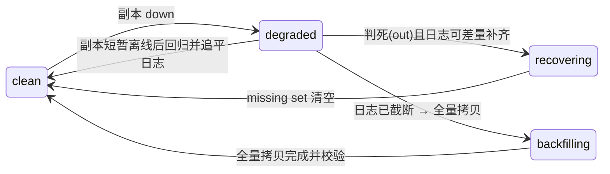

---
tags:
  - 高性能存储
status: 已完成
---

# Recovery 与 Rebuild

> 一块盘坏了、一台机器不再回来，数据并没有丢——只是**份数不够了**。Recovery/Rebuild 就是把这份"欠下的冗余"补回来的过程。它的难点从来不是"再拷一份"，而是两件事：**补冗余的读写与前台业务用的是同一批盘、同一张网**（修得快就打死业务，修得慢就赌第二块盘不坏）；以及**你必须先知道哪份数据坏了**（副本静默腐烂时，冗余只是账面上的）。本篇从"盘坏之后发生了什么"的端到端路径讲起，算清重建的时间账与流量账，最后落到状态机、节流实现与演练指标。

前置：[[7.16 数据放置与 Rebalance]]（数据放在哪，决定了重建从哪读、往哪写）、[[7.1 副本 vs EC]]（冗余形式决定重建成本）、[[7.15 Membership 与故障检测]]（"判定它死了"是重建的触发器）。单机视角的对应物是 [[6.17 Recovery 路径]]——单机 recovery 靠日志回放恢复**自己**，分布式 recovery 靠其他副本恢复**同伴**。

---

## 1. 名词与背景：坏盘不等于丢数据，丢的是冗余度

先给定义【事实】：

- **冗余度（redundancy）**：一份数据能再容忍几次故障。3 副本丢 1 个副本后还剩 2 份——数据还在、还能读写，但再坏 2 个就真丢了。这种"数据可用但份数不足"的状态叫 **degraded（降级）**；
- **Recovery / Rebuild（恢复/重建）**：把 degraded 数据的冗余度补回目标值的过程——从幸存副本读出数据（EC 则是读出 k 个分片重算），写到新位置。两个词在多数语境可混用；细分时 recovery 偏"差量补齐"、rebuild 偏"整盘/整节点全量重造"；
- **故障检测与判死**：重建的前提是系统**判定**某个副本永久失效。而"没响应"可能只是重启、网络抖动（[[7.15 Membership 与故障检测]]），所以生产系统区分两个状态：**down**（暂时联系不上，先不动数据）和 **out**（正式踢出、开始重建）。两者之间隔一个等待窗口。

四个容易混淆的后台任务，先划清边界【事实】：

| 任务 | 触发 | 做什么 | 数据有危险吗 |
| --- | --- | --- | --- |
| Recovery / Rebuild | 副本丢失（盘坏、节点判死） | 补齐冗余度 | 是——处于 degraded 窗口 |
| Rebalance | 扩缩容、放置策略变化 | 把**健康**数据搬到新位置（[[7.16 数据放置与 Rebalance]]） | 否——搬运期间份数不减 |
| Scrub | 定时器 | 校验现存副本是否一致/可读 | 是它**发现**危险的 |
| Repair | scrub 发现不一致 | 用好副本覆盖坏副本 | 修复已发现的损坏 |

为什么这一篇重要【类比】：冗余像备用轮胎。爆一条胎（degraded）车还能开，但此时你**没有备胎了**——第二次爆胎就是事故。Recovery 的全部目标是缩短"没有备胎"的时间窗口；而 scrub 的目标是保证备胎不是瘪的。

---

## 2. 端到端路径：从盘坏到冗余恢复

一次典型的盘/节点故障处理，完整走一遍【实现】：

1. **故障暴露**：本地 IO 返回 `EIO`、SMART 报警、或节点心跳超时。注意盘的死法很多样——整盘消失是最好处理的，更麻烦的是"半死"：个别扇区坏（latent sector error）、延迟劣化到秒级但不报错（衔接 [[7.15 Membership 与故障检测]] 的灰色故障）；
2. **上报与标记 down**：监控/成员管理服务把该副本标为 down。**此刻不动数据**——大量"故障"只是重启或网络抖动，立刻重建会为一次 30 秒的抖动搬几个 TB；
3. **等待窗口（down → out）**：down 状态持续超过阈值才转为 out（Ceph 的 `mon_osd_down_out_interval`，默认 600 秒【实现】）。这是**误判成本与 degraded 窗口的取舍**：窗口长，瞬断不触发无谓重建；窗口短，真故障后冗余更快补齐；
4. **定位受影响数据**：元数据/放置服务算出哪些对象/分片在该盘上有副本（放置是确定性函数时——如 CRUSH——这一步是计算而非扫描，[[7.5 Ceph RADOS 与 CRUSH]]）；
5. **重新放置**：为每个受影响分片选出新的目标位置（仍要满足故障域约束），生成重建任务；
6. **数据拷贝**：副本模式下从任一幸存副本读、往新位置写；EC 模式下读 k 个分片、重算出丢失分片再写（[[7.1 副本 vs EC]]——EC 的重建读放大是它便宜的代价）；
7. **收尾**：校验 checksum、更新元数据（副本组名单升 epoch，防止旧副本复活后接受写，[[7.12 Lease 与 Fencing]]）、状态回到 clean。

短暂离线的节点回来后，**不必全量重建**【实现】：如果副本组维护了操作日志，落后副本只需补齐离线期间缺的那段写（差量恢复，delta recovery）；只有离线太久、日志已截断时才退化为全量拷贝——这条分界线正是 [[7.19 副本落后与日志截断]] 的主题。Ceph 里这两条路分别叫 **log-based recovery** 和 **backfill**。

---

## 3. 重建的时间账：为什么 declustered 放置改变了游戏规则

重建期间数据处于 degraded，**重建时间就是风险敞口**。粗略估算【事实】：

$$
T_{rebuild} \approx \frac{C_{failed}}{B_{effective}}
$$

其中分子是坏盘上的数据量，分母是**全系统能用于重建的有效带宽**。这个分母由重建拓扑决定：

- **传统 RAID（one-to-one）**：整组数据重算后写进**一块**热备盘。分母 = 单盘写带宽。16 TB 盘按 150 MB/s 持续写算，重建要 **约 30 小时**——期间同组再坏一盘（RAID5）就丢数据。盘容量逐年涨、单盘带宽基本不涨，这条路的重建窗口越来越长【事实】；
- **Declustered（many-to-many）**：分布式系统把每块盘的数据切成分片，打散放置（[[7.16 数据放置与 Rebalance]]）。一块盘坏了，它的分片的幸存副本分布在**几十上百块盘**上，重建目标也分散在全集群——几十块盘并行读、几十块盘并行写。分母变成"参与盘数 × 单盘让渡给重建的带宽"，重建时间从小时级压到**分钟到几十分钟级**【事实】。

这笔账的另一面【取舍】：打散提高了并行度，也意味着**每块盘的故障都会波及全集群**——重建流量不再局限于一个 RAID 组，而是全集群的盘和网卡一起承担。这正是下一节"重建伤前台"问题的来源。

风险视角再补一刀【事实】：丢数据需要"重建窗口内故障数超过冗余度"。窗口从 30 小时压到 30 分钟，第二块盘在窗口内坏掉的概率下降约两个数量级——**重建速度本身就是可靠性参数**，不只是性能参数。这也是为什么 3 副本敢用、2 副本危险：2 副本的 degraded 状态是"零冗余裸奔"。

![[图片/SVG/8_7_17_1.svg|900]]

---

## 4. 重建 vs 前台：可靠性与性能的正面冲突

重建是"内部大客户"：顺序大块读 + 大块写 + 跨节点流量，与前台业务争三种资源【事实】：

- **盘带宽/IOPS**：重建的顺序大 IO 会加长盘队列，前台小 IO 的排队延迟直接抬升（p99 先崩，均值后崩，[[9.5 p99 毛刺定位]]）；
- **网络**：重建流量 = 搬运的数据量 × 副本数，checkpoint 类突发写叠加重建流量时最容易把出口带宽打满；
- **CPU**：EC 重建要跑纠删码重算，副本重建要算 checksum。

节流手段从粗到细【实现】：

1. **静态限速**：给重建一个固定带宽配额（如每盘 50 MB/s）。简单，但配额定小了重建太慢、定大了高峰期伤前台——静态值无法同时适配白天和凌晨；
2. **并发度限制**：限制每块盘/每个节点同时进行的重建任务数（Ceph 的 `osd_max_backfills`、`osd_recovery_max_active`【实现】）。控制的是队列深度而非字节数，对尾延迟更直接；
3. **优先级调度**：同样是恢复任务也分轻重——**冗余度掉到只剩 1 份的分片优先于掉 1 份的分片**；被前台读写命中的 degraded 对象插队优先修（Ceph 会把客户端正在访问的对象提到恢复队列前面【实现】），因为客户端正卡在它上面等；
4. **动态反馈**：监测前台延迟，超过阈值就压缩重建配额，空闲时段放开——把重建做成"可被背压的内部客户"，机制上与 [[7.18 Backpressure 与过载保护]] 同源，单机版对应 [[6.16 Rate Limiter 与后台任务隔离]]。

取舍要点【取舍】：重建限速的下限不是 0——**无限让路给前台等于把 degraded 窗口拉到无限长**。生产系统通常保底一个最低重建速率，宁可前台 p99 略差，也不接受"重建永远修不完"。

---

## 5. Scrub：冗余只有在被校验时才是真的

一个反直觉的事实【事实】：**副本坏了可以不报错**。盘的介质错误（latent sector error）只有在**读到那个扇区时**才暴露；bit rot（介质电荷衰减、固件 bug 写错位置）更是静默的。假设副本 A 三个月前就悄悄坏了一个扇区，系统毫不知情——账面 3 副本，实际 2 副本。等到副本 B 所在盘整盘故障、重建去读 A 时才发现读不出来，就凑不齐数据了。

所以需要 **scrub（磨洗/巡检）**：后台周期性主动校验【实现】：

- **light scrub**：只比对副本间的元数据（对象大小、修改时间、checksum 记录），代价小，频率高（如每天）；
- **deep scrub**：把数据全量读出来算 checksum、跨副本比对，能抓 bit rot，代价是真实读带宽，频率低（如每周~每月）。

scrub 发现不一致后触发 **repair**：用多数一致或 checksum 正确的副本覆盖坏副本。注意"多数投票"不总是够——2 个副本各执一词时必须靠端到端 checksum 仲裁（[[6.4 Torn Write 与 Checksum]] 的分布式延伸）【实现】。

scrub 同样要节流【取舍】：deep scrub 是全量读，等价于一次慢速全盘重建的读压力。排进业务低谷、限并发，与 recovery 共享同一套后台任务预算。

---

## 6. 状态机与关键数据结构

以"分片副本组"（Ceph 的 PG、其他系统的 shard/partition）为单位看状态迁移【实现】：



支撑这个状态机的最小数据结构集【实现】：

- **副本组成员名单 + epoch**：当前哪些节点持有副本、名单第几版。每次成员变化 epoch +1，旧 epoch 的写被拒绝——防止被判死的副本"诈尸"后污染数据（[[7.12 Lease 与 Fencing]]、[[7.14 Split Brain]]）；
- **操作日志（per-shard log）**：最近 N 条写操作的记录，用于差量恢复时对账"你缺哪几条"；
- **missing set**：恢复期间，主副本为每个落后副本维护"它缺哪些对象"的集合；前台写命中 missing 对象时，该对象被提升优先级先修（这就是第 4 节的插队机制的数据结构基础）；
- **恢复任务队列**：带优先级（剩余冗余度、是否被前台等待）与节流配额的队列——下一节用 C++ 把它写出来。

---

## 7. RTO / RPO 与演练指标

两个术语给清定义【事实】：

- **RPO（Recovery Point Objective）**：最多容忍丢**多长时间的数据**。同步复制（写多数派确认才返回，[[7.11 Primary-Backup 与 Multi-Raft]]）的 RPO = 0；异步跨机房复制的 RPO = 复制落后量；
- **RTO（Recovery Time Objective）**：故障后多快恢复**服务**。注意 RTO 说的是服务可用，不是冗余补齐——切主几秒完成、重建几小时完成，两者是不同的钟。

演练（把 [[9.6 故障注入矩阵]] 落到 recovery 场景）应当产出的硬指标【实践】：

| 指标 | 怎么测 | 合格线怎么定 |
| --- | --- | --- |
| 判死延迟 | 拔盘/杀节点 → 标记 out 的耗时 | ≈ 等待窗口 + 检测周期，实测校准 |
| 重建速率 | degraded 数据量 ÷ 恢复耗时 | 换算成"16 TB 节点多久修完" |
| degraded 窗口 | 故障注入 → 冗余回满的墙钟时间 | 直接对应第二故障风险敞口 |
| 前台劣化幅度 | 重建期间 p99 vs 平时 p99 | 对照 [[9.7 SLO 与性能回归]] 的预算 |
| 第二故障演练 | 重建进行中再杀一个副本 | 系统应升级优先级而不是丢数据 |

---

## 8. Modern C++：带优先级与节流的恢复调度器

把第 4、6 节的机制落成代码骨架：恢复任务按"剩余冗余度 + 是否被前台等待"排序，出队受令牌桶节流——**限速值可被外部动态调整**（第 4 节的动态反馈就是调 `set_rate`）：

```cpp
#include <chrono>
#include <cstdint>
#include <mutex>
#include <optional>
#include <queue>
#include <vector>

struct RecoveryTask {
    std::uint64_t shard_id;
    std::uint32_t replicas_left;   // 剩余冗余度：越小越危险
    bool          client_waiting;  // 前台读写正卡在这个对象上
    std::uint64_t bytes;

    // 优先级：先比"是否有客户端在等"，再比剩余冗余度
    friend bool operator<(const RecoveryTask& a, const RecoveryTask& b) {
        if (a.client_waiting != b.client_waiting) return a.client_waiting < b.client_waiting;
        return a.replicas_left > b.replicas_left;  // priority_queue 取"最大"，故反向
    }
};

class RecoveryScheduler {
public:
    explicit RecoveryScheduler(double bytes_per_sec)
        : rate_{bytes_per_sec}, last_refill_{Clock::now()} {}

    void submit(RecoveryTask t) {
        std::lock_guard lk{mu_};
        queue_.push(t);
    }

    // 动态反馈入口：前台 p99 超标时调小，空闲时调大
    void set_rate(double bytes_per_sec) {
        std::lock_guard lk{mu_};
        rate_ = bytes_per_sec;
    }

    // 令牌不足或队列为空返回 nullopt —— 调用方稍后再来，不忙等
    std::optional<RecoveryTask> try_dequeue() {
        std::lock_guard lk{mu_};
        refill();
        if (queue_.empty() || tokens_ < static_cast<double>(queue_.top().bytes))
            return std::nullopt;
        RecoveryTask t = queue_.top();
        queue_.pop();
        tokens_ -= static_cast<double>(t.bytes);
        return t;
    }

private:
    using Clock = std::chrono::steady_clock;

    void refill() {
        const auto now = Clock::now();
        const std::chrono::duration<double> dt = now - last_refill_;
        tokens_ = std::min(tokens_ + rate_ * dt.count(), rate_);  // 桶容量 = 1 秒配额
        last_refill_ = now;
    }

    std::mutex mu_;
    std::priority_queue<RecoveryTask> queue_;
    double rate_;
    double tokens_{0.0};
    Clock::time_point last_refill_;
};
```

要点【实践】：令牌桶容量取 1 秒配额，允许短突发但压住持续速率；`client_waiting` 的插队对应第 6 节的 missing set 命中；真实实现里每块盘一个调度器实例，避免全局锁成为热点。

---

## 9. 排障清单：症状 → 原因 → 检查

| 症状 | 常见原因 | 检查动作 |
| --- | --- | --- |
| 节点重启一次就触发大规模数据搬运 | down→out 等待窗口太短，或运维直接标 out | 核对等待窗口配置；计划内维护先设 noout 类标志 |
| 重建期间前台 p99 飙升 | 重建并发/带宽配额过大，盘队列被大 IO 灌满 | 逐盘看队列深度与 await；下调重建并发，确认优先级调度生效 |
| degraded 持续几天修不完 | 节流配额过小、或恢复任务饿死在低优先级 | 算"配额 × 时间"能否覆盖 degraded 数据量；检查最低速率保底 |
| 重建时读出 EIO / checksum 不匹配 | 幸存副本早已静默损坏，scrub 缺位 | 查 deep scrub 上次完成时间；立刻对同批盘发起 scrub |
| 账面副本齐但读到旧数据 | 判死副本复活后未被 fence，接受了读/写 | 核对 epoch 校验路径（[[7.12 Lease 与 Fencing]]） |
| 扩容后误以为在"重建" | rebalance 与 recovery 混淆，报警口径不分 | 区分两种任务的指标与队列；rebalance 期间冗余度并未下降 |
| EC 池重建比副本池慢很多、CPU 高 | EC 重建需读 k 分片 + 重算，读放大与计算是本征成本 | 确认是预期行为（[[7.1 副本 vs EC]]）；必要时调大 EC 重建并发 |

---

## 10. 陷阱与误区

> [!warning] 常见错误
> 1. **一失联就重建**：网络抖动 30 秒，触发几 TB 的搬运，搬到一半节点回来了——白搬，还挤占了前台。down 与 out 必须分离，中间隔等待窗口。
> 2. **重建不限速**："尽快恢复冗余"听起来正确，但把盘和网打满后，前台超时→客户端重试→负载翻倍，可能先于第二块盘故障把系统压垮（[[7.18 Backpressure 与过载保护]]）。
> 3. **重建无限让路**：反过来，前台一抖就暂停重建，degraded 窗口被拉长到以天计——是在拿数据可靠性换性能。必须有最低速率保底。
> 4. **没有 deep scrub**：不主动校验，冗余就是账面数字。最危险的暴露时机恰恰是重建时——那一刻你只剩最后一份，而它可能早就坏了。
> 5. **用单盘带宽估算集群重建时间**：declustered 放置下重建是全集群并行的，瓶颈通常在配额或最慢参与者，直接套 RAID 的算法会差一个数量级。
> 6. **RTO 和"冗余补齐时间"混为一谈**：切主完成、服务恢复 ≠ 冗余恢复。汇报"5 分钟恢复"时要说清是哪个钟。

---

## 11. 关键结论

| 结论 | 性质 |
| --- | --- |
| 故障后数据进入 degraded：可用但冗余不足；recovery 的目标是缩短这个风险窗口 | 事实 |
| down（疑似死）与 out（判死开始重建）必须分离，等待窗口是误判成本与风险窗口的取舍 | 取舍 |
| 重建时间 ≈ 坏盘数据量 ÷ 全系统有效重建带宽；declustered 放置把分母从单盘变为全集群，重建从小时级到分钟级 | 事实 |
| 重建速度是可靠性参数：窗口缩短两个数量级，重建期二次故障丢数据的概率同步下降 | 事实 |
| 重建与前台争盘/网/CPU；节流手段依次为静态限速、并发度限制、优先级调度、动态反馈，且要有最低速率保底 | 实现 / 取舍 |
| 短暂离线走日志差量恢复，日志被截断才全量 backfill——分界线由日志保留窗口决定（[[7.19 副本落后与日志截断]]） | 实现 |
| 冗余必须被 scrub 周期性验证，否则是账面冗余；deep scrub 抓 bit rot，代价是全量读 | 事实 / 取舍 |
| RPO 由复制同步性决定，RTO 由切换速度决定，冗余补齐时间是第三个独立的钟 | 事实 |

---

## 关联知识

- [[7.16 数据放置与 Rebalance]] - 放置决定重建拓扑；rebalance 与 recovery 的边界
- [[7.1 副本 vs EC]] - EC 重建的读放大与计算成本
- [[7.15 Membership 与故障检测]] - 判死的输入；灰色故障为什么难
- [[7.12 Lease 与 Fencing]] - epoch 防"诈尸"副本污染数据
- [[7.19 副本落后与日志截断]] - 差量恢复 vs 全量 backfill 的分界线
- [[7.18 Backpressure 与过载保护]] - 重建作为"内部客户"被背压
- [[6.16 Rate Limiter 与后台任务隔离]] - 单机版的后台任务节流
- [[6.17 Recovery 路径]] - 单机崩溃恢复（日志回放）的对照
- [[6.4 Torn Write 与 Checksum]] - repair 仲裁依赖的端到端校验
- [[9.6 故障注入矩阵]] / [[9.7 SLO 与性能回归]] - 演练与劣化预算

## 参考

- Ceph 文档：*Placement Groups*、*Repairing PG inconsistencies*、recovery/backfill 相关配置（`mon_osd_down_out_interval`、`osd_max_backfills`）
- Holland, Gibson. *Parity Declustering for Continuous Operation in Redundant Disk Arrays*, ASPLOS 1992（declustered 重建的源头）
- Ghemawat et al. *The Google File System*, SOSP 2003（re-replication 优先级：按剩余冗余度排序）
- Bairavasundaram et al. *An Analysis of Latent Sector Errors in Disk Drives*, SIGMETRICS 2007（scrub 存在的实证依据）
- Patterson, Gibson, Katz. *A Case for Redundant Arrays of Inexpensive Disks (RAID)*, SIGMOD 1988
