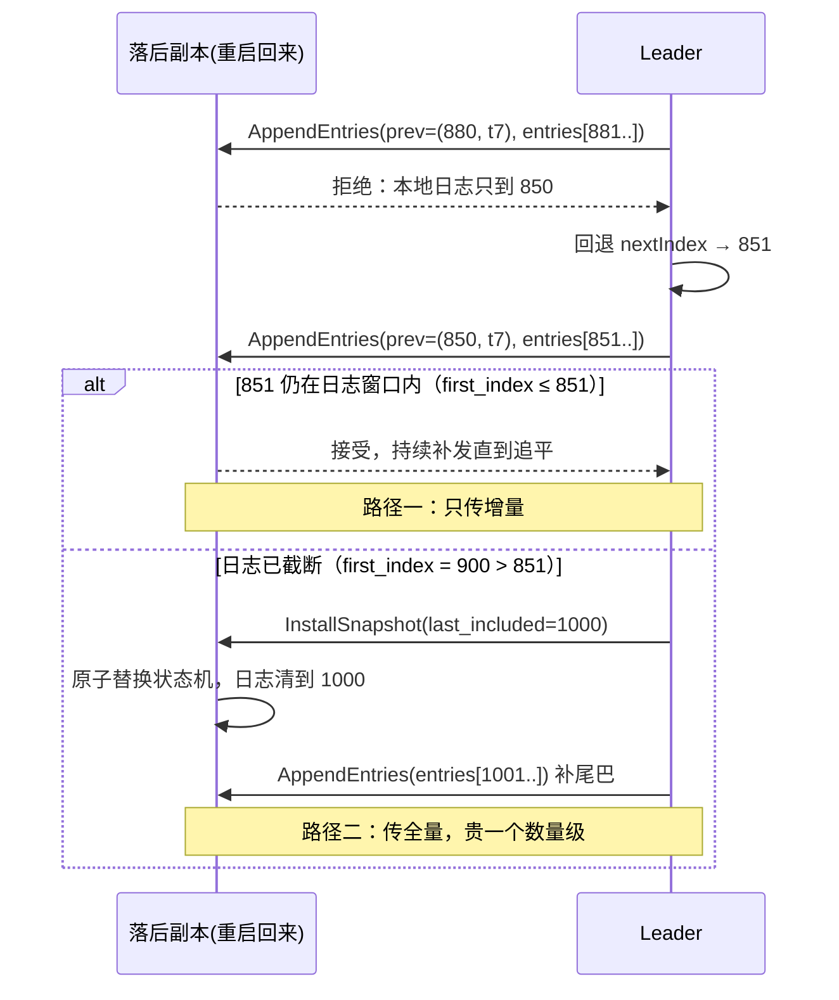
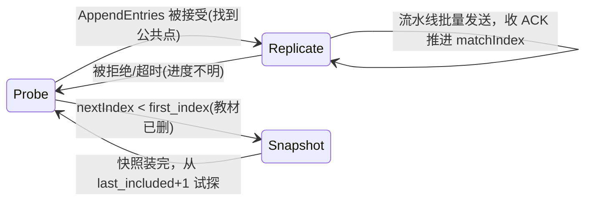

---
tags:
  - 高性能存储/分布式存储
status: 已完成
---

# 副本落后与日志截断

> 复制状态机把"复制数据"归约成"复制日志"（[[7.11 Primary-Backup 与 Multi-Raft]]），但日志只能追加、不能无限长——盘会满，重启回放会越来越慢。于是必须**截断（truncate/compact）**：把日志前缀删掉，用一份**快照（snapshot）**代表"到某个位置为止的全部状态"。麻烦在于，日志前缀同时还是**落后副本的教材**：一个慢了/重启了的副本要靠它补课。删早了，落后者只能整份快照重传（贵一个数量级）；删晚了，盘被日志吃光。这篇讲清三件事：副本为什么落后、怎么追；日志何时能安全删；以及"追赶速度 vs 写入速度"的收敛条件——它决定一个落后副本到底追不追得上。

前置：[[7.11 Primary-Backup 与 Multi-Raft]]（复制日志、commit index、matchIndex 的来源）、[[6.15 Snapshot 与 Sequence Number]]（单机引擎怎么打快照）。姊妹篇：[[7.17 Recovery 与 Rebuild]]（那篇讲"副本没了怎么重造"，本篇讲"副本还在但落后了怎么追"）。

---

## 1. 名词与背景：日志上的几根游标

先把一条复制日志上的关键位置定义清楚【事实】（下图会把它们画在一根轴上）：

- **last index**：日志最新一条的编号（leader 每接受一个写就 +1）；
- **commit index**：已被多数派持久化、承诺不丢的位置（[[7.11 Primary-Backup 与 Multi-Raft]]）；
- **applied index**：本副本已把日志条目执行到状态机的位置（applied ≤ commit）；
- **matchIndex[i]**：leader 视角下，副本 i 已确认持久化到的位置——**每个副本一根游标**；
- **first index / snapshot index**：日志物理上还保留的最老位置；它之前的历史已被快照吸收、日志已删除。

**落后（lag）**就是 `last index − matchIndex[i]` 拉大【事实】。落后的常见原因：

- **慢**：副本所在盘抖动（compaction 抢 IO，[[6.14 Write Stall]]）、网络重传、进程 GC/夯住——副本活着，只是消化不动；
- **断**：副本重启、网络分区几分钟——回来后中间缺了一段；
- **新**：扩容新副本、或 [[7.17 Recovery 与 Rebuild]] 造出的新副本——从零开始，缺全部历史。

关键洞察【事实】：这三种情况本质相同——**副本缺日志的一段后缀**，区别只是缺多少。而"缺多少"对上了"日志还留着多少"，就分出了两条完全不同的追赶路径。

---

## 2. 两条追赶路径：补日志 vs 装快照

**路径一：日志追赶（log catch-up）**【实现】。leader 为每个副本维护 `nextIndex`（下一条要发的位置），从那里起持续补发。Raft 里就是普通的 `AppendEntries`，附带一致性检查：每次携带前一条的 `(index, term)`，副本对不上就拒绝，leader 回退 `nextIndex` 重试，直到找到两边日志的最后一个公共点——**公共点之后副本上的日志会被覆盖删除**（那是旧任期未提交的分叉，详见第 5 节）。

**路径二：快照安装（snapshot install）**【实现】。当副本需要的起点早于 `first index`——教材已经删了——leader 只能发整份快照（Raft 的 `InstallSnapshot` RPC）：副本收下快照、替换整个状态机，再从快照点之后走路径一补尾巴。

两条路的成本差一个数量级【事实】：补日志只传"缺的那段增量"，快照要传**全量状态**（一个分片几个 GB 很常见），还要 leader 侧生成快照、副本侧原子替换状态机。所以系统的努力方向永远是：**让落后副本尽量走路径一**。

快照本身怎么打【实现】：不能停写等快照（分片几个 GB，停秒级不可接受）。生产做法是**写时复制（COW）**：LSM 引擎里对不可变 SST 文件建硬链接即成快照（RocksDB checkpoint，[[6.15 Snapshot 与 Sequence Number]]、[[6.11 MemTable Immutable 与 SST 生命周期]]），只有 memtable 部分需要短暂冻结；快照点记录 `(last_included_index, last_included_term)`，之后的写照常追加。



---

## 3. 截断的安全条件：哪些日志可以删

日志截断的删除对象是**前缀** `[first_index, T]`。T 能推进到哪里，由三个约束共同决定【事实】：

1. **快照约束（正确性硬底线）**：`T ≤ 本地快照的 last_included_index`。快照之前的历史已被快照吸收，删了不丢信息；没被快照覆盖的部分**绝对不能删**——本副本重启后要靠"快照 + 剩余日志回放"重建状态（[[6.17 Recovery 路径]] 的分布式版），删了就再也回放不出来；
2. **同伴约束（性能软约束）**：`T ≤ min(matchIndex[])` 时，所有副本都已拿到被删的部分，没人需要走快照。越过这条线截断**不违反正确性**（Raft 的答案就是"落后者装快照"），但每越一次，就把某个副本从便宜的路径一踢到昂贵的路径二；
3. **保留窗口（运维余量）**：即使前两条都允许，也保留"最近 N 条 / 最近 X 分钟"的日志——为重启窗口、瞬时抖动留缓冲，让常见的短暂离线都能走路径一。

于是安全截断点的工程公式是【实现】：

$$
T = \min\bigl(snap_{last},\ \min_{i}(match_i)\bigr) - margin
$$

再加一条保护：当某副本死透了（已被判 out，[[7.17 Recovery 与 Rebuild]]），要把它从 `min(matchIndex)` 里**剔除**——否则一个永远不回来的副本会把 `min` 永远钉在原地，日志无限增长，最后盘满，把一个节点的故障升级成全组故障【陷阱，见第 8 节】。这本质是给"同伴约束"加了超时：**等你，但只等一段时间**。

![[图片/SVG/8_7_19_1.svg|900]]

---

## 4. 收敛条件：落后副本追不追得上是个算术题

追赶是一场移动靶射击：副本在补历史，leader 还在接新写。设追赶吞吐为 R_catchup（受限于网卡、盘、以及 [[7.18 Backpressure 与过载保护]] 给追赶流量的配额），新写速率为 R_append，则追平需要满足【事实】：

$$
R_{catchup} > R_{append}
$$

且追平时间为：

$$
T_{converge} = \frac{lag_{bytes}}{R_{catchup} - R_{append}}
$$

这个不等式解释了两种生产灾难【实践】：

- **永远追不上**：写入高峰期 R_append 逼近集群能力，R_catchup 分不到带宽，lag 只增不减。唯一解是**给追赶流量保底配额**（与 [[7.17 Recovery 与 Rebuild]] 第 4 节"重建保底速率"同一逻辑），或对前台写限流；
- **快照循环（snapshot loop）**：更隐蔽的一种。快照传输要时间 `snapshot_bytes / R_transfer`；如果这段时间内 leader 新产生的日志**又超出了保留窗口**，副本装完快照发现尾巴又缺了，只好再要一份新快照——无限循环。收敛条件：**快照传输期间产生的新日志必须落在保留窗口内**，即 `snapshot_bytes / R_transfer × R_append < 窗口长度`。解法：加大保留窗口、限制并发快照数（多个副本同时要快照会互相挤占 R_transfer）、或发快照期间对该分片的写限流。

lag 的三种度量口径【实践】：

| 口径 | 定义 | 适用 | 缺陷 |
| --- | --- | --- | --- |
| entries lag | last − matchIndex | 协议内部推进 nextIndex | 每条大小悬殊，不反映追赶成本 |
| bytes lag | 缺失日志的字节数 | 估算追赶时间（上面的公式） | 需要额外记账 |
| time lag | 副本最新条目的时间差 | **告警与 SLO 首选**：直接对应"读它会读到多旧"与 RPO | 写入停止时会虚高，需与前两者互证 |

---

## 5. 截断的另一面：删自己的错误后缀

前面说的截断都是删**前缀**（老历史）。复制日志还有一种截断是删**后缀**——两者方向相反、原因完全不同，实现里常共用"truncate"一词，必须分清【事实】：

- **前缀截断（compact）**：删"所有人都不再需要的老历史"，为省盘。安全性看第 3 节；
- **后缀截断（conflict truncate）**：follower 发现自己日志尾部与 leader 冲突（同 index 不同 term）——那是旧任期 leader 写了但**未提交**就倒台留下的分叉。follower 必须删掉冲突点之后的全部本地日志，改用新 leader 的版本。Raft 的选举限制保证被删的一定未提交，删是安全的【事实】。

危险的实现细节【实现】：后缀截断 + 紧接着追加新条目，若两步之间崩溃，重启后日志可能出现"删了旧的、新的没写全"的中间态——日志存储层必须把"截断点 + 新条目"做成原子（WAL 记录截断意图再执行，[[6.1 WAL 与 Crash Consistency]] 与 [[6.18 WAL 回放幂等性]] 的技术在这里复用）。

**截断过早的灾难案例**【实践】：

- **保留策略只看时间/空间，不看副本进度**：Kafka 按 `retention.ms` 独立删老 segment；落后的消费者或 follower 若慢过保留期，需要的数据已物理消失——follower 只能全量重拉，消费者直接 `OffsetOutOfRange`（数据对它而言等于丢了）。Kafka 的 ISR 机制（落后超 `replica.lag.time.max.ms`，默认 30 s，即被踢出同步集合【实现】）正是把"慢副本"显式驱逐，避免它拖住提交，同时把风险摆上台面：ISR 收缩到 1 时，唯一副本再挂就丢数据；
- **实现 bug 把快照未覆盖的日志删了**：本副本重启后回放不出状态，只能作为"全丢副本"走 [[7.17 Recovery 与 Rebuild]] 的全量重建——一次逻辑 bug 把差量问题升级成全量问题；
- **手动清日志救盘**：盘快满时运维直接删日志文件——等价于上一条 bug 的人肉版本。正确动作是触发快照 + compact，让截断点跟着快照走。

---

## 6. Leader 侧的数据结构：每个副本一台小状态机

Leader 对每个 follower 的复制进度管理，TiKV/etcd 的实现抽象成三态（`Progress` 状态机）【实现】：



- **Probe（试探）**：不确定对方日志到哪，一次只发一小批，等确认后再加速——避免向一个日志对不上的副本猛灌数据；
- **Replicate（复制）**：正常态，流水线批量发送，在途窗口限流（[[7.11 Primary-Backup 与 Multi-Raft]] 第 7 节的 `FollowerProgress` 就是这个状态的骨架）；
- **Snapshot（装快照）**：发出快照后暂停日志发送，等安装完成回到 Probe。

把第 3 节的截断决策接上，落成 Modern C++ 骨架：

```cpp
#include <algorithm>
#include <cstdint>
#include <optional>
#include <vector>

struct PeerProgress {
    std::uint64_t match_index;
    bool voting;        // 仍是有效成员（已判死的不参与 min 计算）
    bool installing_snapshot;
};

class LogCompactor {
public:
    LogCompactor(std::uint64_t retain_margin) : retain_margin_{retain_margin} {}

    // 返回可安全删除的前缀上界；nullopt 表示当前不该截断
    std::optional<std::uint64_t>
    safe_truncate_point(std::uint64_t snapshot_last_included,
                        const std::vector<PeerProgress>& peers) const {
        // 约束 1（硬）：不越过快照覆盖点
        std::uint64_t bound = snapshot_last_included;

        // 约束 2（软）：尽量不把活着的同伴踢进快照路径
        for (const PeerProgress& p : peers) {
            if (!p.voting || p.installing_snapshot) continue;  // 判死/已在装快照的不拖后腿
            bound = std::min(bound, p.match_index);
        }

        // 约束 3：保留窗口，给重启/抖动留缓冲
        if (bound <= retain_margin_) return std::nullopt;
        return bound - retain_margin_;
    }

private:
    const std::uint64_t retain_margin_;
};
```

要点【实践】：`voting=false` 的剔除逻辑必须与成员管理（[[7.15 Membership 与故障检测]]）联动——"判死"这个事件要同时通知重建（去造新副本）和截断（别再等它）。两边只做一边，就会出现"日志无限涨"或"新副本永远差量恢复不了"的半吊子状态。

---

## 7. 运维视角：lag 告警与处置动作

| 观测 | 含义 | 处置 |
| --- | --- | --- |
| time lag 持续增长、bytes lag 同步增长 | 追赶速率 < 写入速率，不收敛 | 给追赶流量提配额或对前台限流；确认慢因（盘/网/CPU） |
| 某副本反复进入 Snapshot 状态 | 快照循环：保留窗口 < 快照传输期产生的日志 | 加大保留窗口；限并发快照；临时对该分片写限流 |
| 日志盘占用持续上涨 | 截断被钉住：某成员 matchIndex 不动且未被剔除 | 查该副本死活；确认判死流程触发、min 计算已剔除它 |
| lag 告警但写入也为零 | time lag 在无写入时虚高 | 用 entries/bytes lag 互证，修告警口径 |
| 副本追平瞬间前台 p99 抖动 | 追赶流量收尾时的突发 apply/compaction | 追赶 apply 也纳入后台限速（[[6.16 Rate Limiter 与后台任务隔离]]） |
| ISR/健康副本数收缩告警 | 慢副本被驱逐，写入容错余量下降 | 这是风险前移的正常信号：优先修慢副本，而不是调大驱逐阈值掩盖 |

---

## 8. 陷阱与误区

> [!warning] 常见错误
> 1. **按时间/空间截断，不看副本与消费者进度**：保留策略与进度脱钩，慢者需要的数据被物理删除——轻则全量重传，重则（无副本可补时）数据丢失。
> 2. **min(matchIndex) 不剔除死副本**：一个永不回来的成员把截断点永远钉住，日志吃满盘，单副本故障升级为全组不可写。等待必须有超时。
> 3. **保留窗口拍脑袋设小**：窗口小于常见重启时长（滚动升级一轮、内核升级重启），每次例行运维都触发全量快照——把最常见的运维动作变成最贵的路径。
> 4. **快照期间停写**：全量快照秒级~分钟级，停写不可接受。必须 COW/硬链接式快照（[[6.15 Snapshot 与 Sequence Number]]），只冻结内存部分。
> 5. **前缀 compact 与后缀 conflict truncate 混为一谈**：一个删老历史为省盘、一个删未提交分叉保一致，安全条件完全不同；实现共用代码路径时要分别测试崩溃点（[[6.10 崩溃注入测试]]）。
> 6. **落后副本继续服务读**：它的状态是旧的，直接读违反线性一致（[[7.9 一致性模型]]）。要么读走 leader/带 lease（[[7.12 Lease 与 Fencing]]），要么明确声明这是弱一致读。
> 7. **只监控 entries lag**：条目大小悬殊时严重失真；告警用 time lag、容量规划用 bytes lag、协议调试才看 entries。

---

## 9. 关键结论

| 结论 | 性质 |
| --- | --- |
| 日志前缀有两个身份：本副本重启的回放来源 + 落后同伴的追赶教材；截断同时动这两件事 | 事实 |
| 追赶两条路：日志补差量（便宜）与快照装全量（贵一个数量级）；分界线 = 日志保留窗口 | 事实 |
| 安全截断点 = min(快照覆盖点, 活跃同伴最小 matchIndex) − 保留余量；死副本必须从 min 中剔除 | 实现 |
| 越过同伴约束截断不违反正确性（Raft 用快照兜底），代价是把同伴踢进昂贵路径——这是性能取舍不是正确性问题 | 取舍 |
| 追赶收敛条件：追赶速率 > 写入速率；快照循环的根因是"传快照期间新日志又超出保留窗口" | 事实 |
| 后缀截断删的是旧任期未提交分叉，与前缀 compact 安全条件完全不同；截断+追加必须原子 | 事实 / 实现 |
| Kafka ISR 用"落后超时即驱逐"把慢副本问题显式化：不拖提交，但容错余量收缩要被监控 | 实现 / 取舍 |
| lag 三口径各司其职：time 告警、bytes 算收敛、entries 调协议 | 实践结论 |

---

## 关联知识

- [[7.11 Primary-Backup 与 Multi-Raft]] - 复制日志、commit/matchIndex、在途窗口的来源
- [[7.17 Recovery 与 Rebuild]] - 差量追赶失败后的兜底：当作丢失副本全量重建
- [[7.18 Backpressure 与过载保护]] - 追赶/快照流量的配额与保底
- [[7.15 Membership 与故障检测]] - "判死"事件驱动截断的剔除逻辑
- [[7.9 一致性模型]] / [[7.12 Lease 与 Fencing]] - 落后副本读的正确性约束
- [[6.15 Snapshot 与 Sequence Number]] - COW 快照的单机实现
- [[6.1 WAL 与 Crash Consistency]] / [[6.18 WAL 回放幂等性]] - 截断原子性依赖的日志技术
- [[6.17 Recovery 路径]] - "快照 + 日志回放"的单机原型

## 参考

- Diego Ongaro, John Ousterhout. *In Search of an Understandable Consensus Algorithm (Raft)*, USENIX ATC 2014（§7 Log compaction 与 InstallSnapshot）
- Diego Ongaro. *Consensus: Bridging Theory and Practice*（快照章节：COW、快照循环与传输节流）
- etcd raft / TiKV raftstore 源码：`Progress` 三态（Probe/Replicate/Snapshot）与 compact 触发逻辑
- Kafka 文档：*Replication*（ISR、`replica.lag.time.max.ms`）与 log retention 语义
- RocksDB Wiki: *Checkpoints*（硬链接快照的工程实现）
