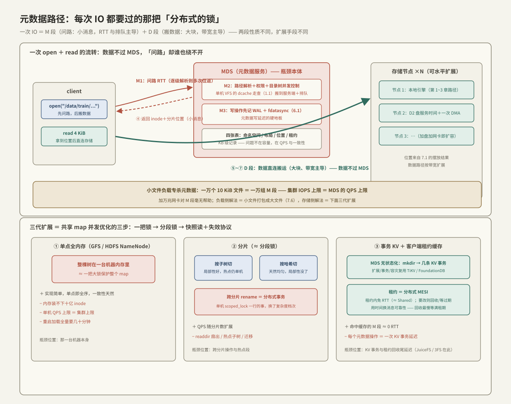

# 元数据路径瓶颈

> [[7.1 副本 vs EC]] 讲完数据本体怎么冗余，留了个尾巴：分片摆在哪台机器、文件由哪些分片组成、目录树长什么样——**这些「关于数据的数据」谁来记**？这就是元数据服务，分布式文件系统的中枢神经。它的吊诡之处在于：元数据体量小（KB 级记录）、不占带宽，却出现在**每一次 IO 的关键路径**上——open 一个文件先问它，读一个块先问它「块在哪」。数据路径可以靠加盘加网卡水平扩展，元数据路径是一棵全局共享、处处一致的树——**分布式系统里最难扩展的恰恰是这种小而热的共享状态**，这对写过多线程程序的人是熟悉的痛：吞吐瓶颈从来不在大块数据搬运上，而在那把所有人都要过的锁上。本篇讲元数据路径的请求流转、等待点在哪、三代扩展方案各自把瓶颈挪到了哪里。

前置：[[1.1 VFS 与系统调用路径]]（单机的路径解析与 dcache——分布式把每一步变成 RTT）、[[7.1 副本 vs EC]]（数据本体的另一半故事）、[[10.1 数据面与控制面分工]]（本篇是「控制面进了数据关键路径」的典型样本）。

---

## 1. 元数据是什么：四张表

任何分布式文件系统的元数据都可归为四类【事实】：

| 表 | 内容 | 访问频率 |
| --- | --- | --- |
| 命名空间 | 目录树：路径 → inode（属主、权限、时间戳） | 每次 open/stat/readdir |
| 文件布局 | inode → 分片/块列表（文件由哪些 chunk 组成） | 每次读写定位 |
| 位置 | 分片 → 存储节点列表（[[7.1 副本 vs EC]] 的摆放结果） | 每次读写定位 |
| 租约/锁 | 谁在写、谁缓存了什么 | open/close/并发写 |

单条记录都是几十字节到 KB 级【量级】——元数据的问题从来不是容量，是 **QPS 与一致性**：亿级文件的树、百万级 ops/s 的查询、且每个客户端看到的必须是同一棵树。

---

## 2. 一次 open+read 的完整流转：等待点对账

以「client 读文件 `/data/train/part-00042` 的前 4 KiB」为例，最朴素的架构（单元数据服务器 MDS + 一组存储节点）：

| 步骤 | 发生什么 | 层级 | 等待点 | 拷贝 |
| --- | --- | --- | --- | --- |
| ① client 发 open | 路径字符串发给 MDS | 网络 | **M1：1 次 RTT 起步**——若协议逐级解析（`/data` → `/data/train` → …），则是**逐组件多次 RTT**【实现】 | 小消息，可忽略 |
| ② MDS 解析路径 | 逐级查目录项、检查权限——单机 VFS 的 dcache 走查（[[1.1 VFS 与系统调用路径]]）搬到了服务端 | MDS 内存 | **M2：服务端排队 + 目录树并发控制**（锁/事务） | 无 |
| ③ MDS 记日志 | 若 open 改状态（租约、atime、创建文件），须先写 WAL 落盘（[[6.1 WAL 与 Crash Consistency]]） | MDS 盘 | **M3：一次 fdatasync**——元数据写操作的延迟下限 | 无 |
| ④ 返回布局 | inode + 分片列表 + 位置返回 client | 网络 | （随 M1 的回程） | 小消息 |
| ⑤ client 直连存储节点 | 按位置对分片发读请求——**数据不过 MDS** | 网络 | D1：数据 RTT | 无 |
| ⑥ 存储节点读盘 | 本地引擎读 4 KiB（第 1~3 章的整套本地路径） | 盘 | D2：盘服务时间 | 盘 DMA 一次 |
| ⑦ 数据回 client | 走网络回来 | 网络 | D3：传输 | 网卡 DMA；若走内核 TCP 栈还有内核↔用户拷贝（[[4.1 RDMA 为什么快]]） |

三个读账要点【事实】：

1. **元数据段与数据段的性质完全不同**：M1~M3 是**小消息，延迟由 RTT 次数与服务端排队决定，与带宽无关**；D1~D3 是大块搬运，带宽主导。加万兆网卡对 M 段毫无帮助；
2. **控制面进了关键路径**：⑤~⑦ 再快，也要等 ①~④ 先完成——4 KiB 小读的端到端延迟里，元数据往返可以占到一半以上【量级】；文件越小、打开越频繁，M 段占比越高；
3. **正确的架构把 MDS 从数据流里彻底摘出去**（client 直连存储节点）——只把「问路」留给它。问路本身成为瓶颈，就是本篇标题【事实】。

---

## 3. 为什么小文件负载专杀元数据

AI 训练是重灾区，账很好算【量级/实践】：

- 读一个 100 MiB 大文件：1 组 M 段 + 25,600 个 4 KiB 的数据量——元数据操作占比 ≈ 0；
- 读一万个 10 KiB 小文件（图片/样本）：**一万组 M 段** + 一万次小读——元数据操作占比 ≈ 50%，MDS 的 QPS 上限直接变成整个集群的 IOPS 上限；
- 再叠加 `ls -R`/遍历目录（epoch 开始时枚举数据集）：readdir 是元数据独享的重负载，大目录一次枚举几十万条记录。

这就是「**数据路径按带宽扩展，元数据路径按 QPS 撞墙**」的机械原因【事实】。缓解在两端：存储侧扩展 MDS（§4）；负载侧把小文件打包成大文件顺序读（训练数据格式如 tar/recordio 的存在理由，展开见 [[7.6 AI 存储 vs 传统 NAS]]）。

---

## 4. 三代扩展方案：瓶颈的三次搬家

### 4.1 第一代：单点全内存

GFS/HDFS NameNode 路线【事实】：整棵树放单机内存，所有操作过它。优点是实现简单、一致性天然（单点即全序）；三个硬顶【事实】：内存装不下十亿级 inode、单机 QPS 有上限、重启加载全量元数据要几十分钟。这是「一把大锁保护整个 map」的分布式版——正确，但不可扩展。

### 4.2 第二代：分片（sharding）

把树切开，多台 MDS 各管一段。两种切法，正是哈希表分段锁的两种策略【事实/取舍】：

| 切法 | 做法 | 好处 | 坏处 |
| --- | --- | --- | --- |
| **按子树** | `/a` 归 MDS1、`/b` 归 MDS2（CephFS 动态子树【实现】） | 局部性好：一个目录下的操作全在一台，readdir/路径解析不跨机 | 热点子树还是单机扛；需要动态迁移 |
| **按哈希** | hash(inode/路径) 决定归属 | 负载天然均匀 | 局部性没了：readdir 扇出到所有分片；**跨分片操作变成分布式事务** |

跨分片 rename 是经典难题【事实】：`rename(/a/x, /b/y)` 涉及两台 MDS 的原子修改——等价于 C++ 里「同时锁两把锁并保证要么都改要么都不改」，单机 `std::scoped_lock` 一行解决的事，分布式要两阶段提交或事务性 KV 兜底，延迟和失败模式都换了档次。

### 4.3 第三代：元数据下沉到事务性 KV + 客户端缓存

现代路线把两件事分开【事实/实现】：

- **持久化与事务交给专业的分布式事务 KV**（TiKV/FoundationDB 一类），MDS 变成无状态翻译层——把「mkdir」翻译成几条 KV 事务。扩展性、事务、容灾全部复用 KV 的成熟实现；代价是每个元数据操作变成一次 KV 事务的延迟【取舍】。[[7.3 JuiceFS 架构]] 与 [[7.4 3FS 架构]] 都是这条路线，是下两篇的主角；
- **客户端缓存 + 租约（lease）压掉重复问路**：client 缓存 dentry/inode/布局，MDS 发放带超时的租约保证缓存一致——**这是分布式版的缓存一致性协议**，与 CPU 缓存行的 MESI 同一题型【事实】：租约有效期内 client 免 RTT 直接用（≈ Shared 态）；有人要改，MDS 回收租约或等它过期（≈ Invalidate）；租约到期靠**时间**而不是消息保证安全——用「等待一个时钟周期」换「不必可靠送达失效消息」，代价是回收最慢要等满租期【取舍】。

C++ 对照收束【事实】：三代方案就是共享 map 并发优化的三步——全局一把锁 → 分段锁 → RCU/快照读加失效协议。每一步都没有消灭共享，只是把「必须串行化的点」切小、推远、缓存化；rename 这类跨段原子操作永远是最贵的，无论在哪一层。

---

## 5. 排障清单：症状 → 判定 → 处置

| 症状 | 先看什么 | 典型根因 | 处置方向 |
| --- | --- | --- | --- |
| 小文件读写慢，大文件吞吐正常 | 客户端统计里 open/stat 延迟 vs read 延迟 | M 段占比过高——元数据 RTT 主导 | 客户端缓存/租约是否生效；小文件打包；检查 MDS 排队 |
| 集群加了存储节点，IOPS 不涨 | MDS QPS 与 CPU；单 MDS 还是分片 | 元数据单点撞墙（§4.1） | 分片扩展；把只读负载引向缓存 |
| ls/遍历大目录极慢甚至超时 | 目录条目数；readdir 是否跨分片扇出 | 大目录 + 哈希分片的扇出税（§4.2） | 目录打散（业务侧）；子树分片；分页枚举 |
| 训练每个 epoch 开头集群抖动 | MDS QPS 时间线与 epoch 对齐 | 枚举数据集的 readdir/stat 风暴 | 样本索引缓存成单文件；错峰预热 |
| rename/原子提交偶发高延迟 | 是否跨分片；事务重试计数 | 跨分片分布式事务 + 冲突重试 | 业务路径设计避免跨热点目录 rename【实践】 |
| 元数据写（create/mkdir）延迟有硬地板 | MDS 的 WAL fdatasync 时延（[[6.1 WAL 与 Crash Consistency]]） | M3：持久化是写操作延迟下限 | 元数据盘用低延迟介质；确认没与数据盘混用【实践】 |

---

## 6. 陷阱与误区

> [!warning] 常见错误
> 1. **用带宽指标评估元数据服务**：M 段是 QPS 与 RTT 的世界，「网络还有余量」不等于「MDS 没瓶颈」——仪表盘要单列 metadata ops/s 与其延迟分布。
> 2. **让数据流过元数据服务器**：MDS 变成带宽瓶颈兼单点故障——数据必须 client 直连存储节点，MDS 只问路。
> 3. **把 POSIX 语义当免费**：逐级路径解析、atime、精确的目录一致性，每一项都是元数据 RTT；对象存储砍掉这些语义换扩展性（[[7.7 对象存储路径]]）——选接口就是选元数据成本。
> 4. **忽视租约回收的尾延迟**：失效要等租期走完，p99 里会出现「莫名」的秒级毛刺——租期长短是「平时免 RTT」与「回收等多久」的取舍，不是越长越好。
> 5. **海量小文件直接怼文件系统**：每文件一条元数据记录，十亿文件把任何 MDS 拖死——打包（tar/recordio）是负载侧的第一解法。
> 6. **元数据库与数据共盘**：M3 的 fdatasync 排在数据大写后面，元数据延迟被数据流量劫持——物理隔离是标配【实践】。

---

## 7. 关键结论

| 结论 | 性质 |
| --- | --- |
| 元数据 = 命名空间/布局/位置/租约四张表；问题不在容量，在 QPS 与一致性 | 事实 |
| 一次 IO = M 段（问路，RTT 与排队主导）+ D 段（搬数据，带宽主导）；两段性质不同，扩展手段不同 | 事实 |
| 数据必须绕开 MDS 直连；「控制面进关键路径」的那一段就是瓶颈本体 | 事实 |
| 小文件负载把集群 IOPS 上限变成 MDS QPS 上限；readdir/枚举是元数据独享重负载 | 事实/量级 |
| 三代扩展 = 共享 map 的三步并发优化：单点全内存（一把锁）→ 分片（分段锁）→ 事务 KV + 客户端租约缓存（RCU/快照 + 失效协议） | 事实 |
| 跨分片 rename = 分布式事务，永远是最贵操作；单机 scoped_lock 一行的事，分布式换了复杂度档次 | 事实 |
| 租约用时间换消息可靠性：有效期内免 RTT，回收最慢等满租期——p99 毛刺的一个来源 | 事实/取舍 |
| 元数据写延迟的地板是 MDS 的 WAL fdatasync；元数据存储必须与数据物理隔离 | 事实/实践 |

---

## 关联知识

- [[1.1 VFS 与系统调用路径]] - 路径解析与 dcache：单机版的同一棵树
- [[6.1 WAL 与 Crash Consistency]] - MDS 写操作延迟下限的来源
- [[7.1 副本 vs EC]] - 位置表记录的正是它的摆放结果
- [[7.3 JuiceFS 架构]] / [[7.4 3FS 架构]] - 第三代路线（事务 KV）的两个工业样本
- [[7.5 Ceph RADOS 与 CRUSH]] - 另一条思路：用算法算位置，把位置表从元数据里删掉
- [[7.6 AI 存储 vs 传统 NAS]] - 小文件打包：负载侧的元数据减负
- [[7.7 对象存储路径]] - 砍 POSIX 语义换扩展性的极端
- [[10.1 数据面与控制面分工]] - 「控制面别进数据关键路径」的通用原则
