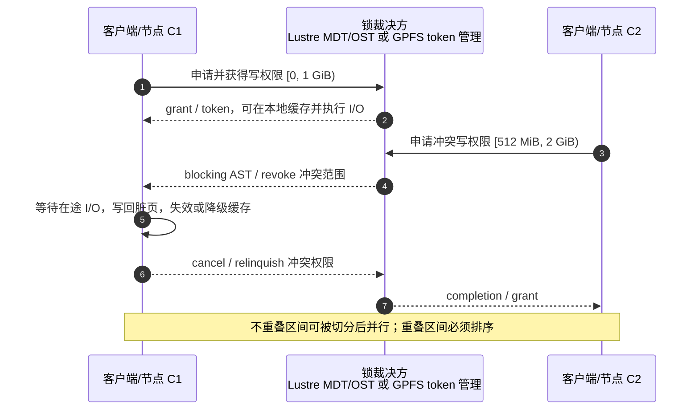

---
tags:
  - 高性能存储
  - 分布式存储
  - 并行文件系统
  - HPC
status: 已完成
---

# 经典并行文件系统架构：Lustre 与 GPFS (Spectrum Scale)

> 当几百到几万个计算进程同时访问同一套共享文件时，问题不再是“单块盘够不够快”，而是：**怎样把一个文件或一批文件的 I/O 分散到多条设备路径，同时让所有客户端仍然看到一套接近单机 POSIX 的文件语义**。Lustre 与 GPFS 代表了两条经典路线：Lustre 把命名空间与文件对象拆成 MDS/MDT、OSS/OST；GPFS 让文件系统节点共享块设备，再用 token-based distributed locking 协调缓存和并发访问。二者的共同代价是：并行度越高，锁状态、失效通知与故障恢复就越重要。

前置：[[7.1 副本 vs EC]]（数据可靠性）、[[7.2 元数据路径瓶颈]]（元数据与数据路径分离）、[[7.9 一致性模型]]（不要把 POSIX、一致性与持久化混为一谈）、[[7.12 Lease 与 Fencing]]（故障节点如何失去写权限）、[[7.20 元数据服务高可用]]（MDS/管理角色故障切换）。

---

## 1. 先建立坐标系：并行文件系统到底在并行什么

《数据存储架构与技术（第 2 版）》把并行文件系统的动机归结为“存储墙”：计算可以分散到大量处理器核，但有限的 I/O 并发能力会让存储成为整个 HPC 作业的瓶颈；并行 I/O 的基本办法，是让数据落到多个存储节点和多个访问通道上，以获得聚合带宽【事实】。

这个“并行”至少有两种不同形态：

| 并行形态 | 例子 | 主要扩展对象 | 最容易撞到的瓶颈 |
| --- | --- | --- | --- |
| **文件间并行** | 1,024 个 rank 各写一个 checkpoint 分片 | 目录、inode、分配器、很多独立文件 | 元数据服务、目录热点、小文件 RPC |
| **文件内并行** | 1,024 个 rank 写同一个共享 checkpoint 的不同区间 | 单文件的数据块、多个 OST/NSD、字节范围锁 | 条带宽度、锁冲突、共享 inode 更新 |

二者不能混为一谈。一个系统即使能让“一万个独立文件”均匀落到一万个设备上，也不代表“一个大文件”能同时吃满这些设备；反过来，一个大文件铺得很宽，也不代表创建海量小文件时元数据不会先饱和。

> [!important] POSIX 不是“线性一致”的同义词
> POSIX 定义文件 API 与大量可观察行为；线性一致是分布式对象的历史排序模型。工程上说 Lustre/GPFS 提供“强 POSIX 共享语义”，通常是在说：跨节点缓存需要保持一致、冲突读写要按规则同步、rename/权限/锁等行为尽量像单机文件系统。它不自动等价于“所有 API 都线性一致”，更不代表 `write()` 返回后数据已经落到稳定介质。持久化边界仍应回到 [[1.4 fsync fdatasync 与持久化语义]]。

---

## 2. Lustre：MGS / MDS(MDT) / OSS(OST) 三类角色

Lustre 最重要的设计不是缩写本身，而是**让控制、元数据和批量数据走不同路径**。

![[图片/SVG/8_7_21_1.svg|900]]

### 2.1 Server 与 Target 不要混用

| 服务角色 | 持久化目标 | 负责什么 | 是否承载普通文件数据 |
| --- | --- | --- | --- |
| **MGS**（Management Server） | **MGT**（Management Target） | 保存并发布配置日志；帮助客户端和服务端发现彼此 | 否 |
| **MDS**（Metadata Server） | **MDT**（Metadata Target） | 目录、文件名、权限、时间戳、扩展属性、文件布局及元数据锁 | 不承载批量文件内容 |
| **OSS**（Object Storage Server） | **OST**（Object Storage Target） | 存取文件对象、空间分配、数据范围锁 | 是 |

【事实】`Server` 是提供网络服务的节点/进程角色，`Target` 是它导出的持久化存储目标。一个 OSS 可以服务多个 OST；一个 MDS 可以服务一个或多个 MDT。教材中“神威·太湖之光”的 MDS/OSS 主备成对部署，是该系统的高可用方案示例，不应误读成所有 Lustre 集群都必须采用固定的一主一备拓扑。

### 2.2 一次打开与读写的路径

以 `open("/dataset/a.bin")` 后读取大块数据为例：

1. **挂载/配置阶段**：客户端先从 MGS 获取文件系统配置和各服务地址。已经运行的文件系统并不需要让每次 I/O 都经过 MGS；MGS 故障主要影响新挂载和配置变更【事实】。
2. **命名空间阶段**：客户端把路径查找、权限检查、`open/stat/create` 等请求发给 MDS。MDS 在 MDT 中查到 inode 与 LOV（Logical Object Volume）布局，返回选中的 OST 列表、条带大小和对象标识【事实】。
3. **数据阶段**：客户端根据布局，把不同文件区间直接发往对应 OSS/OST；大块文件数据不再绕经 MDS【事实】。
4. **缓存一致性阶段**：客户端获取并缓存适当的 LDLM 锁。只要没有冲突，后续访问可在本地缓存权限范围内继续；出现冲突时才需要撤销、降级或重新授予锁【事实/取舍】。

这条路径解释了 Lustre 的扩展性边界：

- MDS 不搬运批量数据，所以增加 OSS/OST 可以扩展数据吞吐；
- 但 `open/create/stat/unlink/rename` 仍会消耗 MDT/MDS 能力；
- 一个作业“数据吞吐低”不一定是 OST 慢，也可能是它在主循环里不断打开关闭文件，实际上被元数据 RTT 卡住。

### 2.3 多 MDT 与 DNE

Lustre 的 Distributed Namespace Environment（DNE）允许把命名空间扩展到多个 MDT。教材把 Lustre DNE 归入目录子树划分路线：不同目录子树可放到不同元数据目标，以获得更高的元数据并行度【事实】。其收益和代价分别是：

- **收益**：多个目录树分区可并行处理元数据请求；热点可以通过目录规划或迁移被拆散；
- **代价**：跨分区 rename、全局目录操作、负载规划和故障恢复更复杂；“增加 MDT”不会自动修复所有热点。

因此，先区分“单个目录热点”“大量不相干目录”“单文件数据热点”，再决定是扩 MDT、改目录布局，还是扩 OST。

---

## 3. Lustre 文件条带化：单文件怎样并行落到多个 OST

### 3.1 三个核心参数

Lustre 的普通 RAID0 风格文件布局由三个参数描述：

- `stripe_count = C`：这个文件选择多少个 OST；
- `stripe_size = S`：在切换到下一个 OST 前，连续写多少字节；
- `stripe_offset`：从哪个 OST 开始，`-1` 通常表示由系统选择。

![[图片/SVG/8_7_21_2.svg|900]]

假设文件选中的 OST 列表为 `L[0 ... C-1]`，文件逻辑偏移为 `x`，则经典轮转布局可写成：

```text
stripe_no     = floor(x / S)
ost_slot      = stripe_no mod C
selected_ost  = L[ost_slot]
object_offset = floor(stripe_no / C) * S + (x mod S)
```

例：`C=4, S=4 MiB` 时，文件 `[0,4MiB)` 在 OST0，`[4,8MiB)` 在 OST1，直到 OST3；下一轮从 OST0 继续。布局保存在 MDT 中，客户端取得布局后便能独立计算每个 I/O 应发往哪里。

### 3.2 聚合吞吐从哪里来

若应用同时保持多个条带在途，单文件带宽的上界可粗略写成：

```text
BW_file ≤ min(
    BW_client_memory,
    BW_client_network,
    Σ BW_selected_OST,
    Σ BW_involved_OSS,
    BW_fabric,
    BW_application_submission
)
```

这不是精确性能公式，而是一张排障清单【工程模型】：条带化只是让多个 OST **有机会**同时工作，并不会绕过客户端网卡、单个 OSS 的 PCIe/内存带宽、交换网络、存储控制器或应用并发度。

按等待时间看，一批跨 `C` 个条带的并行 I/O 更接近：

```text
T_batch ≈ T_layout/cache + T_lock + max(T_rpc_i + T_device_i) + T_completion
```

并行后的批次完成时间由最慢路径决定，而不是所有设备延迟的平均值。因此，某个慢 OST、拥塞链路或锁撤销都可能抬高整批 I/O 的 P99。

### 3.3 条带越宽不一定越快

> [!warning] `stripe_count = all` 不是通用优化
> 过宽布局会让更多 OST 参与同一个文件，扩大 RPC 扇出、锁状态、尾延迟和故障暴露面。对很小的文件，即使实际数据没有占满所有条带，一些查询也可能需要触达布局中的多个 OST。默认先让“小文件少条带、大文件逐步加宽”，再用实测决定。

典型选择：

| 负载 | 起始策略 | 原因 |
| --- | --- | --- |
| 海量独立小文件 | 每文件 1 个或少量 OST，让不同文件自然分散 | 避免每个小文件产生宽扇出 |
| 单个超大顺序文件，多个 rank 分区读写 | 增加 `stripe_count`，让 rank 与 OST 并行 | 文件内并行需要多设备路径 |
| 顺序大块 I/O | 较大的 `stripe_size` 往往更友好 | 减少跨条带切换和小 RPC |
| 细粒度随机 I/O | 先看块大小与锁冲突，不盲目加宽 | 瓶颈可能是 RTT、锁和设备 IOPS |
| 大小文件混合 | 使用 Progressive File Layout（PFL） | 文件增长到不同区间时采用不同布局宽度 |

布局通常在文件创建时确定；改变既有文件布局需要迁移/重写数据，而不是只修改目录默认值【事实】。

---

## 4. GPFS：共享磁盘、NSD 与“多数功能在本地节点执行”

> [!note] 名称沿革
> GPFS（General Parallel File System）是经典技术名称；产品后来称 IBM Spectrum Scale，目前 IBM 官方产品名为 **IBM Storage Scale**。本文保留“GPFS”是为了对照经典论文和架构术语。

### 4.1 与 Lustre 不同的起点

经典 GPFS 是 **shared-disk file system**：运行应用的文件系统节点通过 SAN/交换网络访问同一组块设备，文件系统逻辑运行在各节点上，而不是先把所有文件操作都转发给一个固定数据服务器【经典论文】。

现代 IBM Storage Scale 用 NSD（Network Shared Disk）抽象文件系统磁盘：

- 有直接存储连接的节点可以直接访问 NSD；
- 没有直接连接的节点，可以经指定的 NSD Server 通过集群网络转发块 I/O；
- 因而“共享磁盘”是逻辑访问模型，不等于每个计算节点必须物理直连每块盘【事实】。

和 Lustre 对位：

| 问题 | Lustre | GPFS / Storage Scale |
| --- | --- | --- |
| 文件内容由谁组织 | MDS 给出对象布局，客户端直连 OST | 每个 GPFS 节点理解文件系统块布局 |
| 后端介质抽象 | OST，由 OSS 导出 | NSD，可直达或经 NSD Server |
| 全局协调 | MGS、MDS/MDT、LDLM target lock master | cluster manager、file system manager、token manager、metanode |
| 并行来源 | 文件对象跨 OST + 多客户端 | 文件系统块跨 NSD + 多节点本地执行 |

### 4.2 不是“没有管理节点”，而是把全局职责缩小

IBM 文档强调：一般文件请求在应用所在节点处理，以保持数据与应用的亲和性；但仍有少数全局角色【事实】：

- **GPFS cluster manager**：维护集群级存活与仲裁，选择 file system manager；
- **file system manager**：每个文件系统一个，负责配置变化、空间分配协调、配额，以及 token 管理的入口；
- **token manager/server**：授予读写数据或元数据所需的 token。现代版本可由多个 manager 节点分担 token 状态；
- **metanode**：按文件/目录动态选出的协调者，合并该对象的 inode、大小、mtime 与块地址更新。

所以 GPFS 不是“完全去中心化”。它的做法是：**把高频数据 I/O 留在本地节点，把必须全局一致的少量状态交给专门角色**。

### 4.3 GPFS 条带化

经典 GPFS 在文件系统层把大文件切成固定大小块，并把连续块以轮转方式分散到多个磁盘；读预取和写回可以并行向多块磁盘发 I/O，从而接近底层磁盘子系统与交换网络的聚合带宽【经典论文】。

现代系统还会考虑 storage pool、failure group、复制策略、设备性能和空间余量。因此图中的“block 0→NSD A、block 1→NSD B”用于建立基本模型，不代表当前产品总是无条件在全部 NSD 上做简单轮转。

---

## 5. DLM / token：并发正确性的成本中心

### 5.1 内部一致性锁与应用锁是两层东西

容易混淆的两类锁：

1. **文件系统内部锁**：Lustre LDLM、GPFS token。它们保护跨节点页缓存、文件数据、inode、目录与分配元数据；即使应用从未调用 `flock()`，文件系统仍必须使用它们。
2. **应用可见锁**：`flock()`、`fcntl(F_SETLK)` 等，由应用显式请求，用来协调业务协议。

内部 DLM 的目标不是让业务自动“无竞态”，而是防止两个客户端在不知道彼此的情况下同时修改同一底层状态，造成缓存不一致或文件系统损坏。

### 5.2 Lustre LDLM 的锁资源

Lustre 的 LDLM 主要包括：

- **extent lock**：保护 OST 对象上的文件数据区间；
- **inodebits lock**：把 inode/目录元数据按语义位拆分保护；
- **flock lock**：承载 BSD/POSIX 文件锁相关能力。

一个关键实现边界是：锁通常由管理对应 MDT 或 OST 的服务节点裁决；锁 master 不会为了“更分布式”而在任意节点间漂移【实现/取舍】。这样简化了锁资源定位，但热点文件或热点目录仍会把冲突集中到对应 target。

### 5.3 GPFS token 的缓存权限

经典 GPFS 由全局 token manager 与各节点的本地锁管理器协作。节点第一次访问某个对象时申请 token；token 不仅允许本地授予锁，也意味着该节点可以缓存相关数据，因为其他节点要修改它之前必须先让当前 token 失效【事实】。

无冲突时，这是一种“把协调结果缓存起来”的优化：后续本地读写不需要每次都找 token server。只有另一个节点申请不兼容权限时，才发生 token revoke、脏数据写回/缓存失效与重新授予。

### 5.4 冲突时发生什么



两套实现的消息细节并不完全相同：Lustre 使用 blocking/completion AST；现代 GPFS token 管理可把冲突持有者列表返回给请求节点，由请求节点推动持有者 relinquish。共同的性能本质是：

```text
冲突成本 ≈ revoke 消息 + 等待在途 I/O + 脏页写回 + 缓存失效 + 重新授予
```

真正昂贵的往往不是“发一条锁消息”，而是为了交出权限必须完成的 I/O 与缓存处理。

### 5.5 故障客户端为什么必须被驱逐

若持锁节点宕机或发生网络分区，其他节点不能无限等待它主动释放。Lustre 会在客户端不能及时响应 blocking AST 等条件下驱逐该客户端，使其旧锁不再阻塞存活节点【事实】；GPFS 则结合 quorum、disk lease、token 状态迁移和恢复流程，避免两个分区同时认为自己拥有有效写权限【事实】。这与 [[7.12 Lease 与 Fencing]] 的原则一致：安全不依赖“证明对方已经死透”，而依赖“让旧权限失效”。

---

## 6. 同一文件并发写：哪些能并行，哪些会互相拖死

### 6.1 GPFS 的字节范围 token

经典 GPFS 的优化非常具有代表性：

1. 第一个写者先取得从 `0` 到无穷大的整文件 byte-range token；没有共享写时，后续 I/O 全在本地完成。
2. 第二个节点开始写同一文件时，只撤销与它冲突的部分；两个写者可分别持有不同区间。
3. 顺序写时，节点会同时声明“当前必须范围”和“预计后续范围”，token manager 尽量一次切出足够大的连续区间，减少后续协商。
4. 多节点写各自的大块、不重叠分区时，可以接近不同文件并行写的扩展性【经典论文】。

Lustre 的 extent lock 也允许在不同对象/不冲突区间上并行；具体锁粒度和缓存行为由客户端、布局与版本共同决定。

> [!note] 经典 GPFS 的 data shipping 说明了“语义换性能”
> FAST 2002 论文还描述了一种面向 MPI-IO 细粒度共享的 data shipping 模式：把文件块指定给固定节点，其他节点的访问转发给块 owner，从而避免 byte-range token 在节点间反复迁移。它不保持普通 POSIX byte-range locking 的全部语义，因此本文只把它作为架构思想，而不把它当作当前 Storage Scale 的默认数据路径。

### 6.2 “逻辑不重叠”仍可能发生 false sharing

GPFS 为了同步块分配，会把 byte-range token 对齐到文件系统块边界。于是：

```text
C1 写 [0, 4 KiB)
C2 写 [4 KiB, 8 KiB)
```

即便应用字节范围不重叠，只要二者位于同一个更大的文件系统块内，也可能争夺同一 token，触发反复撤销和读改写——这就是并行文件 I/O 里的 **false sharing**【事实】。它与 CPU cache line false sharing 完全同构：业务变量不同，但一致性单位相同。

### 6.3 冲突矩阵

| 访问模式 | 正确性结果 | 性能结果 | 建议 |
| --- | --- | --- | --- |
| 不同文件、不同目录 | 通常无数据锁冲突 | 主要竞争设备、目录与分配器 | 最容易扩展 |
| 同文件、远离且块对齐的大区间 | 可用范围锁/token 分区 | 通常能并行 | MPI-IO 分区写的理想形态 |
| 同文件、不重叠但落在同一 FS block | 语义正确 | false sharing，频繁 revoke | 放大记录/分区并按块对齐 |
| 同文件、重叠写 | 文件系统会同步冲突 | 等待与撤销不可避免 | 应用必须定义最终写入顺序 |
| 一写多读同一区间 | 读不能使用已过期缓存 | 写回、失效、再授予 | 减少跨节点读写抖动 |
| 多节点细粒度交错 append | 语义和偏移分配都需协调 | inode/EOF/token 热点 | 优先每 rank 分片后归并 |

> [!warning] DLM 保证“文件系统不会因并发而损坏”，不保证“业务结果符合你的意图”
> 两个进程同时覆盖同一字节范围，文件系统可以给出合法的串行顺序，但哪个写最后生效仍取决于竞争。需要原子记录追加、事务或确定性归并时，必须在应用/库层定义协议，不能把希望寄托在内部 DLM 上。

---

## 7. 性能判断：什么时候经典并行文件系统很强，什么时候会失速

### 7.1 擅长的负载

- **大文件、大块、深队列**：条带能把请求铺到多个 OST/NSD；
- **每 rank 独立文件或共享文件大区间分片**：锁冲突低，设备并行度高；
- **checkpoint、仿真结果、训练数据顺序扫描**：聚合吞吐比单请求极低延迟更重要；
- **跨大量节点共享同一 POSIX 命名空间**：应用无需改成对象 API，传统 HPC 工具链可直接使用。

### 7.2 容易失速的负载

- **单热点目录 + 海量小文件**：数据盘还没忙，MDS/目录锁先饱和；
- **同一文件内的细粒度交错更新**：token/extent lock 在节点间来回 ping-pong；
- **小文件使用极宽条带**：RPC 扇出和布局状态大于有效数据；
- **低并发同步 I/O**：只触达一条设备路径，无法利用条带；
- **慢 OST/NSD 混入批次**：并行批次受最慢分支拖累，P99 放大；
- **把 close 当 fsync**：缓存一致性看起来正确，不代表崩溃后持久化边界正确。

### 7.3 观测指标要与路径对齐

| 层 | 先看什么 | 典型判定 |
| --- | --- | --- |
| 应用 | I/O size、并发度、每 rank 文件模式、P50/P99 | 请求是否足以填满条带 |
| MDS/MDT | open/create/stat/unlink/rename 速率与延迟 | 是否是元数据墙 |
| DLM/token | grant、cancel/revoke、等待者、token 迁移 | 是否发生锁抖动 |
| OSS/OST/NSD | 各设备吞吐、IOPS、队列、利用率、尾延迟 | 是否均衡，是否有慢盘 |
| 网络 | 客户端与存储节点链路吞吐、拥塞、重传 | 是否卡在单网卡/交换路径 |
| 持久化 | writeback、sync 延迟、设备 flush | 可见性与耐久性是否混淆 |

对于 GPFS，可用 `mmdiag --tokenmgr` 查看 token manager 角色和统计；对于 Lustre，可从 MDS/OSS 与 LDLM 统计项观察元数据、OST 与锁活动。具体字段会随版本变化，排障时应以目标集群版本文档为准。

---

## 8. 与 JuiceFS / 3FS 对照：不是简单的“强一致 vs 弱一致”

| 维度 | Lustre | GPFS / Storage Scale | JuiceFS | 3FS |
| --- | --- | --- | --- | --- |
| 主要场景 | HPC、大规模共享 POSIX | HPC + 企业共享数据平台 | 云上对象存储之上的共享文件 | AI 训练/推理的 NVMe + RDMA 数据面 |
| 客户端形态 | Linux 内核客户端 | 内核/daemon 协同的 GPFS 节点 | rich client，常见入口是 FUSE | FUSE + 原生高性能客户端 |
| 元数据 | MDS/MDT，支持多 MDT | 共享磁盘元数据 + file system manager + metanode | 独立 metadata engine | 无状态 metadata service + 事务 KV |
| 文件数据 | 对象跨 OST | 文件系统块跨 NSD | block/chunk 映射到对象存储 | chunk 副本链落在本地 SSD |
| 一致性协调 | LDLM，MDT/OST 裁决 | token manager + byte-range token | 默认 close-to-open；元数据事务原子 | CRAQ 强一致 + 事务元数据 |
| 主要性能税 | 内核客户端、MDS/LDLM、OST RPC | token revoke、共享盘/NSD 路径、全局角色 | FUSE、对象存储 RTT、缓存与 compaction | RDMA 注册/轮询、链式复制、原生接口集成 |

三个需要纠正的直觉：

1. **JuiceFS 不是“没有 POSIX”**：官方文档给出 close-to-open、一系列原子元数据操作以及传统 record lock；但 FUSE 和多级缓存决定了它的可见性边界与内核集群文件系统不同【事实】。
2. **3FS 不是“松散一致”**：其存储服务用 CRAQ 提供强一致，元数据服务无状态并落在事务 KV；它与 Lustre/GPFS 的差别主要在客户端路径、复制方式和负载画像，而不是简单的“有没有强一致”【事实】。
3. **真正的比较轴是“协调成本放在哪里”**：Lustre/GPFS 把跨节点缓存一致性放进 DLM/token；JuiceFS 把大量状态放在 rich client、metadata engine 和对象存储；3FS 把数据一致性放进复制链，并为性能关键应用提供原生路径【工程归纳】。

因此，对 AI 集群选型时应问：

- 现有应用是否必须无修改挂载 POSIX？
- 共享写是大区间分片，还是小记录交错？
- 数据是否需要跨云对象存储，还是本地 NVMe + RDMA？
- 主要瓶颈是元数据、单文件带宽、客户端 CPU，还是故障恢复？
- 团队愿意承担内核客户端运维，还是愿意改造原生用户态接口？

---

## 9. 实验：把“条带带宽”和“锁冲突”分开测

> [!danger] 只在专用测试目录执行
> 不要在生产文件系统根目录修改默认条带，也不要用业务文件做覆盖写实验。先确认管理员给出的 OST 数量、建议 stripe 参数和作业节点配额。

### 9.1 Lustre 条带实验

```bash
# Linux-only；需要 Lustre 客户端工具，并对测试目录有权限。
mkdir -p /mnt/lustre/lab/stripe1 /mnt/lustre/lab/stripe4 /mnt/lustre/lab/stripe8

# 三组目录采用相同 4 MiB stripe_size，仅改变 stripe_count。
lfs setstripe -c 1 -S 4M /mnt/lustre/lab/stripe1
lfs setstripe -c 4 -S 4M /mnt/lustre/lab/stripe4
lfs setstripe -c 8 -S 4M /mnt/lustre/lab/stripe8

# 目录只定义“之后新建文件”的默认布局；验证实际测试文件布局。
lfs getstripe -d /mnt/lustre/lab/stripe4

# 创建空文件后，检查它实际继承到的布局。
truncate -s 0 /mnt/lustre/lab/stripe4/test.dat
lfs getstripe /mnt/lustre/lab/stripe4/test.dat
```

固定总数据量和 I/O size，分别测试：

1. 单进程顺序写一个大文件；
2. 多进程写同一个文件的**互不重叠、按大块对齐**区间；
3. 多进程各写独立文件；
4. 多进程以 4 KiB 记录交错写同一文件；
5. 同样 workload 在 `stripe_count=1/4/8` 下的带宽、P99 与锁活动。

预测【可证伪假设】：

- 1→4 条带通常只在应用有足够在途 I/O 且单 OST 已成为瓶颈时才明显增益；
- 独立文件与大区间分片应比 4 KiB 交错写更容易扩展；
- 交错写即使设备利用率不高，也可能因锁 revoke/写回抖动而延迟暴涨；
- 条带继续加宽后收益会趋平，瓶颈转移到客户端网卡、OSS 或最慢 OST。

### 9.2 GPFS / Storage Scale token 实验

保持文件系统和块大小不变，比较以下共享模式：

```text
A. N 个节点，各写一个独立文件
B. N 个节点，写同一文件的 N 个连续且块对齐分区
C. N 个节点，按小记录轮转写同一文件
D. 两个节点反复覆盖同一范围
```

同时采集 `mmdiag --tokenmgr`、节点 I/O、网络和应用 P99。预期从 A→D，设备带宽不一定先饱和，但 token revoke、等待与脏页交接会逐步增加。若 C 明显劣于 B，即可用“共享粒度小于一致性块粒度”解释 false sharing，而不是笼统归因于“GPFS 慢”。

### 9.3 报告至少保留这些字段

```text
文件系统与版本：
客户端/计算节点数：
OST 或 NSD 数量与拓扑：
文件大小、I/O size、并发度：
条带/块布局：
访问模式：独立文件 / 同文件分区 / 交错 / 重叠
吞吐：
P50 / P95 / P99：
元数据 ops：
lock/token grant、revoke、wait：
最慢设备与最慢链路：
fsync/close 是否计入：
```

---

## 10. 面试与设计评审的回答模板

### 10.1 为什么 Lustre 能扩展单文件吞吐

> MDS 只负责命名空间与文件布局，客户端拿到 layout 后直接并行访问多个 OSS/OST；单文件再按 `stripe_size` 轮转到 `stripe_count` 个 OST。这样批量数据绕过 MDS，并利用多个设备和网络通道。但带宽受客户端、网络、OSS、OST 与应用队列共同限制，过宽条带会增加 RPC 和锁开销。

### 10.2 为什么 GPFS 能让多个节点写同一文件

> GPFS 在共享磁盘上使用 token-based distributed locking。无竞争时节点缓存大范围 token，本地 I/O 不必反复协调；出现第二个写者时，byte-range token 被切成互不冲突的范围，使各节点能并行写不同区间。若多个节点落到同一文件系统块，就会发生 false sharing 和 token ping-pong。

### 10.3 DLM 的本质是什么

> DLM 不是给业务直接使用的“大号 mutex”，而是跨节点缓存一致性与底层元数据正确性的权限协议。它允许客户端缓存“我可以读/写这个范围”的权利；冲突时通过 revoke/AST、写回和失效把权利安全转移。无冲突时它省消息，有冲突时它可能成为成本中心。

---

## 11. 总结

1. **Lustre 是显式服务分层**：MGS 管配置，MDS/MDT 管命名空间和布局，OSS/OST 管文件对象；客户端数据直达 OSS。
2. **GPFS 是共享磁盘 + 节点本地执行**：数据块跨 NSD 分布，少量全局角色管理配置、空间、token 与每文件元数据协调。
3. **条带化扩吞吐的前提是有足够并发**：它只增加可用设备路径，不能突破客户端、网络、控制器和最慢设备上限。
4. **粗粒度不冲突共享最适合并行**：每 rank 独立文件或同文件大块分区；细粒度交错写会造成锁/token 抖动与 false sharing。
5. **DLM 是 POSIX 共享语义的性能账单**：无冲突时权限可缓存；冲突时必须撤销、写回、失效和重授予。
6. **与 JuiceFS/3FS 的差别不是简单强弱一致性**：真正要比较的是客户端形态、数据介质、复制/放置方式，以及协调成本位于哪一层。

---

## 参考资料

### 项目 Sources

1. 舒继武，《数据存储架构与技术（第 2 版）》，人民邮电出版社，2024：§7.5“并行存储”、§7.5.1“架构特点”、§7.5.2“关键技术”、§8.6.2“分布式文件系统关键技术”。
2. Thomas Sterling et al., *High Performance Computing: Modern Systems and Practices*。本项目 EPUB 文件结构不完整，当前未能读取到并行文件系统相关正文，因此未把它作为本文事实依据。

### Lustre 官方资料

3. Lustre Wiki, *Lustre Architecture for Admins*，访问日期：2026-08-30。  
   https://wiki.lustre.org/Lustre_Architecture_for_Admins
4. Lustre Wiki, *Configuring Lustre File Striping*，访问日期：2026-08-30。  
   https://wiki.lustre.org/Configuring_Lustre_File_Striping
5. Lustre Wiki, *Subsystem Map*（LDLM 锁类型），访问日期：2026-08-30。  
   https://wiki.lustre.org/Subsystem_Map
6. Lustre Wiki, *Lustre Resiliency: Understanding Lustre Message Loss and Tuning for Resiliency*，访问日期：2026-08-30。  
   https://wiki.lustre.org/Lustre_Resiliency:_Understanding_Lustre_Message_Loss_and_Tuning_for_Resiliency

### GPFS / IBM Storage Scale

7. Frank Schmuck, Roger Haskin, “GPFS: A Shared-Disk File System for Large Computing Clusters,” USENIX FAST 2002, pp. 231–244：§2.1、§3.1–§3.7。  
   https://www.usenix.org/conference/fast-02/gpfs-shared-disk-file-system-large-computing-clusters
8. IBM Documentation, *File system manager*, IBM Storage Scale 6.0.0，访问日期：2026-08-30。  
   https://www.ibm.com/docs/en/storage-scale/6.0.0?topic=functions-file-system-manager
9. IBM Documentation, *Using multiple token servers*, IBM Storage Scale 5.2.3，访问日期：2026-08-30。  
   https://www.ibm.com/docs/en/storage-scale/5.2.3?topic=topics-using-multiple-token-servers
10. IBM Documentation, *Special management functions*, IBM Storage Scale 6.0.0，访问日期：2026-08-30。  
    https://www.ibm.com/docs/en/storage-scale/6.0.0?topic=architecture-special-management-functions
11. IBM, *IBM Storage Scale* product overview，访问日期：2026-08-30。  
    https://www.ibm.com/products/storage-scale

### 对照系统

12. JuiceFS Documentation, *Architecture*；*POSIX Compatibility*；*Cache*，访问日期：2026-08-30。  
    https://juicefs.com/docs/community/architecture/  
    https://juicefs.com/docs/community/posix_compatibility/  
    https://juicefs.com/docs/community/guide/cache/
13. DeepSeek, *3FS Design Notes* 与项目 README，访问日期：2026-08-30。  
    https://github.com/deepseek-ai/3FS/blob/main/docs/design_notes.md  
    https://github.com/deepseek-ai/3FS
