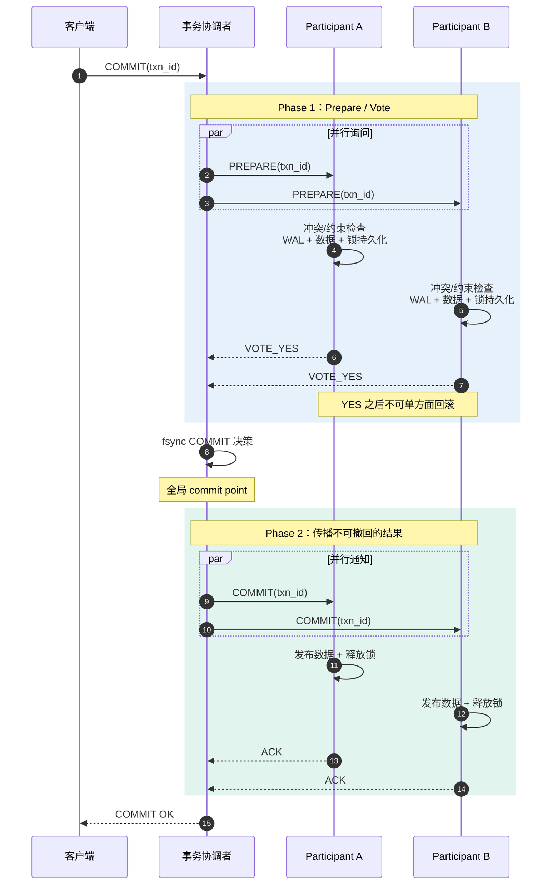
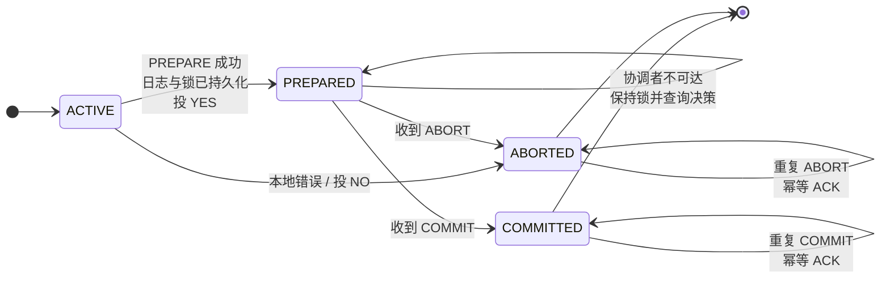
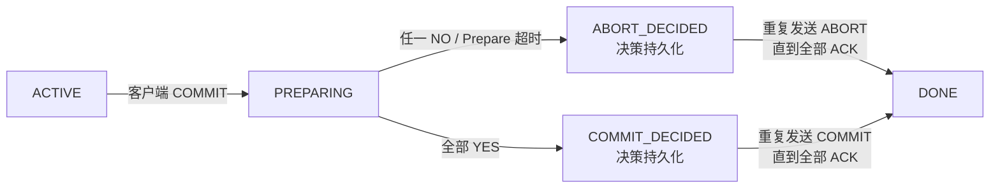
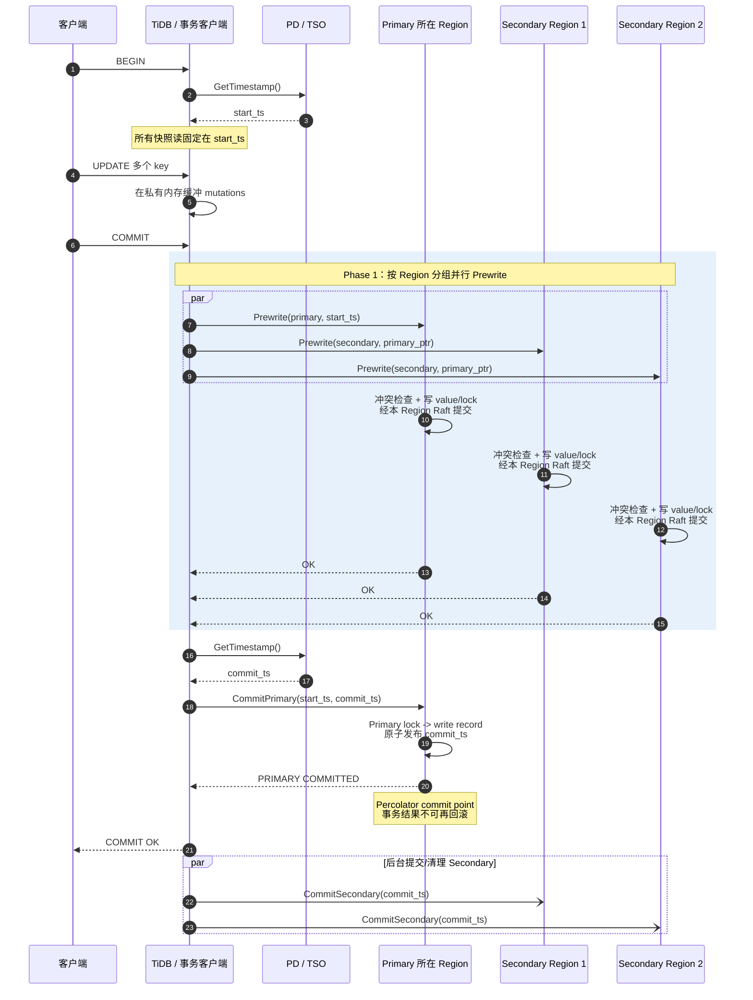
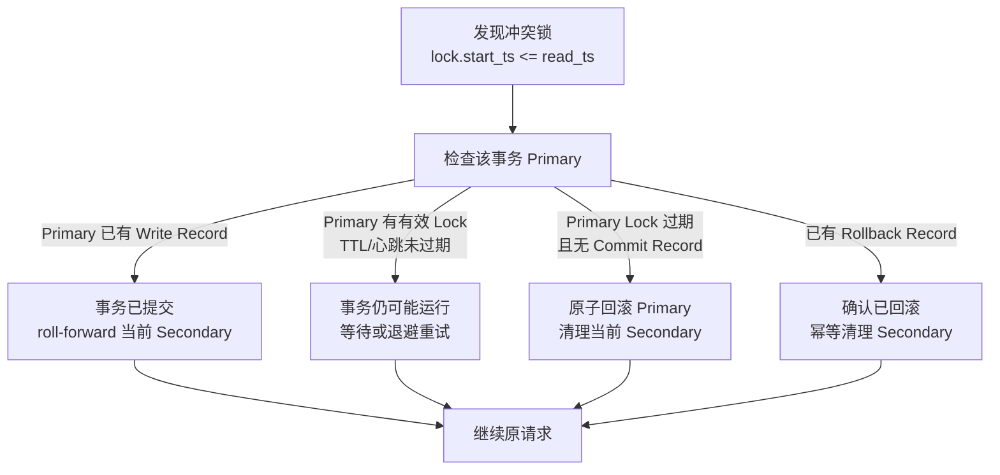

# 7.22 Mermaid 图完整预览

## 图 1：2.1 正常提交时序

```mermaid
sequenceDiagram
    autonumber
    participant C as 客户端
    participant TC as 事务协调者
    participant A as Participant A
    participant B as Participant B

    C->>TC: COMMIT(txn_id)

    rect rgb(230, 241, 251)
        Note over TC,B: Phase 1：Prepare / Vote
        par 并行询问
            TC->>A: PREPARE(txn_id)
            TC->>B: PREPARE(txn_id)
        end
        A->>A: 冲突/约束检查<br/>WAL + 数据 + 锁持久化
        B->>B: 冲突/约束检查<br/>WAL + 数据 + 锁持久化
        A-->>TC: VOTE_YES
        B-->>TC: VOTE_YES
        Note over A,B: YES 之后不可单方面回滚
    end

    TC->>TC: fsync COMMIT 决策
    Note over TC: 全局 commit point

    rect rgb(225, 245, 238)
        Note over TC,B: Phase 2：传播不可撤回的结果
        par 并行通知
            TC->>A: COMMIT(txn_id)
            TC->>B: COMMIT(txn_id)
        end
        A->>A: 发布数据 + 释放锁
        B->>B: 发布数据 + 释放锁
        A-->>TC: ACK
        B-->>TC: ACK
    end

    TC-->>C: COMMIT OK
```

## 图 2：2.2 参与者故障状态机

```mermaid
stateDiagram-v2
    direction LR

    [*] --> ACTIVE
    ACTIVE --> ABORTED: 本地错误 / 投 NO
    ACTIVE --> PREPARED: PREPARE 成功<br/>日志与锁已持久化<br/>投 YES

    PREPARED --> PREPARED: 协调者不可达<br/>保持锁并查询决策
    PREPARED --> COMMITTED: 收到 COMMIT
    PREPARED --> ABORTED: 收到 ABORT

    COMMITTED --> COMMITTED: 重复 COMMIT<br/>幂等 ACK
    ABORTED --> ABORTED: 重复 ABORT<br/>幂等 ACK

    COMMITTED --> [*]
    ABORTED --> [*]
```

## 图 3：2.3 协调者状态机

```mermaid
flowchart LR
    A[ACTIVE] -->|客户端 COMMIT| P[PREPARING]
    P -->|任一 NO / Prepare 超时| AD[ABORT_DECIDED<br/>决策持久化]
    P -->|全部 YES| CD[COMMIT_DECIDED<br/>决策持久化]
    AD -->|重复发送 ABORT<br/>直到全部 ACK| D[DONE]
    CD -->|重复发送 COMMIT<br/>直到全部 ACK| D
```

## 图 4：4.3 Commit：Primary 先成为唯一事实，Secondary 再追上

```mermaid
sequenceDiagram
    autonumber
    participant C as 客户端
    participant SQL as TiDB / 事务客户端
    participant TSO as PD / TSO
    participant P as Primary 所在 Region
    participant S1 as Secondary Region 1
    participant S2 as Secondary Region 2

    C->>SQL: BEGIN
    SQL->>TSO: GetTimestamp()
    TSO-->>SQL: start_ts
    Note over SQL: 所有快照读固定在 start_ts

    C->>SQL: UPDATE 多个 key
    SQL->>SQL: 在私有内存缓冲 mutations
    C->>SQL: COMMIT

    rect rgb(230, 241, 251)
        Note over SQL,S2: Phase 1：按 Region 分组并行 Prewrite
        par
            SQL->>P: Prewrite(primary, start_ts)
            SQL->>S1: Prewrite(secondary, primary_ptr)
            SQL->>S2: Prewrite(secondary, primary_ptr)
        end
        P->>P: 冲突检查 + 写 value/lock<br/>经本 Region Raft 提交
        S1->>S1: 冲突检查 + 写 value/lock<br/>经本 Region Raft 提交
        S2->>S2: 冲突检查 + 写 value/lock<br/>经本 Region Raft 提交
        P-->>SQL: OK
        S1-->>SQL: OK
        S2-->>SQL: OK
    end

    SQL->>TSO: GetTimestamp()
    TSO-->>SQL: commit_ts

    SQL->>P: CommitPrimary(start_ts, commit_ts)
    P->>P: Primary lock -> write record<br/>原子发布 commit_ts
    P-->>SQL: PRIMARY COMMITTED
    Note over P: Percolator commit point<br/>事务结果不可再回滚
    SQL-->>C: COMMIT OK

    par 后台提交/清理 Secondary
        SQL-)S1: CommitSecondary(commit_ts)
        SQL-)S2: CommitSecondary(commit_ts)
    end
```

## 图 5：5. 崩溃恢复：遇到 Secondary Lock 时追问 Primary

```mermaid
flowchart TD
    L[发现冲突锁<br/>lock.start_ts <= read_ts] --> P[检查该事务 Primary]
    P -->|Primary 已有 Write Record| F[事务已提交<br/>roll-forward 当前 Secondary]
    P -->|Primary 有有效 Lock<br/>TTL/心跳未过期| W[事务仍可能运行<br/>等待或退避重试]
    P -->|Primary Lock 过期<br/>且无 Commit Record| R[原子回滚 Primary<br/>清理当前 Secondary]
    P -->|已有 Rollback Record| R2[确认已回滚<br/>幂等清理 Secondary]
    F --> X[继续原请求]
    W --> X
    R --> X
    R2 --> X
```
