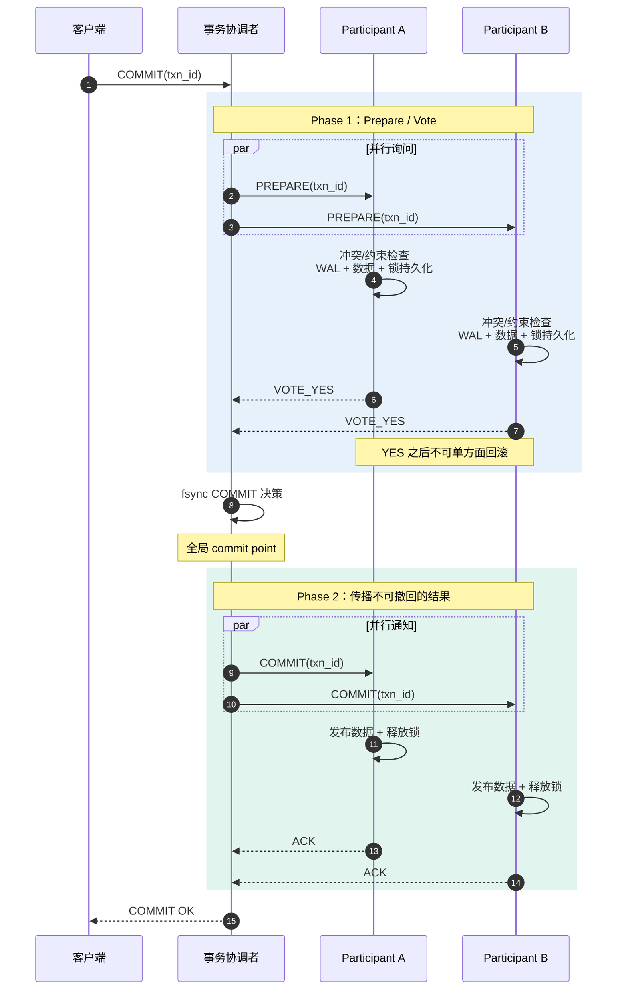
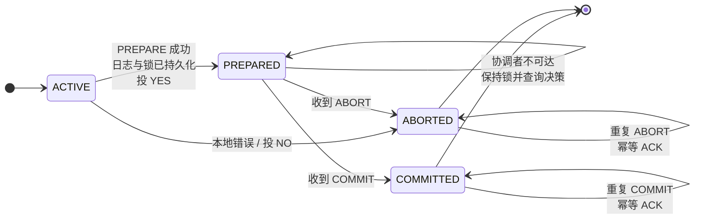
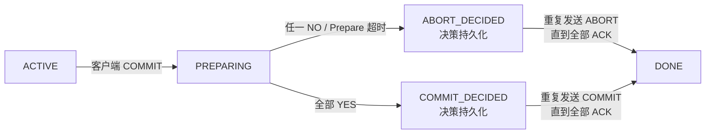
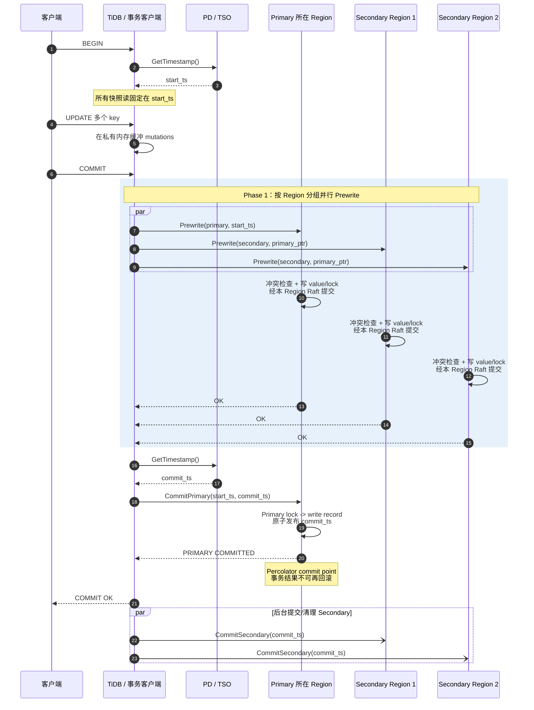
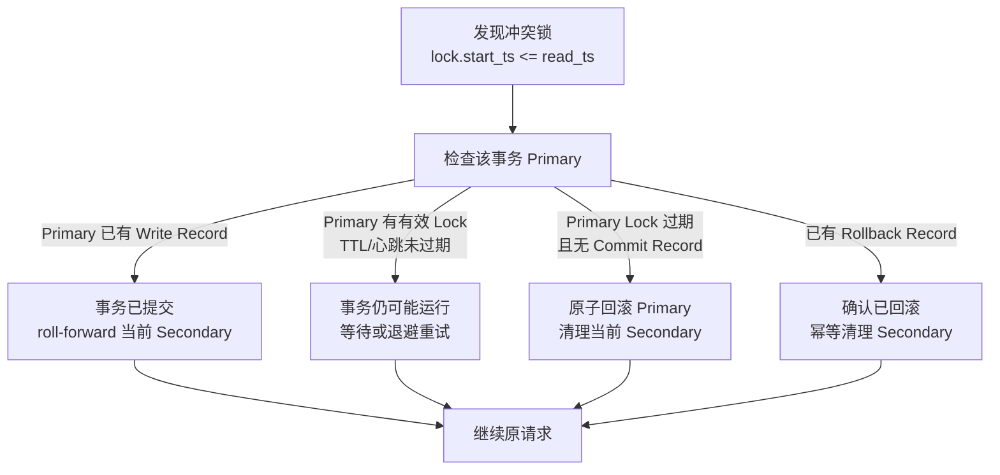

---
tags:
  - 高性能存储
  - 分布式存储
status: 已完成
---

# 分布式存储系统中的事务与 MVCC（Percolator 模型）

> [[7.11 Primary-Backup 与 Multi-Raft]] 能保证**每个分片内部**的写入按同一顺序、可靠地复制，却不能自动保证“分片 A 已扣款、分片 B 也一定入账”；[[6.15 Snapshot 与 Sequence Number]] 能让读者固定在一个版本观察数据，却不能自动让跨分片写入原子发布。分布式事务要把三件事组合起来：**MVCC 决定读哪个版本，锁与冲突检测决定谁可以写，原子提交协议决定多分片最终一起提交还是一起回滚**。Percolator 的关键创新，是让一个 Primary Lock/Primary Key 充当可持久查询的事务状态锚点，使任何后来者都能恢复未完成的 Secondary Lock。

前置：[[7.9 一致性模型]]（区分线性一致、事务隔离与 ACID）、[[7.11 Primary-Backup 与 Multi-Raft]]（Region/Raft 只解决分片内复制）、[[7.13 幂等 重试 与请求去重]]（恢复消息必须可重放）、[[6.15 Snapshot 与 Sequence Number]]（单机 LSM 的版本可见性）、[[6.1 WAL 与 Crash Consistency]]（持久化顺序与恢复）。

---

## 1. 问题模型：单分片正确，不等于跨分片原子

假设余额表按用户 ID 分片：

```text
Region A：Bob 余额  = 10
Region B：Joe 余额  = 2
事务 T：Bob -= 7；Joe += 7
```

若两个 Region 各自只做一次独立的 Raft 写，可能出现：

1. Region A 已经多数派提交 `Bob=3`；
2. 客户端到 Region B 的请求丢失，或 Region B 在落盘前宕机；
3. 最终 Bob 少了 7，Joe 却没有增加 7。

每个 Region 的本地日志都可能完全正确，系统整体仍然违反转账不变量。跨分片事务需要把下面三层拼在一起：

| 层次 | 负责解决 | 不负责解决 |
| --- | --- | --- |
| **Raft / 副本复制** | 一个 Region 内的日志定序、持久化、主故障恢复 | 多个 Region 是否作出同一个事务结果 |
| **MVCC + Timestamp Oracle** | 给事务固定读快照，定义版本可见性与写入先后 | 多个写集合是否一起提交 |
| **2PC / Percolator 提交协议** | 把多个参与分片的结果收敛为全提交或全回滚 | 自动获得可串行化隔离、消除所有业务竞态 |

因此要牢记：

> **共识解决“一个复制组相信哪条日志”，原子提交解决“多个复制组接受同一个事务结果”，MVCC 解决“读者在什么逻辑时间看到哪个版本”。三者互补，不能互相替代。**

---

## 2. 通用两阶段提交：先取得不可撤回的承诺，再发布唯一结果

【通用协议】经典 2PC 有三个角色：

- **事务协调者（coordinator / transaction manager）**：收集投票并持久化最终 `COMMIT` 或 `ABORT` 决策；
- **参与者（participant）**：实际保存某个分片的数据、锁和事务日志；
- **客户端/应用**：执行读写，并向协调者发起提交。

2PC 的两个阶段不是“写两次”这么简单，而是建立两层不可撤回的承诺：

1. **Prepare 阶段**：参与者检查冲突、约束、磁盘空间等条件，把待提交数据和恢复信息持久化，持有必要的锁，然后回复 `YES`。从回复 `YES` 开始，它已经放弃了单方面回滚的权利；
2. **Decision 阶段**：只有全部参与者都回复 `YES`，协调者才把 `COMMIT` 决策持久化。决策一旦落盘就不可反悔，之后无论消息丢失多少次，都必须重试到所有参与者接受同一结果。

### 2.1 正常提交时序



> [!important] 两个“不可回头点”
> - 参与者持久化 `PREPARED` 并投 `YES`：**参与者不可再自行决定结果**；
> - 协调者持久化最终决策：**协调者必须永久重试该决策，不能因超时改判**。

### 2.2 参与者故障状态机



`PREPARED` 是最危险的状态：参与者已经保证“只要协调者要求就一定能提交”，却还不知道协调者最后选了什么。这个状态称为 **in-doubt / uncertain（悬而未决）**。

### 2.3 协调者状态机



这里的 `Prepare 超时 → ABORT` 只适用于**协调者还没有持久化提交决策**的阶段。进入 `COMMIT_DECIDED` 后，某个 Phase 2 RPC 超时绝不意味着可以改判回滚。

---

## 3. 2PC 的故障状态与恢复

### 3.1 故障矩阵

| 故障发生点 | 已知持久状态 | 安全恢复动作 | 为什么 |
| --- | --- | --- | --- |
| 协调者发出 `PREPARE` 前宕机 | 没有参与者投 `YES` | 恢复后回滚；参与者也可安全超时清理未 prepare 的本地事务 | 还没有不可撤回承诺 |
| 参与者在投 `YES` 前宕机/超时 | 该参与者没有 `PREPARED` | 协调者决定 `ABORT`，恢复后参与者按事务 ID 回滚 | 不能确认“所有人都能提交” |
| 参与者投 `YES` 后宕机 | `PREPARED`、数据和锁均已持久化 | 重启后保持 in-doubt，向协调者查询；收到决定后幂等提交或回滚 | `YES` 已经是不可撤回承诺 |
| 协调者在最终决策落盘前宕机 | 协调者日志中没有 `COMMIT` 记录 | 恢复后决定 `ABORT`，通知全部参与者 | 通用 2PC 把“决策是否落盘”作为 commit point |
| 协调者已落盘 `COMMIT`，但只通知了一部分参与者 | 协调者日志有 `COMMIT`；部分参与者仍 `PREPARED` | 协调者恢复后继续发送 `COMMIT`，直到全部 ACK | 已提交数据可能已对外可见，结果不可撤回 |
| Phase 2 消息重复、乱序或 ACK 丢失 | 参与者已有终态或中间态 | 以 `txn_id` 做幂等状态转移：重复 `COMMIT/ABORT` 返回同一结果 | 网络只保证“可能到达”，恢复依赖可重放 |

### 3.2 为什么 2PC 会阻塞

参与者处于 `PREPARED` 时不能只凭超时猜测结果：

- 单方面 `ABORT`，可能与已经收到 `COMMIT` 的其他参与者冲突；
- 单方面 `COMMIT`，可能与投了 `NO` 或已回滚的其他参与者冲突。

所以经典 2PC 是 **blocking atomic commit protocol（阻塞式原子提交协议）**。协调者故障期间，in-doubt 参与者必须保留锁；如果协调者日志丢失，甚至可能需要人工调查后处理。超时能提示“系统可能有故障”，却不能提供足以改变事务结果的新事实。

### 3.3 Raft 能改善什么，不能替代什么

把协调者决策日志放进一个 Raft 组，可以避免“协调者单机宕机导致决策不可查询”；把每个参与者的 `PREPARED/COMMITTED` 状态写进各自 Region 的 Raft 日志，可以让本地状态在 leader 切换后继续存在。

但这仍然没有消除跨组原子提交问题：

```text
Raft：保证 Region A 的副本对 A 的事务状态达成一致
Raft：保证 Region B 的副本对 B 的事务状态达成一致
2PC：保证 Region A 与 Region B 最终接受同一个全局结果
```

> [!warning] 不要混淆 2PC 与 2PL
> **2PC（Two-Phase Commit）**解决分布式原子提交；**2PL（Two-Phase Locking）**是通过加锁获得可串行化隔离的并发控制方案。名字相似，职责完全不同。

---

## 4. Percolator：把协调者决策压缩成一个 Primary 状态锚点

【Percolator 论文】Google Percolator 建在 Bigtable 之上。Bigtable 已能对**单行**执行原子读改写，Percolator 用这个原语组合出跨行、跨表事务，并提供快照隔离（Snapshot Isolation，SI）。它没有一个保存全部事务状态的中央事务管理器：客户端负责协调提交，而事务选出的 **Primary Lock** 是所有提交与清理操作共同检查的同步点。

Percolator 为一个逻辑列维护三类事务元数据：

| 论文中的列 | 作用 | TiKV 对应结构 |
| --- | --- | --- |
| `data` | 保存实际值，版本号使用事务的 `start_ts` | `CF_DEFAULT: (key, start_ts) -> value` |
| `lock` | 保存未提交事务的锁、`start_ts`、Primary 位置等 | `CF_LOCK: key -> lock_info` |
| `write` | 保存已提交版本；以 `commit_ts` 排序，并指向实际值的 `start_ts` | `CF_WRITE: (key, commit_ts) -> write_info` |

论文还有 `notify`、`ack` 列用于增量计算通知；TiKV 只复用了事务部分，因此本篇不展开通知机制。

### 4.1 Timestamp Oracle：把读快照与提交顺序放到同一条时间线上

Timestamp Oracle（TSO）提供严格单调递增的逻辑时间戳：

- 事务开始时取得 `start_ts`，它同时是事务 ID 与读快照；
- 全部 Prewrite 成功后取得 `commit_ts`；
- 必须满足 `commit_ts > start_ts`，并保证较晚取得的快照不会漏掉已经完成提交的事务。

TSO 不是拿本机 `CLOCK_REALTIME` 直接拼出来的时间。论文中的 Oracle 预分配一段时间戳并把区间上界持久化，重启后可以向前跳但绝不倒退；TiKV 将 TSO 放在 PD 中，以一个 Raft 组容忍节点故障。PD leader 切换期间可能短暂无法分配新时间戳，但已经落盘的 TiKV 数据与事务记录不会因此丢失。

### 4.2 Prewrite：把值写进去，但先不让快照读者看见

假设事务 `T(start_ts=7)` 修改 Primary Key `Bob` 和 Secondary Key `Joe`。对每个 key，Prewrite 必须原子完成：

1. 检查是否存在 `commit_ts >= start_ts` 的新版本；存在则说明别的并发事务已经写过，当前事务发生写写冲突；
2. 检查该 key 是否已有其他事务的锁；
3. 把新值写入 `data/CF_DEFAULT`，版本号为 `start_ts`；
4. 写入 `lock/CF_LOCK`。Primary Lock 指向自己，Secondary Lock 记录 Primary 的位置；
5. 只有**全部写集合**都 Prewrite 成功，事务才有资格进入提交阶段。

值在 Prewrite 后已经持久化，却没有 `write/CF_WRITE` 提交记录，因此普通快照读不会把它当作已提交版本。锁的存在告诉后来者：“这里有一个结果尚未确定的早期事务，先解析它的状态。”

### 4.3 Commit：Primary 先成为唯一事实，Secondary 再追上



三个细节非常关键：

1. **Prewrite 可以并行，Commit Primary 必须先于 Secondary**。Percolator 论文伪代码先 Prewrite Primary 再写 Secondaries；TiKV 会按 Region 分批并行 Prewrite，以降低跨节点尾延迟。两者共同依赖的正确性条件是：全部 Prewrite 成功后，先原子提交 Primary；
2. **Primary 提交就是事务结果的唯一事实**。它把 Primary Lock 替换为 `(commit_ts -> start_ts)` 的 Write Record。此后即使客户端宕机，事务也只能继续提交，不能回滚；
3. **Secondary 的物理完成可以滞后**。原始论文在正常返回前继续提交 Secondary，但一旦 Primary 已提交，未完成 Secondary 已可被后来者 roll-forward。TiDB 的普通 2PC 在 Primary 成功后即可向客户端返回，再异步清理其余锁。

这就是 Percolator 与通用 XA 2PC 的关键差异：通用协议通常查询“协调者的决策日志”，Percolator 查询“Primary Key 的事务状态”。Primary 不是业务意义上的主节点，也不是 Region leader；它只是本事务写集合中选出的**状态锚点**。

---

## 5. 崩溃恢复：遇到 Secondary Lock 时追问 Primary

当事务 `T1` 读取或写入一个 key，却发现这个 key 上残留着较早事务 `T0` 的锁时，不能仅凭本地 Secondary Lock 决定提交或回滚。`T1` 读取锁中的 `primary_ptr`，检查 Primary 的状态：



### 5.1 为什么清理与提交不会同时成功

提交者在写 Primary Commit Record 前，必须确认自己仍持有 Primary Lock；清理者在回滚 Primary 前，也必须确认 Primary 尚未提交。两者都通过底层的单 key/单行原子事务修改同一个 Primary 状态，因此只有一方能成功：

```text
提交胜出：Primary Lock -> Write(commit_ts, start_ts)
清理胜出：Primary Lock -> Rollback(start_ts) / 删除未提交数据
```

Secondary 只是跟随这个唯一结果。由此得到恢复规则：

- Primary 已提交：所有 Secondary 必须 **roll-forward**；
- Primary 已回滚：所有 Secondary 必须回滚；
- Primary 仍有效：暂时不能猜，等待或退避；
- Primary 锁已过期：竞争性地把 Primary 原子回滚，再清理 Secondaries。

### 5.2 TiKV 为什么额外写 Rollback Record

【TiKV 实现】如果回滚只删除锁，网络中一个迟到的旧 `Prewrite(start_ts)` 可能在清理完成后重新到达，把 key 再次锁住。TiKV 在 `CF_WRITE` 留下 `Rollback(start_ts)` 标记；相同 `start_ts` 的迟到 Prewrite 看到该标记后必须失败。它把“这次事务已经回滚”变成可重放、可查询的持久事实，正对应 [[7.13 幂等 重试 与请求去重]] 的原则。

### 5.3 这是否彻底消除了 2PC 阻塞

没有。Percolator 消除了“必须等待某个中央协调者进程及其本地日志恢复”的单点，把恢复依据分散到 Primary Key；但后来者仍可能因以下原因等待：

- Primary Lock 尚未过期，无法判断原客户端是慢还是已死；
- Primary 所在 Region 暂时不可用或正在选举；
- 锁解析、回滚或 roll-forward 本身还要经过 Region 的 Raft 提交；
- 热点事务让大量请求同时追查同一个 Primary。

它是针对同构分布式 KV 的、可恢复性很强的 2PC 变体，不是凭空绕过网络不确定性。

---

## 6. TiKV 的 MVCC 物理布局与读路径

【TiKV 实现】TiKV 把 Percolator 的三类记录放进 RocksDB 的三个 Column Family。一个逻辑 key 会展开成多条内部记录：

```text
CF_DEFAULT: (user_key, start_ts)  -> value
CF_LOCK:     user_key              -> lock_info
CF_WRITE:   (user_key, commit_ts) -> write_info{type, start_ts, ...}
```

- `CF_DEFAULT` 保存大多数实际值；短值可内联在 Lock/Write Record 中，省掉第二次 LSM 查找；
- `CF_LOCK` 对每个 user key 最多保留一个进行中的事务锁，因此内部 key 不必附带时间戳；
- `CF_WRITE` 保存 `Put`、`Delete`、`Rollback`、`Lock` 等记录类型。`Put` 记录指向 `start_ts` 下的值，`Delete` 是逻辑墓碑，`Rollback` 防止迟到 Prewrite 复活事务；
- TiKV 将时间戳取反后按大端编码，使同一个 user key 的较新版本排在较旧版本之前，便于从目标 `read_ts` 快速 seek。

![[图片/SVG/8_7_22_1.svg|1340]]

图中的事务版本为：

- `v1`：`start_ts=5`，在 `commit_ts=12` 提交；
- `v2`：`start_ts=20`，在 `commit_ts=30` 提交；
- `v3`：`start_ts=40`，仍处于 Prewrite，只有 Lock 和未提交值；
- 读事务固定 `read_ts=35`，因此它看见 `v2`，且 `start_ts=40` 的未来锁不会挡住这个旧快照。

图按“值写入 `CF_DEFAULT`”的普通情况绘制；若命中 Short Value 优化，短值会内联在 Lock/Write Record 中，读路径可以省掉最后一次 `CF_DEFAULT` 查找。

### 6.1 快照读算法

对 `Get(K, read_ts)`，可以按下面的逻辑理解：

1. **检查 Lock**：若存在 `lock.start_ts <= read_ts`，该事务可能在 `read_ts` 之前完成提交，必须先等待或解析 Primary；若 `lock.start_ts > read_ts`，它属于快照之后开始的事务，可以忽略；
2. **定位 Write Record**：在 `CF_WRITE` 找到最大的 `commit_ts <= read_ts`；
3. **解释记录类型**：
   - `Put`：取得其中的 `start_ts`；
   - `Delete`：该 key 在此快照中不存在；
   - `Rollback/Lock`：不是可见数据版本，继续寻找更早的有效 Write Record；
4. **读取实际值**：从 `CF_DEFAULT(K, start_ts)` 取值；若是 short value，则直接从 Write Record 返回。

可见性可压缩为一个公式：

```text
visible_version(K, read_ts)
  = max commit_ts <= read_ts 的有效 Write Record
  -> start_ts
  -> CF_DEFAULT(K, start_ts) 或 short value
```

### 6.2 Raft、RocksDB 与 Percolator 的边界

一次 Prewrite 或 Commit 落到某个 Region 后，会先进入该 Region 的复制状态机，再原子更新本地 MVCC 记录：

```text
跨 Region：Percolator 决定事务全局结果
    ↓
单 Region：Raft 复制 Prewrite / Commit 命令并保证 leader 切换后不丢
    ↓
单 TiKV 节点：RocksDB WriteBatch 原子更新 CF_LOCK / CF_WRITE / CF_DEFAULT
```

因此，Primary Lock 的可靠性并不依赖某台 TiKV 机器永不宕机；Primary 所在 Region 的 Raft 组会复制它。反过来，Raft 只复制某个 Region 的事务记录，仍需要 Percolator 把多个 Region 的状态连成一个原子结果。

---

## 7. MVCC 提供快照隔离，但不等于可串行化

MVCC 让“读旧版本”与“写新版本”大多不互相阻塞，并能防止：

- 脏读：读到尚未提交的值；
- 不可重复读/读偏斜：同一事务的普通快照读前后看到不同世界；
- 同一 key 的并发写丢失：Prewrite 检测 `start_ts` 之后的新 Write Record，至少一个写事务回滚。

但 Snapshot Isolation 仍允许 **write skew（写偏斜）**。例如系统要求“至少一名值班工程师保持在线”：

| 事务 T1 | 事务 T2 |
| --- | --- |
| 读 `Alice=on, Bob=on` | 读 `Alice=on, Bob=on` |
| 写 `Alice=off` | 写 `Bob=off` |
| 写集合只有 Alice，无冲突 | 写集合只有 Bob，无冲突 |
| 提交成功 | 提交成功 |

两者写不同 key，所以 Percolator 的写写冲突检测不会让任何一个回滚，最终却得到 `Alice=off, Bob=off`。这说明：

> **MVCC/SI 保证一个稳定快照和同 key 写冲突，却不自动验证跨 key 谓词或业务不变量。**

常见修复方法：

- 把所有会影响不变量的 key 做 `SELECT ... FOR UPDATE` / 悲观锁，让事务在同一冲突集合上相遇；
- 增加一个双方都必须修改的“冲突 key”，把跨 key 不变量物化成同 key 写冲突；
- 使用可串行化隔离、SSI 或显式约束检查；
- 重构数据布局，让必须原子维护的不变量尽可能落到同一 Region/单 key 原子操作中。

TiDB 为 MySQL 兼容把 Snapshot Isolation 暴露为 `REPEATABLE-READ`，但其语义仍可能出现 write skew，不能仅凭隔离级别名称推断可串行化。

---

## 8. TiKV/TiDB 的现实提交路径与优化

### 8.1 乐观与悲观事务的共同骨架

- **乐观事务**：执行阶段只在 TiDB 内存中缓冲 mutations，提交时 Prewrite 才检测写写冲突；低冲突时少一次锁 RPC，高冲突时可能在提交末尾失败；
- **悲观事务**：写语句执行时先向 TiKV 获取悲观锁，热点写更早排队；客户端 `COMMIT` 后仍进入与乐观事务相似的 Prewrite/Commit 过程。

当前 TiDB 新集群默认使用悲观事务模式；这改变了“何时获取写锁”，但没有取消 Percolator/MVCC 和 2PC 的提交骨架。

### 8.2 正常 2PC 的延迟账

忽略 SQL 执行时间，跨 Region 提交的前台关键路径近似为：

```text
max(所有 Region 的 Prewrite RPC + 各自 Raft 提交)
+ 获取 commit_ts
+ Primary Region Commit RPC + Raft 提交
+ 排队、流控、重试与网络尾延迟
```

所以：

- Prewrite 阶段由**最慢参与 Region**决定尾延迟；
- Primary 选择会影响 Commit 阶段的 RTT 与热点；
- 一个事务跨越的 Region 越多，消息数、冲突面和遇到慢副本/leader 切换的概率越大；
- 大事务还会占用 TiDB 内存、持有更多锁，并放大回滚与清理成本。

### 8.3 生产优化

| 优化 | 核心思路 | 适用边界 |
| --- | --- | --- |
| **Parallel Prewrite** | 按 Region 分批，并行发 Prewrite | 降低串行 RPC；关键路径仍受最慢 Region 影响 |
| **Short Value** | 小值内联到 Lock/Write Record | 点读少查一次 `CF_DEFAULT` |
| **Async Commit** | 让协议在 Prewrite 阶段携带足够的提交元数据，第二阶段后台完成 | 减少前台提交等待；仍要满足恢复与时间戳约束 |
| **1PC** | 写集合只落在一个 Region 时，用一次原子 Raft 写直接完成 | Region 发生切分/路由变化或跨 Region 时退回 2PC |
| **悲观事务** | 热点写提前获取锁、把冲突从提交末尾前移 | 多一次锁路径开销；适合冲突频繁的 OLTP |

按当前 TiDB stable（v8.5）文档，Async Commit 与 1PC 都是受支持的提交候选模式；新集群相关开关默认开启，但“开关开启”只表示允许，TiDB 会依据事务是否满足条件选择 1PC、Async Commit 或普通 2PC。

---

## 9. 普通 Percolator / 2PC 必须守住的正确性不变量

| 不变量 | 违反后的后果 |
| --- | --- |
| `commit_ts > start_ts`，且时间戳不倒退 | 新事务可能漏读已经完成的提交，破坏快照语义 |
| 全部写集合 Prewrite 成功后才允许提交 Primary | 可能只发布部分 key |
| 事务结果只由 Primary 状态决定 | 不同 Secondary 可能各自猜出不同结果 |
| Primary Commit 必须先于 Secondary Commit | Secondary 已可见时却找不到可证明的全局结果 |
| 单 key 的 Lock/Write 状态转换必须原子 | Commit 与 Cleanup 可能同时“成功” |
| `Prewrite/Commit/Rollback/ResolveLock` 必须按事务 ID 幂等 | 丢包重试可能生成重复版本或回滚已提交数据 |
| Rollback 结果要能阻止迟到 Prewrite | 已回滚事务可能重新锁住 key |
| GC 不能删除仍被允许的 `read_ts` 需要的版本 | 历史读返回错误或错误版本 |

这些不变量描述的是普通 Percolator 2PC；1PC 会把两阶段折叠成单 Region 的一次原子提交，Async Commit 会改变前台判定路径，但都必须提供等价的原子性、时间戳与故障恢复证明。这些不变量比“代码路径看起来按顺序执行”更重要。实现审查时，应逐条确认它们由哪一个原子原语、持久日志、Raft 提交或时间戳约束保证。

---

## 10. 故障排查：从症状反推卡在哪一层

| 线上症状 | 优先观察 | 常见根因 |
| --- | --- | --- |
| `Prewrite` p99 突然升高 | `Prewrite` RPC、参与 Region 数、Raft propose/commit/apply、磁盘与网络 | 慢 Region、leader 切换、写放大、流控、事务跨分片过多 |
| `Commit` 高但 `Prewrite` 正常 | Primary Region 延迟、PD/TSO wait、`Commit` RPC | Primary 热点、TSO 排队、Primary leader 异常 |
| `Resolve Lock` 频繁或耗时很长 | 过期锁数、锁 TTL/heartbeat、客户端异常退出 | 长事务、客户端崩溃、网络分区、Primary Region 不可达 |
| 乐观事务大量 `Write Conflict` | 热点 key、scheduler latch wait、冲突事务 SQL | 工作负载并非低冲突，重试风暴进一步放大拥塞 |
| 磁盘版本堆积、历史读失败 | GC safe point、GC lifetime、备份/CDC 的 service safe point、旧版本数量 | safe point 长期不推进会堆积旧版本；反之 `read_ts` 早于 safe point 会读取失败 |
| PD leader 切换时新事务停顿 | TSO 请求延迟与可用性 | 无法获得新的 `start_ts/commit_ts`；不是 TiKV 数据副本本身丢失 |

当前 TiDB 的延迟拆解把提交时间分为 `Get_latest_ts`、`Prewrite`、`Get_commit_ts`、`Commit` 等部分；Async Commit/1PC 没有普通 2PC 的前台 `Commit` 阶段。排障时先判断事务实际选择了哪条提交模式，再看具体 RPC 和 Region/Raft 子阶段，不能把所有写慢都归咎于“2PC 天生慢”。

---

## 11. 常见误区

### 11.1 “只要每个 Region 都有 Raft，就天然支持跨 Region 事务”

Raft 只保证各自组内一致。两个 Raft 组可以分别正确地提交两个互相矛盾的结果，仍需原子提交协议连接它们。

### 11.2 “Prepare 超时后，所有节点都可以直接回滚”

只有尚未投 `YES`、且全局提交决策尚未形成时可以安全回滚。已经 `PREPARED` 的参与者必须查询持久决策或 Primary 状态。

### 11.3 “Primary 节点宕机，事务就丢了”

Percolator 的 Primary 是一个 key/lock，不是固定物理节点。它由 Primary 所在 Region 的复制状态机保存，leader 可以切换。

### 11.4 “Primary 提交成功但 Secondary 还有锁，说明事务只成功了一半”

逻辑结果已经是 `COMMIT`。残留 Secondary 是尚未物化完成的提交结果，后来者必须依据 Primary roll-forward，而不是回滚。

### 11.5 “MVCC 就是不加锁”

普通快照读可以不获取读锁，但写写冲突仍依赖 Lock Record；读遇到 `start_ts <= read_ts` 的未决锁时也必须等待或解析。

### 11.6 “Snapshot Isolation 就是 Serializable”

SI 可防止同 key 并发写，却允许不同 key 上的 write skew。业务不变量跨 key 时必须额外设计冲突点或使用更强隔离。

### 11.7 “客户端看到超时，就说明事务已回滚”

超时只表示客户端不知道结果。Primary 可能已提交，只是响应丢失；客户端重试前必须使用幂等事务语义或查询结果，不能盲目重复业务副作用。

---

## 12. 关键结论

| 问题 | 结论 |
| --- | --- |
| 多分片写为什么不能独立提交 | 任一节点失败或消息丢失都会产生部分成功，已提交结果又不可撤回 |
| 经典 2PC 的核心是什么 | Participant 的 `YES` 承诺 + Coordinator 的持久不可撤回决策 |
| 经典 2PC 最大故障问题 | 协调者不可达时，`PREPARED` 参与者处于 in-doubt 并持锁阻塞 |
| Percolator 如何恢复 | Secondary Lock 保存 Primary 位置；任何后来者检查 Primary，再 roll-forward 或 rollback |
| Primary Commit 的意义 | 它是事务唯一 commit point；成功后全部 Secondary 都必须收敛到提交 |
| MVCC 如何读版本 | `read_ts` 找最大 `commit_ts <= read_ts` 的 Write Record，再由 `start_ts` 找实际值 |
| TiKV 三类核心记录 | `CF_DEFAULT(value)`、`CF_LOCK(in-flight)`、`CF_WRITE(committed metadata)` |
| Raft 与 Percolator 的关系 | Raft 保证每个 Region 的事务记录可靠，Percolator 保证多个 Region 接受同一结果 |
| SI 的能力边界 | 提供一致快照与同 key 写冲突，但不排除跨 key write skew |
| 性能优化方向 | 减少跨 Region 数、并行 Prewrite、合理选 Primary、1PC、Async Commit、热点下使用悲观锁 |

---

## 13. 参考资料

1. Martin Kleppmann, *Designing Data-Intensive Applications: The Big Ideas Behind Reliable, Scalable, and Maintainable Systems*, 1st Edition, O’Reilly Media, 2017：Chapter 7 “Transactions”（Snapshot Isolation 与 MVCC，pp. 237–241）；Chapter 9 “Consistency and Consensus”（Atomic Commit、2PC、协调者故障与 in-doubt，pp. 353–363）。
2. Daniel Peng, Frank Dabek, “Large-scale Incremental Processing Using Distributed Transactions and Notifications,” *9th USENIX Symposium on Operating Systems Design and Implementation (OSDI ’10)*, 2010：Section 2.2–2.3，Figure 4–6。<https://www.usenix.org/events/osdi10/tech/full_papers/Peng.pdf>
3. TiKV Documentation, “Percolator,” “Optimized Percolator,” “Timestamp Oracle,” 访问日期：2026-08-30。<https://tikv.org/deep-dive/distributed-transaction/percolator/>；<https://tikv.org/deep-dive/distributed-transaction/optimized-percolator/>；<https://tikv.org/deep-dive/distributed-transaction/timestamp-oracle/>
4. TiDB Self-Managed v8.5 Documentation, “TiDB Optimistic Transaction Model,” “TiDB Pessimistic Transaction Mode,” “TiDB Transaction Isolation Levels,” “System Variables (`tidb_enable_async_commit`, `tidb_enable_1pc`),” 访问日期：2026-08-30。<https://docs.pingcap.com/tidb/stable/optimistic-transaction/>；<https://docs.pingcap.com/tidb/stable/pessimistic-transaction/>；<https://docs.pingcap.com/tidb/stable/transaction-isolation-levels/>；<https://docs.pingcap.com/tidb/stable/system-variables/>

---

## 14. 关联知识

- [[7.9 一致性模型]]：不要把事务隔离、线性一致和 CAP 中的 Consistency 混为一谈。
- [[7.11 Primary-Backup 与 Multi-Raft]]：理解 TiKV Region 的复制与 leader 切换边界。
- [[7.13 幂等 重试 与请求去重]]：Phase 2、Rollback 与 Resolve Lock 都依赖可重放状态机。
- [[6.15 Snapshot 与 Sequence Number]]：对比 RocksDB 本地 seq/snapshot 与分布式 `start_ts/commit_ts`。
- [[6.1 WAL 与 Crash Consistency]]：理解 `PREPARED`、Commit Record 与恢复为何必须先持久化再确认。
