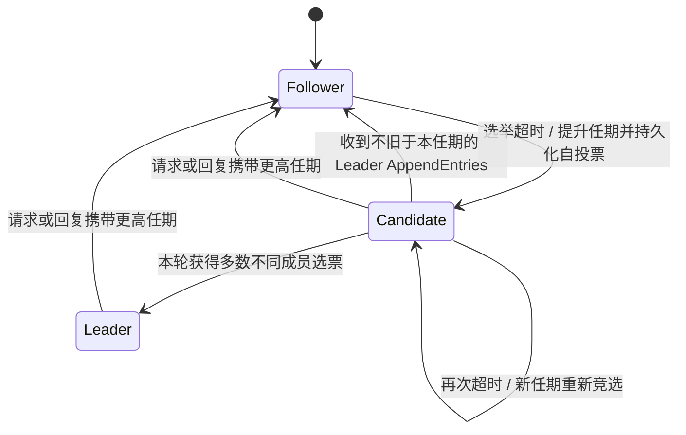
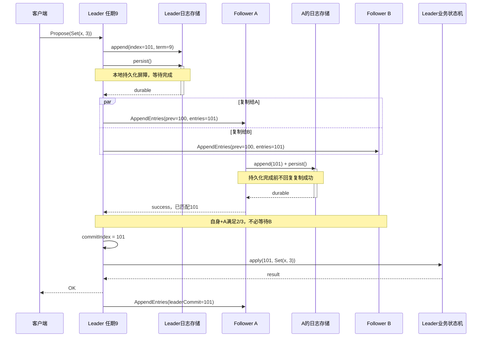

---
tags:
  - 高性能存储
  - 分布式存储
  - Raft
  - 共识算法
status: 已完成
---

# Raft 算法与安全性：选举、日志复制与提交规则

> Raft 的难点不是“选一个 Leader，再把日志发给多数节点”，而是：**旧 Leader 没有立即消失、新 Leader 的日志也未必最长时，怎样保证已经确认的历史永远不会被推翻？** 答案是一组相互依赖的规则：任期隔离、每任期一票、日志新旧比较、前缀匹配，以及只对当前任期条目直接计数提交。

[[7.11 Primary-Backup 与 Multi-Raft]] 已经解释复制状态机在存储架构中的位置；本篇深入**单个 Raft 组内部的算法和安全性**，不重复 Multi-Raft 的分片与调度。多数集合为什么相交，可先看 [[7.10 Quorum 读写]]；但“有交集”本身不等于完成了共识协议。

> [!info] 范围与资料口径
> 本篇采用固定投票成员集合、非拜占庭、允许崩溃后恢复的基础 Raft 模型。DDIA 第 1 版第 8、9 章提供故障模型、全序广播和共识背景；它没有展开 Raft 的完整处理规则，因此下文的协议判据以 Ongaro 与 Ousterhout 的扩展论文为依据。代码与五节点推演是教学整理，不是生产实现。PreVote、CheckQuorum、LeaseRead 等扩展不与基础规则混写。[^ddia-model][^ddia-consensus][^raft]

## 1. 先确定 Raft 到底承诺什么

### 1.1 复制的是有序命令，不是任意时刻相同的内存

假设业务是一个确定性键值状态机，依次执行 `Set(x, 1)`、`Add(x, 2)`，最终得到 `x=3`。Raft 为这些命令确定一个不可相互矛盾的已提交顺序，各副本再按该顺序执行。

**副本可以落后，但不能在同一个日志位置应用不同命令。** A 已经应用到 100，B 只应用到 98，并不违反 Raft 安全性。此刻两台机器的状态可能不同；若 B 以后也应用到 100，且状态机是确定性的，结果应当与 A 在位置 100 的状态相同。

时间、随机数和外部查询结果不能由各副本在 apply 时各自随意生成。例如“把当前时间写入记录”，应先确定要复制的时间值，再作为命令输入；否则相同日志不保证相同结果。

### 1.2 安全性与可用性不是同一个条件

固定投票节点数为 `n`，多数阈值为 `q = floor(n/2) + 1`。这是**配置中的投票节点数**，不是此刻在线节点数。5 个投票节点只剩 2 个在线时，不能把阈值临时改成 2。

| 问题 | Raft 的要求 |
| --- | --- |
| 消息丢失、重复、乱序、延迟，或发生网络分区 | 不能因此提交矛盾历史；安全性不靠“消息一定及时到达”维持 |
| 长期无法联通多数派 | 可以停止提交；安全不意味着一直可写 |
| 网络和调度恢复到足够稳定、可用多数派能够通信 | 才有条件选出稳定 Leader 并持续推进 |
| 节点重启 | 持久化的任期、投票、日志等承诺必须仍在 |
| 节点撒谎、磁盘遗忘已确认数据、任意软件破坏 | 超出这里的基础故障模型，不能继续套用原安全性证明 |

DDIA 将“崩溃后可能回来，稳定存储保留而内存丢失”称为 **crash-recovery**。不要把支持重启恢复的实现描述成节点永不回来的 crash-stop 模型。[^ddia-model]

配置变更需要另外维护新旧配置之间的法定人数约束，不是修改一个数组就完事；相关背景见 [[7.15 Membership 与故障检测]]。下面的公式与示例均不包含联合共识状态。

## 2. 三种角色、两个编号、四种进度

### 2.1 角色与任期

Follower 响应复制和投票；Candidate 发起选举；Leader 为新日志定序并驱动复制。`currentTerm` 是节点目前见到的最大任期，是逻辑编号而非物理时钟。

每次**本地开始新一轮选举**，节点提高自己的任期并投自己一票。不存在一个让全组同步加一的中央计数器；分区中的节点可能看到不同任期。



图中没有“Candidate 按原任期一直重试”的回路。新一轮竞选必须区分于上一轮，旧选票不能拿来凑数。基础 Raft 的 Leader 也不是“心跳计时器到期就重新竞选”；失去多数派后主动退位是 CheckQuorum 一类扩展的行为。

**同一个任期至多选出一个 Leader，不同任期的两个节点却可能同时自认为是 Leader。** 较旧者尚未收到新任期消息时不一定知道自己已经失去地位，但它不能据此制造新的矛盾提交。外部设备或服务能否拒绝旧主的副作用，则还要看 [[7.12 Lease 与 Fencing]]。

### 2.2 日志条目里的 term 不能随复制改写

日志条目可抽象为 `(index, term, command)`。`index` 是命令的位置，`term` 是创建它的 Leader 任期。例如当前 Leader 在任期 9 复制一条 `(index=100, term=7)`，该条目的 term **仍是 7**。

| 变量 | 含义 | 最容易混淆的点 |
| --- | --- | --- |
| `lastLogIndex` | 本地逻辑日志末端 | 末尾可以有未提交条目；不是业务可见水位 |
| `commitIndex` | 本节点已知可以提交到的位置 | 它是对提交事实的本地认知；各节点获知时刻可以不同 |
| `lastApplied` | 本节点状态机已经执行到的位置 | 不必与 commitIndex 同步前进，但不能越过它 |
| `matchIndex[p]` | 本届 Leader 已确认成员 p 匹配的日志前缀末端 | 是有证据的复制进度，不是猜测，也不是 p 的 applied 进度 |
| `nextIndex[p]` | 下一次拟向 p 发送日志的起点 | 是探测/发送游标，可能需要回退；不能用于多数派提交计数 |

正常状态下，本节点满足 `lastApplied <= commitIndex <= lastLogIndex`。Snapshot 以后日志不再从数组第 0 格开始，逻辑位置与物理下标的换算见 [[7.24 Raft 持久化、崩溃恢复与 Snapshot#5. Snapshot 改变的是存储表示，不是逻辑编号]]。

### 2.3 一条命令有多个不同的“完成”

接收请求、追加内存日志、本机持久化、复制到多数派、按协议提交、应用到状态机、返回客户端，分别回答不同问题。尤其不要把一次 `send()`、磁盘完成通知或 follower 的复制 ACK，当成“客户端命令已经执行成功”。

在本文的崩溃恢复模型中，多数派计数使用的是**已经满足持久化要求的匹配证据**；成功投票与成功复制回复之前需要什么落盘屏障，由下一篇展开。

## 3. 选举：为什么“任期大”与“日志新”必须分开判断

### 3.1 先处理任期，再处理具体 RPC

基础协议中，只要收到的 Raft 请求或回复携带更高任期，就更新 `currentTerm`、清空新任期的投票记录并转为 Follower。即使最后因为日志太旧而拒绝投票，也不能忽略已经观察到的更高任期。

低任期请求被拒绝；低任期回复不能影响新一轮状态。Candidate 收到同任期 Leader 的合法 `AppendEntries` 时退回 Follower，但**不能因此清空本任期已经投过的票**。任期相同不意味着本节点拥有再次投票的资格。

这里说的是基础 Raft RPC；PreVote 使用“试探未来任期”的语义，不能把它不加区分地送进上述通用分支。[^raft]

### 3.2 RequestVote 的两个门槛

请求包含 `term`、`candidateId`、`lastLogIndex`、`lastLogTerm`。接收方在完成任期处理后，只有同时满足以下条件才授票：本任期尚未投票，或者此前就投给同一候选人；以及候选人的日志至少与自己一样新。

日志新旧按以下顺序比较：

1. 最后一条日志的 `lastLogTerm` 较大者更新。
2. 最后任期相等时，再比较 `lastLogIndex`，较大者更新；相等也满足“至少一样新”。

| 本地 `(lastLogTerm, lastLogIndex)` | 候选人提供的二元组 | 日志资格 |
| --- | --- | --- |
| `(5, 100)` | `(6, 80)` | 可以：最后任期更高，虽然日志更短 |
| `(5, 100)` | `(4, 200)` | 不可以：更长也不能弥补最后任期更旧 |
| `(5, 100)` | `(5, 99)` | 不可以：同任期但末端落后 |
| `(5, 100)` | `(5, 100)` | 可以：一样新 |

表格只比较日志资格，不替代 RPC 任期、成员身份与“是否已经投票”的检查。**候选人的 currentTerm 很大，不代表它携带的日志很新。** 空日志可用 `(0, 0)` 作为初始边界；日志压缩后没有剩余条目时，最后条目的二元组来自 Snapshot 边界。

### 3.3 每任期一票，究竟证明了什么

任意两个多数派必有交集。如果一个节点在同一任期不会给两个不同候选人投票，那么两个候选人就不可能各自得到多数票。因此，同一任期至多一个 Leader。

这条论证依赖**投票记忆跨重启保留**。节点投给 A、回复成功、重启遗忘、再投给 B，会让交集节点“双投”，数学上的交集仍然存在，协议保证却已经失效。

### 3.4 选举计时器不要“见包就重置”

收到非过期的当前 Leader 的 `AppendEntries`，或实际授予选票，才是应重置选举等待的典型事件；开始自己的新一轮选举也会重新设置随机等待。仅仅收到过期包、拒绝的拉票请求、普通业务流量，不应一律延长选举等待。

特别地，Leader 的任期合法但 `prevLogIndex/prevLogTerm` 不匹配时，节点仍可能据此确认 Leader 活跃并重置计时器；**选举计时器处理**与**日志一致性检查是否成功**不是一件事。

选举超时应显著大于正常 RPC 往返、持久化与调度开销，随机化用于分散竞选。论文中的毫秒示例不是跨机房、共享磁盘和所有测试框架通用的配置。MIT 实验本身也有特定心跳与选举时限要求，必须与生产参数分开。[^raft][^mit]

## 4. 日志复制：先证明前缀一致，再处理真正的冲突

### 4.1 AppendEntries 的字段就是一份前缀承诺

| 字段 | 意图 |
| --- | --- |
| `term / leaderId` | 说明发送者所在任期与身份 |
| `prevLogIndex / prevLogTerm` | 证明本次复制起点之前的最后一项能对齐 |
| `entries` | 从 prevLogIndex 后面开始的一段连续日志，可以为空 |
| `leaderCommit` | 传播 Leader 已知的提交水位 |

接收方不能只检查“我有没有这个下标”。下标存在而 term 不同，仍表示日志分叉。对应前缀校验失败时，应拒绝本次复制，由 Leader 调整 `nextIndex` 后重试。

### 4.2 Follower 的处理顺序

**先看任期，再验证前驱，再逐项对齐，最后推进提交认知。** 若 `entries` 中某条与本地同 index 的条目 term 不同，才从该冲突点删除本地未提交后缀，并追加 Leader 的剩余条目；已经相同的条目跳过，不重复执行。

有两个删除动作必须严格区分：前缀压缩是用快照代替已应用历史；冲突截断是删除旧主留下的未提交分叉。[[7.19 副本落后与日志截断]] 讨论二者的运维影响，本篇强调后者的触发条件。

> [!warning] 不要把“收到了更短的 AppendEntries”当成删尾命令
> Follower 已经正确保存 1…8。此时一份延迟的旧请求只携带 5…6，且它们与本地匹配。应该保留 7…8，而不是把日志截成 1…6。空心跳同样不能无条件删尾。**没有发现实际冲突，就没有冲突截断的依据。**

如果冲突触及本节点已提交前缀，正常 Raft 不应产生这种情况；应将它视为不变量破坏或存储损坏，停止危险路径并诊断，不能“按 Leader 指令覆盖掉就好”。

### 4.3 Follower 的提交上界不是自己的任意末端

把本次 RPC 成功验证的末端记为 `covered = prevLogIndex + entries.size()`。空请求时，covered 就是已验证的前驱位置。Follower 在成功处理请求后，可以按下面的等价实现式推进：

`commitIndex = max(commitIndex, min(leaderCommit, covered))`

外层 `max` 表示旧消息不能让提交水位倒退。内层 `min` 表示：即使本地另外还有一个更长的、尚未被这次请求证明正确的后缀，也不能把它直接交给状态机执行。这是基础论文 `AppendEntries` 规则的边界写法，不是在定义所有工业实现的独立心跳消息。[^raft]

### 4.4 Leader 怎么维护复制证据

新 Leader 对其他节点的 `nextIndex` 从自身日志末端后面开始尝试，对匹配前缀则从保守的已知位置开始。失败时回退；成功时依据**这一份请求覆盖的末端**推进 `matchIndex`，不是依据回调时刻 Leader 已增长到的新日志末端。

生产实现可以批量发送、流水线发送、按冲突任期跳跃回退，但这些优化不能把 `nextIndex` 的猜测变成已确认事实。需要处理以下异步边界：

| 晚到的事件 | 正确处理目标 |
| --- | --- |
| 上一任期的复制成功回复 | 不能推进本届 Leader 的 matchIndex |
| 已经退位后收到旧请求成功回复 | 不再以 Leader 身份提交 |
| 同任期较旧的成功回复晚于新回复 | 匹配进度只取单调增加的证据，不回退 |
| 一份过时失败晚于已经成功的较新请求 | 不能把 nextIndex 退回已确认匹配点之前；须核对请求上下文 |
| 同一成员的选票或 ACK 重复到达 | 一个成员只占一个法定人数位置 |

简单实现可以串行化单 peer 的探测；并行实现应携带任期、角色代次、请求覆盖范围或等价上下文。锁可以保护一次读取，却不能让解锁等待 RPC 期间的假设自动保持有效。

## 5. 提交：多数派还必须搭配当前任期条件

### 5.1 Leader 的直接提交规则

在固定投票集合 `V` 中，Leader 寻找可以推进到的最大位置 N：N 大于自己的 `commitIndex`；至少 q 个投票成员已确认匹配到 N；并且 **`log[N].term == currentTerm`**。

一旦这个当前任期条目被提交，N 之前的整个日志前缀也随之提交，包含旧任期条目。提交水位只增不减。这里的“直接”指**Leader 按副本数量得出提交结论**；不意味着 Follower 接收 `leaderCommit` 时也要对每个旧条目重新检查“等于我的 currentTerm”。

> [!important] 最值得记住的完整句子
> **当前任期条目得到多数派持久化匹配确认后，Leader 才能据此直接推进提交水位；它之前的旧任期前缀随之一并提交。旧任期条目不能仅因后来凑够多数副本，就被新 Leader 按同样方式直接判定提交。**

### 5.2 一次普通写的时序

下面使用容易实现和检查的保守顺序：Leader 先完成本地持久化，再发送复制；Follower 持久化后回复；Leader 集齐当前任期条目的多数派证据，提交、应用并返回业务结果。它不是唯一允许的高性能调度顺序。



`persist()` 在图中表示存储层持久化契约，不是标准库函数。图揭示了三个不同的等待：本机存储、法定人数、业务 apply。最后传播提交水位可以搭载后续复制或心跳，不需要等待所有 Follower 知道已提交才返回客户端。

异步实现可能让本地落盘与对端落盘重叠，但必须仍满足任期、投票、日志和回复之间的依赖。不要把上图的串行步骤直接推成固定“1 RTT + 1 fsync”的实测延迟公式；持久化调度细节见下一篇。

### 5.3 为什么需要 current-term 限制：五节点反例

所有节点先有共同且已提交的 `index=1, term=1`。用 A/B/C/D/E 表示五个投票节点，方括号只写条目任期。

| 阶段 | 发生的事情 | 关键日志状态 |
| --- | --- | --- |
| ① 任期 2 | A 为 Leader，把 index=2 的条目 x 复制给 B，然后失联 | A、B 为 `[1,2]`；其余为 `[1]`。x 只有 2/5，未提交 |
| ② 任期 3 | E 得到 C、D、E 的选票，写入冲突条目 y，但未复制给其他节点 | E 为 `[1,3]`；A、B 仍为 `[1,2]` |
| ③ 任期 4 | E 失联，A 获得 A、B、C 的选票；把 x 补给 C，并在自己追加 term=4 的条目 z | A=`[1,2,4]`；B、C=`[1,2]`；D=`[1]`；E=`[1,3]` |

此时 x 确实在 A、B、C 上：**3/5**。但 x 的 term 是 2，A 当前任期是 4，不能仅凭这次数量直接提交 x。

下面是从阶段③出发的**两条互斥分支**，不是连续发生的两个步骤：

**分支 A：z 没复制出去，A 再次崩溃。** E 恢复并发起任期 5 选举。E 的最后日志任期是 3，C 的是 2，D 的是 1，因此 E 可以获得 C、D、E 的多数票。新 Leader E 能把 index=2 改成 y，覆盖此前 C 上的 x。x 虽然曾有多数副本，但并未按 Raft 规则提交。

**分支 B：A 先把 z 持久化复制到 B、C。** 现在 term=4 的 z 得到 3/5 确认，A 可以提交到 index=3，连同前缀 x 一起提交。此后 A、B、C 的最后日志都至少包含任期 4 的这个前缀；仍只有最后日志任期 3 的 E 不能通过它们的日志资格检查。E 即使提高自己的选举任期，也不能把旧日志凭空变新。

![[图片/SVG/Raft-旧任期多数副本与当前任期提交.svg|900]]

图里的数字是**日志条目 term**，列位置才是 index。绿色不是“复制过就自动安全”，而是已经通过当前任期提交规则保护的前缀。这个例子按扩展论文 Figure 8 的机制重新组织，目的在于把“多数副本”和“不可推翻的提交”拆开观察。[^raft]

### 5.4 No-op 的作用与局限

新 Leader 可以追加一条当前任期 no-op。它不改变业务值，但一旦按多数派规则提交，就建立当前任期的已提交锚点，顺带确定之前日志前缀的提交地位。

**no-op 不是发出去就生效**，仍需要持久化、复制与提交。也不是每次写都要多写一个 no-op：正常的当前任期业务条目同样可以充当提交锚点。新主处理只读请求时为何常先建立这个锚点，与第 8 节的读屏障有关。

## 6. 五条安全性如何接成一条证明链

| 性质 | 它约束什么 | 关键机制 |
| --- | --- | --- |
| Election Safety | 每任期至多选出一个 Leader | 不同成员多数票 + 持久化的一任期一票 |
| Leader Append-Only | Leader 在自己的任期内不覆写已有日志 | 新条目只追加；角色切换后旧主可作为 Follower 被修复 |
| Log Matching | 同 index、同 term 的条目对应相同前缀 | 同任期唯一 Leader + AppendEntries 前驱校验 |
| Leader Completeness | 已提交条目出现在以后任期 Leader 的日志中 | 选举日志限制 + 多数派交集 + 当前任期提交规则 |
| State Machine Safety | 同一 index 不会被不同节点应用为不同命令 | 提交前缀不变 + 只按顺序应用已提交条目 |

**日志匹配的直觉证明。** 初始空前缀一致。之后一次复制只有在前驱匹配时才能接上；同任期 Leader 又不会为同一位置制造第二条不同命令。因此，一旦某位置的 index 与 term 对齐，前面的构造历史也跟着对齐，而不是只碰巧“最后一格相同”。

**Leader Completeness 的证明思路。** 取一个当前任期 T 已提交的条目 e，反设 U 是第一个选出“不含 e 的 Leader”的更高任期。提交 e 的多数派与选举 U 的多数派相交，交集选民 v 在投票时仍持有 e：否则，在 U 之前就已经有不含 e 的 Leader 让它删掉了 e，违背“第一个”的选择。

接下来考察候选人的日志。它的最后任期更低，会被 v 拒绝；最后任期相同但更短，也会被拒绝。相同最后任期且足够长时，同任期 Leader 的追加与日志匹配规则迫使它包含 v 的相关前缀。最后任期更高时，这些条目来自 T 之后、U 之前的某个 Leader，而那些 Leader 按“第一个缺失者”的假设都含 e，候选人的该前缀也必须含 e。于是“不含 e 却能拿到 v 的票”矛盾。旧任期条目通过已提交锚点的前缀关系得到同样保护。[^raft]

这不是对任意故障实现的形式化验证。它刻意展示证明依赖：**去掉持久化投票、前缀检查、选举资格或当前任期提交限制中的任一项，都不能继续引用同一条证明链。**

## 7. C++17：把两个核心判据写成可测试的纯函数

这里不实现网络、定时器、WAL 或状态机；只把日志新旧比较与直接提交判定独立出来。所有输入应来自同一个受保护的 Leader 状态视图；调用者负责保证投票集合固定、每个成员只出现一次、回复已通过任期校验。

将本节三个 `cpp` 代码块依次拼接，可得到完整的 `raft_rules.cpp`。这类单线程纯计算没有跨主体等待，不强行追加时序图。

### 7.1 类型与日志新旧比较

字段名故意写明 term 与 index，避免两个同类型整数的位置被误读。函数比较的是**日志最后条目**，而不是 RequestVote 的选举任期。

```cpp
#include <algorithm>
#include <cassert>
#include <cstddef>
#include <cstdint>
#include <iostream>
#include <stdexcept>
#include <vector>

using Index = std::uint64_t;
using Term = std::uint64_t;

struct LastLog {
    Term term;
    Index index;
};

constexpr bool at_least_as_new(LastLog candidate, LastLog local) noexcept {
    return candidate.term > local.term ||
           (candidate.term == local.term && candidate.index >= local.index);
}
```

### 7.2 用多数派水位寻找候选提交位置

示例尚未压缩日志，`terms[0]` 是 term=0 的哨兵。`durable_match` 包含**所有投票成员**各一项，包括 Leader 本人的已持久化进度。排序只作用于值副本，不改变调用方保存的 peer 对应关系。

从大到小数第 q 项，正好是至少 q 个成员已经覆盖的最大位置。即使找到这个位置，仍要检查它是否属于当前任期；不能把这一步当成“可有可无的优化”。

```cpp
Index advance_commit(const std::vector<Term>& terms, Term current_term,
                     Index old_commit, std::vector<Index> durable_match) {
    if (terms.empty() || terms.front() != 0 || current_term == 0 ||
        durable_match.empty() || old_commit >= terms.size() ||
        !std::is_sorted(terms.begin(), terms.end()) ||
        terms.back() > current_term) {
        throw std::invalid_argument("invalid leader state");
    }
    const auto last = static_cast<Index>(terms.size() - 1);
    for (const auto matched : durable_match) {
        if (matched > last) {
            throw std::invalid_argument("match index exceeds leader log");
        }
    }
    std::sort(durable_match.begin(), durable_match.end());
    const auto quorum = durable_match.size() / 2 + 1;
    const Index candidate = durable_match[durable_match.size() - quorum];
    if (candidate > old_commit &&
        terms.at(static_cast<std::size_t>(candidate)) == current_term) {
        return candidate; // 同时提交此前的整个前缀。
    }
    return old_commit; // 已提交水位不因旧回复或旧任期计数而倒退。
}
```

日志任期非递减，因此如果多数派能覆盖到的最大位置仍属于旧任期，它前面不会另藏一个当前任期条目可以直接提交。这个函数只适用于本节声明的固定投票集合；联合共识要分别计算新旧配置的法定人数，不能直接套一个中位数。

### 7.3 用反例而不是“正常情况”测试它

第一组断言检查“短而新”胜过“长而旧”；第二组把第 5 节的危险分支和安全分支直接编码。异常分支验证不合理的复制进度不会被悄悄接受。

```cpp
int main() {
    assert(at_least_as_new({6, 80}, {5, 100}));
    assert(!at_least_as_new({4, 200}, {5, 100}));
    assert(!at_least_as_new({5, 99}, {5, 100}));
    assert(at_least_as_new({5, 100}, {5, 100}));
    const std::vector<Term> terms{0, 1, 2, 4};
    assert(advance_commit(terms, 4, 1, {3, 2, 2, 1, 0}) == 1);
    assert(advance_commit(terms, 4, 1, {3, 3, 3, 1, 0}) == 3);
    bool rejected = false;
    try {
        static_cast<void>(advance_commit(terms, 4, 1, {4, 2, 1}));
    } catch (const std::invalid_argument&) {
        rejected = true;
    }
    assert(rejected);
    std::cout << "raft_rules: 7 checks passed\n";
}
```

编译运行：`g++ -std=c++17 -Wall -Wextra -Wpedantic raft_rules.cpp -o raft_rules && ./raft_rules`。测试依赖启用 `assert`，不要给本教学测试加 `-DNDEBUG`。通过这几个断言只说明纯函数覆盖的判据符合预期，不代表完整 Raft 已经通过并发、网络分区或崩溃测试。

## 8. 算法正确以后，还有哪些语义不能自动得到

### 8.1 “在 Leader 上读”并不自动线性一致

失联旧 Leader 可能仍认为自己是主；真正 Leader 也可能尚未把已提交条目 apply 到本地状态机。因此，直接读取某台自称 Leader 的本地内存，不足以保证 [[7.9 一致性模型]] 中的线性一致语义。

一种基于多数派确认的安全读路径，需要先具备当前任期已提交条目的锚点，为本次读建立与多数派通信相关联的领导权确认，取得安全读水位，再等本地 `lastApplied` 覆盖该水位后读取。实现中的 ReadIndex 会管理这些关联和等待；它不是“随便收到过一次心跳 ACK 就永久可读”。LeaseRead 则引入额外时间假设，应与此路径区分。[^raft][^etcd]

### 8.2 日志位置的一次应用，不等于业务请求永远只执行一次

一次命令已提交并执行，但客户端没收到回复，可能在新主上重试，形成另一条日志。Raft 不会仅凭两条命令内容相同就判断它们是重复业务请求。需要复制的 request ID、去重记录与缓存结果，详见 [[7.13 幂等 重试 与请求去重]]；下一篇解释为什么去重状态还必须进入快照。

外部发邮件、支付或控制设备等副作用，也不是“有共识日志就恰好一次”。状态机边界以外的系统必须配合幂等、事务或 fencing。

## 9. 实现与复习检查表

| 自问 | 应能给出的解释 |
| --- | --- |
| 为什么不能按在线节点数计算多数派？ | 在线集合不是受协议保护的配置，会产生互不相交的两个“多数派” |
| 请求任期很高，但日志末端很旧，应该怎样处理？ | 先接受更高任期并退位，再按日志资格拒绝授票 |
| 为什么旧任期条目在 3/5 上仍可能被覆盖？ | 若未由当前任期条目的提交保护，日志更“新”的候选人仍可能合法当选 |
| 收到更短或空的 AppendEntries 能删尾吗？ | 不行；只有 incoming entries 中出现真实冲突才触发后缀删除 |
| 为什么 Follower 不检查每条旧日志都等于 currentTerm？ | 它接收的是 Leader 的提交水位传播；旧前缀可以间接提交 |
| Leader 崩溃前没发出 leaderCommit，条目就没提交吗？ | 不一定；客观提交事实与其他节点是否已获知是两件事 |
| 现在应该去测什么？ | 一任期一票、晚到回复、重复 RPC、Figure 8 分支、分区后重选与恢复，而不只测正常复制 |

学习实验可以对应 MIT 6.5840 的选举、复制与持久化测试；具体名称随课程版本变化，本文查阅的是 2026 年 Lab 3。它是进一步验证实现的入口，不是本文已经运行过的测试。[^mit]

下一步沿 [[7.24 Raft 持久化、崩溃恢复与 Snapshot]] 检查“投过的票不会遗忘、承诺的日志不会丢、删除的前缀有可恢复替身”。这些不是算法外的可选优化，而是上面安全性推理的存储前提。

## 10. 参考资料

[^ddia-model]: Martin Kleppmann. *Designing Data-Intensive Applications*, 1st ed., O’Reilly, 2017. Chapter 8, “System Model and Reality” 与 “Safety and liveness”，印刷页 306–309。来源为项目教材正文，用于故障模型与安全性/活性区分。
[^ddia-consensus]: 同上。Chapter 9, “Total Order Broadcast”，印刷页 348–352；“Fault-Tolerant Consensus”，印刷页 364–369。该书明确采用共识算法高层解释，不提供完整 Raft 实现规范。
[^raft]: Diego Ongaro, John Ousterhout. *In Search of an Understandable Consensus Algorithm (Extended Version)*, 2014-05-20. §§5.1–5.6、§8；Figures 2、3、8、9。原论文：[扩展版 PDF](https://raft.github.io/raft.pdf)。用于具体 RPC、提交限制和安全性证明；图与推演为重新组织而非原图复制。
[^etcd]: etcd-io/raft 官方仓库，`README.md` 的 Features 与 Usage。查阅日期 2026-09-06；参照 commit `3cbf6a74be3fa392edd8b64253fcd11c3ce5649b`：[固定版本 README](https://github.com/etcd-io/raft/blob/3cbf6a74be3fa392edd8b64253fcd11c3ce5649b/README.md)。仅用于区分库的读路径、扩展与接入职责，不将某实现扩展当作基础协议必需项。
[^mit]: MIT 6.5840, Spring 2026, [Lab 3: Raft](https://pdos.csail.mit.edu/6.824/labs/lab-raft1.html)。查阅日期 2026-09-06。用于实验分层与测试边界，实验接口、命令和时间限制以选定学期为准。
