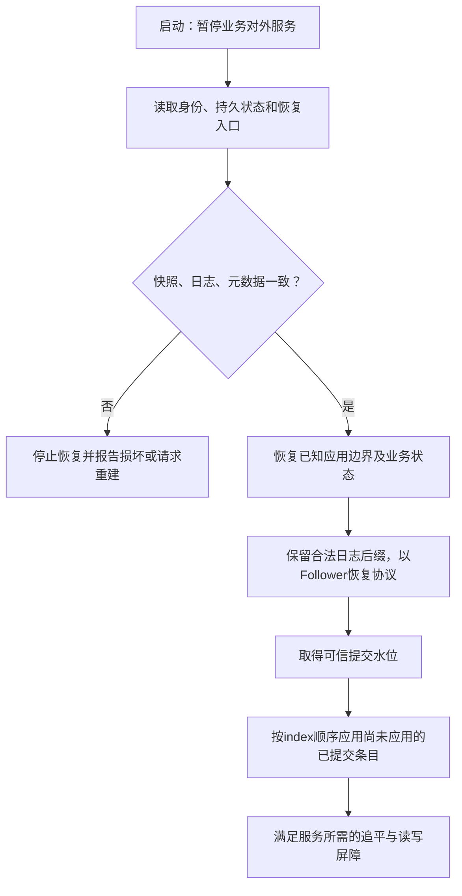
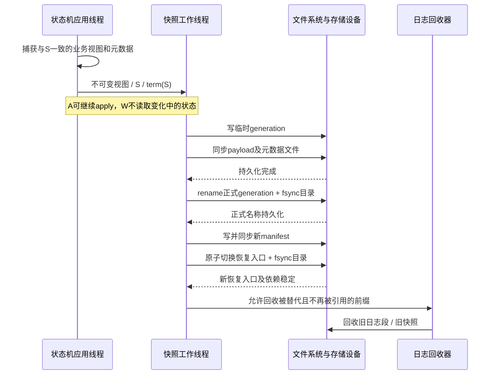

---
tags:
  - 高性能存储
  - 分布式存储
  - Raft
  - 崩溃一致性
  - Snapshot
status: 已完成
---

# Raft 持久化、崩溃恢复与 Snapshot

> 上一篇的安全性证明假定：节点不会忘记已经投出的票，不会丢掉已经确认保存的日志，也不会把同一段历史恢复成两个不同状态。本篇回答这些假定怎样落实到存储层：**先持久化什么、再允许谁继续；重启时相信什么、不相信什么；日志删除以后由谁代表那段历史。**

先阅读 [[7.23 Raft 算法与安全性：选举、日志复制与提交规则]]，尤其区分“多数派复制、提交、应用”。本篇沿 [[6.1 WAL 与 Crash Consistency]] 的崩溃一致性模型进入 Raft，不重复单机 WAL 的全部实现；追赶速度与保留窗口的运维分析仍由 [[7.19 副本落后与日志截断]] 承担。

> [!info] 范围与资料口径
> 协议仍采用固定投票成员、非拜占庭、稳定存储在崩溃后保留的基础 Raft。DDIA 第 1 版支撑“稳定存储承诺”和“快照与复制位置必须对应”；TLPI 2010 年版支撑 Linux 文件 I/O 基础。具体 Raft 状态与快照规则来自原论文；etcd-io/raft 用作实现对照。本文的 generation/manifest 发布方案和故障注入矩阵是**依据这些契约构造的工程设计**，不是声称 Raft 论文规定了唯一磁盘格式。[^ddia][^tlpi][^raft][^etcd]

## 1. 必须持久化的是承诺，不只是业务数据

### 1.1 持久化状态与可重建状态

| 状态 | 基础 Raft 的要求 | 为什么 |
| --- | --- | --- |
| `currentTerm` | 持久化 | 重启不能退回旧任期、重新接受已经过期的权威 |
| `votedFor` | 与任期正确配对地持久化 | 同一任期不能因崩溃遗忘而投给另一候选人 |
| `log[]` | 已确认保存的内容必须可恢复 | Leader 的 matchIndex 依赖成功回复；虚假持久化会破坏多数派交集的意义 |
| `commitIndex` | 原论文列为易失；实现可以持久化 | 可以从正常协议进展重新获知，但不能从本地日志长度猜出 |
| `lastApplied` | 与业务状态机的恢复策略一致 | 内存状态机可从快照重建；持久化状态机必须有与数据一致的已应用水位 |
| `nextIndex / matchIndex` | 本届 Leader 的易失跟踪状态 | 新主重新建立复制证据；重启后不能直接相信旧主的发送猜测 |
| Snapshot 边界与状态 | 压缩所依赖的快照必须持久化 | 被删日志的状态已由它替代 |
| 配置与节点身份 | 必须有受控、可恢复的来源 | 同样的日志若按不同投票配置解释，法定人数与恢复语义会改变 |

原论文 Figure 2 的“易失变量”，不等于“工业实现禁止存盘”。例如 etcd-io/raft 使用 `HardState` 表达需要保存的任期、投票与提交状态；其 `MemoryStorage` 只是内存中的 Storage 实现，名字里的 Storage **不意味着它已经提供磁盘持久化**。[^raft][^etcd][^storage]

### 1.2 两个最小崩溃反例

**投票先回复，后落盘。** 节点在任期 8 向 A 回复授票，尚未保存 `(term=8, votedFor=A)` 就崩溃。重启后它又向 B 授票。即使其业务数据库一字未丢，一任期一票已经失效。

**日志先 ACK，后落盘。** 五节点中 A/B/C 都只在内存接受某条当前任期日志，却告诉 Leader 已保存。Leader 按 3/5 返回成功，随后相关节点掉电，条目消失。问题不是“Raft 数学不成立”，而是实现把易失状态冒充了证明所需的持久化证据。

DDIA 在 crash-recovery 模型中明确指出：如果节点可以遗忘此前声称保存的数据，就破坏了 quorum 算法依赖的条件。[^ddia]

## 2. 持久化顺序：用依赖屏障约束回复

### 2.1 基础实现的安全顺序

| 事件 | 对外继续之前必须满足的条件 |
| --- | --- |
| 开始新一轮竞选 | 新任期与自投票记录先可恢复，再依赖这张票竞选 |
| 收到更高任期的请求或回复 | 任期更新及投票状态变更按序持久化，不能重启后遗忘已观察到的新任期 |
| 授予选票 | 授票记录可恢复后，才发送成功授票回复 |
| Follower 成功接受新日志/冲突替换 | 会被成功回复承诺的日志前缀及相关持久状态已经稳定 |
| Leader 将自身计入持久化多数派 | 本地对应日志已达到所要求的持久化屏障 |
| 用 Snapshot 替代旧日志 | 新恢复入口与其依赖的数据先稳定，再回收旧前缀 |

这里的存储屏障应有清楚的成功/失败结果。发生 `EIO`、`ENOSPC` 或校验失败时，不得继续回复“已持久化”；节点需要停止相关确认路径，并按实现策略退出、修复或从健康副本重建。具体错误处理可衔接 [[6.3 fsyncgate 与 EIO 处理]]。

“先稳定，再回复”不意味着每条消息都必须执行一次新的 `fsync()`。旧任期请求被拒绝、重复请求没有产生新持久状态、或多个变更共同落入一次 group commit，都可能不需要逐条刷盘。关键是回复依赖的状态已经满足屏障。[[6.2 Group Commit]] 可以摊薄屏障成本，但不能取消依赖。

### 2.2 异步 I/O 不会自动保证这个顺序

状态机事件线程产生一批修改，日志线程提交写入，再将持久化完成事件送回。等待磁盘时释放互斥锁可以减少阻塞，但继续处理消息前必须考虑：当前任期是否变化、这次回调属于哪一批、较旧的写完成会不会覆盖新 HardState、缓冲区是否仍有效。

一种容易审计的设计是：持久化工作串行排序，批次具有唯一编号，依赖批次 k 的回复等待 k 已稳定；出现存储失败后，不再让更晚批次带着错误前提继续确认。异步写缓冲区由请求对象持有直到完成，不能引用已经出栈或被复用的序列化临时缓冲。

这与“Raft 整体只能单线程”不是一回事：协议事件处理可以串行，磁盘、网络与业务执行仍可在明确的依赖关系下并行。

### 2.3 对照 etcd-io/raft：Ready 是待履行的职责，不是已经完成的 I/O

在本文固定查阅的源码版本中，库把网络与磁盘 I/O 留给调用方。`Ready` 提供待保存的条目、HardState、Snapshot、待发消息和已提交条目；调用方必须完成相应职责，之后再按接口契约推进。[^etcd]

它的 README 还明确区分：此前 Ready 批次的日志与最新 HardState 必须先稳定；同一批次内的部分消息发送可以与条目持久化重叠。因此，**不要把保守实现的“所有消息先刷盘”当作所有高性能实现唯一允许的调度**，也不要反过来把“可以并行”理解成“成功复制 ACK 可以随便提前”。不同消息类型与异步存储接口具有不同的依赖。

本文不提供可直接替代该版本接入循环的伪代码；接入具体库时，应固定版本同时核对 `Ready`、`Advance`、异步存储选项和消息类型，而不是只抄几行大意。

## 3. 日志存储：能重建一条合法历史，才算落盘成功

### 3.1 区分三种“日志”

**Raft 逻辑日志**决定分布式命令顺序；**Raft 存储层 WAL**保存这个逻辑日志及相关持久状态的变更；**业务存储引擎 WAL**保证本地业务数据的崩溃一致性。三者可以共享一些设施，但不是天然同一个序列。

例如一条 Raft 命令可以生成多个键更新，一个节点也可以为多个 Raft 组共享物理 WAL。因此，磁盘字节 offset、引擎 sequence number 与 Raft index 不能随意相等赋值。把 Raft index=100 理解为“某个 RocksDB 文件的第 100 条”会在恢复与快照中直接出错。

### 3.2 磁盘格式不由论文固定，但需要可验证边界

工程上可把记录编码为长度、格式版本、记录类型、组标识、index/term、payload 与 checksum；也可能采用有事务能力的 KV 引擎。目标不是某个固定头长度，而是恢复时能识别：记录是否完整、属于哪个组、顺序是否连续、是否发生截断/替换，以及哪些元数据引用哪些数据。

| 恢复观察 | 可以做什么 | 不能做什么 |
| --- | --- | --- |
| 格式与校验正确、顺序连续的记录 | 重建本地保存的日志 | 仅凭它在盘上，就交给状态机执行 |
| 按存储协议可确认属于未完成写入的尾记录 | 按协议丢弃或回滚该尾部 | 不分位置地从第一个错误开始静默删除全部内容 |
| 已确认历史中间出现坏块、校验错误或 index 空洞 | 报告损坏，停止危险路径并修复/重建 | 自行填空、猜测命令、继续投票掩盖问题 |
| checksum 正确但对应旧 generation | 结合权威恢复入口判断是否仍有效 | 扫描到“看起来最大”的文件就自动采用 |

Checksum 识别内容损坏，不证明 Raft 已提交，也不证明文件命名空间已经持久。记录校验的细节可参考 [[6.4 Torn Write 与 Checksum]]。

### 3.3 冲突截断与追加不一定必须由一个原子系统调用完成

设 Follower 的未提交后缀与 Leader 从 index=k 开始冲突。实现需要让重启后得到合法日志前缀，并避免新旧后缀混杂。使用原子批次或记录“替换后缀”的 WAL 操作，是容易审查的方案。

但不能笼统断言“截断后、追加前崩溃一定破坏 Raft”。**若只删除未提交后缀，恢复成较短但合法的前缀，且没有提前成功确认新条目，Leader 以后仍可以重传。** 真正不允许的是删除已提交历史、留下逻辑空洞、恢复出错配 term/command，或在替换尚不可恢复时发出成功回复。

采用什么文件操作是实现选择；必须保持哪条恢复不变量，才是协议与存储层之间的契约。

## 4. 崩溃恢复：恢复了日志，不代表恢复了提交事实

### 4.1 一个容易写错的启动过程

磁盘记录到 index=120，绝不意味着可以直接设 `commitIndex=120` 并重放到业务状态机。118…120 可能只是旧 Leader 提出的未提交尾部，未来仍可能被替换。

同样，不能把磁盘尾部当垃圾全部删掉：其中可能包含已经提交、但本节点尚未收到提交通知的日志。**保存有效日志；只应用已确认提交的前缀。**

恢复首先验证节点身份、配置来源、持久化 term/vote、选定快照与日志连续性，再以 Follower 身份恢复协议。旧的 Leader 身份、nextIndex 和其他节点的匹配猜测不应随进程恢复而直接继承。



图里的“取得可信提交水位”，可以使用实现已正确持久化的 commit 信息，也可以通过 Leader 的提交传播和后续协议进展补齐；不能用本地日志长度代替。是否可以在追平前提供某种弱一致性读，是业务接口的独立选择，不是恢复步骤默认许可。

### 4.2 两种状态机恢复策略

| 策略 | 恢复起点 | 后续动作 |
| --- | --- | --- |
| 内存状态机 + 持久化快照 | 装载 Snapshot 到 S，并令应用进度对应 S | 保留 S 后的日志，获得提交信息后从 S+1 顺序应用 |
| 持久化状态机 | 从引擎中读取业务数据及与之原子一致的 appliedIndex=A | 不再应用 <=A 的命令；从 A+1 处理确认提交的新条目 |

第二种策略不能把“更新业务值”和“持久化 appliedIndex”分成两个互不相关的承诺。执行 `Add(x, 1)` 后数据已落盘、appliedIndex 尚未落盘就崩溃，重启重放会多加一次；反过来先保存 appliedIndex，再丢失业务更新，就会跳过一条根本没完成的命令。

常见做法是把业务修改、appliedIndex 和业务去重状态放进**同一个原子存储事务/WriteBatch 或等价恢复协议**。不在同一个存储事务中的外部副作用，仍需额外幂等或事务衔接。单机 replay 的原理见 [[6.18 WAL 回放幂等性]]。

### 4.3 commitIndex 不持久化时，已经提交的命令怎么办

它们不会因为本地忘了 commitIndex 就变成可以任意覆盖的历史。Raft 的选举限制仍约束新主必须带着已提交前缀，新 Leader 可以通过提交一条当前任期日志重新确定该前缀的提交地位，再传播给 Follower。

因此，丢失提交水位的本地认知主要意味着需要重新获知与等待，而不是允许恢复程序自行发明一个提交结果。全组重启也仍需要满足稳定存储、配置与合法选举的前提；不能读取几个“最长文件”，在启动脚本里自行投票宣布历史。

若存储实现已经持久化 commit 或 applied 信息，它们必须与对应日志/Snapshot 一致。持久化的应用边界 A 自身意味着此前业务已经执行过已提交前缀，恢复时不能把协议的已知进度留在 A 以下却忽略这条事实。

## 5. Snapshot 改变的是存储表示，不是逻辑编号

### 5.1 Snapshot 是已应用前缀的状态总结

Snapshot 不需要逐条保存被压缩的命令，而是保存“按顺序执行到 S 后的状态”。在生成这个一致性视图时，应满足 `S <= lastApplied <= commitIndex`；状态内容必须**恰好对应 S**，不能混入 S 之后才发生的修改。[^raft]

| 内容 | 为什么不能省 |
| --- | --- |
| 业务状态 | 代表已压缩日志产生的效果，包括删除结果等 |
| `lastIncludedIndex = S` | 明确快照覆盖到哪里，后续应从哪里继续 |
| `lastIncludedTerm = term(S)` | 前缀已删除后仍可验证日志边界 |
| 对应位置的成员配置 | 恢复时能正确解释协议成员与法定人数 |
| 应用层去重/会话结果状态 | 避免快照恢复后遗忘已经执行过的业务请求 |
| 格式版本、完整性信息及必要标识 | 工程实现中识别不兼容、错组、截断和损坏 |

其中 `lastIncludedTerm` 是位置 S 上那条日志的原始任期，**不是制作快照时的 currentTerm**。节点可以在任期 9 为 index=100、term=7 的已应用状态制作快照，同时继续保存 currentTerm=9。安装旧一些的状态快照也不能让 currentTerm 回退到 7。

配置与去重状态必须来自与业务数据相同的逻辑切面。复制一个“最新配置文件”并不自动得到位置 S 的配置。客户端去重状态的保留/过期策略也应明确；快照机制本身不会提供无限期请求去重。

### 5.2 Snapshot index、compacted index 与 first index

先看**立即压缩到快照位置**的简化布局：S=100、term(S)=7，剩余条目是 101…103。此时保留一个虚拟边界 `(100,7)`，第一条真实可读取日志为 101。虚拟边界不是新的业务命令，不应再次 apply。

`term(100)` 仍能回答 7，所以 Leader 可以发送 `AppendEntries(prevLogIndex=100, prevLogTerm=7, entries=101...)`。没有这个 term，仅保存“从 101 开始”，就丢了前驱一致性检查需要的信息。

![[图片/SVG/Raft-Snapshot边界与日志坐标.svg|900]]

图的上半部分表示制作快照前的逻辑历史；下半部分表示物理前缀被释放之后的紧凑布局。两者的 **101 仍然是同一个 Raft index**，只是数组下标变化了。

生产系统可能已经有 S=100 的快照，却为了服务落后副本仍保留 81…100。此时 `compactedIndex=80`、`firstIndex=81`，不等于 SnapshotIndex+1。**快照覆盖水位与实际日志回收水位必须分别记账。** 图和下一节代码选择二者相等的简化模型，不把这个选择推广成所有存储接口的规律。

### 5.3 C++17：显式区分边界、已压缩和不存在

下面是只负责读取 term 的纯函数，不包含磁盘读写、不负责安装快照。把本节三个代码块依次拼接得到 `raft_log_window.cpp`。所有输入由调用方保证来自同一份一致状态，`tail` 按 index 连续排列；本模型不保留 S 之前的冗余日志。

先定义结果类型。使用 `std::optional` 避免给“查询失败”伪造一个 term=0；错误原因也明确区分“太旧已压缩”和“尚不存在”。

```cpp
#include <cassert>
#include <cstddef>
#include <cstdint>
#include <iostream>
#include <limits>
#include <optional>
#include <vector>

using Index = std::uint64_t;
using Term = std::uint64_t;

enum class LookupKind { Boundary, Entry, Compacted, Unavailable };
struct TermLookup {
    LookupKind kind;
    std::optional<Term> term;
};
```

查表时先比较再做减法，避免无符号下溢。这里 `tail[0]` 对应 S+1；逻辑 index=S 由快照元数据回答，不能从 tail 里取。

```cpp
TermLookup term_at(Index index, Index snapshot_index, Term snapshot_term,
                   const std::vector<Term>& tail) {
    if (index < snapshot_index) {
        return {LookupKind::Compacted, std::nullopt};
    }
    if (index == snapshot_index) {
        return {LookupKind::Boundary, snapshot_term};
    }
    const Index distance = index - snapshot_index; // 此处保证 >= 1。
    if (distance > tail.size()) {
        return {LookupKind::Unavailable, std::nullopt};
    }
    const auto offset = static_cast<std::size_t>(distance - 1);
    return {LookupKind::Entry, tail.at(offset)};
}
```

最后测试压缩边界、首条真实日志、未来缺失日志、极大无符号索引以及空尾部。`term_at` 不计算 `snapshot_index + tail.size()`，避免额外的加法溢出路径；一个生产存储对象在创建时还应验证整个索引范围合法。

```cpp
int main() {
    const std::vector<Term> tail{7, 8, 8}; // 对应101、102、103。
    auto lookup = [&](Index i) { return term_at(i, 100, 7, tail); };
    assert(lookup(100).kind == LookupKind::Boundary);
    assert(lookup(100).term == std::optional<Term>{7});
    assert(lookup(101).kind == LookupKind::Entry);
    assert(lookup(102).term == std::optional<Term>{8});
    assert(lookup(99).kind == LookupKind::Compacted);
    assert(!lookup(99).term.has_value());
    assert(lookup(104).kind == LookupKind::Unavailable);
    assert(lookup(std::numeric_limits<Index>::max()).kind ==
           LookupKind::Unavailable);
    assert(term_at(100, 100, 7, {}).kind == LookupKind::Boundary);
    assert(term_at(101, 100, 7, {}).kind == LookupKind::Unavailable);
    std::cout << "raft_log_window: 10 checks passed\n";
}
```

编译运行：`g++ -std=c++17 -Wall -Wextra -Wpedantic raft_log_window.cpp -o raft_log_window && ./raft_log_window`。测试使用启用状态的 `assert`。它只验证索引边界，不验证 Raft 安全性、快照原子发布或断电恢复。

## 6. 创建本地快照：一致性切面与持久化发布是两件事

### 6.1 先捕获对应 S 的视图，再后台写文件

在应用推进路径上取得一个与 appliedIndex=S 对应的稳定业务视图，同时记录 term(S)、配置和去重状态。之后可以让 apply 继续推进，快照线程则只读取冻结视图。方法可以是短暂停顿并复制小状态、不可变数据结构、引擎一致性视图或写时复制；选择取决于状态大小和暂停预算。

不能先记录 S=100，稍后遍历一个仍被更新的 map，最后得到“部分数据来自 100、部分来自 105”的快照。DDIA 对“复制一份正在变化的数据文件为什么不够”的讨论，在这里仍然适用。[^ddia]

[[6.15 Snapshot 与 Sequence Number]] 中的引擎 Snapshot/MVCC 视图，以及数据库 Checkpoint，都可能成为捕获或导出状态的工具；但必须把它们与 **Raft applied index** 建立受控的一致对应关系。引擎快照通常也不自动附带 Raft 配置与应用去重语义。

### 6.2 一个可审查的 Linux 发布设计

下面采用**不可变快照 generation + 权威 manifest**。这是本文的工程设计：单个 Raft 组、同一已存在的本地文件系统、串行化发布/回收决策，并假设文件系统和设备正确履行 flush 契约。多目录、多盘、多文件快照或共享 WAL，需要扩展对应的依赖集合，而不是删减屏障。

Manifest 指向所选快照、边界、以及恢复所需日志信息；其格式、校验与替换协议需要由存储层定义。相关思想见 [[6.12 Manifest 与 Version Set]]。

| 阶段 | 操作 | 此阶段还不能做什么 |
| --- | --- | --- |
| ① 捕获视图 | 得到与 S 对应的不可变业务状态和元数据 | 不可因为内存视图存在就删除旧日志 |
| ② 写临时 generation | 写 payload 与元数据，检查短写、错误和完整性 | 不可让恢复入口指向半成品 |
| ③ 稳定快照实体 | 同步相关文件；若是多文件目录，还要同步其目录项 | 只同步一个文件不能代替整个依赖集合 |
| ④ 发布不可变名称 | 同文件系统 rename 到 generation 正式名，并同步受影响目录 | 文件名已可见不等于掉电后一定保留 |
| ⑤ 切换恢复入口 | 写并同步新 manifest，再原子替换权威入口并同步所在目录 | 不可混用新日志边界与旧快照 |
| ⑥ 回收旧前缀 | 新恢复入口及全部依赖已稳定后，再推进回收水位 | 不可删除仍被别组、旧恢复入口或必要元数据引用的段 |



这条时序最重要的不是函数名字，而是**回收箭头必须在新恢复链稳定之后**。Manifest 发布还要与并发日志追加、任期/投票更新保持协调：旧快照工作的完成事件不能把较新的 HardState 或日志尾部覆盖回旧版本。

### 6.3 为什么 rename 之后还要关心 fsync

TLPI 解释 `rename()` 通过修改目录项完成重命名，且受同文件系统限制。当前 Linux `fsync(2)` 文档进一步明确：同步文件本身，不一定同步包含它的目录项，因此需要额外同步目录文件描述符。[^tlpi][^fsync][^rename]

`rename()` 的运行时原子可见性，不等于包含快照内容、元数据和日志删除的一整组操作具备掉电事务性。不要以“原子 rename”三个字跳过 payload 的同步和恢复入口的持久化。若同步调用报告失败，不能继续发布成功，更不能据此回收唯一可恢复的旧前缀。

这个设计也不能突破故障模型：不兑现 flush 的设备、损坏的文件系统或丢失全部介质，不会因为多写一次 fsync 自动变安全。真实断电保证需要在目标文件系统、挂载选项和硬件上验证。

## 7. 崩溃窗口：恢复时只接受完整的一条依赖链

以下表格以第 6 节设计为前提。旧版本在切换完成前仍可恢复，未被权威入口选中的新 generation 只是候选文件，不自动具有权威性。

| 崩溃时刻 | 恢复策略 | 为什么安全 |
| --- | --- | --- |
| 新快照还在写 | 使用旧入口和旧快照/日志；清理未完成文件 | 旧日志尚未回收 |
| 快照实体已稳定，正式名称尚未稳定 | 仍依赖旧入口；不猜测临时名字 | 新快照尚未成为恢复依赖 |
| 新 generation 已稳定，manifest 尚未切换 | 旧入口仍有效；新 generation 可作为未引用文件保留 | 多一份文件不等于历史已经切换 |
| 入口替换发生，但目录同步尚未完成 | 按恢复协议验证幸存入口；只接受依赖完整的版本，无法验证则停止 | 不把“rename 已返回”当成持久化成功；此前仍未允许回收 |
| 新入口已稳定，旧日志还未删除 | 使用新快照与后缀；旧前缀按逻辑边界忽略 | 冗余数据可以晚删，不必重复 apply |
| 旧前缀删除后 | 使用已稳定的新快照和必要后缀 | 被删除的信息已经有稳定替代物 |

恢复验证不能简单地“挑 index 最大的快照”。一个新文件可能完整，却没有与之配套的配置、日志代次或恢复入口；一个 manifest 也可能存在，却指向尚未稳定的数据。**选择依据是协议认可且依赖完整的版本，而不是文件名排序。**

工程实现可以用另一种事务式存储布局替代这些文件步骤，但仍应能为每个崩溃点回答：恢复入口是什么，引用的数据是否稳定，旧数据何时才允许不再存在。

## 8. InstallSnapshot：传完字节以后还没结束

### 8.1 为什么需要它

当 Leader 已经回收了 Follower 所需的历史起点，普通 AppendEntries 不再拥有足够日志来补齐前缀。Leader 因而发送 Snapshot，Follower 先获得到 S 的状态，再从 S+1 补日志。各节点平时也可以根据自己的已应用状态独立制作本地快照，不需要每次由 Leader 全量分发。[^raft]

原论文描述了含 `offset` 与 `done` 的分块传输。MIT 2026 Lab 3D 则允许简化的快照传输设计；课程接口不是必须照搬的生产 wire format。[^mit]

### 8.2 安装需要跨越四个边界

**任期与来源边界。** 先处理 RPC 任期；旧 Leader 的消息不能推进状态。快照数据、目标组标识和元数据需要验证。包含旧日志任期的正常 Snapshot，不意味着发送方 RPC 的当前任期也旧。

**接收与持久化边界。** 分块数据进入 staging 区，检查 offset、长度、完整性与 generation；接收中途失败不影响现有可服务状态。分块 ACK、字节传完、完整快照持久化、Raft 安装完成，应有清楚的不同语义。Leader 不能把一个“收到分块”的回复当成 Follower 已经恢复到 S 的证据。

**日志与状态机边界。** 完整快照准备好以后，安装必须与正在进行的 apply 串行协调。不能一边用快照把状态替换到 100，一边让旧的异步 apply(99) 在稍后再次修改新状态。

**发布与资源释放边界。** 完成一致性切换与必要持久化后，再释放旧状态、旧文件与暂存缓冲。只要并发读取或发送任务仍引用旧 generation，就不能提前销毁；可以用引用计数、固定生命周期的句柄或统一串行回收协调。

### 8.3 日志后缀保留与否，看边界 index 和 term 是否都匹配

设新快照边界为 `(S,T)`：

| 本地情况 | 处理原则 |
| --- | --- |
| S 不大于本地已应用进度，属于过时/重复快照 | 不回滚业务状态；可忽略安装并按协议处理回复 |
| 本地在 S 有日志，且 term(S)=T | 可以保留 S 之后的后缀；后缀暂时存在不代表已经提交 |
| 本地边界不匹配，且属于正常落后、未提交分叉场景 | 丢弃不兼容日志，以新快照建立边界；后续由 Leader 补齐 |
| 与已知提交/已应用历史矛盾 | 不作为普通追赶默默覆盖，报告不变量破坏或损坏 |

边界相同但 command 不同，在正确实现中不应出现；这时应考虑损坏或算法 bug，而不是只比较 term 后掩盖它。安装后 `commitIndex`、`lastApplied` 和日志边界不能倒退；任何保留后缀仍需受提交水位限制才能 apply。

MIT 的实验说明专门提醒：快照只能推进应用状态，不能使应用回退；重启后下一条普通应用消息必须衔接已恢复的 Snapshot index。这个约束非常适合转化成测试断言。[^mit]

## 9. Snapshot、Checkpoint 与备份不要混为一谈

| 对象 | 主要回答什么问题 | 不能自动推出什么 |
| --- | --- | --- |
| 引擎读 Snapshot / MVCC 视图 | 某个引擎序列位置可见哪些版本 | 不一定是持久化导出物，更不自动对应 Raft index |
| 引擎 Checkpoint | 怎样获得可打开的数据库副本 | 不自动包含正确 Raft 元数据、去重状态或一致性切面协调 |
| Raft Snapshot | 怎样替代已应用日志前缀，并让副本恢复/追赶 | 不等于跨故障域、带保留策略且验证过恢复的灾备方案 |
| 备份 | 发生误删除、介质损坏或灾难后从哪里恢复 | 不自动赋予恢复节点原集群合法身份或当前配置 |

不能把一个旧 Snapshot 拷贝到空机器，沿用已经失去状态的投票成员身份，就认定它是正常重启。成员身份与配置要走系统支持的恢复或重新加入流程；永久丢失日志与 term/vote，已经不是“只丢了内存”。

## 10. 性能优化也要沿依赖关系设计

**快照频率。** 太频繁会增加序列化、压缩和写入开销；太少则增加日志空间与恢复回放时间。阈值可结合日志字节、回放耗时预算与状态大小，不应仅按“每隔固定条数”忽略命令大小差异。

**保留窗口。** 本地快照覆盖到 S，不代表必须立刻回收至 S。适当保留旧日志可以让短暂落后的 Follower 走增量路径。但某个 Follower 长期不可达时，也不必让所有本地回收永久停止；只要协议保留合法 Snapshot 路径，允许它以后安装快照。成员移除与本地保留策略是两件事，不能为释放日志擅自改变法定人数。

**快照循环。** 快照传输期间仍有新写入。如果安装完成时 S 之后所需的日志又被回收，就可能反复全量追赶。应协调传输期间的尾部保留、前台限流和追赶预算，定量分析见 [[7.19 副本落后与日志截断]]。

**共享 WAL。** 单组已经可以删除某段逻辑前缀，不代表整个物理 WAL segment 都能删。还要确认其他组、较新的持久状态和被恢复入口引用的数据已经迁移或不再需要；回收属于全局引用与生命周期管理问题。

## 11. 故障注入：测承诺边界，不只测进程能重启

下面是面向实现的测试设计，沿 [[6.10 崩溃注入测试]] 的方法扩展。它不是本文已经完成的整套实测报告。

| 注入点/场景 | 需要记录 | 必须验证的不变量 |
| --- | --- | --- |
| 保存 term/vote 前后崩溃 | term、votedFor、是否已回复 | 同任期不向不同候选人成功授票 |
| Follower 复制 ACK 前后崩溃 | index、term、落盘屏障、回复时刻 | 所有成功持久化承诺可恢复 |
| 日志替换后缀中途崩溃 | 冲突起点、旧提交点、存储批次 | 无已提交历史损失；恢复日志连续且不混杂 |
| 提交后、apply 前崩溃 | commit/applied、业务状态 | 恢复后最终应用已提交命令，不应用不确定尾部 |
| 数据修改与 applied 标记之间崩溃 | 原子批次、请求ID、结果 | 不重复执行，也不跳过未完成业务更新 |
| 快照写入/入口切换/回收之间逐点崩溃 | generation、manifest、S/T、保留段 | 至少有一条被协议认可的完整恢复链 |
| 旧快照与新日志并发到达 | apply顺序、快照ID、RPC任期 | 不回退状态，不让旧回调污染新状态 |
| 慢 Follower 超过日志窗口 | 复制进度、快照传输与尾部范围 | 安装后能继续追赶，而非 Snapshot 循环 |
| 写入失败、同步失败、记录损坏 | errno、校验结果、隔离动作 | 不发虚假成功 ACK，不静默丢弃可信历史 |

`kill -9` 只能终止进程，内核 Page Cache 仍可能存活并继续写回，因此不能单独作为真实掉电验证。课程的内存 Persister 也只模拟稳定存储接口，不测试你使用的 Linux 文件系统是否兑现持久化。应分别安排：协议模拟、进程崩溃、存储错误注入，以及隔离测试设备上的断电/掉盘实验。[^mit]

## 12. 复习：用六句话串起两篇笔记

**投票先形成可恢复承诺，才允许它成为选举证据。** 日志先满足持久化条件，才允许成功回复参与多数派计数。多数派匹配还要满足 [[7.23 Raft 算法与安全性：选举、日志复制与提交规则#5. 提交：多数派还必须搭配当前任期条件]]，才能得出直接提交结论。状态机只按序执行确认提交的前缀。Snapshot 必须与某个已应用位置形成一致切面。新的恢复入口及其依赖全部稳定后，旧日志才可以被安全回收。

把这六个边界串起来，才从“内存里跑起来的 Raft”走到“崩溃以后仍能解释自己历史的复制存储”。

## 13. 参考资料

[^ddia]: Martin Kleppmann. *Designing Data-Intensive Applications*, 1st ed., O’Reilly, 2017. Chapter 5 “Setting Up New Followers”，印刷页 155–156；Chapter 8 “System Model and Reality” 与 “Mapping system models to the real world”，印刷页 306–309。项目教材正文；用于一致快照、复制位置与稳定存储假设。
[^tlpi]: Michael Kerrisk. *The Linux Programming Interface*, No Starch Press, 2010. §13.3 “Controlling Kernel Buffering of File I/O”，印刷页 239–244；§18.4 “Changing the Name of a File: rename()”，印刷页 348–349。项目教材正文；现代 Linux 的具体 fsync/目录同步语义以当前手册补充，不照搬书中旧内核与磁盘缓存实现描述。
[^raft]: Diego Ongaro, John Ousterhout. *In Search of an Understandable Consensus Algorithm (Extended Version)*, 2014-05-20. Figure 2、§5.5、§7、§8，尤其 Figures 12–13。[扩展版 PDF](https://raft.github.io/raft.pdf)。用于协议持久状态、日志压缩、Snapshot 边界与安装规则，不规定本文的文件格式。
[^etcd]: etcd-io/raft，固定 commit `3cbf6a74be3fa392edd8b64253fcd11c3ce5649b`，[README.md / Usage](https://github.com/etcd-io/raft/blob/3cbf6a74be3fa392edd8b64253fcd11c3ce5649b/README.md)。查阅日期 2026-09-06。用于持久化、消息发送、应用与 Ready 的调用方职责；接口随版本演化。
[^storage]: 同一 commit 的 [storage.go](https://github.com/etcd-io/raft/blob/3cbf6a74be3fa392edd8b64253fcd11c3ce5649b/storage.go)，`Storage.Term/FirstIndex` 与 `MemoryStorage`。用于压缩边界 term 的保留、已压缩/不存在错误区分；MemoryStorage 本身不提供磁盘持久化。
[^fsync]: Linux man-pages，[fsync(2) / fdatasync(2)](https://man7.org/linux/man-pages/man2/fsync.2.html)，DESCRIPTION、RETURN VALUE、ERRORS。查阅日期 2026-09-06。用于文件持久化、必要元数据、目录项同步与错误边界。
[^rename]: Linux man-pages，[rename(2)](https://man7.org/linux/man-pages/man2/rename.2.html)，DESCRIPTION。查阅日期 2026-09-06。用于原子名称替换与同文件系统约束；不将其误解为多文件掉电事务。
[^mit]: MIT 6.5840, Spring 2026, [Lab 3: Raft](https://pdos.csail.mit.edu/6.824/labs/lab-raft1.html)，Part 3C 与 Part 3D。查阅日期 2026-09-06。用于持久状态/快照配对、恢复应用边界和测试层次；未将课程 Persister 当作真实磁盘实现。
