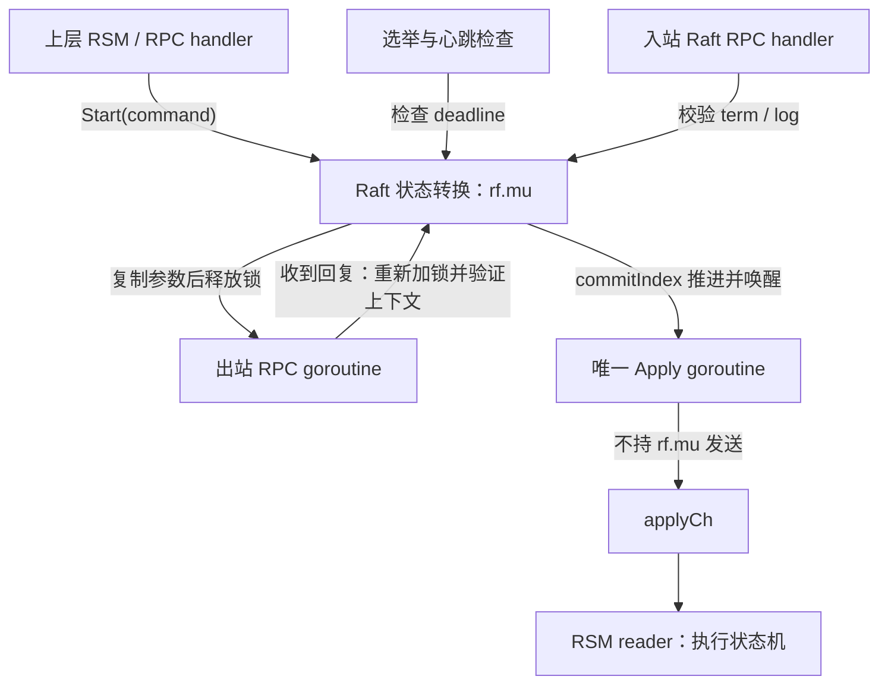
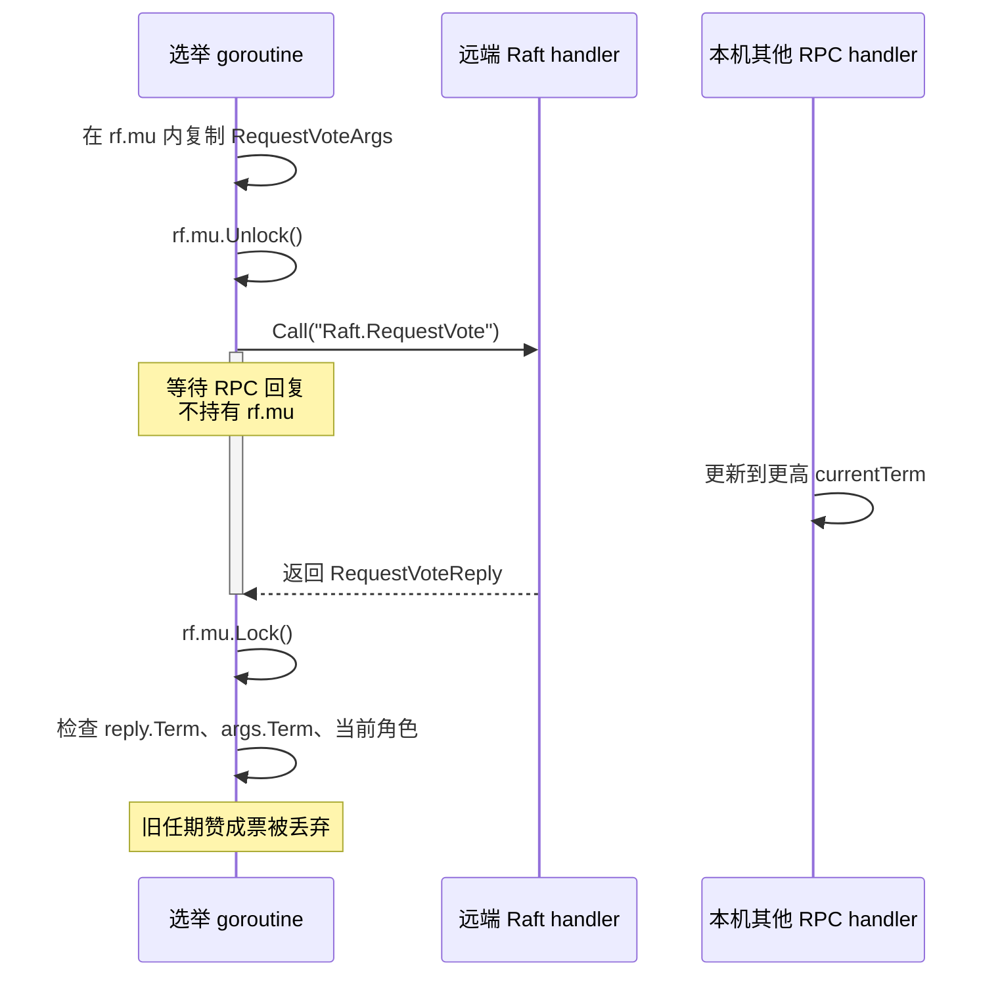
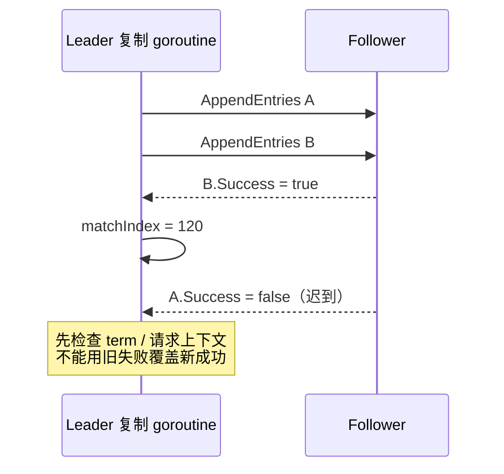
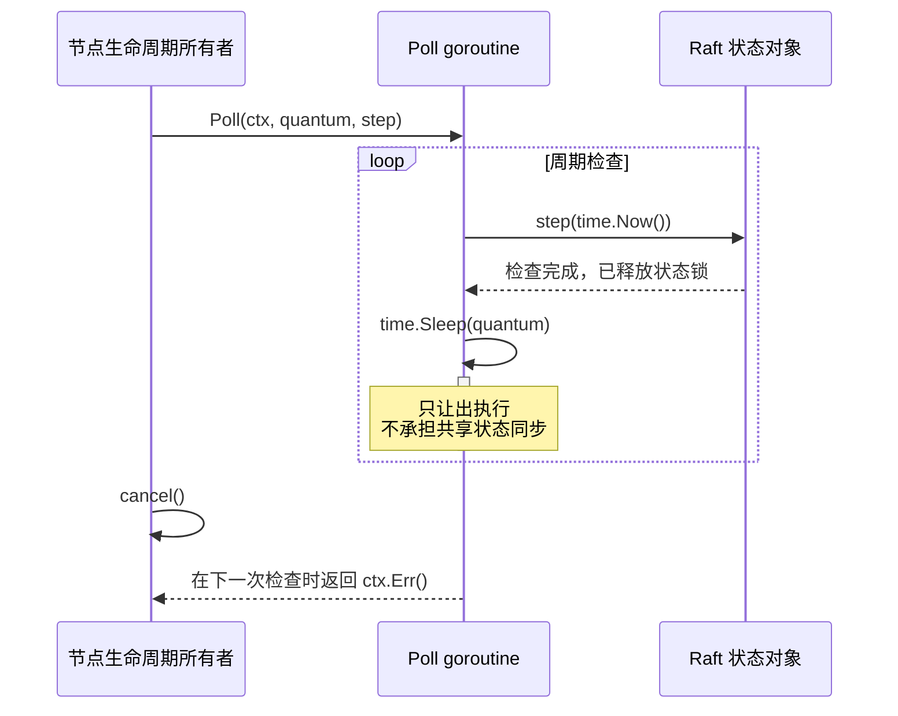
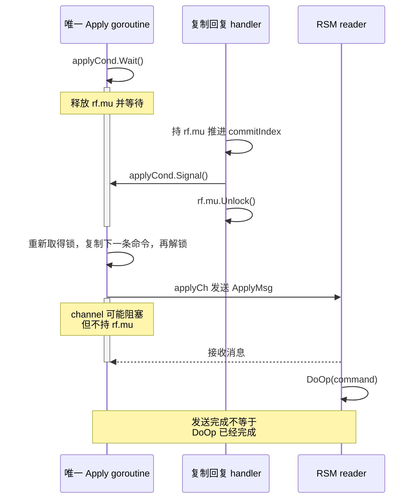
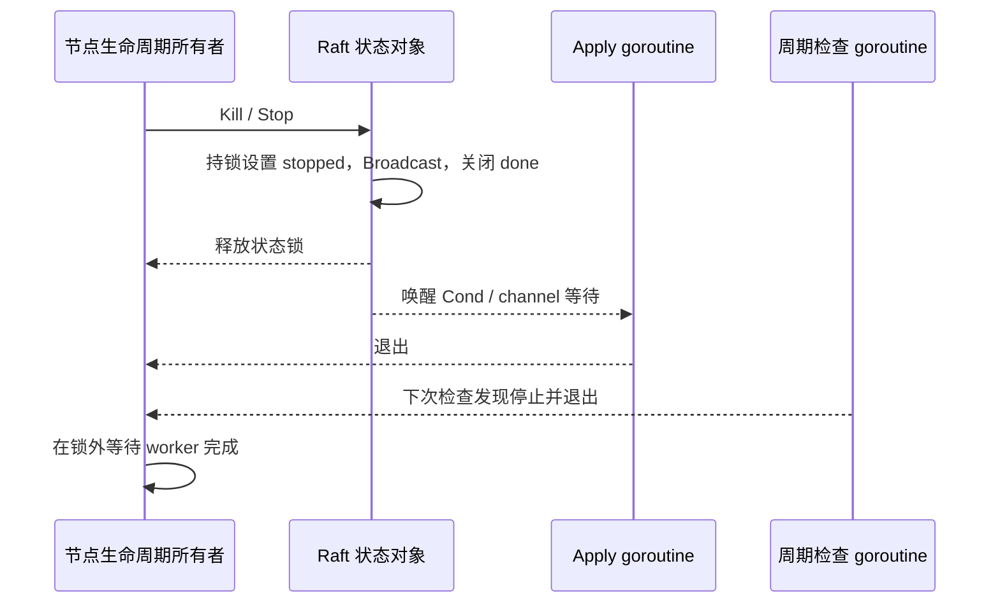

---
tags:
  - 高性能存储
  - 分布式存储
  - Raft
  - Go
  - MIT-6.5840
aliases:
  - MIT 6.5840 Raft 工程实现
  - Raft Go 并发与测试
status: 待审阅
course: MIT 6.5840 Spring 2026
sources_checked: 2026-09-06
---

# MIT 6.5840 Raft 工程实现：Go 并发、labrpc、定时器与测试

> **理解 Raft 论文，并不等于能够写出可靠的 Raft 程序。** 论文中的一次状态转换，在 Go 里可能被 RPC handler、选举循环、复制 goroutine 和 Apply goroutine 同时触碰。本篇解决的是：如何让并发程序始终遵守协议的不变量，以及如何把“偶尔测试失败”缩小成一段可解释的执行历史。

先读 [[7.11 Primary-Backup 与 Multi-Raft]] 建立复制日志与多数派的整体模型；本篇不重写完整安全性证明，而是把它落到锁、消息、定时任务和测试上。服务层怎样把 Apply 结果正确交给客户端，继续读 [[7.26 Replicated KV：线性一致性、请求去重、客户端重试与 Apply 状态机|7.24 Replicated KV]]。

## 1. 版本、资料和本篇的实现边界

**课程口径固定为 Spring 2026。** 这里的实验目录、阶段编号与测试入口来自当年官方实验说明，而不是某个往届完成版仓库。官方 Go 环境说明要求 Go 1.22 或更新版本。[^mit3][^go-setup]

| 项目 | 本篇采用的口径 |
| --- | --- |
| Raft 实验 | Lab 3：3A 选举、3B 日志、3C 持久化、3D 快照 |
| 主要目录 | `src/raft1/`；接口查看 `src/raftapi/raftapi.go` |
| 上层实验 | `src/kvraft1/` 与 `src/kvraft1/rsm/` |
| RPC / 编码 | 课程提供的 `labrpc`、`labgob`，不自行换成真实网络 |
| 持久化抽象 | `tester1/persister.go` 中的 `Persister`；不是生产磁盘 WAL |
| 示例范围 | 工程接入片段 + 一个可独立编译的轮询辅助函数；**不是完整 Raft 解答** |

资料分工也要分清：DDIA 第 8 章解释超时、时钟和部分失败；Raft 扩展论文规定协议；MIT 实验说明规定本届接口；Go 官方文档规定语言与标准库语义。本文标注“工程设计”的部分是据此组织出的实现方案，不是教材原文或官方参考实现。

> [!warning] 不要把相邻概念当成同一件事
> `Start()` 返回、日志落入本地持久状态、日志 committed、消息送入 `applyCh`、业务状态机执行完成、客户端收到回复，是不同的事件。后面的并发设计，就是在这些事件之间建立明确的先后关系。

## 2. 先确定对象职责，再决定开多少 goroutine

建议从“一把 Raft 状态锁 + 少量长期 goroutine”开始，不要先追求无锁或复杂事件框架。课程的结构与锁使用建议也强调：实现简单、持锁范围明确，比把所有状态改造成 channel 消息更容易审查。[^structure][^locking]



这张图的核心不是组件数量，而是两条边界：**跨网络等待时离开 `rf.mu`；交付业务命令时也离开 `rf.mu`。**

| 状态 / 资源 | 所有者与同步规则 | 是否进入 Raft 持久状态 |
| --- | --- | --- |
| `currentTerm`、`votedFor`、日志 | 同一 `rf.mu`；相关变化作为整体处理 | 是 |
| 快照边界、快照字节 | 与日志裁剪、持久化更新形成一致的一组变化 | 是 |
| 角色、选举 deadline | `rf.mu`；deadline 仅是本机运行时状态 | 否 |
| `commitIndex` | `rf.mu`；运行期间不倒退 | 通常按论文作为易失状态 |
| `nextIndex[]`、`matchIndex[]` | `rf.mu`；只使用当前领导任期内有效的回复 | 否 |
| `applyCh` 的发送顺序 | 一个长期 Apply goroutine 统一管理 | channel 本身不持久化 |
| KV 数据与业务去重表 | 上层状态机所有者；不由 Raft RPC handler 修改 | 由应用快照 / 日志回放恢复 |

**不要通过共享 Go 对象让不同 Raft 节点偷看彼此状态。** 测试中即使节点存在于同一测试环境，它们的协议交互仍必须经过课程提供的 RPC 接口。绕过网络层会绕过故障注入，使“测试通过”失去意义。[^mit3]

## 3. C++ 背景转 Go：真正需要补的是同步语义

Go 的垃圾回收减轻了内存释放负担，但不会自动解决数据竞争、死锁、逻辑过期或 goroutine 泄漏。不能把“对象还活着”理解成“对象中的数据仍然有效”。

### 3.1 六个足以影响 Raft 正确性的语言细节

| Go 机制 | 在本实验中必须理解的含义 |
| --- | --- |
| `go f(...)` | 启动并发执行，不保证它会在下一行之前开始或结束 |
| `sync.Mutex` | 保护共享数据和多字段不变量；不是给每个字段单独贴锁 |
| channel | 可以建立同步关系；有缓冲不等于消费方已经完成业务处理 |
| `map` | 与写并发的访问需要同步；改用 `sync.Map` 也不会让跨字段事务自动原子化 |
| slice / interface | 复制 slice 头或 interface 值，可能仍共享底层可变对象 |
| `defer` | 在函数返回时执行，不是离开某个循环迭代就执行 |

例如，把 `defer rf.mu.Unlock()` 放在一个长期循环体中，会把解锁推迟到整个 goroutine 函数返回。对短 RPC handler，函数入口 `Lock`、随后 `defer Unlock` 通常清楚；对需要中途解锁再加锁的函数，显式写出边界更容易审核。

Go 内存模型明确规定了 mutex 解锁 / 加锁、channel 通信等同步关系；**睡一段时间本身不会建立 happens-before**。因此，`time.Sleep()` 可以做周期检查的节拍，不能拿来证明另一个 goroutine 已经写完共享变量。[^go-mem]

### 3.2 把一个状态转换放进同一个临界区

开始一次选举时，至少要把以下关系保持为一个一致状态：

```text
currentTerm = 新任期
role = Candidate
votedFor = 自己
本轮计票状态 = 仅自己一票
electionDeadline = 本轮随机截止时间
需要持久化的状态已经保存，之后才发出依赖它的消息
```

若 `currentTerm++` 后解锁，过一会儿再把 `role` 改成 Candidate，其他 handler 就可能观察到“新 term + 旧角色 + 旧投票”的混合状态。即使每个字段的访问都没有 data race，协议仍可能错误。

同理，发现更高任期时，更新任期、退回 Follower、清理旧任期相关运行状态，必须属于同一次状态转换。**只因同任期 `AppendEntries` 而从 Candidate 退回 Follower，不应顺手清空该任期已经投出的票。**

## 4. 出站 RPC 的标准形状：锁内取快照，锁外等待，锁内复核

### 4.1 为什么“先检查自己是 Candidate”还不够

假设节点 A 在 term 8 发出 `RequestVote`，等待期间已经收到 term 9 的消息并退为 Follower。term 8 的赞成票随后才回来。内存没有越界、RPC 也没有失败，但这张票已经不属于当前选举。

所以，异步结果有两种有效性：**数据是否成功收到**，以及**它依赖的状态上下文是否仍然有效**。

下面是 Go 接入片段。`Raft`、`RequestVoteArgs` 等由实验实现提供；`persistLocked`、`recordVoteLocked` 是本文约定的辅助函数名，不能把这段当成独立程序。调用方必须先在 `rf.mu` 内复制本轮参数，随后解锁再调用它。

```go
func (rf *Raft) requestVoteOnce(peer int, args RequestVoteArgs) {
    var reply RequestVoteReply // 每次调用独享 reply，禁止跨 goroutine 复用。
    ok := rf.peers[peer].Call("Raft.RequestVote", &args, &reply)
    if !ok {
        return // 没收到回复，不计票；也不能断言远端没有处理。
    }
    rf.mu.Lock()
    defer rf.mu.Unlock()
    if reply.Term > rf.currentTerm {
        rf.becomeFollowerLocked(reply.Term) // 更新任期、角色和投票状态。
        rf.persistLocked()                 // 保存当前快照与 Raft 持久状态。
        return
    }
    if rf.state != Candidate || rf.currentTerm != args.Term {
        return // 等待期间角色 / 任期已经改变。
    }
    if reply.Term != args.Term {
        return
    }
    if reply.VoteGranted {
        rf.recordVoteLocked(peer) // 对 peer 去重；多数票只能属于这一轮。
    }
}
```



这张时序图揭示的是：**RPC 返回时，先前的程序上下文可能已经消失；重新加锁只保证读到一致状态，不保证还是原来的状态。**

`becomeFollowerLocked` 在这里由“更高 term”触发，可以清空旧任期投票；`recordVoteLocked` 必须防止重复回复被重复计票。若节点已停止，也应在实际集成实现中拒绝推进新的运行状态。这些是接入函数的契约，不是可以省略的细节。[^locking]

### 4.2 slice 复制只能解决一层共享

构造 `AppendEntries` 参数时，不能直接把仍可能被截断、复用或修改的日志 slice 交给另一个 goroutine：

```go
// Go 接入片段：调用时持有 rf.mu，lo/hi 已转换为合法的本地偏移。
entries := append([]LogEntry(nil), rf.log[lo:hi]...)
```

这会复制 `LogEntry` 元素，但若 `LogEntry.Command` 内部含 `[]byte`、map 或指针，底层载荷仍可能共享。工程上采用两种策略之一：提交以后禁止修改 command；或者在提交边界深拷贝所有可变载荷。不能把“RPC 序列化最终会复制”当成保护，因为序列化本身也可能与修改并发。

## 5. `labrpc`：测试的不是 TCP，而是失效条件下的协议

`labrpc` 是实验的故障注入边界：消息可能延迟、重排，请求或回复也可能丢失。`Call` 的传输结果与回复中的协议结果必须分开处理。[^mit3]

| 观察结果 | 可以得出的结论 | 不能得出的结论 |
| --- | --- | --- |
| `Call` 未取得回复 | 调用方没有可用回复 | 远端一定没有执行 |
| 收到 `VoteGranted=false` | 这次请求没有得到赞成票 | 远端已经宕机 |
| 收到 `AppendEntries.Success=false` | 需要按 term / 日志冲突原因处理 | 直接把 `nextIndex` 无条件减一就安全 |
| 发送方当前 `GetState()` 是 Leader | 本机仍认为自己是 Leader | 本机已取得当前读请求所需的多数派确认 |

**每次 RPC 的 args / reply 都应有明确的独占生命周期。** 不要在循环中反复修改同一个 args 地址，再交给多个 goroutine；不要让两个出站请求写同一个 reply 对象。

`labgob` 相关检查应从一开始就做：RPC 和被编码结构中的字段应可导出；嵌套结构也一样。通过 interface / `any` 保存的具体命令类型，需要在编码或恢复路径使用之前注册。日志中的操作结构应是值数据，不应带 mutex、channel 或运行时连接对象。

> [!warning] “再包一层 goroutine + timeout”并不自动取消 RPC
> 外层 select 超时后返回，内层 `Call` 仍可能在等待。若每次超时再开一个 goroutine，节点故障时就会积累未结束的调用。先保证 RPC handler 不因错误持锁永久阻塞，再讨论有界并发和取消机制；不要用超时掩盖泄漏。

## 6. 同一 Follower 的迟到回复：有锁也会发生逻辑回退

### 6.1 `matchIndex` 是证据，`nextIndex` 是下一次尝试位置

成功回复应根据**实际发出的那份参数**计算已匹配的末尾：

```text
matched = sentPrevLogIndex + len(sentEntries)
matchIndex[peer] = max(matchIndex[peer], matched)
nextIndex[peer]  = max(nextIndex[peer], matchIndex[peer] + 1)
```

这里的单调性限定在**同一次领导任期内**。重新当选 Leader 时，复制进度通常需要重新初始化，不能把上一任期缓存当成新任期可靠证据。

反例：请求 A 较早发出且失败，请求 B 较晚发出且成功。B 的回复先把 `matchIndex` 推到 120；A 的失败回复随后才到。无条件执行 `nextIndex--` 或套用 A 的冲突提示，可能把进度覆盖成过时状态。



**工程设计：** 初版可以给每个 Follower 一个长期复制 worker，使同一 peer 的复制请求串行，同时不同 peer 并行。心跳 / 新日志通知用容量为 1 的唤醒 channel 合并；**合并的是“需要再检查”的提示，不是日志内容**。worker 被唤醒后仍须读取当前日志和进度。

这减少同 peer 乱序回复的状态空间，但不能省掉任期检查，也不能保证卡住的 RPC 会自动退出。要进一步流水线化，则需要为请求保留任期、范围与请求代次，准确判断失败提示是否已经被更新的成功证据淘汰。

### 6.2 提交推进不能只写“多数派有这条日志”

Leader 按副本数量直接推进提交位置 `N` 时，除了多数派满足 `matchIndex >= N`，还必须满足 **`log[N].term == currentTerm`**。提交该位置后，前面的日志作为前缀一并提交；不能把旧任期日志单独按多数派计数直接认定为已提交。[^raft]

Follower 则要在接受 `AppendEntries` 并验证对应日志前缀后推进提交。上限必须落在本次请求证明匹配的前缀内，不能因为本地还残留一个更长的冲突后缀，就把它误应用。

心跳也不能跳过 `prevLogIndex / prevLogTerm` 校验。**空 entries 的 `AppendEntries` 仍是协议请求，不是一个可以无条件回成功的“存活探针”。**

## 7. 选举定时器：事件含义比毫秒数更重要

### 7.1 什么时候重置选举 deadline

把“重置”绑定到明确的协议事件，而不是“收到了任意网络包”。

| 事件 | 处理原则 |
| --- | --- |
| 开始一轮新选举 | 为本轮选取新的随机超时 |
| 给一个候选人实际投出赞成票 | 重置选举等待 |
| 收到任期不旧的合法 Leader 的 `AppendEntries` | 重置；日志不匹配可继续回复失败并修复日志 |
| 收到旧任期 `AppendEntries` | 拒绝，不替旧 Leader 延续选举等待 |
| 收到但拒绝 `RequestVote` | 不因“收到拉票”这一事实重置 |
| 收到与当前轮次无关的迟到回复 | 不用它延长当前选举等待 |

“看到更高 term 要退回 Follower”与“给 election deadline 续期”是两个动作，不能在一个万能 `reset()` 中不加区分地绑定。

这样做的动机是：落后节点反复拉票、旧 Leader 反复发心跳，都不能让一个本来应该开始选举的节点无限等待。故障检测为什么只能怀疑而不能证明宕机，见 [[7.15 Membership 与故障检测]]。

### 7.2 心跳周期与选举超时要配套

2026 Lab 3A 限制 Leader 心跳频率，并要求在可通信多数派存在时及时选出替代 Leader；不能机械复制论文中面向更高心跳频率的超时示例。[^mit3]

工程上应满足“选举等待明显长于正常心跳间隔 + 消息处理抖动”，并为多次分票留下时间。例如，心跳约 100 ms、选举区间约 500–900 ms 可以作为**待测试的起点**，不是论文要求、性能承诺或通用生产配置。

每轮随机化一次 deadline，不能在每次轮询时重新抽一个“还要等多久”，否则你可能一直把触发时刻向后推。时间应使用 `time.Now()` 及其保留的单调时钟信息计算本机时长；不要持久化选举 deadline，也不要比较两台机器的单调时钟绝对值。[^ddia-clock][^go-time]

### 7.3 实验基线：Sleep 轮询，而不是共享 Timer 的复杂重置

课程建议先使用睡眠检查循环，避免过早把难点变成 `Timer` / `Ticker` 的使用。下面是完整的独立辅助函数；它不实现选举，只提供节拍。`step` 应短小，内部按自己的锁协议决定是否需要选举。[^structure]

```go
package mechanics

import (
    "context"
    "errors"
    "time"
)
```

导入只有标准库，避免用某一届实验的私有类型包装一个本来独立的调度辅助函数。

```go
func Poll(ctx context.Context, quantum time.Duration, step func(time.Time)) error {
    if quantum <= 0 || step == nil {
        return errors.New("positive quantum and non-nil step required")
    }
    for {
        select {
        case <-ctx.Done():
            return ctx.Err()
        default:
        }
        step(time.Now())
        time.Sleep(quantum) // 不持有 Raft 或服务状态锁。
    }
}
```



`Sleep` 不能被这里的 context 立即打断；退出需要等当前 `step` 和睡眠结束，且仍受调度延迟影响。`step` 不应等待网络或 Apply。如果测试把“取消后必须瞬间退出”作为要求，就需要改造唤醒机制，不能只把 `quantum` 越调越小。

### 7.4 Go 1.23 的 Timer 语义不能与旧版本混讲

Go 1.23 引入的新 channel timer 行为，对 `Stop` / `Reset` 后的旧事件给出更强保证；是否启用还与主模块 `go.mod` 的 `go` 指令及相应 `GODEBUG` 设置有关。不是看 `go version` 一行就足够。[^go-timer]

因此应分别记住：旧语义中复用 channel timer 需要正确处理停止、消费状态与旧事件；新语义消除了特定的陈旧 channel 值问题，但**没有替你序列化选举状态、没有取消已经开始的回调，也没有让多个 ready 的 select 分支获得业务优先级**。`AfterFunc` 还属于另一类回调语义，不能套用 channel 接收的结论。

初版实现不要写一个声称“所有 Go 版本、所有 Timer 类型都适用”的 stop-drain-reset 口诀。采用单所有者管理 timer，或者先保留易于理解的 Sleep 检查基线。

## 8. 唯一 Apply goroutine：把协议提交转换成有序交付

### 8.1 条件变量等待的是谓词，不是“收到一次通知”

一个常见谓词是 `delivered < commitIndex`；没有可交付命令时睡眠，提交位置推进后被唤醒。条件变量必须与保护该谓词的同一把 mutex 协同使用。

Go `sync.Cond.Wait()` 会原子地释放关联锁并等待，被唤醒后重新加锁再返回。Go 文档明确说它不像某些系统那样无通知返回，但仍要用 `for` 重新检查条件：**得到通知，不等于重新取得锁时条件还满足**。[^go-cond]

下面仍是 Go 接入片段，**只描述尚未加入 Snapshot 的版本**。`delivered` 是 Raft 侧已成功送入 channel 的游标，不冒充业务侧真正执行完成的 `lastApplied`。

```go
func (rf *Raft) applyLoop() {
    for {
        rf.mu.Lock()
        for !rf.stopped && rf.delivered >= rf.commitIndex {
            rf.applyCond.Wait()
        }
        if rf.stopped {
            rf.mu.Unlock()
            return
        }
        index := rf.delivered + 1
        cmd := rf.entryAtLocked(index).Command // command 已冻结，不再修改。
        rf.mu.Unlock()
        msg := raftapi.ApplyMsg{
            CommandValid: true, CommandIndex: index, Command: cmd,
        }
        select {
        case rf.applyCh <- msg:
        case <-rf.done:
            return
        }
        rf.mu.Lock()
        rf.delivered = index // 只有本 goroutine 推进这个交付游标。
        rf.mu.Unlock()
    }
}
```



若在持有 `rf.mu` 时发送，业务 reader 一旦需要调用 Raft 的 `Snapshot()` 等方法，就可能出现锁等待环。把缓冲区从 0 改成 100 只能推迟缓冲用尽，不能证明等待环被消除。

### 8.2 Snapshot 必须进入同一条有序应用管线

加入快照后，不能让 `InstallSnapshot` handler 直接调用上层 `Restore()`，同时另一个 goroutine 继续 Apply 日志。快照安装与普通命令必须在应用层形成一个可解释的前缀顺序。

例如，已经恢复到 index 80，就不能再把 index 79 当新命令执行；如果快照覆盖了 1–80，后续应该从尚未应用、且位于该前缀之后的命令继续。Raft 的日志索引还要与裁剪后 slice 偏移分开，具体边界动机见 [[7.19 副本落后与日志截断]]。

所以，上一段无快照 `applyLoop` **不能原样当作 3D 完整方案**。3D 需要增加待交付快照、快照优先级 / 过期判定及游标协调，并保证所有交付来源仍遵守单一顺序。

## 9. 持久化与关闭：最容易漏掉的“不是算法”的算法条件

### 9.1 先兑现持久化承诺，再发送依赖它的回复

更新 `currentTerm`、`votedFor` 或日志等持久状态后，要在相应协议承诺对外可见之前保存。否则程序可能先投票或确认日志，崩溃后却忘记自己承诺了什么。

在本届实验，`Persister` 是测试用抽象；不能把调用 `Save` 写成“已经验证磁盘 `fsync`、SSD 掉电一致性”。实际存储的原子更新与 WAL 问题属于另一层。[^mit3]

开始支持快照后，要把快照字节与对应的 Raft 状态共同保存。**已经截断日志，却在下一次普通持久化中把 snapshot 参数重新传成 nil，会丢掉恢复前缀。** `nil` 快照只适用于还没有快照的阶段或明确的空状态，不能作为通用模板。

编码错误必须向实现者暴露；解码失败不能悄悄用全新空日志继续提供服务。恢复时先建立一个完整、有效的内存状态，再启动选举和复制 goroutine。

### 9.2 停止是广播事件，但不等于业务回滚

建议为每个节点定义统一的停止协议：设置 stopped 状态、关闭只关闭一次的 done channel、唤醒 Cond 等待者，最后由生命周期所有者等待 worker 退出。



不要在持锁状态下 `WaitGroup.Wait()`，因为退出中的 worker 可能也要取得那把锁。不要让 `applyCh` 的接收者随便 close channel，发送方可能还活着；一般用单独的 done 通知停止，并由约定的所有者在所有发送者退出后决定是否关闭。

已经提交的命令不会因某个 handler 超时或某个等待者退出而自动撤销。应用层的取消与重试问题留给下一篇处理。

## 10. 测试路线：先证明一个不变量，再增加一个故障维度

### 10.1 使用本届测试入口，先确认真的运行了测试

在 **2026 实验仓库的 `src` 目录** 使用 Makefile 入口；它会构建实验需要的程序，再进入相应包执行测试。不要把往届 `src/raft` 路径直接搬来。[^mit3]

```bash
# 在已经取得的 2026 实验仓库 src/ 中执行。
go version
cat go.mod
make RUN="-run 3A -count=1" raft1
make RUN="-run 3B -count=1" raft1
make RUN="-run 3C -count=1" raft1
make RUN="-run 3D -count=1" raft1
```

检查输出中有实际测试名称和执行记录；`PASS` 加上 “no tests to run” 不是成功证据。下面的循环是重复测试方式，不是本笔记声称已经得到的实验结果。

```bash
set -euo pipefail
mkdir -p logs
for i in $(seq 1 20); do
    if ! make RUN="-run 3B -count=1" raft1 >"logs/raft3B-$i.log" 2>&1; then
        echo "首个失败保存在 logs/raft3B-$i.log"
        exit 1
    fi
done
```

先把阶段单测稳定下来，再做全量回归。引入快照后必须重新跑选举、复制和持久化测试；“3D 通过”不能抵消一个后来引入的 3B 回归。

### 10.2 把失败现象映射到不变量

| 现象 | 首先调查什么 | 应构造的历史 |
| --- | --- | --- |
| 同任期看见多个 Leader | 是否重复投票、是否跨轮计票、投票是否保存 | 回复乱序 + 重启 |
| 没有故障也频繁重新选举 | 心跳阻塞、错误 deadline 重置、选举区间 | 人为延长处理时间 |
| 某一 index 应用不同命令 | 前缀校验、冲突截断、提交规则 | 分区后重连旧 Leader |
| 复制进度反复倒退 | 迟到失败覆盖成功证据 | 同 peer 回复重排 |
| 无进展但 CPU 很低 | 持锁等待 RPC / channel、Cond 未唤醒 | 停住 Apply 消费方 |
| goroutine 数量随失败轮数增长 | 超时包装泄漏、Stop 未广播、无限开出站调用 | 连续隔离目标节点 |
| 重启后丢已确认日志 | 持久化时机、编码字段、snapshot 被覆盖 | 确认之后立即崩溃 |

这些是诊断方向，不是单凭现象就能下结论的规则。比如“无进展”也可能是合法的少数派行为；测试前要先写清当前拓扑是否存在可通信多数派。

### 10.3 Race detector 查的是被执行路径上的内存竞争

`-race` 能发现很多共享变量错误，但不能证明 Raft 的协议安全性，也不能保证没有死锁、错计票或陈旧回复覆盖。它只观察实际执行到的路径；重复测试是扩大覆盖，不是把安全性变成概率投票。[^go-race]

运行时断言应带作用域：同一领导任期内的 `matchIndex` 不下降；同一节点运行期间的已提交 / 已应用前缀不倒退；只有 committed 命令进入 Apply。重启恢复时允许重新构建易失状态，不能把“进程全生命周期不允许回放”写成错误断言。

### 10.4 日志记录足以还原因果，不只记录“收到 RPC”

建议统一字段：`node / role / currentTerm / peer / sentTerm / rpcID / prevIndex / entriesEnd / commitIndex / delivered / event`。

示例是**假设的诊断历史，不是实测输出**：

```text
node=1 event=vote-send currentTerm=8 sentTerm=8 peer=2 rpcID=42
node=1 event=step-down currentTerm=9 reason=higher-term
node=1 event=vote-reply currentTerm=9 sentTerm=8 peer=2 granted=true
node=1 event=drop-stale-reply rpcID=42
```

这四行能回答“票为什么没被计入”；一百行没有任期和请求标识的“RPC success”不能。大量同步日志也会改变时序，先保留关键信息，再通过开关控制详细程度。

## 11. 性能优化的顺序：先有界，再减少重复工作

把 goroutine 数量、出站 RPC 数、待应用消息和日志内存都作为资源来管理。状态机消费速度低于提交速度时，增加 `applyCh` 容量只能吸收突发，不能创造处理能力；进一步的背压设计见 [[7.18 Backpressure 与过载保护]]。

值得做的优化是合并复制唤醒、按连续日志批量发送、利用冲突信息减少无效重试、及时清理已经裁剪的日志引用。不值得在初版做的是：为了减少一把 mutex，把一组本来清楚的不变量拆成几套难以证明的并发状态。

批处理和有界并发都不能改变确认条件：**不能因为队列满而丢弃已提交的 Apply，不能因为某个 peer 慢就把少数派当成多数派。**

## 12. 实现检查清单与自测问题

写完一轮实现，至少能逐条回答：

- 持久状态何时改变、何时保存，哪个回复依赖该保存已经完成？
- 每一条出站 RPC 在解锁前复制了什么，返回后重新验证什么？
- 每一种等待是否持锁；Kill 能否唤醒 Cond 和 channel 等待者？
- 日志 index 与 slice offset 是否分离；快照与普通 Apply 是否共用有序管线？
- 同 peer 回复乱序、消息丢失、隔离、重启时，哪个不变量仍然保证安全？

**自测 1：** term 8 的赞成票在 term 9 到达，为什么 `-race` 不一定报警？因为它可能完全在锁内被处理，错误是协议上下文过期，不是数据竞争。

**自测 2：** 给 `applyCh` 加大缓冲为什么不能修复持锁发送？因为只要消费者长期停住，缓冲最终仍会满，等待环依旧存在。

**自测 3：** `GetState()` 返回 Leader 为什么不能直接服务线性一致读？它只表示本机认知，不能排除自己已经被多数派中的新 Leader 替代。

**自测 4：** Go 1.23 的 Timer 改动解决了什么、没解决什么？它改善特定 channel timer 的停止 / 重置陈旧值语义；不替代锁、协议轮次检查或回调生命周期管理。

## 13. 参考资料与验证记录

[^mit3]: MIT 6.5840, **Spring 2026**, *Lab 3: Raft*, Parts 3A–3D，接口、目录与测试入口。https://pdos.csail.mit.edu/6.824/labs/lab-raft1.html 。核对日期：2026-09-06。
[^structure]: MIT 6.5840, *Raft Structure Advice*，goroutine 组织、单一 Apply、锁外 channel 发送。https://pdos.csail.mit.edu/6.824/labs/raft-structure.txt 。核对日期：2026-09-06。
[^locking]: MIT 6.5840, *Raft Locking Advice*，共享状态、完整状态转换与等待后复核。https://pdos.csail.mit.edu/6.824/labs/raft-locking.txt 。核对日期：2026-09-06。
[^raft]: Diego Ongaro, John Ousterhout, *In Search of an Understandable Consensus Algorithm (Extended Version)*, 2014，Figure 2、§5.2–§5.4、§7。https://raft.github.io/raft.pdf 。
[^ddia-clock]: Martin Kleppmann, *Designing Data-Intensive Applications*, **1st ed., 2017**, Chapter 8，“Unreliable Networks”“Monotonic Versus Time-of-Day Clocks”，尤其印刷页 288–289；本项目 PDF 第 310–311 页。教材用于时间与故障模型，不用于确定 2026 实验接口。
[^go-setup]: MIT 6.5840, *Go Setup*。https://pdos.csail.mit.edu/6.824/labs/go.html 。核对日期：2026-09-06。
[^go-mem]: Go 官方，*The Go Memory Model*，“Channel communication”“Locks”。https://go.dev/ref/mem 。核对日期：2026-09-06。
[^go-cond]: Go 官方，`sync.Cond`，尤其 `Wait`、`Signal`、`Broadcast` 的语义。https://pkg.go.dev/sync#Cond 。核对日期：2026-09-06。
[^go-time]: Go 官方，`time` 包，“Monotonic Clocks”。https://pkg.go.dev/time 。核对日期：2026-09-06。
[^go-timer]: Go 官方，*Go 1.23 Timer Channel Changes*。https://go.dev/wiki/Go123Timer 。注意工具链、主模块 go 指令与 `GODEBUG` 的共同边界。
[^go-race]: Go 官方，*Data Race Detector*。https://go.dev/doc/articles/race_detector 。核对日期：2026-09-06。

**本次验证范围：** 独立 `Poll` 辅助函数已在 Linux amd64 / Go 1.23.2、模块 `go 1.22` 下参与编译与 `go test -race -count=20 ./...`；RPC 与 ApplyLoop 是解释锁边界的接入片段，只做静态检查。未运行用户的 Raft 实现，也未运行或声称通过 MIT Lab 3 测试。课程源码路径根据官方实验说明核对，未取得课程骨架的具体 commit SHA。

Mermaid 图已完成本地解析与 Chromium 渲染检查；未在用户的 Obsidian 实例及其主题 / 插件组合中验证。
