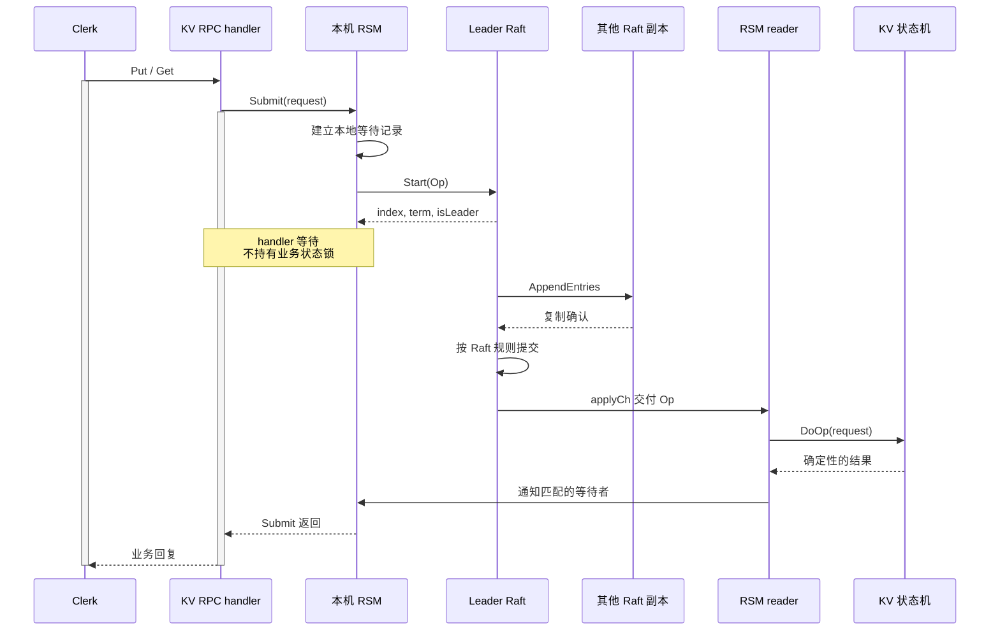
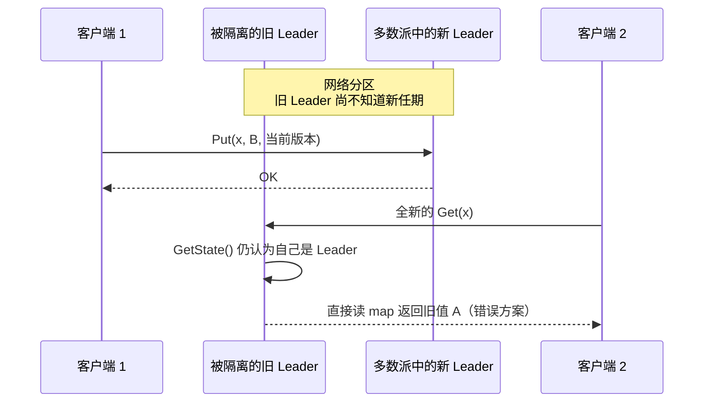
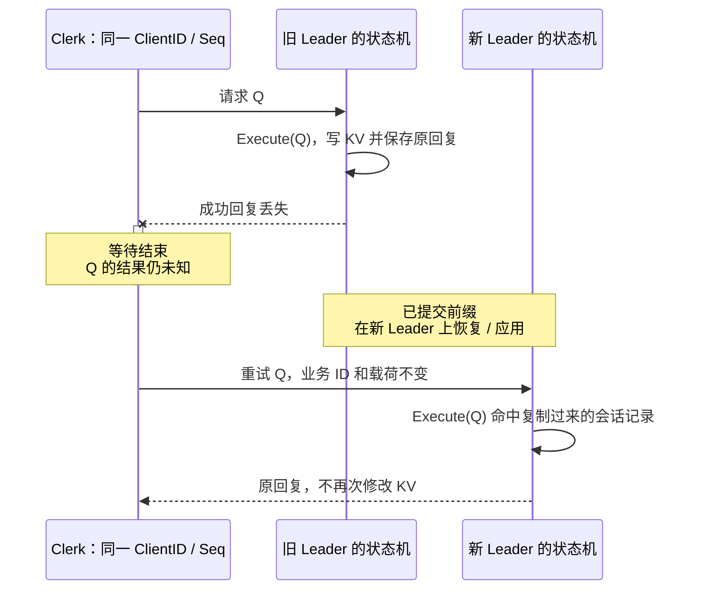
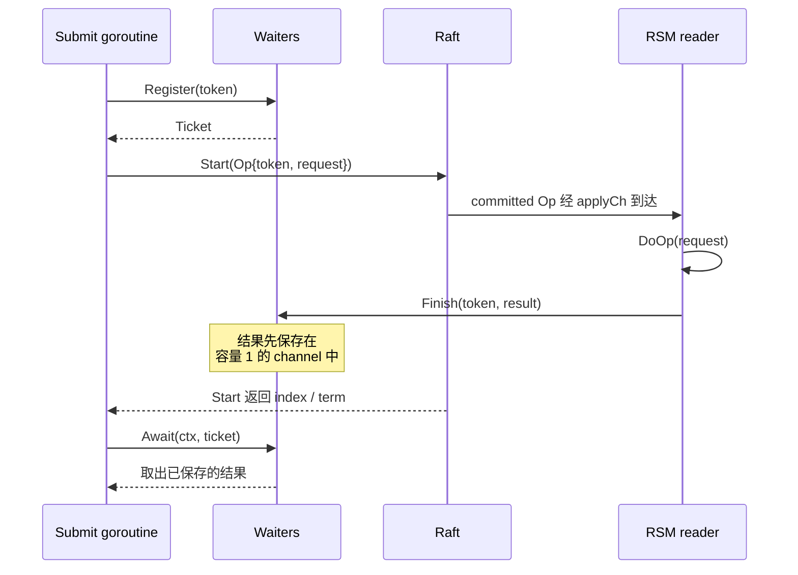
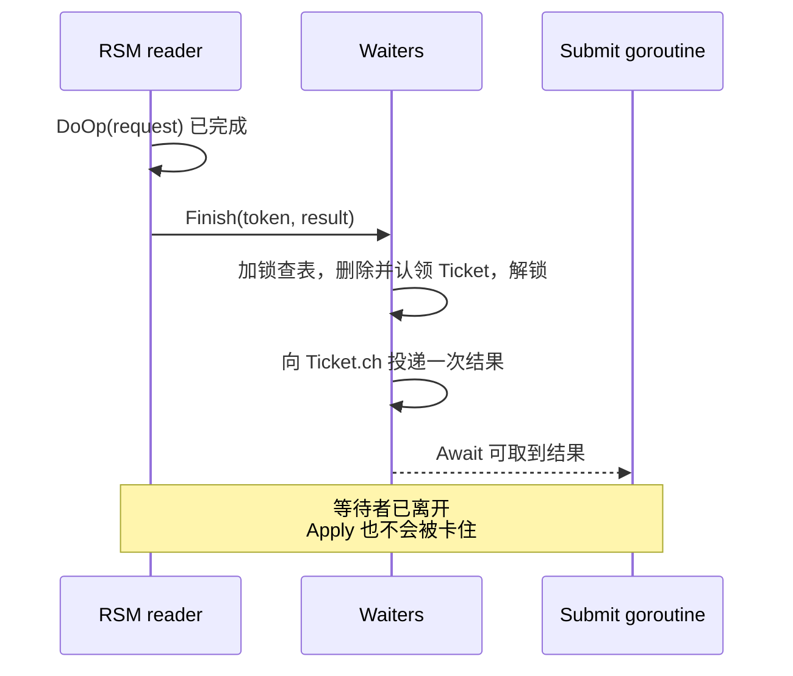
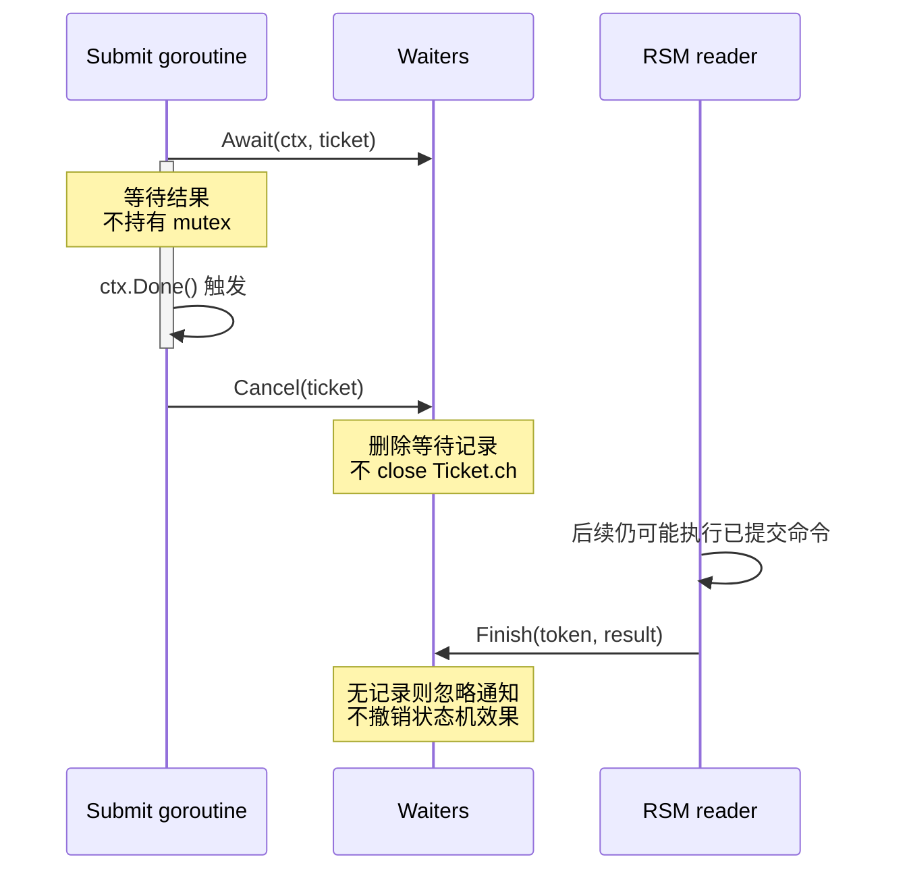
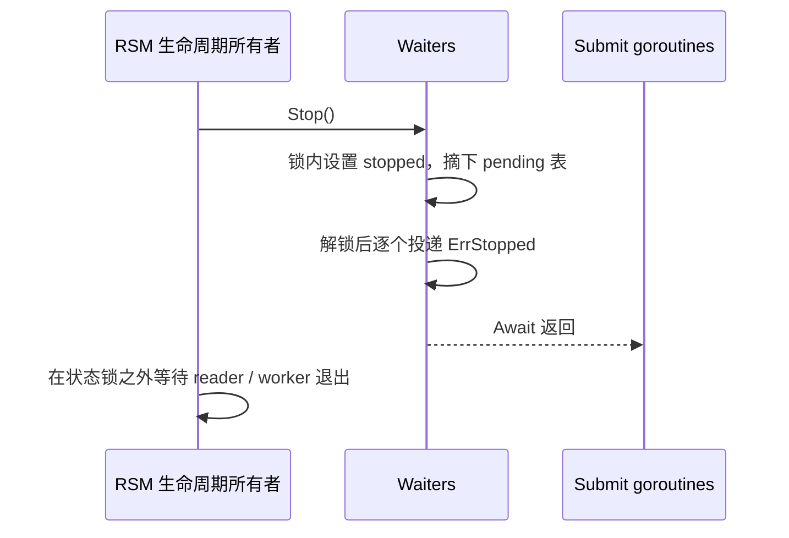
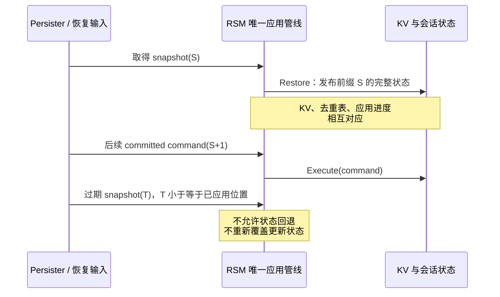
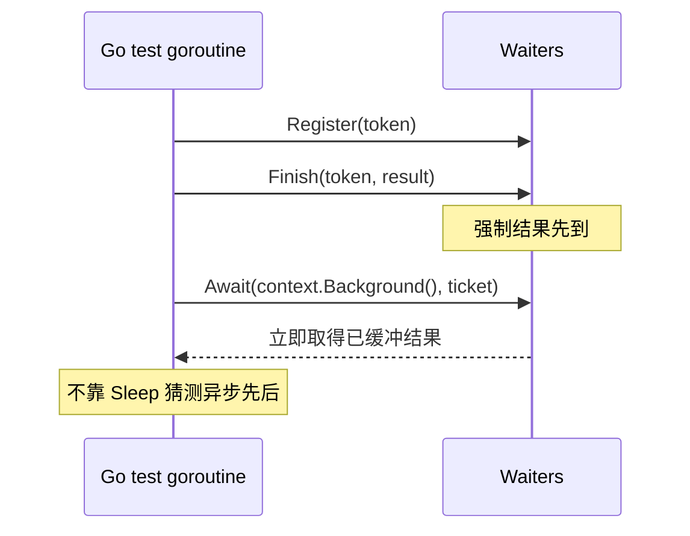

---
tags:
  - 高性能存储
  - 分布式存储
  - Raft
  - 线性一致性
  - MIT-6.5840
aliases:
  - Replicated KV
  - Raft KV 请求去重与 Apply
status: 待审阅
course: MIT 6.5840 Spring 2026
sources_checked: 2026-09-06
---

# Replicated KV：线性一致性、请求去重、客户端重试与 Apply 状态机

> **Raft 负责让副本对已提交的日志前缀达成一致；它不自动知道“两次请求是不是同一件事”，也不自动把业务结果交给正确的 RPC handler。** Replicated KV 的工程核心，是把客户端操作、日志位置、状态机执行结果和本地等待者连接起来，同时不把任何一种“超时”误当成“事务已经回滚”。

先读 [[7.9 一致性模型]] 理解对外的线性一致性契约，再用 [[7.11 Primary-Backup 与 Multi-Raft]] 理解复制日志。Raft 内部的锁、RPC 等待和 Apply 交付边界，见 [[7.25 MIT 6.5840 Raft 工程实现：Go 并发、labrpc、定时器与测试|7.23 Raft 工程实现]]；通用幂等与重试概念已在 [[7.13 幂等 重试 与请求去重]] 中说明，本篇重点是它们如何进入具体的 RSM 程序。

## 1. 先分清两条路线：当前实验契约与更强的请求去重协议

**本篇对齐 MIT 6.5840 Spring 2026，同时单列通用工程扩展。** 本届 Lab 4 使用 `kvraft1/rsm`，分为通用 RSM、无快照 KV、有快照 KV；KV 的 `Get / Put` 沿用 Lab 2 的版本条件语义，不是无条件 `Put / Append` 接口。[^mit4][^mit2]

| 问题 | 2026 实验主线 | 本篇额外讲解的通用协议 |
| --- | --- | --- |
| 写操作身份 / 条件 | `Put(key, value, expectedVersion)` | 额外附加稳定的 `(ClientID, Seq)` |
| 重试约束 | 不改变原来的 key、value、expectedVersion | 还必须不改变原来的请求 ID 和载荷 |
| 如何避免重复修改 | 第一次成功后 key 版本递增，同条件不能再成功 | Apply 识别重复 ID，返回首次结果而不重执行 |
| 能否知道首次结果 | 回复丢失后，版本不匹配可能只能返回 `ErrMaybe` | 去重结果仍被保存时，可找回该逻辑操作原结果 |
| 状态成本 | KV 值及版本，不要求额外的长期会话结果表 | 需要复制 / 快照保存会话结果及回收规则 |

**不要因为本文讨论请求去重，就把会话表当成 2026 测试强制要求。** 通用扩展用于理解 Raft 论文 §8 的客户端交互，以及需要稳定请求结果的业务协议；它是另一层 API 设计，不能未经适配直接加到实验 wire format 上。

资料分工：DDIA 第 9 章支撑线性一致性与日志定序，第 12 章支撑端到端重复抑制；MIT 页面决定当届接口；下文的 waiter registry、串行会话代码和故障场景是独立教学实现。它们不是官方实验完成版。

## 2. 一次请求穿过三种状态机，不是一条同步函数调用

### 2.1 客户端、Raft、应用各自负责什么

客户端负责维持一次逻辑操作的身份、重试和路由；Raft 负责有序提交；应用状态机负责按照提交顺序产生确定性的 KV 状态和返回值。RSM 层再把返回值交给本机相应的等待者。



`Start()` 返回成功，只说明本机以 Leader 身份接受了提案；没有证明它最终提交。相反，应用收到并执行的 committed 命令，即使来自一个已经不再担任 Leader 的任期，也不能因为“领导权变了”就拒绝执行。

### 2.2 三张表属于不同层

| 表 / 数据 | 是什么 | 是否需要复制和恢复 |
| --- | --- | --- |
| KV map | key 对应的值及版本 | 是 |
| 业务 dedup/session 表 | 哪个逻辑请求已经执行、首次结果是什么 | 采用该协议时，是 |
| pending/waiter 表 | 本机哪个 goroutine 正在等哪一个提案 | 否；进程重启后不恢复旧 goroutine |

把 pending 表误当成 dedup 表，换主就会失去去重能力；把 pending channel 写入快照，则是在把运行时同步对象错误地当成业务状态。

## 3. 线性一致性：日志顺序还必须连接到客户端的实时顺序

### 3.1 用操作区间理解，而不是背“强一致”

对每次完成的逻辑操作，都应能在它的调用与返回之间选择一个看起来原子生效的时刻；这些时刻构成的全序既满足 KV 的顺序规格，也尊重不重叠操作的先后关系。重叠操作可以按不同顺序排列，但不能让一个后来才开始的操作倒到一个已经完成的操作之前。[^ddia-linear]

例如，`Put(x,"A",0)` 已返回 OK，在这之后才调用的全新 `Get(x)`，必须观察到该写或某个后续合法写；不能回到初始“没有 x”的状态。这里没有要求所有副本同一微秒完成 Apply，要求的是**对外历史不能暴露不允许的陈旧状态**。

### 3.2 最直接的读方案：Get 也进入日志

基线方案把每个新 `Get` 和 `Put` 都交给 `Submit()`，在它们对应的已提交命令被状态机顺序执行时确定结果。这样，读不必猜测“本机现在是否足够新”；它在日志中有一个明确的位置。DDIA 也讨论了通过日志安排读顺序的方法。[^ddia-log]

一段简化证明思路：若写 W 已经完成，W 必须已经提交并产生结果；之后开始的读 R 在合法 Leader 上被定序，执行到 R 前必须具备并应用相应的已提交前缀。因此 R 不会漏掉 W，除非某个后续操作合法地覆盖了它。这是对基线设计的工程解释，不是完整形式化证明。

**不要把每台副本自己的 Apply 墙上时钟时刻都叫作全局线性化点。** 同一条命令在不同副本上的执行可能相隔很久。证明依赖统一的操作顺序及调用 / 返回边界，而不是把多台机器的执行时间当成一个共同瞬间。

### 3.3 为什么 `GetState()==Leader` 后直接读 map 仍会错



无锁或有锁都不改变这个反例：锁只能保护本机 map，不能获得集群的新鲜度证明。

ReadIndex 类优化要额外建立当前领导权与读取屏障，并等待本地状态机应用到屏障位置；lease read 又引入时间假设。这些不是“少写一条 Get 日志”就自然得到的性质。论文 §8 讨论了相关前提，本篇不实现该优化。租约与 fencing 的边界可继续看 [[7.12 Lease 与 Fencing]]。[^raft-client]

## 4. 三种身份必须分开：逻辑请求、提案、日志位置

| 身份 | 回答的问题 | 是否随重试改变 |
| --- | --- | --- |
| `(ClientID, Seq)` | 业务上是不是同一次操作？ | 同一逻辑操作不变；通用扩展字段 |
| `ProposalToken` | 哪一次本地 Submit 应该收到这个结果？ | 新 Submit 可生成新 token |
| `(Index, Term)` | Raft 日志中的哪个位置、由哪一任 Leader 创建？ | 换主与重新提案后可能改变 |

**相同 index 不等于相同请求。** 旧 Leader 在 index 30 接受 A，但 A 未提交；新 Leader 可以在冲突修复后让 B 占据该位置。如果等待 A 的 handler 只看到“30 被应用了”就返回 B 的结果，Raft 层可能完全正确，错在 RSM 的结果关联。

另一方面，同一业务请求重试时可能进入 index 30 和 index 34；Raft 不会因为它们的业务含义相同，就自动删除第二条日志。是否再次修改 KV，是 Apply 层版本条件 / 去重协议要决定的事情。

**工程设计：** 本地 token 可以由 `节点标识 + 启动代次 + 计数器` 组成，或者在提交之前生成足够可靠的唯一值。启动代次避免重启后从 0 开始的计数器撞上旧日志里的 token。不要在 `DoOp` 内现场生成随机身份：各副本必须执行同一条已经确定的命令。

## 5. 当前实验主线：版本条件写与 ErrMaybe

### 5.1 一次写为什么至多成功修改一次

设 key `x` 当前是 `(value="A", version=7)`。`Put(x,"B",7)` 只有在当前版本仍为 7 时才能成功，并把版本变成 8。重复同一个条件写，看到 8 就不再重复修改。

缺失 key 可以由 expectedVersion=0 的 Put 创建，创建后的版本为 1；缺失 key 却期待非零版本，得到 `ErrNoKey`；已有 key 的版本不匹配，得到 `ErrVersion`。这些是当届实验规格，不应替换成另一种 CAS API。[^mit2]

### 5.2 “没有重复写”不代表“知道第一次有没有写成”

下面两段历史，对重试方可能产生相同观察：

| 历史 A | 历史 B |
| --- | --- |
| 我的 Put 成功把 7 改成 8 | 我的请求没有成功执行 |
| 成功回复丢失 | 另一客户端把 7 改成 8 |
| 我的重试看到版本不匹配 | 我的重试也看到版本不匹配 |

所以，发生过可能执行的未确认尝试后，再得到 `ErrVersion`，不能把它包装成“第一次确定失败”。`ErrMaybe` 就是在接口上保留这个不确定性。没有这类前序不确定尝试的明确版本拒绝，才是通常的 `ErrVersion`。

下面是独立教学辅助函数，不是完整 Clerk；`Reply` 的定义在第 6 节。调用方必须根据整个逻辑操作的尝试历史，正确维护 `mayHaveExecuted`，不能简单把“重试次数大于 0”当成完全相同的条件。

```go
func ClassifyPut(reply Reply, mayHaveExecuted bool) Reply {
	if reply.Err == "ErrVersion" && mayHaveExecuted {
		reply.Err = "ErrMaybe"
	}
	return reply
}
```

这个函数只改变**客户端对结果的解释**，不修改状态机。当前版本条件写与请求身份去重也不是同一套机制：前者限制某个版本的更新次数，后者可以保存某个请求的首次结果。[^ddia-e2e]

### 5.3 Clerk 重试时应该保留什么

保留同一个 key、value、expectedVersion；采用业务 ID 扩展时还保留相同 ClientID / Seq。可以更换目标节点，成功后缓存 Leader 提示；不要在每一次网络尝试中分配新业务 ID。

`ErrWrongLeader` 用于调整路由，但要注意来源：`Start()` 当场拒绝这次提案，与“提案已被接受，随后检测到领导权变化”，不是同一条执行历史。后者不能仅凭本地角色变化就证明日志永远不会提交。**路由错误不是全局事务回滚证书。**

这里的 `ClassifyPut` 不试图替代完整错误状态机；接入当前实验时，应按 Lab 2 / Lab 4 的 Clerk 和 RSM 契约处理传输失败、路由变化与结果不确定性，不给 `ErrWrongLeader` 擅自增加“已撤销”的含义。

> [!warning] 重新 Get 再用新版本 Put，不是原请求的重传
> 它是根据新状态发起一次新逻辑操作。原请求若已成功，这样做可能产生第二次业务效果。即便 Get 的值恰好等于原本要写入的值，也不能证明一定是自己的请求完成了更新。

客户端最终决定放弃等待时，API 需要把未知结果暴露给上层；需要确认具体业务动作时，应使用稳定操作 ID、结果查询或更高层业务约束，而不是把未知状态改名为失败。

## 6. 可验证的状态机核心：版本条件写 + 可选结果去重

这一节是完整的独立 Go 教学模型，使用标准库，模块可声明 `go 1.22`。它不依赖 MIT 的包，也不实现 Raft。`Versioned` 展示条件 Get/Put；`Execute` 再提供一个**更强、但有明确限制**的串行客户端去重协议。

### 6.1 值数据定义：哪些内容能跨副本传播

下面各段按顺序组成 `state.go`。导入负责快照编码、错误封装和示例中的溢出防护。

```go
package mechanics

import (
    "bytes"
    "encoding/gob"
    "fmt"
    "math"
)
```

请求中的版本条件是业务数据；ClientID / Seq 属于可选协议扩展，不是本届实验给定的字段布局。

```go
type Request struct {
	ClientID string
	Seq      uint64
	Kind     string // "Get" or "Put".
	Key      string
	Value    string
	Version  uint64 // Expected key version; never changed during a retry.
}
```

业务返回值与会话记录都使用可复制的值。`Session.Last` 还保留了原请求载荷，防止同一个 ID 被误用于另一个操作；因为这些字段都是可比较类型，可以直接比较结构体。

```go
type Value struct {
	Text    string
	Version uint64
}

type Reply struct {
	Err     string
	Value   string
	Version uint64
}

type Session struct {
	Last  Request // Comparable value: also detects accidental request-ID reuse.
	Reply Reply   // The original result, not a new read of the current state.
}
```

状态机不内嵌 mutex：**由唯一 Apply 所有者串行访问，或者由外部服务锁统一保护**。快照、读取和执行必须遵守同一个所有权约定，不能直接让多个 RPC handler 并发调用这些方法。

```go
type State struct {
	Values   map[string]Value
	Sessions map[string]Session
}

func NewState() *State {
	return &State{Values: make(map[string]Value), Sessions: make(map[string]Session)}
}
```

### 6.2 基础执行：Get 也从被定序的 Apply 路径进入

`Versioned` 只检查当前状态和命令，没有随机数、系统时间或外部查询。这里的 Get 代码本身当然能读取 map，但是否允许对外返回，由上层 RSM 的提交和 Apply 管线保证；不能把它搬到未经共识屏障的 RPC 快捷路径。

```go
func (s *State) Versioned(q Request) Reply {
	v, exists := s.Values[q.Key]
	if q.Kind == "Get" {
		if !exists {
			return Reply{Err: "ErrNoKey"}
		}
		return Reply{Err: "OK", Value: v.Text, Version: v.Version}
	}
	if q.Kind != "Put" {
		return Reply{Err: "ErrBadOp"}
	}
	return s.putVersioned(q, v, exists)
}
```

写路径把版本检查和状态变更放在同一次 Apply 中；若先在 RPC handler 检查版本，稍后才提交无条件写，并发命令可能在两者之间改变状态。

```go
func (s *State) putVersioned(q Request, v Value, exists bool) Reply {
	if !exists && q.Version != 0 {
		return Reply{Err: "ErrNoKey"}
	}
	if exists && v.Version != q.Version {
		return Reply{Err: "ErrVersion"}
	}
	if q.Version == math.MaxUint64 {
		return Reply{Err: "ErrOverflow"} // Educational guard, not an MIT rpc error.
	}
	s.Values[q.Key] = Value{Text: q.Value, Version: q.Version + 1}
	return Reply{Err: "OK"}
}
```

`ErrBadOp` 与 `ErrOverflow` 是独立示例的防护错误，不是 MIT `rpc` 包的既定错误码；实际接入应遵守目标接口。本例没有 Delete，因此不展开删除后重建导致的版本 ABA；增加删除操作时，应重新设计版本 / 对象代次的生命周期。

### 6.3 通用扩展：业务效果与首次结果一起更新

串行会话协议的前提是：Seq 从 1 连续增长；同一客户端一次只有一个未完成的逻辑操作；收到可处理的确定结果后才推进 Seq；不会在服务端静默淘汰会话后又把旧 ID 当成全新请求。

首次操作执行后，同时保存原请求和原返回值；重试相同请求返回缓存，不重新做版本比较。因此，一次原本成功的版本条件写，不会在重试时被错误地改报成 `ErrVersion`。

```go
func (s *State) Execute(q Request) Reply {
	if q.ClientID == "" || q.Seq == 0 {
		return Reply{Err: "ErrBadRequestID"}
	}
	rec, exists := s.Sessions[q.ClientID]
	if exists && q.Seq <= rec.Last.Seq {
		return cachedReply(rec, q)
	}
	if (!exists && q.Seq != 1) || (exists && q.Seq != rec.Last.Seq+1) {
		return Reply{Err: "ErrSequenceGap"}
	}
	r := s.Versioned(q)
	s.Sessions[q.ClientID] = Session{Last: q, Reply: r}
	return r // Mutation and cached result belong to this same Apply transition.
}
```

`Seq` 小于最近完成值时，不能拿最近一次操作的结果应付它；那个结果属于另一个请求。本例明确返回过期错误。同一个 Seq 带来不同载荷，也不是重试，而是协议使用错误。

```go
func cachedReply(rec Session, q Request) Reply {
	if q.Seq < rec.Last.Seq {
		return Reply{Err: "ErrStaleRequest"} // Never return another request's reply.
	}
	if q != rec.Last {
		return Reply{Err: "ErrBadRequestID"}
	}
	return rec.Reply
}
```

这些方法是单一执行主体中的确定性计算，没有跨 goroutine 等待，因此不额外把源码重画成调用时序图。

### 6.4 为什么只保存“最大 Seq”需要限制条件

允许客户端并发发出 Seq=10 和 Seq=11 时，11 可能先被提交。如果服务端把 lastSeq 更新到 11，就把尚未执行的 10 当成旧请求丢掉，属于丢操作，不是去重。

本例通过连续 Seq 和单个未完成操作的契约避免这个问题；因此它会拒绝乱序 gap。要支持同一客户端多路并发，应保存一个请求结果窗口、每请求记录或可证明安全的滑动确认边界，而不是删除 `ErrSequenceGap` 分支就宣称支持了并发。

缓存 Get 的首次结果只适用于**同一个尚未完成的逻辑 Get 的 RPC 重试**；前一次 Get 完成后再次调用，是新的 Seq，不能复用旧结果。否则，别的客户端已经成功写入以后，一个全新读仍返回旧值，就会破坏线性一致性。

同样，lastSeq 表只能重现最近的结果。生产环境要处理长时间迟到请求、客户端重启与会话回收，需要明确的请求保留期、客户端确认进度或会话过期协议。**去重表的内存上限与结果保证是同一项设计的两面。**

### 6.5 状态机必须在所有副本执行，包括没有等待者的 Follower



此处不能依赖“旧 Leader 内存里的缓存”；新 Leader 必须从已提交日志或相应快照获得会话记录。Raft 论文 §8 的客户端序列号思路，正是把重复识别放到状态机这一端。[^raft-client]

## 7. 本地 waiter：结果先到、等待者超时、角色改变都不能串话

### 7.1 两个必须重现的竞态

**结果先到：** handler 调用 Start；命令非常快地完成 Apply；reader 查不到 waiter；handler 这时才注册 channel，于是永远等不到已经发送过的通知。

**超时后结果才到：** handler 超时返回并关闭通知 channel；reader 随后发送，触发 `send on closed channel`。或者 handler 已不再接收，但 reader 向无缓冲 channel 发送，整个 Apply 管线被一个离开的请求卡住。

解决的目标不是“让通知尽量快”，而是**定义谁创建、谁拥有、谁可以完成、谁可以清理这份等待记录**。

### 7.2 独立 registry 的不变量

下面的 `waiters.go` 不实现完整 Submit，它只封装本地等待机制。它保证：先注册；一个 ticket 至多被完成者或停止流程取走一次；结果 channel 容量为 1；单独的 ticket channel 从不 close。

```go
package mechanics

import (
    "context"
    "errors"
    "sync"
)
```

`Result.Err` 是本地等待 / 关闭错误；`Reply.Err` 是确定性的业务结果。分开这两层，避免把“本地停止了”等价成“KV 命令返回失败”。

```go
var ErrStopped = errors.New("wait registry stopped")

// Token is a local proposal identity, not (ClientID, Seq) and not a Raft index.
// The caller supplies globally non-reused tokens, e.g. node + boot epoch + counter.
type Token string

type Result struct {
	Reply Reply
	Err   error // Local delivery/stop error, distinct from a deterministic KV reply.
}

type Ticket struct {
	ID Token
	ch chan Result // Capacity one. Nobody closes an individual ticket's channel.
}
```

这把 mutex 只保护本地 pending 表，不保护 KV，不在网络调用期间持有。

```go
type Waiters struct {
	mu      sync.Mutex
	stopped bool
	pending map[Token]*Ticket
}

func NewWaiters() *Waiters {
	return &Waiters{pending: make(map[Token]*Ticket)}
}
```

### 7.3 在 Start 之前注册，容量 1 保留过早到达的结果

调用方必须保证 token 不跨操作、进程代次复用；Register 对当前 pending 中的重复 ID 做防护，但它不是全历史唯一性数据库。

```go
func (w *Waiters) Register(id Token) (*Ticket, error) {
	w.mu.Lock()
	defer w.mu.Unlock()
	if w.stopped {
		return nil, ErrStopped
	}
	if id == "" || w.pending[id] != nil {
		return nil, errors.New("empty or duplicate proposal token")
	}
	t := &Ticket{ID: id, ch: make(chan Result, 1)}
	w.pending[id] = t
	return t, nil
}
```



这张图特意让 Apply 比 Start 的返回更早被上层观察到。实现不能依赖“通常 Start 很快，所以不会发生”来保证正确性。

### 7.4 完成者先认领，再在锁外投递

Finish 在锁内从表中移除 ticket，意味着并发的 Finish / Stop 不会再次认领同一个 ticket。由于只有认领者能投递一次，且 channel 初始为空、容量为 1，锁外发送不会因为等待者已经离开而阻塞。

```go
func (w *Waiters) Finish(id Token, result Result) {
	w.mu.Lock()
	t := w.pending[id]
	delete(w.pending, id)
	w.mu.Unlock()
	if t != nil {
		t.ch <- result // Cannot block: single claimant + one initially empty slot.
	}
}
```



即使没有 waiter，reader 也必须先执行 DoOp；不能把代码写成“查到 waiter 才 Apply”。后者会让 Follower 和重启回放节点跳过命令。

### 7.5 取消只删除本地等待，不关闭 channel，不撤销日志

Cancel 用 ticket 对象身份检查后再删除，避免清理动作误删其他等待记录。实际协议仍应坚持 token 永不复用；指针比较只是额外保护，不能替代身份设计。

```go
func (w *Waiters) Cancel(t *Ticket) {
	w.mu.Lock()
	if w.pending[t.ID] == t {
		delete(w.pending, t.ID)
	}
	w.mu.Unlock()
}
```

等待期间不持有表锁。context 超时和结果到达如果同时 ready，select 可以选择任意一个；这不是说命令半成功，而是调用方可能在命令已经完成时仍只获得“不确定”。

```go
func (w *Waiters) Await(ctx context.Context, t *Ticket) (Reply, error) {
	defer w.Cancel(t)
	select {
	case r := <-t.ch:
		return r.Reply, r.Err
	case <-ctx.Done():
		return Reply{}, ctx.Err() // Outcome unknown; the log may still commit.
	}
}
```



### 7.6 停止时先摘下表，再通知所有等待者

Stop 与 Finish 通过同一把锁分配 ticket 的完成权。Stop 可以重复调用；新注册被拒绝；旧等待者得到明确的本地停止错误。

```go
func (w *Waiters) Stop() {
	w.mu.Lock()
	w.stopped = true
	pending := w.pending
	w.pending = make(map[Token]*Ticket)
	w.mu.Unlock()
	for _, t := range pending {
		t.ch <- Result{Err: ErrStopped}
	}
}
```



Stop 不需要等待接收者当场读取，因为每个被它认领的 ticket 都有一个尚未使用的缓冲位置。代码没有为每个通知创建新 goroutine，因此通知数量大时不会再放大一次调度资源。

### 7.7 这个 registry 还没有替完整 RSM 做什么

它不判断任期，不知道日志 index，不保证命令提交，也不保存业务去重表。完整 Submit 还要在 Start 拒绝、已接受提案但领导权变化、相同 index 出现其他 token、进程停止等路径上结束或重新安排等待。

若采用 index→waiter 的实现，要在 Apply 时同时核对命令身份；若采用本文的 token→waiter，需要另外处理“提案最终不会出现”的检测。不能把一个超时 registry 当作已经完成的 Lab 4A。

本届实验允许被独自隔离的旧 Leader 在特定情形下等待分区恢复；给每次请求加可取消 deadline 是另一项工程选择。无论选择哪一种，都不能把本地等待结束等价为已接受提案一定没有生效。[^mit4]

## 8. Apply 状态机的确定性：不是“所有副本都执行这段代码”就够了

应把一次状态转换写成：

```text
新状态, 业务结果 = Execute(旧状态, 已提交命令)
```

相同旧状态和相同命令，应产生相同业务状态和结果。通常可以在提交之前生成随机 ID / 时间戳并放入命令；不可以让每个副本在 Apply 时各自调用 `time.Now()`、选择一个随机数、查询某台外部服务器，再把结果写入复制状态。

Go map 遍历顺序也不能承担业务定序职责。要从一个集合选“第一个 key”，必须明确排序规则；如果只是序列化一张 map，字节排列不同不必然意味着逻辑状态不同，但不能把这种字节差异误判为副本业务分歧。

### 8.1 不要在 Apply 中直接发外部副作用

例如发送邮件、扣第三方款项或调用另一个非幂等 RPC：每个副本都会执行，崩溃恢复又可能回放。Raft 内部的有序提交不自动覆盖外部系统。

应把“需要产生副作用”的意图作为状态保存，再通过具备幂等键 / 去重的外部协议消费；其成功条件必须单独定义。这是端到端正确性问题，不是给 Apply 再加一把锁就能解决。[^ddia-e2e]

### 8.2 确定性业务错误也是结果

`ErrVersion`、`ErrNoKey` 等业务拒绝仍然来自一个已定序操作；不能因为它“没修改值”，就跳过整个日志位置的应用进度。采用会话结果缓存时，也要按协议决定是否缓存该确定结果，并使客户端可以推进到下一个 Seq。

相反，`context.DeadlineExceeded`、本地 Stop 等等待错误不是状态机计算出的业务事实，不应被复制成“这个命令执行失败”的结果。

## 9. Snapshot 必须同时保存业务状态、去重状态和前缀位置

### 9.1 两个去重维度：日志回放和客户端重传

| 机制 | 阻止什么 | 不能替代什么 |
| --- | --- | --- |
| `lastApplied` / 快照 index | 对已经包含在恢复前缀中的日志位置重复应用 | 不识别同一业务请求出现在新的日志位置 |
| ClientID / Seq / result cache | 同一逻辑请求在不同日志位置再次到达时重复生效 | 不决定哪段日志已经被快照覆盖 |

例如，快照包含 index 1–40，客户端 Q 已在 index 35 生效。恢复后丢弃旧 index 35 的重放，是前缀游标的工作；Q 又以新提案出现在 index 45 时不再次生效，是业务版本 / 去重协议的工作。

### 9.2 生成的是某个精确前缀的快照，不是“差不多同时”的三份数据

RSM 在完成 index S 的应用后，必须让 KV、会话表与 S 对应同一状态。最简单是由唯一 Apply 所有者同步编码；若编码太慢，可以在同一临界区深拷贝一致状态，再到锁外编码这份不可变副本。

不能一边执行 S+1、S+2，一边用 shallow copy 的 map 在锁外编码，然后仍把得到的快照标为 S。那样恢复后会把已经隐含在快照里的效果再次回放。

下面是第 6 节 `state.go` 的剩余部分。结构体字段导出，持久化的是业务值，不包含本地 waiter、mutex、timer 或 RPC 客户端。

```go
type snapshotEnvelope struct {
	Format  uint32
	Applied uint64
	State   State
}
```

调用方提供的 `applied` 必须就是当前 State 的真实前缀。本函数的浅层结构复制仅在“编码期间完全没有并发修改”的所有权契约下成立，不是锁外并发编码方案。

```go
func (s *State) Snapshot(applied uint64) ([]byte, error) {
	var b bytes.Buffer
	x := snapshotEnvelope{Format: 1, Applied: applied, State: *s}
	if err := gob.NewEncoder(&b).Encode(x); err != nil {
		return nil, fmt.Errorf("encode snapshot: %w", err)
	}
	return b.Bytes(), nil
}
```

恢复时先解码到新对象，验证成功后再发布，避免半个 map 已被更新、另半个字段还没成功恢复的状态。

```go
func Restore(data []byte) (*State, uint64, error) {
	var x snapshotEnvelope
	if err := gob.NewDecoder(bytes.NewReader(data)).Decode(&x); err != nil {
		return nil, 0, fmt.Errorf("decode snapshot: %w", err)
	}
	if x.Format != 1 || x.State.Values == nil || x.State.Sessions == nil {
		return nil, 0, fmt.Errorf("invalid snapshot envelope")
	}
	return &x.State, x.Applied, nil
}
```

这些函数只验证教学快照封装和编码错误；没有实现磁盘原子写、校验和、安全处理任意不可信输入或完整的模式迁移机制。生产持久化格式需要另外设计。

### 9.3 快照与后续 Apply 的顺序



本届 Lab 4C 通过 `StateMachine.Snapshot / Restore` 与 Raft `Snapshot` 协同，并使用 `rf.PersistBytes()` 与 `maxraftstate` 判断持久状态体积；`-1` 表示无需按该阈值触发。应用快照与 Raft 快照边界必须对应，接口拼接位置由 RSM 负责。[^mit4]

恢复顺序必须确保旧日志不会先修改尚未恢复的空 KV，再被快照覆盖。普通命令和运行时收到的快照也要串行处理，防止先 Apply 新命令、随后又安装旧状态。

快照覆盖了一个本地 waiter 等待的位置，但已经没有原命令载荷 / 结果时，不得仅凭 index 推出“那就是我的成功结果”。有可核对的业务结果缓存时才能使用它；否则结束本地等待并让调用方按协议处理不确定性，不能编造成功回复。

## 10. 客户端重试、快照、去重共同决定生命周期边界

客户端进程重启后，若丢失了未完成操作的 ID 和参数，就不能假装它是一个全新请求再执行而仍承诺一次效果。业务是否需要恢复未完成请求，决定了客户端是否也需要保存会话身份及操作记录。

服务端若回收了会话结果，必须定义怎样拒绝旧请求、怎样识别已过期会话以及客户端怎样恢复。不能简单 LRU 删除结果后，又把同一个旧 `(ClientID,Seq)` 视为首次请求。

一个有界的生产协议通常还需要客户端确认水位、会话代次、结果保留窗口或显式过期错误。这些不属于本篇串行会话示例的实现范围。它们说明：所谓“一次效果”依赖故障模型、身份稳定性与保留期，**不是一个可以无限期、无状态承诺的返回值**。

## 11. 测试：验证端到端历史，而不是只看最终 map

### 11.1 四类检查要分开

**Raft 安全性：** 已提交前缀一致、不错误覆盖。**RSM 关联：** 结果只交给对应提案。**业务协议：** 版本检查和请求去重正确。**资源生命周期：** 等待者、timer、goroutine 在失败后不会无限积累。

最终 `x="A"` 并不能说明操作只执行过一次：无条件写两次也可能得到相同最终值。测试应选择版本递增、计数或可追踪请求身份，使重复效果可观察。

| 故障 / 调度 | 应验证的结果 |
| --- | --- |
| 第一次写成功但回复丢失 | 条件写不重复修改；需要时保留 ErrMaybe，或由结果缓存恢复原回复 |
| Start 后、waiter 等待前先 Apply | 不丢通知 |
| 同一业务请求在两个日志位置提交 | 不重复业务效果 |
| 未提交 index 被不同命令占用 | 旧 waiter 不收到新命令的结果 |
| handler 超时后才 Apply | 状态仍可推进，无向已关闭 channel 发送 |
| 新 Leader 上没有本地 waiter | 仍执行 / 回放所有已提交命令 |
| 快照后重启，再重试旧请求 | 去重结果与 KV 一起恢复 |
| 多数派继续写，少数派收到全新 Get | 少数派不能用旧 map 完成该读 |
| 同客户端并发乱序 Seq | 串行协议明确拒绝；并发协议不能错丢未执行请求 |

### 11.2 一个不用真实网络就能暴露丢通知的测试

下面测试复用第 7 节类型，可以放进独立模块的 `waiters_test.go`。它强制结果在 Await 之前到达，比依赖“多跑几次碰巧触发”更直接。

```go
package mechanics

import (
    "context"
    "testing"
)

func TestEarlyResult(t *testing.T) {
    w := NewWaiters()
    ticket, err := w.Register("node1:boot9:proposal1")
    if err != nil {
        t.Fatal(err)
    }
    w.Finish(ticket.ID, Result{Reply: Reply{Err: "OK", Value: "A"}})
    got, err := w.Await(context.Background(), ticket)
    if err != nil || got.Value != "A" {
        t.Fatalf("lost result: reply=%+v err=%v", got, err)
    }
}
```



这个测试证明的是一个确定的生命周期顺序，不证明真实集群的选举、复制或线性一致性。

### 11.3 历史检查器需要区分失败与未知

记录逻辑操作 ID、输入、调用时刻、返回时刻与结果；重试属于同一逻辑操作的尝试，不要无条件把每次 RPC 都记录为一次已经独立完成的业务操作。

超时 / ErrMaybe 的操作可能已经生效。检查历史时需要保留未决或不确定操作的可能性，不能把它们全部删掉，再把之后读到的效果指认为“凭空发生的写”。相反，也不能把所有未知操作都强行记成成功以掩盖数据丢失。

Race detector 与历史检查器解决不同问题：没有内存竞争不等于可线性化；历史检查超时或放弃搜索也不等于找到一份合法串行历史。保存明确的验证结果与未完成检查，不把所有输出里的 PASS 当成同等级证据。[^go-race]

### 11.4 本届实验命令与回归范围

以下命令在 **2026 实验仓库 `src/`** 执行；这些是读者的运行入口，不是本笔记已经运行过的实验输出。

```bash
make RUN="-run 4A -count=1" rsm1
make RUN="-run 4B -count=1" kvraft1
make RUN="-run 4C -count=1" kvraft1
# KV 暴露问题并修复 Raft 后，重新跑底层回归。
make raft1
```

独立教学模块则在它自己的 `go.mod` 所在目录执行：

```bash
gofmt -w *.go
go vet ./...
go test -race -count=20 ./...
```

工程上继续关注 `pending 数量`、等待时长、Apply backlog、重复请求命中率、快照编码时间和持久状态大小。无限增加结果缓存或等待时间不是可用性方案；有界队列与拒绝策略见 [[7.18 Backpressure 与过载保护]]。

## 12. 三条边界，防止把一个正确组件误当成完整正确系统

**Raft 不自动提供端到端请求去重。** 相同业务请求可以被重新提案；需要版本条件或明确的业务 ID 协议。

**线性一致的单操作 KV 不自动提供任意多操作事务。** 两次独立 Put 中间仍可插入其他操作；跨分片原子提交更是另一项机制。不要把 Raft 多数派提交与所有业务事务语义混成一件事。

**本地取消不自动撤销分布式效果。** handler 不等了、Leader 换了、RPC 超时了，都不等于一条已提交命令被回滚。只有协议明确支持的取消 / 补偿操作，才可能改变相应业务状态。

## 13. 参考资料与验证记录

[^mit4]: MIT 6.5840, **Spring 2026**, *Lab 4: Fault-tolerant Key/Value Service*, Parts 4A–4C，RSM、Submit/DoOp、KV、快照与测试入口。https://pdos.csail.mit.edu/6.824/labs/lab-kvraft1.html 。核对日期：2026-09-06。
[^mit2]: MIT 6.5840, **Spring 2026**, *Lab 2: Key/Value Server*，Get、带版本条件的 Put、ErrVersion / ErrNoKey / ErrMaybe。https://pdos.csail.mit.edu/6.824/labs/lab-kvsrv1.html 。核对日期：2026-09-06。
[^ddia-linear]: Martin Kleppmann, *Designing Data-Intensive Applications*, **1st ed., 2017**, Chapter 9，“Linearizability”“What Makes a System Linearizable?”，印刷页 324–328；本项目 PDF 第 346–350 页。
[^ddia-log]: 同书 Chapter 9，“Implementing Linearizable Storage Using Total Order Broadcast”，印刷页 350–351；本项目 PDF 第 372–373 页。这里使用日志定序与读屏障原理，不引用书中旧产品默认行为作为当前实现事实。
[^ddia-e2e]: 同书 Chapter 12，“The End-to-End Argument for Databases”“Duplicate Suppression”“Operation Identifiers”，印刷页 516–520；本项目 PDF 第 538–542 页。
[^raft-client]: Diego Ongaro, John Ousterhout, *In Search of an Understandable Consensus Algorithm (Extended Version)*, 2014，§8 “Client Interaction”。https://raft.github.io/raft.pdf 。客户端序列号、结果缓存与只读优化；本篇会话代码是据此独立设计的受限示例，不是当前课程要求。
[^go-race]: Go 官方，*Data Race Detector*。https://go.dev/doc/articles/race_detector 。核对日期：2026-09-06。

**本次验证范围：** 独立模型的版本条件写、ErrMaybe 分类、串行会话去重、请求载荷校验、快照往返、提前完成通知、取消后迟到通知、重复停止和完成 / 取消 / 停止并发场景，已在 Linux amd64 / Go 1.23.2、模块 `go 1.22` 下运行 `go test -race -count=20 ./...`。这不包含真实 Raft、labrpc 故障网络或 MIT Lab 4 的集成测试；未声称完成完整 RSM 或通过课程评测。

Mermaid 图已完成本地解析与 Chromium 渲染检查；未在用户的 Obsidian 实例及其主题 / 插件组合中验证。
