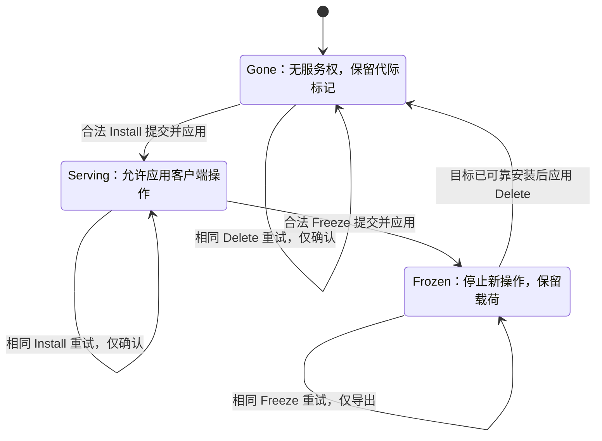
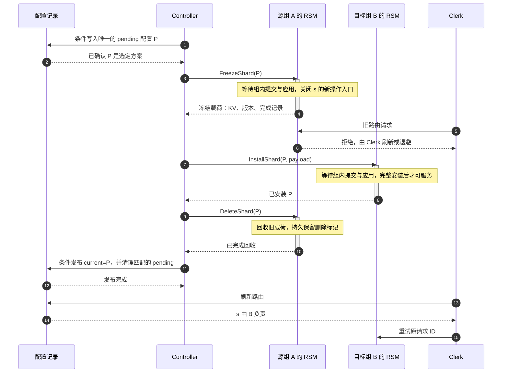
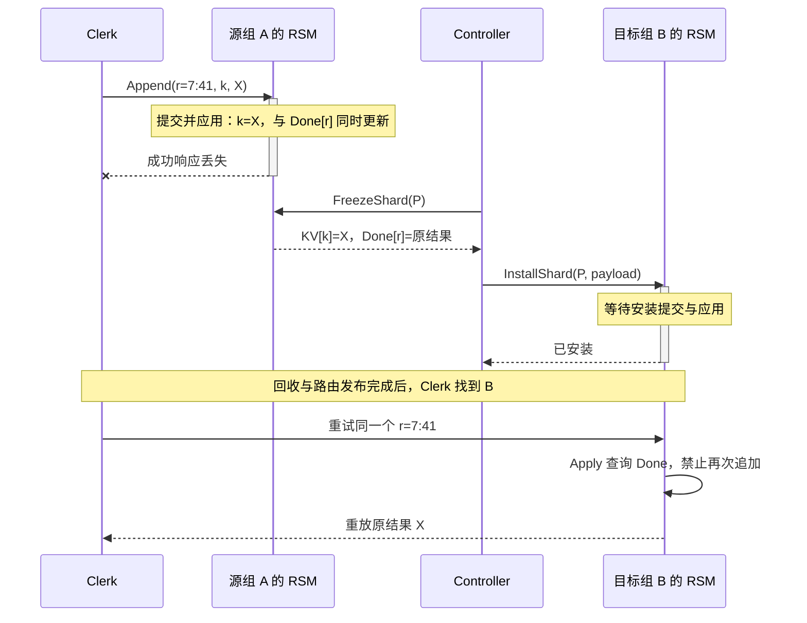
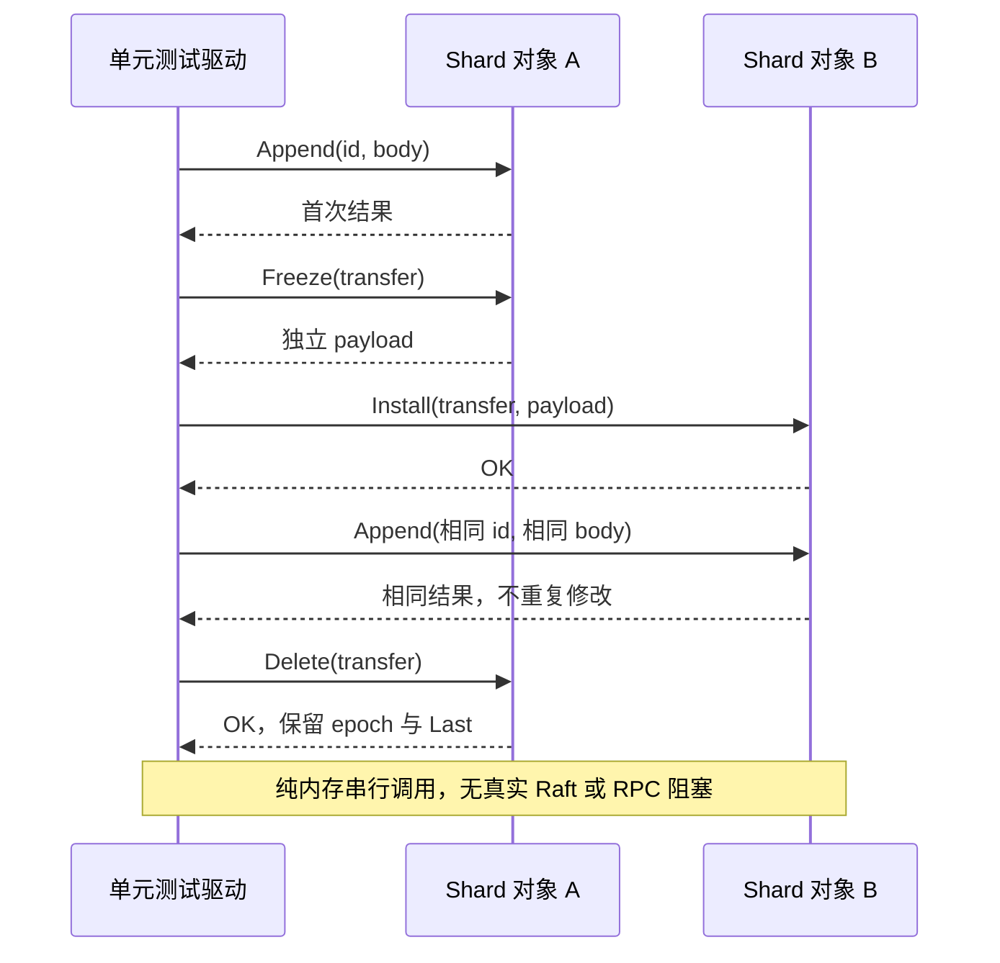

---
tags:
  - 高性能存储
  - 分布式存储
  - ShardKV
  - MIT-6-5840
  - Exactly-Once
status: 已完成
---

# ShardKV：Reconfiguration、Shard Migration 与 Exactly-Once

> 单个复制组解决“副本按什么顺序执行”，ShardKV 还必须解决“这份状态现在由谁负责”。分片从 A 搬到 B 时，需要一起转移的不是只有键值，而是**数据、操作完成记录，以及继续执行的权利**。本篇的核心顺序是：**旧组封住执行边界 → 新组可靠安装完整状态 → 旧组回收旧副本**。客户端可以重试，迁移消息可以重复，但逻辑操作不能重复生效，旧迁移也不能覆盖新一代分片。

前置：[[7.11 Primary-Backup 与 Multi-Raft]] 建立组内复制日志模型；[[7.13 幂等 重试 与请求去重]] 解释请求 ID 与结果缓存；[[7.16 数据放置与 Rebalance]] 解释为什么需要移动分片。本篇补上三者之间的**跨组交接协议**，不重讲一致性哈希或 Raft 选举。

## 1. 范围、版本与资料边界

**教材基础**来自 DDIA 第 1 版：分区与路由、线性一致性、fencing、端到端去重。[1] **课程接口基线**是实际核对的 MIT 6.5840 Spring 2026 Lab 5：controller 驱动 `FreezeShard`、`InstallShard`、`DeleteShard`，配置存放在 Lab 2 的 `kvsrv`；组内使用 `rsm`/Raft，组成员固定。[2]

本篇采用上述迁移方向，另外设计一套便于推导和单元测试的状态机。**下文的 `Transfer`、`Completion`、`Gone/Serving/Frozen`、状态查询和 `Append` 示例是教学设计，不是官方骨架中的同名类型或完整实验答案。**

2026 基础 API 使用带版本号的 `Put`，并允许在无法确定结果时返回 `ErrMaybe`；不能把它直接描述成“客户端总能拿到首次执行结果”的 Exactly-Once API。[3] 本篇分别讨论这两个契约：

| 契约 | 防止什么 | 结果能否确定 |
| --- | --- | --- |
| 版本条件写 | 同一个预期版本的写不能成功两次 | 响应丢失后，仍可能不知道究竟是谁改了版本 |
| 请求 ID + 完成记录 | 同一逻辑操作不能重复生效 | 记录仍有效且可访问时，可以重放首次结果 |

课程将 Exactly-Once 列为扩展方向。[2] 后文的去重迁移是对这一更强契约的分析。旧版教程中的 `Put/Append`、配置轮询和状态名称不能不加说明地拼进 2026 接口；第 10 节将“先发布配置、再迁移”作为另一种设计单独讨论，不绑定未核对的历史年份。

**故障模型**：进程可崩溃并恢复；消息可能丢失、重复、延迟；持久状态不因普通进程重启丢失；节点不执行恶意协议。安全性在这些故障中仍需成立，进展则依赖相关复制组恢复可用、网络最终能够通信。分片迁移不等于 Raft 成员变更，也不自动提供跨分片事务。

## 2. 整体模型：三层映射，两个不同的问题

### 2.1 一个请求怎样找到负责者

```text
key
  → Key2Shard(key)             稳定的逻辑分片编号 s
  → Config.Shards[s]          当前配置中的复制组 GID
  → Config.Groups[GID]        该组的服务器列表
  → 组内 leader / RSM         将操作提交并应用
```

**分片不是副本，也不必等于一个 Raft 组。** 一个复制组可以负责多个分片；它的多个服务器复制这些分片的状态。改变 `s → GID` 不要求改变 key 到 shard 的映射，更不要求把 A 的 Raft peer 变成 B 的 peer。

DDIA 第 6 章“固定数量的分区”及图 6-6（书页 210–211）展示了这种间接层：扩容时移动部分完整分区，不必重算所有 key 的分区编号。[1] 这说明了“为什么按分片搬”，但教材没有给出本篇的具体 Freeze/Install 状态机。

| 组件 | 管什么 | 不替其他组件保证什么 |
| --- | --- | --- |
| Clerk | 请求身份、路由缓存、重试 | 不能凭旧配置证明旧组仍有服务权 |
| 配置记录 / controller | 选定迁移计划、驱动和恢复交接 | 改映射不等于数据已经安装 |
| 复制组 RSM | 组内命令顺序、分片状态、完成记录 | A 的提交不能替代 B 的提交 |
| 迁移协议 | 衔接两个组的执行区间 | 不能替代每个组自己的共识与持久化 |

### 2.2 均衡决定“搬谁”，协议决定“怎样搬才正确”

对 S 个等权分片、N 个组，按分片数均衡时，每组目标数量应为 `floor(S/N)` 或 `ceil(S/N)`。但**分片数相等不代表字节数或请求热度相等**。

若同时要求最少搬迁，不能先随意固定余数分配，再声称得到全局最优。例如 10 个分片的现有数量是 `3/4/3`，它已经均衡；强制改成 `4/3/3` 只会产生额外搬迁。

自己的均衡器应保持已有合法归属，选择能保留更多分片的目标配额，并对并列情况使用稳定规则。若这段逻辑在多个状态机副本上执行，要排序 GID/分片编号，不能让 Go map 的遍历次序决定结果。历史配置里的 map 和服务器列表也应独立复制，不能被“修改下一版配置”连带改掉。

这些属于 [[7.16 数据放置与 Rebalance]] 的放置层问题。即使本次只手动迁移一个分片，后面的正确性交接仍然不能省。

## 3. 六种编号：不要拿一个版本号解决所有问题

| 编号 | 作用域 | 回答的问题 |
| --- | --- | --- |
| 配置 `Num` | 配置历史 | 哪份分片分配方案更新？ |
| 分片迁移 epoch | 某个 shard 的本地历史 | 这条迁移命令属于哪一代？ |
| Raft `term` | 一个 Raft 组 | 哪一任 leader 的协议消息？ |
| Raft `index` | 一个组的日志 | 这条命令在本组的顺序位置？ |
| `(Session, Seq)` | 客户端逻辑操作 | 是新操作，还是同一操作重试？ |
| key / 配置记录的存储版本 | 一个条件写对象 | 本次 CAS 的比较条件是否仍成立？ |

A 的 `term=12` 与 B 的 `term=8` 不表示 A 的分片状态更新；A 的 `index=100` 与 B 的 `index=20` 也不能直接比较。

本篇把一次迁移标识为：

```text
Transfer = (配置编号 n, 分片 s, 源组 A, 目标组 B)
```

`n` 用来拒绝旧代消息，完整四元组用来区分“同一迁移的重试”和“同编号却指向不同目标的冲突”。但是四元组仍不能自行产生授权：**必须先选定唯一的配置方案，再执行其中的 Transfer。**

分片没有参与某次全局配置变更时，它的最近迁移 epoch 可以不变。因此本设计不要求 `请求携带的全局配置号 == 分片最近迁移 epoch` 才执行；否则没有迁移的分片也可能被误拒绝。服务权由本地已经应用的分片状态及合法交接决定，客户端配置主要帮助路由。

这一分工延续 [[7.12 Lease 与 Fencing]]：**版本号只有在执行资源真正检查它时才有意义**，只在 controller 内存里比较大小挡不住迟到 RPC。[1]

## 4. 先写不变量，再写 RPC

以下是本篇教学协议的约束，不是变量命名建议。

| 不变量 | 实现落点 | 违反后的直接后果 |
| --- | --- | --- |
| 同一分片最多一个组能够成功执行新操作 | 源端 freeze 与目标端 enable 之间存在可靠顺序 | 两组各自形成合法却互相冲突的历史 |
| 冻结边界与客户端操作在同一日志中排序 | Apply 层检查分片状态 | 冻结后仍有漏进快照的新写 |
| 新组接管完整业务状态 | 数据、版本、完成记录一起安装 | 新组漏写、版本倒退或重试重复生效 |
| 安装完成才可开放服务 | Install 的提交与应用 | leader 内存有数据，换主后却没有 |
| 目标可靠接收后才可删除源载荷 | controller 确认 + 源端 Delete 日志 | 唯一可恢复副本被提前清掉 |
| 同代动作幂等、旧代动作无破坏性 | epoch、Transfer、phase、删除标记 | 重复安装回滚新写，迟到 GC 删除新一代分片 |

“最多一个”允许迁移期间暂时是 **零个**，不要求始终恰好有一个。阻塞一个正在迁移的 shard 是可接受的安全策略；把整个复制组的其他 shard 一起阻塞则是另一回事。

`Serving` 只是应用层准入条件，不是组内领导权或线性一致读的证明。某个孤立旧 leader 可能尚未应用 Freeze、本地仍显示 Serving；它也不能绕过 Raft/读屏障直接答复新请求。所有业务路径都必须同时满足复制组自身的正确性契约。

### 4.1 为什么 RPC 入口判断一次不够

考虑以下执行顺序：

```text
RPC 入口：Append 到达，检查发现分片仍为 Serving
组内日志：Freeze(P) 先被提交
组内日志：Append 后被提交
```

入口检查已过时。应用 Append 时必须重新检查，发现 `Frozen` 后拒绝，不能继续修改数据或更新去重表。反过来，排在 Freeze 前并成功应用的 Append，必须包含在导出的数据和完成记录中。

RPC 被接收、`Raft.Start()` 返回、条目写到 leader 内存、条目已提交、命令已应用，是不同事件。本文所说“Freeze/Install 成功”，指对应命令按 RSM 契约完成了必要的提交与应用，而不是只拿到了日志下标。

## 5. 一次完整交接：先冻结，再安装，最后回收

### 5.1 局部分片状态

本篇选择最小的三种本地状态；它们不表示全局配置已经同步到所有客户端。

| 状态 | 客户端新操作 | 保留的数据 | 可以做什么 |
| --- | --- | --- | --- |
| `Serving` | 可以进入正常 RSM 路径 | 活跃 KV + 完成记录 | 服务或接受合法的新一代 Freeze |
| `Frozen` | 本设计拒绝新读、新写 | 冻结边界上的完整载荷 | 重发迁移载荷或接受匹配的 Delete |
| `Gone` | 拒绝 | 至少保留 epoch / Transfer 删除标记 | 拒绝旧消息，或接受合法的新一代 Install |



图中从 `Gone` 再进入 `Serving` 表示该组可能在更晚的一代重新接管同一分片。**这正是删除后还需要保留代际信息的原因。** 首次启动的分片归属应由确定的初始配置建立，不能把任意一次“源端不存在”都当成空分片初始化。

### 5.2 时序与等待边界

设配置由 `C_n` 变为 `C_(n+1)`，分片 s 从 A 移到 B。以下示意中，每个“组 RSM”都代表一套独立的 Raft 日志与状态机。



该顺序是本篇的完整缓冲、controller 中转模型：先收到源载荷，再交给目标。源端停止新读写比“只先停写”更保守，避免额外证明“目标已经能接受写时，旧组还能否读”的边界。优化方案可以不同，但必须另行证明。

**安装数据与客户端找到数据不是同一时刻。** B 可以已经可靠安装、具备服务能力，而 Clerk 还缓存 A；路由刷新负责进展，源端拒绝负责安全。

### 5.3 把两个日志接成一条分片历史

```text
A 的日志：... Append(r1) ... Freeze(P) ... Append(r2 → 拒绝) ... Delete(P)
                                  │
                                  └── 冻结载荷 ──►
B 的日志：                         ... Install(P) ... Append(r2) ...
```

连接这两个日志的不是可比较的 index，而是**Freeze 返回的载荷只能在 Freeze 生效后产生，Install 又必须先使用该载荷完成安装**这一因果关系。

若 r2 在 A 的 Freeze 之前已经生效，它的完成记录随数据到 B，B 对重试重放结果；若它在 A 的边界之后被拒绝，A 不留下成功记录，B 可以把它当新操作执行。两种情况不需要 Clerk 猜测旧组到底执行过没有。

## 6. Exactly-Once：迁移的是“已发生过什么”

### 6.1 三种“重复”不是同一个问题

网络可能重复发送 RPC；Raft 日志也可能出现同一请求 ID 的多个条目；多个副本更会分别执行确定性的 Apply。**Exactly-Once 在这里指服务对外的逻辑操作只生效一次，并能在契约有效期内重放原结果**，不是整个集群只执行过一次机器指令。

DDIA 第 12 章（书页 516–519）把重复抑制放在端到端链路中讨论：单条 TCP 连接的去重，不能替代重连之后的业务操作 ID。[1] RIFL 进一步提出，将完成记录与其关联数据放在一起，并随数据迁移，确保重试可以找到原结果。[4]

### 6.2 一个最小反例

教学 API `Append(k, "X")` 在 A 执行成功，响应丢失。随后分片迁到 B：

```text
只搬 KV：       B 拿到 k="X"，却不知道 r 已成功 → 重试后变成 "XX"
搬 KV + Done：  B 拿到 k="X" 和 Done[r]=原结果 → 重试仍只得到 "X"
```



### 6.3 完成记录怎样组织

本篇采用完整请求 ID 表，而不是“仅保留最大序号”：

```text
每个 shard：
  KV[key] = value / version
  Done[(Session, Seq)] = { 操作内容或指纹, 首次逻辑结果 }
```

请求 ID 在**整个逻辑调用开始时**生成。换 leader、换连接、换目标组、更新配置，均不能为它生成新 ID。操作内容或指纹不应包含可变化的路由配置号，否则同一操作迁移后会被误判为 ID 冲突。

KV 更新与 Done 更新必须是同一次确定性状态转移，且共享复制与恢复语义。恢复时出现“值变了但 Done 没变”，或“Done 写成功了但值没变”，都会破坏契约。

按 shard 保存完成记录，可以随该 shard 安装，不覆盖目标组其他分片的请求历史。不要把“某个组见过 client 的 seq=100”误解成“这个 client 在所有分片上小于 100 的请求都已经执行”。尤其当客户端并发请求时，seq=100 可能先到，seq=99 仍是尚未执行的新请求。

`lastSeq + lastReply` 是一种有条件的压缩：需要明确客户端串行约束、记录作用域和旧请求的处理规则。允许多个在途请求时，应保留完整表或有确认水位的窗口，而不是机械地把 `seq <= maxSeq` 全部当成已成功。

### 6.4 哪些错误不能进入成功去重记录

`ErrWrongGroup`、迁移未就绪、不是 leader、等待超时，都不等于业务操作已经完成，不能因此推进“已完成序号”或缓存成业务成功。

反过来，真正在线性化点确定的业务失败，例如条件不成立，也可能需要缓存结果：否则重试遇到新状态后可能变成成功，改变同一逻辑调用的含义。具体取决于 API 对该失败是终态还是可重试前置条件的定义。

对于 Get，有两种不同契约：缓存并重放同一 ID 的首次读结果；或把仍未完成的公开 Get 内部重试重新放入有序读路径。两者不要混用。后者不要求每次内部 RPC 的值都相同，但必须保持公开 Get 的线性一致性，且不能用滞后副本或孤立旧主的裸内存读兜底。本文的完成记录模型按前一种强结果重放契约理解；代码仅演示 Append。

### 6.5 Exactly-Once 的边界

**防重复是安全性；最终拿到结果还需要活性条件。** 源组在导出前永久丢失可恢复数据，或目标组长期没有可用 quorum，重试不会凭空恢复服务。

客户端自身崩溃后，若丢掉未完成调用的 ID，再用新 ID 发出“同样的业务操作”，服务器无法知道两者实际上属于一次用户意图。需要客户端持久化操作身份，或者引入覆盖整个业务链路的幂等键。

外部扣款、发邮件、写另一个独立数据库，也不在这个 shard 的原子状态转移里。它们需要独立的幂等接收、outbox 或事务协议；不能因为本地用了 Raft 就宣称所有外部副作用 Exactly-Once。

### 6.6 为什么版本 Put 仍可能返回 ErrMaybe

设客户端尝试 `Put(k, value, expectedVersion=8)`，响应丢失，重试时发现版本已经是 9。可能是自己的首次写成功了，也可能是另一客户端先完成了版本 8 的写；仅凭“8 不再匹配”不能区分二者。迁移时保留 key 的版本是必要的，但版本不是请求完成记录。[3]

因此，基础版本条件写可以明确暴露未知结果；要把同一逻辑调用变成可恢复的结果重放，需要额外保存请求身份与结果。对于 `ErrMaybe`，更不能偷偷分配一个新 ID 重做非幂等业务，然后仍向调用者宣称 Exactly-Once。

## 7. 三个最危险的迁移重试

### 7.1 重复 Install 不能再次覆盖活跃数据

假设 B 安装 `P` 后已经把 `k="X"` 更新为 `"XY"`，但第一次安装确认丢失。controller 重发携带旧 `"X"` 的 Install。

正确分支是“同一 Transfer 已安装，只返回确认”；错误分支是重新执行 `KV = payload.KV`。后者没有重复客户端写，却仍然把已成功的新写抹掉。

因此，**幂等必须针对动作的全部后效设计**。给函数取名 `InstallShard` 或给 RPC 加一个配置号，并不会自动让它幂等。

### 7.2 迟到 Delete 不能删除迁回来的分片

```text
P2：s 从 A → B，A 删除旧载荷
P3：s 从 B → A，A 安装新一代状态
迟到：Delete(P2) 再次抵达 A
```

A 必须根据 `P2.Num < 当前 epoch` 拒绝旧命令。仅检查“本地存在 shard s”就删除，会直接清掉 P3 的活跃数据。

`Gone` 不是完全失忆。旧值与完成记录可以回收，但最近代际/迁移标记必须保留，或者由等价的更强元数据提供拒绝旧消息的能力。

### 7.3 源已删除，不代表得到一个合法空分片

新 controller 恢复时可能发现 A 的 `Delete(P)` 已完成，但配置尚未发布。这时再次 Freeze 得到的“已删除”状态，不能被编码为 `OK + 空 map`，否则 B 可能被安装为空。

本设计将它与正常空分片明确区分。恢复者先检查 B 对 P 的可靠安装状态，确认已安装后继续发布；不能要求“必须重新从 A 取到数据”才能推进，否则会把已完成的数据交接永久卡住。

## 8. Controller 也会失败：持久化的是计划，不是 goroutine

### 8.1 一种便于推理的配置记录设计

为避免对两个独立 key 的非原子修改，本篇设计把如下内容放在**一个支持版本条件写的记录**里：

```text
DirectoryState = {
  Current: 已发布的完整配置,
  Pending: 空，或唯一选定的下一配置及其计划标识
}
```

这是教学设计，不是官方要求的固定存储布局。推进一次迁移前，先读取该记录及其存储版本 v，检查没有更早的 Pending，然后条件写入 `Num = Current.Num + 1` 的完整方案。**CAS 成功只是选定计划，不意味着任何分片已经移动。**

只有选中的计划才能驱动源、目标组。CAS 响应丢失时，读取记录核对完整计划，不能只看“同样是 n+1”就认定自己赢了；另一 controller 可能提出了同编号、不同映射的方案。

发布时也必须检查 `Current`、`Pending` 与版本仍匹配。旧 controller 的迟到“清空 Pending”不能清掉下一轮计划，旧发布不能把 Current 倒退。

### 8.2 恢复按状态推进，不从函数第一行盲跑

| 恢复时观察到的可靠状态 | 下一步 |
| --- | --- |
| Pending 已选定，源尚未 Frozen | 提议匹配的 Freeze |
| 源 Frozen，目标尚未安装 | 重发完整冻结载荷 |
| 目标已经安装，源仍保留载荷 | 继续匹配的 Delete |
| 源已删除，目标确认安装 | 发布匹配的 Pending |
| Current 已推进到该计划之后 | 停止旧任务；不能重新执行旧代破坏性动作 |

安装状态必须来自可信的已提交状态，而不是向某个可能滞后的 follower 读一个内存布尔值。可以扩展迁移 RPC 的返回状态，或提供经过有序读的 `GetTransferStatus(P)`；后一接口是本篇的设计选项，并非宣称课程骨架已经提供。

为简化证明，本篇只允许**一个全局 Pending 配置**，且该轮必要交接完成并发布后才开始下一轮。它牺牲重配置流水化能力，换来更小的恢复状态空间。允许多个配置同时迁移，需要额外保存跨代载荷、进度及回收依赖，不能只删掉这项等待条件。

### 8.3 活性不要依赖互相等待

同轮配置中，A 和 B 可能交换不同的 shard。它们都必须能先冻结并导出各自的 outgoing shard，同时推进 incoming shard。

错误设计是“我必须先收到所有 incoming，才愿意发 outgoing”；A 等 B、B 等 A，会形成协议死锁。正确设计让不同 shard 的合法步骤独立推进，并让未参与迁移的 shard 继续服务。

## 9. Snapshot 与并发边界

### 9.1 快照不是只序列化 KV

组内快照至少需要覆盖：每个 shard 的数据和版本、完成记录、epoch、服务状态、迁移标识，以及恢复迁移所必需的冻结载荷或待回收状态。已经删除的 shard 仍须保留拒绝旧代消息所需的标记。

这些字段必须描述同一条已应用日志边界。例如“新 KV + 旧 Done”不是一个合法检查点。恢复快照、恢复应用进度和重放后续日志时，应遵守 [[7.19 副本落后与日志截断]] 的日志边界，不能先开放 RPC，再把 `Frozen` 状态慢慢补回来。

迁移 payload 是**跨复制组**的应用状态交接；Raft `InstallSnapshot` 是**同一个复制组内**的副本追赶。名字都带安装或快照，不代表可以直接把 A 的 Raft snapshot 交给 B 的 Raft 实例：其中的日志下标、任期和组身份不属于同一个上下文。

### 9.2 三类执行者的边界

RPC handler 负责校验、提议命令和等待；applier 负责确定性状态转移；后台迁移任务负责在锁外做网络交互，再把结果变成新的提议。

**不要在持有服务状态 mutex 时等待跨组 RPC，也不要在 Apply 函数里直接发迁移 RPC。** 前者可能挡住处理回复所需的本地应用进度；后者让状态转移依赖网络时序，并且可能由多个副本重复触发。

导出、安装时必须处理 map 所有权。RPC 编码器可能在 handler 返回后仍读取 map；“函数返回前拿过锁”不能保护后续编码。本文为每次载荷提供独立 map。字段含可变切片、指针或嵌套 map 时，需要递归复制或不可变对象设计，不能照搬浅拷贝。

等待器也不能只用日志 index 认领结果：leader 切换后相同 index 可能对应别的未提交提议。返回前核对操作身份及 RSM 等待契约；对已经应用但等待器尚未登记的竞态，也需要完成结果缓存或无丢通知机制。

## 10. 另一种组织：先发布配置，再迁移

不是所有 ShardKV 都必须由 controller 中转载荷。另一种可行的工程组织是：配置服务先产生 `C_(n+1)`，各复制组逐版查询并把 `Reconfigure(C_(n+1))` 写入本组日志，再由目标组向源组拉取。

这是**设计对照**，不能把它的字段直接套进第 5 节的协议。

| 维度 | 本篇主线：迁完再发布 | 先发布、组间拉取 |
| --- | --- | --- |
| 发布配置的含义 | 必要交接已完成，客户端可以转向新归属 | 新归属已决定，但数据可能尚未就绪 |
| incoming shard | Install 前没有服务权 | 可显式标记为 `Pulling` |
| outgoing shard | Freeze 后保留载荷 | 应用 Reconfigure 后先停止服务并保留载荷 |
| 后台职责 | controller 恢复尚未完成的步骤 | 各组恢复拉取、安装和回收任务 |

后一设计可以使用 `Serving / Pulling / BePulling / GCing` 等名字，但重要的是定义权限。例如 `GCing` 可以表示“已安装并能服务，只是源端回收尚未确认”；不能仅凭名字就默认它可以或不可以接请求。

组内若只保存当前、上一版配置及单轮载荷，必须按 `n → n+1` 推进。假设 s 的路线是 A→B→C，C 直接跳到最终配置时，B 可能尚未接到数据；只问“最新 owner 是谁”无法修复丢掉的中间交接。

这里的等待也不能过度扩大：尚未完成的 incoming/outgoing shard 阻止进入下一轮，不代表同一轮的其他 shard 都要停止服务。迁移状态与版本推进条件应分开写清楚。

## 11. 线性一致性：证明顺序，而不是数成功 RPC

在 [[7.9 一致性模型]] 的单对象/单操作边界上，本篇可按以下思路检查安全性。[1]

源组的成功操作在 Freeze 之前形成一个有序前缀；导出载荷完整包含这个前缀的业务效果与完成记录。Freeze 之后源组拒绝新的业务状态转移，目标只有在可靠安装之后才允许后缀操作。因而前缀与后缀可以组成同一分片的顺序历史。

跨边界重试再分两种：若前缀已经完成该 ID，后缀只重放结果；否则它在目标端首次生效。请求 ID 不变、完成记录不丢、Install 不覆盖后续写，是这一推理成立的必要条件。

对于具体线性化点，必须在调用与响应之间选择与其他操作相容的时刻：客户端成功结果只在必要提交和应用后返回，读同样进入正确的有序路径。**不能把各副本执行 Apply 的物理时刻都称为同一个逻辑操作的线性化点。**

这不产生以下保证：全体客户端同时看到新配置、整个配置所有 shard 同时切换、一次跨 shard 的多 key 操作原子提交。跨分片事务属于另一层，见 [[7.22 分布式存储系统中的事务与 MVCC（Percolator 模型）]]；还要处理事务与迁移的相互作用，不能把迁移顺序当成 2PC 的替代品。

## 12. Go：单分片确定性 Apply 内核

以下所有 `go` 代码块按顺序合并为 `model.go`，构成一个不依赖外部包的 Go 包；语法基线为 Go 1.20。本次使用 Go 1.23.2 执行编译与测试。

**示例边界**：只实现 Append 和迁移的本地 Apply 规则，不实现 Raft、RPC、controller、会话过期、Get、版本 Put 或磁盘持久化。它不是 MIT 测试可直接运行的 `shardkv1` 解答。`Append` 返回追加后的值，这也是本示例自己的 API。

调用方必须保证：方法由串行 applier 调用，或由同一 mutex 保护；命令已经按适用的 RSM 契约提交；key 已路由到正确 shard；Transfer 来自选定的唯一计划；Install 的载荷来自匹配且已提交的 Freeze；**Delete 只在目标已可靠安装后被提议**。示例的本地 Delete 不会自行向远端验证这个前提。

### 12.1 请求身份与结果

成功业务结果与控制错误用同一返回结构表示，但只有实际完成的 Append 会进入 Done。缓存里保留 Body，防止同一 ID 被换成另一个操作。

```go
package shardkvmodel

// Code distinguishes a logical result from retryable routing/control failures.
type Code string

const (
	OK            Code = "OK"
	ErrWrongGroup Code = "ErrWrongGroup"
	ErrIDConflict Code = "ErrIDConflict"
	ErrTransfer   Code = "ErrTransfer"
	ErrStale      Code = "ErrStale"
	ErrState      Code = "ErrState"
	ErrDeleted    Code = "ErrDeleted"
)

// ReqID is stable for every retry; Session and Seq must never be reused.
type ReqID struct{ Session, Seq uint64 }

// Body excludes routing configuration: migration does not change the operation.
// This teaching API appends Suffix and returns the value AFTER the append.
type Body struct{ Key, Suffix string }
type Reply struct {
	Code  Code
	Value string
}
type Completion struct {
	Body  Body
	Reply Reply
}
```

### 12.2 分片状态与载荷

Last 在删除之后仍保留。Epoch 是该 shard 最近的迁移代际，不是复制组最新看到的全局配置号。

```go
// Transfer identifies ONE authorized handoff in a canonical configuration.
type Transfer struct {
	Num, Shard, From, To uint64
}
type Mode uint8

const (
	Gone    Mode = iota // No serving rights; epoch/tombstone may remain.
	Serving             // Client operations may be applied.
	Frozen              // Read/write admission closed; payload retained for transfer.
)

type Payload struct {
	KV   map[string]string
	Done map[ReqID]Completion
}

// Shard is used only by a serial applier, or under a caller-owned mutex.
// These methods do not perform networking, consensus, persistence, or locking.
type Shard struct {
	ID, GID uint64
	Epoch   uint64 // Latest migration touching THIS shard, not latest global config.
	Mode    Mode
	Last    Transfer // Retained even after deletion; rejects obsolete commands.
	Data    Payload
}
```

构造一个未拥有分片的本地对象；测试中的初始 owner 单独设置，不把初始化伪装成普通迁移。

```go
func NewShard(id, gid uint64) *Shard {
	return &Shard{ID: id, GID: gid, Data: Payload{
		KV: make(map[string]string), Done: make(map[ReqID]Completion),
	}}
}
```

### 12.3 复制所有权与输入边界

这里的 Completion 只包含字符串和值类型，因此复制 map 项即可。`valid` 只检查结构和角色所需字段，**不证明迁移方案已经被授权**。

```go
// clone owns new maps. Strings and Completion contain no mutable nested values.
func clone(p Payload) Payload {
	out := Payload{KV: make(map[string]string), Done: make(map[ReqID]Completion)}
	for k, v := range p.KV {
		out.KV[k] = v
	}
	for id, result := range p.Done {
		out.Done[id] = result
	}
	return out
}
```

```go
// valid checks structure only. The controller must separately establish that
// t belongs to the canonical next configuration, and validate key-to-shard routing.
func (s *Shard) valid(t Transfer) bool {
	return t.Num > 0 && t.Shard == s.ID && t.From != 0 && t.To != 0 && t.From != t.To
}
```

### 12.4 客户端操作：先检查服务权，再查询完成记录

选择把 Frozen/Gone 的请求统一拒绝，避免旧组还需要维护一条特殊的结果服务路径。已经完成的同一请求则由新 owner 重放迁移过来的结果。

```go
// Append is invoked AFTER commitment, in the same ordering domain as Freeze.
func (s *Shard) Append(id ReqID, body Body) Reply {
	if s.Mode != Serving { // Ownership is checked at apply time, before using cache.
		return Reply{Code: ErrWrongGroup}
	}
	if old, ok := s.Data.Done[id]; ok {
		if old.Body != body { // Same request ID cannot name different operations.
			return Reply{Code: ErrIDConflict}
		}
		return old.Reply
	}
	value := s.Data.KV[body.Key] + body.Suffix
	result := Reply{Code: OK, Value: value}
	// One deterministic transition changes data AND records the logical result.
	// Durability comes from the surrounding committed log/snapshot, not Go syntax.
	s.Data.KV[body.Key] = value
	s.Data.Done[id] = Completion{Body: body, Reply: result}
	return result
}
```

这两个 map 更新是一个串行、确定性的状态转移，但 Go 的顺序赋值本身不等于崩溃原子性。恢复一致性来自外围的提交日志以及同一边界上的完整快照。

### 12.5 Freeze：固定导出边界

重复 Freeze 在同一 Frozen 状态下只重发载荷；若已完成删除，返回 `ErrDeleted`，绝不把“没有旧载荷”伪装成“正常的空分片”。

```go
// Freeze closes admission and exports an independent snapshot of that cut.
func (s *Shard) Freeze(t Transfer) (Payload, Code) {
	if !s.valid(t) || t.From != s.GID {
		return Payload{}, ErrTransfer
	}
	if t.Num < s.Epoch {
		return Payload{}, ErrStale
	}
	if t.Num == s.Epoch { // Duplicate does NOT reopen or resnapshot a later epoch.
		if s.Last == t && s.Mode == Frozen {
			return clone(s.Data), OK
		}
		if s.Last == t && s.Mode == Gone {
			return Payload{}, ErrDeleted // Not an empty, valid shard image.
		}
		return Payload{}, ErrState
	}
	if s.Mode != Serving {
		return Payload{}, ErrState
	}
	s.Epoch, s.Last, s.Mode = t.Num, t, Frozen
	return clone(s.Data), OK
}
```

### 12.6 Install：重复确认绝不重写

最关键的分支是 `t.Num == s.Epoch`。即使 payload 带着旧值，也不能覆盖第一次安装后已经生效的新请求。

```go
// Install requires a payload obtained from the matching COMMITTED Freeze.
// The caller must have selected this canonical transfer before proposing it.
func (s *Shard) Install(t Transfer, payload Payload) Code {
	if !s.valid(t) || t.To != s.GID {
		return ErrTransfer
	}
	if t.Num < s.Epoch {
		return ErrStale
	}
	if t.Num == s.Epoch {
		if s.Last == t && s.Mode == Serving {
			return OK // Critical: do not replace data written since first install.
		}
		return ErrState
	}
	if s.Mode != Gone { // Never overwrite another live or frozen incarnation.
		return ErrState
	}
	s.Data = clone(payload) // No aliases to mutable RPC request maps.
	s.Epoch, s.Last, s.Mode = t.Num, t, Serving
	return OK
}
```

在本示例的非恶意、合法 controller 假设下，同一个 Transfer 只能携带同一冻结边界的载荷。生产协议还可记录载荷校验信息，检测截断、损坏或同一 Transfer 的不一致输入；它不替代配置授权。

### 12.7 Delete：删除载荷，不删除历史边界

先比较 epoch，再比较完整 Transfer，最后检查 phase。这样旧 GC 不可能仅凭一个 shard 编号删除后来迁回来的状态。

```go
// Delete is legal only after the controller has confirmed durable Install at To.
// This local apply method intentionally does NOT prove that remote precondition.
func (s *Shard) Delete(t Transfer) Code {
	if !s.valid(t) || t.From != s.GID {
		return ErrTransfer
	}
	if t.Num < s.Epoch {
		return ErrStale
	}
	if t.Num != s.Epoch || s.Last != t {
		return ErrState
	}
	if s.Mode == Gone {
		return OK // Duplicate GC is harmless, and tombstone remains.
	}
	if s.Mode != Frozen {
		return ErrState
	}
	s.Data = clone(Payload{}) // Delete payload, NOT Epoch or Last.
	s.Mode = Gone
	return OK
}
```

### 12.8 本地调用关系与单元测试

这些方法本身没有网络或等待；等待必须放在其外层 RSM 包装中。下面给出测试调用关系，不表示一次真实分布式运行已经发生。



本次本地检查：`go vet ./...` 与 `go test -race -count=10 ./...` 成功。10 项测试覆盖：迁移后重试、冻结拒绝且不影响其他 shard、重复安装不覆盖新写、旧 Delete 不删除迁回分片、已删除不等于空载荷、两端 map 无别名、ID 冲突、请求 ID 乱序、完整 Shard 的 gob 快照往返、错误 Transfer 拒绝。

这些测试只检验上述有限输入下的 Apply 规则。`-race` 不会替缺失的并发/RPC 场景证明线程安全，也不证明整个分布式协议安全或最终能够推进。

## 13. 实验验收：在哪里注入故障，应该看到什么

### 13.1 最少应具备的故障矩阵

| 故障点 | 恢复后应保持的断言 |
| --- | --- |
| 原写已应用，成功响应丢失，随后迁移 | 相同 ID 重试只返回原结果，不追加第二次 |
| Freeze 已应用，导出响应丢失 | 源不重新开放；重试得到同一边界的完整载荷 |
| Install 已应用，确认丢失，目标继续处理请求 | 重复 Install 不回滚 KV，也不回滚 Done |
| 源删除后 controller 崩溃 | 接任者识别目标已安装，继续发布，不安装空数据 |
| 分片迁走又迁回，旧 GC 到达 | 新一代数据和服务权不变 |
| 两个 controller 提出同号不同配置 | 仅选定方案可以驱动迁移；Current 不倒退 |
| 迁移中保存快照并重启整个相关组 | Frozen、Done、epoch 和删除标记不丢失 |
| 相关组暂时没有 quorum | 允许阻塞或返回明确失败，不返回伪造成功 |
| 一个 shard 长时间迁移 | 未参与迁移的 shard 仍可处理请求 |

不能只验证最后的字符串对不对。应记录公开逻辑调用的 invocation/response、请求 ID、输入和输出，用顺序 KV 规范检查历史；内部 RPC 重试不要被误记成多个独立用户操作。对仍未完成的调用和 `ErrMaybe`，检查器也必须采用与 API 一致的未知结果规则，不能直接当作“确定没执行”。

### 13.2 课程测试与自编测试分开

2026 课程目录中的基础测试入口为：[2]

```bash
# 在用户自己的 6.5840 实验仓库 src 目录执行。
# 前提：已完成所依赖的 kvsrv、rsm 和 Raft，并接入课程骨架。
make RUN="-run 5A" shardkv
make RUN="-run 5B" shardkv
make RUN="-run TestConcurrentReliable5C" shardkv
make RUN="-run Partition" shardkv
```

以上是复现实验时的执行入口，**本篇没有运行或通过这些课程测试**。应保存失败随机种子、完整命令、日志和公开调用历史；反复跑通单个随机测试不等于证明所有交错正确。

为了定位问题，日志至少记录 `gid / shard / configNum / transfer / term / index / phase / requestID`，并区分“已提议、已提交、已应用、已回复”。不要把所有事件都打印成一个含糊的 `success`。

## 14. 资源代价与回收：正确不代表便宜

### 14.1 冻结迁移的停顿怎样估算

本篇主线是完整缓冲、controller 中转。设载荷 M 包含 KV、版本与完成记录，两段有效传输带宽分别为 B1、B2；不考虑重叠时，数据搬运时间至少包含：

```text
T_copy ≈ M / B1 + M / B2
```

例如假设载荷 128 MiB、两段有效带宽均为 256 MiB/s，仅这两段就约 1 秒；这不是课程或产品实测，还没有计入编码、复制组内部复制、排队、安装、回收和路由刷新。

源组保留冻结载荷、controller 持有中转缓冲、目标持有安装缓冲和日志，各处都可能占用额外内存。大 payload 进入同一个组日志后，也会影响同组其他 shard 的排队。需要观测迁移字节数、队列长度、Apply 落后、后台内存及前台 p99，而不是只计迁移完成次数。

生产系统可以先拷贝基线、回放增量，最后短暂冻结并切换；该方案的读写边界、增量日志保留和追赶条件需要重新定义，不能把 Freeze 一删就宣称“无停机”。流控与节流可衔接 [[7.18 Backpressure 与过载保护]]。

### 14.2 两种 GC 必须分开

**迁移 GC** 删除旧 owner 的载荷；前提是新 owner 已可靠接收。**完成记录 GC** 回收历史请求结果；前提是不会再把同一个 ID 当成可执行的新请求。这是两个不同的安全条件。

客户端确认水位可以回收已经确认完成的结果，但还必须保留能拒绝迟到旧请求的水位/标记，并把这些元数据一起迁移。客户端允许并发时，要用已连续确认的边界或逐请求确认，不能把最大的已完成 seq 当成所有更小 seq 都完成。

使用会话过期时，过期会话必须被显式拒绝，不能在删除 Done 后把旧 Session 当成新会话。普通 TTL/LRU 仅凭“很久没见过”就丢掉唯一的重复抑制信息，会破坏 Exactly-Once。RIFL 对确认与会话过期的区分可以作为工程参考。[4]

本文示例没有实现任何完成记录 GC，因此 Done 会增长；它适合理解与测试状态转移，不适合直接作为长期运行的服务端存储策略。

## 15. 小结：审查实现时先问这六句话

**谁能执行？** 看已应用的服务状态，不看客户端自报配置。**最后一笔旧写在哪里？** 看与 Freeze 的日志顺序。**重试记忆在哪里？** 必须跟着 KV 到新组。**重复安装会怎样？** 只能确认，不能覆盖后续写。**删除何时合法？** 目标可靠接收之后，而且只删匹配代际。**进程重启后靠什么继续？** 靠快照、日志和持久化计划，不靠上一个 goroutine 恰好运行到了哪一行。

做到这些，分片迁移才从“发一份 map”变成了一次可恢复的责任交接。Raft 维护组内顺序，迁移协议维护组间边界，请求 ID 与完成记录维护端到端操作身份；三者缺一不可。

## 参考资料

[1] Martin Kleppmann. *Designing Data-Intensive Applications*, First Edition, O’Reilly, 2017. 第 6 章 “Partitioning”：书页 199–216，重点 209–215、图 6-6；第 8 章 “Fencing tokens”：书页 303，“Safety and liveness”：书页 308–309；第 9 章 “Linearizability”：书页 324–329，“Total Order Broadcast”：书页 348–351；第 12 章 “The End-to-End Argument for Databases”：书页 516–520。本文使用项目提供的第 1 版 PDF，页码为书页，不是 PDF 查看器页序。

[2] MIT 6.5840, Spring 2026. *Lab 5: Sharded Key/Value Service*. Parts A–D。官方接口、迁移方向、测试入口与版本边界。https://pdos.csail.mit.edu/6.824/labs/lab-shard1.html 。访问日期：2026-09-06。

[3] MIT 6.5840, Spring 2026. *Lab 2: Key/Value Server*. Versioned Put、重试与 ErrMaybe。https://pdos.csail.mit.edu/6.824/labs/lab-kvsrv1.html 。访问日期：2026-09-06。

[4] Collin Lee, Seo Jin Park, Ankita Kejriwal, Satoshi Matsushita, John Ousterhout. *Implementing Linearizability at Large Scale and Low Latency*. SOSP 2015. §3 “RIFL Architecture”：完成记录、重试定位、迁移与会话回收机制。DOI: 10.1145/2815400.2815416。作者提供的论文：https://web.stanford.edu/~ouster/cgi-bin/papers/rifl.pdf 。访问日期：2026-09-06。

> 资料使用说明：DDIA 支撑分区、故障与端到端正确性概念；MIT 文档用于核对 2026 实验接口；RIFL 用于核对完成记录随数据迁移及回收的思路。本文的状态名称、单记录配置方案、恢复表、Go 内核、反例和测试是据此组织的教学设计与工程推导，不是对教材正文或课程骨架的逐字复刻。
