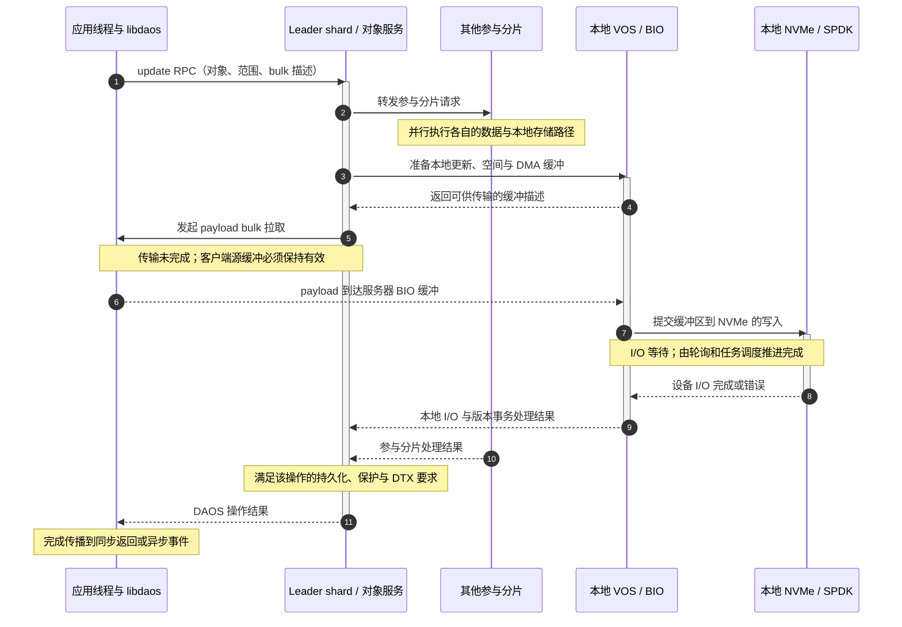
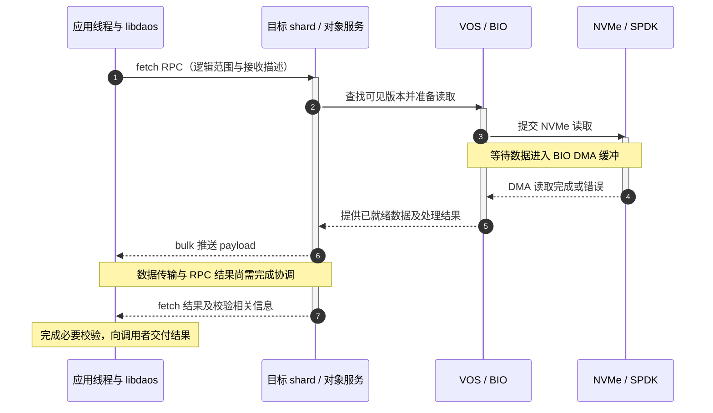
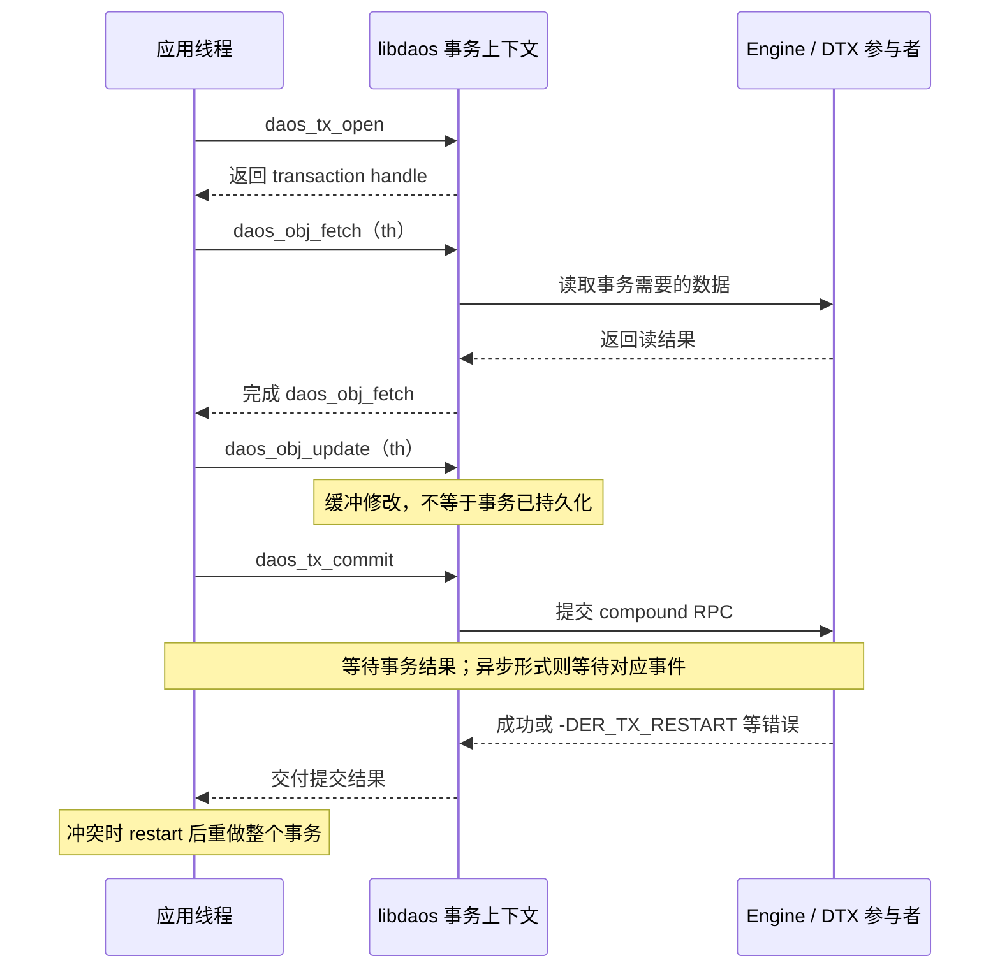

# DAOS 数据路径：Object I/O、RPC、RDMA、NVMe 与 Zero-Copy

> [!abstract] 这一篇只追三件事
> **谁决定要操作什么，字节经过哪些内存，什么完成事件才允许继续。**
> 一次 DAOS 写入不是一个 RDMA WRITE，也不是一次 SPDK 提交；它还包含对象布局、远端处理、本地版本与持久化，以及对象保护所要求的协调。[1][2][3]

> [!info] 示例路径的前提
> 以 DAOS 2.8.0 为基线，先讨论 **native Object API、`DAOS_TX_NONE`、大块 payload、具有 RDMA 能力的已配置 provider、数据落在 NVMe** 的路径。复制示例只展开一个 target 的本地处理段。
> 小请求、SCM 中的数据、EC、显式事务、高层 DFS/dfuse 接口有不同分支，不应机械套用这条时序。下列图是依据官方机制重组的**概念时序**，不是某个源码函数的逐行调用栈。

## 1. 先把一个 I/O 描述完整

[[7.28 DAOS 架构全景：Control Plane、CaRT、VOS、BIO 与 SPDK]] 已区分了进程与服务。到 I/O 层，首先要区分请求的**逻辑地址、内存地址和持久介质位置**。[1][4]

| 请求中的信息 | 它描述什么 | 它不是什么 |
|---|---|---|
| Container / object handle | 已打开对象的访问上下文 | 远端虚拟地址 |
| OID、object class | 对象身份、布局和保护方式 | 一个 SSD 的 LBA |
| Dkey | 对象内的分布键与局部性 | CaRT endpoint 或 engine rank |
| IOD（I/O Descriptor）中的 akey、value type | 要操作的值，以及 single/array 语义 | 一个通用 POSIX iovec |
| Array 的 recx（record extent） | 起始记录、记录数量 | 总是以字节计数的文件 offset |
| SGL（Scatter-Gather List）/ iov | 应用提供的内存区间 | 内存已经被注册、已完成传输的证明 |
| Transaction handle / epoch | 事务上下文与版本顺序 | Raft term 或 RPC 的重试次数 |

例如，数组记录大小为 **1 字节**、起始记录为 **4096**、记录数为 **4096**，逻辑上描述 4096 字节范围；如果记录大小换成 8 字节，同样的 recx 就不再表示同一段字节范围。请求的数据描述和内存容量必须相互匹配。[4]

原生 single value 更新替换整个值；array value 则可以更新若干 extent。把它们都写成“写 4 KiB”，会隐藏不同的请求组织和存储行为。

## 2. RPC 与 bulk：一条讲操作，一条搬 payload

对于大块 I/O，请求头不需要把所有用户数据都复制进 RPC 编码缓冲区。可以先传递对象、key、extent、事务与 bulk 相关描述，再由传输层执行数据移动。[1][2]

**RPC 不能省略。** 即使 bulk 最终使用 RDMA，服务端仍需要确定如何分配空间、校验上下文、处理版本、组织副本，以及何时向客户端报告结果。RDMA 提供的是传输机制，不是对象存储语义。

**Bulk 也不等于某一个固定 verbs 调用。** CaRT/Mercury 根据所选传输路径执行通信。本文“拉取”和“推送”描述的是 payload 方向，不声称所有 provider、所有长度都对应同一个底层硬件操作。[1][2]

在 [[4.5 Send Recv 与 RDMA Read Write]] 中，READ/WRITE 的发起方与数据方向已经不同；到 DAOS 中还要多问一层：**是客户端提出 update 请求，还是服务端发起获取客户端 payload 的 bulk 操作？** 二者可以同时成立。

## 3. 一次大块 update：先有操作，再有远端处理

### 3.1 请求准备和路由

客户端对象层利用对象信息与当前 Pool Map 得到布局，确定需要联系的 shard。复制模式的 I/O 可以由 leader shard 协调，并向其他参与分片转发请求；leader shard 同时处理自己的本地工作，协调参与分片的完成。[3]

这不是“每次 write 都去中央元数据服务问一次目标地址”。布局计算、缓存的 map 和发生变化后的刷新共同避免了这种串行元数据瓶颈。为什么 map 仍需要权威服务维护，在 [[7.30 DAOS 元数据：RDB、Raft、Pool、Container 与 Membership]] 中解释。

### 3.2 服务端本地段与完成协调



**这张图揭示的关键是：payload 到达内存、SSD I/O 完成、整个对象操作完成，是三个不同的事件。** 图中的等待区间表示“请求尚未完成”，不意味着 engine 的整个 OS 线程必须睡眠。

图只展开 leader 所在 target 的本地段。其他参与分片怎样取得 bulk 数据、如何转发及采用什么优化，取决于具体请求和实现分支；**不能从这张图推导出“所有副本数据都必定先经过 leader 的用户缓冲区复制一次”**。[2][3]

### 3.3 为什么不能把最后一步写成“等待 Raft majority”

对象数据保护与内部 DTX 协调，不是 Pool/Container 元数据 RDB 的 Raft 日志复制。即使这个对象恰好有三份副本，也不能照搬“三节点 Raft 收到两票就成功”的结论。[3][5]

另外，实现可能对 DTX 提交传播、批处理和状态整理做优化；本文不把“回复成功”解释成“所有节点的每张 DTX 表都已同步变成同一状态”。它应按 **DAOS API 与对应事务、保护协议的完成语义**理解，而不是按照图中某一条网络 ACK 猜测。

## 4. 一次 fetch：顺序大致反转，语义并不消失

VOS 先根据对象、keys、范围和读上下文确定可见版本，再为需要从 NVMe 读取的部分组织 I/O。NVMe 中的数据先通过 DMA 进入 BIO 缓冲，再传回客户端。[2][4]



图描述的是**正常 NVMe 数据段**。命中其他存储介质、小数据内联、稀疏数组、校验错误后恢复、EC 降级读，都可能增加或跳过某些步骤。尤其是 EC 降级读，可能需要读多个分片并重建数据，不能仅把单副本 fetch 的数字乘一个固定系数。[2][3][5]

校验和不是“打开以后只多一个标志”。对象层可能计算、验证或在读范围拼接时重新组织校验信息；它会消耗 CPU，并可能访问 payload 内存，即使数据移动没有经过额外的大块 `memcpy`。[3]

## 5. Zero-Copy：必须画出中间缓冲

![[图片/SVG/8_7_7_27_1.svg|900]]

**图 1 把网络 DMA 与存储 DMA 分成了两段。** 写入时，payload 从客户端内存经网络到服务器侧 BIO DMA-safe 缓冲，再由 NVMe 控制器读取该缓冲并写入设备。读取的字节方向相反。[2]

这里并没有画一根从网卡直通 SSD 介质的线，因为官方 BIO 文档明确描述了服务器侧中间缓冲。**“减少 CPU 数据拷贝”和“数据不经过服务器 DRAM”是两件不同的事。**

### 5.1 可以省掉什么，仍然需要什么

| 边界 | 可能减少的工作 | 仍然存在的条件或成本 |
|---|---|---|
| RPC 编码 ↔ 大 payload | 避免把整个大 payload 打包到一个 RPC 编码缓冲 | 小控制消息的编码与解析；不同大小请求可能选择不同路径 |
| 服务器网络缓冲 ↔ 存储缓冲 | 在合适路径复用 DMA-safe 内存，减少额外 CPU 拷贝 | 缓冲分配、映射、注册、配额及生命周期协调 |
| 用户态 ↔ 内核存储路径 | SPDK 的设备访问可绕过传统内核块 I/O 数据路径 | 设备初始化、权限与内存管理并没有从系统中消失 |
| 数据处理 | 不必为了传输而做某些中间拷贝 | 校验、EC 编解码、部分范围处理仍可能读写数据 |
| 上层文件接口 | 直接 native/DFS 路径可避免某些通用接口开销 | dfuse/FUSE、缓存与拦截库会改变端到端路径 |

“复用缓冲”不保证所有请求都达到相同效果：对齐、布局、小消息阈值、provider、数据保护方式和所用上层接口都要说明。没有测量就不能给整套 DAOS 贴上“全路径绝对零拷贝”的标签。

[[4.4 内存注册与零拷贝]] 和 [[4.12 rkey lkey 生命周期]] 提供注册与访问权限的基础；[[5.9 SPDK 环境与 HugePage]] 提供 DMA 内存环境的基础。**网络端可访问，不自动意味着存储端也可用；某个传输完成，也不自动意味着双方都不再引用该缓冲。**

### 5.2 持久性不是由 DMA 箭头定义的

网络完成只说明一个传输阶段推进到了相应边界，不是持久化证明。NVMe 完成的持久性还取决于命令语义、设备与平台的持久化契约；完整 DAOS 操作还要满足本地恢复和数据保护协议。不能仅凭“RNIC 已经完成”或者“SPDK 回调发生”自行替代这些保证。[2][5]

PMem 与 Metadata-on-SSD 的元数据持久化路径，在 [[7.28 DAOS 架构全景：Control Plane、CaRT、VOS、BIO 与 SPDK]] 中单独区分。这里的 payload 路径图没有把 WAL/META 的每笔内部 I/O 展开，**不代表元数据可以只留在易失内存**。

## 6. 资源所有权与完成层级

### 6.1 每个“成功”回答的问题不同

| 观察到的状态 | 最多可以说明什么 | 不能据此做什么 |
|---|---|---|
| 异步 API 接受请求 | 请求成功进入相应提交过程 | 立即重用源缓冲或读取未完成的结果 |
| 某次网络传输完成 | 特定网络操作达到其完成语义 | 宣称对象写入已经持久化并具备完整保护 |
| 某次 SPDK I/O 完成 | 一次本地存储请求有了结果 | 跳过其他分片、版本或 DTX 的协调 |
| 同步 DAOS 操作返回成功 | 该 API 操作按其约定完成 | 把显式事务中的 update 成功当作整个事务提交 |
| 异步事件完成且结果为成功 | 对应操作的异步结果可消费 | 忽略事件里的错误码，只看“事件出现” |
| `daos_tx_commit` 成功 | 显式事务完成提交 | 认为未来任何硬件组合故障都不可能损坏数据 |

DAOS API 同时支持同步形式和异步事件形式；事件是操作完成的组织方式，不是应用可以绕过错误处理的理由。具体事件队列和 API 参数约束，应对照同版本 public headers 与 Native Programming Interface。[6]

### 6.2 最小生命周期清单

| 资源 | 谁持有或管理 | 安全边界 |
|---|---|---|
| 应用源/目标内存 | 应用所有，操作执行期间供客户端库使用 | 完成前不释放、不缩容；写源不修改，读目标不提前消费 |
| IOD、recx、SGL 及它们引用的数据 | 应用构造，库按 API 使用 | 异步路径不能让栈对象在操作完成前失效 |
| Object / container / pool handle | 应用管理其使用期，库管理内部上下文 | 先结束依赖它们的操作，再按层级关闭 |
| Event / event queue | 应用按 DAOS 事件 API 管理 | 处理完成结果后再回收；不能用超时替代结束证明 |
| 服务器 BIO DMA 缓冲与 bulk 引用 | BIO、通信层及当前请求协作管理 | 网络与存储的全部相关引用结束后才可复用 |
| 显式 transaction handle | 应用控制事务生命周期 | commit/abort/restart 与 close 是不同动作 |

应用端最稳妥的教学策略是把请求描述、payload 和异步上下文聚合到一个请求对象中，直到该操作的**最终完成**再统一释放。显式事务中还要覆盖提交或中止所需的生命周期；不能根据一次快速返回的 update 推导缓存的数据已经被消费完。

这与 [[4.19 RDMA 故障恢复与连接重建]] 的原则一致：**业务超时并不等于底层 DMA 已停止，报错也不自动等于所有资源都已清理。** 退出时应先停止接收新操作，等待或按 API 收敛在途请求，再释放事件、对象、容器及池上下文。

## 7. 显式事务：不要沿用前面的逐次 update 时序

当 `th` 不是 `DAOS_TX_NONE`，必须重新审视“update 已经发到哪里”。官方事务模型描述：事务上下文中的读取由远端 engine 处理，修改操作在客户端缓冲；提交时组织 compound RPC，发送给选出的事务 leader，再协调实际修改。[7]



这张图最重要的不是函数排列，而是 **update 与 commit 之间存在尚未提交的修改**。前文的单次 update 数据路径，应当放到事务提交后的实际远端处理阶段理解，而不是复制到每一次事务 update 调用后面。

遇到 `-DER_TX_RESTART`，应用应按 API 重启事务，并重新执行相关读取、计算和修改。只重复最后一次 commit，可能保留已经过期的业务决策。远端是否保存了部分内部状态、DTX 如何恢复，与应用重新执行完整事务是两个相关但不同的问题。[7]

**Epoch、MVCC 和 DTX 的职责也不同。** Epoch 提供版本排序信息，MVCC 维护版本/可见性，DTX 支持分布式更新协调；仅有一个 HLC 时间戳，并不能自动产生事务原子性。进一步的元数据与一致性边界见 [[7.30 DAOS 元数据：RDB、Raft、Pool、Container 与 Membership]]。

## 8. 错误与背压：按路径定位，不只看一个延迟数字

以下是根据前面机制整理的**诊断框架**，不是固定的 DAOS 错误码处理表。

| 现象 | 优先区分的问题 | 需要的证据 |
|---|---|---|
| 请求刚发起就失败 | handle、权限、请求描述或布局是否合法 | API 返回码、客户端日志、服务端对应错误 |
| bulk 等待长 | provider、网络、注册/缓冲资源、传输推进是否正常 | provider 配置、通信层指标、在途请求数 |
| 网络正常但本地写慢 | BIO 缓冲、SSD 队列、设备错误或 NUMA 是否受限 | engine/BIO/SPDK 观测与设备状态 |
| 单分片完成快、整体慢 | 其他参与分片或 DTX 协调是否拖慢 | 按请求关联各分片与协调阶段 |
| 故障后大量重试 | Pool Map 是否过期；剩余布局与恢复策略怎样 | map version、排除状态、重建及错误分布 |
| CPU 持续忙 | 有效工作、轮询、校验/EC、还是失败重试循环 | CPU profile 与完成吞吐，而不只是 CPU 百分比 |

[[7.18 Backpressure 与过载保护]] 中“限制在途工作，而不只限制入口 QPS”的思想在这里很重要。一个大 I/O 可能同时占用客户端内存、传输描述、服务器 DMA 缓冲、多个分片和设备队列；无上限堆请求可能让这些资源先耗尽。

同样，[[7.13 幂等 重试 与请求去重]] 的边界仍然适用。网络超时后不能只凭应用自己的请求编号，就宣称重试必然不会重复产生业务效果；要区分框架内部重试、显式事务重启与应用层重复调用。

## 9. 怎样验证这条路径，而不是只跑出一个带宽

《Systems Performance》第 2 版第 12 章强调 **Active Benchmarking**：运行 benchmark 时同时观察系统，确认真正测到了什么，而不是把一个输出数字直接当作结论。以下矩阵是把该方法应用到 DAOS 的实验设计，并非已完成的实验结果。[8]

| 实验轴 | 建议对照 | 保持不变的条件 |
|---|---|---|
| 请求大小与数据模型 | 小 single value / 较大 array extent | 对象保护、数据分布、并发定义 |
| 入口接口 | native DAOS / DFS / dfuse | 逻辑数据量与实际调用语义 |
| 网络路径 | 实际支持的 TCP / RDMA provider | 客户端与服务器版本、网卡、拓扑 |
| 冗余方式 | 单分片无保护 / replication / EC | 必须明确耐久性与故障语义不同 |
| 并发与排队 | client 数、每 client 在途数、target 数 | 数据集、运行时间与预热策略 |
| 局部性 | engine 与 NIC/SSD/内存的 NUMA 位置 | 核心数量、频率策略与其他负载 |
| 背景状态 | 空闲 / aggregation / rebuild | 明确记录，不能把两种状态混成一组平均数 |

至少记录吞吐、完成 IOPS、延迟分布、错误/重试、客户端与服务端 CPU、缓冲/队列压力、设备状态，以及准确的数据集大小和保护方案。高层 IOR、mdtest 等测试应注明后端，native 对象与低层模块测试则说明覆盖到哪一层。[8][9]

> [!tip] 观测工具也有路径边界
> 从用户态 SPDK 路径推论：依赖内核块层的 `iostat`、block trace，不能单独证明某块由用户态驱动管理的 SSD 是否繁忙。应结合 DAOS/BIO/SPDK 的可用观测接口及设备状态。这是根据路径作出的工程推论，不是“内核工具对 DAOS 全部无效”。
> 同理，轮询占用一个核心，并不直接证明业务吞吐已经达到硬件上限。

### 9.1 在固定源码中找调用与清理边界

以下 **Bash + Git** 命令只搜索已有源码，不触发 I/O 实验。先确认提交存在，再从调用点继续追到定义；搜索结果不是自动生成的完整调用图。

```bash
set -euo pipefail
: "${DAOS_SRC:?请设置为本地 DAOS 源码仓库路径}"
REF=5a2536493607f065e0f6be51fd87b534a5eafa52
git -C "$DAOS_SRC" cat-file -e "${REF}^{commit}"

# 查看对象、通信与 BIO 边界，重点继续读错误分支和 callback。
git -C "$DAOS_SRC" grep -n -E \
  'daos_obj_update|daos_obj_fetch|crt_bulk_transfer|bio_iod_prep|bio_iod_post' \
  "$REF" -- src/include src/client src/object src/cart src/bio src/vos
```

接着选择一个匹配点，依次记录“资源由谁创建、回调由谁调用、错误后谁回收”。特别不要把 `src/object/srv_obj.c` 中一个看起来顺序执行的片段，直接当成跨 ULT、异步 I/O、转发请求后的完整生命周期。

## 10. 用四个问题自测

**update 的业务发起方是客户端，bulk 的发起方也必须是客户端吗？** 不必须。服务端收到操作描述后可以拉取客户端 payload；业务调用方向和数据移动机制应分别解释。[2]

**没有 CPU memcpy，为什么仍然有 DRAM 带宽成本？** 数据仍进入或离开服务器侧缓冲；DMA、校验和 EC 都可能消耗内存带宽。Zero-copy 不是 zero-memory-traffic。

**显式事务中 update 返回成功，可以释放所有事务相关内存并告诉业务写入已提交吗？** 不能这样推导。必须遵循该 API 的资源约束，并区分操作接受/缓冲与 transaction commit。[6][7]

**测得 NVMe 完成很快，为什么应用 P99 仍然很高？** 完整请求还可能等待调度、bulk、其他分片、错误重试和事务协调。应按阶段测量，而不是用设备单点延迟解释端到端延迟。[8]

## 参考资料

源码版本固定为本文 frontmatter 中的提交；官方在线资料访问日期：2026-09-07。图中的顺序只表达所声明路径的阶段依赖，不替代同版本 API 与具体实现分支。

[1] DAOS，*DAOS Internals*，Network Transport and Communications、Infrastructure Libraries。[固定源码](https://github.com/daos-stack/daos/blob/5a2536493607f065e0f6be51fd87b534a5eafa52/src/README.md)。

[2] DAOS，*Blob I/O*，DMA Buffer Management、SPDK Integration、NVMe Threading Model。[固定源码](https://github.com/daos-stack/daos/blob/5a2536493607f065e0f6be51fd87b534a5eafa52/src/bio/README.md)。

[3] DAOS，*Object*，Replication、Erasure Code、Checksum。[固定源码](https://github.com/daos-stack/daos/blob/5a2536493607f065e0f6be51fd87b534a5eafa52/src/object/README.md)。

[4] DAOS，*Storage Model*、*Versioning Object Store*，key-array、VOS Concepts、VOS Indexes。[存储模型](https://github.com/daos-stack/daos/blob/5a2536493607f065e0f6be51fd87b534a5eafa52/docs/overview/storage.md)；[VOS](https://github.com/daos-stack/daos/blob/5a2536493607f065e0f6be51fd87b534a5eafa52/src/vos/README.md)。

[5] DAOS，*Fault Model*，元数据复制与对象保护、Fault Isolation、Fault Recovery。[固定源码](https://github.com/daos-stack/daos/blob/5a2536493607f065e0f6be51fd87b534a5eafa52/docs/overview/fault.md)。

[6] DAOS，*Native Programming Interface* 与同版本 public API headers。[官方指南](https://docs.daos.io/v2.8/user/interface/)；[Public headers](https://github.com/daos-stack/daos/tree/5a2536493607f065e0f6be51fd87b534a5eafa52/src/include)。用于查明具体 API 的参数、事件和生命周期约束；本文没有提供未经编译的 C/C++ 程序。

[7] DAOS，*Transaction Model*，Distributed Transactions、Epoch and Timestamp Ordering。[固定源码](https://github.com/daos-stack/daos/blob/5a2536493607f065e0f6be51fd87b534a5eafa52/docs/overview/transaction.md)。

[8] Brendan Gregg，*Systems Performance: Enterprise and the Cloud*，第 2 版，第 12 章，§12.3.1 Passive Benchmarking、§12.3.2 Active Benchmarking。用于实验设计与观测方法，不作为 DAOS 具体实现说明。

[9] DAOS，*Run IOR and mdtest*。[官方测试指南](https://docs.daos.io/v2.8/testing/ior/)。
