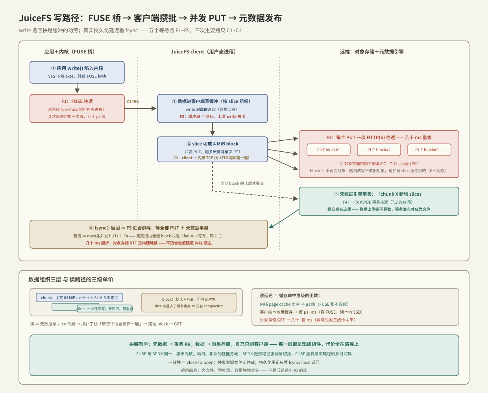

# JuiceFS 架构

> [[7.2 元数据路径瓶颈]] 的第三代方案说：把元数据交给事务性 KV，把数据交给能水平扩展的仓库。JuiceFS 是这条路线最彻底的工业样本——**它自己几乎不存任何东西**：元数据放进你选的数据库（Redis/TiKV/MySQL……），数据切块放进你选的对象存储（S3 及兼容品），自己只剩一个客户端，负责把这两个现成组件**拼装成一个 POSIX 文件系统**。这个「拼装」的代价全在路径上：一次 write 要穿越 FUSE 的两次内核-用户边界、攒批进客户端缓冲、变成 HTTP PUT 走到对象存储、再向元数据引擎提交一笔事务——每一步都有等待点和拷贝。本篇按由浅到深顺序讲三件事：FUSE 这个「用户态文件系统」机制本身、JuiceFS 的数据组织（chunk/slice/block 三层）、以及读写全路径的逐步对账——看懂它，就看懂了「用通用组件攒一个文件系统」要在哪里付账。

前置：[[7.2 元数据路径瓶颈]]（元数据引擎扮演的角色）、[[1.1 VFS 与系统调用路径]]（FUSE 是在 VFS 下面接管的）、[[7.7 对象存储路径]]（数据仓库那一半的脾气）、[[6.6 LSM-tree 三种放大]]（slice 机制是它的思想复刻）。

---

## 1. FUSE：文件系统跑在用户态的代价

JuiceFS 客户端是个普通用户态进程，应用却能用 `open/read/write` 访问它——桥梁是 **FUSE（Filesystem in Userspace）**【事实】：内核 VFS 收到对挂载点的调用后，不去找 ext4，而是把请求封装成消息，经字符设备 `/dev/fuse` 转发给用户态守护进程（这里就是 JuiceFS client），等它回复。

一次 4 KiB read 的 FUSE 段流转【事实】：

```text
应用 read() → 陷入内核 → VFS → FUSE 内核模块把请求排入队列
   → JuiceFS client（用户态）从 /dev/fuse 读到请求        ← 第 1 次内核→用户拷贝（请求）
   → client 干活（查缓存/访问 S3……）
   → client 把数据写回 /dev/fuse                          ← 第 2 次用户→内核拷贝（数据）
   → FUSE 模块填充 page cache → 唤醒应用 → 陷出           ← 应用从 page cache 再拷一次
```

记两笔账【事实/量级】：

- **上下文账**：每个请求至少两次额外的用户↔内核切换 + 一次进程唤醒——与 [[5.7 内核态 vs 用户态路径]] 的 syscall/唤醒账同源，只是方向反过来：SPDK 把驱动搬出内核省切换，FUSE 把文件系统搬出内核**多付**切换。小 IO 下 FUSE 自身开销可达几十 μs 级；
- **拷贝账**：数据在「client 用户态缓冲 → 内核 page cache → 应用缓冲」间至少多走一跳。缓解手段（大块请求、内核回写缓存、splice 零拷贝）都是在给这座桥减负【实现】。

为什么忍这笔税【取舍】：文件系统逻辑（连 S3、连数据库、加密压缩缓存）全在用户态，开发迭代不碰内核、崩了不带走机器——**与 SPDK 相同的「搬出内核」动机，相反的性能方向**，因为搬的东西不同：SPDK 搬的是热路径驱动，FUSE 搬的是复杂策略逻辑。

---

## 2. 数据组织：chunk / slice / block 三层

对象存储只会存不可变对象（[[7.7 对象存储路径]]），而 POSIX 允许随机改写——JuiceFS 用三层结构调和这对矛盾【事实/实现】：

| 层 | 大小 | 作用 |
| --- | --- | --- |
| **chunk** | 固定 64 MiB | 文件按偏移切成的逻辑段——纯粹为了定位：offset ÷ 64 MiB 即 chunk 号 |
| **slice** | ≤ chunk | **一次连续写入**产生一个 slice，属于某个 chunk；同一 chunk 内多个 slice 可以重叠，新 slice 压住旧 slice | 
| **block** | 默认 4 MiB | slice 落到对象存储的物理单位——每个 block 是一个不可变对象 |

关键在 slice【事实】：随机改写不改旧对象，而是**追加一个新 slice**（写新对象 + 元数据里记「此范围现在归我」）——读取时按元数据把重叠的 slice 按时间序叠起来，取每个位置最新的那层。这就是 [[6.6 LSM-tree 三种放大]] 的「更新即追加、新版本压旧版本」在文件内部的复刻；slice 堆太多读取要叠太多层时，后台把它们合并重写成一个 slice——**同一个 compaction，连名字都一样**【实现】。旧 block 成为垃圾，异步回收（空间放大同样复刻）。

C++ 视角一句话：chunk 是数组分段，slice 是 copy-on-write 的增量补丁栈，block 是补丁的持久化页——整个文件 = `分段 map<offset, 补丁栈>`，读 = 栈顶向下的第一个命中。

---

## 3. 写路径全流转：等待点与拷贝对账

以「应用顺序写 128 MiB checkpoint 文件，然后 fsync」为例：



| 步骤 | 发生什么 | 层级 | 等待点 | 拷贝 |
| --- | --- | --- | --- | --- |
| ① 应用 write() | 陷入内核，VFS → FUSE 转发 | 内核 | **F1：FUSE 往返**（两次切换 + 唤醒） | C1：应用缓冲 → 内核 → client 缓冲 |
| ② client 攒缓冲 | 数据进客户端写缓冲，按 slice 组织；write 立即返回（默认异步回写【实现】） | client 内存 | **F2：缓冲满 = 背压**——上游 write 开始被卡（有界缓冲的 try_push 语义） | 无 |
| ③ 切 block 上传 | slice 切成 4 MiB block，**并发** PUT 到对象存储 | 网络 | **F3：每个 PUT 一次 HTTP(S) 往返，几十 ms 量级**【量级】——靠并发摊薄，单流带宽有限 | C2：client → 内核 TCP 栈（TLS 加密再拷一次） |
| ④ 对象存储落数据 | S3 内部三副本/EC（[[7.1 副本 vs EC]]），返回 200 | 远端 | （包含在 F3 内） | 远端内部 |
| ⑤ 提交元数据 | 全部 block 确认后，向元数据引擎提交事务：「chunk X 新增 slice（block 列表）」 | 网络 + DB | **F4：一次 KV/DB 事务往返**——[[7.2 元数据路径瓶颈]] 的 M 段在此 | 小消息 |
| ⑥ fsync() 返回 | 等①~⑤ 全部完成：数据在对象存储 + 元数据已提交 | 汇合 | **F5：屏障**——等最慢的未完成 PUT（尾延迟由最慢 block 决定，fan-out 等齐问题同 [[7.1 副本 vs EC]] §2.1） | 无 |

读账要点【事实】：

1. **write 快是缓冲的功劳，不是路径快**——真实持久化延迟要看 fsync：几十 ms 起步（对象存储 RTT 地板）。对比本地盘 fsync 的百 μs 量级，差两个数量级——**JuiceFS 不适合做低延迟 WAL 的宿主**，适合大文件批量读写【实践】；
2. **提交点在元数据引擎**【事实】：block 全部上传成功但 ⑤ 未提交，这次写不存在（读不到、崩溃后消失）——与 [[6.1 WAL 与 Crash Consistency]] 「提交 = 日志落盘」同构：对象存储里的 block 只是数据，元数据事务才是「让它成为文件一部分」的原子发布；
3. 并发 PUT 是把「单流 RTT 高」换成「多流填带宽」——大文件吞吐能打满网卡，小文件/小写没得攒，F1+F3+F4 全额支付【事实】。

---

## 4. 读路径：三级缓存决定单价

读的流转是写的镜像（FUSE → 查元数据拿 slice 布局 → 定位 block → GET），但延迟几乎完全由**缓存命中在哪一级**决定【事实】：

| 命中层 | 路径 | 延迟量级 |
| --- | --- | --- |
| 内核 page cache | FUSE 都不穿越 | μs 级 |
| 客户端本地盘缓存 | 穿 FUSE，读本地 SSD（block 粒度缓存文件） | 百 μs~ms |
| 对象存储 | 穿 FUSE + GET 往返 | 几十~百 ms【量级】 |

配套机制【实现】：预读（顺序流探测，提前拉后续 block——[[1.6 readahead 与 posix_fadvise]] 的用户态版）；分布式场景下多机训练读同一数据集，各节点本地缓存互补（缓存组）。**排障时第一件事就是分层看命中率**——「JuiceFS 慢」大概率是「缓存没命中,在付 S3 的 RTT」。

一致性语义【事实/取舍】：默认 **close-to-open**——A close 之后 B 再 open 保证看到 A 的写入；两个进程同时打开同时读写**不保证**实时互见（元数据/数据缓存各有 buffer）。这是把 POSIX 严格语义降级换性能的经典取舍,分布式文件系统几乎都在此让步（NFS 同款语义）。

---

## 5. 与 C++ 线程模型的对账

| JuiceFS 机制 | C++ 同构物 | 说明 |
| --- | --- | --- |
| 客户端写缓冲 + 满则卡 write | 有界队列 `try_push` 阻塞降级 | 背压从对象存储 RTT 逐级传回应用——链条与 [[6.7 Compaction 策略]] §3 同型 |
| block 并发 PUT + fsync 等齐 | `std::vector<std::future>` 全部 `get()` | 汇合屏障,尾延迟 = max(各 future)——对冲/重试是同款药方 |
| slice 追加 + 元数据原子提交 | 准备好数据再原子发布指针 | 「先造不可变对象,再一次 release 发布」——第 5/6 章反复出现的 publish 模式,这里 release 由数据库事务扮演 |
| slice 重叠 + 后台合并 | 补丁栈 + 惰性合并 | LSM compaction 的文件内版本 |
| FUSE 往返 | 同步 RPC 到另一进程 | 每个 VFS 调用 = 一次跨进程请求-应答,这是「文件系统即服务」的字面实现 |

其中「并发上传 + 等齐」值得写成代码——它是 F3/F5 两个等待点的骨架,也是所有 fan-out 存储系统的公共形状:

```cpp
#include <future>
#include <span>
#include <vector>

struct Block { std::span<const std::byte> data; /* offset, id ... */ };
bool put_object(const Block& b);   // 一次 PUT:几十 ms 的 HTTP 往返

// slice 落盘 = 并发 PUT 全部 block,然后等齐——fsync 的 F5 屏障就是这个 join
bool flush_slice(std::span<const Block> blocks) {
    std::vector<std::future<bool>> inflight;
    inflight.reserve(blocks.size());
    for (const auto& b : blocks)                       // fan-out:用并发摊薄单次 RTT
        inflight.push_back(std::async(std::launch::async, put_object, b));

    bool ok = true;
    for (auto& f : inflight) ok = f.get() && ok;       // join:延迟 = max(各 PUT)
    return ok;   // 全部成功后才能提交元数据事务——发布点在 DB,不在这里
}
```

尾延迟由最慢的那个 `future` 决定——与 [[7.1 副本 vs EC]] §2.1 副本等齐同款数学;工程缓解也同款:失败/超时的 block 重试或对冲(hedged request),而不是拉长整体超时。

---

## 6. 排障清单：症状 → 判定 → 处置

| 症状 | 先看什么 | 典型根因 | 处置方向 |
| --- | --- | --- | --- |
| 读吞吐低且波动大 | 客户端指标:page cache/本地缓存/S3 三级命中率 | 缓存未命中,付 S3 RTT | 加大本地缓存盘;确认预读生效;训练场景开缓存组共享 |
| 顺序写吞吐上不去 | 并发上传数、单 PUT 延迟、网卡利用率 | 并发不足以摊薄 RTT,或缓冲太小 | 调大写缓冲与上传并发;确认没被 TLS/CPU 卡住 |
| fsync 慢(几十 ms 起) | 拆 F3(最慢 block PUT)与 F4(元数据事务) | 对象存储 RTT 是物理地板 | 属预期;低延迟持久化需求换介质,别硬调 |
| 小文件/海量文件操作慢 | open/stat 延迟 vs read 延迟([[7.2 元数据路径瓶颈]] §5 同款) | M 段主导 + 每文件独立对象开销 | 打包;换元数据引擎档次(Redis 快于 MySQL【实现】) |
| 随机小写后读变慢 | chunk 的 slice 数量统计 | slice 堆叠,读要叠层 | 等/触发 slice compaction;写入模式改追加 |
| 两进程互相读不到对方刚写的数据 | 是否理解为 bug | close-to-open 语义本就如此 | 业务侧用 close/open 建立同步点,或换强一致模式(牺牲缓存) |
| 删除后 S3 账单没降 | 引擎的待回收对象计数 | 旧 block 异步 GC 有滞后 | 等回收周期;确认 GC 任务在跑——同 [[6.6 LSM-tree 三种放大]] 墓碑沉底的账 |

---

## 7. 陷阱与误区

> [!warning] 常见错误
> 1. **把 JuiceFS 当低延迟块设备用**：数据库/WAL 压上去,fsync 的几十 ms 地板立刻现形——它的主场是大文件吞吐与容量弹性,不是小 IO 延迟。
> 2. **看 write 返回快就以为持久了**:默认异步回写,数据还在客户端缓冲——崩溃丢缓冲内数据;持久化承诺只看 fsync/close 返回【事实】。
> 3. **忽略 FUSE 税做小 IO 基准**:4 KiB 随机读写测出来的是 FUSE 往返 + 元数据 RTT,不是对象存储带宽——基准要按目标负载的 IO 尺寸设计。
> 4. **元数据引擎随便选**:它是每次 IO 的 M 段(F4)与整个命名空间的单点事实源——引擎的延迟档次、事务能力、容灾等级直接定义文件系统的档次【实践】。
> 5. **多客户端并发写同一文件**:close-to-open 之外无仲裁,重叠 slice 按提交序叠加,结果依赖时序——并发写同文件的协调是业务的责任。
> 6. **本地缓存盘不设上限/不监控**:缓存写满盘会反噬同机其他服务;缓存目录的容量与淘汰要纳入容量规划【实践】。

---

## 8. 关键结论

| 结论 | 性质 |
| --- | --- |
| JuiceFS = 客户端拼装:元数据 → 事务 KV/DB,数据 → 对象存储;自身几乎无状态 | 事实 |
| FUSE = 每个 VFS 调用变一次跨进程 RPC:两次额外切换 + 多一跳拷贝——与 SPDK 同一「搬出内核」动机,相反的性能方向 | 事实 |
| chunk(定位)/slice(一次连续写,可重叠压旧)/block(不可变对象)三层,把随机改写调和进不可变仓库——LSM 思想的文件内复刻,连 compaction 都同名 | 事实 |
| 写路径五个等待点:FUSE 往返、缓冲背压、PUT 往返(几十 ms 量级)、元数据事务、fsync 汇合屏障 | 事实/量级 |
| 提交点在元数据引擎的事务——block 上传完不算数,元数据发布才让数据成为文件的一部分 | 事实 |
| 读延迟 = 缓存命中层级的函数:page cache(μs) / 本地盘(百 μs~ms) / S3(几十 ms)——排障先看三级命中率 | 事实/实践 |
| 一致性是 close-to-open,并发写同文件无仲裁——POSIX 语义降级换性能的经典取舍 | 事实/取舍 |
| 适用画像:大文件、吞吐型、容量弹性优先;不适合低延迟小 IO 与 WAL 宿主 | 实践结论 |

---

## 关联知识

- [[7.2 元数据路径瓶颈]] - 元数据引擎那一半的通用理论(M 段、租约、事务 KV 路线)
- [[7.7 对象存储路径]] - 数据仓库那一半的脾气:不可变对象与 HTTP 语义
- [[7.1 副本 vs EC]] - 对象存储内部的冗余;fan-out 等齐的尾延迟同款
- [[6.6 LSM-tree 三种放大]] / [[6.7 Compaction 策略]] - slice 机制的思想母体
- [[6.1 WAL 与 Crash Consistency]] - 「提交点 = 原子发布」的单机原型
- [[1.1 VFS 与系统调用路径]] - FUSE 在内核侧的挂接点
- [[1.6 readahead 与 posix_fadvise]] - 预读思想的内核版
- [[5.7 内核态 vs 用户态路径]] - 「搬出内核」的另一个方向:对照理解 FUSE 税
- [[7.4 3FS 架构]] - 同为第三代元数据路线,但为 AI 负载把数据路径推到另一个极端
