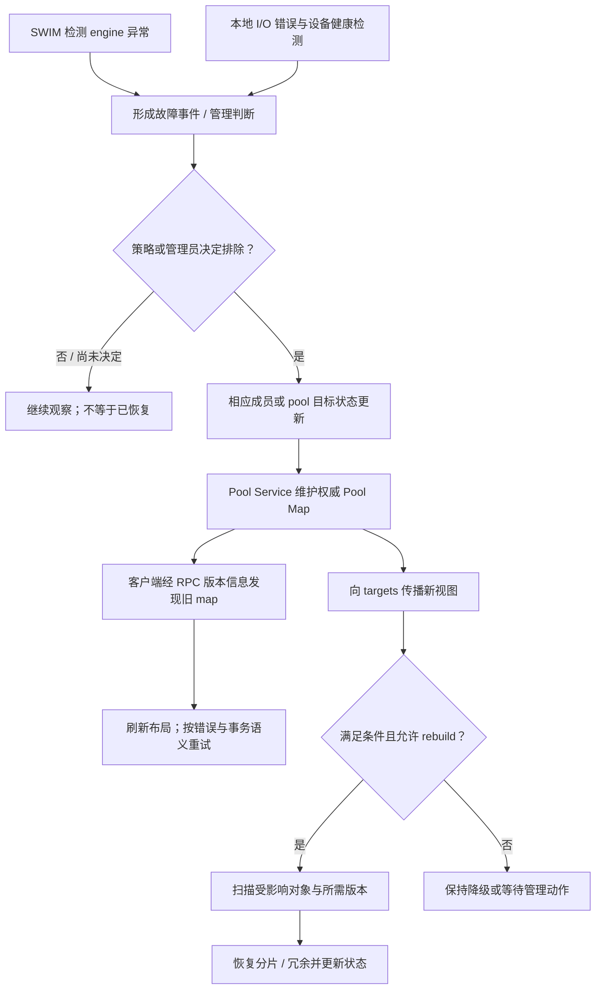

# DAOS 元数据：RDB、Raft、Pool、Container 与 Membership

> [!abstract] 先问“谁拥有这份权威信息”
> **DAOS 没有一张承载所有系统元数据、对象索引和用户数据的全局 Raft 表。**
> 管理服务维护系统级状态；Pool/Container 服务维护相关权威元数据；每个 target 的 VOS 维护本地对象版本、索引和 DTX 状态；SMD 维护本地设备与 blob 等映射。DDB 则是观察这些结构的诊断工具，不是另一套复制数据库。[1][2][3][4]

> [!info] 版本与资料边界
> 本文以 DAOS 2.8.0 的固定源码提交为基线。DDIA 第 1 版用于 MVCC、协调服务等基础概念；DAOS 的数据库划分与行为用官方资料验证。
> `src/container/README.md` 中标为 “TO BE UPDATED” 的 Target Service 及旧 epoch protocol，不被当作 2.8 的完整事务 API。当前显式事务流程按 `docs/overview/transaction.md` 理解。[5][6]

## 1. “元数据”至少有四种，不要混成一层

在 [[7.2 元数据路径瓶颈]] 中，元数据通常被当作需要单独优化的一类访问。到 DAOS 中，还必须继续拆分它的作用域和权威持有者。

| 元数据类别 | 典型内容 | 谁负责 | 是否等同于用户对象 payload |
|---|---|---|---|
| 系统级管理状态 | engine 成员、rank 分配、pool service 相关系统记录 | Go 控制面管理服务的系统数据库 | 否 |
| Pool / Container 服务元数据 | Pool Map、属性、句柄、容器记录、快照相关记录 | 相应服务及 C 侧 RDB/复制服务机制 | 否 |
| Target 本地对象元数据 | OID/key 索引、extent/version、incarnation log、DTX 表 | VOS 等本地存储逻辑 | 否，但与 payload 的可见性和恢复直接相关 |
| 本地存储管理元数据 | 设备、执行流、pool/blob 等映射与设备状态 | SMD/BIO 等本地模块 | 否 |

“metadata”只是说明信息的用途，不能据此判断它一定在控制面、一定经 Raft、或者可以不考虑持久化。**本地 VOS 索引也是元数据，但它服务于对象的数据面访问。**[1][2][3]

![[图片/SVG/8_7_7_28_1.svg|900]]

**图 1 中两个复制域分别代表系统管理和池相关服务的逻辑责任，示例副本数量不表示默认配置。** 下方的 VOS 分布在各 target 上；DDB 用虚线指向诊断对象，不在正常业务链路中。容器的逻辑层级并不意味着“每个容器都必定新建一个独立 Raft 集群”。

## 2. 管理服务数据库与 RDB：都用 Raft，不是同一个东西

### 2.1 Go 控制面：系统成员和管理状态

固定版本的 `src/control/system/raft/raft.go` 直接使用 HashiCorp Raft、raft-boltdb 和相关传输组件。代码把管理服务数据库描述为 FSM：修改以离散日志项表达并在副本间复制。[2]

其操作类型包含增加/更新/删除成员、增加/更新/删除 pool service 记录，以及系统属性等。这里讨论的是**系统级管理数据库**，不是每个用户对象的 dkey/akey 数据库。

一个直接的源码阅读方法是先查“这个 rank 从哪里分配”，再查“分配记录如何持久化与复制”。`src/control/server/README.md` 的 Join 流程描述了控制面接收加入请求、记录成员并分配 rank，再通过本机 dRPC 把信息交给 engine。[7]

> [!warning] 导入库名不是部署架构
> Go 代码中出现 `go.etcd.io/bbolt`，不意味着 DAOS 必须部署一个外部 etcd 服务；它在这里是库依赖。类似地，“使用 Raft”也不意味着 Go 管理服务数据库与 C 侧 RDB 共用同一份日志或同一个 leader。[2]

### 2.2 C 侧 RDB：Pool/Container 相关服务的复制基础

**RDB（Replicated Database）**支持池、容器相关服务的高可用元数据。服务把操作转换为状态查询和确定性的状态更新，更新先提交到复制日志，再应用到服务状态。RPC 由当前服务 leader 处理，非 leader 尝试返回重定向提示，客户端缓存并更新对 leader 的认识。[1]

这是 [[7.11 Primary-Backup 与 Multi-Raft]] 中“复制状态机与服务领导权”在具体系统里的落点。但不能进一步推导出“所有对象请求都绕到这个 leader”。对象数据的 replica/EC 和 DTX 是不同路径。

RDB 使用 VOS 来支持本地状态原子更新，方向是 **复制服务依赖本地存储机制**。反过来说“因此所有 VOS 用户数据都由 RDB 复制”是不成立的。[1]

### 2.3 元数据读不是随便读一份副本

RDB 文档区分了查询与更新：查询不一定需要生成新的复制日志项，但仍要满足当前领导权与不返回过期结果的要求。不能把“只读”当成“任意 follower 都可以直接回复最新状态”的理由。[1]

已有的 [[7.12 Lease 与 Fencing]] 有助于理解为什么“我还活着”不能证明“我仍有权服务”。DAOS 的具体 leader 检查与 lease 等细节仍应以版本实现为准，而不是把通用 lease 模板直接粘贴到 RDB 中。

## 3. Pool：把目标集合变成可用于放置的权威布局

### 3.1 Pool 不是一个远端目录

Pool 在一组 targets 上预留资源；一个 target 上属于该 pool 的本地份额可以理解为 pool shard。Pool Map 描述成员、状态、拓扑与故障域信息，并以版本标识更新。[8]

它不仅回答“谁在线”，还回答“哪些目标属于这个 pool，哪些目标共享故障风险，以及当前布局应该避开哪些目标”。所以系统成员表与 Pool Map 是相关但不同的视图。

**系统里有这个 engine，不等于某个 pool 已经把它纳入自己的目标集合；engine 已重新启动，也不等于它的数据已经 reintegrate 完成。**

### 3.2 算法放置与 map 缓存为什么需要一起看

客户端可以根据 OID、object class 和 Pool Map 生成对象布局，不需要为每个对象的每次 I/O 都查一个中央位置表。但是这种计算依赖当前有效的 map；目标排除和故障恢复后，需要让旧视图失效并传播新视图。[8][9]

[[7.16 数据放置与 Rebalance]] 解释了“布局算法”和“布局变更后的数据移动”不是同一动作。在 DAOS 中，即使新 map 已经决定替代分片放在哪个 target，也还需要实际恢复所需的数据与版本，不能只更新一张表就宣布恢复完成。

### 3.3 三份服务副本不意味着三份用户数据

假设教学集群把某个 pool service 配成三个投票副本，同时某个对象采用 `OC_RP_2G1`。前者的 Raft 多数派是 2，允许少数派失效；后者表示一个对象冗余组中的两份数据副本。这是两套不同的集合与协议，不可以相互替代。[1][10]

对一个固定的 Raft 投票集合，常见多数派条件为：

$$
q = \left\lfloor \frac{n}{2} \right\rfloor + 1
$$

它不能被拿来直接计算所有 DAOS 对象写入的完成条件。对象 class、DTX 和可用分片状态必须另行分析；这里的数字也不代表 2.8 的系统默认冗余配置。

## 4. Container：命名空间、句柄、事务与快照边界

Container 是 pool 内的私有对象地址空间，也是 DAOS 事务与快照的数据管理边界。访问需要先取得 pool 上下文，再按 API 打开 container，获得相应访问上下文。[5][8]

容器服务需要保存容器属性、打开句柄及能力、快照等信息；每个 target 上的 VOS 则保存自己承载的该容器对象与版本。**全局容器记录存在，不意味着每个 target 此刻都有该容器的所有用户对象。**

### 4.1 容器属性与 akey 不是同一种 metadata

例如 container 的 checksum 相关配置，是容器服务管理的属性；对象中 `akey=shape` 的 value，则是应用自己的对象数据。两者都可能被口语称为“元数据”，但 I/O 路径和管理接口不同。[5][8]

如果在 [[7.28 DAOS 架构全景：Control Plane、CaRT、VOS、BIO 与 SPDK]] 的 checkpoint 例子里，要原子地更新 shape 和 payload，应考虑容器内事务，而不是因为字段叫“metadata”，就把它写到 pool service 的属性表里。

### 4.2 容器事务不是 Raft 日志的一次 append

DAOS 显式事务可把同一容器内的多个操作组织为一个事务。官方模型采用基于多版本时间戳排序的乐观并发控制，并提供可串行化事务；发生冲突可能返回 `-DER_TX_RESTART`，由应用重启整个事务。[6]

这与 DDIA 第 1 版中 MVCC 的基础解释有关：保留多个版本，允许读取按可见性规则选择版本。但 **使用 MVCC 不等于隔离级别只能是 Snapshot Isolation**；也不能从“有快照”推导出所有未开启事务的应用读写组合都自动原子。[11]

## 5. Epoch、term、map version：不同问题使用不同的序号

| 标识 | 服务于哪个问题 | 典型误解 |
|---|---|---|
| Engine rank | 标识系统中的 engine | rank 就是主机 IP 或 Linux PID |
| Engine incarnation | 区分同一逻辑成员的不同运行实例 | 旧实例消息与新实例消息无需区分 |
| Pool Map version | 标识 pool 布局/成员状态的版本 | version 增加就代表用户写事务提交 |
| 某个 Raft 组的 term / log index | 领导权任期与复制日志位置 | 所有服务和对象共享一个全局 term |
| Epoch | DAOS I/O 与版本排序；64 位 HLC 形式 | epoch 就是 Raft term 或应用自己递增的包序号 |
| Snapshot epoch | 为一致的数据视图保留一个版本边界 | 任意旧 epoch 都能永久重读 |

**HLC（Hybrid Logical Clock，混合逻辑时钟）**结合物理时间与逻辑排序信息，DAOS epoch 使用这一类时间戳。但不能把它当作一张“无需协议就知道谁先完成”的证明。客户端完成时间、服务器收包时间、版本排序和事务提交，是不同的观察维度。[6][9]

### 5.1 VOS 为什么需要版本索引与 incarnation log

VOS 在本地维护从 container、object、dkey、akey 到值/extent 的层级索引，并记录对象或 key 的创建和 punch 历史。读取不仅要找一个地址，还要检查当前读上下文能看到哪个版本、哪些范围，以及对应实体是否被删除。[3]

这里的 **VOS incarnation log 记录对象或 key 的创建/punch 历史，与 engine incarnation 区分进程运行实例不是同一个概念**。两个术语共享 incarnation 一词，不应互相替代。[3][9]

“删除”因此不总是立即把物理空间归还给分配器：如果旧快照仍需要相关版本，就不能随意回收。另一方面，保留所有历史也会不断增加空间和索引负担，所以需要 aggregation 等过程清理不再需要的历史。[3]

### 5.2 Snapshot、aggregation、rebuild 的关联

一个保留下来的 snapshot 是对历史一致视图的承诺。空间回收必须尊重仍需要的历史，故障恢复也不能只恢复最新值、却悄悄破坏仍保留的快照。[3][6][9]

可以按职责理解：**snapshot 决定哪些历史需要保留，aggregation 回收不再需要的历史，rebuild 在故障后恢复所需冗余。** 这些工作可能争用同一台机器的 CPU、内存和 SSD，但目标不同。

## 6. 四种一致性工作，不要用一个“事务”覆盖

| 机制 | 保护的边界 | 不能替代的工作 |
|---|---|---|
| 管理服务数据库的 Raft | 系统级管理状态的复制与领导权 | 对象 payload 的数据保护 |
| Pool/Container 服务的 RDB | 相应权威元数据的复制与一致性 | 每个用户对象的完整读写协调 |
| VOS 本地持久化事务 / WAL 等 | 单个本地存储结构的崩溃一致性 | 跨 target 的完整事务语义 |
| DAOS 事务与内部 DTX | 分布式对象操作的协调、冲突和恢复 | 任意数量硬件故障下都不丢数据 |

本地 PMem 事务和分布式 DAOS 事务不是同一种事务，这是 VOS 文档明确区分的边界。[3] 在 Metadata-on-SSD 部署中，也不能把本地 WAL 和 RDB 的 Raft log 当成一个日志系统；前者解决本地恢复，后者解决副本间的权威状态复制。

有关 Metadata-on-SSD 的版本差异，统一参见 [[7.28 DAOS 架构全景：Control Plane、CaRT、VOS、BIO 与 SPDK]]，避免在多篇笔记中复制一套容易过期的部署结论。有关 `DAOS_TX_NONE` 与显式事务提交时机，参见 [[7.29 DAOS 数据路径：Object IO、RPC、RDMA、NVMe 与 Zero-Copy]]。

## 7. Membership：检测、排除、传播、恢复是四步

[[7.15 Membership 与故障检测]] 已解释“观察不到响应”和“达成权威成员决定”之间的差别。DAOS 官方故障模型描述了基于 SWIM 的 engine 故障检测，以及本地存储健康检测；随后才是目标排除和 Pool Map 更新。[9]

### 7.1 从异常到恢复的概念流程



**图 2 表达职责与因果关系，不表示每个事件必定按同一函数调用顺序经过全部模块。** 系统成员状态和每个 pool 的目标状态可能分别更新；不是先把一张通用成员表写入任意 Raft，就自动完成全部排除。

自动恢复是否发生还受到系统与 pool 的策略、当前状态及可用资源约束。2.8 的发布说明明确区分自动 self-healing 策略和管理员启动/停止 rebuild 的工作流，所以不能把“检测到故障后总是无条件立即重建”写成定律。[12]

### 7.2 为什么客户端可能暂时还拿着旧 map

官方故障模型描述：targets 会被较快通知 pool map 变化；客户端则通过请求携带的 map version 及回复中的版本信息，发现自己缓存的布局过期，再取得新视图。这两种传播方式不是完全同步的。[9]

因此，在日志里看见短时间的新旧 map version 并存，不足以直接认定发生 split brain。应继续检查旧请求怎样被拒绝、刷新或重试，是否遵守有效布局与事务规则。反过来，不能因为“最终会刷新”，就忽略旧实例继续提供错误服务的风险。

### 7.3 重启、重新加入和 reintegration 不是同义词

Engine 的运行实例可通过 incarnation 区分；进程重新启动并加入系统，解决的是成员和进程层面的问题。该 target 的数据是否与当前布局一致、是否需要 reintegration 或其他恢复处理，是另一个问题。[9]

[[7.17 Recovery 与 Rebuild]] 可以帮助区分“重启恢复本地状态”和“跨节点补回冗余”。诊断报告里应同时记录 engine 状态、pool map 状态、对象数据保护与恢复状态，而不是只有一个“服务器已启动”。

## 8. 故障推演：元数据可用与数据可用分别判断

下表是依据上述责任边界整理的**教学推演**。它不承诺所有缓存句柄、操作类型或故障组合都有相同可用性。

| 故障场景 | 可以先判断什么 | 不能直接宣布什么 |
|---|---|---|
| 元数据服务失去 quorum，但用户数据盘尚在 | 相关权威元数据更新及需要该服务的操作受到影响 | 所有既有对象 I/O 必定立刻停止，或必定全都继续 |
| 单个对象的一部分分片丢失，元数据正常 | 由 object class、剩余分片及布局决定能否读取和恢复 | Raft leader 正常就说明用户数据没有风险 |
| 同一故障域同时丢失多个副本 | 原先的“副本数”不足以代表独立故障承受力 | 两份或三份数据落在同一主机就等价于跨主机保护 |
| 数据字节仍在，但本地索引/WAL损坏 | 需要检查逻辑定位与恢复信息是否仍完整 | 可以无条件从任意残余 blob 自动还原所有对象 |
| 网络超时后重发容器管理请求 | 需要检查 leadership、已提交状态及操作幂等性 | 超时就意味着先前操作从未执行 |

RDB 文档特别指出：服务向其他服务发出会改变状态的 RPC 时，需要考虑幂等性，因为领导权变化和客户端重试可能导致再次发送。这与 [[7.13 幂等 重试 与请求去重]] 的问题直接相接，而不是 Raft 自动替业务免除了所有重试处理。[1]

## 9. DDB：观察 VOS 的工具，不是新的数据库服务

### 9.1 名字首先要记对

**DDB = DAOS Debug Tool。** 官方说明将它类比于文件系统 debugfs：可以导航 VOS 格式的数据结构，查看 container、object、dkey、akey、extent；实现上由 Go 界面包装 C/VOS 相关功能。[4]

它有命令行和交互方式，也有需要显式启用的写模式。把 DDB 写成 “Distributed Database”，再给它安排 Raft 或 Membership 的职责，是概念性错误。

### 9.2 只读不意味着可以随便打开运行中的存储

读取模式降低误修改的风险，但不能保证对正在变化的底层结构得到一致视图。学习时应使用离线且一致的测试数据副本，并按存储模式准备所需文件和设备上下文。Metadata-on-SSD 的恢复环境还涉及 metadata、WAL、blob 和相关映射，不能只复制一个看似 VOS 的文件就假定足够。

本篇只建议从 `ddb --help` 了解接口，以及在受控环境中阅读 `ls`、`superblock_dump`、`dtx_dump`、`vea_dump` 等命令的说明。**不提供对生产数据执行写模式、清理 DTX、改 VEA 或修复结构的操作步骤。**

### 9.3 在线观察先从管理查询开始

以下是 **Bash** 的只读检查示例。要求已安装对应版本客户端工具，管理认证和配置可用，`POOL` 为实际目标 pool 标识；命令失败时要读取返回信息，不应自动换成格式化或修复命令。

```bash
set -euo pipefail
: "${POOL:?请设置需要查询的 pool UUID 或 label}"

# 先核对工具版本，再分别观察系统与某个 pool。
dmg version
daos version
dmg system query
dmg pool query "$POOL"
dmg storage query list-devices

# 只查看诊断工具说明；不打开或修改任何 VOS 数据。
ddb --help
```

这些查询分别帮助建立主机/engine、pool、设备等坐标。它们不是压力测试，也不验证崩溃一致性。尤其不要把恢复工具的 “dry-run” 自动理解为对系统状态完全无影响；管理查询与进入检查/修复工作流应严格区分。[4][12][13]

## 10. 进入源码时，先追权威状态，再追故障分支

| 固定版本源码入口 | 阅读重点 |
|---|---|
| `src/control/server/` | Join、管理请求、engine 生命周期与本机 dRPC |
| `src/control/system/raft/raft.go` | 系统数据库 FSM、成员/pool service 操作类型、Raft 依赖 |
| `src/rdb/README.md` 及实现 | leader RPC、日志提交/应用、查询领导权、重定向 |
| `src/pool/` | Pool Map 与池服务状态变更 |
| `src/container/` | 容器属性、句柄、快照；识别遗留 epoch 文档 |
| `src/vos/` | 本地对象层级、版本、ilog、DTX 与 aggregation |
| `src/bio/` | SMD 映射、设备状态与 I/O 故障信息 |
| `src/utils/ddb/` | 诊断入口如何通过 VOS API 读取结构 |

源码阅读时，对每一次修改写下四项：**权威状态在哪里，修改怎样持久化，旧 leader/旧 map 怎样被识别，跨服务副作用怎样容忍重复执行。** 这样才能把 [[7.20 元数据服务高可用]] 的一般原则转成可在 DAOS 代码中核对的问题。

## 11. 最后自测

**为什么系统 DB 和 RDB 要分开画？** 它们的职责、实现语言、状态集合和复制域不同；共享 Raft 这个算法名称，不代表共享一套日志和领导权。[1][2]

**为什么 Raft quorum 正常，仍然可能丢用户数据？** quorum 只保护该复制域里的状态；用户数据的生存取决于对应对象分片、故障域和保护方案。[1][9][10]

**为什么 dkey/akey 索引不应全画进中央元数据服务？** VOS 在各 target 本地维护对象索引和版本，Pool/Container 服务管理的是不同作用域的权威信息。[3][5]

**为什么看到 snapshot，不能直接写“DAOS 只有快照隔离”？** 快照是版本视图，MVCC 是机制，事务隔离级别是额外保证；官方 DAOS 事务模型明确描述了可串行化事务。[6][11]

**为什么重建完成不能只看一条启动日志？** 权威 map、分片数据、所需历史和冗余恢复都要有对应证据；开始执行与完成目标不是同一个事件。[9]

## 参考资料

教材支撑一般模型，具体实现以固定 DAOS 源码及官方文档为准。在线资料访问日期：2026-09-07。图示与故障推演为教学重组，不代表默认集群配置或全部故障分支。

[1] DAOS，*Replicated Data Base (RDB)*，Architecture、RPC Handling。[固定源码](https://github.com/daos-stack/daos/blob/5a2536493607f065e0f6be51fd87b534a5eafa52/src/rdb/README.md)。

[2] DAOS，`src/control/system/raft/raft.go`，管理数据库 FSM、成员操作与依赖库。[固定源码](https://github.com/daos-stack/daos/blob/5a2536493607f065e0f6be51fd87b534a5eafa52/src/control/system/raft/raft.go)。

[3] DAOS，*Versioning Object Store*，本地事务、VOS Concepts、VOS Indexes、incarnation log。[固定源码](https://github.com/daos-stack/daos/blob/5a2536493607f065e0f6be51fd87b534a5eafa52/src/vos/README.md)。

[4] DAOS，*DAOS Debug Tool (ddb)*，Description、Help and Usage。[固定源码](https://github.com/daos-stack/daos/blob/5a2536493607f065e0f6be51fd87b534a5eafa52/src/utils/ddb/README.md)。

[5] DAOS，*DAOS Container*，Metadata Layout。[固定源码](https://github.com/daos-stack/daos/blob/5a2536493607f065e0f6be51fd87b534a5eafa52/src/container/README.md)。不沿用其中旧 Target Service/epoch protocol 作为当前事务 API。

[6] DAOS，*Transaction Model*，Epoch and Timestamp Ordering、Container Snapshot、Distributed Transactions。[固定源码](https://github.com/daos-stack/daos/blob/5a2536493607f065e0f6be51fd87b534a5eafa52/docs/overview/transaction.md)。

[7] DAOS，*DAOS Server*，Bootstrapping and DAOS System Membership。[固定源码](https://github.com/daos-stack/daos/blob/5a2536493607f065e0f6be51fd87b534a5eafa52/src/control/server/README.md)。采用 Join 的职责划分；具体配置键以 2.8 发布说明与配置文档为准。

[8] DAOS，*Storage Model*，DAOS Pool、DAOS Container。[固定源码](https://github.com/daos-stack/daos/blob/5a2536493607f065e0f6be51fd87b534a5eafa52/docs/overview/storage.md)。

[9] DAOS，*Fault Model*，Fault Detection、Fault Isolation、Fault Recovery、Engine Self-Termination。[固定源码](https://github.com/daos-stack/daos/blob/5a2536493607f065e0f6be51fd87b534a5eafa52/docs/overview/fault.md)。自动处理策略还须结合版本文档，不把早期概述中的自动恢复描述无条件化。

[10] DAOS，*Object*，Object Class、Replication。[固定源码](https://github.com/daos-stack/daos/blob/5a2536493607f065e0f6be51fd87b534a5eafa52/src/object/README.md)。

[11] Martin Kleppmann，*Designing Data-Intensive Applications*，第 1 版，2017。第 7 章 “Snapshot Isolation and Repeatable Read”，印刷页 238–240；第 9 章 “Membership and Coordination Services”，印刷页 370–372。用于区分多版本机制、隔离级别和协调服务，不作为 DAOS 实现说明。

[12] DAOS，*Release Notes v2.8*，System-Level Rebuild Control、Check and Repair、Known Issues and Limitations。[官方发布说明](https://docs.daos.io/v2.8/release/release_notes/)。

[13] DAOS，*System Administration*、*Pool Operations*，查询接口；*Blob I/O*，SMD 查询。[System Administration](https://docs.daos.io/v2.8/admin/administration/)；[Pool Operations](https://docs.daos.io/v2.8/admin/pool_operations/)；[BIO](https://github.com/daos-stack/daos/blob/5a2536493607f065e0f6be51fd87b534a5eafa52/src/bio/README.md)。

命令形式补充核对：同版本 [`dmg/main.go`](https://github.com/daos-stack/daos/blob/5a2536493607f065e0f6be51fd87b534a5eafa52/src/control/cmd/dmg/main.go) 与 [`daos/main.go`](https://github.com/daos-stack/daos/blob/5a2536493607f065e0f6be51fd87b534a5eafa52/src/control/cmd/daos/main.go) 的 `cliOptions`；版本查询为 `version` 子命令。
