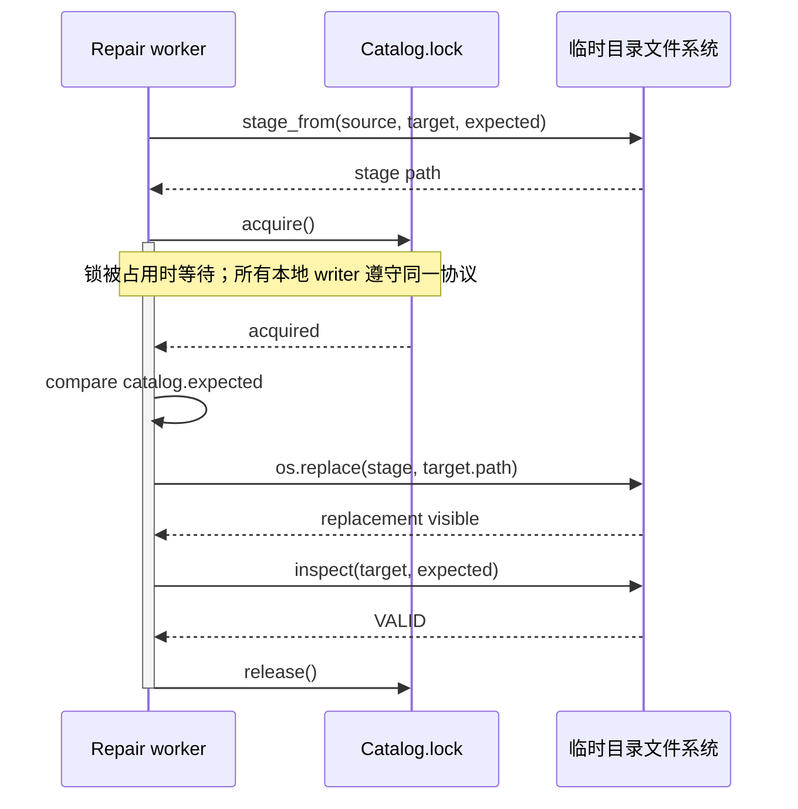

---
tags:
  - 高性能存储
  - 分布式存储
  - 数据完整性
  - Scrubbing
  - AntiEntropy
  - Reliability
  - ReplicaRepair
  - 故障注入
aliases:
  - Data Scrubbing and Anti-Entropy
  - 静默损坏检测与副本修复
  - 数据巡检与反熵修复
  - 冷数据长期可靠性
  - Bit Rot 检测与副本修复
priority: P0
status: 已完成
created: 2026-09-16
lab_runtime: "Python 3.10+，标准库；内存模拟与临时文件实验分别运行"
阅读次数: 0
---

# 7.32 Data Scrubbing 与 Anti-Entropy：Bit Rot、Checksum Tree、Replica Repair 与后台校验

> [!abstract] 长期保存需要持续验证
> 副本数量表示配置与放置状态；近期实际读取并校验的记录，才提供相应范围的健康证据。Scrub 检查字节是否符合可信承诺，Anti-Entropy 对账副本逻辑状态，Repair 安装经过验证的正确内容。
>
> 摘要相等不能代替实际读取，副本不一致也不能直接决定修复方向。源选择、版本条件、修复后复核与覆盖记录都需要明确依据。

## 阅读导航

- [[#1. 数据放几年，风险藏在哪里]]
- [[#2. 三种检查循环，不是同一个后台任务]]
- [[#3. Deep Scrub：从旧承诺核对实际字节]]
- [[#4. Checksum Tree 为什么可能看起来完全正常]]
- [[#5. Anti-Entropy：先对齐比较口径，再定位差异]]
- [[#6. Repair Source Selection：谁有资格成为修复源]]
- [[#7. 安全修复状态机：不能覆盖更新的数据]]
- [[#8. 后台扫描的时间账、带宽账与风险窗口]]
- [[#9. 指标与调度：证明覆盖，而不只是证明忙过]]
- [[#10. 对照 Ceph、Cassandra、OpenZFS 与 restic]]
- [[#11. 可运行实验：错误多数、旧摘要与并发版本]]
- [[#12. 故障注入矩阵与生产 Runbook]]
- [[#13. 面试自测与掌握标准]]

---

## 1. 数据放几年，风险藏在哪里

### 1.1 冷数据的危险不是“读得慢”，而是“很久没读过”

假设一份归档有 A、B、C 三个物理副本。A 的某个块在一个月前发生静默损坏，但业务从不读取它。此后 B 所在节点整体失效，系统才在重建时去读 A：账面上以为尚有两份完整副本，实际上该块只剩 C 能提供正确数据。

![[图片/SVG/8_7_7_32_1.svg|900]]

图的上半部分展示“业务正常”与“局部冗余已经下降”可以同时发生；下半部分展示主动扫描如何把问题暴露时间提前。时间位置仅用于解释机制，不代表实际故障率或默认扫描周期。

DDIA 第一版在数据完整性讨论中强调，不应只相信组件承诺，而要通过读取、校验和恢复演练审计实际结果；其复制章节也指出，单靠 Read Repair 无法照顾很少被读取的数据。[^ddia-audit][^ddia-replication]

这与已有 [[7.17 Recovery 与 Rebuild]] 是互补关系：该篇主要回答失去副本后如何补回冗余，本篇进一步问“我们凭什么相信用来重建的幸存副本是好的？”

### 1.2 不要把所有不一致都叫 Bit Rot

| 现象 | 主要含义 | 可能的处理方向 |
| --- | --- | --- |
| 介质不可读、潜在扇区错误 | 读取暴露错误，例如不可恢复的 I/O 失败 | 从受验证的冗余恢复，评估设备健康 |
| Silent corruption / Bit rot | 返回了字节，但与应该保存的内容不一致 | 依靠独立完整性依据识别和修复 |
| Replica divergence | 副本的逻辑状态不同，原因可能只是漏写或落后 | 对齐版本语义，再同步缺失更新 |
| Misdirected read/write | 读写落到了错误对象或 Offset | 绑定对象身份、逻辑范围与期望内容 |
| Lost write | 新写入未落地，旧数据与旧摘要仍自洽 | 对照已提交版本与受保护父级承诺 |
| 共同故障 | 同批固件、同一路径影响多个副本 | 评估独立故障域与外部恢复源 |
| 缺失对象或分片 | 所需数据在某位置不存在 | 判断是应补齐、已删除，还是放置已变 |
| 删除标记未传播 | 某副本仍保留已经被逻辑删除的数据 | 同步 Tombstone，避免错误复活 |
| 应用写入了错误结果 | 各副本和校验和可能完全一致 | 业务不变量、重算、审计和历史备份 |

Bit rot 是对静默损坏现象的常用描述，不是唯一的物理机理。 介质、固件、内存、错误 DMA/数据路径以及软件缺陷都可能破坏端到端结果；具体根因需要证据，不能从一个 Checksum Mismatch 直接诊断为“NAND 电荷流失”。DDIA 也明确区分了硬件故障与不会被底层校验自动捕捉的软件错误。[^ddia-audit]

复制同一个错误输出，会得到三份一致的错误；这不是多数投票可以自动纠正的。所谓健康，必须说明是 位级完整、版本一致、可读取，还是业务正确。

记录中应分开保留 `read_error`、`checksum_mismatch` 和 `version_mismatch`。它们分别表示没读到字节、读到错误字节和读到了其他版本，不能全部压成一个 `repair_failed`。OSTEP 第 45 章分别讨论了地址误定向、Lost Write 和后台巡检的边界。[^ostep]

## 2. 三种检查循环，不是同一个后台任务

### 2.1 读时校验、后台 Scrub、Anti-Entropy

| 循环 | 触发与主要输入 | 主要发现什么 | 天然盲区 |
| --- | --- | --- | --- |
| Read-time verification | 业务读取实际数据，对照可信期望值 | 当前被读到的数据损坏 | 冷数据可能永远不触发 |
| Periodic deep scrub | 后台按覆盖计划读数据并核对 | 潜在损坏、部分不可读问题 | 不必然解决逻辑版本冲突 |
| Replica anti-entropy | 在同一范围比较副本逻辑状态，定位并同步差异 | 漏写、缺失、删除传播、版本分歧 | 只比较旧缓存摘要时，可能看不到新的字节损坏 |

Read Repair 是在读取过程中发现副本落后并进行修补；它与“读时计算 Checksum”不是同义词。前者侧重副本状态传播，后者侧重字节完整性。两者可以发生在同一次读取里。[^ddia-replication]

产品可能把这些能力组织在一个 Scrub/Repair 子系统里，也可能分成多个任务。笔记中区分的是检查对象与正确性义务，不是要求每个产品必须采用相同命名。

### 2.2 Light Scrub 与 Deep Scrub

轻量检查可以核对对象是否存在、长度、属性、版本记录和已有摘要等元数据；深度检查则需要读出对应数据并重新计算校验值。Ceph 官方文档就区分元数据检查与读取数据验证 Checksum 的深度检查。[^ceph-config]

轻量检查便宜，所以有价值；但不能因为它经常成功，就把实际数据重新验证的周期无限延长。一次 Checksum Tree 根比较成功，只能覆盖这次比较实际使用的输入。

日志回放同样不是完整性巡检。一个副本从日志位置 100 追到 200，说明它补上了该范围的操作；并不能证明位置 100 之前对应的所有介质字节仍然健康。这里衔接 [[7.19 副本落后与日志截断]]：历史同步能力与现存数据验证能力必须分别度量。

## 3. Deep Scrub：从旧承诺核对实际字节

### 3.1 一次有效检查需要四个要素

首先固定目标身份：对象 ID、内容版本/Generation、长度、适用格式及期望摘要。其次拿到具有明确可信来源的校验依据。然后读取需要覆盖的数据并重新计算。最后记录成功覆盖的具体范围与版本，而不是只写“任务运行过”。

对于内容寻址对象，来自可信 Manifest 的 Chunk ID 可以充当期望值；对于可变对象，期望摘要必须与相应版本绑定。[[8.高性能存储/7. 分布式存储/7.31 Content-Addressed Storage 与 Merkle Tree：Chunk、Manifest、Merkle DAG 与增量校验|7.31 Content-Addressed Storage 与 Merkle Tree：Chunk、Manifest、Merkle DAG 与增量校验]] 定义了这条“Root → 描述 → 内容”的验证链，本篇把它沿实际读取路径执行一遍。

一个有用的审计记录至少包含：

| 记录项 | 为什么需要 |
| --- | --- |
| `object_id, generation, placement_epoch` | 防止把不同对象、版本或放置状态混在一起 |
| `offset, length, expected_digest` | 确定本次到底校验了哪些字节 |
| `observed_digest / io_error` | 保存实际观测，不只有成功/失败布尔值 |
| `started_at, finished_at, outcome` | 区分开始过、完成过和验证成功 |
| `source, target, attempt_id` | 追溯修复来源、重试与实际覆盖位置 |

这是一份设计建议，不是所有产品的标准日志格式。

### 3.2 不要把“读取路径”说得比证据更深

从应用缓存返回数据，只能验证缓存中的字节；若目标是检查存储副本，扫描必须到达相应存储层。即使跳过操作系统 Page Cache，也不应直接宣称已经越过所有控制器缓存，逐个检查了 NAND Cell。

因此，应明确 Scrub 的验证边界：它读的是哪个对象副本、由哪层执行读出和校验、覆盖哪些逻辑或物理数据。应用级全量回读可以验证端到端可读性，却不能自动替代设备内部的介质诊断。

共享块同样需要分清计数：同一物理块被 100 个快照引用，读它一次可能覆盖这些引用共同依赖的那一份物理内容；但另外两个物理副本仍需各自验证。逻辑引用数、唯一内容数与物理副本数不是同一个扫描分母。

### 3.3 校验和自己也需要保护

把 `data` 和 `checksum(data)` 一起错误覆盖，会产生一对自洽的新值。若元数据没有独立的可信锚点，仅计算当前数据与当前本地摘要是否一致，无法发现这种配套修改。

不要在发现不匹配时，直接把“期望摘要”更新成当前读到的值，然后宣称修复完成。那是在改变判题标准。正确流程是保留原承诺与损坏证据，从可信源获取原本应有的数据；确实需要发布一个新业务版本时，则走正式版本发布协议。

### 3.4 Lost Write、校验元数据与认证

新写入被遗漏时，旧数据和旧 Checksum 仍可能匹配；对象地址也可能完全正确。检查器需要把内容连到被认可的新版本或受保护父级承诺，才能识别丢失写入。[^ostep]

如果 Root 自己已有争议，先查受保护版本记录、快照目录、复制日志或独立备份，恢复权威依据。对全部现存字节重算一个新 Root，只会承诺当前内容，不能证明它就是原本应有的状态。关键元数据的保护可结合 [[7.20 元数据服务高可用]] 分析。

CRC 等错误检测码、密码学 Hash、发布者认证和副本/EC 恢复分别承担不同职责。设备 ECC 不覆盖全部应用数据路径；SHA-256 也不能从摘要中还原丢失的大对象。

### 3.5 从预期集合枚举，避免漏掉已丢失对象

只遍历当前能列出的文件，会漏掉本来应该存在、现在已经消失的对象。应把保留 Root 的可达对象集合与实际 Inventory 对账，并说明本轮是否覆盖历史版本、快照和共享内容。

对可变数据可按对象 Generation、Token Range 快照或扫描 Epoch 分段固定范围；并非每个系统都需要一个全局快照，但每条验证结果必须有可解释的版本边界。

### 3.6 成功验证之后再推进覆盖游标

并发 Worker 可以乱序完成，Coverage Ledger 必须保留失败或未完成的孔洞。游标若代表连续完成范围，就不能越过孔洞；调度游标可以继续前进，但不能被当成完成游标。

先持久化验证结果，再更新相应进度。崩溃后重复读少量对象通常可接受，把未完成对象错误标成成功则会造成长期漏检。坏对象采用有界重试和独立错误队列，既保留孔洞，也避免堵住整轮扫描。

## 4. Checksum Tree 为什么可能看起来完全正常

![[图片/SVG/8_7_7_32_2.svg|900]]

图中 A、B 两个副本缓存的摘要树都来源于正常写入时刻，因此 Root 相同。后来 B 的实际数据块发生变化，但并未经过正常写路径，旧叶子摘要和旧 Root 都没有更新。此时再次比较缓存 Root，结果仍然相等。

这不是 Merkle Tree 的算法失效，而是被比较的结构没有包含新的观测。要发现介质损坏，需要重新读取数据并将计算结果与可信期望值核对。

### 4.1 维护树与验证树是两条路径

正常写入路径可以在改变内容后更新叶子及祖先，从而增量维护摘要索引。后台验证路径则主动读旧内容，检查它是否还符合先前的承诺。前者反映系统知道的合法修改；后者发现系统不知道的非法变化。

如果每次 Anti-Entropy 都重新读取参与范围的数据来生成摘要，那么这次读取可以同时暴露一部分损坏；如果只复用内存或磁盘上的旧摘要缓存，则不能自动得到同样的验证范围。具体能力取决于实现，不能只看任务名字里有没有“Merkle”。

### 4.2 什么时候能说两个根“相同”有意义

至少需要确认对象范围、版本/一致切面、编码与算法、树形分区、有效数据集合，以及摘要的构建/验证来源。两个根相同表示在这些约定和哈希假设下，被承诺的输入相同；并不表示在根生成之后底层数据没有变化。

反过来，两个根不同也不一定有损坏。一个副本保存版本 7，另一个已经提交版本 8；只要比较口径允许这种暂时差异，这可能是正常复制延迟。[[7.9 一致性模型]] 决定何时允许这种可见性差异，Scrub 不应擅自把新版本“修回”旧版本。

### 4.3 内容身份相同，物理健康记录仍须独立

| 信息 | 建议的标识维度 | 何时变化 |
| --- | --- | --- |
| 内容承诺 | Root / Manifest / Chunk ID | 逻辑内容变化 |
| 副本健康 | Chunk ID + Replica Incarnation | 副本替换、重读或错误发现 |
| 版本对账 | Range + Snapshot / Repair Epoch | 写入、删除和同步进度变化 |

Incarnation 用于区分同一位置先后存在的副本实例。A 昨天通过、B 三个月未检查、C 今天读失败，是三条独立记录；不能让一个逻辑 Root 的相等覆盖掉这些差别。

## 5. Anti-Entropy：先对齐比较口径，再定位差异

### 5.1 比较会话首先固定上下文

一种通用实现可以先建立比较上下文：同一个 Key Range、同一个拓扑/放置 Epoch、同一种记录编码和冲突规则，并通过快照或协议约定确定可比较的一致切面。

对一个可变 KV 范围，叶子内容不能只含 Value 的 Hash。一般还需要纳入 Key、版本/时间戳语义、删除标记及其相关状态；否则会遗漏“值一样，但已经删除”或“字节一样，但属于不同提交状态”的区别。若用 TTL 参与比较，要统一所比较的时间语义，而不是让两台机器各拿自己的瞬时时钟随意解释。

Dynamo 以 Key Range 为单位使用 Merkle Tree 检测副本差异；Cassandra 的 Repair 也比较共享 Token Range 并传输不同区域。[^dynamo][^cassandra-repair] 这类树的叶子可以是一个范围桶，不一定对应单一 Chunk，所以最终修复粒度可能大于真正变化的记录粒度。

### 5.2 差异定位之后，还没有结束

可以把一轮过程理解为：

1. 固定范围与比较上下文，建立或取得有效摘要。
2. 比较 Root；不同则继续比较对应子范围。
3. 定位到不一致的叶子桶，枚举实际记录与版本。
4. 按系统的复制/冲突协议决定应该保留或传播什么。
5. 验证数据，执行有条件的安装，再确认修复后的状态。

Merkle Tree 只优化第 2～3 步的定位，不能替第 4 步决定“谁正确”。对于有并发写入的多主系统，需要按其既定冲突处理策略处理多个合法版本；不能简单选摘要字典序更大的一份。

### 5.3 不要拿两个物理 SSTable 文件直接代表同一逻辑状态

两个副本经历不同 Compaction，可以把相同逻辑记录组织成完全不同的物理文件。直接比较整个 SSTable 文件字节的 Hash，可能得到大量与逻辑不一致无关的差异。

因此要先说明修复目标：比较的是某个不可变文件本身，还是某个 Key Range 的逻辑状态？前者可以以文件字节为身份；后者需要按逻辑记录和版本可见性构建共同表示。物理文件的内容树与逻辑记录的校验树，不应在接口层混用。

比较期间发生范围迁移、Leader 变化或成员关系变更时，应检查上下文是否失效。必要时中止并重新建立会话；已有 [[7.12 Lease 与 Fencing]] 中“旧持有者不得继续写”的思想，同样适用于旧 Repair 任务。

### 5.4 删除传播、持续写入与责任迁移

副本合并不能简单取 Key 并集：A 已有删除标记、B 仍有旧值时，无条件补齐会复活旧数据。Tombstone、TTL 与并发版本必须按原有系统规则处理，Anti-Entropy 本身不决定写入的全局顺序。

扫描期间持续写入，可以由范围快照、Repair Epoch、日志追赶或已有并发修复协议处理；若两边不断比较不同时间的状态，反复重试也不一定收敛。[[7.15 Membership 与故障检测]] 只能提供成员状态，[[7.16 数据放置与 Rebalance]] 还要说明新副本的数据迁移是否完成、旧副本何时退出。

## 6. Repair Source Selection：谁有资格成为修复源

![[图片/SVG/8_7_7_32_3.svg|900]]

### 6.1 正确的源，必须符合目标版本的可信承诺

假设可信版本记录指定：对象 X、Generation 7、期望内容摘要 $h$。A 和 B 都返回同一份错误数据 $b$，C 返回正确数据 $a$；且 $H(a)=h$、$H(b)\ne h$。此时正确的源是 C，哪怕它只有一份。

多数一致只是一条观测，不是无条件的正确性依据。 若 A、B 共同经历同一个软件错误，或者它们的本地摘要也被重写，简单投票会传播错误。

在没有可信摘要、没有可确认版本关系、也没有系统协议可判定权威状态时，两份不同数据不能仅凭内容本身决定哪份正确。应隔离、保留证据、寻找日志/可信备份/业务核对，不要自动选择“更长”“时间更近”或“先返回”的一份。

### 6.2 按候选资格筛选，而非按速度先到先得

| 检查 | 合格条件 | 不满足时 |
| --- | --- | --- |
| 对象与范围 | 正是本次修复的目标及区间 | 排除，检查路由或元数据问题 |
| Generation / 提交语义 | 与目标版本一致，或有合法的版本传播依据 | 归类为其它版本，不等同于坏数据 |
| 长度与格式 | 满足可信描述与解码边界 | 排除，保存证据 |
| 重新计算的内容校验 | 匹配可信期望摘要/认证结构 | 排除，不能靠更新本地摘要放行 |
| 可用性与故障域 | 能读出完整数据，尽量避免同源故障风险 | 按策略选择其它合格源 |

多个合格源之间，才适合按距离、负载、吞吐量和故障域分散程度做调度优化。正确性筛选在前，性能选择在后。

### 6.3 版本落后不是静默损坏

一个 Generation 6 的副本可能完整且正确，只是相对于 Generation 7 落后。它不能直接作为 Generation 7 的修复源，但也不应因此被记成介质损坏。

一个 Generation 8 的副本也可能完全正常。若本次目标固定为 7，Repair 任务不能因为“我是在修旧版本”就覆盖用户已经提交的 8。要么修复独立保留的版本 7 对象，要么重新规划当前版本的恢复，而不是混淆对象版本和物理位置。

这里与 [[7.10 Quorum 读写]] 的衔接很重要：Quorum 是复制协议的一部分，但“拿到两个响应”不等于“两个响应的实际字节都经过了可信校验”。

### 6.4 EC：凑够 k 份之前，先确认是正确的 k 份

对于 $(k,m)$ 的常见纠删码布局，重建所需的是符合编码要求的、相互独立且属于同一 Stripe/Generation 的有效分片，而不是任意 $k$ 个看起来存在的文件。要核对分片索引、长度、版本和完整性依据。

若某个分片能被可靠识别为坏片，可以把它当作已知缺失处理；无法识别的错误分片却可能参与计算并污染结果。因此应在重建前检查输入分片，在重建后验证输出对象/分片。具体错误纠正能力受编码方案与校验元数据约束，不能一概说“有 EC 就能找出哪个分片错了”。这正是 [[7.1 副本 vs EC]] 中冗余形式与本篇完整性依据的结合点。

对最小距离为 $m+1$ 的 MDS 码，在相应的符号错误模型和解码算法下，唯一纠错的常见条件为：

$$
2t+e\le m
$$

其中 $t$ 是未知错误位置数，$e$ 是已知擦除数。若存在两个可行码字，它们不同的位置至多为 $2t+e$；当其不超过 $m$ 时，会与最小距离 $m+1$ 矛盾。分片逐符号编码时，要按对应条带中的编码符号理解这个界。

这是编码理论条件，不保证某个存储库实现了未知错误纠正。许多修复流程依靠可靠的分片校验先识别坏片，再按擦除重建；元数据必须绑定 Stripe ID、Generation、分片索引和编码参数。RFC 5510 可作为 RS/MDS 擦除恢复的规范参照，未知错误界不据此推断产品能力。[^rs]

## 7. 安全修复状态机：不能覆盖更新的数据

### 7.1 从发现问题到真正收尾

一个通用的修复状态机可以设计为：

| 状态 | 主要动作 | 必须保持的不变量 |
| --- | --- | --- |
| `Detected` | 记录不匹配或不可读问题 | 不改变原始期望值 |
| `Pinned` | 固定目标版本、范围和必要引用 | GC/迁移不能使目标悄悄失效 |
| `SourceVerified` | 选择并验证候选源 | 不把未验证数据当修复材料 |
| `Staged` | 写入临时位置，达到约定持久条件 | 不提前破坏唯一可用旧证据 |
| `Installed` | 检查 Generation/Epoch 后条件安装 | 不覆盖更新的合法状态 |
| `Verified` | 复读/重新校验，确认目标与冗余条件 | 写成功不等于修复已完成 |
| `Closed` | 更新审计、健康状态与覆盖记录 | 结论可追溯到具体版本和位置 |

这是设计模板，不是 Ceph 或 Cassandra 的内部状态枚举。

![[图片/SVG/8_7_7_32_4.svg|900]]

图中 Repair 已经读到了版本 7 的正确数据，但用户写入先把当前版本提升到了 8。安装阶段必须拒绝旧任务。判断和安装要受一个实际可执行的原子协议保护：仅在应用里先 `if version == 7`、再无保护地 `write()`，仍存在检查与使用之间的竞态。

### 7.2 两类“原子性”要分别说明

内容安装原子性确保读者不会看到半写入的目标对象。可通过临时对象、原子切换或底层事务机制实现，具体取决于存储系统。

版本/权限原子性确保安装时任务仍有资格修改该目标。它需要 Generation、Epoch、Fencing Token 或与元数据事务结合的条件更新。旧任务写入同样正确的旧字节，仍可能破坏更新的业务版本。

单机文件场景中的 `rename`、`fsync`，对象存储中的完成/版本接口，以及分布式事务/复制提交，具有不同的保证范围。不能把一个系统调用名写进流程图，就宣称跨层全部原子且持久。

### 7.3 幂等重试与保留证据

重试标识应绑定目标、版本、范围和期望摘要，而不是只绑定一个可复用的物理文件名。如果目标已经满足相同承诺，再次执行可以安全结束；如果目标版本变化，应重新规划。

发现异常时，可以将损坏字节、旧校验记录和设备/传输错误日志保留在受控隔离区。但隔离不能导致唯一的有效副本被误删，也不应无限占用空间。保留期限、访问权限和证据清理属于修复策略的一部分。

最终复核不仅检查“新的目标能读”，还应确认没有扩大不一致范围，且预期的物理冗余已经恢复。补冗余所需的资源预算可沿用 [[7.17 Recovery 与 Rebuild]]，而任务限流与失败退避应衔接 [[7.18 Backpressure 与过载保护]]。

### 7.4 防止来源变化与误判复读结果

来源在资格检查后仍可能变化。暂存时要校验实际复制的那批字节，提交前再次核对暂存内容和目标 Incarnation，不能把“刚才这个路径检查通过”当作永久保证。

修复后 Readback 证明相应读取路径返回正确内容；若命中缓存，不能据此证明设备断电后仍可恢复。断电持久性依赖写入与刷新合同，并需要单独的故障实验。

## 8. 后台扫描的时间账、带宽账与风险窗口

### 8.1 先定义扫描分母

设本周期计划验证的实际数据总量为 $D$，平均可用于有效扫描的聚合带宽为 $B_{\mathrm{eff}}$。不计额外开销时：

$$
T_{\mathrm{scan}}\geq\frac{D}{B_{\mathrm{eff}}}
$$

这里的 $D$ 应按扫描目标确定。若要把三个完整物理副本都验证一遍，就不能只填一份逻辑容量；若采用去重，则需要按每个物理副本内的实际唯一内容覆盖计算；EC 则按实际需检查的编码分片与元数据计入。

$B_{\mathrm{eff}}$ 也不是设备标称读带宽。它受前台让渡带宽、随机访问、CPU 校验/解码能力、网络、慢盘、错误重试以及调度窗口共同限制。若只在一天的 $f$ 比例时间运行，扫描时速率为 $B_{\mathrm{on}}$，简单模型下平均速率为 $fB_{\mathrm{on}}$。

### 8.2 100 TiB、三副本、每周一轮

【推导，非硬件实测】假设逻辑数据 100 TiB，没有去重/压缩，三个完整副本都要每 7 天验证一次：

$$
D=300\ \text{TiB},\quad
B_{\mathrm{eff}}\geq\frac{300\times2^{20}\ \text{MiB}}{7\times86400\ \text{s}}
\approx520.13\ \text{MiB/s}
$$

这是全集群持续平均有效读取量，不是每盘带宽，也不是全部扫描都会经过客户端网络。若只运行 25% 的时间，活跃窗口至少需要约 2,080.51 MiB/s 的聚合有效速率，再为元数据、错误重试、修复和不均衡预留预算。

如果实际平均只能提供 200 MiB/s，同一数据量在理想模型下也需要约 18.20 天。此时配置“每周调度一次”不会自动实现“每周全部验证一次”。

![[图片/SVG/8_7_7_32_5.svg|900]]

图中的条带将总物理扫描量、平均速率与暴露窗口联系起来。它不模拟真实硬盘、队列或故障分布，而是在检查计划是否在数量级上可行。

### 8.3 扫描周期影响的是暴露窗口

若每个块被严格按间隔 $T$ 检查，损坏发生相位在周期内均匀分布，且没有调度延误，则平均发现延迟约为 $T/2$，最坏可接近 $T$。这些是该简化模型的推导，不是所有生产系统的保证。

发现以后还要排队、选择修复源、复制和验证，因此未恢复足够健康冗余的窗口近似为：

$$
W=T_{\mathrm{detect}}+T_{\mathrm{queue}}+T_{\mathrm{repair}}+T_{\mathrm{verify}}
$$

在额外故障服从独立恒定速率 $\lambda$ 的假设下，窗口内至少一次额外故障的概率为 $1-e^{-\lambda W}$。这个公式用于说明缩短窗口为什么有价值，不能直接当作真实数据丢失概率：故障域相关性、共享软件缺陷、剩余冗余和恢复失败都会改变结果。

### 8.4 PiB 规模与资源分项

【推导】1 PiB 物理数据在 30 天内覆盖一次，最低平均有效读取速率约 414.25 MiB/s；若是 1 PiB 逻辑数据的三个完整副本，则约 1.214 GiB/s。每天只运行 6 小时时，活跃窗口速率再乘 4。它与第 8.2 节使用同一公式，但容量和周期不同。

除读取带宽外，还要分别预算设备 IOPS、CPU/内存带宽、远端网络、修复写入与元数据请求。扫描变快但修复队列持续积压，健康冗余的暴露窗口仍然很长。

## 9. 指标与调度：证明覆盖，而不只是证明忙过

### 9.1 最重要的指标是“多久没有成功验证”

| 指标 | 应回答的问题 | 容易误读的替代值 |
| --- | --- | --- |
| `oldest_successful_verification_age` | 最久未成功校验的目标有多老 | 最近一次任务启动时间 |
| 周期内去重后的已验证字节/目标数 | 计划范围是否真正被覆盖 | 总读取字节，可能反复扫同一热块 |
| 错误与跳过分类 | 未完成的是慢、坏、迁移还是权限问题 | 统一记成“已处理” |
| Repair backlog 与最老等待时间 | 发现以后是否及时恢复 | 累计修复任务数 |
| 合格修复源数量 | 是否还有可信冗余 | 元数据里配置的副本数 |
| 版本/Epoch 冲突重试 | 比较会话是否因变化反复失效 | 单次任务成功率 |
| 前台 P99 与扫描进度 | 是否同时守住业务与可靠性预算 | 扫描自身吞吐量 |

记录必须跟随对象版本和物理位置变化。旧节点上的成功校验不能自动转移成新副本的近期健康证明；复制目标需要自己的验证证据。对象内容已经变成新版本时，也不能把旧版本的校验时间直接贴过去。

### 9.2 调度不能无限饿死冷数据

优先级可以综合：剩余合格冗余、上次成功验证年龄、设备错误征兆、历史失败和恢复重要性。但如果永远让热点插队，冷对象就可能没有有限的覆盖上界。

可以设置每盘/每节点的并发上限、字节和 IOPS 预算、错峰窗口、前台尾延迟反馈，以及按老化提升优先级的公平队列。最关键的设计不是某个具体 Token Bucket 参数，而是同时定义两条目标：前台能接受的干扰上限，后台必须取得的最低进展。

一旦这两条目标因容量增长而无法同时满足，应增加资源、调整保留/冗余策略或公开延长覆盖目标，而不是让仪表盘继续显示原来的“每周全部校验”。

### 9.3 “没有报警”还可能只是没有观测

只统计 Checksum Mismatch 数量，会把扫描停止的系统误认为最健康。需要有无进度告警、过期未验证范围、任务失败率和被跳过范围的告警。对很少发生的数据损坏事件，观测覆盖本身就是可靠性指标。

### 9.4 Coverage Ledger 与动态数据集

`last_scheduled_at` 表示已调度，`last_read_at` 表示取回过字节，`last_verified_at` 才表示指定版本与副本通过校验。未检查目标标记为 `never_verified`，不能默认填当前时间。

$$
\operatorname{verification\_age}(o,r)=\mathrm{now}-\mathrm{last\_verified\_at}(o,r)
$$

每轮定义扫描基线集合和 Epoch，另行跟踪新增、迁移、重打包后的副本及失败孔洞。对象从 Inventory 消失时，需要确认它已不在保留引用中，不能自动记作合法删除。除了字节比例，还要看对象数量、关键 Manifest、版本和故障域覆盖，避免 99.99% 的容量掩盖关键小对象缺失。

### 9.5 随机抽样不能提供固定期限内的全覆盖

【理想模型】每天独立选中一个对象的概率为 $p$，连续 $d$ 天未被选中的概率是：

$$
P_{\mathrm{unseen}}=(1-p)^d
$$

每天随机 10%，30 天后仍约有 4.24% 的对象未被选中。分区轮转或持久化覆盖记录可提供确定进度，随机抽样适合补充探测，不能代替全覆盖的截止目标。

### 9.6 指标保留语义，也控制基数

| 建议指标 | 需要明确的口径 |
| --- | --- |
| `scrub_read_bytes_total` | 含失败与重试的读取量，反映 I/O 成本 |
| `scrub_verified_bytes_total` | 验证成功字节累计量；覆盖率仍须按目标去重 |
| `never_verified_objects / scrub_coverage_holes` | 从未验证与本轮未完成集合 |
| `repair_source_rejected_total` | 按版本、摘要、来源政策区分拒绝原因 |
| `repair_verified_total` | 提交并通过复核的修复次数 |
| `unrecoverable_objects` | 当前证据与来源条件下无法自动恢复的对象 |

海量 Chunk ID 不适合直接作为 Prometheus Label。按池、数据等级、故障域和错误类型聚合指标，把对象详情保留在审计表、事件日志或可查询的 Coverage Ledger 中。

日报至少说明基线范围、已验证量与孔洞、最大验证年龄、错误分类、可信来源、已复核修复量和覆盖超期风险，并在同一时间轴对照前台 P99。单报“扫描了多少 TB”无法回答还漏了什么。

## 10. 对照 Ceph、Cassandra、OpenZFS 与 restic

这一节用于把抽象对应到真实系统；名称相似不代表机制相同，也不提供可以直接复制到任意版本的默认参数表。

| 系统/资料 | 用于理解的具体事实 | 应保留的边界 |
| --- | --- | --- |
| Ceph OSD 配置说明 | 区分元数据 Scrub 与读取数据校验的 Deep Scrub | 活动文档标注为开发版本；部署参数按实际版本确认 |
| Ceph Pacific PG Repair 说明 | 修复涉及校验和、权威副本判定与不一致诊断 | Pacific 是固定历史文档，不代表当前全部实现 |
| Cassandra Repair 文档 | 用 Merkle Tree 同步范围差异；增量与全量 Repair 范围不同 | 增量已修复标记不等于永久免于再次完整性检查 |
| OpenZFS 2.3 `zpool scrub` 手册 | 读取池内已分配数据并检查；有可用冗余时可修复部分损坏 | 无冗余或全部副本无效时，校验不能凭空恢复内容 |
| restic `check` 文档 | 默认检查与显式读取数据的检查具有不同覆盖 | 只检查结构，不应宣称全部数据 Blob 都已回读 |

上述对应分别来自官方说明。[^ceph-config][^ceph-repair][^cassandra-repair][^zfs][^restic-check]

### 10.1 Cassandra 的两个容易误记的边界

Cassandra 官方 Repair 文档指出，增量 Repair 对被标为已修复的数据不持续重复同样的修复，因此不能把它作为磁盘损坏、误操作等问题的完整防线；仍需规划适当的全量检查/修复。[^cassandra-repair]

删除标记也必须在相关数据被清理之前传播到需要知道它的副本，否则旧数据可能重新出现。需要关注的是相关范围在保留窗口内成功完成必要的 Repair，而不是某天敲过一次命令。 不要不加条件地把文档中的默认 `gc_grace` 和示例频率当作自己集群的保证。[^cassandra-repair]

### 10.2 先诊断，不自动执行破坏性修复

以下命令来自 Ceph Pacific 文档所描述的只读诊断接口类别。运行前核对实际版本、权限和集群文档。本笔记没有连接或操作真实 Ceph 集群。

```bash
ceph health detail
ceph pg dump --format=json-pretty
rados list-inconsistent-pg <pool-name>
rados list-inconsistent-obj <pg-id> --format=json-pretty
```

这些命令的目的分别是取得健康细节、PG 状态和不一致对象证据。尖括号内容是需要替换的占位符，不能原样当作 Shell 重定向运行。诊断输出必须结合对象版本、校验信息和权威源判定；不能看到 `inconsistent` 就一律无条件覆盖。[^ceph-repair]

对备份，还必须做恢复演练。即使数据块均通过校验，权限、密钥、Manifest、格式兼容性或恢复程序本身仍可能妨碍恢复。DDIA 将“真正读取核对”和“定期尝试恢复”放在同一个审计思路中。[^ddia-audit]

### 10.3 命令示例：区分查询、扫描与修复

以下示例供隔离测试资源使用，本次只核对命令文档，没有连接或操作存储集群。扫描可能带来明显 I/O，其中部分工具在有冗余时会执行修复写入。

OpenZFS 2.3 的 Scrub 检查已分配数据；Resilver 侧重补齐已知过时或需要同步的数据。两者覆盖目标不同，监控中的元数据扫描进度也不能直接当成数据块已读取校验的进度。[^zfs]

```bash
zpool status labpool
# 触发巡检；具备适用冗余时可能修复损坏
zpool scrub labpool
zpool status labpool
```

restic 默认 `check` 与显式读 Pack 数据的检查覆盖不同。分组检查要完成所有组并记录失败孔洞；远端 `--read-data` 会增加下载流量。[^restic-check]

```bash
restic -r /srv/restic-lab check
restic -r /srv/restic-lab check --read-data
# 当前为第 1 组，后续仍需覆盖其余 6 组
restic -r /srv/restic-lab check --read-data-subset=1/7
```

Ceph 的 Deep Scrub 与不一致诊断应结合 PG 和对象证据判断。下面 `0.6` 仅是示例 PG，执行时需要替换；`ceph pg repair` 的处置取决于具体错误，不能把它当成清除告警的通用动作。[^ceph-rh8]

```bash
ceph health detail
rados list-inconsistent-pg labpool
rados list-inconsistent-obj 0.6
# 高 I/O：按测试集群实际 PG 替换参数
ceph pg deep-scrub 0.6
```

[[7.5 Ceph RADOS 与 CRUSH]] 中的 OSD 存活和 CRUSH 放置，并不证明候选内容正确。Cassandra 5.0 的 Preview 可以构建并比较摘要、估计需要的 Streaming，但不会实际流式传送修复数据；它仍有扫描成本。[^cassandra-repair]

```bash
nodetool repair --preview --full lab_keyspace
```

正式 Repair 前还要确认节点与 Token Range 责任范围；一台节点的命令成功不代表全集群完成覆盖。

## 11. 可运行实验：错误多数、旧摘要与并发版本

本节包含两个独立实验，使用 Python 3.10+ 标准库。11.1～11.7 的代码块拼成 `scrub_memory_lab.py`；11.8 的代码块另存为 `scrub_file_lab.py`，不要把两套同名类型与函数混在一起。 前一组做单线程内存模拟。 它展示决策与版本不变量，不模拟物理磁盘、崩溃持久性或真实锁竞争。

### 11.1 把可信版本与本地观测分开

`Reference` 表示来自可信版本记录的承诺；`Replica` 表示某个节点实际拿到的字节和它自己保存的摘要。把两者拆开，是为了不让本地自洽覆盖掉独立期望值。

```python
from dataclasses import dataclass
from hashlib import sha256


def blob_hash(data: bytes) -> bytes:
    return sha256(b"blob/v1\0" + len(data).to_bytes(8, "big")
                  + data).digest()


@dataclass(frozen=True)
class Reference:
    generation: int
    expected: bytes


@dataclass(frozen=True)
class Replica:
    generation: int
    data: bytes
    local_digest: bytes


def replica(generation: int, data: bytes) -> Replica:
    return Replica(generation, data, blob_hash(data))
```

这个 Blob Hash 格式也是独立的教学格式；它与 7.31 实验中的标签编码不同，不是可以互换的生产 Chunk ID。这里刻意不实现加密、签名或共识，假设 `Reference` 已经可信。

### 11.2 先判版本，再检查实际字节

其它版本可能是落后或更新，不能直接被分类成介质损坏。只有目标版本的字节满足可信摘要，才能被本次任务接受为修复源。

```python
def classify(candidate: Replica, ref: Reference) -> str:
    if candidate.generation != ref.generation:
        return "other-version"
    if blob_hash(candidate.data) != ref.expected:
        return "corrupt"
    return "valid"


def choose_source(candidates: list[Replica], ref: Reference) -> bytes:
    for candidate in candidates:
        if classify(candidate, ref) == "valid":
            return candidate.data
    raise RuntimeError("no verified repair source")
```

`local_digest` 没有被当成最终裁判，因为它可能过期，也可能和错误数据一起被改写。生产系统可以用本地摘要帮助定位问题，但本次选择必须对照固定的可信承诺。

### 11.3 条件安装：用模拟临界区表达版本检查

下面的函数在本实验中是一个不被打断的单线程步骤。真实服务必须把版本检查、权限检查和安装放进正确的锁、事务或 Fencing 协议中；普通 Python 字典操作或 GIL 并不能替代这种跨系统保证。

```python
def install_if_current(head: dict[str, Reference], ref: Reference,
                       copies: dict[str, Replica], target: str,
                       payload: bytes) -> str:
    # Simulation only: this entire function models one atomic action.
    if head["current"] != ref:
        return "stale-plan"
    if blob_hash(payload) != ref.expected:
        raise ValueError("staged payload failed verification")
    existing = copies.get(target)
    if existing is not None and classify(existing, ref) == "valid":
        return "already-valid"
    copies[target] = replica(ref.generation, payload)
    if blob_hash(copies[target].data) != ref.expected:
        raise RuntimeError("post-install verification failed")
    return "installed"
```

此处“安装后验证”只是在内存中重新计算；它不是实际落盘后的复读。正式实现还需要临时写入、持久化确认、物理读取边界和错误处理，第 7 节的 SVG 已标出这些等待与安装门槛。

### 11.4 实验 A：旧摘要匹配，实际字节已坏

复制一份正确副本后，故意只修改数据而保留旧摘要。元数据比较仍然相等，真实字节重新哈希却失败。这正是图 2 的最小可运行版本。

```python
good_bytes = b"checkpoint-step-7"
ref7 = Reference(7, blob_hash(good_bytes))
good = replica(7, good_bytes)
latent_bad = Replica(7, b"damaged-content", good.local_digest)
assert latent_bad.local_digest == good.local_digest
assert blob_hash(latent_bad.data) != ref7.expected
assert classify(latent_bad, ref7) == "corrupt"
print("A: cached digests match; actual bytes fail")
```

观察重点不是某个特殊坏字节，而是校验使用的输入：比较缓存摘要没有读取新的事实。

### 11.5 实验 B：两份自洽的错误副本，不能击败一份可信正确副本

让 A、B 保存相同错误内容，并各自重新计算本地摘要。它们本地校验可以通过，也形成二对一多数；只有 C 与可信版本承诺匹配。

```python
bad_a = replica(7, b"same-wrong-output")
bad_b = replica(7, b"same-wrong-output")
assert bad_a.local_digest == blob_hash(bad_a.data)
assert bad_b.local_digest == blob_hash(bad_b.data)
selected = choose_source([bad_a, bad_b, good], ref7)
assert selected == good_bytes
try:
    choose_source([bad_a, bad_b], ref7)
except RuntimeError:
    print("B: unverified majority rejected; no-source fails closed")
else:
    raise AssertionError("bad replicas must not become repair sources")
assert classify(replica(6, good_bytes), ref7) == "other-version"
```

这组实验同时检查两种行为：有可信源时选择它；没有可信源时明确失败，而不是降低标准接受多数。

### 11.6 实验 C：修复过程中提交了更新版本

模拟 Repair 先取得版本 7 的好数据，然后用户完成版本 8 写入。旧任务安装时必须失败，并保留版本 8 的内容。

```python
head = {"current": ref7}
copies = {"target": latent_bad}
staged = choose_source([good], ref7)
new_bytes = b"checkpoint-step-8"
ref8 = Reference(8, blob_hash(new_bytes))
head["current"] = ref8
copies["target"] = replica(8, new_bytes)
assert install_if_current(head, ref7, copies, "target", staged) == "stale-plan"
assert copies["target"].data == new_bytes
assert copies["target"].generation == 8
print("C: generation-7 repair cannot overwrite generation 8")
```

这里只是在两个模拟步骤之间插入一次版本改变；没有启动线程，也没有检验真实系统中的原子性实现。实验通过，只说明决策逻辑包含了这一必要门槛。

### 11.7 实验 D：正常修复可重试，坏的暂存数据不能安装

用独立的模拟对象重置场景，不存在版本竞争时应完成修复；再次执行应幂等返回。最后确认篡改后的暂存数据不会进入安装步骤。

```python
head2 = {"current": ref7}
copies2 = {"target": latent_bad}
assert install_if_current(head2, ref7, copies2, "target", staged) == "installed"
assert install_if_current(head2, ref7, copies2, "target", staged) == "already-valid"
assert classify(copies2["target"], ref7) == "valid"
try:
    install_if_current(head2, ref7, copies2, "target", b"tampered-stage")
except ValueError:
    assert copies2["target"].data == good_bytes
else:
    raise AssertionError("invalid stage must be rejected")
print("D: repair is idempotent; invalid stage rejected")
```

四组实验覆盖：过期摘要、错误多数、无可信源、版本资格、安装竞态、幂等重试和暂存验证。下一步真正的系统实验，应将这些不变量搬到磁盘、并发与故障模型中，而不是只增加模拟数据量。

### 11.8 临时文件实验：读取、暂存与条件替换

> [!example] 实验合同
> 按顺序把 11.8 的所有 `python` 块保存到独立的 `scrub_file_lab.py` 并运行。实验仅创建一个临时目录中的小文件，结束后删除该目录；不修改真实块设备或存储服务。
> `Expected` 模拟已从可信 Manifest/root 取得的对象描述。实验不实现它的认证过程，也不实现分布式锁；所有参与本地提交的 writer 必须遵循同一把锁。

#### 11.8.1 定义被信任的预期，而不是从坏副本现算答案

先把版本、长度和内容摘要放进独立对象。摘要覆盖格式标签和长度，避免把本实验的 raw payload 摘要与其他格式混用。

```python
from __future__ import annotations
from dataclasses import dataclass, field
from hashlib import sha256
from pathlib import Path
from tempfile import TemporaryDirectory, mkstemp
from threading import Lock
from _thread import LockType
import os


def checksum(data: bytes) -> bytes:
    header = b"scrub-blob-v1\x00" + len(data).to_bytes(8, "big")
    return sha256(header + data).digest()


@dataclass(frozen=True)
class Expected:
    object_id: str
    generation: int
    size: int
    digest: bytes
```

这里使用的是可信预期的实验替身，不应从扫描发现的任意内容重新构造它来掩盖错误。前篇的 Merkle 路径验证可以作为现实系统取得该预期的一环。

#### 11.8.2 副本描述与本地权威目录

`recorded_digest` 特意保存写入时的历史摘要，用来展示 metadata 看起来没变、文件却已经变坏的情形。

```python
@dataclass(frozen=True)
class Replica:
    name: str
    object_id: str
    generation: int
    path: Path
    recorded_digest: bytes
    fault_domain: str


@dataclass
class Catalog:
    expected: Expected
    lock: LockType = field(default_factory=Lock, repr=False)
```

`Catalog.lock` 只保护这个进程内遵循协议的参与者。它不能被拿去声称多台服务器之间已经具备 fencing 或线性一致性。

#### 11.8.3 重新读文件，并与预期比较

检查器先拒绝对象或版本不匹配，再读实际数据。历史 `recorded_digest` 不参与“现在字节是否正确”的最终判定。

```python
def inspect(replica: Replica, expected: Expected) -> str:
    if replica.object_id != expected.object_id:
        return "WRONG_OBJECT"
    if replica.generation != expected.generation:
        return "WRONG_VERSION"
    try:
        data = replica.path.read_bytes()
    except OSError:
        return "UNREADABLE"
    if len(data) != expected.size or checksum(data) != expected.digest:
        return "CORRUPT"
    return "VALID"


def select_source(replicas: tuple[Replica, ...], expected: Expected,
                  suspect_domains: set[str]) -> Replica | None:
    for replica in replicas:
        if replica.fault_domain in suspect_domains:
            continue
        if inspect(replica, expected) == "VALID":
            return replica
    return None
```

示例按列表顺序返回第一个合法来源，没有模拟性能排序。真正系统可在通过这些正确性门槛的候选内，再按延迟、带宽和负载挑选。

#### 11.8.4 先生成暂存文件，不立即覆盖目标

来源曾经通过检查，不意味着第二次读取必然仍正确，所以暂存函数直接校验自己实际读到、准备写出的那批字节。

```python
def stage_from(source: Replica, target: Replica,
               expected: Expected) -> Path:
    if source.object_id != expected.object_id:
        raise ValueError("source object mismatch")
    if source.generation != expected.generation:
        raise ValueError("source generation mismatch")
    data = source.path.read_bytes()
    if len(data) != expected.size or checksum(data) != expected.digest:
        raise ValueError("source bytes failed verification")
    fd, name = mkstemp(prefix=".repair-", dir=target.path.parent)
    stage = Path(name)
    try:
        with os.fdopen(fd, "wb") as stream:
            stream.write(data)
            stream.flush()
            os.fsync(stream.fileno())
        if checksum(stage.read_bytes()) != expected.digest:
            raise ValueError("staging verification failed")
        return stage
    except BaseException:
        stage.unlink(missing_ok=True)
        raise
```

暂存放在目标同目录，便于后续原子替换。这里的文件 `fsync` 和 readback 只是实验步骤；本实验不测试目录同步、设备掉电或真实存储端完成合同。

#### 11.8.5 提交检查与替换处于同一临界区

目录预期已改变时返回冲突，保留新状态。暂存文件只有在版本条件仍匹配时才替换目标，替换后再次验证应用可见字节。

```python
def commit_staged(catalog: Catalog, target: Replica,
                  expected: Expected, stage: Path) -> bool:
    with catalog.lock:
        if catalog.expected != expected:
            return False
        if (target.object_id, target.generation) != (
                expected.object_id, expected.generation):
            return False
        staged_data = stage.read_bytes()
        if (len(staged_data) != expected.size
                or checksum(staged_data) != expected.digest):
            raise ValueError("staged bytes changed before commit")
        os.replace(stage, target.path)
        if inspect(target, expected) != "VALID":
            raise RuntimeError("post-repair readback failed")
        return True
```

私有临时目录是本实验的环境前提。面对恶意本地进程、跨进程写入或共享文件系统，还要处理路径替换、权限和真正的并发原子性，不能只依赖这里的一把线程锁。



图中目录比较与替换没有释放锁的间隙；临界区内的文件 I/O 会延长锁持有时间，这也是教学实现与高吞吐生产实现的重要差别。

#### 11.8.6 建立三个当前副本和一份自洽旧版本

每份文件的体积很小，全部位于新建临时目录内。`make_replica` 记录原始摘要，之后改文件不会自动改历史 metadata。

```python
workspace = TemporaryDirectory(prefix="scrub-lab-")
folder = Path(workspace.name)
good = b"checkpoint-generation-7-payload"
expected = Expected("chunk-X", 7, len(good), checksum(good))
catalog = Catalog(expected)


def make_replica(name: str, generation: int, data: bytes,
                 domain: str) -> Replica:
    path = folder / name
    path.write_bytes(data)
    return Replica(name, "chunk-X", generation, path, checksum(data), domain)


a = make_replica("A", 7, good, "rack-a")
b = make_replica("B", 7, good, "rack-b")
c = make_replica("C", 7, good, "rack-c")
d = make_replica("D-old", 6, b"old-but-self-consistent", "backup-old")
```

这里模拟独立机架只是一项标签，没有真的创建独立硬件故障域。它用于测试选择规则，而不是测量跨机架可靠性。

#### 11.8.7 实验 A：旧摘要都相同，但某份内容已经坏了

用一次 XOR 翻转文件中的一个 bit，保留长度和记录摘要；这比直接删除文件更贴近“读成功但内容错误”的应用可见现象。

```python
bad = bytes([good[0] ^ 1]) + good[1:]
a.path.write_bytes(bad)
assert all(r.recorded_digest == expected.digest for r in (a, b, c))
assert inspect(a, expected) == "CORRUPT"
assert inspect(b, expected) == "VALID"
print("PASS: cached digests agree; fresh read detects corruption")
```

它说明 metadata 比较不能代替 fresh read。由于文件可能位于页缓存，这个实验只证明应用路径检测到了注入字节，不证明进行了介质级冷读。

#### 11.8.8 实验 B：错误内容占多数，仍选择唯一匹配可信预期的来源

让 B 保存与 A 相同的错误字节。算法不统计哪组字节人数多，而是逐个验证是否匹配已认可的 generation 7。

```python
b.path.write_bytes(bad)
assert a.path.read_bytes() == b.path.read_bytes()
source = select_source((a, b, c), expected, set())
assert source is c
assert checksum(d.path.read_bytes()) == d.recorded_digest
assert inspect(d, expected) == "WRONG_VERSION"
assert select_source((a, b, d), expected, set()) is None
assert select_source((a, b, c), expected, {"rack-c"}) is None
print("PASS: wrong majority rejected; stale and suspect sources rejected")
```

最后两个断言分别覆盖“只有坏副本加旧备份”和“唯一正确来源被来源政策排除”。正确行为是没有自动修复源，而不是退回多数投票或旧版本覆盖。

#### 11.8.9 实验 C：合法修复必须读回验证

来源是上一段选出的 C。暂存不会立即修改 A；提交成功后 A 必须重新检查为 VALID。

```python
assert source is not None
stage = stage_from(source, a, expected)
assert a.path.read_bytes() == bad
assert commit_staged(catalog, a, expected, stage)
assert inspect(a, expected) == "VALID"
assert not stage.exists()
print("PASS: verified source, staged replacement, successful readback")
```

这里没有修改 expected digest，也没有把坏内容重新登记成新正常值。修复目标是满足已有正确合同，而不是迁就错误现状。

#### 11.8.10 实验 D：来源和暂存文件被再次修改

选择过的来源仍需在复制时校验；暂存后、提交前发生的字节变化也应被拒绝。两次失败都不能改变目标的正确内容。

```python
c.path.write_bytes(bad)
try:
    stage_from(c, a, expected)
except ValueError:
    assert a.path.read_bytes() == good
else:
    raise AssertionError("changed source must be rejected")
c.path.write_bytes(good)

stage = stage_from(c, a, expected)
stage.write_bytes(bad)
try:
    commit_staged(catalog, a, expected, stage)
except ValueError:
    assert a.path.read_bytes() == good
else:
    raise AssertionError("changed stage must be rejected")
finally:
    stage.unlink(missing_ok=True)
print("PASS: changed source and changed stage rejected; target preserved")
```

本实验只模拟对象版本变化，没有实现独立的副本 Incarnation 目录；同版本目标被迁移或替换时的资格检查，仍需由真实服务补齐。

#### 11.8.11 实验 E：来源验证之后，新写入抢先发布

先为旧 generation 7 准备修复文件，再模拟一个遵守同一把锁的 writer 提交 generation 8。旧修复必须返回冲突，不能覆盖新字节。

```python
stage = stage_from(c, a, expected)
new_data = b"checkpoint-generation-8-newer-payload"
new_expected = Expected("chunk-X", 8, len(new_data), checksum(new_data))
with catalog.lock:
    a.path.write_bytes(new_data)
    catalog.expected = new_expected
assert not commit_staged(catalog, a, expected, stage)
assert a.path.read_bytes() == new_data
stage.unlink()
workspace.cleanup()
print("PASS: stale repair refused; newer write preserved; workspace removed")
```

这个对抗调度是确定性构造的，不需要依赖概率很低的线程竞态。更进一步的压力测试可以并发运行多个 writer 和 repair worker，但应先保留这种能稳定复现的最小反例。

## 12. 故障注入矩阵与生产 Runbook

### 12.1 先在隔离数据集上做可验证实验

下面是待实现的系统级实验矩阵，不表示本篇笔记已执行这些存储设备测试。不要向生产卷随机写坏数据；使用一次性测试仓库、镜像、回环设备或测试服务。

| 注入点 | 预期检测 | 必须检查的结果 |
| --- | --- | --- |
| 改数据，不改原摘要 | 实际读取校验失败 | 旧摘要树比较不能误报为本次深度成功 |
| 改数据，同时改本地摘要 | 独立可信 Root/摘要不匹配 | 错误多数不能成为修复源 |
| 删除一个 Chunk/分片 | 引用遍历或扫描发现缺失 | 不改写 Root 来掩盖缺失 |
| 暂停一个副本的更新 | 出现版本落后 | 分类为同步问题，不误诊为介质损坏 |
| Repair 期间提交新版本 | 安装阶段发现版本变化 | 新版数据不被旧任务覆盖 |
| 写临时对象后崩溃 | 重启看到未提交暂存/任务记录 | 清理或重试，不发布半成品 |
| 安装完成、审计记录前崩溃 | 重试检查目标已满足承诺 | 幂等收尾，不重复破坏内容 |
| 扫描中 Rebalance/GC | Epoch 或引用保护检测到变化 | 不追着过期位置写入，不丢活跃引用 |
| 来源验证后被修改 | 暂存时再次验证实际读取字节 | 不复用过期的来源结论 |
| 扫描器崩溃重启 | 从已持久化结果恢复进度 | 保留孔洞，不把已派发当完成 |
| 密钥丢失或旧格式无法解码 | 恢复演练失败 | 不把字节校验当完整恢复能力 |
| 丢失全部合格修复源 | 判定无法自动修复 | 隔离、告警、查备份，不伪造“已修复” |
| 长期高前台负载 | 后台覆盖时间变长 | 有保底进度和过期覆盖告警 |

通过标准应写成断言：损坏能否被发现；健康新版本是否保持不变；只有正确源被使用；修复后具体范围是否通过复核；任务重启后是否保留这些不变量。

### 12.2 一份不依赖具体厂商命令的 Runbook

确定范围。 识别对象、Shard、设备和版本，判断是单块问题还是同源故障扩散；固定现场证据，避免扫描/修复日志被快速轮转覆盖。

分类而非立刻覆盖。 区分不可读、内容不匹配、版本落后、缺失、合法删除和元数据问题。检查扫描来源与校验依据是否可靠。

评估修复资格。 枚举候选源，逐一核对版本、范围、格式和实际数据；确认剩余可信冗余，判断是否需要提升修复优先级、限制高风险操作或切换恢复方案。

受控安装。 在明确的版本与 Epoch 保护下，限流传输，验证暂存内容，达到持久条件后安装。没有可信源时停止自动修复，保留证据并进入备份/业务核对流程。

复核与扩展排查。 确认目标可读且校验通过，复查冗余数量、相邻范围以及相关设备/节点；随后更新覆盖记录与审计结论。若同类错误重复出现，追查共同路径，而不是只把错误计数清零。

### 12.3 应对共同错误：需要比副本一致性更外层的证据

如果一个应用 Bug 在写入前就生成错误内容，随后正常计算哈希并复制，Scrub 和 Anti-Entropy 都可能认为数据健康。这时需要业务不变量、保存的原始事件、可重复计算、离线审计或不同时间点的备份。

因此，完整性系统应分层回答：字节是否忠于原承诺；副本是否遵守复制协议；状态是否符合业务语义；灾难发生后是否能恢复。把所有问题交给一个 Checksum 字段，会得到一种危险的虚假确定性。

### 12.4 自动修复的停止条件

预期 Root 有争议、所有候选不匹配、唯一候选被来源政策排除，或无法保证提交时的版本条件时，应保留证据并转入备份、重算或人工恢复流程。需要回滚到旧备份时，应显式发布恢复决策和审计记录，不能把回滚藏在后台 Repair 中。

### 12.5 KV Cache、Checkpoint 与归档采用不同恢复策略

| 数据 | 可能的恢复来源 | 需要重点检查 |
| --- | --- | --- |
| 可再生 KV Cache | 原始输入与兼容模型，或已验证缓存副本 | 重算成本、误命中与表示兼容性 |
| 训练 Checkpoint | 同版本合格副本、独立历史备份 | 完整训练状态、所有 Shard 与恢复切面 |
| 长期对象/归档 | 副本、EC、独立备份 | 持续覆盖、密钥、格式与权限 |

在 [[8.15 Prefix 淘汰 一致性 与故障恢复]] 中加入 Payload 验证与坏缓存隔离；在 [[8.6 Checkpoint 同步异步分片]] 中验证 Manifest 和完整恢复状态。可靠上游仍在时可以重算 KV，唯一 Checkpoint 则不能套用“删掉重来”。

后续原型应同时交付 Coverage Ledger、坏多数拒绝、旧版本拒绝、并发提交冲突和前后台争用下的最大验证年龄，检查损坏能否发现以及健康数据是否始终被保护。

## 13. 面试自测与掌握标准

### 13.1 六个场景问题

问题一：三副本都返回相同 Root，能停止 Deep Scrub 吗？

不能据此停止。先判断 Root 来自何时、覆盖哪些实际读取。它可能只是三份相同的历史摘要缓存；底层字节未经正常写路径改变时，Root 不会主动提醒你。

问题二：A、B 内容一致，C 不一致，修谁？

先建立目标版本和可信完整性依据。若只有 C 匹配可信摘要，就用 C 修 A/B；若没有依据能区分合法版本与坏内容，就不能仅凭二对一自动覆盖。

问题三：为什么副本版本更新也可能使 Repair 失败？

Repair 计划针对固定承诺，而用户可能在传输期间提交新版本。安装必须重新检查资格；否则数据内容虽然正确，却正确地属于一个过时版本。

问题四：为什么凌晨启动一次扫描，不代表完成了一次覆盖？

配置描述调度动作，覆盖取决于实际容量、有效带宽、错误重试和跳过范围。要看具体对象/版本/物理副本最近一次成功验证时间，以及去重后的完成范围。

问题五：为什么增量复制或增量 Repair 不够？

它们通常着重传播新变化；已经存在很久的数据仍可能产生潜在损坏。需要明确另一个机制覆盖旧内容的实际读取和验证。

问题六：EC 解码成功，能立刻宣布修复完成吗？

不能只看解码 API 返回。必须确认输入是正确的分片集合与版本，并对重建输出核验。数学上能算出结果，不等于结果满足原对象的可信承诺。

### 13.2 掌握标准

- [ ] 能区分字节损坏、版本落后、缺失与业务错误，不把它们混为一种报警。
- [ ] 能说明旧 Checksum Tree 如何掩盖新的物理损坏。
- [ ] 能给 Anti-Entropy 定义范围、版本/切面、Epoch 与规范化编码。
- [ ] 能解释修复源选择为什么不能直接采用多数或最新本地时间。
- [ ] 能画出安装前的版本检查与等待点，指出真实原子性落在哪里。
- [ ] 能按物理覆盖量计算扫描带宽，并说明平均发现延迟的假设。
- [ ] 能用“上次成功验证年龄”而非“任务跑过次数”审视监控。
- [ ] 能分别运行内存模拟与临时文件实验，解释其与真实介质、断电和跨机并发测试的边界。
- [ ] 能维护覆盖基线与失败孔洞，说明随机抽样为何不能提供全覆盖截止保证。

资料与验证口径： 合并保留两份原稿的机制说明和来源，原稿记录的查阅日期为 2026-09-16。DDIA 的页码与检索说明来自主目录原稿，本次未重新读取该教材。合并时复核 OSTEP 相关章节、OpenZFS 2.3、Cassandra 5.0、restic 与 Red Hat Ceph Storage 8 的相应文档；Ceph Pacific 保留为固定历史版本参照。公式、状态机、建议指标和两套 Python 实验均为教学内容；运行实验不代表已验证真实集群的介质或断电恢复能力。

[^ddia-replication]: Martin Kleppmann，*Designing Data-Intensive Applications*，第一版，2017，Chapter 5，Read repair and anti-entropy，印刷页 178–179（所检索 PDF 物理页 200–201）。原稿记录已核对 Read Repair 与后台 Anti-Entropy 的分工及冷数据覆盖；本次沿用出处，未重新检索教材。
[^ddia-audit]: 同上，Chapter 12，Maintaining integrity in the face of software bugs、Don't just blindly trust what they promise、Designing for auditability，印刷页 529–531（PDF 物理页 551–553）。原稿记录已核对实际读取、验证、恢复演练与业务审计的边界；本次沿用出处。
[^ceph-config]: Ceph 官方文档，*OSD Config Reference*，Scrubbing 部分。查阅时页面提示开发版本；这里只引用 Scrub 与 Deep Scrub 的区别，不采用默认时间间隔。[原文](https://docs.ceph.com/en/latest/rados/configuration/osd-config-ref/)
[^ceph-repair]: Ceph 官方文档，Pacific，*Repairing PG Inconsistencies*。用于不一致诊断、校验和与修复源判断的固定版本参照。[原文](https://docs.ceph.com/en/pacific/rados/operations/pg-repair/)
[^dynamo]: DeCandia et al.，*Dynamo: Amazon's Highly Available Key-value Store*，2007，§4.7；作者网站全文。用于按 Key Range 组织的 Merkle Tree 同步机制。[原文](https://www.allthingsdistributed.com/2007/10/amazons_dynamo.html)
[^cassandra-repair]: Apache Cassandra 官方文档，*Repair*，Incremental and Full Repairs、Usage and Best Practices；使用 5.0 版本文档。用于增量/全量 Repair 边界及删除标记保留窗口。[原文](https://cassandra.apache.org/doc/5.0/cassandra/managing/operating/repair.html)
[^zfs]: OpenZFS 官方手册，`zpool-scrub(8)`，2.3 版本文档。用于已分配数据校验与有冗余时的修复条件。[原文](https://openzfs.github.io/openzfs-docs/man/v2.3/8/zpool-scrub.8.html)
[^restic-check]: restic 官方文档，*Working with repositories*，Checking integrity and consistency，查阅页显示 0.19.1。用于默认检查与读取数据检查的覆盖区别。[原文](https://restic.readthedocs.io/en/stable/045_working_with_repos.html)

[^ostep]: Remzi H. Arpaci-Dusseau、Andrea C. Arpaci-Dusseau，*Operating Systems: Three Easy Pieces*，第 45 章 *Data Integrity and Protection*，§45.5–45.7。用于地址误定向、Lost Write 与 Scrubbing 的机制边界。[原文](https://pages.cs.wisc.edu/~remzi/OSTEP/file-integrity.pdf)
[^rs]: RFC 5510，*Reed-Solomon Forward Error Correction (FEC) Schemes*。用于 RS/MDS 与丢失编码符号恢复的背景；本篇未知错误/擦除界是理论推导，不代表具体存储库能力。[原文](https://www.rfc-editor.org/rfc/rfc5510.html)
[^ceph-rh8]: Red Hat Ceph Storage 8，*Troubleshooting Guide*，Chapter 7 *Troubleshooting Ceph placement groups*。用于 PG 不一致诊断与 Deep Scrub 示例。[原文](https://docs.redhat.com/en/documentation/red_hat_ceph_storage/8/html/troubleshooting_guide/troubleshooting-ceph-placement-groups)
