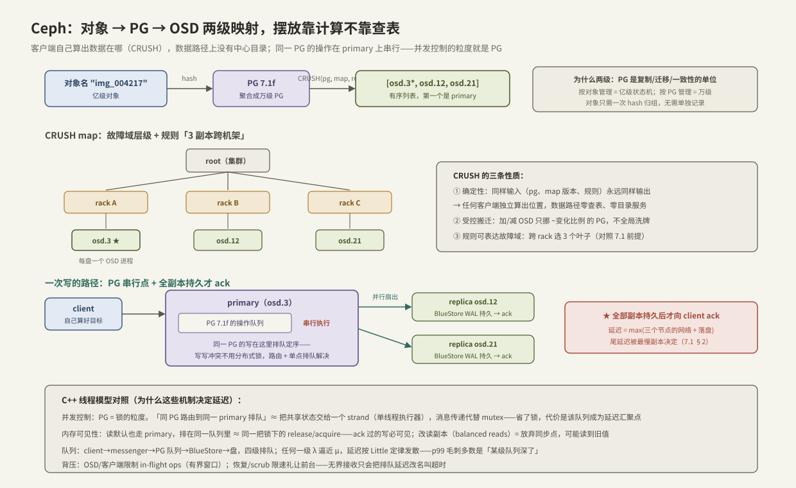

---
tags:
  - 高性能存储
  - 分布式存储
---
# Ceph RADOS 与 CRUSH

> [[7.1 副本 vs EC]] 说清了「冗余分片必须跨故障域摆放」，但留了一个问题：**几亿个对象，每个放哪、谁记得**？两种答案：查表——维护一张「对象 → 位置」的目录（目录本身成为瓶颈与单点，[[7.2 元数据路径瓶颈]]）；计算——让位置成为一个**纯函数**的输出，任何人现场算。Ceph 选了第二条路：RADOS（可靠自治分布式对象存储）负责「每份数据的复制与一致性」，CRUSH 负责「每份数据放哪」的确定性计算。本篇按对象 → PG → OSD 的两级映射拆开这套设计，重点放在对 C++ 工程师最有营养的部分：**Ceph 的并发控制不用分布式锁——它把「共享状态交给单个执行者串行处理」这个多线程编程的经典手法，搬到了集群尺度**。
>
> 与 C++ 线程模型的对照（本章 7.5–7.7 的公共线索）：并发控制 ↔ 锁与 strand、队列 ↔ Little 定律、可见性 ↔ release/acquire、背压 ↔ 有界队列。每一条都直接决定存储延迟的形状。

前置：[[7.1 副本 vs EC]]（副本写路径与尾延迟账）、[[6.1 WAL 与 Crash Consistency]]（单机持久化纪律——每个 OSD 内部仍在执行它）、[[6.9 RocksDB 关键路径]]（OSD 的本地引擎 BlueStore 用 RocksDB 存元数据）。

---

## 1. 角色与对象模型：三种进程，一张地图

RADOS 集群只有三种活动部件【事实】：

| 角色 | 数量级 | 职责 | 在不在数据路径上 |
| --- | --- | --- | --- |
| **OSD**（Object Storage Daemon） | 每块盘一个，成千上万 | 存对象、互相复制、互相心跳、自主修复 | **在**——数据只在 client 与 OSD 之间流动 |
| **Monitor** | 3/5 个 | 用 Paxos 维护**集群地图**（cluster map）的权威版本 | **不在**——只管地图，不碰数据 |
| **Manager** | 2 个 | 指标、均衡器等旁路功能 | 不在 |

关键设计【设计】：**Monitor 只维护"谁活着、谁在哪"这张小地图，不维护"哪个对象在哪"这张大表**。对象定位不查任何服务——client 拿着地图自己算（下一节）。这就是"自治（Autonomic）"的含义：地图之外的一切（复制、故障检测、修复）由 OSD 们对等协作完成，中心组件的负载与对象数量无关。

数据路径的直接后果【事实】：一次读写 = client 直连目标 OSD，一跳网络；Monitor 宕机不影响正在进行的 IO（只影响地图更新）。

---

## 2. 两级映射：对象 → PG → OSD



### 2.1 第一级：hash 归组

`对象名 → hash → PG（Placement Group）`【事实】。PG 是个逻辑分组：亿级对象被稳定哈希聚合成几万个 PG。**为什么要这一级**【设计】：复制、迁移、一致性协商如果按对象做，就是亿级状态机；按 PG 做，是万级。对象与 PG 的关系靠计算维系，不占任何存储——这是"分片（sharding）"思想的标准应用：**管理单位与数据单位解耦**。

### 2.2 第二级：CRUSH 计算摆放

`CRUSH(pg_id, cluster_map, rule) → [osd.3, osd.12, osd.21]`——有序列表，第一个是 **primary**【事实】。CRUSH 的三条性质：

1. **确定性**：输入相同输出必相同——任何 client、任何 OSD 独立算出同一答案，这就是"不查表"的全部依据；
2. **故障域感知**：cluster map 是层级树（root → rack → host → osd），规则可以写"3 副本取自 3 个不同 rack"——[[7.1 副本 vs EC]] 的摆放前提在此落地【实现】；
3. **受控搬迁**：加/减 OSD 改变地图版本（epoch），只有受影响的少数 PG 重新映射，不发生全局洗牌——与朴素 `hash % n`（n 变则几乎全搬）的本质区别。

CRUSH 本质上是**加权 rendezvous hashing** 的层级版【事实】：对每个候选，用 `hash(pg_id, 候选 id)` 生成一个伪随机分数，按权重调制后取最大者。§6 用 40 行代码复现这个思想并实测搬迁比例。

**地图版本（epoch）解决"计算过时"问题**【实现】：每条消息都携带发送方的地图 epoch；OSD 发现对方地图旧了就回推新版本，client 重算重发。一致性不靠"所有人同时更新"，靠"用旧地图的请求会被纠正"。

---

## 3. 写路径：并发控制 = 路由 + 串行点，不是锁

一次 3 副本写的端到端（对照上图下半）【事实】：

1. client 算出 PG 与 primary，把写发给 primary；
2. **primary 将本 PG 的操作放入队列串行定序**——同一 PG 上的并发写在这里排出全序；
3. primary 并行转发给两个 replica；三方各自把写持久化到本地引擎（BlueStore：数据直管裸盘、元数据进 RocksDB、小写先进 WAL——[[6.1 WAL 与 Crash Consistency]] 的纪律在每个 OSD 内原样执行【实现】）；
4. **全部副本持久化完成，primary 才向 client 确认**——延迟 = max（三个节点的网络 + 落盘），尾延迟被最慢副本决定（[[7.1 副本 vs EC]] §2 的账）。

**与 C++ 线程模型的对照**（本篇核心）：

| 分布式机制 | C++ 对应物 | 为什么影响延迟 |
| --- | --- | --- |
| 同一 PG 的读写全部路由到 primary 排队串行 | **strand / actor**：共享状态绑定单执行者，消息传递代替 mutex | 免锁免竞态，但该队列成为延迟汇聚点——热 PG = 热锁，队列深度直接加进每个请求的延迟 |
| ack 后读必见写（读默认也走 primary） | 同一把锁下的 **release/acquire**：写者解锁前的修改，锁后进入者必见 | 强一致读免费搭串行点的车；开启"读副本"（balanced reads）= 放弃同步点，换来分担读负载但可能读旧【取舍】 |
| client → messenger → PG 队列 → BlueStore → 盘 | **多级有界队列流水线** | 每级都有 λ/μ；任何一级逼近饱和，Little 定律让排队时间发散——p99 毛刺的排查顺序就是逐级看队列深度 |
| client/OSD 限制 in-flight 操作数；恢复/scrub 限速 | **有界队列 + 条件变量阻塞**（背压） | 上游被迫等待 = 把过载显式化；无界接收只会把排队延迟改名叫"超时" |

第一行值得多说一句【设计】：分布式系统里"锁"的成本是 RTT 级的（跨网络抢锁、锁服务本身要容错），所以成熟系统几乎都选"**分片 + 单点串行**"而不是"共享 + 加锁"——这与多线程编程从「细粒度锁」演进到「shard your data / actor model」是同一条工程曲线。PG 数量就是并行度旋钮：PG 太少 = 分片太粗 = 串行点过热；PG 太多 = 每 PG 的元数据、心跳、peering 开销堆积【取舍】。

---

## 4. 故障处理：地图翻版、peering 与"分布式 stop-the-world"

盘/机器坏掉后的时序【事实】：

1. 同伴 OSD 心跳超时，上报 Monitor；Monitor 达成共识，发布新地图 epoch（osd.12 → down）；
2. 受影响 PG 按新地图换上替补 OSD，进入 **peering**：新旧成员对齐操作日志、商定权威版本——本质是"重新选主 + 日志对齐"；
3. **peering 期间该 PG 的 IO 暂停**【事实】——这是 Ceph 版的 stop-the-world：集群整体在跑，但落在这些 PG 上的请求会看到一根延迟毛刺；
4. peering 完成即恢复服务（降级态），后台 recovery/backfill 把缺失数据补齐——修复流量与前台抢网络和盘，必须限速，限速又拉长修复窗口——[[7.1 副本 vs EC]] §4 的 durability 账在此兑现。

工程含义【实践】：Ceph 集群的 p99 故事大多不是"盘慢了"，而是**地图事件**（OSD 抖动反复 up/down、扩容触发大规模 backfill）引起的 peering 与迁移。排查先看 `ceph -s` 里的 PG 状态与地图 epoch 变化频率，再看盘。

---

## 5. 动手验证：不装集群也能玩 CRUSH

CRUSH 是纯函数，官方工具 `crushtool` 可以完全离线地编译地图、模拟摆放【实现】：

```bash
# 生成一张演示地图:3 rack × 4 host × 2 osd = 24 个 OSD
crushtool --outfn demo.crush --build --num_osds 24 \
          host straw2 2 rack straw2 4 root straw2 3

# 反编译成文本,看层级与规则(可编辑后用 -c 重新编译)
crushtool -d demo.crush -o demo.txt

# 模拟:1024 个 PG、3 副本,各落在哪些 OSD
crushtool -i demo.crush --test --num-rep 3 --min-x 0 --max-x 1023 \
          --show-mappings | head
# 验证跨故障域:同一行的 3 个 OSD 应分属不同 rack

# 统计分布均匀度(每个 OSD 接到多少 PG)
crushtool -i demo.crush --test --num-rep 3 --min-x 0 --max-x 1023 \
          --show-utilization
```

有真集群时的三条数据路径观察（microceph/cephadm 拉起的单机集群即可）：

```bash
ceph osd tree                      # 故障域层级与权重
ceph osd map mypool myobject       # 亲眼看两级映射:对象 → PG → OSD 列表
rados bench -p mypool 30 write     # 写压测;同时另开终端:
ceph -s                            # 观察 PG 状态;停掉一个 OSD 看 peering/degraded
```

**判读**：`osd map` 的输出就是 §2 的两级映射逐字打印；停 OSD 后 `ceph -s` 里 `peering → degraded → recovering` 的状态迁移对应 §4 的时序，此时 `rados bench` 的延迟曲线上会看到 peering 毛刺【实践】。

---

## 6. Modern C++：40 行摸到"确定性摆放 + 受控搬迁"

用加权 rendezvous hashing（CRUSH 的核心思想）演示两条性质：任何人算结果都一样；加节点只搬走 ~1/n 的数据。

```cpp
#include <algorithm>
#include <cmath>
#include <cstdint>
#include <functional>
#include <vector>

struct Osd { std::uint32_t id; double weight; };   // weight:容量比例

// 稳定混合:同样的 (pg, osd) 永远得到同一个伪随机分数
inline double score(std::uint32_t pg, const Osd& osd) {
    std::uint64_t h = std::hash<std::uint64_t>{}(
        (static_cast<std::uint64_t>(pg) << 32) | osd.id);
    // 归一到 (0,1] 后取 -w/ln(u):权重越大,赢面越大(straw2 同款形式)
    const double u = (static_cast<double>(h % 0xFFFFFF) + 1.0) / 0x1000000;
    return -osd.weight / std::log(u);
}

// CRUSH 的骨架:对每个候选打分,取前 n 名——纯函数,无状态,无查表
std::vector<std::uint32_t> place(std::uint32_t pg,
                                 std::vector<Osd> osds, std::size_t n) {
    std::ranges::partial_sort(osds, osds.begin() + n,
        [pg](const Osd& a, const Osd& b) { return score(pg, a) > score(pg, b); });
    osds.resize(n);
    std::vector<std::uint32_t> out;
    for (const auto& o : osds) out.push_back(o.id);
    return out;
}
```

实验主程序（骨架）：对 10 万个 PG 各算 3 副本位置；然后加入一个新 OSD 重算，统计位置发生变化的 PG 比例：

```cpp
// 预期:24 → 25 个 OSD,受影响 PG ≈ 1/25 = 4% 量级,而不是 hash%n 的 ~96%
int changed = 0;
for (std::uint32_t pg = 0; pg < 100'000; ++pg)
    if (place(pg, before, 3) != place(pg, after, 3)) ++changed;
```

**关键点**：

- `score` 只依赖 `(pg, osd)` 二元组——加入新 OSD 不改变旧候选的分数，只是新候选偶尔"插队夺冠"，所以只有被它夺走的 PG 需要搬家——**受控搬迁是打分函数无状态性的直接推论**【事实】；
- 真 CRUSH 在此之上加了层级递归（先选 rack 再选 host 再选 osd）与失败重试，结构性结论不变【事实】；
- 省略了故障域约束与真实 straw2 的定点数实现——教学骨架，别用于生产。

---

## 7. 陷阱与误区

> [!warning] 常见错误
> 1. **把 Monitor 当元数据服务器压测/扩容**：它不在数据路径上，对象定位是 client 本地计算——IO 慢先查 OSD 与网络，不是加 Monitor。
> 2. **PG 数拍脑袋**：太少则串行点过热、数据不均；太多则 peering/心跳/内存开销压垮 OSD——按官方公式（OSD 数 × 目标每盘 PG 数 ÷ 副本数）起步，靠 balancer 微调【实现】。
> 3. **以为 CRUSH 均匀 = 容量均衡**：伪随机有方差，大集群里最满与最空的盘能差出两位数百分比——权重与 balancer 是常规运维，不是补丁。
> 4. **忽略 peering 的 IO 暂停**：滚动重启、扩容都会触发；变更窗口的 p99 毛刺是设计行为，要在容量与 SLO 规划里预留。
> 5. **开 balanced reads 又假设强一致**：读副本放弃了"读写同一串行点"的同步保证——一致性语义是配置出来的，改配置前先想清楚谁依赖它【取舍】。
> 6. **恢复不限速**：backfill 全速跑等于把 [[7.1 副本 vs EC]] 的修复风暴亲手引爆——前台 p99 先死。
> 7. **在超卖网络上部署**：OSD 间复制/心跳/恢复流量与前台共享网络，拥塞让心跳超时误判 OSD down → 地图抖动 → 更多迁移流量——正反馈雪崩（[[10.6 健康检查与故障摘除]]）。

---

## 8. 关键结论

| 结论 | 性质 |
| --- | --- |
| RADOS 三角色：OSD 在数据路径上，Monitor 只管小地图（Paxos），对象定位零查表 | 事实 |
| 两级映射：hash 把亿级对象聚成万级 PG（管理单位解耦）；CRUSH 把 PG 确定性地映射到跨故障域的 OSD 列表 | 事实 |
| CRUSH = 加权 rendezvous 的层级版：确定性、故障域感知、受控搬迁（加减节点只搬 ~变化比例） | 事实 |
| 并发控制不用分布式锁：同 PG 路由到 primary 串行定序 ≈ strand/actor——免锁的代价是热 PG 队列即延迟 | 事实/设计 |
| 全副本持久才 ack；读默认走 primary ≈ 同一同步点下的 release/acquire，强一致免费；读副本则放弃该保证 | 事实/取舍 |
| 延迟 = 四级队列（messenger/PG/BlueStore/盘）逐级排队之和；p99 排查即逐级看队列 | 实践结论 |
| 故障处理 = 地图翻版 + peering（期间该 PG IO 暂停）+ 限速恢复——p99 事故多源于地图事件而非慢盘 | 事实/实践 |
| PG 数是并行度旋钮：分片过粗热点化，过细开销化 | 取舍 |

---

## 关联知识

- [[7.1 副本 vs EC]] - 冗余与摆放的前提；修复风暴与 durability 账
- [[7.2 元数据路径瓶颈]] - "查表派"的困境，反衬计算摆放的价值
- [[6.1 WAL 与 Crash Consistency]] - 每个 OSD 内部仍在执行的单机纪律
- [[6.9 RocksDB 关键路径]] - BlueStore 元数据引擎的真身
- [[7.7 对象存储路径]] - 对象接口层视角的一次 PUT/GET
- [[10.6 健康检查与故障摘除]] - 心跳误判与摘除风暴的控制面视角
- [[4.7 PFC ECN 与 DCQCN]] - 复制扇出遇上网络拥塞时的底层机制
