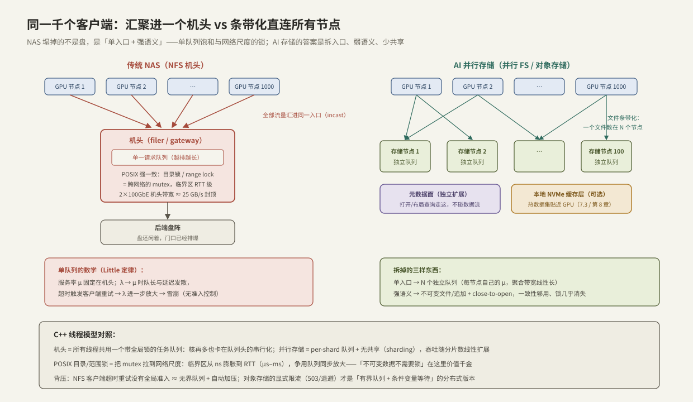

---
tags:
  - 高性能存储
  - 分布式存储
---
# AI 存储 vs 传统 NAS

> 训练集群搭好了，最直觉的存储方案是买台 NAS：所有 GPU 节点 `mount` 上去，POSIX 语义齐全，谁都会用。然后第一个千卡任务开跑：数据加载吞吐卡在个位数 GB/s，DataLoader 排队，GPU 利用率跌到两位数——**盘明明是闲的**。本篇解释这台 NAS 塌在哪：不是硬件不够，而是「单入口 + 强语义」的架构假设与 AI 负载正面相撞。塌的机制恰好是每个 C++ 工程师都写过的两种 bug 的放大版：**所有线程抢一个任务队列，和把 mutex 拉到网络尺度**。看懂单机版，就看懂了 NAS 的天花板，也就看懂了 AI 存储（并行文件系统/对象存储）为什么长成那个形状。

前置：[[00. 总纲]]（Little 定律 `L = λW`——本篇的主刀工具）、[[7.1 副本 vs EC]] §5（数据分层选型）、[[7.2 元数据路径瓶颈]]（本篇拆出的元数据面，那边深挖）。

---

## 1. 传统 NAS 的架构假设

NAS（Network Attached Storage）的经典形态【事实】：一台（或主备两台）**机头**（filer/控制器）在前，盘阵在后；客户端用 NFS/SMB 协议、经内核挂载访问；机头提供完整 POSIX 语义——层级目录、rename 原子性、字节级读写、多客户端并发下的一致性仲裁。

这套设计针对的负载画像【前提】：几十到几百个客户端、办公文件与家目录、读写分散在不同文件、单客户端带宽 MB/s 级。三条隐含假设：

1. **入口可以只有一个**：汇聚流量 << 机头的网卡与 CPU；
2. **强语义值得付费**：并发修改同一文件/目录是常态，必须有仲裁者；
3. **容量与性能一起扩**：不够就换更大的机头（scale-up）。

---

## 2. AI 负载画像：三条假设逐条失效

训练负载的形状（第 8 章逐项展开，这里取轮廓）【量级】：

| 维度 | 办公/企业负载 | AI 训练负载 |
| --- | --- | --- |
| 并发客户端 | 几十~几百，错峰 | 数百~数千 GPU 节点，**同步开跑** |
| 带宽需求 | 汇聚 MB/s~GB/s | 数据加载聚合 **数十~数百 GB/s**；checkpoint 突发写再翻倍（[[8.6 Checkpoint 同步异步分片]]） |
| 访问模式 | 读写混合、原地修改 | 数据集**只读**、顺序/随机批读；产出**一次写成**——几乎没有原地修改 |
| 文件形态 | 中等大小、深目录树 | 大文件（打包后 GB 级）+ 小文件海（原始样本、[[7.2 元数据路径瓶颈]]） |
| 一致性需求 | 多写者同文件，需仲裁 | **单写者、多读者、写后不改**——强一致仲裁无事可做 |

对照三条假设：入口成为汇聚点（假设 1 崩）；强语义在保护不存在的并发修改（假设 2 白付费）；带宽需求随 GPU 数线性涨，机头换到顶也追不上（假设 3 崩）。

---

## 3. 塌的机制：两个单机 bug 的集群放大



### 3.1 单队列饱和：所有线程抢一个任务队列

机头是全部流量的必经点，它的服务率 μ 由自身网卡、CPU、后端盘决定，且**固定**【事实】。用 Little 定律看：到达率 λ 随 GPU 节点数线性上涨；λ 远小于 μ 时延迟平稳，λ 逼近 μ 时排队长度与等待时间**超线性发散**——延迟-负载曲线不是缓坡，是曲棍球杆【事实】。

C++ 对应：N 个生产者线程往**一个** mutex 保护的队列里塞任务，单消费者处理——加多少生产者都没用，吞吐钉死在消费者的处理速率上，加得越多队列越长、单任务延迟越高。§6 的微基准 20 行复现这条曲线。

雪上加霜的是**重试放大**【实践】：NFS 客户端超时后重发请求；机头过载 → 超时 → 重发 → λ 进一步升高——没有全局准入控制的重试是**正反馈**。C++ 对应：拿不到锁就忙等自旋的线程越多，锁越热，等价于给过载系统自动加压。这也是背压缺位的教科书后果：TCP 流控只保护**链路两端的缓冲区**，保护不了机头后面的盘与队列——传输层的背压不等于应用层的背压【事实】。

### 3.2 强语义：把 mutex 拉到网络尺度

POSIX 的一致性承诺（多个客户端并发读写同一文件/目录时行为可预期）需要仲裁：目录修改、字节区间写、属性更新都要在机头串行化，客户端缓存要靠租约/回调失效来维持一致【事实】。每一次仲裁都是跨网络的往返。

C++ 对应，也是本篇最重要的一个数量级直觉【量级】：**单机 mutex 的无争用加锁是 ~20 ns，跨网络"锁"的一次往返是 ~100 μs——五千倍**。临界区成本膨胀五千倍后，单机上可以忽略的争用（每秒几千次元数据操作）变成主导延迟的成分。而 AI 负载为这套仲裁付费买到的东西是零——数据集只读，产出一次写成，**被保护的并发修改根本不发生**。

「不可变数据不需要锁」——这句多线程编程的金句，就是 AI 存储弱化 POSIX 的全部理论依据【设计】。

---

## 4. AI 存储的形状：拆入口、弱语义、分数据面

答案不是更大的机头，是**架构上消灭机头**（对照上图右半）。三个动作：

1. **数据面并行直连**【事实】：文件/对象条带化分布在所有存储节点上，客户端（用户态库或专用客户端）**同时**从多节点读写——每节点自己的队列自己的 μ，聚合带宽随节点数线性扩展。C++ 对应：per-shard 队列替代全局队列，sharding 替代锁。100 个节点 × 25 GB/s 的账，双机头永远追不上【量级】；
2. **元数据面独立**【事实】：打开、定位、列举走单独的元数据服务（自己也要分片扩展——难点见 [[7.2 元数据路径瓶颈]]；或者干脆用 [[7.5 Ceph RADOS 与 CRUSH]] 的计算摆放把定位变成本地纯函数）。数据流一旦建立，字节不过元数据服务器；
3. **语义按需付费**【取舍】：不可变/追加写、close-to-open 一致性（NFS 本来也只有这个级别）、放弃跨客户端字节级仲裁——锁从数据路径上整体消失。需要强语义的少数场景（实验元数据、样本索引）交给数据库/KV，走 [[7.1 副本 vs EC]] 的副本路线——**分层，而不是让一套系统通吃**。

再加一层缓存完成拼图【实现】：热数据集用计算节点本地 NVMe 做只读缓存（JuiceFS/Alluxio/3FS 各有形态，[[7.3 JuiceFS 架构]]、[[7.4 3FS 架构]]）——只读数据的缓存不需要失效协议，这又是不可变性送的礼物。

**背压也升级为一等公民**【设计】：对象存储网关过载时显式回 503/SlowDown，客户端指数退避（[[7.7 对象存储路径]]）——等价于有界队列满时的拒绝 + 条件变量等待，比"默默排队到超时再重试"诚实且稳定。

---

## 5. 延迟因果链：从队列到 GPU 利用率

把四个概念串成一条到 GPU 的因果链【实践】：

1. **队列**：入口汇聚 → λ/μ 逼近 1 → 存储延迟发散（Little）；
2. **并发控制**：元数据/锁仲裁在网络尺度串行化 → 小文件打开与目录操作成为第二队列；
3. **背压缺位**：超时重试放大 λ → 毛刺变持续过载；
4. **传导**：存储 p99 抬升 → DataLoader 预取填不满流水线 → 批间空泡 → **GPU 利用率掉、千卡等一个存储入口**（归因方法见 [[8.7 DataLoader 与 GPU 空闲归因]]）。

反向读这条链就是选型清单：吞吐靠**拆入口**、元数据靠**独立面 + 计算摆放**、稳定性靠**显式背压**、延迟兜底靠**本地缓存**。

---

## 6. Modern C++：20 行复现机头曲线

单队列 vs 分片队列的微基准——机头与并行存储的最小同构模型：

```cpp
#include <chrono>
#include <mutex>
#include <queue>
#include <thread>
#include <vector>

// 模式 A(机头):N 个生产者 → 1 个全局队列(一把锁) → 1 个消费者
// 模式 B(并行):N 个生产者 → N 个分片队列 → N 个消费者,无共享
struct Shard {
    std::mutex mu;
    std::queue<int> q;
};

void producer(Shard& s, int n_items) {
    for (int i = 0; i < n_items; ++i) {
        std::scoped_lock lk{s.mu};
        s.q.push(i);
    }
}

void consumer(Shard& s, int n_items) {
    int done = 0;
    while (done < n_items) {
        std::scoped_lock lk{s.mu};
        if (!s.q.empty()) { s.q.pop(); ++done; }
        // 真实消费者还有"服务时间";这里连服务时间都不加,
        // 只测队列与锁本身——差距只会比测出来的更大
    }
}
```

主程序骨架：模式 A 用 1 个 `Shard`、N 个生产者线程；模式 B 用 N 个 `Shard` 一一配对；`std::chrono` 计时对比总吞吐。预期【实践】：模式 A 的吞吐随 N 先平后**降**（锁争用 + 缓存行乒乓），模式 B 近似线性上升——把 N 换成"GPU 节点数"、锁换成"机头"，就是第 3 节的曲线。

**关键点**：

- 模式 A 慢的原因不是"工作变多"而是**串行化点**：所有线程的进展都要穿过同一把锁——阿姆达尔定律的队列版；
- 分布式版本里"锁"的每次获取还要加一个 RTT，放大 3–4 个数量级——单机微基准是下界，不是近似值【前提】；
- 模式 B 的前提是**任务可分片**（shard 间无依赖）——对应 AI 存储的前提"文件不可变、无跨客户端写冲突"。分片方案的适用性永远取决于共享可变状态能不能消掉，存储与多线程无异【设计】。

---

## 7. 动手验证：把机头饱和曲线测出来

单机即可模拟（一台机器同时当 NFS 服务端与多客户端；量级失真但**曲线形状**保真）：

```bash
# 服务端:导出一个目录(测试机;/etc/exports 加一行后 exportfs -ra)
echo '/srv/nfs 127.0.0.1(rw,sync,no_subtree_check)' | sudo tee -a /etc/exports
sudo exportfs -ra && mkdir -p /mnt/nfs
sudo mount -t nfs 127.0.0.1:/srv/nfs /mnt/nfs

# 客户端数 1→4→16→64,固定每客户端负载,观察聚合吞吐与 p99
for n in 1 4 16 64; do
  fio --name=headnode --directory=/mnt/nfs --numjobs=$n --group_reporting \
      --rw=randread --bs=128k --size=256M --time_based --runtime=30 \
      --percentile_list=50:99 | grep -E 'bw=|99.00'
done

# 对照组:同一负载打本地盘(没有机头),曲线应线性得多
# 观察 NFS 层的重传与队列:
nfsstat -c            # retrans 计数——重试放大的直接证据
mountstats /mnt/nfs   # 每操作的 RTT 与排队时间分解
```

**判读**：聚合吞吐随 numjobs 上升很快进入平台期（机头/loopback 的 μ 到顶），而 p99 持续上升——**吞吐平台 + 延迟上升 = 单入口饱和**的指纹；`nfsstat` 的 `retrans` 若同步上涨，就是 §3.1 重试放大的现场。真实环境里把 127.0.0.1 换成真 NAS、numjobs 换成多台客户端机，形状不变、平台更低【实践】。

---

## 8. 陷阱与误区

> [!warning] 常见错误
> 1. **给千卡集群配 NAS，理由是"POSIX 兼容省事"**：为不存在的并发修改支付网络尺度的锁；训练一开跑，省的事全变成 GPU 空转账单。
> 2. **NAS 慢就换更大的机头**：scale-up 追不上 λ 的线性增长；单入口的架构天花板换硬件挪不掉。
> 3. **把 TCP 流控当背压**：它只保护链路缓冲；应用层没有准入/退避，超时重试照样把系统推进雪崩。
> 4. **迷信"并行文件系统"四个字**：元数据面没独立扩展的"并行"系统，只是把机头改名叫 MDS——小文件海一来照样跪（[[7.2 元数据路径瓶颈]]）。
> 5. **给只读数据集上强一致缓存协议**：不可变数据的缓存无需失效——按可变数据设计缓存是在给自己发明锁。
> 6. **微基准用单机 mutex 推分布式锁成本**：差 3–4 个数量级；架构决策要按 RTT 算账。
> 7. **数据面达标就收工**：checkpoint 突发写、小文件元数据 QPS、DataLoader 随机读是三种不同形状的负载——按 [[7.1 副本 vs EC]] §5 分层，别指望一个系统三顶帽子都戴。

---

## 9. 关键结论

| 结论 | 性质 |
| --- | --- |
| NAS 三假设：单入口够用、强语义值得、scale-up 能扩——AI 负载（千级并发、只读数据集、一次写成、TB/s 级带宽）逐条击穿 | 事实/前提 |
| 塌点一：机头 = 全局单队列，λ→μ 时延迟按 Little 定律发散；超时重试是无准入的正反馈 | 事实 |
| 塌点二：POSIX 仲裁 = 网络尺度的 mutex，临界区成本放大 ~5000×，而 AI 负载的并发修改根本不存在 | 事实/量级 |
| AI 存储三动作：数据面条带化直连（per-shard 队列）、元数据面独立（或计算摆放）、语义按需付费（不可变+close-to-open） | 事实/设计 |
| 不可变性一石三鸟：免锁、免缓存失效协议、天然适配 EC——是整个架构的支点 | 设计 |
| 背压必须显式（503/退避 = 有界队列 + 等待）；TCP 流控不是应用背压 | 事实/实践 |
| 延迟传导链：入口队列 → 元数据串行化 → 重试放大 → DataLoader 空泡 → GPU 利用率——存储 p99 直接定价 GPU 账单 | 因果/实践 |
| 单队列 vs 分片队列的单机微基准给出曲线形状；分布式把锁成本再乘 10³–10⁴ | 实践结论 |

---

## 关联知识

- [[7.1 副本 vs EC]] - 分层选型：什么数据走副本、什么走 EC
- [[7.2 元数据路径瓶颈]] - 独立出来的元数据面自己怎么扩展
- [[7.3 JuiceFS 架构]] / [[7.4 3FS 架构]] - "对象存储底座 + 缓存/元数据面"的两种工业实现
- [[7.5 Ceph RADOS 与 CRUSH]] - 用计算摆放消灭定位查表
- [[7.7 对象存储路径]] - 弱语义 + 显式背压的接口层长什么样
- [[8.6 Checkpoint 同步异步分片]] - 突发写负载的专门处理
- [[8.7 DataLoader 与 GPU 空闲归因]] - 存储延迟如何折算成 GPU 空转
