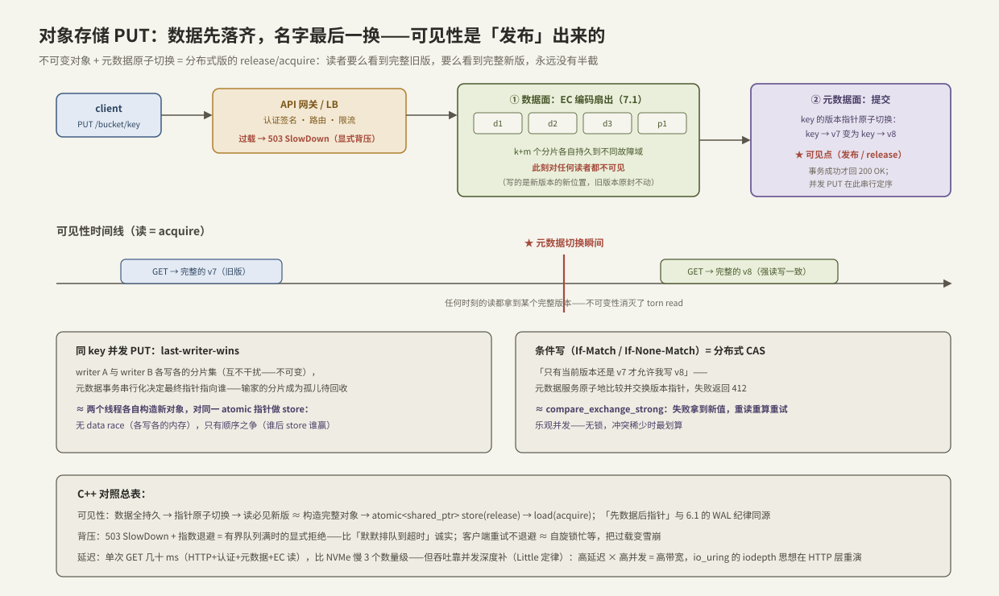

---
tags:
  - 高性能存储/分布式存储
---
# 对象存储路径

> 前两篇各留了一个伏笔：[[7.1 副本 vs EC]] 说 EC 的工业前提是「不可变对象」，[[7.6 AI 存储 vs 传统 NAS]] 说健康的系统要「显式背压」——这两样东西的来源系统就是对象存储。S3 风格的 API 如今是 AI 存储的通用底座：数据集、checkpoint、模型权重最终都躺在某个 bucket 里。本篇拆一次 PUT/GET 的端到端路径：请求经过哪些层、**一个对象从「字节落盘」到「对外可见」之间发生了什么**。这条路径是全章 C++ 对照线索的集大成者：不可变对象 + 元数据原子切换，就是 `std::atomic<std::shared_ptr>` 的 release/acquire 发布模式在分布式的放大；条件写是 CAS；503 SlowDown 是有界队列的显式拒绝。看懂单机内存序，这套系统的一致性行为可以直接推出来。

前置：[[7.1 副本 vs EC]]（数据面的冗余机制）、[[7.2 元数据路径瓶颈]]（名字 → 位置这张表）、[[6.1 WAL 与 Crash Consistency]]（「先数据后指针」纪律的单机原型）。

---

## 1. 对象模型：五条与文件系统的分界线

对象存储的接口窄得刻意【事实】：

| | 文件系统 | 对象存储（S3 风格） |
| --- | --- | --- |
| 命名 | 层级目录树 | **扁平**：bucket + key（`/` 只是字符，「目录」是前缀列举的幻觉） |
| 写入 | 任意偏移原地改、append | **整对象 PUT，不可变**——改一个字节 = 重传整个对象成为新版本 |
| 读取 | 字节级 read/mmap | GET 整对象或 Range GET（[[7.8 Multipart 与 Range GET]]） |
| 原子改名 | rename 原子 | **无 rename**——「移动」= 复制 + 删除，两个操作 |
| 访问方式 | 系统调用 + 页缓存 | **HTTP/REST**，每请求带签名认证 |

这五条不是功能缺失，是**换取分布式简单性的主动裁剪**【设计】：不可变消灭了并发写仲裁与 torn 问题（[[6.4 Torn Write 与 Checksum]] §3.3 的 COW 路线推到接口层）、扁平命名消灭了跨目录事务、无 rename 消灭了最难分布式化的原子操作。接口每窄一分，后端的水平扩展就容易一分——与 [[7.6 AI 存储 vs 传统 NAS]] 的「语义按需付费」同一逻辑。

---

## 2. PUT 的端到端：数据先落齐，名字最后一换



四步流水（对照上图）【事实】：

1. **网关层**：负载均衡 + API 服务器验签名、查权限、按 bucket/key 路由——纯无状态计算，水平扩展最容易的一层；过载时**主动拒绝**（S3 返回 503 SlowDown【实现】），这是 §4 的背压入口；
2. **数据面**：对象切片、EC 编码（或小对象三副本，[[7.1 副本 vs EC]] §5 的选型），k+m 个分片扇出到不同故障域各自持久。**关键：此刻新数据对任何读者都不可见**——写的是新位置，旧版本原封不动；
3. **元数据面**：把 `key → 版本指针` 从 v7 原子地切换到 v8（一次元数据服务内的事务，[[7.2 元数据路径瓶颈]]）——**这一瞬间就是可见点（commit point）**；
4. 网关向 client 回 200——从此任何 GET 都会读到 v8（现代对象存储承诺强读写一致【事实/历史】：S3 早年是最终一致，新 PUT 后可能读到旧版本，2020 年起改为强一致——语义是演进出来的，读旧文档要小心）。

**这就是 [[6.1 WAL 与 Crash Consistency]] 的「先落盘、后改指针」在分布式的版本**【设计】：数据分片 = record，元数据切换 = keydir 更新；提交点之前崩溃（任何分片写失败、事务未提交），对外世界毫发无损，孤儿分片由后台垃圾回收清理。

### 与 C++ 内存模型的对照（本篇核心）

| 对象存储机制 | C++ 对应物 | 推论 |
| --- | --- | --- |
| 数据全持久 → 指针原子切换 → 读必见完整版本 | 构造完整对象 → `atomic<shared_ptr>` 的 `store`（release）→ 读者 `load`（acquire） | 读者**永远不会看到半个对象**——不是靠锁，是靠「不可变 + 发布顺序」；这正是无锁发布模式的正确性论证，原样适用 |
| 同 key 并发 PUT：各写各的分片集，元数据事务定序，last-writer-wins | 两个线程各自 new 出新版本，先后对同一 atomic 指针 store | **无 data race**（无共享可变内存），只有顺序之争；输家的分片成为孤儿等回收 ≈ 输家的对象等 shared_ptr 引用清零 |
| 条件写 If-Match： "当前还是 v7 才允许写" | `compare_exchange_strong`：失败拿到当前值，重读重算重试 | 乐观并发控制——无锁、冲突稀少时最优；「读-改-写」竞态的分布式解法与单机一字不差【事实/实现】 |
| 早年最终一致（PUT 后可能读旧） | relaxed 存取：无同步关系，可见性无序 | 为什么难用：应用被迫自己实现同步（轮询、版本号）——正如 relaxed 原子只该留给专家 |

---

## 3. GET 的延迟解剖：慢三个数量级，靠什么活

一次冷 GET 的时间构成【量级】：

```text
GET 首字节延迟 ≈ TLS/连接复用 + 签名验证      (~ms 级,可摊薄)
              + 元数据查询(key → 布局)        (~ms)
              + 数据节点读取(EC 数据片直读)    (盘 μs 级 + 网络往返)
              + 网关转发                     (~ms)
              ≈ 几十 ms 量级(对比本地 NVMe 几十 μs——差 3 个数量级)
```

对象存储在 AI 场景活得很好的原因不是延迟低，是**三条补偿路径**【设计】：

1. **并发深度换吞吐**：Little 定律 `L = λW`——W 大就把 L 拉大：数百并发 GET 把聚合带宽推到网卡上限。这是 [[2.3 iodepth 与提交完成路径]] 的 iodepth 思想在 HTTP 层的重演：**高延迟介质靠深队列喂饱**；单流慢 ≠ 系统慢；
2. **Range GET + Multipart 并行**：大对象切段并发拉（[[7.8 Multipart 与 Range GET]]），单对象内部也能上并发；
3. **前置缓存层**：热数据集放计算侧 NVMe 缓存（[[7.3 JuiceFS 架构]]、[[7.4 3FS 架构]]），对象存储退居冷层与真相源——延迟敏感的路径根本不碰它。

**热点的另一面**【实现/量级】：对象存储按 key 前缀分区扩展，单前缀的请求率有上限（S3 公开指导：每前缀每秒约 3500 写/5500 读，超出触发限流；具体数字随实现演进）——**键名设计就是分区设计**：把百万对象都塞进 `dataset/` 一个前缀，等于亲手把并行系统改回单队列（[[7.6 AI 存储 vs 传统 NAS]] 的机头又回来了）。

---

## 4. 背压：503 不是故障，是协议

对象存储把过载处理做成了**显式协议**【事实】：

1. 网关/分区过载 → 返回 503 SlowDown（或 429）——语义是「队列满了，别排了，等会再来」；
2. 客户端 SDK 收到后**指数退避 + 抖动**重试——把 λ 主动降下来；
3. 稳态恢复后自动回到全速。

C++ 对照【设计】：这就是**有界队列**的正确用法——`try_push` 失败返回 false（而不是无界堆积），生产者退避等待（而不是自旋重试）。对比 [[7.6 AI 存储 vs 传统 NAS]] §3.1 的 NFS 雪崩：超时重试没有退避 ≈ 自旋忙等，把过载变成正反馈；而 503 + 退避是负反馈——**同样是重试，反馈符号相反，系统稳定性天壤之别**。

工程纪律【实践】：自己写客户端（绕过官方 SDK）时，退避逻辑不是可选项——不退避的重试循环在集群尺度就是 DDoS 自己人；观察指标是限流响应占比（如 5xx/SlowDown 比率）与重试放大系数（实际请求数 ÷ 逻辑请求数）。

---

## 5. Modern C++：把「可见性发布」写成 50 行

单进程内复刻 §2 的三件事：不可变版本、原子发布、条件写。C++20 起 `std::atomic<std::shared_ptr<T>>` 可直接特化【事实】：

```cpp
#include <atomic>
#include <memory>
#include <string>
#include <vector>

// 一个"对象版本":构造完成后不可变——正确性的一半来自这里
struct ObjectVersion {
    std::uint64_t version;
    std::vector<std::byte> bytes;   // 内容(演示用;真实系统是分片位置)
};

class Bucket {
public:
    // PUT:先完整构造(=数据面落盘),再原子切换指针(=元数据提交/发布)
    void put(std::vector<std::byte> data) {
        auto next = std::make_shared<const ObjectVersion>(
            ObjectVersion{next_version_.fetch_add(1) + 1, std::move(data)});
        current_.store(std::move(next), std::memory_order_release);  // ★可见点
    }

    // GET:acquire 读——拿到的必是某个"完整"版本,绝无半截
    std::shared_ptr<const ObjectVersion> get() const {
        return current_.load(std::memory_order_acquire);
    }

    // 条件 PUT(If-Match):当前还是 expected 版本才写入——分布式 CAS 的单机原型
    bool put_if_match(std::uint64_t expected, std::vector<std::byte> data) {
        auto cur = current_.load(std::memory_order_acquire);
        if (!cur || cur->version != expected) return false;          // 412
        auto next = std::make_shared<const ObjectVersion>(
            ObjectVersion{next_version_.fetch_add(1) + 1, std::move(data)});
        // 指针级 CAS:期间有别人发布过就失败,调用方重读重试
        return current_.compare_exchange_strong(
            cur, std::move(next),
            std::memory_order_acq_rel, std::memory_order_acquire);
    }

private:
    std::atomic<std::shared_ptr<const ObjectVersion>> current_{};
    std::atomic<std::uint64_t> next_version_{0};
};
```

**逐段讲解**：

- `put` 的两行顺序就是全部正确性：**构造在前（且构造后不可变），release 发布在后**——acquire 读者一旦看到新指针，也必然看到指针指向的完整内容。顺序反了（先发布再填内容）就是 torn read，与分布式系统「先改元数据再传数据」的事故同构；
- `get` 返回 `shared_ptr`：读者拿到的版本在其使用期间永不消失也永不改变——引用计数扮演了对象存储「旧版本被 GET 持有期间不被 GC」的角色；
- `put_if_match` 演示乐观并发：检查-构造-CAS，失败方拿到最新状态重试。真实对象存储的 If-Match 语义与此逐点对应，只是「指针」换成元数据服务里的一行记录、CAS 换成一次事务【事实】；
- 两个 PUT 并发竞争时没有任何锁：各自构造各自的版本（不共享可变内存），只在指针切换处定序——**last-writer-wins 是原子 store 的默认语义**，正是 §2 表格第二行。

---

## 6. 动手验证：单机拉起一个对象存储

用 MinIO（S3 兼容，单二进制/容器）把本篇路径全部走一遍：

```bash
# 拉起服务(数据落在 /var/tmp/minio,控制台 9001)
docker run -d --name minio -p 9000:9000 -p 9001:9001 \
  -v /var/tmp/minio:/data minio/minio server /data --console-address ':9001'

# 客户端配置 + 建桶
mc alias set local http://127.0.0.1:9000 minioadmin minioadmin
mc mb local/lab

# ① PUT/GET 往返与延迟感受
dd if=/dev/urandom of=/var/tmp/obj.bin bs=1M count=64
time mc cp /var/tmp/obj.bin local/lab/ckpt/model.bin     # PUT
time mc cp local/lab/ckpt/model.bin /var/tmp/out.bin     # GET

# ② 首字节延迟分解:预签名 URL + curl 计时(注意 URL 要加引号)
URL=$(mc share download --expire 10m local/lab/ckpt/model.bin | grep -o 'http[^ ]*$')
curl -s -o /dev/null -w 'ttfb=%{time_starttransfer}s total=%{time_total}s\n' "$URL"
curl -s -o /dev/null -H 'Range: bytes=0-1048575' \
     -w 'range-1MiB total=%{time_total}s\n' "$URL"        # Range GET(7.8)

# ③ 并发 PUT 竞争:两个写者同 key 对赌,读者观察版本切换
for i in 1 2; do (echo "writer-$i" > /var/tmp/w$i.txt \
    && mc cp /var/tmp/w$i.txt local/lab/race/flag.txt) & done; wait
mc cat local/lab/race/flag.txt        # last-writer-wins:恰好其一,永不混合

# ④ 吞吐 = 并发深度 × 单流:对比 1 并发与 16 并发的聚合带宽
mc cp --recursive local/lab/ckpt /var/tmp/single/          # 单流
# (用 s5cmd/goofys 或自写脚本起 16 路并发对比;或 mc mirror --parallel)
```

**判读**：① 的 time 包含认证 + 元数据 + 数据传输——与本地 `cp` 对比就是 §3 的三个数量级；③ 无论跑多少轮，`flag.txt` 内容要么完整是 writer-1 要么完整是 writer-2——**不可变 + 原子切换消灭混合态**的现场证据；④ 单流带宽平平、16 路逼近网卡/盘上限——Little 定律的动手版【实践】。

---

## 7. 陷阱与误区

> [!warning] 常见错误
> 1. **把对象存储当文件系统用**：依赖 rename 原子性（没有）、append（S3 没有）、部分覆写（没有）——每一条都得用「写新对象 + 切换引用」重新设计。
> 2. **所有对象共用一个前缀**：分区按前缀切，热前缀限流——键名里不带分散性（哈希/日期分桶）等于自建单队列热点。
> 3. **收到 503 立刻原样重试**：不退避的重试是正反馈加压；SDK 的指数退避被关掉/绕过是重大事故源。
> 4. **用 2020 年前的"最终一致"经验写代码**（或反过来在别的对象存储上假设强一致）：一致性语义因实现与年代而异——**查当前文档，别背结论**【前提】。
> 5. **拿单流延迟评价对象存储**：它是高延迟高并行介质，吞吐要按「并发深度 × 单流」评估；单线程 benchmark 得出的"慢"没有信息量。
> 6. **小文件海直接进对象存储**：每对象一次 HTTP + 认证 + 元数据事务，固定开销支配一切——先打包（tar/parquet/自定义格式）再存，读侧配 Range GET（[[7.8 Multipart 与 Range GET]]）。
> 7. **跨对象假设原子性**：强一致只按单 key 承诺；「两个对象要么都新要么都旧」需要自己做 manifest/指针对象——又是一层「先数据后指针」【设计】。

---

## 8. 关键结论

| 结论 | 性质 |
| --- | --- |
| 对象接口的窄是主动裁剪：不可变、扁平、无 rename——每窄一分，水平扩展易一分 | 设计 |
| PUT 四步：网关（无状态） → 数据面分片持久（不可见） → 元数据指针原子切换（★可见点） → ack；「先数据后指针」= WAL 纪律的分布式版 | 事实 |
| 可见性 = 发布：不可变对象 + release 切换 + acquire 读 → 读者永见完整版本，无锁无 torn | 事实/设计 |
| 并发 PUT 无 data race 只有定序（last-writer-wins）；条件写 If-Match = 分布式 compare_exchange | 事实 |
| 强读写一致是承诺出来的且随年代演进（S3 2020 前最终一致）——查文档，别背结论 | 事实/历史/前提 |
| GET 首字节几十 ms（慢 NVMe 3 个数量级）；吞吐靠并发深度、Range 并行与前置缓存补——iodepth 思想在 HTTP 层重演 | 量级/设计 |
| 键前缀 = 分区：热前缀限流，键名设计就是并行度设计 | 实现/实践 |
| 503 + 指数退避 = 有界队列的显式背压（负反馈）；不退避重试 = 自旋加压（正反馈）——反馈符号决定系统稳定性 | 事实/实践 |

---

## 关联知识

- [[7.1 副本 vs EC]] - 数据面的冗余选型；「不可变对象」前提在此兑现为 EC 友好
- [[7.2 元数据路径瓶颈]] - 可见点所在的那张表自己怎么扩展
- [[7.6 AI 存储 vs 传统 NAS]] - 为什么接口要窄、背压要显式的宏观论证
- [[7.8 Multipart 与 Range GET]] - 大对象的上传与并行读取机制
- [[6.1 WAL 与 Crash Consistency]] - 「先数据后指针」的单机原型
- [[6.4 Torn Write 与 Checksum]] - COW 路线消灭 torn 的机制版
- [[7.3 JuiceFS 架构]] / [[7.4 3FS 架构]] - 架在对象存储之上的缓存与文件语义层
- [[2.3 iodepth 与提交完成路径]] - 「高延迟靠深队列」的单机出处
