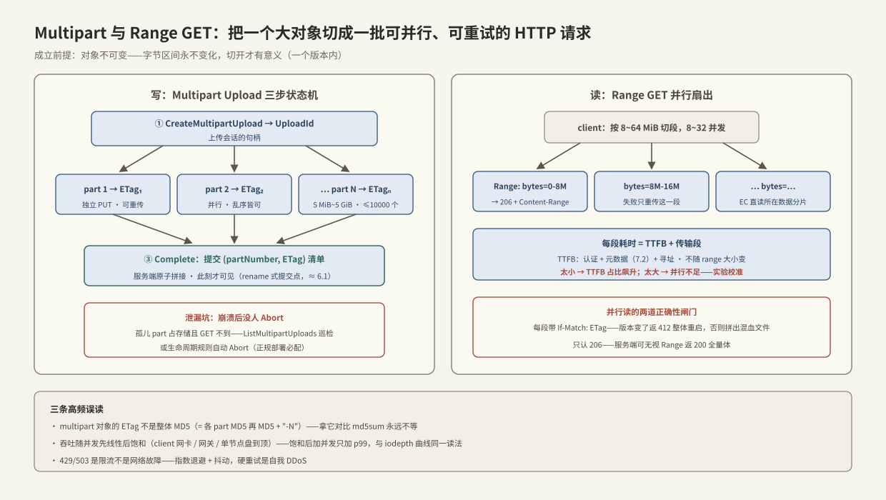

---
tags:
  - 高性能存储
  - 分布式存储
---
# Multipart 与 Range GET

> 对象存储把数据抽象成「不可变对象 + HTTP 动词」（[[7.7 对象存储路径]]），但一个 500 GB 的训练数据分片没法用一条 `PUT`/`GET` 伺候：单条 TCP 流的吞吐有天花板、传到 99% 断线要整个重来、集群里几十个存储节点只有一个在干活。**Multipart Upload 与 Range GET 就是把「一个大对象」切成「一批可并行、可重试的小 HTTP 请求」的两个标准机制**——前者管写，后者管读。它们能安全存在的前提只有一个【前提】：对象**不可变**（[[7.1 副本 vs EC]] 的结论在此兑现）——字节区间永不变化，切开才有意义。本篇按协议 → 端到端路径 → 实验 → 误读与排障的顺序展开。

前置：[[7.7 对象存储路径]]（对象模型与一次 GET 的基本路径）、[[7.1 副本 vs EC]]（不可变对象与 EC 条带）、[[7.2 元数据路径瓶颈]]（TTFB 的大头在哪）。

---

## 1. 为什么单流不够：三个天花板

| 天花板 | 机制 | 量级 |
| --- | --- | --- |
| 单 TCP 流吞吐 | 拥塞窗口、单流经过的单核协议栈、途中最窄链路 | 单流常见几百 MB/s 量级【量级】，拉不满 25/100 GbE |
| 失败重传粒度 | HTTP 请求是原子单位，断在 99% 也要整对象重来 | 对象越大，期望浪费越大 |
| 服务端并行度 | 一个对象的 EC 分片摊在多个节点（[[7.1 副本 vs EC]]），单请求只有一条路径在跑 | 集群带宽用不上 |

三个天花板对应同一个解法【事实】：**把传输单位从「对象」降到「字节区间」**——写侧切成 part，读侧切成 range，并发若干条流，失败只重传出错的那一段。

---

## 2. Multipart Upload：三步状态机



协议是一个显式的三步状态机【事实】（S3 定义，各家兼容实现遵循）：

1. **Create**：`CreateMultipartUpload` → 返回 **UploadId**（本次上传会话的句柄）；
2. **UploadPart × N**：每个 part 是一次独立的 `PUT`，携带 `UploadId + partNumber`，返回该 part 的 **ETag**。约束【实现/S3 惯例】：part 5 MiB～5 GiB（最后一个可小于下限）、最多 10000 个 part、对象上限 5 TiB。关键性质：**part 之间可并行、可乱序、可单独重传**——每个 part 是独立的幂等 HTTP 请求；
3. **Complete / Abort**：`CompleteMultipartUpload` 提交 `(partNumber, ETag)` 清单，服务端**原子拼接并发布**；`Abort` 则丢弃全部 part。

两个值得停下来的设计点：

- **Complete 之前对象不可见**【事实】：中途的 part 存在于「未完成上传」区域，`GET` 不到——这是 rename 式原子发布，与 [[6.1 WAL 与 Crash Consistency]] 的「提交点」是同一思想：**可见性切换必须是单个原子动作**，一批 part 的持久化过程被隐藏在提交点之后；
- **泄漏坑**【实践】：客户端崩溃后没人 `Abort`，已上传的 part 继续占存储且不可见——要么定期 `ListMultipartUploads` 清理，要么配生命周期规则自动 abort（正规部署的必配项）。

---

## 3. Range GET：读侧的字节区间

HTTP 语义【事实】：请求带 `Range: bytes=start-end`，服务端返回 **206 Partial Content** + `Content-Range` 头；一个对象可以被任意多个 range 并发读。

延迟结构要拆成两段看【事实】：

```text
一次 range GET 的耗时 = TTFB + 传输段
TTFB（Time To First Byte）：认证 + 元数据查对象/分片位置（7.2）+ 首个分片节点寻址与首块盘读
传输段：字节流经「分片节点 → 网关 → client」的最窄一跳
```

由此得到 range 尺寸的取舍【取舍】：range 太小 → 每请求都付一次 TTFB（几 ms～几十 ms 量级【量级】），固定成本占比飙升；range 太大 → 并发条数不足、拉不满带宽且重试变贵。工程常用 8～64 MiB 一段、8～32 并发起步，再按实验（§5）校准。

与 [[7.1 副本 vs EC]] 的衔接【事实】：EC 是 systematic 编码，range 落在哪个数据分片就直读哪个节点，正常态无需解码——**并行 range 天然把负载摊到条带的多个节点上**，这正是第三个天花板的解法。

---

## 4. 一致性：并行读最容易忽略的坑

对象「不可变」指的是**一个版本**不可变；覆盖写会产生新版本（或新 ETag）【事实】。并行 range 下载器如果横跨了一次覆盖：前 8 个 range 来自旧版本、后 8 个来自新版本——拼出一个**两个版本的混血文件**，且没有任何报错。

防御是标准做法【实践】：第一个响应记下 `ETag`，**后续每个 range 请求都带 `If-Match: <etag>`**——版本变了服务端返回 `412 Precondition Failed`，下载器整体重启。没有这一行的并行下载器是错的，只是错得不常发作。

---

## 5. 可复现实验：MinIO 单机沙盒

```bash
# 0. 本地起一个 S3 兼容端点（无需集群即可复现协议行为）
docker run -d --name minio -p 9000:9000 -e MINIO_ROOT_USER=admin \
  -e MINIO_ROOT_PASSWORD=admin123 quay.io/minio/minio server /data
export AWS_ACCESS_KEY_ID=admin AWS_SECRET_ACCESS_KEY=admin123
EP="--endpoint-url http://127.0.0.1:9000"
aws $EP s3 mb s3://lab && dd if=/dev/urandom of=big.bin bs=1M count=1024

# 1. multipart 三步跑一遍（aws s3 cp 会自动 multipart；这里用 s3api 看见协议本体）
UID=$(aws $EP s3api create-multipart-upload --bucket lab --key big.bin \
      --query UploadId --output text)
aws $EP s3api upload-part --bucket lab --key big.bin --upload-id "$UID" \
      --part-number 1 --body <(head -c 8388608 big.bin)      # 每个 part 独立可重试
# ……全部 part 上传后：
# aws s3api complete-multipart-upload --multipart-upload file://parts.json ...
aws $EP s3api list-multipart-uploads --bucket lab            # 泄漏检查就看这里

# 2. Range GET：验证 206 与 Content-Range（-r 即 Range 头）
curl -s -D- -o /dev/null -r 0-1048575 \
  "http://127.0.0.1:9000/lab/big.bin" -H "Host: 127.0.0.1:9000" | head -5

# 3. 吞吐实验：单流 vs 并发 range（§6 的下载器，或 GNU parallel + curl）
#    变量：并发数 1/4/8/16/32 × range 大小 8/16/64 MiB
#    读数：总吞吐（对齐哪级带宽饱和）、每 range TTFB 分布、p99
```

预期形状【量级】：吞吐随并发先线性涨、后在某条链路（client 网卡 / 网关 / 单节点盘）饱和拉平；TTFB 不随 range 大小变——两条曲线一起看，就能分清「固定成本」与「带宽」各自的贡献（与 [[2.3 iodepth 与提交完成路径]] 的并发-吞吐曲线同一读法）。

---

## 6. Modern C++：带 If-Match 的并行 range 下载器

骨架用 libcurl + `std::jthread`，每线程负责一段区间、`pwrite` 到各自偏移——无锁、无拼接拷贝：

```cpp
#include <curl/curl.h>
#include <fcntl.h>
#include <unistd.h>

#include <atomic>
#include <format>
#include <memory>
#include <string>
#include <thread>
#include <vector>

struct CurlDeleter { void operator()(CURL* c) const { curl_easy_cleanup(c); } };
using CurlHandle = std::unique_ptr<CURL, CurlDeleter>;   // RAII：句柄必回收

struct Ctx { int fd; off_t off; };                        // 每线程写自己的偏移

static size_t sink(char* p, size_t sz, size_t n, void* ud) {
    auto* c = static_cast<Ctx*>(ud);
    ssize_t w = ::pwrite(c->fd, p, sz * n, c->off);       // 定位写：线程间零共享
    if (w > 0) c->off += w;
    return static_cast<size_t>(w);
}

// 返回 false = 某段拿到 412/错误码，调用方应整体重启下载
bool fetch_ranges(const std::string& url, const std::string& etag,
                  int fd, long total, long chunk, int threads) {
    std::atomic<bool> ok{true};
    std::vector<std::jthread> pool;
    for (long beg = 0; beg < total; beg += chunk) {
        pool.emplace_back([&, beg] {
            const long end = std::min(beg + chunk, total) - 1;
            CurlHandle h{curl_easy_init()};
            Ctx ctx{fd, beg};
            curl_easy_setopt(h.get(), CURLOPT_URL, url.c_str());
            curl_easy_setopt(h.get(), CURLOPT_RANGE,
                             std::format("{}-{}", beg, end).c_str());
            curl_easy_setopt(h.get(), CURLOPT_WRITEFUNCTION, sink);
            curl_easy_setopt(h.get(), CURLOPT_WRITEDATA, &ctx);
            // 一致性闸门：版本变了宁可失败，不要混血文件（§4）
            curl_slist* hdr = curl_slist_append(
                nullptr, std::format("If-Match: {}", etag).c_str());
            curl_easy_setopt(h.get(), CURLOPT_HTTPHEADER, hdr);

            long code = 0;
            if (curl_easy_perform(h.get()) != CURLE_OK ||
                (curl_easy_getinfo(h.get(), CURLINFO_RESPONSE_CODE, &code),
                 code != 206))                            // 只认 206：200 = Range 被无视
                ok = false;
            curl_slist_free_all(hdr);
        });
        while (pool.size() >= static_cast<size_t>(threads)) pool.erase(pool.begin());
    }
    pool.clear();                                         // jthread 析构即 join
    return ok;
}
```

**关键点**：

- 只认 `206`——服务端**可以**无视 Range 返回 `200` 全量体【事实】，不检查状态码的下载器会把整个对象写进第一段的偏移；
- `If-Match` 是正确性而非优化；`412` 触发整体重启；
- 每线程 `pwrite` 独立偏移：并行下载不需要任何锁或后期拼接。

---

## 7. 指标含义与常见误读

| 指标/现象 | 含义 | 常见误读 |
| --- | --- | --- |
| TTFB | 元数据 + 寻址 + 首字节（[[7.2 元数据路径瓶颈]] 是大头） | 当成带宽问题去调并发——并发救不了固定成本 |
| 206 vs 200 | 206 = 服务端执行了 Range；200 = **无视了** | 不查状态码，静默拿到全量体 |
| multipart 对象的 ETag | **不是整体 MD5**：是各 part MD5 再 MD5，后缀 `-N`【实现/S3 行为】 | 拿 ETag 对比本地 md5sum 判「损坏」——永远不等 |
| 429 / 503 | 服务端限流/过载 | 当网络故障硬重试，风暴放大；应指数退避 |
| 吞吐饱和拉平 | 某条链路到顶（client 网卡/网关/单节点） | 继续加并发——只会加长队列与 p99 |

---

## 8. 故障定位：慢的三种拆法

```text
下载慢 → 先拆 TTFB 与传输段（§3 的两段式）
  ├─ TTFB 高、吞吐正常     → 元数据/网关路径（7.2 排障清单）；小对象风暴看请求速率限制
  ├─ TTFB 正常、吞吐低     → 并发不足 / range 太小 / 单流限速；对照 §5 的饱和曲线加并发
  └─ 两者皆差、伴随 5xx/429 → 服务端过载或修复风暴期（7.1 §4）：退避 + 观察集群侧指标
上传「成功」但对象不见   → 忘了 Complete；ListMultipartUploads 里找孤儿
存储用量 > 对象总量       → 未 Abort 的 part 泄漏；上生命周期规则
下载文件校验不一致        → 并行期间对象被覆盖且没带 If-Match（§4）
```

---

## 9. 陷阱与误区

> [!warning] 常见错误
> 1. **并行 range 不带 If-Match**：横跨覆盖写就拼出混血文件，且无报错——正确性问题，不是优化项。
> 2. **不检查 206**：Range 被无视时 200 全量体会静默写坏本地文件。
> 3. **拿 multipart ETag 当 MD5 校验**：格式是「MD5 of MD5s + `-N`」；要端到端校验用显式 checksum 机制或自算分段摘要。
> 4. **part/range 切太小**：每段都付一次 TTFB 与请求开销，固定成本吃掉并行收益（与小 IO 放大是同一课，[[7.2 元数据路径瓶颈]] §3）。
> 5. **崩溃后不清 multipart 孤儿**：不可见但计费占容量；生命周期自动 abort 是必配项。
> 6. **对限流硬重试**：429/503 需要指数退避 + 抖动；即刻重试是自我 DDoS。

---

## 10. 关键结论

| 结论 | 性质 |
| --- | --- |
| Multipart/Range 把传输单位从对象降到字节区间：可并行、可乱序、失败只重传一段——前提是对象不可变 | 事实 / 前提 |
| Multipart 是显式三步状态机；Complete 前不可见 = rename 式原子发布，与 WAL 提交点同思想 | 事实 |
| 未 Complete 的 part 占存储且不可见——泄漏要靠 List 巡检或生命周期自动 Abort | 实践结论 |
| range 延迟 = TTFB + 传输段；尺寸取舍即「固定成本 vs 并行度」，8~64 MiB × 8~32 并发起步再实验校准 | 取舍 / 量级 |
| EC systematic 编码让并行 range 天然摊到条带多节点——单流天花板的结构性解法 | 事实 |
| 并行读必须 If-Match 锁定 ETag；只认 206；multipart ETag 不是整体 MD5 | 事实 / 实践 |
| 吞吐曲线随并发先线性后饱和；饱和后加并发只加 p99——与 iodepth 曲线同一读法 | 量级 / 方法 |

---

## 关联知识

- [[7.7 对象存储路径]] - 对象模型与单次 GET 的基本路径，本篇的地基
- [[7.1 副本 vs EC]] - 不可变对象前提；EC 条带与 range 的映射
- [[7.2 元数据路径瓶颈]] - TTFB 的大头与小请求风暴
- [[6.1 WAL 与 Crash Consistency]] - Complete 的原子发布与提交点同构
- [[2.3 iodepth 与提交完成路径]] - 并发-吞吐-饱和曲线的读法
- [[8.9 对象直读与 cuObject]] - 这套机制通向 GPU 的下一步
