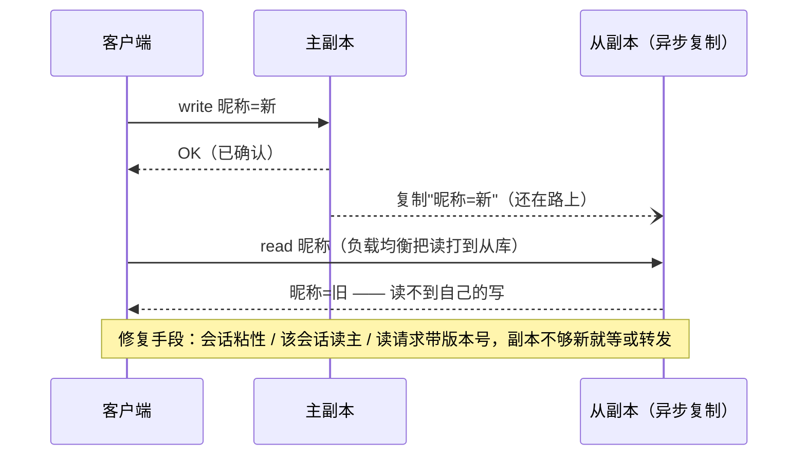

---
tags:
  - 高性能存储
status: 已完成
---

# 一致性模型

> 单机世界里"写完就能读到"天经地义——因为只有一份数据。一旦为了容灾和扩展把数据复制成多份，"读能看到什么"就突然有了很多种可能：可能读到旧值、可能先看到答案后看到问题、甚至可能读不到自己刚写的东西。一致性模型就是系统跟客户端签的契约：**哪些读法保证不会出现，哪些读法你要自己扛**。本篇从四级模型谱系讲到客户端可观察异常，再借 C++ 内存模型给多线程工程师搭一座直觉桥，最后算账：每排除一种异常，都要在延迟或可用性上付钱。

前置：无，本章分布式语义的起点。建议先看 [[7.1 副本 vs EC]] 了解"为什么要多副本"。

---

## 1. 背景：问题从复制那一刻开始

先把因果链摆直。多副本的动机（[[7.1 副本 vs EC]]）：机器会坏（容灾）、用户分布在各地（就近读）、单机读吞吐有上限（扩展）。但复制需要时间——副本之间隔着网络，同机房 RTT 约 0.1 ms、跨地域几十 ms【量级】，写操作不可能同时到达所有副本。于是**任意时刻，副本之间都可能存在内容差异的窗口**；两次读打到不同副本，就等于看到了两个不同历史时刻的世界。

**一致性模型（consistency model）**的定义：系统与客户端之间关于"操作看起来按什么顺序发生、读能返回什么值"的契约。注意两点：

- 它描述的是**客户端可观察行为**，不是内部实现。同一个模型可以用完全不同的协议实现（主从、quorum、共识）。
- 它是**语义坐标系**：读任何产品文档前先问"它承诺哪一档"，否则"高可用强一致"这类宣传语没有可核对的含义。

**术语消歧**【事实】：这里的"一致性"与 ACID 的 C 无关。ACID-C 指事务不破坏完整性约束（转账后余额不为负）；分布式一致性模型说的是多副本对外表现得多像一份数据；CAP 里的 C 特指线性一致。三个 "C" 是三件事，混用是从面试到设计评审最常见的事故源。

---

## 2. 模型谱系：四级阶梯

![[图片/SVG/8_7_9_1.svg|900]]

**线性一致（Linearizability）——"像只有一份数据"**。每个操作看起来在"调用到返回之间"的某个瞬间原子生效，全体客户端共享同一份**含实时序**的历史。可操作的判定口径：写操作在 10:00:00.100 返回成功，任何在这之后**才开始**的读，无论打到哪个副本，都必须看到这个写。

**顺序一致（Sequential Consistency）——"全体口径一致，但不管墙上时钟"**。存在一个所有人认可的操作全序，且每个客户端自己的操作在全序里保持程序序；但**不承诺实时性**——写返回之后，别人可以暂时看不到，只要不出现"甲看到先 A 后 B、乙看到先 B 后 A"的分歧。分布式产品很少单独提供这一档【事实】：实现代价与线性一致相差不大，它更多是理论坐标（和多核 CPU 的教科书模型）。

**因果一致（Causal Consistency）——"有因果的按序，没因果的随意"**。只约束有因果链的操作：我读到了你的写，我的后续写就"因果在后"，全体必须按因果序观察；相互并发（谁也没看见谁）的写，不同客户端可以看到不同顺序。

**最终一致（Eventual Consistency）——"只承诺收敛，不承诺过程"**。唯一承诺：停止写入后，所有副本终将收敛到同一值。**没有时间上界**【事实】，收敛期间旧值、回退、读不到己写都属"合法行为"。严格说它甚至不是"弱一点的顺序保证"，而是只有收敛承诺、没有顺序承诺。

**工程中间档：会话保证（session guarantees）**【事实，Terry et al. 1994】。四条针对**单个会话**的承诺：读己写（RYW）、单调读（MR）、单调写（MW）、写随读（WFR）。它们合起来近似"会话级因果一致"。负载均衡后面挂一排读副本时，所谓"会话粘性"买的就是这四条——不动全局语义，只保住单个用户的体验连贯。

---

## 3. 客户端可观察异常：判断模型的试金石

背定义不如问一句："**这个执行历史，该模型允不允许？**"四种典型异常，也是 SVG 中矩阵的行：

| 异常 | 一句话例子 |
| --- | --- |
| 读到旧值（stale read） | 改完昵称刷新页面，还是旧昵称 |
| 读回退（非单调读） | 刷新看到新昵称，再刷新又变回旧的——时间倒流 |
| 读不到自己的写 | 发完评论跳转回列表，自己的评论不在 |
| 因果倒置 | 问答页上看得到"答案"，看不到它回复的"问题" |

最常见的一种（读不到自己的写）值得完整走一遍时序：



注意这个异常**只在客户端视角存在**：主副本和从副本各自都工作正常，服务端日志里没有任何错误。这决定了第 7 节的一个结论——检测一致性异常的埋点必须放在客户端。

---

## 4. C++ 工程师的直觉桥：内存模型就是单机一致性模型

多核 CPU 本身就是一个"分布式系统"：每个核有自己的 store buffer 和缓存层级（≈ 副本），写入向其他核传播需要时间（≈ 复制延迟）。`std::memory_order` 就是在给这台"集群"选一致性模型：

| C++ 内存序 | 对应模型 | 共同点 |
| --- | --- | --- |
| `seq_cst` | 线性 / 顺序一致 | 全体线程认可同一份操作全序 |
| `acquire / release` | 因果一致 | happens-before 只沿依赖链传递，无关操作可乱序 |
| `relaxed` | 最终一致 | 只保证单个变量自身的修改序（≈"按键收敛"），跨变量不承诺 |

单机版的"因果倒置"现场（可编译运行）：

```cpp
#include <atomic>
#include <print>
#include <thread>

std::atomic<int> data{0}, flag{0};

int main() {
    int anomalies = 0;
    for (int i = 0; i < 200'000; ++i) {
        data.store(0, std::memory_order_relaxed);
        flag.store(0, std::memory_order_relaxed);
        {
            std::jthread w{[] {                              // "主副本"：先写数据，再发布标志
                data.store(42, std::memory_order_relaxed);
                flag.store(1, std::memory_order_relaxed);    // 改成 release = 升级到"因果一致"
            }};
            std::jthread r{[&] {                             // "读客户端"
                if (flag.load(std::memory_order_relaxed) == 1 &&
                    data.load(std::memory_order_relaxed) == 0) {
                    ++anomalies;                             // 看见了"果"（flag），没看见"因"（data）
                }
            }};
        }                                                    // jthread 析构自动 join（RAII）
    }
    std::println("因果倒置出现 {} 次 / 200000 轮", anomalies);
}
```

```bash
g++ -std=c++23 -O2 -o mm_demo mm_demo.cpp && ./mm_demo
```

结果怎么读【前提/事实】：在 Apple Silicon 等 ARM 平台上以 `-O2` 编译，大概率能观测到非零的异常计数（ARM 允许 store-store / load-load 乱序）；x86 是 TSO 模型，硬件层面难复现，但编译器对 relaxed 的重排仍可能造出来。**"在我机器上没复现"不等于"不会发生"——这句话对分布式一致性 bug 一字不改地成立**。把写侧改成 `release`、读侧改成 `acquire`，异常归零：这就是"付屏障开销，买因果一致"。分布式里同一笔交易叫"付 RTT（走主副本 / 带因果元数据），买读己写"。

类比的失效边界也要说清：分布式比多核多出**节点会宕机、网络会分区、消息会丢**这一整个维度。内存模型没有"某个核永远失联"这道题，所以 CAP 在单机没有对应物。C++ 侧的系统性展开见 [[17.2 原子性、可见性与内存序]]。

---

## 5. 代价：CAP 与 PACELC

**CAP 的精确表述**【事实】：网络分区（P）发生时，线性一致（C）与可用性（A，每个非故障节点都能在有限时间内应答）不可兼得。两个流传最广的误读：

1. **"三选二"是错的**——P 不是可选项。网络一定会分区（交换机重启、光缆被挖断），真正的选择只有一个：**分区发生的那一刻，牺牲 C 还是牺牲 A**。
2. **CAP 不覆盖平时**——无分区时 C 和 A 可以同时满足，此时真正的交换发生在延迟上。

后者由 **PACELC** 补全【事实，Abadi 2012】：分区（P）时选 A 或 C；否则（Else）选延迟（L）或一致（C）。为什么线性一致必然吃延迟？机制上，线性读必须**证明自己读的是最新**：要么读主副本（可能跨地域一个 RTT）、要么凑读法定人数（[[7.10 Quorum 读写]]）、要么靠租约保证主的身份（[[7.12 Lease 与 Fencing]]）——任何一种都把协调塞进了读路径。最终一致读则可以打到任意就近副本，本地延迟。跨地域场景下两者差距最大：本地副本读毫秒以内 vs 跨域协调几十毫秒【量级】。

**常见系统的选择**【事实；云服务语义会演进，以当前官方文档为准】：

| 系统 | 默认读语义 | 可调项 |
| --- | --- | --- |
| etcd | 线性一致读（ReadIndex） | 可降级为 serializable 本地读换延迟 |
| ZooKeeper | 读可能旧（follower 本地读） | 先 `sync()` 再读可近似线性 |
| S3 | 强读写一致（2020-12 起；此前是最终一致） | 无 |
| DynamoDB | 最终一致读 | 强一致读：额外延迟 + 双倍 RCU 计费 |
| Cassandra / Scylla | 按请求可调（CL=ONE/QUORUM…） | 真线性需 LWT（内部 Paxos），见 [[7.10 Quorum 读写]] |
| Ceph RADOS | PG 内主副本定序，强一致 | 见 [[7.5 Ceph RADOS 与 CRUSH]] |
| 3FS | CRAQ 链式复制，强一致读可扩展 | 见 [[7.4 3FS 架构]] |

S3 那一行单独记一笔：同一个产品的一致性档位是会升级的——**语义是版本化的事实，不是恒久属性**。

---

## 6. 实验设计：亲手观测 staleness

**实验 A（单机，立即可跑）**：第 4 节的 C++ demo。指标是"异常率 = 异常轮数 / 总轮数"。对照变量：内存序（relaxed vs release/acquire）、优化等级（-O0 vs -O2）、平台（x86 vs ARM）。预期：release/acquire 下任何平台任何优化等级都是 0——这就是"模型承诺"和"实现巧合"的区别。

**实验 B（双进程复制对，设计题）**：primary / replica 两个进程用 TCP 相连，primary 应用写入后异步推流给 replica。客户端 `write(primary)` 后立刻 `read(replica)`，记录是否读到旧值及**旧值持续时长**。用延迟注入拉大窗口观察规律（Linux：`sudo tc qdisc add dev lo root netem delay 50ms`；macOS 没有 tc，用 Linux 虚拟机或容器做）。要点：指标应是 **staleness 窗口的分布**（p50/p99 各多久），而不是"有没有旧值"——后者答案永远是"有"。

**实验 C（现成系统，Redis 主从）**：

```bash
redis-server --port 6379 --daemonize yes
redis-server --port 6380 --replicaof 127.0.0.1 6379 --daemonize yes
redis-cli -p 6379 set k v1 && redis-cli -p 6380 get k   # 多数时候已经是 v1
```

十有八九你会立刻读到新值——**这恰恰是最终一致最阴险的地方**【取舍】：异步复制"通常很快"，演示环境里它几乎总是对的，于是异常处理代码从来没被真正执行过，直到生产环境里复制积压、failover 那一天。验证一致性不能靠"跑几次没问题"，工业做法是把完整执行历史交给检查器判定（Jepsen 的 elle），让工具枚举所有合法全序。

---

## 7. 故障定位：一致性异常的排查路径

现象 → 疑点（按概率排序）：

- **failover 后用户看到"订单消失又出现"**：读打到落后副本且无会话粘性 → 查负载均衡粘性配置、副本 lag 指标。
- **刷新页面数据回退（单调读违例）**：多次读散到不同副本 → 会话粘性，或读请求携带版本号（副本不够新就等待/转主）。
- **"强一致系统"读到旧值**：租约时钟漂移（[[7.12 Lease 与 Fencing]]），或读走了降级通道（etcd 的 serializable 读、ZooKeeper 的 follower 读）——先查客户端用的是哪条读路径，再怀疑系统。
- **staleness 窗口整体变大**：复制积压 → 查 replication lag、网络带宽、副本盘压力（[[7.19 副本落后与日志截断]]）。

指标口径的两个坑：**replication lag 有字节和时间两种口径**（落后 10 MB vs 落后 3 s），报警阈值要写明用哪个；**lag = 0 不等于线性一致**——它只说明"此刻恰好追平"，下一毫秒的写照样有窗口，把 lag 监控当一致性证明是常见误读。而 stale read 率这个指标**服务端根本测不出来**（每个副本都认为自己在正确服务），必须客户端埋点：写时记版本，读时比对。

---

## 8. 一分钟表达模板

评审或面试里被问"讲讲一致性"，可以按这个骨架：

> 一致性模型是系统对客户端可观察行为的契约。从强到弱四档：线性一致（含实时序的单副本假象）、顺序一致（全序但无实时性）、因果一致（只保因果链）、最终一致（只保收敛）。强弱的本质是排除多少种异常：旧值、读回退、读不到己写、因果倒置。代价两条轴：分区时 C 与 A 二选一（CAP），平时延迟与一致互换（PACELC）。工程常用中间档是会话保证。选型先问业务能容忍哪些异常，再问付得起多少 RTT。

---

## 9. 陷阱与误区

> [!warning] 常见错误
> 1. **三个 C 混为一谈**：ACID 的 C（完整性约束）、CAP 的 C（线性一致）、一致性模型的 C，是三件事。
> 2. **把"最终一致"理解成"稍等一下就好"**：模型没有时间上界，"最终"可以是毫秒也可以是小时——收敛速度是工程属性，不是承诺。
> 3. **用演示环境验证一致性**："通常读得到" ≠ "保证读得到"；异步复制在无压力环境几乎总是对的。
> 4. **线性一致 = 可串行化**：前者管单对象单操作的实时性，后者管多操作事务的隔离级别；两者都要叫严格可串行化（strict serializability）。
> 5. **lag = 0 当强一致证明**：追平是瞬时状态，不是语义保证。
> 6. **只在服务端找异常**：stale read 是客户端可观察行为，服务端每个副本都"工作正常"——埋点必须在客户端。

---

## 10. 关键结论

| 结论 | 性质 |
| --- | --- |
| 一致性模型 = 关于客户端可观察行为的契约，与内部实现解耦 | 事实 |
| 四级谱系：线性（实时全序）→ 顺序（全序）→ 因果（因果序）→ 最终（仅收敛）；强弱即排除异常的多少 | 事实 |
| 会话保证（RYW/MR/MW/WFR）是工程最常用的中间档，绑定单会话而非全局 | 事实 / 取舍 |
| C++ 内存序是单机一致性模型：seq_cst↔线性、acq/rel↔因果、relaxed↔最终；但分布式多了故障与分区维度 | 类比 |
| CAP：仅分区时 C/A 二选一；PACELC：平时是延迟与一致的交换 | 事实 |
| 线性读必须证明"读的是最新"——协调（读主/quorum/租约）必然进读路径，这是延迟代价的机制根源 | 事实 |
| "最终一致"无时间上界；收敛快慢是工程属性 | 事实 / 前提 |
| stale read 只能在客户端观测；lag=0 不是一致性证明 | 事实 |

---

## 关联知识

- [[7.10 Quorum 读写]] - 第一个能落地的一致性机制：交叠读的数学
- [[7.11 Primary-Backup 与 Multi-Raft]] - 用共识协议实现线性一致的主流路径
- [[7.12 Lease 与 Fencing]] - 线性读的另一条实现路：租约与它的时钟前提
- [[7.19 副本落后与日志截断]] - staleness 窗口变大的服务端根源
- [[7.1 副本 vs EC]] - 多副本存在的理由，一致性问题的起点
- [[17.2 原子性、可见性与内存序]] - 单机版一致性模型的 C++ 细节

## 参考

- Herlihy & Wing, "Linearizability: A Correctness Condition for Concurrent Objects" (1990)
- Terry et al., "Session Guarantees for Weakly Consistent Replicated Data" (1994)
- Abadi, "Consistency Tradeoffs in Modern Distributed Database System Design" (PACELC, 2012)
- 《Designing Data-Intensive Applications》第 5、9 章
- jepsen.io 的 Consistency Models 谱系图与各系统分析报告
- AWS 公告: Amazon S3 Strong Read-After-Write Consistency (2020-12)
