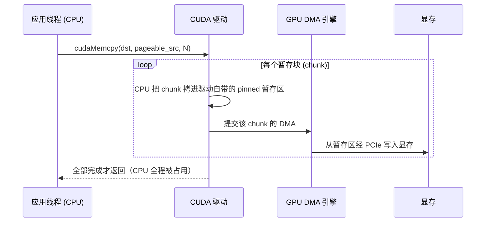

---
tags:
  - 高性能存储/AI-GPU-数据路径
status: 已完成
---

# Host Memory、Device Memory 与 Pinned Memory

> [[8.1 GPU 内存层次与数据搬运]] 用一张带宽表和一笔拷贝账建立了第 8 章的坐标系，其中埋了一个没有展开的机制问题：**为什么 `malloc` 出来的内存 GPU 的 DMA 引擎「不能直接读」，而 `cudaMallocHost` 出来的就可以？** 本篇把这个问题讲到操作系统层面——它不是 CUDA 的怪癖，而是虚拟内存（[[0.2 虚拟内存 Page Table 与 TLB]]）与 DMA（[[0.3 DMA IOMMU 与 Pinned Memory]]）这两套机制天生互相看不见的必然结果。理解了它，pinned memory 的一切行为（为什么快、为什么贵、为什么不能滥用、为什么和 RDMA 的内存注册是同一件事）都是推论而不是记忆。这也是后面 [[8.11 cudaMemcpy 与 CUDA Stream]] 的地基：异步与重叠的全部前提，都埋在「内存是哪种」这一个选择里。

前置：[[8.1 GPU 内存层次与数据搬运]]（带宽表与拷贝账）、[[0.2 虚拟内存 Page Table 与 TLB]]（页表与换页）、[[0.3 DMA IOMMU 与 Pinned Memory]]（DMA 的物理地址世界）。

---

## 1. 名词与背景：两块内存、两套页表、一条总线

先把三个名词说成人话【事实】：

- **Host memory（主机内存）**：CPU 插槽旁边的 DRAM，就是你写 C++ 时 `new`/`malloc`/`std::vector` 拿到的内存。由操作系统的虚拟内存机制管理；
- **Device memory（设备内存/显存）**：焊在 GPU 板卡上的 HBM，用 `cudaMalloc` 分配。GPU 的计算单元（SM）直接访问它，带宽是主机内存的十倍以上（[[8.1 GPU 内存层次与数据搬运]] §1 的表）；
- **两者是两个独立的地址空间**：`cudaMalloc` 返回的指针在 CPU 上解引用会直接段错误，反之 GPU kernel 也不能随手访问主机指针。两块内存之间唯一的通道是 PCIe 总线上的 **DMA 拷贝**——这就是 H2D（host-to-device）/D2H（device-to-host）传输。

最小例子把边界画清楚：

```cpp
std::vector<float> host(1'000'000);        // host memory：CPU 可用，GPU 不可见
float* dev = nullptr;
cudaMalloc(&dev, host.size() * sizeof(float));   // device memory：GPU 可用，CPU 不可解引用
cudaMemcpy(dev, host.data(), host.size() * sizeof(float),
           cudaMemcpyHostToDevice);        // 唯一的桥：过 PCIe 的一次搬运
```

顺带交代第三个名词【事实/取舍】：**Unified/Managed memory**（`cudaMallocManaged`）让 CPU 和 GPU 共用同一个指针，访问时靠**缺页中断按需迁移页**——写起来舒服，但每次迁移是隐藏的 PCIe 往返，访问模式稍差就抖动到不可预测。数据路径工程里它适合原型和稀疏访问的场景，**吞吐型的喂卡路径要用显式拷贝**，本篇与下一篇都只讨论显式路径。

---

## 2. 为什么 DMA 不认识你的 malloc：pageable 的原罪

问题的根源是两套机制各自的世界观【事实】：

- **虚拟内存的世界**：`malloc` 给你的是**虚拟地址**。OS 保留随时动这块内存的权利——物理页可以被换出到 swap、被内存压缩、被透明大页合并、被 NUMA 平衡迁移。你的指针值不变，但**背后的物理页随时可能搬家**（[[0.2 虚拟内存 Page Table 与 TLB]]）；
- **DMA 的世界**：GPU 上的 DMA 引擎是一个独立于 CPU 的硬件，它拿着**物理地址**（或 IOMMU 映射后的总线地址）直接读写内存条，**不查 CPU 的页表、不触发缺页**（[[0.3 DMA IOMMU 与 Pinned Memory]]）。

两个世界叠起来就是冲突：DMA 引擎按物理地址 X 搬数据搬到一半，OS 把那个页换出去、把 X 分配给别的进程——DMA 继续写 X 就是数据损坏。所以规则是【事实】：**DMA 的目标内存，物理页必须钉死（pin / page-lock）——不可换出、不可迁移，且物理地址已登记给设备**。

普通 `malloc` 内存（术语叫 **pageable**，「可换页的」）不满足这个条件，于是 CUDA 驱动只能垫一层：



两条路径的等待点与拷贝对账【事实】：

| 路径 | 数据拷贝 | CPU 参与 | 等待点 |
| --- | --- | --- | --- |
| **pageable H2D** | ① CPU：用户缓冲 → 驱动 pinned 暂存区；② DMA：暂存区 → 显存 | 全程搬字节 | CPU 拷贝与 DMA 交替进行，实测带宽常只有直连一半上下；`cudaMemcpyAsync` 在这条路上**退化为同步**（[[8.11 cudaMemcpy 与 CUDA Stream]]） |
| **pinned H2D** | ① DMA：用户缓冲 → 显存 | 零（只发起） | 只有 PCIe 传输本身，拉满链路带宽（Gen4 x16 实测 ~25–28 GB/s，[[8.1 GPU 内存层次与数据搬运]] §5） |

一句话总结：**pinned 不是「更快的内存」，而是「免掉一次 CPU 中转拷贝、并让真异步成为可能的内存」**——内存条还是同一批内存条，省掉的是路径上的一跳。

---

## 3. 分配与注册 API：一张表选对工具

| API | 得到什么 | 典型用途 | 代价/注意 |
| --- | --- | --- | --- |
| `malloc` / `new` / `std::vector` | pageable 主机内存 | 一切不参与 GPU 传输的数据 | 参与 H2D/D2H 会走暂存路径（§2） |
| `cudaMallocHost(&p, n)` | pinned 主机内存 | 传输缓冲区的标准选择 | 分配即 pin：毫秒级、不可换出 |
| `cudaHostAlloc(&p, n, flags)` | 带选项的 pinned | `cudaHostAllocMapped`：GPU 可直接访问的零拷贝主机内存；`cudaHostAllocWriteCombined`：写合并 | WC 内存 **CPU 读极慢**（绕过缓存），只适合「CPU 只写、GPU 只读」的单向缓冲 |
| `cudaHostRegister(p, n, flags)` | 把**现成的** pageable 内存原地 pin 住 | 第三方库给的缓冲、想避免改分配方式的既有代码 | 效果同 pinned；注册本身毫秒级，用完 `cudaHostUnregister` |
| `cudaMalloc(&p, n)` | 显存 | GPU 侧的一切工作数据 | CPU 不可解引用 |
| `cudaMallocManaged(&p, n)` | 统一寻址、按需迁移 | 原型、稀疏访问 | 缺页迁移的隐藏 PCIe 往返（§1）【取舍】 |

两个系统级细节【实现】：

- pin 页在 Linux 上受 `ulimit -l`（memlock）限制，普通用户默认值很小；CUDA 驱动通常自带提权路径，但容器里跑训练任务时 memlock 限额是 pinned 分配失败的常见原因——`docker run --ulimit memlock=-1` 是 GPU 容器的常规操作；
- pinned 与 RDMA 的内存注册（MR）是**同一个内核机制的两个客户**（都走 pin 页 + 把物理页列表交给设备，[[4.4 内存注册与零拷贝]]）。同一块缓冲要同时喂网卡和 GPU 时（GPUDirect RDMA 场景，[[8.12 GPUDirect RDMA]]），两边各自注册一次即可，机制不冲突。

---

## 4. pinned 的代价与军规：pin 传输缓冲，不 pin 数据集

pinned 的好处在 §2 已经数清，代价也要摆到台面上【取舍】：

1. **分配/注册慢**：pin 是逐页操作（改页表属性 + 锁定 + 登记），毫秒级——比 `malloc` 慢几个数量级。放进数据路径的热循环里，省下的拷贝时间会被注册时间加倍吃回去；
2. **挤压整机内存弹性**：pinned 页不可换出，OS 内存回收对它无能为力。pin 得太多，剩余 pageable 内存承受全部换页压力，先出问题的往往是同机的 DataLoader worker 和文件缓存（[[8.7 DataLoader 与 GPU 空闲归因]] 的一类根因）；
3. **泄漏更疼**：泄漏的堆内存还能被换出去装死，泄漏的 pinned 内存是物理内存的永久性占用。

由此得到的军规与 [[4.4 内存注册与零拷贝]] 的 MR 池一字不差【实践】：

- **预分配 + 池化复用**：启动时分配一组固定大小的 pinned 缓冲（例如 8 × 64 MiB 的环），运行期只借还、不分配；
- **pin 中转站，不 pin 数据集**：数据集留在 pageable/页缓存里，由流水线分块搬进 pinned 环再上 GPU——[[8.3 Bounce Buffer vs 直读]] §4 的双缓冲代码就是这个军规的完整实现；
- pinned 总量的合理量级是「传输在途量的 2~3 倍」（够双/三缓冲即可），**不是**越多越好。

---

## 5. 对照实验：同一块内存，注册前后各测一次

把 §2 的两条路径变成可复现的数字。与 [[8.1 GPU 内存层次与数据搬运]] §6 的实验互补：那边对比的是「两块不同的内存」，这里用 `cudaHostRegister` 对**同一块内存**做 pin 前/后对照——把变量控制到只剩「是否 pinned」，顺带量出注册本身的价格。

```cpp
#include <cuda_runtime.h>

#include <chrono>
#include <cstddef>
#include <memory>
#include <print>
#include <stdexcept>
#include <string>
#include <vector>

static void ck(cudaError_t e, const char* what) {
    if (e != cudaSuccess)
        throw std::runtime_error(std::string{what} + ": " + cudaGetErrorString(e));
}

// RAII：把一块现成内存原地 pin 住，作用域结束自动解除
class HostPin {
public:
    HostPin(void* p, std::size_t n) : p_{p} {
        ck(cudaHostRegister(p, n, cudaHostRegisterDefault), "cudaHostRegister");
    }
    ~HostPin() { cudaHostUnregister(p_); }
    HostPin(const HostPin&) = delete;
    HostPin& operator=(const HostPin&) = delete;
private:
    void* p_;
};

struct DevDeleter { void operator()(void* p) const { cudaFree(p); } };
using DevBuffer = std::unique_ptr<void, DevDeleter>;

double h2d_gbps(const void* src, void* dst, std::size_t n) {
    ck(cudaMemcpy(dst, src, n, cudaMemcpyHostToDevice), "H2D");   // 预热后计时
    const auto t0 = std::chrono::steady_clock::now();
    ck(cudaMemcpy(dst, src, n, cudaMemcpyHostToDevice), "H2D");
    const std::chrono::duration<double> dt = std::chrono::steady_clock::now() - t0;
    return static_cast<double>(n) / dt.count() / 1e9;
}

int main() {
    constexpr std::size_t N = 1ull << 30;                 // 1 GiB
    std::vector<std::byte> buf(N);                        // 普通 pageable 内存
    void* raw = nullptr;
    ck(cudaMalloc(&raw, N), "cudaMalloc");
    DevBuffer dev{raw};

    std::println("pageable H2D: {:.1f} GB/s", h2d_gbps(buf.data(), dev.get(), N));

    const auto t0 = std::chrono::steady_clock::now();
    HostPin pin{buf.data(), N};                           // 原地 pin 同一块内存
    const std::chrono::duration<double, std::milli> reg =
        std::chrono::steady_clock::now() - t0;
    std::println("cudaHostRegister(1 GiB): {:.0f} ms", reg.count());

    std::println("pinned   H2D: {:.1f} GB/s", h2d_gbps(buf.data(), dev.get(), N));
    // 预期（Gen4 x16 量级）：pageable ~10 GB/s 上下；注册几百 ms；pinned ~25-28 GB/s
}
```

**关键点**：

- 前后两次测的是**同一个指针、同一批物理页**，唯一变量是注册状态——带宽差就是 §2 那次 CPU 暂存拷贝的价格，干净利落；
- 注册 1 GiB 要上百毫秒【量级】，直观解释了 §4 军规一：这笔钱只能在启动时付一次，不能摊进每个 batch；
- `HostPin` 是标准 RAII：异常路径上照样解除注册；`DevBuffer` 用 `unique_ptr` + 自定义删除器管显存——CUDA 的 C 风格 API 与 Modern C++ 资源管理并不冲突。

---

## 6. 陷阱与误区

> [!warning] 常见错误
> 1. **数据路径热循环里现场分配 pinned**：`cudaMallocHost`/`cudaHostRegister` 是毫秒级操作，放进每 batch 执行一次的位置，注册开销直接盖过省下的拷贝——池化是纪律不是优化（§4）。
> 2. **把整个数据集 pin 住**：pinned 挤掉的是整机的内存弹性，页缓存和 DataLoader 先遭殃；pin 的对象永远是传输中转缓冲。
> 3. **WriteCombined 内存当通用缓冲用**：WC 绕过 CPU 缓存，GPU 读它快、CPU 读它慢几十倍——只用于「CPU 顺序写、GPU 读」的单向场景，且用之前先测。
> 4. **容器里 pinned 分配莫名失败**：先查 memlock ulimit（§3），再怀疑碎片；报错 `cudaErrorMemoryAllocation` 不一定是内存不够。
> 5. **拿 managed memory 跑吞吐型喂卡**：缺页迁移的隐藏往返让带宽和延迟都不可预测——显式 pinned + 异步拷贝才是喂卡路径的正解（§1）。
> 6. **以为 pinned 是「更快的内存」**：pinned 改变的是路径（少一跳 CPU 拷贝、允许真异步），不是介质速度；D2H/H2D 的硬上限仍然是 PCIe（[[8.1 GPU 内存层次与数据搬运]] §1）。

---

## 7. 关键结论

| 结论 | 性质 |
| --- | --- |
| Host 与 Device 是两个独立地址空间，唯一通道是 PCIe 上的 DMA 拷贝 | 事实 |
| DMA 只认物理地址、不走缺页；pageable 页随时可能搬家——所以 DMA 目标必须 pin | 事实 |
| pageable 拷贝 = CPU 先搬进驱动 pinned 暂存再 DMA：多一次拷贝、吃核、假异步；pinned = 一次 DMA 拉满 | 事实 |
| pinned 不是更快的内存，是省掉一跳中转、解锁真异步的内存 | 事实 |
| pin 毫秒级且不可换出：预分配 + 池化，pin 传输缓冲而非数据集；容器注意 memlock | 实践 |
| cudaHostRegister 可对同一块内存做 pin 前后对照实验——变量最干净的验证方式 | 实践 |
| pinned 与 RDMA MR 是同一内核机制的两个客户；managed memory 属原型工具，不上吞吐路径 | 事实/取舍 |

---

## 关联知识

- [[8.1 GPU 内存层次与数据搬运]] - 带宽表、拷贝账与 pageable/pinned 的首次登场
- [[0.2 虚拟内存 Page Table 与 TLB]] - 「物理页会搬家」的机制来源
- [[0.3 DMA IOMMU 与 Pinned Memory]] - DMA 的物理地址世界观
- [[4.4 内存注册与零拷贝]] - 同一机制在 RDMA 侧的形态与池化军规
- [[8.11 cudaMemcpy 与 CUDA Stream]] - pinned 解锁的异步与重叠，下一篇展开
- [[8.3 Bounce Buffer vs 直读]] - pinned 环 + 双缓冲的完整工程实现
- [[8.12 GPUDirect RDMA]] - 同一块缓冲同时登记给网卡与 GPU 的场景
