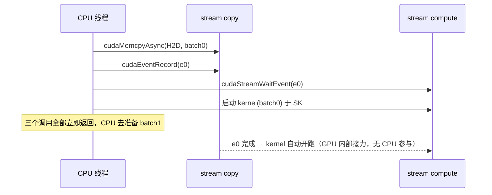

---
tags:
  - 高性能存储
status: 已完成
---

# cudaMemcpy、cudaMemcpyAsync 与 CUDA Stream

> [[8.10 Host Device Memory 与 Pinned Memory]] 解决了「数据放在哪种内存」，本篇解决「拷贝怎么编排」。核心的心智模型一句话：**GPU 是一台异步外设，和 NVMe、RDMA 网卡是同一族**——CPU 把命令投进提交队列、硬件在旁边自己干活、完成后打标记，这套「提交/完成」模型你在 NVMe 的 SQ/CQ 和 RDMA 的 QP/CQ 里已经见过两遍了。CUDA 里这个提交队列叫 **stream**，完成标记叫 **event**。看懂了这层同构，`cudaMemcpy` 和 `cudaMemcpyAsync` 的区别、重叠为什么可能、以及「写了 Async 却没重叠」的一整族坑，都变成同一个问题：**你到底在哪里等，硬件到底在哪里排队**。

前置：[[8.10 Host Device Memory 与 Pinned Memory]]（pinned 是真异步的入场券）、[[8.1 GPU 内存层次与数据搬运]]（PCIe 带宽账与拷贝路径）。

---

## 1. 名词与背景：stream 是一条 FIFO 命令队列

先给直白定义【事实】：

- **Stream**：一条先进先出的 GPU 命令队列。往里投的东西（拷贝、kernel 启动）**按投入顺序执行**；不同 stream 之间**没有任何顺序约束**，硬件资源允许就并行。C++ 对照：stream 就是一个单线程 executor（strand）——同一 strand 内串行，跨 strand 并发；
- **异步调用**：`cudaMemcpyAsync`、kernel 启动 `<<<...>>>` 这类调用，干的事只是**把命令写进队列就返回**（微秒级），真正的执行在 GPU 上稍后发生。CPU 线程从「搬运工」变成「下单员」；
- **Event**：插在 stream 某个位置的标记。可以问它「到了没」（`cudaEventQuery`）、等它（`cudaEventSynchronize`），或者让**另一条 stream** 等它（`cudaStreamWaitEvent`）——最后这个是跨队列依赖的唯一正规表达，相当于队列世界里的条件变量；
- **默认 stream（stream 0）**：不指定 stream 时命令去的地方。legacy 语义下它很特殊：**和所有其他 stream 互相同步**——这是历史包袱，也是重叠失效的高频原因（§5）。

不写 stream 的代码其实也在用 stream——所有命令排进默认 stream 里串行执行。「用不用 stream」从来不是选择题，选择题是「用一条还是几条、在哪里等」。

---

## 2. cudaMemcpy 家族：同步语义一张表

| 调用 | CPU 行为 | 真实执行 | 前提 |
| --- | --- | --- | --- |
| `cudaMemcpy(dst, src, n, dir)` | **阻塞到拷贝完成**才返回 | pinned 源/目标：一次 DMA；pageable：驱动暂存分段拷（[[8.10 Host Device Memory 与 Pinned Memory]] §2） | 无 |
| `cudaMemcpyAsync(..., stream)` | **入队即返回**（µs 级） | 与上同两条路径 | **真异步需要 pinned + 非默认 stream**；pageable 时退化为同步执行【事实】 |

方向参数四种【事实】：`cudaMemcpyHostToDevice`（H2D，喂数据）、`DeviceToHost`（D2H，取结果/写 checkpoint）、`DeviceToDevice`（显存内搬运，走 HBM 不过 PCIe）、加上跨 GPU 的 P2P（`cudaMemcpyPeer`，走 NVLink 或 PCIe，拓扑见 [[8.1 GPU 内存层次与数据搬运]] §4）。

必须刻进脑子的一条【事实】：**`cudaMemcpyAsync` 的「Async」是承诺入队、不是承诺并行**。源是 pageable 内存时，驱动要用 CPU 做暂存拷贝，调用会同步执行到底——不报错、不警告，只是安静地退化。这是「写了 Async 却没重叠」排行第一的原因，也是 [[8.10 Host Device Memory 与 Pinned Memory]] 整篇铺垫的落点。

另一族隐蔽的同步点【实现】：`cudaMalloc`/`cudaFree`/`cudaHostRegister` 等资源操作可能同步整个设备；legacy 默认 stream 上的任何命令会和所有 stream 互相等。想保住流水线，热循环里不许出现这两类调用——缓冲区预分配（与 [[8.10 Host Device Memory 与 Pinned Memory]] §4 的池化军规同源）。

---

## 3. 一次 cudaMemcpyAsync 的全流转：等待点对账

以「pinned 缓冲、非默认 stream、H2D」为例，从调用到数据落显存【事实】：

| 步 | 发生什么 | 层级 | 等待点 | 拷贝 |
| --- | --- | --- | --- | --- |
| ① 入队 | CPU 把拷贝命令写进 stream 的命令缓冲，返回 | 用户态运行时/驱动 | 无（µs 级；命令缓冲满时罕见地阻塞） | 无 |
| ② 派发 | GPU 前端取命令，分给一个空闲的**拷贝引擎**（copy engine） | GPU 调度 | **引擎忙则排队**——同方向多个拷贝串行（§5 前提③） | 无 |
| ③ DMA 传输 | 拷贝引擎按物理页列表从 pinned 内存读、经 PCIe 写入 HBM | PCIe 总线 | 带宽主导：时长 ≈ n ÷ ~25 GB/s（Gen4 x16） | **唯一一次数据搬运**，CPU 零参与 |
| ④ 完成 | 引擎标记命令完成，stream 前进；后续命令（kernel）自动解锁 | GPU 调度 | 无 | 无 |
| ⑤ CPU 侧察觉 | 只在你显式等的地方：`cudaStreamSynchronize`/event | 用户态 | **你选的等待点**——设计得好，这里永远「已完成」 | 无 |

对照同步版 `cudaMemcpy`：①~④ 完全相同，区别只在 CPU 把 ⑤ 内联在了调用里死等。**异步化没有让拷贝变快一纳秒，它改变的是拷贝期间 CPU 和 GPU 的其他部件能不能干别的**——这正是拿它换重叠的本钱。

与存储路径的对位【事实】：① ≈ 填 NVMe SQE + 敲 doorbell，③ ≈ 盘的 DMA，⑤ ≈ 收 CQE。同一套「提交/执行/完成」三段式，第三次出现（NVMe、RDMA、CUDA）——异步外设的设计收敛到同一形状不是巧合，是「CPU 不该给硬件打下手」这一原则的必然结果。

---

## 4. 同步原语：在正确的位置等

四个常用原语，按「谁在等、等什么」记【事实】：

| 原语 | 谁在等 | 用途 |
| --- | --- | --- |
| `cudaStreamSynchronize(s)` | CPU 等 stream s 清空 | 批次收尾、取结果前 |
| `cudaEventRecord(e, s)` + `cudaEventSynchronize(e)` | CPU 等 stream s 到达标记点 | 比整条 stream 等待更细粒度 |
| `cudaStreamWaitEvent(s2, e)` | **GPU 的 s2 等 s1 的标记**，CPU 不停 | 跨 stream 依赖的正解（拷完才算、算完才传） |
| `cudaEventElapsedTime(&ms, e1, e2)` | —— | 用 GPU 时间戳测段耗时，不受 CPU 调度干扰 |

跨 stream 依赖的标准写法（拷贝流 → 计算流）：



**关键点**：`cudaStreamWaitEvent` 让依赖在 GPU 内部接力，CPU 下完单就走。新手最常见的等价错误写法是在中间插 `cudaStreamSynchronize`——语义对了，但 CPU 被钉在原地，流水线的「下单员」停工，下一批的命令没人投递，重叠随之消失【实践】。

---

## 5. 多 stream 重叠：流水线的时间账

![[图片/SVG/8_8_11_1.svg|900]]

把一个大 batch 切成 N 块、每块一条 stream 走「H2D → kernel → D2H」，三类硬件资源（H2D 拷贝引擎、SM、D2H 拷贝引擎）就能同时各干各的【事实】：

- 串行总时间 = N × (t_H2D + t_K + t_D2H)；
- 流水线总时间 ≈ N × max(t_H2D, t_K, t_D2H) + 灌满/排空的零头——**慢的那一段成为节拍，其余两段被藏进它的影子里**。

重叠成立的三个前提，缺一个就退回串行时间线【事实】：

1. **pinned 内存**——pageable 让 Async 退化为同步（§2），流水线第一环就断；
2. **避开隐式同步**——legacy 默认 stream、热循环里的 `cudaMalloc`/`cudaFree`、随手的 `cudaDeviceSynchronize`，任何一个都把三条泳道重新串成一条；
3. **硬件引擎按方向计数**——常见数据中心卡有独立的 H2D 与 D2H 引擎各一（外加若干），**同方向的拷贝再多 stream 也是排队**；多开 stream 增加的是「不同资源并行」的机会，不是「同一资源加速」【实现】。

收益上限一句话【取舍】：重叠只能藏掉 min(拷贝, 计算)，藏不掉 max。拷贝本身比计算长时，PCIe 就是硬瓶颈——正解是换路径（pinned 已是前提，再往上是 GDS 直读 [[8.2 GDS 与 cuFile]]、压缩、去掉 D2H），而不是继续加 stream。这笔账在训练现场的表现形式见 [[8.7 DataLoader 与 GPU 空闲归因]]；把它做成生产级 pinned 环 + 双缓冲的完整代码见 [[8.3 Bounce Buffer vs 直读]] §4。

---

## 6. Modern C++：RAII 包装 + 测出重叠

CUDA 的 stream/event 是裸句柄 + 配对销毁函数——RAII 的标准客户。下面用两条 stream 把「分块 H2D + 分块 D2H」首尾相接，对照单条 stream 串行版，测重叠的真实收益（H2D 与 D2H 用的是两个方向的引擎，天然可并行，不需要写 kernel 也能演示）：

```cpp
#include <cuda_runtime.h>

#include <array>
#include <chrono>
#include <cstddef>
#include <print>
#include <stdexcept>
#include <string>

static void ck(cudaError_t e, const char* what) {
    if (e != cudaSuccess)
        throw std::runtime_error(std::string{what} + ": " + cudaGetErrorString(e));
}

class Stream {                                   // RAII：cudaStreamCreate/Destroy 配对
public:
    Stream() { ck(cudaStreamCreate(&s_), "stream create"); }
    ~Stream() { cudaStreamDestroy(s_); }
    Stream(const Stream&) = delete;
    Stream& operator=(const Stream&) = delete;
    [[nodiscard]] cudaStream_t get() const { return s_; }
private:
    cudaStream_t s_ = nullptr;
};

class Pinned {                                   // RAII：pinned 主机缓冲（8.10）
public:
    explicit Pinned(std::size_t n) { ck(cudaMallocHost(&p_, n), "mallocHost"); }
    ~Pinned() { cudaFreeHost(p_); }
    Pinned(const Pinned&) = delete;
    Pinned& operator=(const Pinned&) = delete;
    [[nodiscard]] std::byte* data() const { return static_cast<std::byte*>(p_); }
private:
    void* p_ = nullptr;
};

int main() {
    constexpr std::size_t kChunk = 64ull << 20;  // 64 MiB/块
    constexpr int kChunks = 16;                  // 共 1 GiB
    Pinned in{kChunk * kChunks}, out{kChunk * kChunks};
    void* raw = nullptr;
    ck(cudaMalloc(&raw, kChunk), "cudaMalloc");  // 显存只留一块暂存，演示用

    auto run = [&](bool overlap) {
        Stream h2d, d2h;
        cudaStream_t sIn = h2d.get();
        cudaStream_t sOut = overlap ? d2h.get() : h2d.get();  // 串行版共用一条
        const auto t0 = std::chrono::steady_clock::now();
        for (int i = 0; i < kChunks; ++i) {
            auto* src = in.data() + i * kChunk;
            auto* dst = out.data() + i * kChunk;
            ck(cudaMemcpyAsync(raw, src, kChunk, cudaMemcpyHostToDevice, sIn), "H2D");
            ck(cudaMemcpyAsync(dst, raw, kChunk, cudaMemcpyDeviceToHost, sOut), "D2H");
        }
        ck(cudaStreamSynchronize(sIn), "sync in");
        ck(cudaStreamSynchronize(sOut), "sync out");   // 等待点只在最后
        const std::chrono::duration<double> dt = std::chrono::steady_clock::now() - t0;
        return dt.count();
    };

    std::println("单 stream 串行: {:.0f} ms", run(false) * 1e3);
    std::println("双 stream 重叠: {:.0f} ms", run(true) * 1e3);
    cudaFree(raw);
    // 预期：重叠版接近串行版的一半——H2D 与 D2H 两个引擎在并行
    // 注意：演示版为省显存复用同一块 raw，块间存在数据竞争，量带宽可以、别核对内容；
    // 生产版要为每个在途块配独立显存槽位 + event 依赖（8.3 §4 的环形缓冲即完整实现）
}
```

**关键点**：

- 两个版本代码只差一行（`sOut` 用哪条 stream）——把「重叠与否」这个变量隔离到最小，量出来的差值就是第二个拷贝引擎的价值；
- 等待点只有末尾的两次 `cudaStreamSynchronize`：循环体内 32 次调用全部即时返回，CPU 只是下单员（§3）；
- 尾注的竞争提示是刻意的教学点：**异步化之后，缓冲区的生命周期与内容有效期就是并发问题**——在途的 `cudaMemcpyAsync` 持有你的指针，释放或改写它等价于 use-after-free。RAII 保生命周期、event 保内容有效期，两者都齐了才是正确的异步代码【实践】。

---

## 7. 排障清单：重叠没发生时查什么

先上 `nsys profile` 看时间线——**三行（H2D/kernel/D2H）叠没叠起来一眼可见**；只看总耗时猜重叠，等于闭眼调优【实践】。

| 症状 | 先看什么 | 典型根因 | 处置方向 |
| --- | --- | --- | --- |
| 时间线三行完全串行 | 源缓冲是不是 pinned | pageable 退化同步（§2） | 换 `cudaMallocHost`/`cudaHostRegister` |
| 多条 stream 仍互相等 | 是否用了 legacy 默认 stream | stream 0 全局同步语义 | 全部显式建 stream；或编译期 `--default-stream per-thread` |
| 循环几轮后流水线断流 | 热循环里有无 cudaMalloc/Free | 资源操作隐式同步设备（§2） | 缓冲预分配 + 池化 |
| 两个 H2D 不并行 | 拷贝方向 | 同向共用一个引擎，只排队（§5 前提③） | 属预期；并行只在 H2D/D2H/kernel 三类之间找 |
| 重叠了但收益小 | 各段时长比例 | max 段占绝对主导，min 段本来就没多少可藏 | 缩短瓶颈段：加大块、GDS、压缩 |
| 结果偶发错乱 | 在途缓冲是否被提前复用/释放 | 异步生命周期 bug（§6 关键点三） | event 依赖管好「何时可复用」 |

---

## 8. 陷阱与误区

> [!warning] 常见错误
> 1. **把 Async 当加速开关**：异步不改变拷贝时长，只解放等待方；没有可重叠的对象（计算或反向拷贝）时，Async 版一纳秒都不会快。
> 2. **pageable + cudaMemcpyAsync**：静默退化为同步，无报错——第 8 章出现第三次，因为它在生产里真的排第一。
> 3. **用 CPU 计时器测异步段**：调用即返回，`steady_clock` 包住一个 Async 调用测出来的是入队时间（µs）不是拷贝时间——测段耗时用 `cudaEventElapsedTime`，测总时间先 synchronize 再停表（§6 的写法）。
> 4. **拿 cudaStreamSynchronize 表达跨 stream 依赖**：语义对、性能错——CPU 被钉住，下单停摆；正解是 `cudaStreamWaitEvent` 让 GPU 内部接力（§4）。
> 5. **stream 开得越多越好**：并行度上限由硬件资源类别数决定（每方向拷贝引擎 + SM）；stream 数超过在途工作的自然并行度后只增加调度开销和显存占用。
> 6. **异步在途时复用/释放缓冲**：`cudaMemcpyAsync` 返回不代表它用完了你的指针——这是 GPU 版 use-after-free，且往往只在负载高时偶发（§6）。

---

## 9. 关键结论

| 结论 | 性质 |
| --- | --- |
| GPU 是异步外设：stream = FIFO 提交队列，event = 完成标记——与 NVMe SQ/CQ、RDMA QP/CQ 同构 | 事实 |
| stream 内按序、stream 间无序；不指定 stream 也在用（默认 stream），且 legacy 默认 stream 全局同步 | 事实 |
| cudaMemcpyAsync 承诺入队不承诺并行：真异步 = pinned + 非默认 stream，pageable 时静默退化 | 事实 |
| 全流转五步里数据只动一次（DMA 过 PCIe）；异步化不加速拷贝，只解放 CPU 与其他引擎 | 事实 |
| 跨 stream 依赖用 cudaStreamWaitEvent 在 GPU 内接力；CPU 侧 synchronize 是流水线杀手 | 事实/实践 |
| 流水线总时间 ≈ max(段) × N：重叠藏得掉 min 藏不掉 max，拷贝为主时该换路径而非加 stream | 事实/取舍 |
| 拷贝引擎按方向计数：同向拷贝排队，加 stream 无效 | 事实 |
| 异步化把缓冲生命周期变成并发问题：RAII 保生命周期，event 保有效期；验证重叠只信 nsys 时间线 | 实践 |

---

## 关联知识

- [[8.10 Host Device Memory 与 Pinned Memory]] - 真异步的内存前提，本篇的上半篇
- [[8.1 GPU 内存层次与数据搬运]] - PCIe 带宽账：拷贝段时长的分母
- [[8.3 Bounce Buffer vs 直读]] - pinned 环 + 双缓冲：本篇流水线的生产级实现
- [[8.7 DataLoader 与 GPU 空闲归因]] - 重叠失效在训练现场的症状与归因
- [[8.2 GDS 与 cuFile]] - 拷贝段藏不掉时的下一刀：让数据不经过主机
