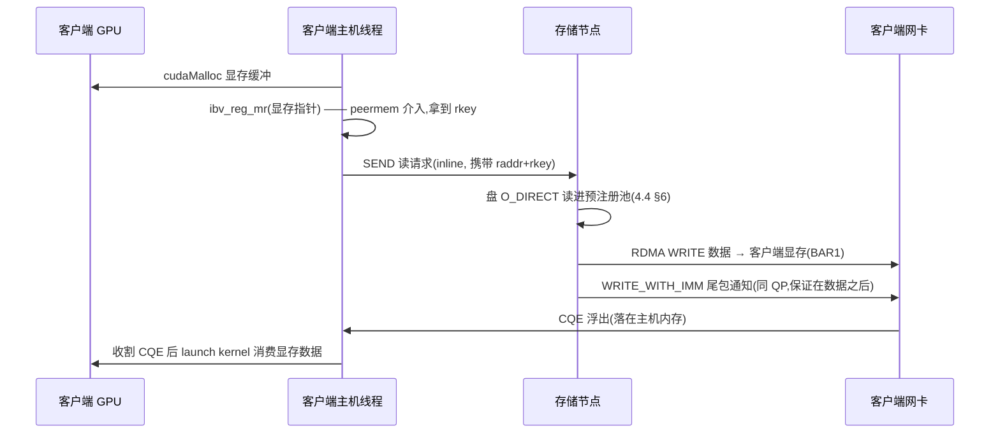

---
tags:
  - 高性能存储
status: 已完成
---

# GPUDirect RDMA

> [[4.4 内存注册与零拷贝]] §7 埋过一句伏笔：装了 `nvidia_peermem` 之后，`ibv_reg_mr` 可以直接吃 GPU 显存指针。本篇把这句话展开成完整机制——**GPUDirect RDMA（GDR）让网卡的 DMA 引擎直接以显存为目的地，网络数据不再经主机内存中转**。它是 GPUDirect 家族的网络侧成员：P2P 管 GPU↔GPU、Storage（GDS，[[8.2 GDS 与 cuFile]]）管盘↔显存、RDMA 管**网卡↔显存**——三者共用同一个物理前提（同 PCIe Switch 的 P2P DMA）与同一句口号：**让拥有 DMA 引擎的设备直达最终目的地，CPU 只发命令**。与 GDS 相比它有一个重要的性格差异【事实】：**GDS 条件不满足时静默回退，GDR 条件不满足时注册直接失败**——一个是测试陷阱，一个是部署门槛，排障思路完全不同（对照 [[8.13 GDS 兼容性与回退路径]]）。

前置：[[4.4 内存注册与零拷贝]]（MR 注册机制——本篇只是换了注册对象）、[[4.5 Send Recv 与 RDMA Read Write]]（单边 WRITE/READ——GDR 数据面的主角）、[[8.1 GPU 内存层次与数据搬运]]（拓扑字母表与带宽账）、[[3.8 PCIe 拓扑与 NUMA]]（P2P 的物理前提）。

---

## 1. 名词与背景：没有 GDR 时，网络数据到显存要弹一次

先把参与者用直白话说清：

- **RDMA**：网卡自己搬内存的技术——CPU 把「从哪搬到哪」写成委托单（WQE）交给网卡，之后数据传输全程不经过内核、不消耗 CPU 拷贝（[[4.1 RDMA 为什么快]]）；
- **显存（HBM）**：GPU 自己的内存，带宽数 TB/s，但物理上挂在 GPU 芯片上，与主机内存是两个世界，中间只有 PCIe 一条通道（[[8.1 GPU 内存层次与数据搬运]] §1）；
- **bounce（回弹）路径**：GDR 出现之前，「网络数据进显存」只能分两段走——网卡 DMA 写进主机内存的注册缓冲区，CPU 再发起一次 `cudaMemcpy` H2D 把数据搬过 PCIe 进显存。数据在主机内存「弹」了一下，故名。

回弹路径的账（与 [[8.1 GPU 内存层次与数据搬运]] §3 同一记法）【事实】：每字节过主机内存总线 2 次（网卡 DMA 写入 + GPU DMA 读出）、占用一块 pinned 中转池、且两段搬运之间需要 CPU 线程做衔接（收网络完成 → 提交 H2D → 等拷贝完成）。对 KV Cache 搬运、参数同步这类 GB 级流量，中转的主存带宽与调度延迟都是真实成本。

**GDR 的主张一句话**【事实】：把「网卡 DMA 的目的地」从主机内存换成显存——网卡照常工作，只是它写的总线地址背后是 GPU 的 HBM。数据一步到位，主机内存与 CPU 从数据路径上退场。

GPUDirect 家族对照表：

| 成员 | 数据两端 | 典型场景 |
| --- | --- | --- |
| GPUDirect P2P | GPU ↔ GPU（同机） | 多卡训练的 NVLink/PCIe 直传 |
| **GPUDirect RDMA** | **网卡 ↔ 显存** | NCCL 跨机通信、NVMe-oF 远端读直落显存、KV Cache 跨机搬运（[[8.5 LMCache 与 Mooncake]] 的 Transfer Engine） |
| GPUDirect Storage | 盘 ↔ 显存 | checkpoint/数据集直读（[[8.2 GDS 与 cuFile]]） |

---

## 2. 机制：一次注册，三个角色

GDR 没有新协议，是三个已有机制的组合【事实/实现】：

1. **BAR1 暴露显存**：GPU 把显存映射进 PCIe BAR1 窗口（设备向总线暴露的地址空间，[[8.2 GDS 与 cuFile]] §1 同款）——从此「写显存」对其他 PCIe 设备来说就是「写某个总线地址」；
2. **`nvidia_peermem` 内核模块做中介**：`ibv_reg_mr` 收到一个显存指针时，自己不认识它——peermem 模块向 GPU 驱动查询这段显存对应的总线地址，pin 住显存页（GPU 驱动保证它们不被迁移），再把「虚拟地址 → BAR1 总线地址」的翻译表交给网卡下发到 MTT（[[4.4 内存注册与零拷贝]] §2 的翻译表，只是表项指向的不再是 DRAM 物理页）；
3. **网卡照常 DMA**：对网卡而言 DMA 就是「往总线地址搬数据」，它不关心背后是 DRAM 还是 HBM。lkey/rkey、PD 权限三连查、单边双边语义全部原样成立。

与普通（主机内存）RDMA 的差异集中在一张表里【事实/实现】：

| 维度 | 普通 RDMA MR | GDR MR（显存） |
| --- | --- | --- |
| 物理页在哪 | 主机 DRAM | GPU HBM（经 BAR1 暴露） |
| 谁负责 pin | 内核（计入 `RLIMIT_MEMLOCK`） | GPU 驱动（占用 BAR1 窗口资源） |
| 注册入口 | `ibv_reg_mr(pd, malloc/mmap 指针, …)` | `ibv_reg_mr(pd, cudaMalloc 指针, …)`——**API 一个字不改** |
| 条件不满足时 | — | **注册当场失败**（peermem 未加载 / 网卡不支持 / BAR1 不足），不存在静默回退 |
| DMA 路径 | 网卡 ↔ 内存控制器 | 网卡 ↔ PCIe Switch ↔ GPU——**不碰主存** |

**资源限制要单独记一笔**【实现】：注册显存消耗的是 BAR1 窗口，不是锁页配额。数据中心级 GPU 的 BAR1 通常能覆盖全部显存；消费级卡窗口小得多，大段注册会直接失败。`nvidia-smi -q` 的 `BAR1 Memory Usage` 是核对入口。部署核对命令：

```bash
lsmod | grep nvidia_peermem        # 内核模块在不在
nvidia-smi topo -m                 # GPU 与 NIC 的拓扑关系（要 PIX/PXB）
nvidia-smi -q | grep -A 3 "BAR1"   # BAR1 窗口总量与占用
```

---

## 3. 对账：回弹路径 vs GDR

| | 回弹（网卡→主存→显存） | GDR（网卡→显存） |
| --- | --- | --- |
| 主机内存总线穿越 | 2 次/字节 | **0 次** |
| CPU 参与 | 收完成 + 提交 H2D 的衔接线程 | 只发一次命令（post/收割） |
| pinned 中转池 | 必须（且要池化管理） | 不需要 |
| 路径跳数 | 网卡→内存控制器→（CPU 调度）→PCIe→显存 | 网卡→Switch→显存 |
| 端到端延迟 | 网络 + 落主存 + 调度间隙 + H2D | 网络 + 落显存 |

收益的形状（与 GDS 的结论同型，[[8.2 GDS 与 cuFile]] §2）【量级/取舍】：

- **大块吞吐与资源归还是大头**：GB 级 KV Cache 段、梯度桶的搬运省掉全部主存流量与衔接调度；主机 CPU 和内存带宽归还给数据预处理（[[8.3 Bounce Buffer vs 直读]] §2.2 的「让路」效应在网络侧重演）；
- **单笔延迟改善温和**：网络 RTT、网卡处理、PCIe 穿越都还在，省的是「落主存 + 调度间隙 + 二次 DMA」——小消息上收益有限，且 credit/通知等协议成本一分不少；
- **拓扑税照收**：GPU 与网卡的关系必须是 PIX/PXB（[[8.1 GPU 内存层次与数据搬运]] §4 的字母表）；PHB 打折，SYS（跨 socket）下 P2P 带宽腰斩甚至不可用——**买对卡还要插对槽**，这条军规对 GDR 与 GDS 一视同仁。

---

## 4. 并发、队列、可见性、背压：GDR 程序员真正要管的四件事

机制本身（§2）不需要应用写一行新代码；GDR 程序的难点全部在「多线程 + 两套硬件队列」的编排上。这一节把四个概念逐个对应到熟悉的 C++ 线程模型。

### 4.1 队列：两套「硬件任务队列」的衔接

C++ 里的生产者-消费者是「线程 A push 队列、线程 B pop 队列」；GDR 数据路径上有两套同构但消费者是硬件的队列：

- **SQ/CQ**：网卡的任务队列与回执队列——post_send 是 push，收割 CQE 是「消费完成通知」（[[4.18 多线程下 QP 使用模型]] §1 的信箱类比）；
- **CUDA Stream**：GPU 的任务队列——kernel launch 与 `cudaMemcpyAsync` 都是 push，事件/同步是完成通知。

两套队列的**衔接点只有一个：收割 CQE 的主机线程**。它从网卡的回执队列里得知「数据已在显存」，再向 GPU 的任务队列提交「消费这份数据」的 kernel。这个衔接线程就是普通的 C++ 线程，[[4.18 多线程下 QP 使用模型]] 的归属军规原样适用【实践】：每数据面线程独占 QP+CQ（模型 C），跨线程请求走无锁邮箱——GDR 没有增加任何新的锁问题，也没有豁免任何旧的。

### 4.2 内存可见性：七环链换了一个终点

[[4.14 Fence 与内存可见性]] §4 的七环链在 GDR 下只改一处：**数据的终点从「对端主存」换成「对端显存」，而 CQE 仍然落在主机内存**。这带来一个必须正视的事实【事实】：数据与完成通知是**两个不同终点**的 PCIe 写——一个去 GPU，一个去主机内存控制器。

工程军规【实践/实现】：

1. **标准形态**：主机线程收割 CQE（≈ acquire，[[4.14 Fence 与内存可见性]] §4 对照表）后，**经 CUDA API**（launch kernel、record event）通知 GPU 消费——CUDA API 调用自身建立了主机→GPU 的顺序关系，这条路永远正确；
2. **GPU kernel 裸轮询显存旗标**（数据和旗标都由远端网卡直写显存、kernel 自旋等待）是延迟最低的玩法，但跨终点的写顺序与 GPU 内部缓冲的可见性属于**平台相关行为**，需要专门的同步/flush 机制配合（NVIDIA 对此有专门文档与库支持）——不确定自己平台的保证时，回到形态 1【实现/平台相关】；
3. 反方向（CPU 想直接读写已注册的显存小数据）有 GDRCopy 这类库走 BAR1 映射，省 `cudaMemcpy` 的启动开销，适合 doorbell/旗标级别的小字段【实现】。

一句话版：**收割 CQE 之前数据「是否已在显存」不该由任何一方猜测；跨设备的 happens-before 只能靠「CQE + CUDA API」这条链传递**——与 C++ 里「不要用普通变量传递线程间状态」是同一条纪律。

### 4.3 背压：三道闸门，闸门满了延迟就涨

背压（[[7.18 Backpressure 与过载保护]]：下游忙的信号传回上游，让上游慢下来）在 GDR 路径上有三个具体闸门，每一道都直接写进存储延迟：

| 闸门 | 机制 | 满了之后 |
| --- | --- | --- |
| 接收侧 credit | RQ 空则 RNR（[[4.5 Send Recv 与 RDMA Read Write]] §2）——发送方在途消息数 ≤ 手里的 credit | 发送线程停止 post，请求在上游排队，延迟按 Little 定律线性涨 |
| READ 在途窗口 | `max_qp_rd_atomic` 硬闸（[[4.5 Send Recv 与 RDMA Read Write]] §4） | READ 在 SQ 内排队，「带宽莫名上不去」 |
| **显存 MR 池** | 注册显存必须预注册 + 池化（[[4.4 内存注册与零拷贝]] §6 军规）；池是有界的 | **borrow 失败就是背压信号**：上游必须等待或拒绝，绝不能现场 `cudaMalloc + ibv_reg_mr`（毫秒级 + BAR1 消耗，p99 立刻起尖刺） |

为什么这三道闸门「影响存储延迟」而不只是吞吐【事实】：闸门本质都是**有界的在途上限 L**，由 Little 定律（$$L = \lambda \cdot W$$，[[7.18 Backpressure 与过载保护]] §1）可知固定 L 后到达率 λ 一涨，等待时间 W 就涨——**没有背压的系统不是没有 W，是把 W 藏进无界队列直到 OOM**。把闸门做成显式的（credit、有界池），延迟上涨才是可观测、可准入控制的。

### 4.4 端到端时序：存储节点 WRITE 直达客户端显存

贯穿案例（[[4.5 Send Recv 与 RDMA Read Write]] §6 的 50 GB/s 存储节点）的 GDR 完整闭环，纯线性流程：



数据流两端 CPU 都只处理每 IO 一次的控制消息；客户端主存全程 0 字节流量。这正是 [[5.19 RDMA Transport 数据路径]] 加上 GDR 后的终极形态：**远端盘 → 网络 → 显存，中间没有任何一段主存中转**。

---

## 5. Modern C++：显存 MR 的 RAII——与 4.4 只差一个指针来源

把 §2 的「API 一个字不改」写成代码看最直观。对照 [[4.4 内存注册与零拷贝]] §6 的 `RegisteredArena`：那里管的是 `aligned_alloc` 出来的主存，这里换成 `cudaMalloc` 出来的显存，注册与析构逻辑完全同构：

```cpp
#include <cuda_runtime.h>
#include <infiniband/verbs.h>

#include <cstddef>
#include <cstdint>
#include <span>
#include <stdexcept>
#include <system_error>

// RAII：一段注册给网卡的显存。构造完成即可把 rkey 带外交给远端,
// 远端 WRITE/READ 直达显存,本机主存与 CPU 不参与数据面。
class GpuRegisteredBuffer {
public:
    GpuRegisteredBuffer(ibv_pd* pd, std::size_t bytes) : size_{bytes} {
        if (cudaMalloc(&dev_, bytes) != cudaSuccess)
            throw std::runtime_error("cudaMalloc");
        // 与主存 MR 唯一的差别:指针来自 cudaMalloc。
        // nvidia_peermem 未加载 / BAR1 不足 / 网卡不支持时,这里当场失败——
        // GDR 没有静默回退,部署问题在构造期就暴露(对照 8.13 的 GDS 性格)。
        mr_ = ibv_reg_mr(pd, dev_, bytes,
                         IBV_ACCESS_LOCAL_WRITE | IBV_ACCESS_REMOTE_WRITE);
        if (mr_ == nullptr) {
            cudaFree(dev_);
            throw std::system_error{errno, std::system_category(),
                                    "ibv_reg_mr(GPU memory)"};
        }
    }
    ~GpuRegisteredBuffer() {
        ibv_dereg_mr(mr_);   // 纪律与主存 MR 相同:先 dereg,再 free(4.4 §5)
        cudaFree(dev_);
    }
    GpuRegisteredBuffer(const GpuRegisteredBuffer&) = delete;
    GpuRegisteredBuffer& operator=(const GpuRegisteredBuffer&) = delete;

    [[nodiscard]] std::uint32_t rkey() const noexcept { return mr_->rkey; }
    [[nodiscard]] std::uint32_t lkey() const noexcept { return mr_->lkey; }
    [[nodiscard]] void* data() const noexcept { return dev_; }
    [[nodiscard]] std::size_t size() const noexcept { return size_; }

private:
    void* dev_ = nullptr;
    ibv_mr* mr_ = nullptr;
    std::size_t size_;
};
```

**关键点**：

- 注册失败的清理路径要手写（构造函数里 RAII 还没建立）——先 `cudaFree` 再抛，这是构造函数里申请多个资源的通用纪律；
- 析构顺序 dereg → free 与主存 MR 同一军规：顺序反了，网卡翻译表还指着已归还的显存页；
- 生产形态是**池**：构造期一次注册若干大块，数据路径只做 borrow/give_back（[[4.4 内存注册与零拷贝]] §6 的 `BufferPool` 原样套用，池空即背压信号，§4.3）；
- 在途期间（post 之后、CQE 之前）这段显存归网卡——GPU kernel 此时写它与多线程数据竞争同罪，只是「另一个线程」是硬件。

---

## 6. 排障清单：症状 → 原因 → 检查

| 症状 | 常见原因 | 检查动作 |
| --- | --- | --- |
| `ibv_reg_mr` 显存指针返回失败 | `nvidia_peermem` 未加载；网卡驱动不支持 peer memory | `lsmod \| grep nvidia_peermem`；换主存指针注册对照（能成则问题在 GPU 侧） |
| 注册大段显存失败、小段成功 | BAR1 窗口不足（消费级卡常见） | `nvidia-smi -q` 看 BAR1 总量与占用；改小注册粒度或换数据中心卡 |
| 带宽只有预期一半以下 | GPU 与 NIC 拓扑 PHB/SYS | `nvidia-smi topo -m`；重插槽位让两者同 Switch |
| 吞吐正常但 p99 有毫秒级尖刺 | 热路径现场注册/注销显存 MR | 火焰图搜 `ibv_reg_mr`；改预注册池 |
| kernel 读到半新半旧数据 | 绕过 CQE 裸轮询显存旗标，平台不保证跨终点写序（§4.2） | 回到「收割 CQE → CUDA API 通知」标准形态 |
| 多线程后 message rate 不升反降 | 共享 QP 撞驱动内锁 | [[4.18 多线程下 QP 使用模型]] §3 的模型 C 改造 |
| 对端 `REM_ACCESS_ERR` | rkey 已随 MR 注销失效；flags 少了 REMOTE_WRITE | 两端打印 rkey 与 MR flags 核对（[[4.4 内存注册与零拷贝]] §8 同款） |

---

## 7. 陷阱与误区

> [!warning] 常见错误
> 1. **把 GDR 当成「自动加速开关」**：它只删掉主存中转；小消息、控制面、延迟敏感的单笔 RPC 收益微弱——先算流量画像再决定改造。
> 2. **拿 GDS 的排障经验套 GDR**：GDS 静默回退、要靠计数器验伪；GDR 注册当场失败、要靠部署核对。两者「失败性格」相反，混用思路两头误诊。
> 3. **忽略 BAR1 是新的稀缺资源**：显存 MR 消耗 BAR1 窗口而非锁页配额——容量规划里它是独立一列，`ulimit -l` 查不出它的问题。
> 4. **让 GPU kernel 裸轮询显存旗标而不验证平台保证**：CQE 在主存、数据在显存，跨终点顺序是平台相关行为——标准形态永远是「收割 CQE 后经 CUDA API 通知」。
> 5. **在途期间让 kernel 写注册缓冲**：所有权在网卡手里；「另一个线程是硬件」这件事在 GPU 侧最容易被忘记。
> 6. **拓扑不核对就上多机**：GPU↔NIC 是 SYS 关系时，GDR 的物理前提不成立——与 GDS 同一条「插对槽」军规。

---

## 8. 关键结论

| 结论 | 性质 |
| --- | --- |
| GDR = BAR1 暴露显存 + peermem 下发翻译表 + 网卡照常 DMA：`ibv_reg_mr` 直接吃显存指针，API 不变 | 事实 |
| 与 GDS 同族同前提（同 Switch P2P），但失败性格相反：GDS 静默回退，GDR 注册当场失败 | 事实 |
| 对账：回弹路径主存 2 穿越 + CPU 衔接 → GDR 0 穿越 + CPU 只发命令；收益大头在大块吞吐与资源归还，单笔延迟改善温和 | 事实 / 量级 |
| 两套硬件队列（SQ/CQ 与 CUDA Stream）的唯一衔接点是收割 CQE 的主机线程；4.18 的归属模型原样适用 | 事实 / 实践 |
| 跨设备可见性只能靠「CQE + CUDA API」传递 happens-before；裸轮询显存旗标是平台相关行为 | 事实 / 实现 |
| 背压三闸门（credit、rd_atomic、显存 MR 池）都是有界在途上限：由 Little 定律直接决定延迟形状，池空是信号不是故障 | 事实 / 实践 |
| 显存 MR 消耗 BAR1 窗口；预注册 + 池化军规与主存 MR 相同，热路径注册 = p99 尖刺 | 实现 / 实践 |
| 终极形态：远端盘 → 网络 → 显存全程无主存中转（NVMe-oF + GDR），存储与网络两侧在此合流 | 事实 |

---

## 关联知识

- [[4.4 内存注册与零拷贝]] - MR 机制本体与池化军规：本篇只是换了注册对象
- [[4.5 Send Recv 与 RDMA Read Write]] - 单边 WRITE + IMM 通知：GDR 数据面的协议形状
- [[4.14 Fence 与内存可见性]] - 七环可见性链：本篇把终点换成显存后的对照原型
- [[4.18 多线程下 QP 使用模型]] - 收割线程的归属军规：GDR 不豁免任何一条
- [[8.1 GPU 内存层次与数据搬运]] - 拓扑字母表与主存穿越记账法
- [[8.2 GDS 与 cuFile]] - 同族的存储侧成员：BAR1 机制与拓扑税的另一处收租
- [[8.13 GDS 兼容性与回退路径]] - 「静默回退 vs 当场失败」的完整对照
- [[8.5 LMCache 与 Mooncake]] - Transfer Engine：GDR 在推理集群里的工业用法
- [[5.19 RDMA Transport 数据路径]] - NVMe-oF 侧的运输层：与 GDR 拼出「远端盘直落显存」
