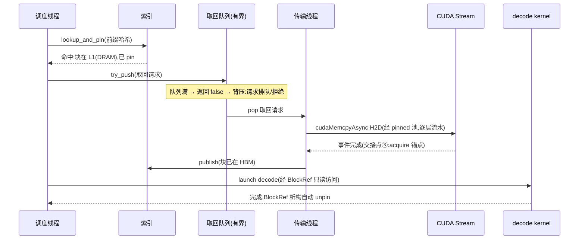

---
tags:
  - 高性能存储
status: 已完成
---

# 分层缓存与 KV Cache 生命周期

> [[8.4 KV Cache Offload]] 算清了「值不值」的账（取回 vs 重算的不等式），[[8.5 LMCache 与 Mooncake]] 看了集群怎么围绕它重组。本篇补上被那两篇一笔带过的正确性视角：**单个 KV 块从诞生到消亡的状态机——谁在哪条线程上动它、层间搬运排在哪个队列里、「块已就绪」这件事怎么安全地告诉别的线程、块池借空时压力怎么传回请求入口**。这些问题对 C++ 工程师毫不陌生：它们分别叫并发控制、有界队列、内存可见性和背压——**KV 缓存引擎就是一个用这四样东西搭起来的多线程系统，只是其中两个「线程」是 DMA 引擎和 GPU**。掌握这套骨架后，LMCache、Mooncake、3FS 就都是它的实现案例，而不是各自独立的原理。

前置：[[8.4 KV Cache Offload]]（体积账与决策不等式——本篇不重算）、[[8.1 GPU 内存层次与数据搬运]]（带宽阶梯与 pinned 军规）、[[7.18 Backpressure 与过载保护]]（有界队列与 Little 定律——本篇背压链的理论）。

---

## 1. 名词与背景：块、层、副本、索引

四个名词先钉死，后面全篇复用：

- **KV 块（block）**：KV Cache 的管理单位——paged attention 把一条会话的 KV 切成定长小块（典型十几 token 一块【实现】），像操作系统按页管理内存一样按块管理显存，解决变长会话的碎片问题（[[8.4 KV Cache Offload]] §2）；
- **层（tier）**：块可以住的四个地方，速度递减、容量递增——GPU HBM（工作层，attention kernel 只认它）、CPU DRAM（温层）、本地 NVMe（冷层）、远端集群池（共享层）；
- **副本（copy）**：同一块在多层同时存在的多份内容。**层间搬运是复制不是移动**【事实】——把块下沉到 DRAM 后，HBM 副本可以立即释放也可以暂留；这个自由度的来源是下一节的不变量；
- **索引（index）**：「哪个前缀的哪一块，此刻在哪些层」的全局表——按 token 序列的哈希（或 radix 树）组织【实现】。**块的存在性由索引定义**：索引里查不到，块就算物理字节还在盘上也等于不存在。

一句话把全篇立意说完【事实】：**块的内容管理是简单的（不可变），复杂度全部集中在「状态 + 索引」的并发管理上**——这正是它值得单独一篇的原因。

---

## 2. 状态机：一个块的一生

![[图片/SVG/8_8_14_1.svg|900]]

### 2.1 八个状态与三条不变量

| 状态 | 含义 | 谁能碰它 |
| --- | --- | --- |
| 空闲 Free | 在 HBM 块池里待借出 | 只有池（调度线程借出） |
| 填充中 Filling | **唯一可写状态**：prefill kernel 或传输线程正在写入 | 唯一的填充者（独占） |
| 就绪 Ready | 已发布进索引，内容从此不可变 | 任意读者（先查索引） |
| 使用中 InUse | 被至少一个请求 pin 住（refcount > 0），decode kernel 正在读 | 读者们（只读） |
| 下沉中 Offloading | 传输线程正在 D2H DMA 到下层 | 传输线程（读 HBM 副本） |
| 下层副本 Ready(L1+) | 内容住在 DRAM/NVMe/远端，索引记着位置 | 任意读者（经取回） |
| 取回中 Onloading | 传输线程正在 H2D DMA 回 HBM（经 pinned 池，逐层流水） | 传输线程 |
| 已逐出 Evicted | 索引删除、空间回收——再来只能重算 | 无 |

三条不变量撑起全部并发正确性【事实/实践】：

1. **只有 Filling 可写**。块一经发布（Filling → Ready）内容永不改动——「更新」= 写一个新块，不是改旧块。这直接换来两个免费品：**读者不需要锁**（不可变数据随便并发读），**多层副本不需要一致性协议**（副本之间不存在「谁新谁旧」）;
2. **发布是一次原子的索引插入**。填充者写完所有字节后才把块挂进索引——**索引插入就是 release，读者查到索引就是 acquire**（下文 §4 展开）；
3. **refcount > 0 期间禁逐出、禁下沉后删除 HBM 副本**。decode kernel 正在读的块被逐出 = 悬垂指针的 GPU 版；引用计数清零前块必须活着——与 `shared_ptr` 的「引用未清零不析构」同一条规矩。

熟悉存储引擎的读者应当立刻认出这个形状【类比】：**Filling → Ready → 下沉 → 逐出，就是 [[6.11 MemTable Immutable 与 SST 生命周期]] 的 GPU 版**——MemTable 可写、转 Immutable 后只读、flush 成 SST 下沉、compaction 淘汰。不可变 + 分层 + 引用计数，两边一模一样，因为它们解的是同一道题：**多读者、慢介质、后台搬运共存时，怎么不加大锁**。

### 2.2 每条转移：动作、执行者、并发控制手段

| 转移 | 触发 | 执行者 | 并发控制 |
| --- | --- | --- | --- |
| Free → Filling | 新 token 需要落 KV；池借出一块 | 调度线程 | 池内部一把小锁或无锁栈；**借出即独占**，之后零同步 |
| Filling → Ready | 填充完成 | 填充者 | 索引原子插入（release 发布） |
| Ready → InUse / 回落 | 请求 pin / unpin | worker 线程 | `refcount` 原子加减 |
| Ready → Offloading | LRU 选中且 refcount == 0 | 逐出线程 | 先原子地「摘牌」（标记下沉中）再搬，防止两个逐出者搬同一块 |
| Offloading → 下层副本 | D2H DMA 完成（stream event） | 传输线程 | 完成事件后更新索引「块在 L1」；HBM 副本归还池 |
| 下层副本 → Onloading | 前缀命中，发起取回 | 调度线程投递、传输线程执行 | 有界取回队列（§3） |
| Onloading → Ready | H2D 完成 | 传输线程 | 同发布：索引改指 HBM 副本 |
| 下层副本 → Evicted | 容量压力 / 策略淘汰，refcount == 0 | 逐出线程 | **先删索引再回收空间**——顺序反了，读者会查到一个正在被覆盖的块 |

注意「先删索引再回收」与「先写完再插索引」是同一条原则的两个方向【事实】：**索引是唯一的发布/撤销点，物理内容的生灭永远发生在索引可见范围之外**。这与 [[4.4 内存注册与零拷贝]] §5 的「先 dereg 再 free」同构——都是「先撤销可见性，再动资源」。

---

## 3. 队列与背压：三类线程、两条 DMA 管道、一根链条

### 3.1 谁在动这些块

一个最小可用的 KV 缓存引擎至少有三类执行流，加上两个「硬件线程」：

| 执行流 | 干什么 | 对应的 C++ 概念 |
| --- | --- | --- |
| 调度线程 | 查索引、借块、决定取回/重算、投递搬运请求 | 生产者 |
| 传输线程（+CUDA stream） | 消费搬运队列，提交 D2H/H2D DMA，等完成事件 | 消费者（真正干活的是 DMA 引擎） |
| 逐出线程 | водо位线触发，扫 LRU、下沉/淘汰 | 后台维护线程（对照 [[6.16 Rate Limiter 与后台任务隔离]] 的角色） |
| DMA 引擎 / GPU kernel | 实际搬字节 / 实际读 KV | 「消费者的消费者」——硬件 |

线程间的接口全部是**有界队列**：取回队列、下沉队列、完成回调队列。归属军规与 [[4.18 多线程下 QP 使用模型]] 模型 C 相同：pinned 中转池按传输线程私有，队列是唯一被多线程触碰的结构。

### 3.2 背压链：块池借空时发生什么

把 [[7.18 Backpressure 与过载保护]] 的骨架套在 KV 引擎上，压力的传导路径是（SVG 的 C 区）：

**HBM 块池借空 → 新请求的 alloc 阻塞/失败 → 请求在调度器排队（有界，排队时间是首选信号）→ 准入控制生效（超延迟预算的请求快速拒绝）→ 用户看到 TTFT 上涨或明确拒绝——而不是 OOM**。

三个必须算清的细节【事实/实践】：

1. **逐出是背压的第一响应，但它自己会制造流量**：池水位低触发批量下沉，下沉的 D2H 与命中取回的 H2D **共用同一条 PCIe**——[[8.4 KV Cache Offload]] §3 的 W1 隐藏等待点：evict 风暴期间取回变慢，TTFT 毛刺。处置方向是错峰与限速（逐出流量让路给取回，[[6.16 Rate Limiter 与后台任务隔离]] 的思想平移）;
2. **为什么必须有界**：由 Little 定律，固定在途上限 L 就是强制 λ·W 有界（[[7.18 Backpressure 与过载保护]] §1）——无界的「先收下再说」把过载变成排队延迟无限增长，最后所有请求一起超时（死工作），比早拒绝一部分差得多;
3. **每层水位线是独立的背压点**：HBM 池、pinned 中转池、DRAM 层、NVMe 层各有容量——任何一层满都会沿「取回队列 → 调度器 → 准入」逆流而上。排障时先问「是哪一层的水位先碰顶」，与 [[9.5 p99 毛刺定位]] 的分桶思路一致。

---

## 4. 内存可见性：三个交接点，一次 CUDA 特例

「块已就绪」这个事实要跨越三次所有权交接，每次交接的 happens-before 由不同机制提供——错一环就是偶发脏读（与 [[4.14 Fence 与内存可见性]] 七环链同一审计方法）：

| 交接点 | 从谁到谁 | 负责机制 |
| --- | --- | --- |
| ① 填充者 → 索引 | 写完最后一个字节 → 索引插入 | 索引的互斥锁或原子指针交换：**插入即 release**——锁内/原子写之前的所有普通写（块内容）对后续 acquire 读者可见 |
| ② 索引 → 读者 | 查到块 → 开始读内容 | 查询即 acquire；C++ 侧不需要给块数据本身加任何原子——**同步全部发生在句柄与索引上，数据面零开销** |
| ③ 主机 ↔ GPU/DMA | DMA 写完 pinned/显存 → 主机线程知道；主机填完缓冲 → DMA 开始读 | **只能靠 CUDA API**：`cudaStreamSynchronize` / event 完成即 acquire 锚点（类比收割 CQE，[[4.14 Fence 与内存可见性]] §4 对照表）；反方向靠「先填完再提交拷贝」的程序序 |

特例要单独敲黑板【事实】：交接点 ③ 不在 C++ 内存模型管辖范围内——`std::atomic` 管的是 CPU 线程之间，**DMA 引擎和 GPU kernel 不读你的原子变量**。跨设备的 happens-before 只有一条正路：完成事件（stream/event 同步）之后再发布。在 CQE/事件之前偷看缓冲区，与多线程程序里不加锁读共享变量是同一个 bug，只是复现更难（PCIe 传输的时序比线程切换稳定得多，坏起来只在高负载抖动时）。

这套「发布-订阅」形状与 C++ 教科书完全对得上【类比】：块 = 被发布的对象（不可变）；索引 = `std::atomic<T*>` 的指针发布；refcount = `shared_ptr` 控制块；填充期独占 = `unique_ptr` 语义。**KV 引擎没有发明任何新并发原语，它只是把教科书模式的参与者换成了 DMA 和 kernel。**

---

## 5. Modern C++：把不变量写进类型

骨架代码分三段——块与句柄、索引发布、取回流水。目标不是完整引擎，而是让 §2 的三条不变量由类型系统而非注释来守卫。

### 5.1 块与 RAII pin 句柄：refcount 规矩编译期强制

```cpp
#include <atomic>
#include <cstddef>
#include <cstdint>
#include <span>

enum class BlockState : std::uint8_t {
    kFilling, kReady, kOffloading, kOnloading   // Free/Evicted 由池与索引表达
};

struct KvBlock {
    void* dev_ptr = nullptr;              // HBM 副本(可能为空:仅下层有副本)
    void* host_ptr = nullptr;             // 下层副本(pinned/映射,可能为空)
    std::uint32_t tokens = 0;
    std::atomic<BlockState> state{BlockState::kFilling};
    std::atomic<int> refcount{0};         // >0 期间禁逐出——shared_ptr 同款规矩
};

// RAII pin 句柄:存在即 refcount>0,析构自动 unpin。
// decode 路径只经它访问块——「忘了 unpin」这类 bug 被类型消灭
class BlockRef {
public:
    explicit BlockRef(KvBlock& b) : b_{&b} {
        b_->refcount.fetch_add(1, std::memory_order_acq_rel);
    }
    ~BlockRef() {
        if (b_) b_->refcount.fetch_sub(1, std::memory_order_acq_rel);
    }
    BlockRef(BlockRef&& o) noexcept : b_{o.b_} { o.b_ = nullptr; }
    BlockRef& operator=(BlockRef&&) = delete;
    BlockRef(const BlockRef&) = delete;

    [[nodiscard]] const KvBlock& get() const noexcept { return *b_; }  // 只读!
private:
    KvBlock* b_;
};
```

**关键点**：

- `get()` 返回 `const KvBlock&`——「发布后不可变」由 const 正确性守卫，想写就编译不过;
- 移动构造保留（句柄可以在线程间转移所有权），拷贝删除（一次 pin 一份计数，语义清晰）;
- refcount 用 acq_rel：unpin 到零与逐出线程的「检查后回收」之间需要同步——与 `shared_ptr` 控制块的内存序选择同理。

### 5.2 发布与查询：索引就是 release/acquire 的载体

```cpp
#include <mutex>
#include <optional>
#include <unordered_map>

class BlockIndex {
public:
    // 填充者调用:块内容已写完,此刻才对世界可见(交接点①,插入即 release)
    void publish(std::uint64_t prefix_hash, KvBlock* blk) {
        blk->state.store(BlockState::kReady, std::memory_order_release);
        std::lock_guard lk{mu_};
        map_[prefix_hash] = blk;
    }

    // 读者调用:查到即 acquire(交接点②),返回已 pin 的句柄——
    // 查询与 pin 在同一临界区完成,堵住「查到之后、pin 之前被逐出」的窗口
    std::optional<BlockRef> lookup_and_pin(std::uint64_t prefix_hash) {
        std::lock_guard lk{mu_};
        auto it = map_.find(prefix_hash);
        if (it == map_.end()) return std::nullopt;      // 未命中 → 重算
        return BlockRef{*it->second};
    }

    // 逐出线程调用:先摘索引,出了临界区再等 refcount 清零、回收空间
    KvBlock* unpublish(std::uint64_t prefix_hash) {
        std::lock_guard lk{mu_};
        auto it = map_.find(prefix_hash);
        if (it == map_.end()) return nullptr;
        KvBlock* b = it->second;
        map_.erase(it);
        return b;   // 调用方:自旋/延迟等 refcount==0 后才真正回收
    }

private:
    std::mutex mu_;   // 真实引擎按哈希分片降低竞争;骨架从简
    std::unordered_map<std::uint64_t, KvBlock*> map_;
};
```

**关键点**：

- 「查询 + pin 同临界区」是这段代码的灵魂：拆开写就有 TOCTOU 窗口——查到指针、还没来得及加引用，逐出线程已把块回收;
- `unpublish` 只摘牌不回收——「先撤可见性、再等读者散场、最后动资源」三步，正是 §2.2 的顺序原则 + RCU 的宽限期思想的手写版;
- 真实引擎的索引会分片（per-shard mutex）或用并发哈希表，但发布/撤销的语义骨架不变。

### 5.3 取回流水：有界队列 + 完成事件才发布

```cpp
// 传输线程主循环(伪码级骨架):消费取回队列,H2D 后经事件同步再发布
// —— 交接点③:跨设备的 happens-before 只能由 CUDA 事件提供
void transfer_loop(BoundedIoQueue& fetch_q, BlockIndex& index,
                   cudaStream_t stream) {
    while (auto req = fetch_q.pop()) {                  // 队列空则睡(cv)
        // ① 下层副本 → pinned 中转(NVMe/远端时) → 显存,均为异步提交
        cudaMemcpyAsync(req->blk->dev_ptr, req->blk->host_ptr,
                        req->bytes, cudaMemcpyHostToDevice, stream);
        // ② 等这一批完成——事件之前,谁也不许说「块已在 HBM」
        cudaStreamSynchronize(stream);
        // ③ 此刻才发布:调度线程随后的 lookup 将看到完整的块
        index.publish(req->prefix_hash, req->blk);
    }
}
```

（`BoundedIoQueue` 即 [[8.13 GDS 兼容性与回退路径]] §4.2 的同一个类——有界、满则拒绝，背压点。）真实引擎会用事件回调代替同步阻塞、用多 stream 做逐层流水（第 N 层在算、第 N+1 层在传，[[8.4 KV Cache Offload]] §2 的重叠），骨架里的**顺序约束**——「事件完成先于发布」——一个字不能少。

### 5.4 一次前缀命中的完整时序



---

## 6. 排障清单：症状 → 判定 → 处置

| 症状 | 先看什么 | 典型根因 | 处置方向 |
| --- | --- | --- | --- |
| 偶发输出乱码/注意力结果错误 | 发布时机：是否在 DMA 事件完成前 publish | 交接点③违规——事件前发布，kernel 读到半旧块 | 审计所有 publish 调用点必须在完成事件之后 |
| 偶发崩溃/非法显存访问 | 逐出路径：是否等 refcount 清零 | 逐出与读者竞态（TOCTOU：查到未 pin 即被回收） | lookup 与 pin 合并进同一临界区（§5.2） |
| TTFT 周期性毛刺 | evict 与 fetch 的 PCIe 流量时间线 | 下沉风暴抢取回带宽（W1） | 逐出限速/错峰；水位线提前、小批多次 |
| 高负载下内存持续上涨直到 OOM | 各队列是否有界 | 无界队列囤积过载 | 全部改有界 + 快速拒绝（[[7.18 Backpressure 与过载保护]] §4.1） |
| 命中率正常但 TTFT 没降 | 取回是否逐层流水 | 整段传完才开始算，无重叠 | 多 stream 流水；块粒度过大也会拖头部等待 |
| 池明明有空、alloc 仍慢 | 池锁竞争;借还是否走了全局锁 | 池成了热点 | 分片池 / 每线程本地缓存（与 [[4.18 多线程下 QP 使用模型]] 模型 C 同思路） |
| 逐出后同前缀请求变多、GPU 算力飙升 | 淘汰的是不是高价值长前缀 | LRU 不感知重算成本 | 成本感知淘汰（段长加权）——展开见 [[8.15 Prefix 淘汰 一致性 与故障恢复]] |

---

## 7. 陷阱与误区

> [!warning] 常见错误
> 1. **给块内容加锁或原子**：不可变数据不需要——同步只该发生在索引与句柄上;给数据面加原子是白付缓存行代价（[[0.1 CPU Cache Cache Line 与内存屏障]]）。
> 2. **用 `std::atomic` 旗标等 DMA**：DMA 引擎不参与 C++ 内存模型;跨设备只有 CUDA 事件/同步这一条正路——「事件前偷看」是高负载才发作的静默脏读。
> 3. **先回收空间再删索引**（或先插索引再写内容）：发布/撤销顺序反一个，读者就能拿到写了一半或正被覆盖的块——索引操作永远是最后一步（发布）或第一步（撤销）。
> 4. **裸调 pin/unpin**：忘 unpin 的块永不可逐出，池慢性泄漏——RAII 句柄让泄漏变成编译期/析构期问题。
> 5. **把「层间搬运」想成移动**：是复制。想通这一点才能理解为什么多副本无一致性问题、为什么下沉中的块还能被读。
> 6. **无界队列扛峰值**：过载不会消失，只会改名叫「延迟」和「OOM」——有界 + 排队时间信号 + 快速拒绝是唯一诚实的写法。
> 7. **只在单线程/低负载下测试**：本篇全部竞态窗口（TOCTOU、事件前发布）都只在高负载抖动时现形——压测要专门构造 evict 风暴与命中风暴的叠加。

---

## 8. 关键结论

| 结论 | 性质 |
| --- | --- |
| KV 缓存引擎 = 状态机（8 态）+ 索引 + 有界队列 + 引用计数：全部是教科书并发原语，只是两个「线程」是 DMA 与 GPU | 事实 |
| 三条不变量撑起正确性：只有 Filling 可写（发布后不可变）；发布 = 索引原子插入（release/acquire）；refcount>0 禁逐出 | 事实（约束） |
| 不可变换来两个免费品：读者无锁、多层副本无一致性问题——层间是复制不是移动 | 事实 |
| 与 MemTable→Immutable→SST 同构（6.11）：多读者 + 慢介质 + 后台搬运的通解就是「不可变 + 分层 + 引用计数」 | 类比 |
| 可见性三交接点：索引插入（release）、索引查询（acquire）、CUDA 事件（跨设备唯一锚点）——事件前发布是头号静默 bug | 事实 / 实践 |
| 「先撤可见性再动资源」双向成立：先写完再插索引、先删索引再回收——与 dereg-before-free 同构 | 事实 |
| 背压链：块池 → 调度排队 → 准入拒绝 → TTFT/拒绝，绝不 OOM;每层水位是独立背压点，evict 与 fetch 共用 PCIe 是隐藏耦合 | 事实 / 实践 |
| 有界队列不是容量优化是延迟设计：L = λW，固定 L 才能让延迟可观测、可准入——回退到无界即回到死工作 | 事实 |

---

## 关联知识

- [[8.4 KV Cache Offload]] - 「值不值」的账：体积、不等式、TTFT 分布——本篇状态机的经济学
- [[8.5 LMCache 与 Mooncake]] - 这套骨架的两个工业实现：chunk 粒度、池化、传输引擎
- [[8.15 Prefix 淘汰 一致性 与故障恢复]] - 下一篇：淘汰策略、多实例一致性与池节点故障语义
- [[6.11 MemTable Immutable 与 SST 生命周期]] - 同构原型：不可变 + 分层 + 引用计数在存储引擎里的原版
- [[7.18 Backpressure 与过载保护]] - 有界队列、Little 定律、快速拒绝：背压链的完整理论
- [[4.14 Fence 与内存可见性]] - 「逐环审计 happens-before」的方法论来源
- [[4.18 多线程下 QP 使用模型]] - 分区 + 归属的并发军规：池分片与线程私有中转的依据
- [[6.16 Rate Limiter 与后台任务隔离]] - 逐出流量给前台让路的思想源头
- [[9.5 p99 毛刺定位]] - 「先分桶再看分布」：TTFT 排障的通用方法
- [[0.1 CPU Cache Cache Line 与内存屏障]] - release/acquire 的微观地基
