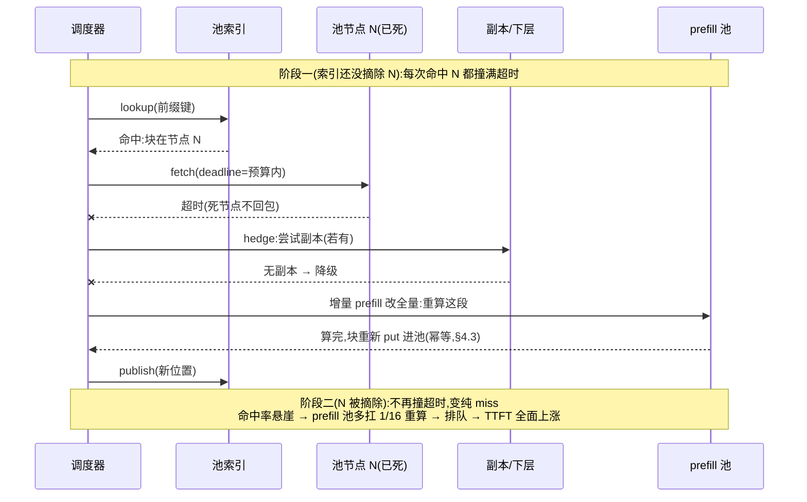

---
tags:
  - 高性能存储
  - AI-GPU-数据路径
status: 已完成
---

# Prefix 匹配、淘汰策略、缓存一致性与故障恢复

> [[8.14 分层缓存与 KV Cache 生命周期]] 管好了单机上一个 KV 块的一生；[[8.5 LMCache 与 Mooncake]] 把 KV 池铺到了整个集群。本篇回答共享池绕不开的四个问题：**怎么知道「这段算过」（前缀匹配）、池满了先丢谁（淘汰）、几十个实例同读同写会不会读到错的 KV（一致性）、存缓存的节点挂了语义是什么（故障恢复）**。主线一句话：**内容寻址 + 不可变把经典的缓存一致性难题从根上消掉了一大半；剩下的难题只有两类——「块在哪」的元数据问题（[[7.2 元数据路径瓶颈]] 的老课题）和「缓存丢了之后的容量」问题（[[7.17 Recovery 与 Rebuild]] 的老课题）**。项目接口会变，这组问题不会变。

前置：[[8.14 分层缓存与 KV Cache 生命周期]]（单机状态机与三条不变量——本篇把它们原样搬上集群）、[[8.4 KV Cache Offload]]（体积账与重算成本的超线性——淘汰计价的分子来源）、[[7.9 一致性模型]]（「读到旧的」和「读到错的」是两件事——本篇反复用这个区分）。

---

## 1. 名词与背景：「算过就能复用」的前提是什么

先把地基打牢。**前缀（prefix）**指请求 token 序列的开头部分。多轮对话里它天然存在：第二轮请求 = system prompt + 第一轮问答 + 新问题——前面那一大段和上一次一模一样。**前缀缓存**就是把这段的 KV（[[8.4 KV Cache Offload]] §1：注意力反复查询的「上下文记忆」，约 320 KiB/token）存起来，下次直接取用，省掉一整段 prefill 算力。

复用成立要满足两个前提，缺一个就是错的输出而不是慢的输出：

1. **确定性前提**【事实】：同一模型对同一 token 序列算出的 KV 语义上唯一——所以「存下来的字节」可以代替「重新算一遍」。注意复用的是**存下来的字节本身**，不要求重算在数值上逐比特可复现（不同 batch/kernel 下浮点求和顺序可能有微小差异，但那是重算路径的事，与取回路径无关）；
2. **前缀敏感性**【事实】：注意力让第 i 个 token 的 KV 依赖**它之前的全部 token**。直白例子：「今天天气很好」和「昨天天气很好」从第一个字就分叉，后面四个字虽然字面相同，KV 却全部不同。所以能复用的只有**严格相同的前缀**，不能复用「中间恰好相同的一段」（想复用非前缀段要付拼接修正的代价，即 [[8.5 LMCache 与 Mooncake]] §2 的 blending【实现/取舍】）。

还有一个藏得最深的前提——**计算环境**【事实/实践】：同一段 token，换一版权重、换一种量化、换一个 tokenizer、甚至换一种张量并行切分布局，算出的 KV 都不同或不可用。所以缓存键除了 token 还必须包含**环境指纹（fingerprint）**。漏了它不会立刻坏——会在下一次模型灰度升级时以「偶发乱码」的形式爆发（§4.4 的故障案例）。

---

## 2. Prefix 匹配：哈希链与 radix 树

![[图片/SVG/8_8_15_1.svg|900]]

### 2.1 哈希链：让「键」如实编码全部历史

把 token 序列按固定长度切成 chunk（[[8.5 LMCache 与 Mooncake]] 的粒度选择——比 paged block 粗，摊薄跨机搬运的固定开销），每个 chunk 的键用**链式哈希**生成【实现】：

$$
h_0 = H(fp,\ chunk_0), \qquad h_i = H(h_{i-1},\ chunk_i)
$$

这一行公式就是全篇正确性的地基，两个性质【事实】：

- **键编码全部历史**：$h_i$ 经 $h_{i-1}$ 递归包含了前面所有 chunk 和环境指纹。改动前文任何一个 token（或升级模型），后面所有块的键**全部改变**——§1 的前缀敏感性被键结构如实表达，「拿错前文的 KV」在键空间里根本无法发生；
- **内容寻址（content-addressed）**：键由内容唯一决定，与谁算的、在哪台机器算的无关。实例 A 和实例 B 对同一前缀独立算出的键相同、值也相同——跨实例复用不需要任何协调，这是 §4 一致性「免费午餐」的来源。

最小示例（键的构造逻辑，与 §3 模拟器共用）：

```cpp
#include <cstdint>
#include <span>

// FNV-1a 风格的链式合并:演示语义;生产实现用更强的哈希(如 xxHash/SHA 截断)
constexpr std::uint64_t hash_combine(std::uint64_t seed, std::uint64_t v) {
    return (seed ^ v) * 0x100000001B3ULL;
}

std::uint64_t chunk_key(std::uint64_t fingerprint,
                        std::span<const std::uint64_t> chunk_hashes) {
    std::uint64_t h = fingerprint;          // 环境指纹是链的第 0 环
    for (auto c : chunk_hashes) h = hash_combine(h, c);
    return h;
}
```

### 2.2 匹配算法：树和平面表，各管一层

**匹配**就是拿新请求的键序列 $h_0, h_1, \dots$ 逐个查索引，**停在第一个查不到的键**——命中长度 k 个 chunk，之后的部分做**增量 prefill**（只算新增段，取回的 KV 作为它的「前文」）。命中长度 k 是全系统最重要的中间变量【事实】：

$$
TTFT_{hit} = T_{fetch}(k) + T_{prefill}(k \to n), \qquad T_{prefill}(k \to n) \propto \frac{n^2 - k^2 + n - k}{2}
$$

（每个位置的注意力要扫过全部前文，所以 prefill 代价对长度是平方级累积——k 越大，省得越多且**超线性**地多，这是 §3 淘汰计价的分子。）

索引的组织有两种形态，各占一层【实现/取舍】：

| 形态 | 用在哪 | 优势 | 代价 |
| --- | --- | --- | --- |
| **radix 树 / 前缀树**（SGLang RadixAttention 一脉【实现】） | 单实例引擎内 | 树结构免费给出两样东西：**共享计数**（内部节点被多少后代引用）和**叶子优先淘汰**（§3）；匹配 = 从根下走 | 树是有指针的共享可变结构，跨节点维护代价高 |
| **平面哈希表**（Mooncake 式池索引【实现】） | 分布式池 | 键已经编码了树结构（哈希链），平面表就够——分片、复制、迁移都简单 | 共享度要靠额外统计（热度计数），不再免费 |

一个值得记住的事实/取舍区分【事实 vs 实现】：数学上，中间缺一块（「洞」）是可以单独补算的——补洞只需要它之前的 KV，而那些恰好在缓存里。但多数工程实现只用「最长前缀」语义，洞直接当作断点——因为补洞让调度和显存布局复杂化，收益却只在少见的访问模式下出现。见到「为什么不补洞」的讨论时，要分清这是**能力边界**还是**工程取舍**——是后者。

---

## 3. 淘汰：LRU 的盲区与成本感知计价

### 3.1 约束先行，策略在约束之内

淘汰策略再聪明也不能违反两条硬约束（[[8.14 分层缓存与 KV Cache 生命周期]] §2 的不变量原样上楼）【事实】：

1. **refcount > 0 禁逐出**——正被 decode 读的块逐出去就是 GPU 版悬垂指针；
2. **先删索引、再等读者散场、最后回收空间**——顺序反了，读者会拿到正被覆盖的块。

树形索引还追加一条软约束：**叶子优先**。逐出内部节点会让它的后代块「失联」（匹配从根下走，走到断点就停，后面的块再也走不到）——虽然内容寻址保证祖先重算后键不变、后代自动复活，但这一来一回白付了祖先的重算。叶子最「专有」、共享面最小，先剪叶子永远不会产生失联块【事实】。

### 3.2 LRU 错在哪：它假设每块等价值

LRU（least recently used，逐出最久未用者）是页缓存的默认答案，隐含假设是**每一块的价值大致相同**——对操作系统的 4 KiB 页近似成立，对 KV 块严重不成立【事实】。一个 KV 块的价值是两个因子的乘积，两个因子都随它在树中的位置剧烈变化：

$$
value = f_{reuse} \times \frac{T_{recompute}(depth)}{bytes}
$$

- $f_{reuse}$：预期还会被用几次——共享前缀（system prompt）人人要，会话尾巴往往一次性；
- $T_{recompute}(depth)$：重算它要花多少——§2.2 的超线性，**深处的块单字节省的重算远多于浅处**。

于是 LRU 有两个方向相反的系统性错判【事实/实践】：**低估 system prompt**（最近可能没有被「整段」访问过，但每条新请求都要它——逐出它 = 所有会话同时重算）；**高估会话尾巴**（刚刚用过所以最「新」，但用户可能永远不回来）。成本感知淘汰就是按上面的 value 逐最小者，工程上常再叠加 TTL（会话尾巴超过会话超时时间就没有保留意义）和水位线批量触发（[[8.14 分层缓存与 KV Cache 生命周期]] §3 的背压联动）【实现】。

### 3.3 对照实验：一个可复现的淘汰策略模拟器

实验设计（变量控制）：**同一条请求流、同一容量，只换淘汰策略**，比较三个输出——chunk 命中率、总重算成本（按 §2.2 的超线性代价函数计）、失联块事件数。负载构造模仿真实形态：少量高频共享前缀 + 大量一次性会话尾巴。随机数固定种子，任何人跑出的数字逐位相同。

```cpp
// prefix_evict_sim.cpp — 对照实验:全局 LRU vs 成本感知叶子优先
// 编译运行: g++ -std=c++20 -O2 prefix_evict_sim.cpp -o prefix_evict_sim && ./prefix_evict_sim
#include <algorithm>
#include <cstdint>
#include <iostream>
#include <random>
#include <unordered_map>
#include <vector>

constexpr std::uint64_t hash_combine(std::uint64_t seed, std::uint64_t v) {
    return (seed ^ v) * 0x100000001B3ULL;
}

struct CachedChunk {
    std::uint64_t parent = 0;   // 链上前一块的键(0 = 链头)
    int depth = 0;              // 1-based:重算代价 ∝ depth(注意力扫全部前文)
    std::uint64_t last_use = 0; // LRU 时钟
    int uses = 0;               // 复用次数(成本感知的频率因子)
};

class Cache {
public:
    Cache(std::size_t cap, bool cost_aware) : cap_{cap}, cost_aware_{cost_aware} {}

    // 返回命中长度 k;随后把整条链(共 n 块)全部置入缓存
    int access(const std::vector<std::uint64_t>& keys) {
        ++clock_;
        int k = 0;
        for (auto key : keys) {           // 匹配:停在第一个查不到的键
            auto it = map_.find(key);
            if (it == map_.end()) break;
            it->second.last_use = clock_;
            ++it->second.uses;
            ++k;
        }
        std::uint64_t parent = 0;
        for (int i = 0; i < static_cast<int>(keys.size()); ++i) {
            if (i >= k) {                 // 未命中部分:重算并插入
                auto& c = map_[keys[i]];
                c = {parent, i + 1, clock_, 1};
                ++child_cnt_[parent];
            }
            parent = keys[i];
        }
        while (map_.size() > cap_) evict_one();
        return k;
    }

    long long stranded_events = 0;        // 逐出了仍有后代在缓存里的块

private:
    void evict_one() {
        auto victim = map_.end();
        double best = 1e300;
        for (auto it = map_.begin(); it != map_.end(); ++it) {
            const bool is_leaf = child_cnt_[it->first] == 0;
            if (cost_aware_ && !is_leaf) continue;        // 叶子优先:只逐叶子
            const double score = cost_aware_
                ? static_cast<double>(it->second.uses) * it->second.depth  // value 最小者
                : static_cast<double>(it->second.last_use);                // 最久未用者
            if (score < best) { best = score; victim = it; }
        }
        if (victim == map_.end()) return;
        if (child_cnt_[victim->first] > 0) ++stranded_events;
        --child_cnt_[victim->second.parent];
        map_.erase(victim);
    }

    std::size_t cap_;
    bool cost_aware_;
    std::uint64_t clock_ = 0;
    std::unordered_map<std::uint64_t, CachedChunk> map_;
    std::unordered_map<std::uint64_t, int> child_cnt_;   // 键 -> 缓存中的子块数
};

int main() {
    constexpr std::uint64_t kFp = 0x9E3779B97F4A7C15ULL;  // 环境指纹(§1)
    constexpr int kSessions = 400, kSharedPrefixes = 4, kSharedLen = 4;
    constexpr std::size_t kCapacity = 300;

    std::mt19937_64 rng{42};                              // 固定种子:可复现
    std::uniform_int_distribution<int> turns_dist{1, 8};
    std::uniform_int_distribution<int> prefix_dist{0, kSharedPrefixes - 1};

    // 生成请求流:每条会话 = 共享前缀(4 chunk) + 每轮追加 2 个专有 chunk
    std::vector<std::vector<std::uint64_t>> requests;
    for (int s = 0; s < kSessions; ++s) {
        const int prefix_id = prefix_dist(rng);
        std::vector<std::uint64_t> chain;
        std::uint64_t h = hash_combine(kFp, prefix_id);
        for (int i = 0; i < kSharedLen; ++i)
            chain.push_back(h = hash_combine(h, 1000 + i));
        const int turns = turns_dist(rng);
        for (int t = 0; t < turns; ++t) {
            for (int j = 0; j < 2; ++j)
                chain.push_back(h = hash_combine(h, rng()));  // 专有尾巴
            requests.push_back(chain);                        // 每轮一次请求
        }
    }
    std::shuffle(requests.begin(), requests.end(), std::mt19937_64{7});

    for (const bool cost_aware : {false, true}) {
        Cache cache{kCapacity, cost_aware};
        long long hit = 0, total = 0, recompute_cost = 0;
        for (const auto& req : requests) {
            const int k = cache.access(req);
            const long long n = static_cast<long long>(req.size());
            hit += k; total += n;
            recompute_cost += (n * n - 1LL * k * k + n - k) / 2;  // §2.2 超线性
        }
        std::cout << (cost_aware ? "成本感知叶子优先" : "全局 LRU        ")
                  << "  chunk 命中率 " << 100.0 * hit / total << "%"
                  << "  重算成本 " << recompute_cost
                  << "  失联事件 " << cache.stranded_events << '\n';
    }
}
```

**怎么读结果**【实践】：两个策略的 chunk 命中率可能相差不大，但**重算成本**差距显著——成本感知保住了「省得多」的共享前缀与深处块，LRU 保住的是「刚用过」的尾巴；`失联事件` 一列则直接展示全局 LRU 逐祖先、后代白占容量的现象。这正是本节要建立的判断：**淘汰策略该优化的目标函数是「省下的重算」，不是命中率**——命中率是手段的副产品，不是目的。

模拟器的边界要说清【前提】：它只比较**策略排序逻辑**，不含取回时间与并发——真实系统还要在命中之后叠加 [[8.4 KV Cache Offload]] 的取回-重算不等式（慢层命中可能不如重算，见 §6 误读二）。

---

## 4. 多实例一致性：这个「分布式缓存」为什么几乎不需要一致性协议

### 4.1 先看经典难题，再看它怎么消失的

普通分布式缓存（比如挡在数据库前面的缓存层）最难的是**失效（invalidation）**：底层数据更新了，散落各处的缓存副本必须跟着变，否则读到旧值——旧值是**错误**。整个缓存一致性领域（包括 [[0.1 CPU Cache Cache Line 与内存屏障]] 的 MESI）都在解这道题。

KV 池把这道题从根上消掉了【事实】：**键 = 内容的哈希链，值 = 由键唯一决定的不可变字节**。没有「同一个键下的值被更新」这回事——值要变，键必先变（§2.1 的哈希链性质）。同键必同值，所以**任何副本、任何时刻读到的都对**，失效协议无事可做。这不是运气，是 [[8.14 分层缓存与 KV Cache 生命周期]]「发布后不可变」不变量在集群尺度的直接红利。

剩下的一致性问题只有三个，逐个看。

### 4.2 索引可以过期，因为过期是安全的

索引（「哪个键的块在哪个节点」）是池里**唯一可变**的状态，多实例并发读写它必然有过期窗口。关键设计判断【事实】：过期只产生两种结果，都不产生错误输出——

- **假阴性**：块明明在池里，索引没查到 → 当作未命中，重算——多花算力；
- **假阳性**：索引说在节点 N，N 已经死了 → 取回失败，降级重算——多花算力加一次超时。

这叫 **degrade-to-miss（降级为未命中）语义**：任何索引错误都坍缩成性能损失，永远不是正确性损失。用 [[7.9 一致性模型]] 的语言：池索引只需要**最终一致**——花大价钱做强一致索引买不来任何正确性，只买来元数据路径的延迟和可用性负担（[[7.2 元数据路径瓶颈]]、[[7.20 元数据服务高可用]] 的所有难题）。**「读到旧的」无害是这个系统最重要的架构自由度，后面 §5 的故障恢复全靠它。**

### 4.3 发布原子性与幂等写：老朋友，免费版

**半写块不可见**【事实】：跨节点写入一个 chunk（GiB 级传输可能中途断），必须「写完 + 校验和验证 → 才登记进索引」——[[8.14 分层缓存与 KV Cache 生命周期]] §2「先写完再插索引」的网络版，与 [[7.7 对象存储路径]] PUT 的可见性发布同构。网络层面的原因值得点破【OS/网络层】：TCP 保证**字节流**有序可靠，但它没有消息边界的概念——「连接断在半截」时接收端只知道收了多少字节，不知道差多少；「这个 chunk 完整了」必须由应用层的长度前缀 + 校验和自己判定（[[6.4 Torn Write 与 Checksum]] 的网络对偶）。

**重复写天然幂等**【事实】：两个实例同时算出同一前缀、同时向池 put——内容寻址下这是同键同值，后到者丢弃或覆盖，结果一样。[[7.13 幂等 重试 与请求去重]] 要花一整篇建去重表才能得到的性质，这里由键的构造免费送出。唯一要防的是「同键不同值」——它只可能来自环境指纹漏项，也就是下一小节。

### 4.4 真正的正确性杀手：指纹漏项

本篇唯一能让你**输出错误内容**的故障模式【实践】：环境指纹没把某个影响 KV 的因素编进键。典型剧本——模型灰度升级（或 LoRA 切换、量化位宽调整），token 没变、键没变，**新模型的 decode 读到旧模型的 KV**：输出乱码，或者更阴险——只是质量微妙劣化。症状特征是「偶发、与命中率成正比、集中在灰度窗口」，极难与模型本身的质量问题区分。

防御是纪律不是技巧【实践】：

1. 指纹覆盖**一切影响 KV 数值或布局的因素**：权重版本、LoRA、量化、tokenizer 版本、并行切分布局；
2. 升级即翻转全池版本号（等价于把 [[7.12 Lease 与 Fencing]] 的 epoch 思想用在缓存上：旧 epoch 的键整体作废）；
3. **回滚也是一次升级**——版本号只前进不后退，回滚后继续翻新号，否则回滚版本会命中「升级期间写入」的新 KV。

---

## 5. 故障恢复：缓存丢了不是数据丢了，但雪崩是真的

### 5.1 缓存语义与降级链：故障处理的唯一目标是优雅降级

KV 池是**缓存不是存储**【事实】：任何块丢了都能重算——「数据源」是请求自带的 prompt token，从不丢失。所以池的故障恢复不需要 [[7.17 Recovery 与 Rebuild]] 那套数据重建，唯一目标是**降级路径够快**：

**取回失败/超时 → 换副本（若有）→ 换层 → 重算。**

这条链的工程命门是**截止时间（deadline）**【实践】：取回的等待预算必须小于重算时间——8.4 决策不等式的运行时版。等一个死节点 30 秒再去重算 5 秒的 prefill，比直接重算糟六倍。为什么不能依赖传输层超时【OS/网络层】：TCP 重传是指数退避的，RTO 从约 200 ms 起步，几次退避就是秒级；连接建立失败的内核默认超时更以分钟计。**应用层必须自带 deadline 与快速失败**，不能等内核替你放弃。而且取回是只读幂等操作（§4.3），[[7.13 幂等 重试 与请求去重]] 里最凶险的「超时三义性」在这里完全无害——重试、甚至同时向两个副本发对冲请求（hedge），都随便做【事实】。

### 5.2 故障案例：池节点掉线的两阶段雪崩

一个 16 节点池、块均匀分布，1 个节点掉线（约 1/16 的块失联）。时间线上是**两个阶段、两种疼法**【实践】：



- **阶段一（撞超时期）**：索引尚未摘除 N，涉及 N 的每次请求都先付满一份超时预算再降级——TTFT 尾部立刻抬升，p99 最疼。持续时长 = 故障检测 + 索引摘除的延迟（[[7.15 Membership 与故障检测]] 的心跳周期直接决定这段疼多久）；
- **阶段二（纯 miss 期）**：摘除后不再撞超时，但命中变未命中——prefill 池要多扛这部分重算。**如果 prefill 池没有余量，排队开始，TTFT 从尾部蔓延到全体**，最后靠准入控制止血（[[7.18 Backpressure 与过载保护]]）。恢复靠自然回填：miss 后重算的块重新 put，命中率爬回去。

三条对策，全是容量与放置问题【实践】：**N−1 容量规划**（prefill 池按「池降级时扛得住重算风暴」留余量，[[8.5 LMCache 与 Mooncake]] 陷阱 5）；**热前缀多副本**（system prompt 级的块至少两副本——注意这里副本只为可用性与取回带宽，不为持久性，与 [[7.1 副本 vs EC]] 里「防数据丢失」的副本目的不同【取舍】）；**摘除要快但别误摘**（激进的心跳阈值会把慢节点当死节点，摘除本身触发 miss 风暴——[[7.15 Membership 与故障检测]] 误摘除雪崩的缓存版）。

### 5.3 索引自身的故障：软状态设计

「块在哪」这张表自己也会挂。两条路线【实现/取舍】：

| 路线 | 做法 | 代价 |
| --- | --- | --- |
| 持久化 + 复制 | 索引当元数据服务做 HA（[[7.20 元数据服务高可用]] 全套） | 元数据路径背上共识/持久化延迟；杀鸡用牛刀 |
| **软状态（soft state）** | 索引只存内存；**池节点周期心跳重登记自己持有的块清单**，索引项带 TTL/租约，到期自动消失 | 索引重启 = 全池短暂「变冷」，等一两个心跳周期重建 |

缓存场景几乎总选软状态【实践】：degrade-to-miss 语义（§4.2）保证索引丢了最坏也就是「全池冷启动」——把 [[7.20 元数据服务高可用]] 的难题降级成 [[7.15 Membership 与故障检测]] 的心跳问题。索引项的 TTL 就是 [[7.12 Lease 与 Fencing]] 的租约：节点死 → 停止续约 → 项过期 → 假阳性窗口自动闭合，代价只是窗口期内多撞几次超时。

### 5.4 与 P/D 分离的关系：池是交接介质，pin 必须带租约

[[8.5 LMCache 与 Mooncake]] 的 P/D 分离架构里，池还兼任 **prefill → decode 的交接介质**：prefill 实例算完把 KV 写进池，decode 实例从池取走。三个专属问题：

1. **交接中的块不能被淘汰**：prefill 写完、decode 还没取，这段窗口内块必须钉住。单机用 refcount（[[8.14 分层缓存与 KV Cache 生命周期]]），但**纯引用计数不能上集群**【事实】——持有引用的 decode 实例若崩溃，计数永远不归零，块永久泄漏。分布式 pin 必须是**带超时的租约**：decode 定期续约，崩溃则租约到期、块自动解禁。「引用计数 → 租约」是单机原语上集群的标准变形，与 §5.3 索引项同一个机制；
2. **prefill 实例崩溃**：半成品因发布原子性（§4.3）不可见，conductor 视角就是一次 miss → 重排 prefill——**崩溃恢复不需要专门路径，degrade-to-miss 统一兜底**【事实】。这是好架构的标志：故障路径与未命中路径是同一条，测一条等于测两条；
3. **淘汰与调度联动**：conductor 按「前缀命中最大化」放置请求（8.5 §3），而放置决定未来的复用分布、淘汰决定放置的收益——两者互为输入。实践形态：淘汰器把「即将被逐出的前缀」反馈给调度器降低其亲和权重；调度器把「热前缀分布」反馈给淘汰器提高保留优先级【实现】。缓存策略在这里彻底升格为调度策略。

---

## 6. 指标、误读与验证实验

**指标先给定义**【事实】：

- **请求命中率**：至少命中一个 chunk 的请求占比——最容易让仪表盘好看，信息量最低；
- **token（chunk）命中率**：命中 token 数 / 总 prompt token 数——与省下的算力**近似**成正比，日常主指标；
- **saved compute（省下的重算）**：按 §2.2 超线性代价折算的节省——真正的目标函数（§3.3 实验的结论）。

三个常见误读【实践】：

1. **拿请求命中率说事**：一条 32k 请求命中了开头 1 个 chunk 也算「命中」——请求口径 90% 可能只对应 token 口径 30%。汇报永远带口径；
2. **命中率高 = TTFT 降**：不成立。命中发生在慢层（NVMe/远端）且取回没有流水化时，取回时间可以超过重算（[[8.4 KV Cache Offload]] 每层的盈亏平衡长度）——命中率上涨、TTFT 纹丝不动的排查入口永远是**命中的层分布**；
3. **把冷启动测进命中率**：基准第一遍全是填充，命中率天然为零——预热轮次要从统计里剔除。

**真实系统观察**（以 vLLM 为例【实现】——旗标与指标名随版本演进，以所用版本的文档和 `/metrics` 实际输出为准）：

```bash
# 开启前缀缓存启动服务(新版本默认开启,旧版本需显式旗标)
vllm serve <model> --enable-prefix-caching

# 观察前缀缓存指标(名字含 prefix_cache,按实际输出为准)
curl -s localhost:8000/metrics | grep -i prefix_cache
```

**最小对照实验设计**（变量控制）【实践】：同一组带共享 system prompt 的请求跑两遍——第一遍冷（填充），第二遍热（命中）；对照组关闭前缀缓存跑同样两遍。四个格子里比较 TTFT p50/p99：热 vs 冷的差值是缓存收益，开 vs 关的第一遍差值是缓存开销（应接近零）。故障演练加一步：第二遍进行中 kill 一个池节点（[[9.6 故障注入矩阵]]），同屏观察**命中率、TTFT p99、prefill 队列深度**三条曲线——**三条曲线抬升的时间顺序就是 §5.2 因果链的方向**，这是定位「雪崩从哪一环开始」的标准方法（[[9.5 p99 毛刺定位]] 的时间线对齐思路）。

---

## 7. 排障清单：症状 → 判定 → 处置

| 症状 | 先看什么 | 典型根因 | 处置方向 |
| --- | --- | --- | --- |
| 灰度/升级窗口偶发输出乱码或质量劣化 | 环境指纹是否覆盖权重/LoRA/量化/tokenizer；升级是否翻版本 | 指纹漏项：新模型读旧 KV（§4.4） | 补指纹 + 升级/回滚都翻 epoch；紧急止血：清池 |
| 节点掉线后 TTFT p99 先跳、随后 p50 也变差 | 索引摘除延迟；fetch 超时预算 | 两阶段雪崩：撞超时期 + 纯 miss 期（§5.2） | deadline ≤ 重算预算；加快故障检测；prefill 池 N−1 余量 |
| 命中率高但算力没省、GPU 利用率没降 | 命中率口径 | 请求口径冒充 token 口径（§6 误读一） | 换 token 口径 + saved compute 指标 |
| 命中率高但 TTFT 没降 | 命中的层分布；取回是否流水化 | 慢层命中，取回 ≥ 重算 | 慢层只收长前缀（8.4 盈亏平衡）；流水化取回 |
| 某次扩容/淘汰后同前缀重算暴涨 | 被逐块的深度与共享度分布 | LRU 逐了共享前缀或祖先块（§3.2 失联） | 叶子优先 + 成本感知计价 |
| 池内存缓慢上涨、部分块永不淘汰 | pin 是否带租约；租约续约方是否还活着 | 纯 refcount 上集群：持有者死后计数永不归零（§5.4） | 租约化 pin + 超时回收 |
| 索引服务重启后全池长时间变冷 | 心跳重登记周期；是否软状态 | 重登记周期太长，重建窗口被拉长 | 缩短重登记周期；重启后主动触发全量登记 |
| 两实例同时写同键报错/告警刷屏 | put 冲突的处理语义 | 把幂等重复写当异常处理（§4.3） | 同键 put 静默吸收——这是正常路径不是错误 |

---

## 8. 陷阱与误区

> [!warning] 常见错误
> 1. **给 KV 池索引上强一致**：degrade-to-miss 语义下，强一致买不来任何正确性，只买来元数据路径的延迟与可用性负担——把预算花在指纹纪律和降级速度上。
> 2. **环境指纹漏项**：本篇唯一的正确性故障源。凡影响 KV 数值或布局的因素（权重、LoRA、量化、tokenizer、并行布局）一律进键；回滚也要翻版本。
> 3. **取回不带截止时间**：等死节点比重算贵一个量级；TCP 的重传退避不会替你止损，deadline 是应用层的责任。
> 4. **命中率当唯一 KPI**：该优化的是「省下的重算」；口径（请求/token）不写清的命中率汇报一律打回。
> 5. **纯 refcount pin 上集群**：持有者崩溃 = 永久泄漏。分布式钉住只有一种正确形态：带超时的租约。
> 6. **全局 LRU 直觉平移**：KV 块价值随树中位置差几个量级——LRU 系统性错杀 system prompt、错保会话尾巴；至少做到叶子优先。
> 7. **故障演练只测「摘除后」**：两阶段雪崩里更疼的常是摘除前的撞超时期——演练要覆盖「索引还指着死节点」的窗口。
> 8. **把幂等重复写当冲突**：内容寻址下同键同值是设计保证——为它加锁、报警、去重都是白费功夫（7.13 花大力气建的东西这里免费，别再自己造回去）。

---

## 9. 关键结论

| 结论 | 性质 |
| --- | --- |
| 哈希链让块键编码全部历史与环境指纹：前缀敏感性由键结构如实表达，「拿错前文」在键空间不可能发生 | 事实 |
| 匹配 = 停在第一个查不到的键；命中长度 k 决定省多少，且省得超线性——洞可补是数学事实，只用最长前缀是工程取舍 | 事实 / 取舍 |
| 淘汰的目标函数是「省下的重算」不是命中率：块价值 = 复用概率 × 深度重算代价 / 体积，LRU 的等价值假设对 KV 系统性失效 | 事实 / 实践 |
| 树给淘汰两样免费品：共享计数与叶子优先；逐祖先会制造失联块——§3.3 模拟器可复现全部三个差异 | 事实 |
| 内容寻址 + 不可变消灭失效协议：同键必同值，任何副本任何时刻读到的都对；重复写天然幂等 | 事实 |
| degrade-to-miss 是全篇最重要的架构自由度：索引只需最终一致、故障路径与 miss 路径合一、索引可做软状态 | 事实（设计原则） |
| 唯一的正确性故障是指纹漏项：升级/回滚都翻 epoch，否则灰度窗口偶发乱码 | 实践 |
| 节点故障 = 两阶段雪崩（撞超时期 → 纯 miss 期）：deadline、快摘除、N−1 余量、热前缀多副本各治一段 | 实践 |
| 分布式 pin 必须是租约不是 refcount：持有者会死，计数不会自己归零 | 事实 |
| 副本在缓存池里为可用性与带宽服务，不为持久性——与存储副本目的不同，数量按热度定不按容错定 | 取舍 |

---

## 关联知识

- [[8.14 分层缓存与 KV Cache 生命周期]] - 单机状态机与三条不变量：本篇一切约束的来源
- [[8.5 LMCache 与 Mooncake]] - 池化与 P/D 分离架构：本篇是它的正确性与稳定性补篇
- [[8.4 KV Cache Offload]] - 重算成本超线性与取回-重算不等式：淘汰计价与 deadline 的分子分母
- [[7.9 一致性模型]] - 「读到旧的」与「读到错的」的术语底座
- [[7.13 幂等 重试 与请求去重]] - 去重表的完整代价：反衬内容寻址的免费幂等
- [[7.12 Lease 与 Fencing]] - 租约与 epoch：软状态索引项、分布式 pin、指纹版本翻转的机制来源
- [[7.15 Membership 与故障检测]] - 心跳周期决定「撞超时期」的时长；误摘除雪崩的缓存版
- [[7.2 元数据路径瓶颈]] / [[7.20 元数据服务高可用]] - 池索引若做持久强一致将背上的全部负担
- [[7.18 Backpressure 与过载保护]] - 雪崩第二阶段的止血机制：排队、准入、快速拒绝
- [[6.4 Torn Write 与 Checksum]] - 「完整性由应用层校验判定」的存储原版
- [[9.6 故障注入矩阵]] / [[9.5 p99 毛刺定位]] - 故障演练与三曲线时间线对齐的定位方法
