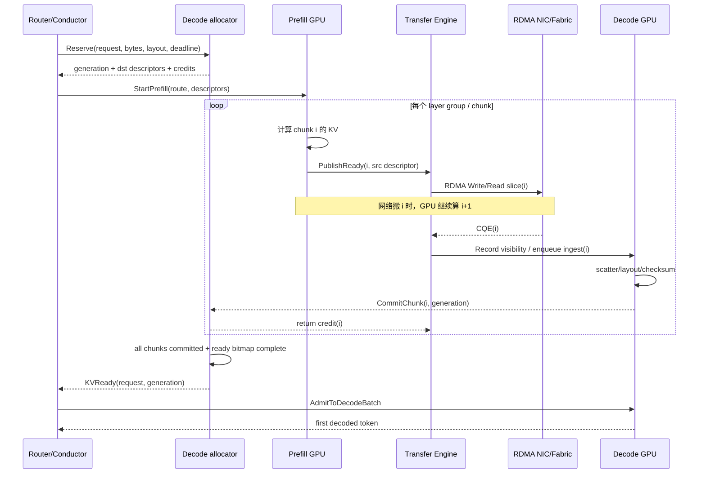
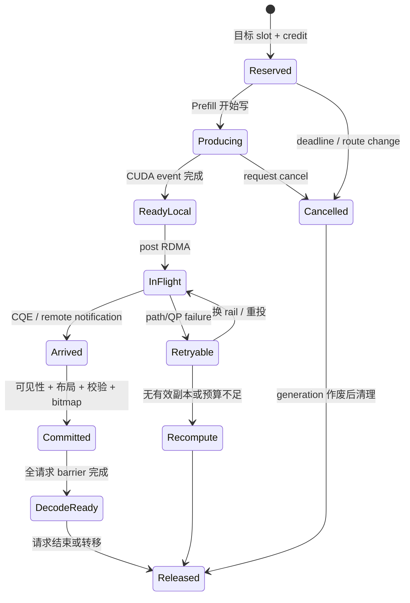
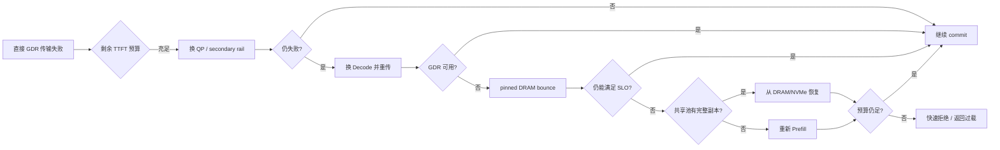

---
tags:
  - 高性能存储
  - AI-GPU-数据路径
  - LLM-Inference
  - KV-Cache
  - RDMA
  - PD-Disaggregation
aliases:
  - Prefill Decode Disaggregation
  - P/D 分离
  - KV Cache Transfer
status: 已完成
---

# PD 分离（Prefill-Decode Disaggregation）下的 KV Cache 网络传输架构

> [[8.4 KV Cache Offload]] 算过 KV Cache 的体积账，[[8.5 LMCache 与 Mooncake]] 解释了为什么要把它提升为集群级共享资源，[[8.14 分层缓存与 KV Cache 生命周期]] 与 [[8.15 Prefix 淘汰 一致性 与故障恢复]] 则分别处理了块生命周期和共享缓存正确性。本篇只盯住 PD 分离最危险的一段关键路径：**Prefill GPU 已经算出的 KV，怎样在 TTFT 预算内交给另一台 Decode GPU，并且在拥塞、目标显存不足、NIC/QP 故障和节点失联时不读错、不泄漏、不无限排队。**

主线一句话【事实/实践】：**PD 分离不是“算完后顺手复制一次”，而是把本地 HBM 中的中间状态改造成一个有身份、有布局、有租约、有完成协议的远程对象，并把它的传输尾巴压进 Prefill 计算阴影里。**

前置：[[8.12 GPUDirect RDMA]]（网卡如何直接 DMA 到 HBM）、[[4.4 内存注册与零拷贝]]（MR、lkey/rkey 与注册成本）、[[4.5 Send Recv 与 RDMA Read Write]]（双边/单边语义）、[[4.14 Fence 与内存可见性]]（CQE 不等于任意设备都已可见）、[[4.17 Retry RNR 与 Timeout]] 与 [[4.19 RDMA 故障恢复与连接重建]]（错误边界）、[[7.18 Backpressure 与过载保护]]（有界队列与准入）。

---

## 1. 为什么要拆：两种阶段需要不同的机器和调度器

一次自回归推理包含两个性质明显不同的阶段：

| 阶段 | 主计算形态 | 主要瓶颈 | 典型调度目标 | 主要 SLO |
| --- | --- | --- | --- | --- |
| Prefill | 对整段输入做大矩阵计算 | FLOPS、HBM 带宽、批量形状 | 大 batch、提高 MFU、快速吃完 prompt | TTFT |
| Decode | 每轮只新增一个 token，反复扫描历史 KV | HBM 容量与带宽、batch 驻留 | 聚合更多活跃序列、稳定连续批处理 | TPOT/TBT |

把两者混在同一批次里，长 prompt 会干扰正在逐 token 解码的请求，而且 Prefill 与 Decode 被迫使用同一套并行度和资源配比。DistServe、Splitwise 与 Mooncake 因而把两个阶段放到不同 GPU 池，并分别按 TTFT、TPOT/TBT 做容量规划与放置。[^distserve][^splitwise][^mooncake]

但拆分会引入一个本来不存在的网络依赖：

```text
同机执行：Prefill kernel → 本机 KV 页 → Decode kernel
PD 分离： Prefill kernel → 远程传输 → 目标内存发布 → Decode kernel
```

因此收益不是免费的。它成立需要同时满足：

1. 相位隔离与独立扩缩容带来的收益，大于 KV 搬运成本；
2. 目标 Decode 在接收前已经留出空间，而不是数据到达时才临时找显存；
3. 传输的大部分时间能与 Prefill 后续层/后续 chunk 计算重叠；
4. 慢路径不会无界拖长 TTFT，而是按剩余预算降级或快速失败。

> [!important] 先区分两个问题
> **Prefix Cache 取回**是“从共享池取以前算过的 KV”；**PD Handoff**是“把本次 Prefill 新生成的 KV 交给 Decode”。两者都搬 KV，但来源、生命周期与失败语义不同。Mooncake 把两条路径统一到了同一套 KVCache Store/Transfer Engine 中；工程账本里仍应分开记。

---

## 2. 先算字节：链路标称 800G，不代表任何 KV 都能在几十毫秒内搬完

### 2.1 普通 MHA/GQA 的逻辑体积

对未压缩的 K/V，单 token 的逻辑 KV 字节数可写成：

$$
S_{token}=2\times L\times H_{kv}\times D_{head}\times B_{dtype}
$$

- `2`：Key 与 Value 两份；
- `L`：Transformer 层数；
- `H_kv`：KV head 数；
- `D_head`：每个 head 的维度；
- `B_dtype`：元素字节数，例如 BF16/FP16 为 2 B。

[[8.4 KV Cache Offload]] 中的 70B GQA 示例为 `L=80, H_kv=8, D_head=128, B_dtype=2`，得到约 **320 KiB/token**【量级】。于是：

| 上下文长度 | 逻辑 KV 体积 | 400 Gb/s 原始下界 | 800 Gb/s 原始下界 |
| ---: | ---: | ---: | ---: |
| 8K token | 2.5 GiB | 53.69 ms | 26.84 ms |
| 32K token | 10 GiB | 214.75 ms | 107.37 ms |

这还没算协议头、PCIe/HBM 路径、队列等待、布局转换、同步、丢包重试和多租户争用。**若把整个 10 GiB KV 在 Prefill 结束后串行发送，即使独占单条 800G 链路，也不可能进入“数十毫秒 TTFT 尾巴”**。能做到的系统必然依赖下面至少一项：

- 逐层或逐 chunk 流水，把大部分传输藏进计算；
- 多 NIC/multi-rail 聚合；
- 更紧凑的注意力状态，如 GQA/MQA/MLA；
- 更低字节宽度或压缩，但必须把量化/反量化计入端到端预算；
- 让 Prefill 与 Decode 拓扑更近，必要时同节点或同高速域放置；
- 对预计无法满足 SLO 的请求提前拒绝，而不是排队到超时。

### 2.2 DeepSeek MLA 为什么会改变网络账

DeepSeek-V3 的公开配置使用 MLA：`61` 层、`kv_lora_rank=512`、`qk_rope_head_dim=64`。公开参考实现的优化分支缓存每层的 latent KV 与 positional encoding，而不是展开后的完整多头 K/V。按 BF16 做一个**逻辑状态量估算**：

$$
S_{token}^{MLA}\approx 61\times(512+64)\times 2
=70{,}272\ \text{B}\approx68.625\ \text{KiB/token}
$$

据此，8K/32K 上下文约为 549 MiB/2.145 GiB，对单条 400G 链路的原始下界约 11.51 ms/46.05 ms，对 800G 约 5.76 ms/23.03 ms【推导】。[^deepseek-config][^deepseek-model]

> [!warning] 这不是 DeepSeek 生产系统公布的“线上线速”
> 这是根据公开配置和参考实现推导的**逻辑缓存量**。实际 wire bytes 还取决于 tensor-parallel 切分、是否复制 positional 部分、量化格式、对齐、scale、页布局、跨 TP rank 的 gather/scatter，以及运行时是否直接传 latent state。不能拿这个数替代实测。

### 2.3 通用线速下界表

400 Gb/s 与 800 Gb/s 的十进制原始带宽分别是 50 GB/s 与 100 GB/s：

| Payload | 400G 原始下界 | 800G 原始下界 |
| ---: | ---: | ---: |
| 32 MiB | 0.67 ms | 0.34 ms |
| 256 MiB | 5.37 ms | 2.68 ms |
| 1 GiB | 21.47 ms | 10.74 ms |
| 4 GiB | 85.90 ms | 42.95 ms |

这张表只回答“光搬字节至少多久”，不回答应用 TTFT。端到端 goodput 应用有效字节除以 wall-clock 时间计算，而不是用 NIC 标称速率替代。

---

## 3. 用户可见延迟预算：先钉死“首 token 由谁发”

> [!important] `KV Handoff` 不一定总计入 TTFT
> 若 Prefill 节点计算完 prompt 后立即产生并对外发送第一个 token，KV 传输主要影响的是**第一、第二个 token 之间的 handoff gap/TBT**；Splitwise 的论文就采用这种口径。若系统规定 Decode 节点拿到完整 KV 后才生成或发布首 token，传输才直接落进 TTFT。工程设计必须同时记录 `first_token_owner` 与对外发布时间，不能把两个口径混成一个数字。[^splitwise-layer]

对“首 token 由 Decode 负责”的保守路径，可写成：

$$
TTFT_{decode-owned}=Q_P+T_{prefill}+T_{visible\_xfer}+T_{ingest}+Q_D+T_{first\_decode}
$$

若首 token 由 Prefill 负责，则另计：

$$
Gap_{handoff}=\max(0,\ T_{KVReady}-T_{first\_token\_published})
$$

用户所说的“数十毫秒预算”应理解为严格服务给 handoff/传输尾巴划出的子预算，而不是所有模型、所有上下文都共享的固定 TTFT。无论采用哪种首 token 契约，传输总时长都可拆成：

$$
T_{xfer}=T_{setup}+T_{register}+\frac{S_{wire}}{B_{goodput}}+T_{sync}+T_{layout}
$$

若传输与计算重叠：

$$
T_{visible\_xfer}\approx\max(0, T_{xfer}-T_{overlap})
$$

工程目标因此不是“让 `ib_write_bw` 跑到漂亮数字”，而是同时做到：

- `T_setup≈0`：QPs/endpoint、路由和远端元数据预热；
- `T_register≈0`：HBM/DRAM slab 在初始化时注册，热路径只切 descriptor；
- `B_goodput` 稳定：多 rail、拓扑亲和、足够 in-flight、没有 incast；
- `T_sync` 有界：每个 chunk 的完成通知不产生 CQ/doorbell 风暴；
- `T_layout` 被显式计量：跨 TP 度数、跨模型布局不能假装免费；
- `T_overlap` 尽量接近传输总时长：层/块一就绪就发，不等全模型算完。

NVIDIA 文档指出 GPU 内存 pin/映射可能花到毫秒级，因此逐请求注册会直接吞掉 TTFT 预算；推荐长期注册和 registration cache。[^gdr]

---

## 4. 总体架构：控制面先保留目的地，数据面再搬字节

![[图片/SVG/8_8_16_1.svg|1240]]

图中的关键分层如下：

1. **Conductor / Router（控制面）**：根据 TTFT 剩余预算、P/D 队列、KV 大小、GPU/NIC 拓扑和目标 HBM credit，选择一对 Prefill/Decode 实例；
2. **Destination Reservation（资源预留）**：Decode 先分配目标 block/slot，并返回 `generation + remote descriptor + rkey/handle + credit`；
3. **Transfer Engine（数据面）**：只接收 descriptor list，不解析业务 token；将逻辑 chunk 切成 transport slices，选择 GDR 或 bounce 路径并聚合多 NIC；
4. **Commit Protocol（完成面）**：CQE 只说明某个 RDMA operation 完成；目标端还要完成设备可见性、布局转换/散布、校验和 ready bitmap 发布，最后返回业务 commit ACK；
5. **Tiered Pool（恢复面）**：源 HBM、pinned DRAM、远端 DRAM/NVMe 形成保留副本或恢复来源，避免任一网络毛刺都强制重算。

Mooncake 的 Conductor 会先选定 Prefill/Decode 对，随后按 chunk/layer 连续流送 KV；其论文典型 workflow 把新生成 KV 异步流送到 Decode 节点 **CPU DRAM**，再进入 Decode GPU，而 Transfer Engine 接口本身同时面向 DRAM/VRAM，并在条件合适时使用 GPUDirect RDMA。图中的 HBM→HBM 是可采用的最短快路径，不是在声称 Mooncake 的典型 workflow 必然如此。[^mooncake]

---

## 5. 一次 Handoff 的控制协议

### 5.1 热路径不应该交换“大段元数据”

连接信息、NIC 列表、内存段注册信息和 remote segment identity 应在控制面预交换并缓存。NIXL 把 HBM、DRAM、NVMe、对象/文件等抽象为 Memory Section，由 agent 选择双方共同支持的 backend，并通过 side channel 或元数据服务交换远端 descriptor。[^nixl]

一次请求只需传递不可缺少的短 descriptor：

| 字段 | 作用 |
| --- | --- |
| `request_id` | 关联整个推理请求 |
| `generation` | 防止取消后 slot 被复用，旧完成写入新请求 |
| `model_fingerprint` | 权重、tokenizer、KV schema、量化和布局身份 |
| `layer_begin/end` | 该 chunk 覆盖的层区间 |
| `token_begin/count` | 覆盖的 token 区间 |
| `tp_rank/layout` | 源/目标切分与布局 |
| `src/dst_offset` | 注册 slab 中的偏移，不传裸生命周期 |
| `bytes/dtype` | wire size 与编码 |
| `checksum` | 检测错址、截断和数据损坏 |
| `mr_epoch/rkey_epoch` | 防止使用失效注册或旧 rkey |

### 5.2 目的地先给 credit，再允许 Prefill push

不能让多个 Prefill 无条件把数 GB 数据同时推向一个 Decode。正确顺序是：

```text
1. Router 选择 Decode 候选
2. Decode 预留 HBM/DRAM slot
3. Decode 返回 descriptor + byte credit + generation
4. Prefill 才开始生产并提交 chunk
5. Decode commit 后释放源副本与 reservation 账本
```

credit 至少要同时约束：

- 每个请求可占目标字节数；
- 每个 Decode 的总接收在途字节数；
- 每个 NIC rail 的在途 WR/bytes；
- pinned staging pool 的已借页数；
- 尚未 commit、源端不能释放的 retention bytes。

这与 [[7.18 Backpressure 与过载保护]] 的原则一致：**下游容量必须通过有限令牌反传，上游不能把“暂时接收成功”当作容量无限。**

---

## 6. Push、Pull 与 Hybrid：方向选择本质是“谁承担排队”

| 方案 | 发起方 | 优点 | 主要风险 | 代表设计 |
| --- | --- | --- | --- | --- |
| Push | Prefill 主动 RDMA Write/put | KV 一就绪就能发，容易做层间流水 | Decode 被突发灌爆；必须先 reservation/credit | Splitwise 的 one-sided put |
| Pull | Decode 按容量 RDMA Read/get | 接收方天然掌握节奏，容易压住 burst | Prefill 必须保留源 KV；目标晚拉会占源 HBM | DistServe |
| Hybrid | 先由 Decode 授权，再由一方执行 read/write | 同时保留流水和接收端控制 | 控制状态较复杂，要处理 lease/generation | Mooncake/NIXL 类抽象可支持 |

DistServe 明确使用 pull：Decode 需要时再取 KV，把 Prefill GPU 当作队列缓冲，避免 burst 把 Decode 内存冲垮。[^distserve-pull] Splitwise 则用 MSCCL++ 的 zero-copy one-sided put，在每个请求所有层写完后通过 semaphore 通知目标，并按 vLLM block 发送、合并连续块。[^splitwise-xfer]

工程上更稳妥的默认值是：

```text
Decode reserve + credit
        ↓
Prefill 按 ready chunk push，或 Decode 按 credit pull
        ↓
目标 commit ACK 才释放源副本
```

方向是实现选择，**reservation、credit、generation、commit** 才是不可省的正确性骨架。

---

## 7. 三种粒度不要混：KV block、流水 chunk、transport slice

### 7.1 Paged KV block：内存管理与复用单位

Paged Attention 按固定 token 数管理离散 KV 页，解决变长会话和碎片。Mooncake 的块通常按模型与最优网络粒度选择为 16～512 token【论文实现】。[^mooncake]

### 7.2 Pipeline chunk：什么时候允许传下一批

流水 chunk 决定计算与传输重叠边界，可以是：

- 一层的若干 token；
- 一组连续层；
- 一个 chunked-prefill token 段在若干层上的输出；
- 一个 TP rank 本地拥有的若干连续 block。

太粗：最后一大块形成可见尾巴。太细：每块都产生 descriptor、WQE、CQE、doorbell 和同步，CPU/NIC 固定成本反而主导。

Splitwise 对小 prompt 采用串行传输，对大 prompt 才采用 per-layer 异步传输；其测量中 per-layer 方案把大部分延迟隐藏在下一层计算中，但也指出细粒度同步可能干扰小 prompt。[^splitwise-layer]

### 7.3 Transport slice：multi-rail 的调度单位

Transfer Engine 可以把一个逻辑 chunk 再切成更小字节片，分别走多个 NIC/QP。Mooncake 实现使用 16 KiB slice 在不同路径间协作，这是特定实现参数，不应机械复制到所有系统。[^mooncake-xfer]

选择 transport slice 时至少满足两条约束：

$$
N_{inflight}\times S_{slice}\gtrsim B_{goodput}\times RTT
$$

左侧是可保持在途的数据，右侧是 BDP。若远小于 BDP，链路吃不满；但还必须：

$$
N_{inflight}\times S_{slice}\le Credit_{rail}
$$

否则只是把吞吐问题改造成 NIC WQE/CQ、交换机或目标内存的排队问题。

---

## 8. 逐层/逐 chunk 流水：完成事件如何交叉驱动



这张时序图揭示了代码中最容易漏掉的等待关系：

- Prefill 不等网络完成才计算下一块；
- Transfer Engine 的 CQE 只驱动目标 ingest，不直接驱动 Decode；
- Decode admission 等的是**整个请求的 commit barrier**，不是“最后一个 WQE 已 post”；
- credit 在 commit 后归还，防止目标 ingest 落后时仍持续灌流量。

### 8.1 何时可以更早开始 Decode

理论上，目标拿到开始解码所需的全部层/分片后即可进入第一轮 decode；但常见模型的第一轮 attention 需要所有层对应的历史状态，因此通常仍存在全请求 barrier。某些流水并行布局可以边接收边准备，减少 `T_ingest`，但不能在依赖尚未满足时把“部分 KV 到达”误写成“可以 decode”。

---

## 9. 显存/内存多级池化：快路径和恢复路径共用同一份账本

| 层 | 角色 | 正常用途 | 压力信号 | 释放条件 |
| --- | --- | --- | --- | --- |
| Prefill HBM | 生产源、最短保留副本 | 直接 GDR source / DistServe pull buffer | source retention bytes、free blocks | remote commit 或 lease 处理完毕 |
| Prefill pinned DRAM | 源端溢出/重试缓冲 | HBM 紧张时 D2H 后保留 | pinned pool low watermark | 远端 commit/请求取消清理 |
| Decode HBM | 最终工作集 | GDR 直接落点 | HBM credit、fragmentation | 请求结束/转移 |
| Decode pinned DRAM | bounce 与 ingest staging | 非 GDR、布局变换、先收后搬 | H2D queue、staging age | H2D + commit |
| 集群 DRAM | 共享温层 | Prefix 复用、节点重路由、短期恢复 | shard/replica 热点 | 淘汰策略 |
| NVMe/远端存储 | 冷层/灾难恢复 | 长尾缓存或 checkpoint | read latency、queue depth | TTL/LRU/容量策略 |

### 9.1 为什么源端不能在 RDMA post 后立即 free

`post_send()` 只把 WQE 交给 NIC，甚至 CQE 也只代表该 WR 的 transport completion。若目标还没完成布局散布、设备可见性和 generation 校验，源副本就是唯一可信恢复点。源端释放至少等待：

```text
remote commit ACK
或
明确取消 + 确认目标不会再提交旧 generation
或
lease 超时后的协调清理流程
```

这与 [[8.14 分层缓存与 KV Cache 生命周期]] 的“先撤销可见性，再回收物理空间”是同一条规则。

### 9.2 水位线必须逐层独立

HBM、pinned DRAM、NIC in-flight、目标 ingest queue、集群 DRAM 与 NVMe 都有自己的 High/Low watermark。只监控 HBM free bytes，会漏掉“显存有空但 H2D 队列或 NIC CQ 已经饱和”的情况。

---

## 10. GDR 快路径与 bounce 降级路径

### 10.1 GDR：GPU HBM → NIC → GPU HBM

GDR 允许网卡通过 PCIe peer-to-peer 直接访问 GPU 显存，绕开主机内存。正确落地仍有四个前提：

1. GPU/NIC 拓扑适合 P2P，最好只跨 PCIe switch，避免跨 socket/UPI；
2. HBM slab 已注册，BAR/registration cache 不在请求热路径抖动；
3. 远端 descriptor/rkey 与 allocation generation 匹配；
4. CQE 后通过 CUDA 同步/提交 API 建立“RDMA 写入完成 → 依赖 kernel 开始”的顺序，不能让 kernel 与正在被 RDMA 覆盖的区域并发读写。[^gdr]

这些条件已经在 [[8.12 GPUDirect RDMA]] 展开，本篇只强调：**GDR 删除的是 host bounce，不删除 reservation、完成协议和失败恢复。**

### 10.2 bounce：GPU → pinned DRAM → NIC → pinned DRAM → GPU

当 GDR 注册、拓扑、虚拟化或 backend 条件不满足时，可以退回 pinned DRAM：

```text
Prefill HBM --D2H--> Prefill pinned DRAM
             --RDMA/TCP--> Decode pinned DRAM
             --H2D--> Decode HBM
```

它多占两段 PCIe DMA、主机内存带宽和 staging pool，并多出两个 CUDA completion，因此必须单独统计 `fallback_visible_ms`。**降级路径能保证功能，不自动保证原 TTFT SLO。**

### 10.3 多 rail 不是简单地把带宽相加

multi-rail 要同时解决：

- GPU 到每张 NIC 的 PCIe/NUMA 路径；
- 每 rail 的独立 credit 与拥塞；
- slice 完成的聚合与乱序；
- 单 rail 故障时未完成 slice 的重映射；
- RoCE 网络中的 PFC/ECN/DCQCN 与 incast；
- 流量与训练/NCCL、MoE all-to-all 的 QoS 隔离。

相关网络机制见 [[4.6 RoCE 与 InfiniBand]] 与 [[4.7 PFC ECN 与 DCQCN]]。Mooncake 会为内存位置区分 preferred 与 secondary NIC，按拓扑选路并在临时故障时切到可达路径。[^mooncake-xfer]

---

## 11. 完成语义：CQE、Arrived、Committed、DecodeReady 是四件事

### 11.1 Chunk 状态机

![[图片/SVG/8_8_16_2.svg|1240]]



### 11.2 为什么 CQE 不等于 DecodeReady

| 事件 | 能证明什么 | 还不能证明什么 |
| --- | --- | --- |
| WQE post 成功 | NIC 接受了工作请求 | 数据离开源端、目标收到 |
| 本地 send CQE | 本地 WR 达到该 opcode 的完成语义 | 目标 CUDA kernel 已可安全读 |
| remote notification | 目标知道某批 slice 到达 | 所有 slice 完整、布局正确 |
| `Committed(chunk)` | 该 chunk 已校验并发布 | 其他 chunk 也已完成 |
| `KVReady(request)` | 请求所需 bitmap/barrier 完成 | 第一个 token 已生成 |

正确发布顺序应是：

```text
数据写入目标不可见区域
→ 传输完成
→ CUDA/设备同步与布局处理
→ 校验 descriptor/generation/checksum
→ release 发布 ready bitmap
→ 调度器 acquire 读取并允许 Decode
```

旧请求超时后，即使迟到 CQE/通知仍返回，也只能命中旧 `generation` 并被丢弃，不能写入已经复用给新请求的 slot。这就是 [[4.12 rkey lkey 生命周期]] 和 [[4.14 Fence 与内存可见性]] 在 KV Handoff 上的具体化。

### 11.3 重试为什么可以幂等

KV chunk 在发布后不可变，因此可以使用：

```text
identity = model_fingerprint + request/prefix identity
         + generation + layer range + token range + layout
```

相同 identity 的重传只允许覆盖同一 reservation 中尚未 commit 的区域；已经 commit 且 checksum 相同可返回成功，checksum 不同则是数据完整性故障，不能“最后写入者获胜”。

---

## 12. 故障与降级：按剩余 SLO 预算选择，不是无脑一路回退

### 12.1 故障分类

| 故障 | 典型信号 | 首选动作 | 不能做的事 |
| --- | --- | --- | --- |
| 单 rail/NIC 不可用 | QP error、CQ error、link down | 将未完成 slice 重映射到 secondary rail | 在坏 CQ/QP 上无限重试 |
| 对端 Decode 失联 | heartbeat/lease 失效 | 作废 generation，重选 Decode | 让旧目标和新目标都进入 Decode |
| 目标 HBM credit 不足 | reservation 拒绝/等待超预算 | 换 Decode、落目标 DRAM 或早拒绝 | 先发再找空间 |
| GDR 不可用 | MR 注册/backend/topology 失败 | 使用预注册 pinned bounce pool | 在热路径反复注册探测 |
| 数据校验失败 | checksum/length/layout mismatch | 重传；持续失败隔离路径/节点 | 发布“部分可用”KV |
| 源保留空间耗尽 | retention high watermark | 暂停接新 handoff、转 DRAM、准入限制 | post 后提前 free |
| 控制面 descriptor 过期 | epoch/generation 不匹配 | 刷新元数据并重建 reservation | 继续使用旧 rkey |

### 12.2 推荐降级阶梯

![[图片/SVG/8_8_16_3.svg|1240]]



这里最重要的分支不是“技术上还能不能继续”，而是“继续后是否还有机会满足用户 SLO”。DDIA 强调网络、进程和节点故障是部分失败，timeout 不能区分慢与死；因此每一次重试都必须受总 deadline、retry budget 和 generation 约束。[^ddia]

### 12.3 两种恢复哲学

- **保留源副本**：源端保留到 remote commit，恢复快但占 Prefill HBM/DRAM；
- **可重算**：将 KV 视作派生状态，丢失后重新 Prefill，状态简单但可能击穿算力和 TTFT。

实践通常混合：小请求或低价值请求更愿意重算；长上下文、高复用或昂贵 Prefill 更愿意保留/落共享池。选择依据就是 [[8.4 KV Cache Offload]] 的“取回成本 vs 重算成本”不等式，再加当前剩余 deadline。

---

## 13. 并行布局：网络搬的是每个 rank 真正需要的状态，不是抽象的“一个 KV”

### 13.1 Tensor Parallel 的三种交接方式

| 方式 | 数据路径 | 优点 | 代价 |
| --- | --- | --- | --- |
| rank-to-rank | P rank i → D rank i | 无额外 gather，路径直接 | 要求 TP 度数和布局兼容 |
| gather → bulk transfer → scatter | Prefill 聚合后跨机，Decode 再切分 | 大块更容易吃满链路 | 增加 HBM/NVLink/PCIe 流量与同步 |
| layout-aware remap | descriptor 列出多个 src/dst segment | 支持不同 TP 度数/页布局 | 控制面和完成聚合更复杂 |

因此 `S_wire` 不一定等于逻辑 KV 大小：复制的部分、padding、分片重排都会改变它。Benchmark 必须固定 `P_TP × D_TP × layout × dtype`，不能只报模型名和上下文长度。

### 13.2 MLA 与普通 GQA 的边界

MLA 让可缓存状态更紧凑，但仍要明确：

- 传的是 latent KV 还是展开 K/V；
- positional cache 是否按 rank 复制；
- Decode kernel 是否能直接消费该布局；
- Prefill/Decode 使用的 attention implementation 是否一致；
- 量化 scale 和 block metadata 是否随 payload 一起传。

公开 DeepSeek-V3 参考实现说明了 MLA 缓存形态，但没有定义一个通用、稳定的“DeepSeek PD wire protocol”。本篇的传输协议骨架来自 Mooncake、DistServe、Splitwise、NIXL/SGLang 等公开系统，不应把它错误归因成 DeepSeek 官方线上实现。[^deepseek-config][^deepseek-model][^sglang]

### 13.3 不要把 DeepEP 与 KV Handoff 混为一谈

DeepEP 面向 MoE expert-parallel 的 token dispatch/combine；PD Handoff 面向一次请求的 KV 状态迁移。两者都可能走 RDMA，并争用同一 NIC/fabric，但：

```text
DeepEP：每层反复发生的 all-to-all / dispatch-combine 流量
KV Handoff：阶段边界上的大对象 point-to-point 迁移
```

部署时应做 QoS、NIC/rail 规划和可观测性隔离，不能因为“都叫 RDMA”就放进同一个无界队列。

---

## 14. 公开系统的设计取舍对照

| 系统 | 核心目标 | 传输方向/机制 | 重叠粒度 | 目标内存与背压 | 故障边界 |
| --- | --- | --- | --- | --- | --- |
| DistServe | 消除 P/D 干扰，按 TTFT/TPOT 配置资源与放置 | Decode pull；原型跨节点使用 NCCL | 对应层到达后取；Prefill 保留 KV | Prefill GPU 作为排队缓冲，Decode 按需拉取 | 论文未实现高级 fault tolerance |
| Splitwise | 按阶段选硬件，优化成本/功耗/吞吐 | MSCCL++ zero-copy one-sided put + semaphore | 小 prompt 串行，大 prompt per-layer | 每请求 semaphore；block-by-block，可合并连续块 | 失败恢复不是论文重点，可重启/重算 |
| Mooncake | KVCache-centric 全局缓存与生产集群调度 | DRAM/VRAM read/write、GDR、multi-NIC Transfer Engine | chunked prefill + layer-wise async stream | 论文典型 handoff 先落 Decode DRAM；全局 DRAM/SSD 池与热点副本 | alternate path、endpoint pool、避开坏 RDMA 资源 |
| NIXL/SGLang 当前栈 | 为框架提供统一异构传输抽象与 PD 集成 | UCX/Mooncake 等 backend，HBM/DRAM/存储 descriptor | 框架决定 chunk/请求流水 | Memory Section、异步 handle/status、bootstrap/heartbeat/timeout | 远端 metadata invalidation、backend/peer 失败由框架协调 |

DistServe 与 Splitwise 是 2024 年论文，Mooncake 是 FAST 2025 生产系统论文；SGLang/NIXL 是持续变化的工程实现。对比时要锁定版本，不能把 2026 年框架能力倒灌成早期论文已经实现的特性。

---

## 15. 可观测性：必须能把 TTFT 尾巴归到具体阶段

### 15.1 每请求时间线

至少记录以下 monotonic timestamps：

```text
request_admit
route_selected
decode_reserved
prefill_start / prefill_end
first_chunk_ready
first_xfer_post / last_xfer_complete
first_chunk_commit / all_chunks_commit
decode_admit / first_token
```

由它们计算：

| 指标 | 含义 |
| --- | --- |
| `reserve_wait_ms` | 目标空间/credit 等待 |
| `xfer_total_ms` | 首个 post 到全部 transport completion |
| `xfer_visible_ms` | Prefill 结束后仍未被隐藏的传输尾巴 |
| `ingest_ms` | transport complete 到 all commit |
| `overlap_ratio` | 被 Prefill 计算隐藏的传输比例 |
| `source_retention_ms` | 源副本从 ready 到 remote commit 的占用时长 |
| `decode_queue_ms` | KVReady 后等待进入 decode batch 的时间 |

### 15.2 队列、带宽与错误指标

- 每 tier：used/free bytes、High/Low watermark、allocation failure；
- 每 rail：goodput、in-flight bytes/WR、CQ depth、retry/RNR/timeout、ECN/PFC 指标；
- 每请求：logical bytes、wire bytes、slice count、retry bytes、fallback reason；
- 注册：MR cache hit、register/deregister latency、BAR1 usage；
- 正确性：generation mismatch、checksum mismatch、duplicate commit、late completion；
- 调度：P/D queue、reservation reject、route change、SLO early reject；
- 尾延迟：chunk p50/p99、TTFT p50/p99/p99.9，按模型/上下文/TP/路径分桶。

《Systems Performance》强调先建立目标和性能模型，再按监控、USE、静态配置、负载刻画定位问题；高带宽网络还要检查协商速率、MTU、路由、NIC 固件/驱动、软件限速与队列，而不是看到“RDMA”就默认网络无瓶颈。[^systems-performance]

### 15.3 最小实验矩阵

1. **链路基线**：CPU MR 与 GPU MR 分别跑单 rail/multi-rail read/write bandwidth、latency；
2. **冷暖差异**：冷 QP/metadata/MR 与全部预热后的首请求；
3. **chunk sweep**：从小 slice 到大 chunk，观察 goodput、CQ/CPU、visible tail；
4. **并发与 incast**：1P→1D、NP→1D、NP→MD，观察目标 credit 与 p99；
5. **布局矩阵**：相同 TP、不同 TP、MLA/GQA、量化/非量化；
6. **路径对照**：GDR、pinned bounce、共享 DRAM、NVMe、recompute；
7. **故障注入**：断单 rail、QP error、目标进程退出、延迟 ACK、目标 HBM 耗尽、迟到 CQE；
8. **资源泄漏**：取消风暴后核对 source retention、reservation、MR、endpoint 和 block 数量回到基线。

性能报告必须同时给 payload、并发、拓扑、方向、TP、chunk、goodput 与 p99；只报“400G/800G 跑满”无法说明 TTFT 是否改善。

---

## 16. 高频错误与面试检查

### 16.1 “800G 就是应用稳定获得 100 GB/s”

错误。100 GB/s 是 raw line-rate 换算；端到端受协议、PCIe、内存、布局、并发、拥塞和实现效率限制。应用要看 goodput 与 p99。

### 16.2 “Prefill 完成后再把整个 KV 发过去即可”

长上下文下会留下数十到数百毫秒可见尾巴。正确方向是 layer/chunk ready 即传，并按大小在串行与细粒度流水之间切换。

### 16.3 “每次请求 `ibv_reg_mr(cuda_ptr)`”

错误。GPU pin/注册可能达到毫秒级，且消耗 BAR/网卡资源。应池化 allocation、长期注册、按偏移分配，注销与内存释放顺序受 epoch 管理。

### 16.4 “RDMA Write CQE 返回，Decode 就能直接读”

错误。还缺设备可见性、目标布局处理、checksum、generation 和 ready bitmap 发布。CQE 是 transport completion，不是业务 commit。

### 16.5 “Push 不经过 CPU，所以不会过载”

错误。CPU 不是唯一资源；目标 HBM slot、NIC CQ、PCIe、ingest stream 和 pinned pool 都会饱和。没有 reservation/credit 的 one-sided write 更容易制造内存与完成队列风暴。

### 16.6 “传输失败就自动切 TCP，功能总能成功”

功能可能成功，SLO 可能早已不可能。降级必须检查剩余 deadline；超预算应快速拒绝或重算到更合适节点，而不是让所有请求一起慢死。

### 16.7 “KV Cache 是缓存，丢了就无所谓”

语义上它通常可重算，但在运行时它也是正在执行请求的必要状态。丢失不会破坏持久数据，却会造成 TTFT 重算、Prefill 风暴、容量雪崩；故障域和重试预算仍需设计。

---

## 17. 实现检查表

- [ ] 先用模型/布局公式计算 logical bytes 与 wire bytes；
- [ ] 400G/800G 数字只作 raw 下界，实测 goodput 与 p99；
- [ ] QP/endpoint、远端 metadata 与 MR 在请求前预热；
- [ ] HBM/DRAM 使用长期注册 slab，不在热路径注册；
- [ ] Decode 先 reservation，再发 descriptor/credit；
- [ ] `generation + model_fingerprint + layout + epoch` 参与身份校验；
- [ ] 同一 chunk 区分 ReadyLocal、InFlight、Arrived、Committed；
- [ ] CQE 后有明确 CUDA/设备可见性链；
- [ ] 全请求 ready bitmap/barrier 完成后才进入 Decode batch；
- [ ] source retention 只在 remote commit 或安全取消后释放；
- [ ] block、pipeline chunk、transport slice 三种粒度分别配置；
- [ ] in-flight 至少覆盖 BDP，同时不超过目标/rail credit；
- [ ] multi-rail 按 PCIe/NUMA 拓扑选 preferred/secondary 路径；
- [ ] GDR 与 pinned bounce 的路径、指标和 SLO 分开；
- [ ] 单 rail、QP/CQ、对端失联、目标 HBM 不足均有故障注入；
- [ ] retry 受总 deadline、retry budget 和 generation 约束；
- [ ] 降级每一步都重新判断剩余 TTFT，不做无界慢路径；
- [ ] DeepEP/MoE 流量与 KV Handoff 做队列、QoS 与指标隔离；
- [ ] 取消风暴后所有 reservation、MR 引用、endpoint 和 KV block 可回收。

---

## 18. 总结：把 PD Handoff 压缩成六个动作

```text
算字节与剩余 TTFT
    → 选拓扑合适的 P/D 对
    → Decode 预留 slot 并发 credit
    → Prefill 按 layer/chunk 发布不可变 KV
    → GDR/multi-rail 异步传输并与计算重叠
    → 目标 commit barrier 后才 Decode，失败按预算降级
```

真正决定系统是否可靠的不是“用了 RDMA”这一个名词，而是以下四条不变量：

1. **无 reservation 不传**；
2. **无 generation 不写**；
3. **无 commit 不释放源副本**；
4. **无剩余 SLO 预算不继续慢重试**。

掌握这四条后，Mooncake、DistServe、Splitwise、SGLang/NIXL 的差异就可以还原为可比较的工程选择：谁发起传输、在哪一层切块、目标先落 HBM 还是 DRAM、怎样聚合多 rail、失败时保留什么副本，以及何时承认本次请求已经不可能满足 TTFT。

---

## 参考资料

### 论文与生产系统

[^mooncake]: Ruoyu Qin et al., “Mooncake: Trading More Storage for Less Computation — A KVCache-centric Architecture for Serving LLM Chatbot,” *23rd USENIX Conference on File and Storage Technologies (FAST ’25)*, pp. 155–170, 2025. https://www.usenix.org/conference/fast25/presentation/qin

[^mooncake-xfer]: 同上，§3.2.2–§3.2.3：预注册 DRAM/VRAM、GPUDirect RDMA、异步状态、多 NIC、拓扑感知、16 KiB slice、endpoint pool 与替代路径。

[^distserve]: Yinmin Zhong et al., “DistServe: Disaggregating Prefill and Decoding for Goodput-optimized Large Language Model Serving,” *OSDI ’24*, pp. 193–210, 2024. https://www.usenix.org/conference/osdi24/presentation/zhong-yinmin

[^distserve-pull]: 同上，§5：Decode 按需 pull KV，Prefill GPU 保留 KV 作为排队缓冲；论文同时说明高级 fault tolerance 不在其原型实现范围内。

[^splitwise]: Pratyush Patel et al., “Splitwise: Efficient Generative LLM Inference Using Phase Splitting,” *ISCA ’24*, 2024. https://www.microsoft.com/en-us/research/publication/splitwise-efficient-generative-llm-inference-using-phase-splitting/

[^splitwise-xfer]: 同上，§IV-C/§V-A：MSCCL++ zero-copy one-sided put、per-request semaphore、block-by-block 发送与连续块合并。

[^splitwise-layer]: 同上，§IV-C 与 Fig. 11/Fig. 14：小 prompt 串行传输，大 prompt 逐层异步传输；逐层传输与下一层计算重叠。

### 当前框架与官方文档

[^nixl]: NVIDIA, *NVIDIA Inference Xfer Library (NIXL) — Core Concepts and Architecture*. https://github.com/ai-dynamo/nixl/blob/main/docs/nixl.md （访问日期：2026-08-30）。

[^sglang]: SGLang, *PD Disaggregation*. 当前文档支持 Mooncake 与 NIXL transfer engine，并给出 DeepSeek 多节点部署与 bootstrap/heartbeat/waiting timeout 配置。https://github.com/sgl-project/sglang/blob/main/docs/docs/advanced_features/pd_disaggregation.mdx （访问日期：2026-08-30；具体参数随版本变化）。

[^gdr]: NVIDIA, *GPUDirect RDMA Documentation*, CUDA 13.3：PCIe peer path、拓扑限制、GPU memory pinning、registration cache 与同步/内存顺序。https://docs.nvidia.com/cuda/gpudirect-rdma/ （访问日期：2026-08-30）。

[^deepseek-config]: DeepSeek-AI, `DeepSeek-V3/inference/configs/config_671B.json`：公开参考配置中的层数、`kv_lora_rank`、`qk_rope_head_dim` 等。https://github.com/deepseek-ai/DeepSeek-V3/blob/main/inference/configs/config_671B.json （访问日期：2026-08-30）。

[^deepseek-model]: DeepSeek-AI, `DeepSeek-V3/inference/model.py`：MLA 优化实现中的 `kv_cache` 与 `pe_cache` 布局。https://github.com/deepseek-ai/DeepSeek-V3/blob/main/inference/model.py （访问日期：2026-08-30）。

### 教材与项目 Sources：稳定原理

[^systems-performance]: Brendan Gregg, *Systems Performance: Enterprise and the Cloud*, 2nd ed., Pearson, 2020, Chapter 2（性能目标、模型、USE）与 Chapter 10（网络 latency/throughput、buffering、队列、静态配置、微基准与观测）。

[^ddia]: Martin Kleppmann, *Designing Data-Intensive Applications*, 1st ed., O’Reilly, 2017, Chapter 8 “The Trouble with Distributed Systems”（partial failure、timeout 与不可靠网络）及 Chapter 11（流处理中的背压、确认与故障恢复原则）。

- Andrew S. Tanenbaum, Nick Feamster, David Wetherall, *Computer Networks*, 6th ed., Pearson, 2021, §5.3、§6.2.4 与 §6.7：拥塞、流控、buffering、主机设计和网络性能测量。
