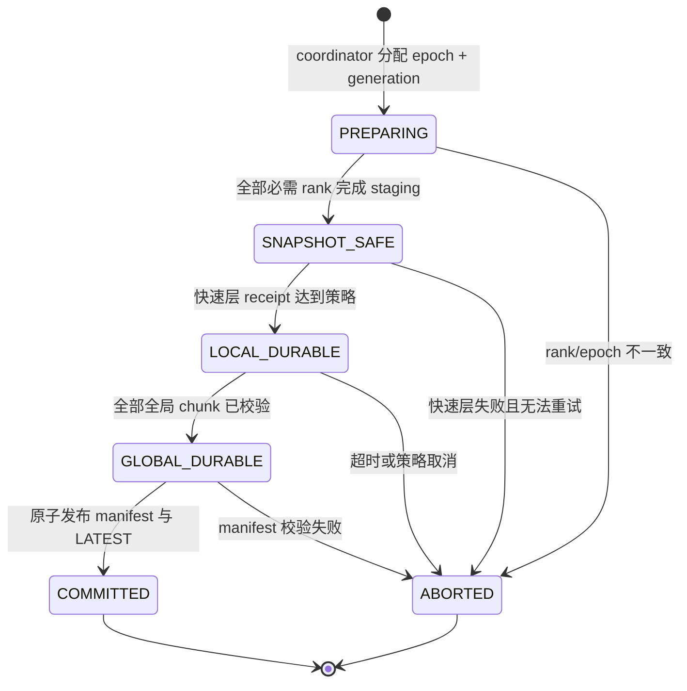

---
tags:
  - 高性能存储
  - AI-Infra
  - AI-GPU-数据路径
  - 分布式-Checkpoint
  - MegaScale
  - DeepSeek-3FS
  - NVMe-oF
  - SPDK
aliases:
  - 万卡 Checkpoint
  - Zero-Bubble Checkpoint
  - 多级异步 Checkpoint
阅读次数: 0
---

# 8.17 万卡集群分布式 Checkpoint 极致加速实践（MegaScale / DeepSeek 方案）

[[8.6 Checkpoint 同步异步分片]] 已经解释了模型、优化器、随机数状态为什么必须按 rank 分片保存，也建立了同步 Checkpoint、异步 Checkpoint、manifest 和 load-time resharding 的基础模型。本篇不再重复这些基础，而是继续回答一个更接近生产环境的问题：

> 当单个训练作业扩展到上万张 GPU 时，怎样让 Checkpoint **尽量不形成训练气泡**，同时又能在节点、机架和全局存储故障下真正恢复？

> [!abstract] 核心结论
> 万卡 Checkpoint 不是一次 `save()`，而是一条**版本化、有界、可恢复的多级持久化流水线**：
>
> ```text
> 一致性快照边界
> → GPU HBM 到 Host Pinned Memory
> → 本地 NVMe 或机架级 NVMe-oF 快速暂存
> → 3FS / Ceph / HDFS / S3 等全局持久层
> → 校验全部分片后发布 manifest
> ```
>
> 高性能来自把慢介质移出训练关键路径；正确性来自不可变分片、完成回执、校验和、manifest 和 fencing；稳定性来自有界缓冲、背压与资源隔离。三者缺一不可。

> [!important] 本篇对标题中“方案”的证据边界
> - **MegaScale 公开事实**：论文明确公开了“GPU 状态先写 Host Memory，再由后台进程异步写 HDFS”的两阶段 Checkpoint，以及恢复时“每个共享状态组只由一个 worker 读取，再广播”的优化。
> - **DeepSeek 公开事实**：3FS 是面向 AI 训练与推理的 RDMA + SSD 分布式文件系统，并明确把高吞吐并行 Checkpoint 列为目标工作负载。
> - **工程综合方案**：Host Pinned → 本地 NVMe / NVMe-oF-SPDK 快速池 → 3FS/Ceph/S3、Delta Checkpoint、硬件压缩、双 manifest 与 fencing，是基于公开机制组合出的生产设计，不能伪装成 MegaScale 或 DeepSeek 已公开的完整实现。

---

## 0. 为什么上万张 GPU 会把 Checkpoint 变成系统问题

MegaScale 报告了在 12,288 张 GPU 上训练 175B 模型、达到 55.2% MFU 的生产系统；论文同时指出，在这种规模上故障与慢节点更接近常态而不是例外。[^megascale]

即使每张 GPU 或每台服务器的故障概率不变，集群规模扩大后，整个作业观察到故障的频率仍会显著上升。用一个只用于建立直觉的独立故障近似：

$$
\lambda_{job} \approx N \lambda_{device}
$$

其中 $N$ 是参与作业的设备数量。这个公式不考虑相关故障、交换机故障和软件故障，真实系统通常比独立模型更复杂。

Checkpoint 周期为 $P$，故障在周期内近似均匀发生时，平均丢失计算量约为：

$$
E[T_{lost}] \approx \frac{P}{2}
$$

于是系统同时承受两个相反压力：

- 减小 $P$：降低故障后的重算量，但提高 Checkpoint 流量和资源干扰；
- 增大 $P$：降低存储压力，但一次故障会丢失更多训练进度。

传统“所有 rank 停下来、直接写全局文件系统、全部完成后继续”的方案会把最慢 rank、最慢网络路径和最慢存储请求直接放进训练关键路径。万卡规模下，真正决定停顿的是尾部：

$$
T_{sync\_ckpt} \approx \max_{r \in ranks} T_r + T_{coordination}
$$

因此，本篇优化目标不是让某一块 SSD 的顺序写带宽更高，而是同时降低：

1. 训练可见停顿 `pause`；
2. 后台排空的积压和尾延迟；
3. 最新可恢复点与当前训练进度的距离；
4. 故障恢复时的全局读放大。

这与《Systems Performance》的基本方法一致：存储和网络都应被视作具有 utilization、saturation、errors 和 queueing 的资源，而不是只看峰值带宽。[^systems-performance]

---

## 1. 先区分四个完成状态

异步 Checkpoint 最危险的误解，是把“数据已经离开 GPU”误认为“Checkpoint 已经安全”。

| 状态 | 语义 | 能否释放或覆盖什么 | 能抵抗的故障 |
|---|---|---|---|
| `PREPARING` | 正在选定 epoch、建立快照视图 | 不能复用源状态 | 无 |
| `SNAPSHOT_SAFE` | 已形成不会再被训练修改的 staging 副本 | 可以继续修改原 GPU 状态 | 仅保证训练与序列化不串版本 |
| `LOCAL_DURABLE` | 快照已落到本机 NVMe 或机架快速池并完成校验 | 可以复用 pinned slot | 取决于快速池故障域 |
| `GLOBAL_DURABLE` | 全部分片已进入全局后端并可读取 | 可以清理本地副本，但尚未必可被发现 | 可抵抗计算节点丢失 |
| `COMMITTED` | manifest 已原子发布，恢复端可以发现完整 epoch | 可以推进 `LATEST` | 形成正式恢复点 |

PyTorch Distributed Checkpoint 当前把异步保存拆成 `staging_completion` 和 `upload_completion`：前者表示本地副本完成，后者表示保存完成；其 `AsyncStager` 还明确要求 staged state 必须与后续训练更新隔离。[^pytorch-dcp]

这正好说明：

```text
staging complete ≠ storage durable ≠ checkpoint committed
```

> [!danger] 不能用一个 `future.done()` 表示全部语义
> 如果一个布尔值同时代表“GPU 可继续修改”“本地盘已写完”“全局存储已提交”，故障恢复时就无法判断数据到底处在哪一层，也无法安全回收 pinned buffer、NVMe 空间和临时对象。

### 1.1 三个必须分别度量的时间

定义：

$$
T_{pause} = T_{quiesce} + T_{critical\_stage} + T_{release}
$$

$$
T_{local} = T_{LOCAL\_DURABLE} - T_{trigger}
$$

$$
T_{global} = T_{COMMITTED} - T_{trigger}
$$

- $T_{pause}$：训练真正等待的时间；
- $T_{local}$：快速恢复副本形成的时间；
- $T_{global}$：全局正式恢复点形成的时间。

系统可以做到 $T_{pause}$ 很小而 $T_{global}$ 仍很大。若只展示“Checkpoint 耗时 2 秒”，却不说明测的是哪一个状态，指标没有可比性。

---

## 2. “零气泡”到底意味着什么

本篇把 Zero-Bubble Checkpoint 定义为：

> Checkpoint 的绝大部分工作与后续训练重叠，使训练 step 的 P99 几乎不因 Checkpoint 周期而产生可见尖峰。

它不表示：

- HBM 到 Host 的字节不需要搬运；
- PCIe、HBM、CPU 内存带宽和 NIC 没有被占用；
- 原始张量可以在 DMA 尚未完成时被下一次 optimizer update 原地修改；
- 全局持久化已经完成；
- 可以无限叠加尚未排空的 Checkpoint。

MegaScale 公开方案把 HBM→Host staging 缩短到数秒，随后让 GPU worker 继续训练，后台进程再写 HDFS。它是非常有效的两阶段异步 Checkpoint，但论文并没有声称关键路径严格为零。[^megascale-ckpt]

要进一步逼近“零可见气泡”，必须解决的是**源状态可变性**：

```mermaid
sequenceDiagram
    participant Train as 训练主循环
    participant Opt as Optimizer
    participant Ckpt as Checkpoint CUDA Stream
    participant Host as Pinned Slot
    participant Drain as 后台排空进程
    participant Global as 全局存储

    Train->>Opt: optimizer.step(k)
    Opt->>Ckpt: record(state_ready[k])
    Train->>Train: forward/backward(k+1)
    activate Train

    Ckpt->>Ckpt: wait(state_ready[k])
    Ckpt->>Host: cudaMemcpyAsync(chunk 0..n)
    activate Ckpt
    Note over Train,Ckpt: 仅当源张量在复制完成前保持不可变时才可重叠

    Train->>Ckpt: 下一次 optimizer.step 前等待 staging_completion
    Ckpt-->>Train: SNAPSHOT_SAFE
    deactivate Ckpt
    deactivate Train

    par 训练继续
        Train->>Opt: optimizer.step(k+1)
    and 后台持久化
        Host->>Drain: 移交不可变 slot
        Drain->>Global: 分片写入 + checksum
        Global-->>Drain: upload receipt
    end
```

这张图揭示了代码中最容易漏掉的依赖：D2H copy 可以与下一步 forward/backward 重叠，但如果 optimizer 会原地改写同一份参数或状态，必须在下一次改写前确认 staging 完成。PyTorch 官方异步 DCP 教程采用的就是这种边界。[^pytorch-async-recipe]

### 2.1 三种实现等级

| 等级 | 做法 | 训练停顿 | 内存代价 | 复杂度 |
|---|---|---:|---:|---:|
| A | optimizer step 后同步 D2H，再继续训练 | 约等于 staging 时间 | 1 个 Host slot | 低 |
| B | D2H 与下一步 forward/backward 重叠，在下次 optimizer step 前等完成 | 仅剩未隐藏尾部 | 1～2 个 Host slot | 中 |
| C | GPU 侧版本化、双缓冲或 Copy-on-Write，使下一次更新不覆盖旧版本 | 可继续压低 | 额外 HBM/元数据 | 高 |

等级 C 不是“免费异步”。它用 GPU 内存容量、复制量和版本管理复杂度交换更小的停顿。对超大模型，额外复制一份完整 optimizer state 通常不可接受，因此实际系统更常采用 chunk 级流水和有限版本，而不是完整双份 HBM。

> [!note] 研究补充：DataStates-LLM
> DataStates-LLM 利用模型与 optimizer shard 在部分时间窗口内保持不可变的事实，设计 lazy asynchronous multi-level checkpointing。论文评估到 180 张 GPU，并在其特定实验中报告最高 48× Checkpoint 加速和 2.2× 端到端训练提速。它可以证明“不可变窗口 + 多级异步”是有效研究方向，但这些数字不是万卡生产集群结果，不能直接外推。[^datastates]

---

## 3. 三级下刷、四层介质的总体架构

![[图片/SVG/8_8_17_1.svg|1340]]

图中的“三级下刷”是三段传输：

1. HBM → Host Pinned；
2. Host Pinned → 快速暂存层；
3. 快速暂存层 → 全局持久层。

但介质层次共有四层。分层的基本理由与通用存储层次相同：越靠近计算，容量通常越小、速度越快；越远离计算，容量与故障隔离能力提高，访问成本也上升。[^computer-architecture]

> [!important] 修正“节点本地 NVMe-oF/SPDK”的混用
> - **节点本地 NVMe**：PCIe 直连本机 SSD，通常不经过网络；
> - **NVMe-oF**：通过 RDMA 或 TCP 访问远端 NVMe namespace，属于解耦块存储；其协议与故障域见 [[5.1 NVMe-oF 架构]]；
> - **SPDK**：用户态、异步、轮询式 I/O 软件栈，可驱动本地 NVMe，也可作为 NVMe-oF host/target；它不是一种存储介质，驱动模型见 [[5.13 SPDK NVMe Driver]]。
>
> 因此正确的候选层应写成：
>
> ```text
> 本地 NVMe 临时池
> 或
> 机架级 NVMe-oF 快速池（可由 SPDK 实现 host/target）
> ```

DeepSeek 3FS 的公开 README 和设计文档描述的是 RDMA、SSD、分布式文件接口和异步客户端；其组件与 I/O 路径可先读 [[7.4 3FS 架构]]。本篇没有在其公开文档中找到“以 SPDK 为 3FS 底层实现”的依据，因此不会把 3FS 与 SPDK 强行绑定。[^3fs]

本篇选择 Host staging 路线，而不是让存储直接访问 GPU buffer。[[8.12 GPUDirect RDMA]] 适合解释另一条可能的数据路径，但采用它之后仍然要重新解决 tensor 不可变窗口、注册内存生命周期、完成通知和 manifest，不能仅凭“绕过 Host”获得一致 Checkpoint。

---

## 4. Stage 0：先建立一致性快照，而不是先调用 I/O

### 4.1 一次 Checkpoint 必须属于一个确定 epoch

建议使用：

```text
checkpoint_epoch = optimizer_step
snapshot_generation = coordinator_lease_generation
```

一个 epoch 至少记录：

- global step、consumed tokens、learning-rate scheduler；
- 参数、master weights、optimizer moments；
- AMP scaler；
- RNG state 与 data-loader cursor；
- DP/TP/PP/EP 拓扑和分片规则；
- 框架版本、模型 schema、dtype、endianness；
- parent checkpoint，仅用于增量链；
- generation/fencing token。

### 4.2 安全点通常放在 optimizer step 边界

对典型同步训练，最容易推理的一致性点是：

```text
本 step 的梯度同步完成
→ optimizer update 完成
→ scheduler / scaler / RNG 游标进入同一逻辑步
→ 记录 state_ready event
→ 开始 staging
```

不能只复制权重，却把 optimizer moments、随机数或数据游标留在相邻 step。这样的 Checkpoint 文件可能全部可读，恢复后却不代表任何真实训练时刻。

### 4.3 避免全局长 barrier，但不能没有协议边界

万卡系统应避免“所有 rank 等最慢 rank 完成整个持久化”的长 barrier。更合理的是：

1. coordinator 分配 epoch 和 generation；
2. 各 rank 在本地安全点建立快照；
3. 只对“快照 epoch 是否一致”进行短协调；
4. 后续写入以 rank-local 异步流水继续；
5. coordinator 根据 receipt 集合决定能否发布 manifest。

短协调和无协调不是同一件事。完全不核对 epoch、拓扑和必需分片集合，会让不同 rank 的数据混入同一个 Checkpoint。

---

## 5. Stage 1：GPU HBM → Host Pinned Memory

[[8.10 Host Device Memory 与 Pinned Memory]] 已经解释了 pinned memory 的页锁定语义；[[8.11 cudaMemcpy 与 CUDA Stream]] 解释了 `cudaMemcpyAsync`、CUDA stream 和 event。本节只讨论它们在 Checkpoint 中的组合。

### 5.1 目标不是“调用异步 API”，而是形成不可变所有权

每个 pinned slot 建议使用显式状态：

```text
FREE
→ D2H_FILLING
→ SNAPSHOT_SAFE
→ LOCAL_FLUSHING
→ LOCAL_DURABLE
→ GLOBAL_FLUSHING
→ RECLAIMABLE
```

slot owner 只能沿状态机单向移交。训练线程只在 `D2H_FILLING` 阶段持有源张量依赖；后台进程从 `SNAPSHOT_SAFE` 起只处理 Host 副本。

### 5.2 预分配与双缓冲

不要在触发 Checkpoint 时临时申请数百 GB pinned memory。推荐启动时按容量预算建立 2～3 个固定 slot：

```text
slot A：本轮 D2H
slot B：上一轮下刷
slot C：可选的抖动吸收
```

slot 数量不是越多越好。若平均后台排空时间为 $T_{drain}$，Checkpoint 周期为 $P$，只从容量角度看：

$$
N_{slots} \ge \left\lceil \frac{T_{drain}}{P} \right\rceil + 1
$$

但无限增加 slot 只会把背压推迟为 Host OOM。因此还必须设置硬上限和超限策略。

### 5.3 NUMA 与 pinned memory 不是细节

一台多 GPU 服务器通常有多个 CPU socket、PCIe root complex 和 NIC。若 GPU 通过一个 socket 搬到另一个 NUMA node 的 pinned memory，再由远端 NIC 发出，会额外穿过 CPU 互连。

每个 GPU/rank 应尽量绑定：

```text
GPU
↔ 最近的 CPU NUMA node
↔ 该 NUMA 的 pinned pool
↔ 最近的 NVMe / RNIC
```

需要记录每个 chunk 的实际路径，而不是只看聚合 D2H 带宽。

### 5.4 Chunk 化与 CUDA event

完整状态应拆成固定上限的 chunk，例如 64～512 MiB 作为起始实验范围，而不是一次提交超大复制：

- chunk 太小：event、调度、元数据和 I/O 请求开销上升；
- chunk 太大：流水深度不足，单次尾延迟和重试代价上升；
- 每个 chunk 完成后即可进入压缩、校验或下刷；
- 最后一个必需 chunk 完成后，rank 才能上报 `SNAPSHOT_SAFE`。

具体大小属于硬件和框架相关参数，必须通过 [[9.1 fio Benchmark Matrix]] 风格的矩阵实验决定，不能把一个集群的经验值当标准答案。

### 5.5 Pinned memory 的失败模式

- 页锁定过多挤压普通 DRAM、文件缓存与其他进程；
- 临时分配引发尾延迟；
- staging 尚未完成就复用 slot；
- 子进程拿到指针却没有正确的共享内存/IPC 生命周期；
- CUDA event 只表示 DMA 完成，不表示后端落盘；
- CPU 压缩与 D2H 同时打满内存带宽，反而放大 step P99。

---

## 6. Stage 2：Host → 本地 NVMe 或机架级 NVMe-oF 快速池

这一层的目标不是取代全局存储，而是：

- 尽快释放昂贵的 pinned slot；
- 吸收全局后端的秒级或分钟级抖动；
- 为进程重启、部分节点重启提供更快恢复源；
- 把大量小分片合并成适合后端的大对象或大文件。

### 6.1 两种快速层不能混为一谈

| 维度 | 节点本地 NVMe | 机架级 NVMe-oF 快速池 |
|---|---|---|
| 路径 | PCIe 直连 | RNIC/以太网 → 远端 target |
| 典型优势 | 低延迟、不占用存储网 | 计算节点故障后仍可能保留 |
| 故障域 | 计算节点一起丢失 | target/机架/网络故障域 |
| 软件路径 | 内核 NVMe、io_uring 或 SPDK | Linux NVMe-oF 或 SPDK host/target |
| 适合角色 | spill cache、进程级恢复 | rack-level burst buffer |
| 主要风险 | 节点故障即丢、容量碎片 | 与训练通信争网、target 热点 |

SPDK 的用户态 NVMe 驱动支持异步 queue pair 和轮询完成，也支持连接远端 NVMe-oF target；其 NVMe-oF target 可通过 RDMA 或 TCP 暴露 block device。[^spdk]

### 6.2 SPDK 应放在哪一层理解

```text
介质：local NVMe / remote NVMe namespace
协议：NVMe / NVMe-oF
软件栈：kernel block stack / io_uring / SPDK
文件或对象组织：checkpoint spool format
```

SPDK 只能优化其中的软件 I/O 路径。它不会自动提供：

- 跨节点复制；
- manifest；
- 租约与 fencing；
- Checkpoint epoch 一致性；
- 对象生命周期；
- 全局命名空间；
- RPO/RTO 策略。

### 6.3 快速池的数据布局

推荐写 append-only immutable extents：

```text
/spool/<job_id>/<epoch>/<rank>/<chunk_id>.part
```

每个 extent 携带：

```text
magic | format_version | epoch | generation
rank | logical_tensor | offset | raw_size | stored_size
codec | checksum_type | checksum | payload
```

完整写入、flush 并校验后，再生成 rank receipt。不要让恢复端根据“目录里有哪些文件”猜测完整性。

### 6.4 I/O 路径优化

- 使用对齐的大块顺序写；
- 预分配文件或 extent，降低元数据抖动；
- queue depth 逐步升高，直到吞吐不再增长或 P99 开始恶化；
- 使用 scatter-gather 减少额外拼接；
- 直接 I/O 时显式处理对齐、短 I/O 和尾块；
- poll-mode 路径单独预留 CPU core，不能从训练进程“偷”满核；
- 设置 per-job 和 per-node token bucket，防止万卡同时下刷形成 incast。

---

## 7. Stage 3：快速池 → 全局持久层

### 7.1 不同后端的语义不同

理解 Ceph 的对象放置与复制前，可先读 [[7.5 Ceph RADOS 与 CRUSH]]；对象后端的调用链与大对象分段上传分别见 [[7.7 对象存储路径]]、[[7.8 Multipart 与 Range GET]]。

| 后端 | 接口模型 | 典型提交方式 | 优势 | 需要特别处理 |
|---|---|---|---|---|
| HDFS | 分布式文件系统 | 临时路径 → 完整文件 → 元数据提交 | MegaScale 公开部署使用 | NameNode/文件数、恢复读放大 |
| 3FS | RDMA + SSD 分布式文件系统 | 并行写文件 + 完整性元数据 | 面向 AI 工作负载、共享文件接口 | 版本兼容、客户端与集群部署约束 |
| CephFS | POSIX 文件系统 | 临时文件/目录 + rename 或 manifest | 统一 Ceph 集群、文件语义 | MDS 元数据压力、客户端缓存语义 |
| RADOS / RGW | 对象接口 | immutable objects + manifest | 对象级并行与复制/EC | 对象数、PG/OSD 热点、提交协议 |
| S3 | 对象 API | multipart + immutable parts/object + manifest | 跨区域与托管生态 | 不依赖目录 rename；用条件写保护 `LATEST` |

3FS 明确是**分布式文件系统**，不是对象存储。Ceph 同时提供 object、block 和 file 接口。S3 才是对象 API。把三者都叫“远端对象存储”会掩盖命名空间、提交和恢复路径的差异。[^3fs][^ceph][^s3]

### 7.2 3FS 能证明什么，不能证明什么

3FS 公开资料说明：

- 使用现代 SSD 与 RDMA 构建解耦共享存储；
- 以 CRAQ 提供强一致性；
- 提供文件接口；
- 把大规模并行 Checkpoint 列为目标工作负载；
- 公开 read-stress 测试在 180 个存储节点、500 多个客户端上达到约 6.6 TiB/s 聚合读取吞吐。[^3fs]

最后一个数字是**读压力测试**，不是万卡 Checkpoint 的端到端提交带宽，也不包含训练干扰、manifest、校验和或故障恢复。因此只能作为聚合存储能力的公开证据，不能直接代入本系统的 $T_{global}$。

### 7.3 后台 uploader 的职责

后台 uploader 不是简单的 `cp`：

1. 读取 `LOCAL_DURABLE` extent；
2. 可选压缩和内容哈希；
3. 按后端并发与速率预算分片上传；
4. 重试可重试错误，但保持对象 key 幂等；
5. 获取后端回执并读回必要元数据；
6. 上报 chunk receipt；
7. 全部分片满足策略后，参与 manifest commit；
8. 延迟回收本地 extent，保留最近若干 epoch 作为 fast restore cache。

上传成功只说明单个 chunk 成功，不能单独推进 `LATEST`。

---

## 8. Manifest：从“全部文件存在”变成原子恢复点

### 8.1 推荐的不可变对象布局

```text
checkpoints/<job_id>/epochs/<epoch>/chunks/<rank>/<chunk_hash>
checkpoints/<job_id>/epochs/<epoch>/manifest.json
checkpoints/<job_id>/LATEST
```

- chunk 和 epoch manifest 一旦写入不再原地修改；
- `LATEST` 只保存已提交 epoch、manifest hash 和 generation；
- 恢复端只读取 `LATEST` 指向的 manifest；
- 孤儿 chunk 由后台 GC 根据保留策略清理。

### 8.2 Manifest 最小字段

```json
{
  "format_version": 3,
  "job_id": "train-175b-a",
  "epoch": 41700,
  "generation": 23,
  "parent_epoch": 41600,
  "topology": {
    "world_size": 12288,
    "dp": 128,
    "tp": 8,
    "pp": 12,
    "ep": 1
  },
  "state_schema": "model-v19-adamw-v4",
  "chunks": [
    {
      "logical_owner": "optimizer.exp_avg.layer_42",
      "rank": 1837,
      "offset": 0,
      "raw_bytes": 268435456,
      "stored_bytes": 191233112,
      "codec": "lz4",
      "checksum": "sha256:...",
      "location": "3fs:///ckpt/..."
    }
  ]
}
```

这里的 `rank` 只是保存时的物理 owner；`logical_owner + offset + schema` 才是恢复时重分片的依据。

### 8.3 提交状态机



### 8.4 为什么需要 generation/fencing

场景：

```text
旧 coordinator A 卡顿
→ lease 过期
→ 新 coordinator B 提交 epoch 41800
→ A 恢复并晚到，试图把 LATEST 改回 41700
```

若没有 fencing，旧进程可能覆盖新恢复点。每次 coordinator lease 必须获得单调递增 generation；`LATEST` 更新应使用后端支持的 compare-and-swap、条件写或事务。

对 S3，可使用 immutable manifest，并用 `If-Match`/`If-None-Match` 保护单 key 更新；multipart 只解决大对象分片上传，不自动解决跨 rank 原子提交。[^s3-conditional]

> [!warning] ETag 不应被无条件当作内容哈希
> multipart、加密和不同后端会改变 ETag 语义。端到端完整性应使用显式 SHA-256、CRC32C 或经验证的后端 checksum 字段，并把算法写进 manifest。

---

## 9. 增量快照：Delta Checkpoint 的收益与陷阱

> [!info] 证据标签：工程扩展
> MegaScale 公开论文和 3FS 公开 README 支持两阶段异步与并行持久化，但没有公开一套“万卡增量 Checkpoint”实现。本节是架构扩展。

### 9.1 基本模型

完整基线 $C_0$ 加若干 delta：

```text
C0(full)
 ├─ Δ1
 ├─ Δ2
 └─ Δ3
```

恢复 epoch 3 时需要：

$$
State_3 = Apply(C_0, \Delta_1, \Delta_2, \Delta_3)
$$

一个 chunk 是否复用父版本，可由：

- optimizer/框架维护的 dirty bitmap；
- tensor version counter；
- chunk 内容哈希；
- 稀疏 expert、LoRA 或冻结层的显式 owner 元数据；
- 相同 DP 副本之间的内容寻址去重。

### 9.2 Dense Adam 的现实：几乎所有状态都可能变化

对密集训练：

```text
weight        每步更新
exp_avg       每步更新
exp_avg_sq    每步更新
master weight 通常每步更新
```

因此“只保存变化参数”可能仍接近全量。若为了找 delta 先扫描和哈希所有字节，还会额外消耗 HBM/DRAM 带宽。

Delta 更可能在以下场景有价值：

- 稀疏 MoE：本周期只有部分 experts 活跃；
- LoRA/Adapter：基座权重冻结；
- curriculum 或阶段训练：大块状态长期不变；
- 重复的 DP 副本可做逻辑去重；
- metadata、scheduler 和 dataloader cursor 很小；
- tensor 使用 Copy-on-Write 或版本计数，本来就知道 dirty 范围。

### 9.3 Chain depth 必须有界

若 delta 链无限增长：

- restore 需要读取大量小对象；
- 任一父版本损坏会影响全部子版本；
- metadata 和 GC 复杂度上升；
- resharding 必须跨多代合并；
- 恢复尾延迟变得不可预测。

建议：

```text
每 M 次生成一个 full checkpoint
或
累计 delta bytes > α × full bytes 时重做 full
或
restore 预算超过阈值时后台 compact
```

### 9.4 Delta 的发布规则

- parent 必须仍处于 `COMMITTED`；
- delta manifest 必须记录 parent hash；
- GC 先算引用图，再删除旧 full；
- compact 生成新的不可变 full，而不是原地修改旧链；
- restore 先验证整条依赖链，再向训练暴露状态。

---

## 10. 硬件压缩：先算 break-even，再决定放在哪一层

### 10.1 保存路径的收益条件

设原始大小为 $S$，压缩后比例为 $r$，目标瓶颈带宽为 $B$，压缩时间为 $T_c$：

无压缩：

$$
T_{raw}=\frac{S}{B}
$$

有压缩：

$$
T_{compressed}=T_c+\frac{rS}{B}
$$

只有当：

$$
T_c < \frac{(1-r)S}{B}
$$

压缩才可能缩短这段保存路径。恢复路径还要加入解压时间 $T_d$：

$$
T_{restore}=\frac{rS}{B_{read}}+T_d+T_{deserialize}
$$

所以压缩比高并不自动代表 RTO 更好。

### 10.2 压缩放置矩阵

| 位置 | 可以减少 | 会竞争 | 典型实现 |
|---|---|---|---|
| GPU HBM 内 | PCIe、Host、网络和后端字节 | GPU SM、HBM 带宽、临时显存 | NVIDIA nvCOMP 等 |
| Host DRAM | NVMe/网络/后端字节 | CPU、DRAM 带宽、NUMA | ISA-L、zstd、QAT/IAA 等 |
| 快速池后台 | 全局网络与容量 | NVMe 读放大、后台 CPU | spool compactor |
| 存储后端 | 容量、后端内部流量 | 后端 CPU/加速器 | Ceph/object-store 策略 |

NVIDIA nvCOMP 提供 GPU 上的无损压缩/解压接口和多种 codec，并提供 GPU CRC32；Intel QAT/IAA 等平台则可把部分压缩工作从通用 CPU core 卸载。[^nvcomp][^qat]

### 10.3 不同张量的可压缩性差异很大

- 近似随机的 FP16/BF16 权重与 moments 可能压缩率有限；
- 大量零值、稀疏索引、重复 metadata 更容易压缩；
- Delta 后的小块可能太小，无法摊薄 codec 启动成本；
- 高压缩比 codec 可能降低吞吐，并增加 restore CPU；
- 应按 tensor class 采样，而不是用一个 ratio 代表整个 Checkpoint。

### 10.4 无损压缩与训练态量化不是一回事

```text
LZ4 / Zstd / GDeflate：恢复后字节完全一致
FP16 → FP8 / int8：改变数值，是有损状态变换
```

有损 Checkpoint 需要单独证明收敛、数值稳定性与恢复一致性，不能作为普通压缩开关上线。

### 10.5 校验和也应流水化

可以让：

```text
D2H chunk i
与
压缩/校验 chunk i-1
与
NVMe 写 chunk i-2
并行
```

但每一阶段都要有有界 in-flight 数。不能为了“流水更深”让 checksum task、compression task 和 I/O request 无上限堆积。

---

## 11. 后台排空稳定性与背压

本节把 [[7.18 Backpressure 与过载保护]] 的有界队列原则应用到 Checkpoint：当下游变慢时，系统必须收敛产生速率，而不是继续把状态堆进 pinned memory。

### 11.1 平均输入速率必须小于可用排空速率

设每次实际输出字节为 $S_{out}$，Checkpoint 周期为 $P$，后台有效带宽为 $B_{drain}$，给训练与系统抖动预留系数 $\eta<1$：

$$
\frac{S_{out}}{P} < \eta B_{drain}
$$

等价地：

$$
P > \frac{S_{out}}{\eta B_{drain}}
$$

若长期不满足，任何有限内存或 NVMe cache 最终都会填满。更多 buffer 只延迟失败，不会改变稳定性。

### 11.2 高低水位与策略

```text
backlog < LOW
    正常触发

LOW ≤ backlog < HIGH
    降低上传并发抖动、合并旧 delta、延迟非关键 Checkpoint

backlog ≥ HIGH 且 RPO 仍安全
    跳过/合并本次 Checkpoint

backlog ≥ HIGH 且 RPO 将违规
    在下一个安全点节流或阻塞训练
```

不能静默覆盖：

- 当前正在提交的 epoch；
- 最新 `COMMITTED`；
- 被 delta child 引用的 parent；
- 正在被 restore 使用的版本。

### 11.3 网络隔离

万卡同时启动上传会形成 incast。可采用：

- rack-aware aggregator；
- per-rack token bucket；
- 按 rank 哈希加入 jitter；
- 独立存储 NIC/rail；
- DSCP/traffic class 与交换机 QoS；
- Checkpoint 与 NCCL 通信分别设带宽上限；
- 上传并发由实时 ECN/PFC、queue depth 和训练 step P99 调节。

所谓“后台”只描述执行线程，不表示没有资源竞争。后台 I/O 仍会争夺 PCIe、DRAM、LLC、NIC、交换机和 SSD。

---

## 12. 恢复路径：写得快不够，还要恢复得快

[[7.17 Recovery 与 Rebuild]] 解释了故障域与重建流量；Checkpoint 恢复还要额外处理训练拓扑、重复状态和逻辑 tensor 分片。

![[图片/SVG/8_8_17_2.svg|1340]]

这张图完整呈现了万卡集群在发生故障后的全链路恢复决策与重分片流水线：**先验合法性与回退边界，再根据故障域选择近端快速池或全局持久层，结合组内广播消减存储读放大，并通过 Load-time Resharding 解耦物理拓扑后安全恢复训练。**

### 12.1 恢复源选择

优先级不是固定“本地一定优先”，而是：

1. epoch 必须已 `COMMITTED`；
2. 数据必须完整且校验通过；
3. 故障域必须仍然可达；
4. 估算的完成时间最短；
5. 不能让恢复流量再次压垮存储。

若故障导致整台计算节点丢失，它的本地 NVMe 也随之不可用；此时机架池或全局存储才有价值。

### 12.2 Load-time resharding

保存时 world size 与恢复时可能不同。manifest 应描述 logical tensor partition，而不是要求“rank 1837 必须恢复 rank 1837 文件”。

PyTorch DCP 公开文档明确支持在一种集群拓扑保存、另一种拓扑加载时 resharding。[^pytorch-dcp]

### 12.3 恢复时间模型

粗略拆分：

$$
T_{restore} \approx
\frac{S_{unique}}{B_{backend}}
+
\frac{S_{replicated}}{B_{collective}}
+
T_{decompress}
+
T_{deserialize}
+
T_{reshard}
+
T_{init}
$$

其中 $S_{unique}$ 是必须从后端读取的唯一数据，$S_{replicated}$ 是读取一次后可在组内广播的数据。这个模型解释了为什么“每 rank 独立读取”不是唯一方案。

---

## 13. 失败矩阵

| 故障点 | 正确行为 | 不能做什么 |
|---|---|---|
| rank 在 `SNAPSHOT_SAFE` 前退出 | 整个 epoch abort 或补齐策略重新执行 | 把其他 rank 分片当完整 Checkpoint |
| staging 完成后 uploader 退出 | 从 pinned/local receipt 重启上传 | 重新读取已被训练改写的 GPU 状态 |
| 计算节点连同本地 NVMe 丢失 | 改从机架池或全局层恢复 | 把 `LOCAL_DURABLE` 误当全局安全 |
| NVMe-oF target 故障 | 多路径/failover，或回退全局层 | 无限等待占住 pinned slot |
| 全局后端变慢 | 有界排队，依据 RPO 跳过、节流或阻塞 | 无界堆积 Checkpoint |
| chunk checksum 不匹配 | 重传或回退旧 epoch | 仍发布 manifest |
| coordinator 退出 | 新 lease/generation 收集已有 receipts | 允许旧 coordinator 晚到覆盖 `LATEST` |
| 旧 uploader 晚到 | 对象幂等；generation 不匹配则拒绝发布 | 用“最后写入者获胜”更新恢复点 |
| delta parent 被误删 | 引用图保护，或回退 full | 仅按时间删除旧目录 |
| world size 改变 | load-time reshard | 依赖保存 rank 编号直接映射 |
| 压缩库/格式升级 | manifest 固定 codec/version，保留兼容 reader | 用当前默认参数猜旧数据格式 |

《Designing Data-Intensive Applications》强调分布式系统存在 partial failure，输出只有在完整完成后才应变为可见；Checkpoint manifest 正是把这个原则应用到训练状态。[^ddia]

---

## 14. 容量与性能模型

### 14.1 Checkpoint 总量

设全局参数量为 $P_{model}$，每参数保存的字节包括权重、master weight 与 optimizer states：

$$
S_{global} \approx P_{model}
\times
(b_{weight}+b_{master}+b_{moment1}+b_{moment2})
+S_{metadata}
$$

这只是上界模型。实际大小取决于 optimizer、精度、是否保存梯度、ZeRO/FSDP 分片、参数冻结、重复副本去重和 padding。

### 14.2 单 rank staging 下界

$$
T_{stage,rank} \gtrsim
\frac{S_{rank}}
{\min(B_{HBM\_read},B_{PCIe},B_{host\_write})}
+T_{serialize}
+T_{sync}
$$

实际值还会受到 NUMA、共享 PCIe switch、并发 GPU、page locking 和 chunk 调度影响。

### 14.3 训练可见开销

若每 $K$ 个 step 触发一次，平均 step 时间为 $T_{step}$：

$$
Overhead_{visible}
\approx
\frac{T_{pause}}
{K\cdot T_{step}}
$$

这个比值不包含后台竞争导致的 step 变慢。因此还应比较 Checkpoint 开启与关闭时的正常 step P50/P99 和 MFU。

### 14.4 Goodput

在窗口 $W$ 内：

$$
Goodput =
\frac{T_{useful\_training}}
{T_{useful\_training}+T_{pause}+T_{recovery}+T_{recompute}+T_{interference}}
$$

Checkpoint 优化最终要提高 goodput，而不是只让某一个 `save()` benchmark 更快。

### 14.5 Young 一阶近似只能作为初始估算

Young 的一阶近似把同步 Checkpoint 成本 $C$ 与作业 MTBF $M$ 组合：

$$
P_{Young} \approx \sqrt{2CM}
$$

Daly 等后续模型还会纳入 Checkpoint 自身时长、恢复和重启成本。对异步多级系统，$C$ 应如何定义更不直接：训练可见 staging、后台资源干扰、RPO、缓存容量和全局 commit lag 都会改变最优值。因此该公式只适合给出初始范围，不应替代线上闭环控制。

---

## 15. 必须观测的指标

### 15.1 训练关键路径

```text
checkpoint.trigger.count
checkpoint.pause.duration.{p50,p99,p999}
checkpoint.staging.duration
checkpoint.staging.unhidden_tail
training.step.duration.{p50,p99,p999}
training.mfu
cuda.d2h.bandwidth
cuda.checkpoint_stream.wait
```

### 15.2 Pinned 与快速层

```text
pinned.slot.total / free / filling / blocked
pinned.bytes
spool.write.bandwidth
spool.write.latency
spool.queue_depth
spool.capacity.utilization
spool.oldest_epoch_age
nvme.media_errors
nvmf.path_failover
```

### 15.3 全局持久层

```text
upload.bytes_per_second
upload.inflight_chunks
upload.retry_rate
upload.oldest_backlog_age
checkpoint.global_commit_lag
checkpoint.rpo_age
manifest.commit.duration
manifest.fencing_reject
checksum.failure
orphan.bytes
```

### 15.4 恢复

```text
restore.source.local / rack / global
restore.read_amplification
restore.backend_bandwidth
restore.broadcast_bandwidth
restore.decompress.duration
restore.reshard.duration
restore.total.duration.{p50,p99}
rollback.steps / rollback.tokens
```

平均吞吐不能替代 backlog age、saturation 和 P99。一个系统即使平均每秒能排空 1 TiB，也可能因周期性 tail stall 导致 pinned slots 同时占满；排查方法可沿用 [[9.5 p99 毛刺定位]] 的时间对齐与分层二分。

---

## 16. Benchmark 与故障注入计划

### 16.1 Microbenchmark：只测一段路径

| 实验 | 自变量 | 观测量 |
|---|---|---|
| D2H | pageable/pinned、chunk、stream 数 | 带宽、GPU stall、Host BW |
| GPU 压缩 | codec、chunk、stream、数据类型 | ratio、SM/HBM 占用、端到端时间 |
| Host 压缩 | CPU/QAT/IAA、NUMA、线程数 | ratio、CPU、DRAM BW、P99 |
| local NVMe | io_uring/SPDK、QD、块大小 | GB/s、CPU、P99、写放大 |
| NVMe-oF | RDMA/TCP、路径数、target 数 | 网络利用率、P99、failover |
| 后端 | 3FS/Ceph/S3、并发与对象大小 | commit lag、重试、对象/文件数 |

### 16.2 Node benchmark：检查资源竞争

同时运行代表性训练 kernel 和 Checkpoint pipeline，比较：

```text
baseline training
+ D2H only
+ D2H + compression
+ D2H + local NVMe
+ full background upload
```

重点看 step P99、MFU、HBM 带宽、PCIe、Host DRAM、LLC、CPU steal 和 NIC，而不是只看保存吞吐。

### 16.3 Rack/cluster benchmark

- rank 数逐步扩展，不能直接从 8 卡跳到万卡；
- 制造 synchronized incast 与随机 jitter 两种模式；
- 限制后端带宽，验证 backlog 是否稳定；
- 混入正常训练读流量和其他租户；
- 记录每机架分布，避免聚合平均值掩盖热点；
- 使用 MLPerf Storage Checkpointing/DLIO 类工作负载作为补充，但仍要复现本模型的真实 state layout。[^mlperf-storage]

### 16.4 必做故障注入

1. D2H 中途 kill rank；
2. `SNAPSHOT_SAFE` 后 kill uploader；
3. 写完 chunk、写 manifest 前 kill coordinator；
4. 断开一条 NVMe-oF path；
5. 让全局存储返回慢请求、限流和部分失败；
6. 篡改一个 chunk；
7. 让旧 coordinator 延迟恢复并提交；
8. 删除一个 delta parent；
9. 以不同 world size 恢复；
10. 在恢复过程中再次故障。

只有通过故障注入，才能证明“异步”没有把错误从关键路径藏到恢复时才暴露。

---

## 17. MegaScale、3FS 与工程综合的对应关系

| 能力 | MegaScale 公开 | 3FS 公开 | 本篇工程扩展 |
|---|---:|---:|---:|
| HBM → Host 两阶段 staging | 是 | 不属于 3FS 职责 | chunk/event/双 slot 细化 |
| Pinned memory | 是 | 不属于 3FS 职责 | NUMA 与有界池 |
| 后台写全局存储 | HDFS | 3FS 可作为目标 | 快速层再下刷 |
| 并行 Checkpoint | 分片 worker | 明确支持该工作负载 | rack admission control |
| 恢复 leader read + broadcast | 是 | 可提供读取后端 | 拓扑感知 leader 选择 |
| 本地 NVMe burst buffer | 未公开 | 3FS storage node 使用 SSD | 计算侧 local spool |
| NVMe-oF/SPDK 快速池 | 未公开 | 未找到公开绑定 | 可选架构 |
| Delta Checkpoint | 未公开 | 未公开 orchestration | dirty/hash/compaction |
| 硬件压缩 | 未公开 | 未公开 orchestration | nvCOMP/QAT/IAA 评估 |
| Manifest/fencing | 论文未展开 | 文件系统有自身一致性 | 跨 rank checkpoint commit |

这个表是面试时最重要的证据纪律：

> **可以说“受 MegaScale 两阶段 Checkpoint 和 3FS 高吞吐共享存储启发，设计三级下刷流水线”；不能说“DeepSeek 已公开使用 SPDK + Delta + nvCOMP 完成该方案”。**

---

## 18. 高频面试题

> [!question]- 1. 为什么 HBM→Pinned 完成后还不能说 Checkpoint 已经安全？
> 它只形成 training-safe 副本，使原 GPU 状态可以继续被修改。Host DRAM 仍会随节点掉电或故障丢失；只有全局 chunk 完整、校验通过并发布 manifest 后，才形成正式恢复点。

> [!question]- 2. Zero-Bubble 是否意味着不等待 CUDA copy？
> 不意味着。D2H 可以与下一步 forward/backward 重叠，但下一次 optimizer 原地修改同一状态前必须确认旧版本已经复制完，除非系统使用 GPU 侧双缓冲、Copy-on-Write 或其他版本化方案。

> [!question]- 3. 为什么增加本地 NVMe 层？
> 它快速释放 pinned memory、吸收全局后端抖动，并提供进程级快速恢复。但它与计算节点处在同一故障域，不能替代全局持久层。

> [!question]- 4. NVMe-oF 和 SPDK 是同一个东西吗？
> 不是。NVMe-oF 是远程 NVMe 协议；SPDK 是可实现本地 NVMe 与 NVMe-oF host/target 的用户态 I/O 软件栈。一个是协议/访问模型，一个是实现路径。

> [!question]- 5. 3FS 是对象存储吗？
> 不是。3FS 对外提供共享文件接口，底层使用 SSD、RDMA、chunk 与复制机制。Ceph 可提供对象、块和文件接口；S3 是对象 API。

> [!question]- 6. 为什么 Dense Adam 的 Delta Checkpoint 可能收益很小？
> 权重、master weight、first moment 和 second moment 通常每步都会变化。若大多数 chunk 都 dirty，delta 的字节数接近 full，还增加哈希、索引、父链和恢复合并成本。

> [!question]- 7. 压缩放在 GPU 还是 CPU？
> 看真正瓶颈。GPU 压缩能更早减少 PCIe 与网络字节，但会竞争 SM/HBM；CPU/硬件加速压缩不占 GPU，却可能竞争 DRAM 和 CPU。用 break-even 公式和训练共跑实验决定。

> [!question]- 8. 对象存储没有目录 rename，怎样提交？
> 先写 immutable chunks，再写 immutable manifest，最后对 `LATEST` 做条件写/CAS。恢复端只相信 `LATEST` 指向且 hash 匹配的 manifest。

> [!question]- 9. 后台速度长期低于 Checkpoint 产生速度怎么办？
> 有界 buffer 最终一定填满。系统必须跳过或合并非关键 Checkpoint、降低触发频率、增加后端带宽，或在 RPO 将违规时节流训练；不能继续无界排队。

> [!question]- 10. 为什么恢复时每个 rank 独立读不一定最好？
> 3D 并行中部分状态在 DP 等组内重复。由一个 leader 从后端读取一次，再通过高带宽 collective 广播，可以降低后端读放大；MegaScale 公开采用了这一思路。

---

## 19. 实现检查表

### 一致性

- [ ] epoch 与 optimizer step 一致；
- [ ] 参数、optimizer、RNG、scheduler、dataloader cursor 属于同一逻辑时刻；
- [ ] 源 tensor 在 D2H 完成前不会被下一次 update 覆盖；
- [ ] `SNAPSHOT_SAFE`、`LOCAL_DURABLE`、`GLOBAL_DURABLE`、`COMMITTED` 分开；
- [ ] 所有 chunk 都是 immutable；
- [ ] manifest 含 schema、拓扑、generation、checksum 和 parent。

### 性能

- [ ] pinned pool 启动时预分配并有硬上限；
- [ ] GPU、CPU、NVMe、RNIC 做 NUMA/PCIe 亲和；
- [ ] chunk 大小、QD、并发和 codec 经过矩阵实验；
- [ ] 后台 I/O 有 token bucket 和网络 QoS；
- [ ] 训练 step P99/MFU 与 Checkpoint 吞吐一起评估；
- [ ] 平均产生速率小于保守排空速率；
- [ ] delta chain depth、full 周期和 GC 有界。

### 可靠性

- [ ] `LATEST` 使用 fencing/条件写，旧 coordinator 不能回退版本；
- [ ] chunk 在发布前完成端到端校验；
- [ ] 本地快速层的故障域被明确记录；
- [ ] 全局后端失败不会导致无界 pinned/NVMe 积压；
- [ ] restore 支持回退到前一个 committed epoch；
- [ ] reshard、解压和旧格式 reader 已验证；
- [ ] 所有临时 multipart、孤儿 extent 和旧 delta 有安全 GC。

### 观测与演练

- [ ] 分别记录 pause、local durable、global commit；
- [ ] 监控 backlog bytes 与 oldest age；
- [ ] 监控 checksum、retry、fencing reject 和 path failover；
- [ ] 每种故障点都做 kill/partition/corruption 注入；
- [ ] 定期执行真实 restore，而不是只验证“文件存在”。

---

## 20. 总结

1. 万卡 Checkpoint 的核心指标不是单次 `save()` 带宽，而是训练 goodput、RPO 与 RTO。
2. “零气泡”指大部分工作移出关键路径，不代表 D2H、压缩和 I/O 没有资源成本。
3. 一致性边界必须先于 I/O：源 tensor 在 staging 完成前不能被下一次 optimizer update 覆盖。
4. MegaScale 公开了 HBM→Host Pinned→后台 HDFS 的两阶段方案，并在恢复时用组内 leader read + broadcast 降低读放大。
5. 生产架构可以在 Host 与全局后端之间增加本地 NVMe 或机架级 NVMe-oF burst buffer，以快速释放 pinned slot 和吸收抖动。
6. NVMe-oF 是远程块协议，SPDK 是用户态 I/O 栈；两者都不是 manifest 或 Checkpoint 协议。
7. 3FS 是 RDMA + SSD 分布式文件系统，可承担高并行全局层；它不是对象存储，公开资料也不足以证明其使用 SPDK。
8. `SNAPSHOT_SAFE`、`LOCAL_DURABLE`、`GLOBAL_DURABLE` 与 `COMMITTED` 必须使用不同状态和指标。
9. 正式恢复点由不可变 chunks、校验和、receipt、manifest 和 fencing 共同定义。
10. Delta Checkpoint 对密集 Adam 可能接近全量，必须用 dirty ratio 与 restore chain 成本决定是否启用。
11. 硬件压缩只有在节省的 I/O 时间大于压缩与解压成本时才有价值，并且不能破坏训练状态的无损语义。
12. 后台产生速率长期大于排空速率时，任何有限 buffer 都会耗尽；背压和 RPO 策略必须是架构的一部分。
13. 恢复路径必须与保存路径共同设计，包括本地/全局源选择、leader broadcast、解压、校验和 resharding。
14. 最终验收必须在真实训练竞争下观察 step P99/MFU，并通过节点、网络、后端、manifest 和数据损坏故障注入。

---

## 参考资料

### 公开论文与项目文档

1. Ziheng Jiang et al., *MegaScale: Scaling Large Language Model Training to More Than 10,000 GPUs*, arXiv:2402.15627, 2024，尤其 §4.4 “Fast Checkpointing and Recovery”。  
   https://arxiv.org/abs/2402.15627
2. DeepSeek, *Fire-Flyer File System (3FS)* README 与 Design Notes，访问日期：2026-08-30。  
   https://github.com/deepseek-ai/3FS
3. PyTorch, *Distributed Checkpoint — torch.distributed.checkpoint*，`AsyncSaveResponse`、`AsyncStager`、`DefaultStager` 与 load-time resharding，访问日期：2026-08-30。  
   https://docs.pytorch.org/docs/stable/distributed.checkpoint.html
4. PyTorch, *Asynchronous Saving with Distributed Checkpoint (DCP)*，访问日期：2026-08-30。  
   https://docs.pytorch.org/tutorials/recipes/distributed_async_checkpoint_recipe.html
5. Avinash Maurya et al., *DataStates-LLM: Lazy Asynchronous Checkpointing for Large Language Models*, HPDC 2024 / arXiv:2406.10707。该论文评估到 180 GPUs；其 48× Checkpoint 加速和 2.2× 端到端提升是论文特定实验结果，不外推为万卡生产数据。  
   https://arxiv.org/abs/2406.10707

### 存储、压缩与基准官方文档

1. SPDK, *What is SPDK*、*NVMe Driver*、*NVMe over Fabrics Target*，访问日期：2026-08-30。  
   https://spdk.io/doc/about.html  
   https://spdk.io/doc/nvme.html  
   https://spdk.io/doc/nvmf.html
2. NVIDIA, *nvCOMP Documentation*，访问日期：2026-08-30。  
   https://docs.nvidia.com/cuda/nvcomp/
3. Intel, *QuickAssist Technology Documentation*，访问日期：2026-08-30。  
   https://intel.github.io/quickassist/
4. Ceph, *Architecture*、*RADOS*、*CephFS*，访问日期：2026-08-30。  
   https://docs.ceph.com/en/latest/architecture/  
   https://docs.ceph.com/en/latest/rados/  
   https://docs.ceph.com/en/latest/cephfs/
5. Amazon S3, *Multipart upload*、*Conditional writes* 与 *Data consistency model*，访问日期：2026-08-30。  
   https://docs.aws.amazon.com/AmazonS3/latest/userguide/mpuoverview.html  
   https://docs.aws.amazon.com/AmazonS3/latest/userguide/conditional-writes.html  
   https://docs.aws.amazon.com/AmazonS3/latest/userguide/Welcome.html
6. MLCommons, *MLPerf Storage Benchmark Suite*，Checkpointing workload，访问日期：2026-08-30。  
   https://github.com/mlcommons/storage

### 项目 Sources 教材

1. John L. Hennessy, David A. Patterson, *Computer Architecture: A Quantitative Approach*, 6th ed., Chapter 2 “Memory Hierarchy Design”。
2. Randal E. Bryant, David R. O’Hallaron, *Computer Systems: A Programmer’s Perspective*, 2nd ed., Chapter 6 “The Memory Hierarchy”，尤其 write-back、dirty state 与 locality。
3. Brendan Gregg, *Systems Performance: Enterprise and the Cloud*, 2nd ed., Chapters 2、7、9、10、12：queueing、utilization、saturation、memory、disk、network 与 benchmark methodology。
4. Martin Kleppmann, *Designing Data-Intensive Applications*, 1st ed., Chapters 5、8、9、11：partial failure、idempotence、atomic commit、checkpointing 与可见性边界。

[^megascale]: Ziheng Jiang et al., *MegaScale: Scaling Large Language Model Training to More Than 10,000 GPUs*, arXiv:2402.15627, Abstract、§1、§6，2024。
[^megascale-ckpt]: 同上，§4.4 “Fast Checkpointing and Recovery”。
[^datastates]: Avinash Maurya et al., *DataStates-LLM: Lazy Asynchronous Checkpointing for Large Language Models*, HPDC 2024 / arXiv:2406.10707。
[^pytorch-dcp]: PyTorch, *Distributed Checkpoint — torch.distributed.checkpoint*, `AsyncSaveResponse`、`AsyncStager`、`DefaultStager` 与 resharding，访问日期：2026-08-30。
[^pytorch-async-recipe]: PyTorch, *Asynchronous Saving with Distributed Checkpoint (DCP)*，官方教程中的 `staging_completion` / `upload_completion` 边界，访问日期：2026-08-30。
[^3fs]: DeepSeek, *Fire-Flyer File System (3FS)* README 与 Design Notes，访问日期：2026-08-30。
[^spdk]: SPDK, *What is SPDK*、*NVMe Driver*、*NVMe over Fabrics Target*，访问日期：2026-08-30。
[^ceph]: Ceph, *Architecture*、*RADOS*、*CephFS*，访问日期：2026-08-30。
[^s3]: Amazon S3, *Multipart upload* 与 *Data consistency model*，访问日期：2026-08-30。
[^s3-conditional]: Amazon S3, *How to prevent object overwrites with conditional writes*，访问日期：2026-08-30。
[^nvcomp]: NVIDIA, *nvCOMP Documentation*，访问日期：2026-08-30。
[^qat]: Intel, *QuickAssist Technology Documentation*，访问日期：2026-08-30。
[^mlperf-storage]: MLCommons, *MLPerf Storage Benchmark Suite*，Checkpointing benchmark，访问日期：2026-08-30。
[^computer-architecture]: Hennessy and Patterson, *Computer Architecture: A Quantitative Approach*, 6th ed., Chapter 2。
[^systems-performance]: Brendan Gregg, *Systems Performance: Enterprise and the Cloud*, 2nd ed., Chapter 2 以及 Memory/Disk/Network 章节。
[^ddia]: Martin Kleppmann, *Designing Data-Intensive Applications*, 1st ed., Chapters 8、9、11。
