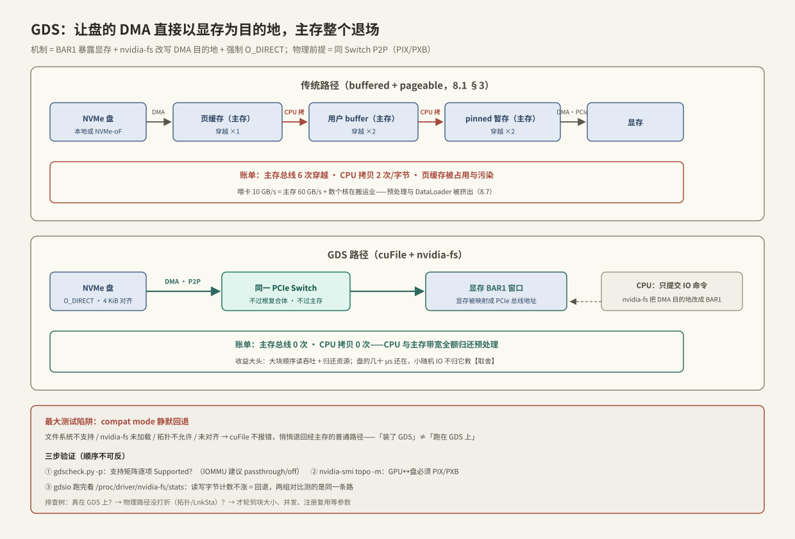

# GDS 与 cuFile

> [[8.1 GPU 内存层次与数据搬运]] §3 数完了传统路径的账：盘到显存要过主存总线 6 次、CPU 拷 2 次。GDS（GPUDirect Storage）的主张只有一句【事实】：**让盘（或 NVMe-oF 远端盘）的 DMA 引擎直接以显存为目的地，主机内存从数据路径上整个退场**。它是 GPUDirect 家族的第三员——P2P 管 GPU↔GPU、GPUDirect RDMA 管网卡↔显存、Storage 管盘↔显存——三者共用同一个物理前提：[[3.8 PCIe 拓扑与 NUMA]] 的同 Switch P2P DMA。cuFile 是它的用户态 API。本篇按机制 → 对账 → 环境验证 → 最小程序 → 误读与排障展开；**全篇最重要的一条实践结论提前说：GDS 有静默回退（compat mode），不核对计数器的性能测试都可能在测一条假路径**。

前置：[[8.1 GPU 内存层次与数据搬运]]（层次与传统路径的账）、[[3.8 PCIe 拓扑与 NUMA]]（P2P 的拓扑前提）、[[1.3 Buffered IO 与 O_DIRECT]]（GDS 强制 O_DIRECT 的原因）、[[4.4 内存注册与零拷贝]]（第三次见「注册」）。

---

## 1. 机制：三件事拼出一条直达路径

GDS 不是一个新协议，是三个已有机制的组合【事实/实现】：

1. **显存暴露成 PCIe 地址**：GPU 把一段显存映射进 **BAR1 窗口**（PCIe 设备向总线暴露的地址空间）——从此「写显存」对其他 PCIe 设备来说就是「写某个总线地址」，与写主存无异；
2. **内核模块 `nvidia-fs.ko` 做翻译**：文件读写走到块层后，它把「目标缓冲区」从主存页换成 BAR1 地址，交给 NVMe 驱动组装 DMA 命令——盘的 DMA 引擎照常工作，只是目的地变了（对设备而言 DMA 就是「往总线地址搬数据」，它不关心背后是 DRAM 还是显存）；
3. **强制 O_DIRECT**：页缓存缓存的是主存页，目的地根本不在主存，缓存无从谈起——所以 GDS 路径必须绕开页缓存（[[1.3 Buffered IO 与 O_DIRECT]]），继承其全部对齐要求（偏移/长度 4 KiB 对齐【实现】）。

支持范围【实现】：本地 ext4/xfs（O_DIRECT 模式）、NVMe 与 NVMe-oF（[[5.1 NVMe-oF 架构]] 的远端盘同样能直供显存——fabric 的 DMA 目的地一样可以是 BAR1）、以及一批分布式文件系统（Lustre、GPFS、WekaFS 等）的专门适配。

与前两章的贯通【事实】：GPUDirect RDMA 是「网卡 DMA 直写显存」，GDS 是「盘 DMA 直写显存」——与 [[4.5 Send Recv 与 RDMA Read Write]] 的单边写、[[5.1 NVMe-oF 架构]] 的 target 直写 host 内存，全是同一句话的不同主语：**让拥有 DMA 引擎的设备直达最终目的地，CPU 只发命令**。

---

## 2. 对账：传统路径 vs GDS



| | 传统（buffered + pageable） | GDS |
| --- | --- | --- |
| 内存总线穿越 | 6 次（[[8.1 GPU 内存层次与数据搬运]] §3） | **0 次**（同 Switch 下 P2P，不经主存） |
| CPU 拷贝 | 2 次/字节 | 0 次——CPU 只提交 IO 命令 |
| 页缓存 | 占用且可能污染 | 不参与（O_DIRECT） |
| 路径跳数 | 盘→主存→（CPU×2）→主存→显存 | 盘→Switch→显存 |

收益的形状要说准【量级/取舍】：

- **大块顺序读（GB 级 checkpoint 加载、数据集扫描）**：吞吐直接对齐「盘供给 vs PCIe 入口」的小者，且 CPU 与主存带宽全额归还给预处理——收益最大的场景；
- **延迟**：省掉的是拷贝与调度，盘本身的几十 μs 还在——单笔延迟改善温和；
- **小随机 IO**：每笔 IO 的固定成本（提交、完成、对齐约束）一项没少，GDS **不救小 IO**；小文件海洗数据集靠的是合并与预取（[[8.7 DataLoader 与 GPU 空闲归因]]），不是 GDS；
- **拓扑税**：GPU 与盘/网卡不在同一 Switch（`topo -m` 显示 PHB/SYS）时，P2P 流量要挤根复合体甚至跨 socket 互联——带宽腰斩起步，SYS 下基本失去意义（[[8.1 GPU 内存层次与数据搬运]] §4）。

---

## 3. 兼容模式：GDS 最大的测试陷阱

cuFile 的设计选择【实现】：**条件不满足时不报错，而是静默切到 compat mode**——内部退回「经主存 bounce buffer 的普通读 + H2D 拷贝」，API 返回照样成功。触发条件包括：文件系统不支持、没装/没加载 `nvidia-fs`、拓扑不允许、未对齐、甚至环境变量强制（`CUFILE_FORCE_COMPAT_MODE=true`）。

后果【实践】：**「装了 GDS」和「跑在 GDS 上」是两回事**。性能对比实验里最常见的假阳性就是两组数字其实都在 compat 路径上。核对手段只有一个——看计数器（§4 第③步）。

---

## 4. 环境验证：三步，每步有读数

```bash
# ① 支持矩阵体检：驱动、nvidia-fs、文件系统、每块盘/网卡的支持状态
/usr/local/cuda/gds/tools/gdscheck.py -p
#   逐项看 "Supported/Unsupported"；IOMMU 一项建议 disabled/passthrough【实现】

# ② 拓扑核对：GPU 与目标 NVMe 必须 PIX/PXB（8.1 §4 的字母表）
nvidia-smi topo -m

# ③ 基准 + 真伪核对：gdsio 对照组，跑完看内核计数器有没有涨
gdsio -f /mnt/nvme/testfile -d 0 -w 8 -s 16G -i 1M -I 0 -x 0   # GDS 路径
gdsio -f /mnt/nvme/testfile -d 0 -w 8 -s 16G -i 1M -I 0 -x 1   # 经 CPU 的对照路径
cat /proc/driver/nvidia-fs/stats | grep -E "Reads|Writes"
#   GDS 组跑完 Reads 字节数必须涨；不涨 = 静默回退，两组测的是同一条路【故障定位核心】
```

实验设计建议（把 [[9.1 fio Benchmark Matrix]] 的方法搬过来）【方法】：变量取「块大小 256K/1M/4M × 并发 1/4/8/16 × GDS/对照」，读数取吞吐 + **主机 CPU 利用率**——GDS 的价值一半在吞吐、一半在「CPU 从搬运业退休」，只看吞吐会低估它。

---

## 5. Modern C++：最小 cuFile 程序（RAII 三层注册）

cuFile 的使用形状 = 三层「打开/注册」配对释放，天然适合 RAII；又一次与 [[4.4 内存注册与零拷贝]] 同构：

```cpp
#include <cufile.h>
#include <cuda_runtime.h>
#include <fcntl.h>
#include <unistd.h>

#include <cstddef>
#include <print>
#include <stdexcept>

static void ck_cu(CUfileError_t e, const char* what) {
    if (e.err != CU_FILE_SUCCESS)
        throw std::runtime_error(std::string{what} + " failed, err=" +
                                 std::to_string(e.err));
}

class CuFileDriver {                       // ① 驱动会话
public:
    CuFileDriver()  { ck_cu(cuFileDriverOpen(), "cuFileDriverOpen"); }
    ~CuFileDriver() { cuFileDriverClose(); }
};

class GdsFile {                            // ② fd + cuFile 句柄（必须 O_DIRECT）
public:
    explicit GdsFile(const char* path)
        : fd_{::open(path, O_RDONLY | O_DIRECT)} {
        if (fd_ < 0) throw std::runtime_error("open(O_DIRECT)");
        CUfileDescr_t d{};
        d.handle.fd = fd_;
        d.type = CU_FILE_HANDLE_TYPE_OPAQUE_FD;
        ck_cu(cuFileHandleRegister(&fh_, &d), "HandleRegister");
    }
    ~GdsFile() { cuFileHandleDeregister(fh_); ::close(fd_); }
    [[nodiscard]] CUfileHandle_t handle() const { return fh_; }
private:
    int fd_;
    CUfileHandle_t fh_{};
};

class GdsBuffer {                          // ③ 显存 + BAR1 注册（≈ 4.4 的 MR，第三次见）
public:
    explicit GdsBuffer(std::size_t n) : size_{n} {
        if (cudaMalloc(&p_, n) != cudaSuccess) throw std::runtime_error("cudaMalloc");
        ck_cu(cuFileBufRegister(p_, n, 0), "BufRegister");
    }
    ~GdsBuffer() { cuFileBufDeregister(p_); cudaFree(p_); }
    [[nodiscard]] void* data() const { return p_; }
    [[nodiscard]] std::size_t size() const { return size_; }
private:
    void* p_ = nullptr;
    std::size_t size_;
};

int main() {
    CuFileDriver drv;
    GdsFile file{"/mnt/nvme/testfile"};
    GdsBuffer buf{1 << 22};                // 4 MiB，天然满足 4 KiB 对齐

    // 盘 DMA 直写显存：主存全程不参与；负值即错误（-errno 或 cuFile 错误码）
    ssize_t n = cuFileRead(file.handle(), buf.data(),
                           buf.size(), /*file_off=*/0, /*buf_off=*/0);
    if (n < 0) throw std::runtime_error("cuFileRead");
    std::println("read {} bytes disk->VRAM, host DRAM untouched", n);
    // 自检：跑完 cat /proc/driver/nvidia-fs/stats——计数器没涨就是 compat 回退
}
```

**关键点**：

- 三层 RAII 的析构顺序（buf → file → driver）自动正确——正是嵌套注册资源该有的形状；
- `cuFileBufRegister` 有毫秒级成本且占 BAR1 窗口：**预注册 + 复用**，与 pinned/MR 同一军规；
- 偏移、长度、缓冲区都要 4 KiB 对齐——违反时轻则 compat 回退、重则 `-EINVAL`【实现】。

---

## 6. 指标误读与故障定位

| 现象 | 常见误读 | 实际排查 |
| --- | --- | --- |
| GDS 与对照组数字几乎一样 | 「GDS 没用」 | 先看 `nvidia-fs/stats` 计数器——大概率两组都在 compat 路径（§3） |
| 吞吐只有预期一半 | 「GDS 有问题」 | `topo -m` 看 GPU↔盘是否 PHB/SYS；`lspci` 看链路降速（[[3.8 PCIe 拓扑与 NUMA]] §3） |
| 小 IO 不提速 | 「GDS 名不副实」 | 设计如此：固定成本不归 GDS 管，先合并 IO 再谈直达（§2） |
| `cuFileRead` 返回 -22 | 「驱动坏了」 | EINVAL：九成是偏移/长度/缓冲未 4 KiB 对齐，或 fd 没开 O_DIRECT |
| 吞吐正常但 CPU 没降 | 「白忙一场」 | 真在 GDS 路径上时 CPU 本来就只剩提交开销；CPU 高多半是别的组件（预处理/解压）在烧——归因方法见 [[8.7 DataLoader 与 GPU 空闲归因]] |
| 开 IOMMU 后各种失败 | — | P2P DMA 与 IOMMU 地址翻译冲突是已知雷区【实现】：按 gdscheck 建议设 passthrough/关闭再测 |

排查树一句话版【方法】：**先证明「真的在 GDS 路径上」（计数器），再证明「物理路径没打折」（拓扑 + 链路协商），最后才讨论参数（块大小、并发、注册复用）**——顺序反了全是无效调参。

---

## 7. 陷阱与误区

> [!warning] 常见错误
> 1. **不看计数器就发对比报告**：compat mode 静默回退，「GDS vs 非 GDS」可能是同一条路测两遍——每轮跑完必核对 `nvidia-fs/stats`。
> 2. **拿小随机 IO 考核 GDS**：它删的是拷贝与主存中转，不是每笔 IO 的固定成本——考卷不对，结论必错。
> 3. **忽略拓扑直接上多卡多盘**：跨 Switch/跨 socket 的「直达」物理上不存在；采购与插槽规划先于软件调优。
> 4. **数据路径上临时 `cuFileBufRegister`**：毫秒级 + BAR1 占用，必须池化（pinned/MR/GDS 三兄弟同一军规）。
> 5. **忘了 O_DIRECT 的连带义务**：4 KiB 对齐、绕过页缓存后自己负责预读——buffered 时代的「顺手快」没有了（[[1.3 Buffered IO 与 O_DIRECT]]）。
> 6. **在不支持的文件系统上「成功」运行**：那是 compat 在兜底；生产开启 `cufile.json` 日志或监控计数器，让回退可见【实现】。

---

## 8. 关键结论

| 结论 | 性质 |
| --- | --- |
| GDS = BAR1 暴露显存 + nvidia-fs 改写 DMA 目的地 + 强制 O_DIRECT：盘的 DMA 直写显存，主存退出数据路径 | 事实 |
| 与 GPUDirect RDMA/P2P 同族：都是「有 DMA 引擎的设备直达最终目的地，CPU 只发命令」——4/5 章思想的第三次出现 | 事实 |
| 对账：主存总线 6→0、CPU 拷贝 2→0；收益大头在大块吞吐与「归还 CPU/主存带宽」，小 IO 与单笔延迟改善有限 | 事实 / 量级 |
| 物理前提是同 Switch P2P（PIX/PXB）；PHB 打折、SYS 基本无效——拓扑先于一切调优 | 事实 / 实践 |
| compat mode 静默回退是最大测试陷阱：真伪只有 nvidia-fs 计数器能证明 | 实践结论 |
| cuFile = 三层注册（driver/handle/buffer）的 RAII 形状；BufRegister 毫秒级、须池化；全程 4 KiB 对齐 | 实现 / 实践 |
| 排查顺序：真在 GDS 上？→ 物理路径没打折？→ 才轮到参数——顺序反了全是无效调参 | 方法论 |
| NVMe-oF 远端盘同样可直供显存：fabric DMA 的目的地一样可以是 BAR1 | 事实 |

---

## 关联知识

- [[8.1 GPU 内存层次与数据搬运]] - 被 GDS 删掉的那张 6 次穿越账单
- [[3.8 PCIe 拓扑与 NUMA]] - 同 Switch P2P：物理前提与链路验收
- [[1.3 Buffered IO 与 O_DIRECT]] - 强制 O_DIRECT 的原因与连带义务
- [[4.4 内存注册与零拷贝]] / [[4.5 Send Recv 与 RDMA Read Write]] - 「注册 + 设备直达」的前两次出现
- [[5.1 NVMe-oF 架构]] - 远端盘直供显存的运输层
- [[8.3 Bounce Buffer vs 直读]] - 中转路径与直达路径的定量对比实验
- [[8.7 DataLoader 与 GPU 空闲归因]] - 「省下的 CPU 去哪了」的现场验证
- [[9.1 fio Benchmark Matrix]] - gdsio 实验矩阵的设计方法论
