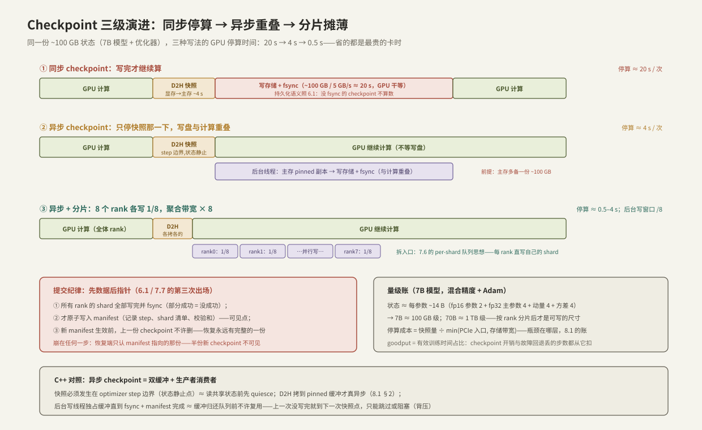

---
tags:
  - 高性能存储
  - AI-GPU-数据路径
---
# Checkpoint 同步异步分片

> 千卡训练任务的一条冷酷算术【量级】：单部件年故障率再低，几千张卡、几万条链路乘起来，**集群级故障间隔以小时到天计**——训练必然会被打断，checkpoint 是唯一的存档机制。但存档本身要花最贵的资源：checkpoint 期间 GPU 停算。于是出现一个三变量的取舍——**存得越频繁，故障回退丢得越少，但停算开销越大**。本篇按「同步 → 异步 → 分片」三级演进拆这道题：每一级都在把 checkpoint 路径上的某段等待从关键路径上挪走，用的全是前面章节已有的机制——D2H 拷贝是 [[8.1 GPU 内存层次与数据搬运]] 的账、持久化语义是 [[6.1 WAL 与 Crash Consistency]] 的纪律、并行写是 [[7.6 AI 存储 vs 传统 NAS]] 的拆入口、提交是「先数据后指针」的第三次出场（[[7.7 对象存储路径]]）。

前置：[[8.1 GPU 内存层次与数据搬运]]（D2H 路径与 pinned 才真异步）、[[6.1 WAL 与 Crash Consistency]]（fsync 提交点与原子替换——checkpoint 是它的超大号应用）、[[1.4 fsync fdatasync 与持久化语义]]（「写完」的准确定义）。

---

## 1. 存什么、有多大：先算尺寸账

checkpoint 的内容不只是模型参数【事实】：**参数 + 优化器状态 + 训练进度（step、RNG 状态、学习率调度）**——缺一样就无法做到「恢复后与不中断完全等价」。混合精度 + Adam 的典型账【量级】：

```text
每参数 ≈ fp16 参数 2 B + fp32 主参数 4 B + Adam 动量 4 B + 方差 4 B ≈ 14 B
7B  模型 → ~100 GB 级        70B 模型 → ~1 TB 级
（梯度不必存——恢复后重算；具体字节数随精度方案与实现有别【前提】）
```

两个直接推论：

1. 这个尺寸**必须分片**才可运输——单点写 1 TB 到任何存储都是分钟级；幸运的是数据并行/ZeRO/FSDP 世界里状态本来就分布在各 rank 上，「每人存自己那份」是自然形态【实现】；
2. checkpoint 是**大块一次写成、写后不改**的负载——正是 [[7.1 副本 vs EC]] §5 里 EC 与对象存储的理想客户，这决定了它的存储选型与 [[7.8 Multipart 与 Range GET]] 的用法。

衡量指标提前立好【事实】：**goodput = 有效训练时间 ÷ 总时间**。checkpoint 的两笔扣分——停算开销（频率 × 单次停算）与故障回退（平均丢半个 checkpoint 间隔的步数）——都从 goodput 里扣；所有优化都在这两笔之间做文章。

---

## 2. 同步 checkpoint：最简单，也最贵



流程（对照上图第一条时间线）【事实】：训练循环在 step 边界停下 → 状态 D2H 拷到主存 → 写入存储并 `fsync` → 确认成功 → 继续训练。停算时间的构成：

```text
停算 ≈ 状态量 ÷ PCIe 入口带宽        （D2H:100 GB ÷ 25 GB/s ≈ 4 s,8.1 §1）
     + 状态量 ÷ 存储写带宽           （常是大头:100 GB ÷ 5 GB/s ≈ 20 s）
     + fsync / 元数据提交            （1.4 的闸门,不可省）
```

持久化纪律照单全收【事实】：`write` 返回不算存上（[[1.4 fsync fdatasync 与持久化语义]]）；没 fsync 的 checkpoint 在断电面前是幻觉；fsync 报 EIO 按 [[6.3 fsyncgate 与 EIO 处理]] 处理——这份存档的意义就是灾后重建，它自己必须是全链路里最不能含糊的写入。

同步方式的合理场景【取舍】：小模型（秒级写完）、或平台只提供最朴素的阻塞式保存。一旦停算 × 频率的乘积开始侵蚀 goodput（20 s × 每 30 min ≈ 1% 起步，故障率高时想缩间隔就更痛），就进入下一级。

---

## 3. 异步 checkpoint：只停快照，写盘与计算重叠

关键观察【设计】：停算真正必要的部分只有**快照**——把「此刻的状态」定格下来；把定格的副本搬到存储去，没有理由占用 GPU 的时间。于是两阶段拆分（上图第二条时间线）：

1. **快照阶段（仍需停算，秒级）**：在 optimizer step 边界——**状态静止点**——把显存状态 D2H 拷到主存的专用缓冲。必须停算的原因是一致性：拷贝进行中若 optimizer 还在原地更新参数，快照就是「半新半旧」——**分布式版的 torn read**（[[6.4 Torn Write 与 Checksum]] 的老对手，这次发生在显存里）；
2. **落盘阶段（与计算重叠）**：后台线程把主存副本写入存储 + fsync + 提交。GPU 在整个阶段照常训练。

三个必须写进设计的限制条件【前提/实现】：

- **主存缓冲必须 pinned**：否则 D2H 走 pageable 路径——多一次 CPU 拷贝、半速、且 `cudaMemcpyAsync` 退化为同步（[[8.1 GPU 内存层次与数据搬运]] §2 的分水岭在这里直接决定停算时长）；pinned 大缓冲毫秒级分配 + 常驻占用 → 启动时预分配、终身复用（8.1 的池化军规）；
- **内存账**：主机要常驻多出一份完整状态副本（每 GPU 百 GB 级 ÷ 分片数）——主存容量是异步方案的硬前提，不够就只能部分异步或压缩；
- **背压**：上一轮落盘还没完成、下一个快照点又到了怎么办？两个合法选项——跳过本轮（拉长丢失窗口）或阻塞等待（退化为同步）；**静默覆盖正在写盘的缓冲是数据损坏**，等价于把还没归还队列的缓冲区重新拿去写——C++ 生产者消费者里最经典的 use-after-free 形状。

---

## 4. 分片 checkpoint：拆入口 + 两阶段提交

单点写出口是最后的瓶颈——解法与 [[7.6 AI 存储 vs 传统 NAS]] 同构：**拆入口**。每个 rank 把自己持有的状态分片直接写到存储（上图第三条时间线），N 个并发写者把聚合带宽抬高 N 倍；对象存储侧再用 [[7.8 Multipart 与 Range GET]] 把单个大 shard 切段并发【实现】。

但并行写引入了分布式一致性问题【事实】：**一份合法的 checkpoint = 同一 step 的全部 shard**。任何 rank 写失败、写慢、或写了不同 step 的数据，这份存档整体作废。工程解法是轻量两阶段提交——「先数据后指针」的第三次出场（[[6.1 WAL 与 Crash Consistency]] 的 WAL 纪律 → [[7.7 对象存储路径]] 的元数据切换 → 这里）：

1. 所有 rank 各自写 shard + fsync，向协调者汇报成功；
2. **全部成功后**，协调者原子写入 **manifest**（step 号、shard 清单、校验和）——manifest 的出现就是这份 checkpoint 的可见点；
3. 恢复端**只认 manifest**：找最新的完整 manifest，按清单加载；写了一半的孤儿 shard 对恢复不可见，由后台清理；
4. **新 manifest 落定之前，上一份 checkpoint 不许删**——任何时刻至少存在一份完整存档（与 [[1.4 fsync fdatasync 与持久化语义]] §4 崩溃一致替换的保留旧版同理）。

再往深一层的两个工程题【实现/取舍】：

- **resharding**：恢复时并行度可能变了（256 卡存的，128 卡恢复）——shard 边界与新布局不匹配，需要重切。方案要么存「布局无关」格式（恢复端按需重组，加载慢），要么恢复时跑一次重分布（占网络）；选型时就要问「换卡数恢复怎么办」；
- **突发形状**：N 个 rank 同一时刻齐射大块写——存储侧的 incast 时刻（交换机缓冲、[[4.7 PFC ECN 与 DCQCN]] 的老问题）；错峰（rank 间加抖动）或限速是常规配平，代价是拉长后台写窗口。

---

## 5. Modern C++：异步 checkpointer 的骨架

把 §3 的两阶段与背压写成代码。复用 [[1.4 fsync fdatasync 与持久化语义]] 的 `write_all`/`sync_or_throw` 与 [[8.1 GPU 内存层次与数据搬运]] 的 `PinnedBuffer`：

```cpp
#include <condition_variable>
#include <filesystem>
#include <mutex>
#include <span>
#include <thread>

// 单缓冲异步 checkpointer:快照(调用方停算) + 后台落盘(与计算重叠)
class AsyncCheckpointer {
public:
    AsyncCheckpointer(std::size_t bytes, std::filesystem::path dir)
        : staging_{bytes}, dir_{std::move(dir)},
          writer_{[this](std::stop_token st) { run(st); }} {}

    // 调用方在 optimizer step 边界调用——此刻状态静止(一致性前提)
    // 返回 false = 上一份还没写完,本轮跳过(背压的显式形态)
    bool try_snapshot(const void* dev_state, std::uint64_t step) {
        std::unique_lock lk{mu_, std::try_to_lock};
        if (!lk.owns_lock() || busy_) return false;      // 绝不覆盖在写的缓冲
        d2h_copy(dev_state, staging_.data(), staging_.size());  // pinned:真异步 D2H
        step_ = step;
        busy_ = true;
        cv_.notify_one();                                // 唤醒落盘线程
        return true;                                     // GPU 从这里就能继续算
    }

private:
    void run(std::stop_token st) {
        std::unique_lock lk{mu_};
        while (!st.stop_requested()) {
            cv_.wait(lk, [&] { return busy_ || st.stop_requested(); });
            if (!busy_) continue;
            lk.unlock();                                 // ★ IO 期间不持锁(6.2 铁律)
            write_shard_durable();                       // 写 tmp + fsync + rename
                                                         //   + fsync(dir):1.4 §4 四步
            lk.lock();
            busy_ = false;                               // 缓冲归还,允许下一轮快照
        }
    }

    void write_shard_durable();                          // 略:atomic_replace(1.4)
    static void d2h_copy(const void*, void*, std::size_t);  // 略:cudaMemcpy D2H

    PinnedBuffer staging_;                               // 预分配,终身复用(8.1 军规)
    std::filesystem::path dir_;
    std::mutex mu_;
    std::condition_variable cv_;
    std::uint64_t step_ = 0;
    bool busy_ = false;
    std::jthread writer_;                                // RAII:析构自动 stop+join
};
```

**逐段讲解**：

- `try_snapshot` 返回 `bool` 把 §3 的背压决策交还调用方：跳过还是重试由训练循环定，**但「覆盖在写缓冲」这条路在接口上不存在**；
- 落盘线程的锁纪律与 [[6.2 Group Commit]] 完全一致：锁只保护 `busy_`/`step_` 状态，写盘 + fsync 全程不持锁——否则快照与落盘互相阻塞，异步名存实亡；
- `write_shard_durable` 内部就是 [[1.4 fsync fdatasync 与持久化语义]] §4 的四步原子替换——临时文件、fsync 内容、rename、fsync 目录；多 rank 场景再在其上叠 §4 的 manifest 两阶段；
- `std::jthread` 的 RAII 保证进程退出前落盘线程被 stop + join——训练脚本崩溃时不至于留下写到一半又没人截尾的 shard（截尾靠 manifest 纪律兜底，但少制造垃圾总是对的）；
- 生产版的扩展方向：双缓冲（快照与落盘各占一个，跳过率更低）、分片并发写、直接对接对象存储 SDK——骨架不变。

---

## 6. 排障清单

| 症状 | 先测什么 | 常见根因 → 处置 |
| --- | --- | --- |
| 同步 checkpoint 停算远超预期 | 分段计时：D2H 段 vs 写盘段 | D2H 慢：缓冲是 pageable（[[8.1 GPU 内存层次与数据搬运]] §2），换 pinned；写盘慢：存储带宽/单入口（下一行） |
| 写盘段吞吐低 | `iostat -x`（[[9.2 iostat 指标解读]]）；nfsstat/对象存储指标 | 单点写出口未分片 → §4；NFS 机头饱和（[[7.6 AI 存储 vs 传统 NAS]]）；对象存储单前缀热点（[[7.7 对象存储路径]] §3） |
| 「异步」了但 GPU 还是停很久 | profiler 看快照段时长 | pageable 缓冲让 D2H 退化同步；或快照实现在逐 tensor 序列化（CPU 慢路径）而非整块拷贝 |
| 异步后训练吞吐反而抖 | 后台写期间的主存带宽与 CPU 占用 | 落盘线程与 DataLoader 抢主存带宽/核（[[8.1 GPU 内存层次与数据搬运]] §3 的账、[[8.7 DataLoader 与 GPU 空闲归因]]）——限速后台写或错峰 |
| 恢复时报 shard 缺失/校验失败 | manifest 与 shard 清单比对 | 没做两阶段提交,部分成功被当成功；按 §4 重建提交纪律,恢复端回退上一份 manifest |
| 恢复后 loss 曲线不连续 | 检查 RNG/step/调度器是否入档 | checkpoint 只存了参数——「完整状态」定义不全（§1） |
| 断电后 checkpoint 消失/半截 | 写路径有无 fsync + 目录 fsync | `write` 返回就当成功——[[1.4 fsync fdatasync 与持久化语义]] 全篇;用 [[6.10 崩溃注入测试]] 级手段验证 |
| 换并行度恢复失败 | shard 布局与恢复布局 | resharding 未设计（§4）——选布局无关格式或加重分布步骤 |
| checkpoint 期间其他任务 p99 抖 | 存储/网络侧监控 | N rank 齐射 = incast + 抢带宽——错峰、限速、或专用存储通道（[[4.7 PFC ECN 与 DCQCN]]） |

---

## 7. 陷阱与误区

> [!warning] 常见错误
> 1. **把 `torch.save` 返回当「存好了」**：中间隔着页缓存与设备缓存两级易失（[[1.4 fsync fdatasync 与持久化语义]]）——不 fsync 的 checkpoint 防得住进程崩，防不住掉电。
> 2. **异步快照不在 step 边界做**：optimizer 更新中途拷贝 = 半新半旧的状态——训练能继续、恢复出来的模型是坏的，且极难排查。
> 3. **快照缓冲用 pageable 内存**：D2H 半速 + 假异步，「异步 checkpoint」只剩名字。
> 4. **覆盖还没写完的缓冲**：等价于 use-after-free；跳过或阻塞都合法，静默覆盖不合法。
> 5. **分片写完就算提交**：没有 manifest 的分片集在部分失败时无法区分「完整/残缺」——恢复端赌运气。
> 6. **写新档前先删旧档**：新档失败 + 旧档已删 = 全丢；至少一份完整存档是不变量。
> 7. **checkpoint 频率拍脑袋**：该算：故障间隔 MTBF、单次停算成本、回退丢失 = 半个间隔——三个数放进 goodput 公式再定频率【方法】。
> 8. **忽略 checkpoint 对同集群其他负载的冲击**：齐射突发能把共享存储与网络打出毛刺——它是集群级事件，不是单任务私事。

---

## 8. 关键结论

| 结论 | 性质 |
| --- | --- |
| checkpoint = 参数 + 优化器状态 + 训练进度；混合精度 Adam 约 14 B/参数——7B ≈ 100 GB 级、70B ≈ TB 级 | 事实/量级 |
| goodput 两笔扣分：停算 × 频率、回退 = 半个间隔——所有方案都在这对矛盾里配平 | 事实/方法 |
| 同步：停算 = D2H + 写存储 + fsync 全程；写存储通常是大头 | 事实 |
| 异步：停算只剩快照（step 边界的状态静止点，否则 torn 快照）；代价 = 主存多一份 pinned 副本 | 事实/前提 |
| 背压三选一：跳过、阻塞、静默覆盖——第三个是数据损坏，接口上就不该存在 | 实践结论 |
| 分片 = 拆入口：N rank 并发写抬 N 倍带宽；合法存档 = 同 step 全部 shard + manifest 可见点 | 事实/设计 |
| 提交纪律「先数据后指针」第三次出场：全 shard 持久 → manifest 原子切换 → 旧档才可删 | 事实 |
| checkpoint 是 EC/对象存储的理想负载（大块、一次写成、不可变）；但齐射 = incast，要错峰限速 | 取舍/实践 |
| 排障顺序：先分段计时定层（D2H/写盘/提交），再进对应章节的工具箱 | 方法论 |

---

## 关联知识

- [[8.1 GPU 内存层次与数据搬运]] - D2H 的账与 pinned 军规：停算时长的第一决定因素
- [[1.4 fsync fdatasync 与持久化语义]] - 「存上了」的定义与四步原子替换
- [[6.1 WAL 与 Crash Consistency]] - 提交点思想的单机原型；checkpoint 取舍的第一次出现
- [[6.2 Group Commit]] - 落盘线程锁纪律的出处
- [[6.3 fsyncgate 与 EIO 处理]] - 存档写失败时唯一正确的反应
- [[7.6 AI 存储 vs 传统 NAS]] - 拆入口思想；单点写出口为什么必然是瓶颈
- [[7.7 对象存储路径]] / [[7.8 Multipart 与 Range GET]] - 存档的去处与并发上传机制
- [[7.1 副本 vs EC]] - checkpoint 为什么是 EC 的理想客户
- [[8.7 DataLoader 与 GPU 空闲归因]] - 后台落盘与数据加载抢资源时的归因方法
- [[8.8 MLPerf Storage]] - checkpoint 负载已进标准考卷（v2.0）
