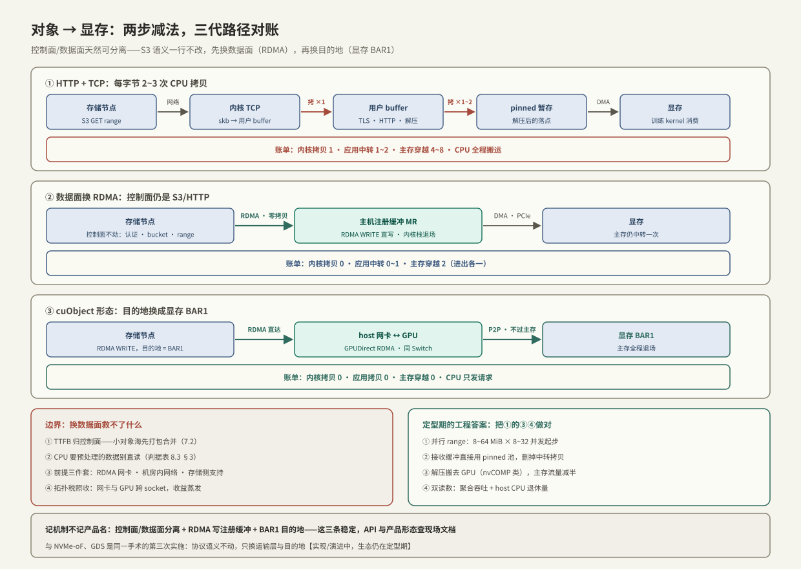

---
tags:
  - 高性能存储/AI-GPU-数据路径
---
# 对象直读与 cuObject

> 第 8 章至此的所有直达手段（[[8.2 GDS 与 cuFile]]、[[8.3 Bounce Buffer vs 直读]]）都建立在一个前提上：数据长在**文件系统或块设备**里。但 AI 数据集的真实住址越来越多是**对象存储**——训练数据在 S3 桶里、checkpoint 往桶里写（[[7.6 AI 存储 vs 传统 NAS]]）。于是最后一块拼图是：**从对象存储到显存，这条路怎么缩短？** 本篇先给 HTTP 时代的老路径记账，再讲两步减法——数据面换 RDMA、目的地换显存——cuObject 类「对象直读」方案就是这两步的合成。需要先说清一个边界【实现/演进中】：这条路线的**生态仍在定型期**（NVIDIA 与各对象存储厂商的适配陆续落地），机制与账目是稳定的，具体 API 与产品名以现场文档为准——本篇把「今天就能做的工程」与「方向性的直达形态」分开讲。

前置：[[7.7 对象存储路径]] / [[7.8 Multipart 与 Range GET]]（对象侧的协议与并行读）、[[8.1 GPU 内存层次与数据搬运]]（拷贝记账法）、[[8.2 GDS 与 cuFile]]（文件版直达的机制原型）、[[4.1 RDMA 为什么快]]（数据面换 RDMA 省下的账）。

---

## 1. 老路径记账：一次 S3 GET 到显存要过几道手



标准 S3 客户端（HTTP + TCP）读一个 range 到显存，逐步数【事实】（口径同 [[8.1 GPU 内存层次与数据搬运]] §3）：

| 步 | 动作 | 成本 |
| --- | --- | --- |
| ① | 存储节点 → 网络 → host 网卡 | 网络传输 |
| ② | 内核 TCP 收包：softirq + **CPU 拷 skb → 用户 buffer** | 每字节 1 次 CPU 拷贝（[[4.1 RDMA 为什么快]] §1） |
| ③ | 应用层处理：TLS 解密（若有）、HTTP 解析、可能的解压 | 每字节 0~2 次 CPU 处理 |
| ④ | 用户 buffer → pinned 暂存（或本身就是 pinned 池） | 0~1 次 CPU 拷贝 |
| ⑤ | DMA → PCIe → 显存 | 1 次总线穿越 |

主存总线 4~8 次穿越、CPU 拷贝 2~3 次——**比本地文件的老路径还贵**（多了协议栈与 TLS/HTTP 的按字节处理）。集群拉 50 GB/s 的数据集流量时，这笔 CPU 税以「几十个核」计【量级】。

---

## 2. 两步减法：换数据面，再换目的地

对象协议天然是**控制面/数据面可分离**的【事实】：请求与响应头是小消息（元数据），对象字节是大块数据流。这给了逐层优化的空间：

**第一步：数据面换 RDMA**【实现/演进中】。控制面保留 HTTP/S3 语义（认证、桶、key、range——[[7.8 Multipart 与 Range GET]] 的一切照旧），数据面改走 RDMA：客户端注册好接收缓冲（MR，[[4.4 内存注册与零拷贝]]），存储节点用 RDMA WRITE 把对象字节**直写进客户端注册的内存**。效果：②的内核 TCP 拷贝与按包协议处理消失——与 [[5.1 NVMe-oF 架构]] 「命令模型不动、运输层替换」是同一手术。

**第二步：目的地换显存**【实现/演进中】。RDMA 的写目标是「注册过的总线地址」，它可以是主存，也可以是显存的 BAR1 窗口（GPUDirect RDMA，机制与 [[8.2 GDS 与 cuFile]] §1 同源）——注册显存缓冲后，**对象字节从存储节点网卡直达显存，主存全程退场**。cuObject 类「对象直读」客户端库做的就是这个合成：S3 风格 API + RDMA 数据面 + GPU 缓冲目标。

对账（每字节）【事实】：

| | HTTP+TCP（§1） | +RDMA 数据面 | +显存目的地（直读形态） |
| --- | --- | --- | --- |
| 内核协议栈拷贝 | 1 | 0 | 0 |
| 应用中转拷贝 | 1~2 | 0~1 | 0 |
| 主存总线穿越 | 4~8 | 2（进出各一） | **0** |
| CPU 角色 | 全程搬运 | 发请求 + 消费 | 只发请求 |

**边界同样要记牢**【事实/取舍】：

1. **TTFB 不归数据面管**：认证、元数据查找、寻址仍走控制面（[[7.2 元数据路径瓶颈]]）——小对象海负载的瓶颈在每请求固定成本，换 RDMA 数据面救不了它，先合并对象/打包（与 GDS 不救小 IO 是同一条规律，[[8.2 GDS 与 cuFile]] §2）；
2. **需要 CPU 消费的数据别直读**：要解压、解码、增广的数据（图像流），第一消费者是 CPU——直读进显存反而要拷回来，判据表直接复用 [[8.3 Bounce Buffer vs 直读]] §3；
3. **前提三件套**：两端 RDMA 网卡 + 网络可达（机房内）+ 存储侧支持该数据面——跨广域、云上对象存储走不了这条路，退回 §3 的工程化方案。

---

## 3. 今天就能做的工程：把老路径的③④做对

生态定型之前，「HTTP 数据面 + 正确的客户端工程」能拿到大部分吞吐【实践】——手段全部来自前几篇的组合：

1. **并行 range 拉满带宽**：[[7.8 Multipart 与 Range GET]] 的并发扇出（8~64 MiB × 8~32 并发起步）；
2. **接收缓冲直接用 pinned 池**：HTTP 库的 body 直接落进 `cudaMallocHost` 的池化缓冲（删掉 §1 的④），配合 [[8.3 Bounce Buffer vs 直读]] §4 的双缓冲流水线，把 H2D 与网络接收重叠；
3. **解压去 GPU**：能用 GPU 侧解压（如 nvCOMP 类库【实现】）的格式，压缩字节直接 H2D、显存里解压——③的 CPU 按字节处理挪去 GPU，主存流量同时减半；
4. **实验设计**（方法同 [[9.1 fio Benchmark Matrix]]）：变量 = 并发 × range 大小 × 接收缓冲类型（pageable/pinned）× 解压位置（CPU/GPU）；读数 = 聚合吞吐、**host CPU 利用率**、GPU SM 占用——对象直读类方案的价值一半在吞吐、一半在 CPU 退休，两个都要量。

---

## 4. Modern C++：pinned 池 + 并行 range + 重叠 H2D 的骨架

把 §3 的第 1、2 条落成代码形状（HTTP 获取函数抽象为 `fetch_range`，接 [[7.8 Multipart 与 Range GET]] §6 的下载器即可）：

```cpp
#include <cuda_runtime.h>

#include <cstddef>
#include <functional>
#include <span>
#include <stdexcept>
#include <vector>

// pinned 缓冲池：网络接收的落点 = DMA 的起点，中间不再有拷贝
class PinnedPool {
public:
    PinnedPool(std::size_t n_buf, std::size_t buf_bytes) {
        bufs_.reserve(n_buf);
        for (std::size_t i = 0; i < n_buf; ++i) {
            void* p = nullptr;
            if (cudaMallocHost(&p, buf_bytes) != cudaSuccess)   // 注册一次，复用终身
                throw std::runtime_error("cudaMallocHost");
            bufs_.push_back({static_cast<std::byte*>(p), buf_bytes});
        }
    }
    ~PinnedPool() { for (auto b : bufs_) cudaFreeHost(b.data()); }
    PinnedPool(const PinnedPool&) = delete;
    PinnedPool& operator=(const PinnedPool&) = delete;
    [[nodiscard]] std::span<std::byte> at(std::size_t i) const { return bufs_[i]; }
private:
    std::vector<std::span<std::byte>> bufs_;
};

// 双缓冲流水线：段 i 在 H2D 的同时，段 i+1 在网络接收——两条慢速路互相遮掩
using FetchFn = std::function<std::size_t(std::size_t range_idx, std::span<std::byte>)>;

void stream_object(FetchFn fetch_range, std::size_t n_ranges,
                   std::byte* dev_dst, std::size_t range_bytes) {
    PinnedPool pool{2, range_bytes};                  // 两块即成流水线
    cudaStream_t st{};
    cudaStreamCreate(&st);
    for (std::size_t i = 0; i < n_ranges; ++i) {
        auto host = pool.at(i % 2);
        const std::size_t got = fetch_range(i, host); // 网络接收：直接落 pinned
        cudaStreamSynchronize(st);                    // 等上一段 H2D 让出这块缓冲
        cudaMemcpyAsync(dev_dst + i * range_bytes, host.data(), got,
                        cudaMemcpyHostToDevice, st);  // pinned ⇒ 真异步（8.1 §2）
    }
    cudaStreamSynchronize(st);
    cudaStreamDestroy(st);
}
```

**关键点**：

- 接收缓冲即 pinned：§1 的④被结构性删除——「让每块内存只被写一次」是整章的公共原则；
- 双缓冲让「网络接收」与「H2D」重叠：理想吞吐 = max 变 min(两者)——量不到这个效果先查缓冲是不是 pageable（[[8.1 GPU 内存层次与数据搬运]] §2 的假异步陷阱）；
- 换成 cuObject 类直读后，这个骨架整体退役——`fetch_range` 的目的地直接是显存，正是「机制稳定、API 演进」的分界线。

---

## 5. 陷阱与误区

> [!warning] 常见错误
> 1. **拿小对象海考核对象直读**：TTFB 与每请求固定成本在控制面，数据面换 RDMA 救不了——先打包合并（WebDataset 类格式【实现】），再谈直达。
> 2. **给要 CPU 预处理的数据上直读**：第一消费者是 CPU 的数据直读进显存 = 多一来回；判据表在 [[8.3 Bounce Buffer vs 直读]] §3。
> 3. **HTTP 路径不做 pinned 池就下结论「对象存储慢」**：§3 的工程化能拿回大半差距；先把③④做对，再评估是否值得上新数据面。
> 4. **忽略 TLS 的按字节成本**：机房内网关闭或卸载 TLS 与否，CPU 账差数倍——对比实验必须固定这个变量。
> 5. **把演进中的产品名当机制记**：记「控制面/数据面分离 + RDMA 写注册缓冲 + BAR1 目的地」这三个稳定机制；API 与产品形态查现场文档。
> 6. **忘了拓扑税**：直达显存的前提仍是 [[8.1 GPU 内存层次与数据搬运]] §4 的 PIX/PXB——网卡与 GPU 跨 socket，直读收益照样蒸发。

---

## 6. 关键结论

| 结论 | 性质 |
| --- | --- |
| AI 数据的住址迁到对象存储后，「对象 → 显存」成为最后一段要缩短的路 | 事实 / 趋势 |
| HTTP+TCP 老路径每字节 2~3 次 CPU 拷贝、4~8 次主存穿越——比本地文件路径更贵 | 事实 / 量级 |
| 优化 = 两步减法：数据面换 RDMA（删内核协议栈）、目的地换显存 BAR1（删主存中转）——与 NVMe-oF、GDS 是同一手术的第三次实施 | 事实 |
| 对象协议控制面/数据面天然可分离：S3 语义不动，字节流换载体——TTFB 与小对象固定成本不归数据面管 | 事实 / 取舍 |
| 定型期的工程答案：并行 range + pinned 池接收 + 双缓冲重叠 + GPU 侧解压，能拿到大部分吞吐 | 实践结论 |
| 直读判据沿用 8.3：GPU 是第一消费者才直读；CPU 要预处理的数据直读反而多一来回 | 事实 / 取舍 |
| 评估口径双指标：聚合吞吐 + host CPU 退休量；前提三件套：RDMA 网卡、机房内网络、存储侧支持 | 方法 / 前提 |

---

## 关联知识

- [[7.7 对象存储路径]] / [[7.8 Multipart 与 Range GET]] - 控制面语义与并行读：直读路线不动的那一半
- [[8.2 GDS 与 cuFile]] - 文件版直达：BAR1 机制的原型与验证方法
- [[8.3 Bounce Buffer vs 直读]] - 「谁是第一消费者」判据表与 pinned 环流水线
- [[8.1 GPU 内存层次与数据搬运]] - 拷贝记账法与拓扑税
- [[4.1 RDMA 为什么快]] / [[4.4 内存注册与零拷贝]] - 数据面换 RDMA 省下的账与注册前提
- [[5.1 NVMe-oF 架构]] - 「协议语义不动、运输层替换」的第一次实施
- [[7.2 元数据路径瓶颈]] - TTFB 与小对象固定成本的归属层
