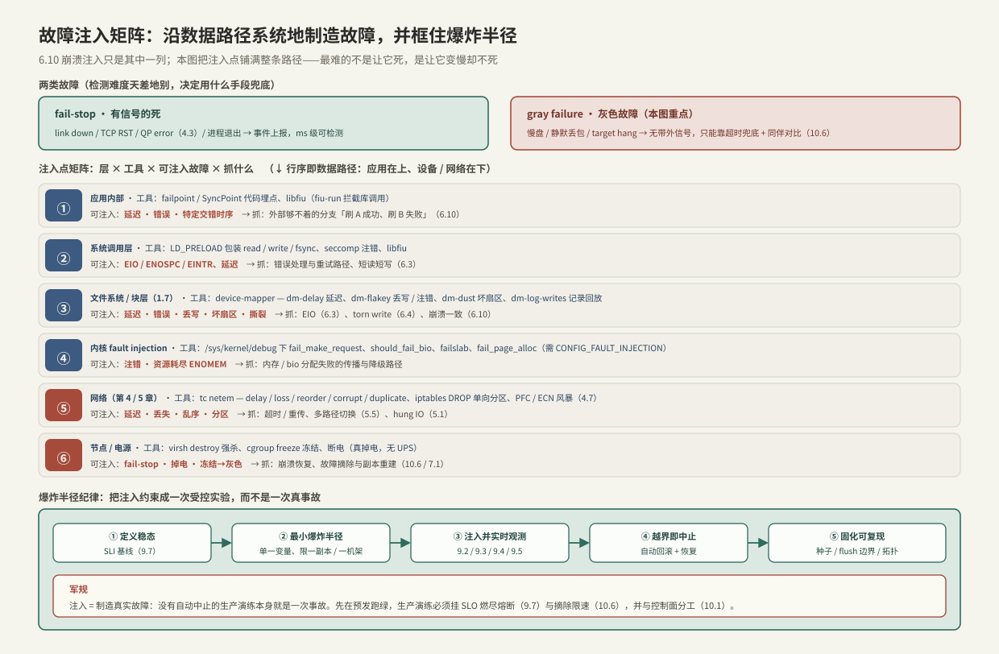

---
tags:
  - 高性能存储/性能观测与可靠性
---
# 故障注入矩阵

> [[6.10 崩溃注入测试]] 证明了「崩溃一致性不能靠 code review，只能靠系统地生成状态空间」，但它只覆盖了**一列**：进程 / 内核 / 盘缓存三层崩溃。真实系统会以更多方式坏掉——盘变慢但不报错、网络丢一半包却不断链、内存分配失败、远端 target hang 住。这些故障合起来是一个**乘积空间**，肉眼穷举不了，但可以像崩溃注入那样**用工具逐格制造出来**。本篇把注入点从「块层的崩溃点」扩展到**整条数据路径的每一层**，给出「层 × 故障类型 × 工具」的矩阵，并强调一件对生产最致命的事：最难的故障不是「死」，而是「慢而不死」（gray failure）。
>
> 对有并发背景的人，这就是熟悉的动作换了战场：你不会靠读代码证明一个线程池没有竞态，而是用 `malloc` 失败注入、调度扰动、`ThreadSanitizer` 去**主动构造对抗状态**。存储只是把对抗面从「指令交错」扩展到「介质、内核、网络的部分失效」。

前置：[[6.10 崩溃注入测试]]（矩阵中崩溃一致性那一列）、[[1.7 块层与 blk-mq]]（device-mapper 注入所在的层）、[[5.5 Multipath 与故障切换]]（网络路径的死法与切换）、[[00. 总纲]]（数据路径分层，注入点沿它铺开）。

---

## 1. 概念与边界：为什么要主动注入

三条事实决定了「测试不了就等着上线爆」不成立【事实】：

1. **失效是常态而非例外**。一条 host→盘的路串着网卡、网线、交换机、target 软件、SSD 固件七八个部件（[[5.5 Multipath 与故障切换]] §1）；规模一上来，「所有部件同时健康」才是小概率事件。
2. **失效空间是乘积**。故障类型 × 发生的层 × 发生的时机 × 并发交错，组合数爆炸——和崩溃注入的状态空间同构，无法靠肉眼枚举。
3. **错误处理路径几乎从不被正常流量执行**。`catch`、重试、降级、超时兜底这些分支，只有故障真的发生时才走到；不主动注入，它们等于没测过的代码——而它们恰恰是系统扛不扛得住的关键。

> [!note] 注入 vs 观测
> 故障注入（本篇）负责**制造**异常，性能观测（[[9.2 iostat 指标解读]] / [[9.3 blktrace 与块层生命周期]] / [[9.4 eBPF biolatency biosnoop]]）负责**看见**异常的后果。两者必须成对：只注入不观测，你不知道系统到底怎么反应；只观测不注入，你只能等真事故送样本。

### 1.1 两类故障：有信号 vs 灰色

注入前先把故障分成两类，因为它们的**检测难度差一个数量级**，需要的注入手段也不同【事实】：

| 类别 | 例子 | 谁通知你 | 检测耗时 |
| --- | --- | --- | --- |
| **fail-stop（有信号的死）** | 进程退出、link down、TCP RST、RDMA QP 进 error 态（[[4.3 QP WQE CQ 状态机]]） | 事件主动上报 | ms 级 |
| **gray failure（灰色故障）** | 盘变慢、交换机静默丢包、target 进程 hang 住不回包、GC 抖动 | **没人**——只能靠超时和同伴对比兜底 | **秒级甚至更久** |

fail-stop 是「善良故障」：系统立刻知道，切换 / 摘除都好办。真正折磨生产的是第二类——**对端没说自己坏了，你只能等一个超时来「宣判」**，这段等待时间直接进 p99（[[9.5 p99 毛刺定位]]）。这与 `std::future::wait_for` 的处境完全一致：没有带外信号时，超时是唯一的故障判据【事实】。一个好的故障注入矩阵，重心必须压在制造灰色故障上。

---

## 2. 注入点：沿数据路径逐层铺开

把 [[00. 总纲]] 的数据路径竖起来，从应用到设备、再叉出网络，**每一层都有对应的注入支点**。选在哪一层注入，决定了你测的是哪一段代码的容错。



| 层 | 注入工具 | 机制（为什么这里能注入） | 主要抓的 bug |
| --- | --- | --- | --- |
| ① 应用内部 | failpoint / SyncPoint 代码埋点、`libfiu` | 在自己代码里留可控分支，能构造外部够不着的交错 | 「刷 A 成功、刷 B 失败」这类特定时序（[[6.10 崩溃注入测试]]） |
| ② 系统调用 | `LD_PRELOAD` 包装 `read`/`write`/`fsync`、seccomp 注错、`libfiu` | 拦在应用与内核的边界上改返回值 | `EIO`/`ENOSPC`/`EINTR` 处理、短读短写、重试（[[6.3 fsyncgate 与 EIO 处理]]） |
| ③ 文件系统 / 块层 | device-mapper：`dm-delay`、`dm-flakey`、`dm-dust`、`dm-log-writes` | 在 bio 必经的块层叠一层虚拟设备（[[1.7 块层与 blk-mq]]） | 延迟、丢写、坏扇区、torn write（[[6.4 Torn Write 与 Checksum]]）、崩溃一致 |
| ④ 内核分配 / bio | `/sys/kernel/debug` 下 `fail_make_request`、`should_fail_bio`、`failslab`、`fail_page_alloc` | 内核自带的 fault-injection 框架（需 `CONFIG_FAULT_INJECTION`） | 内存 / bio 分配失败的传播与降级 |
| ⑤ 网络 | `tc netem`（delay/loss/reorder/corrupt/duplicate）、`iptables DROP`、PFC/ECN 风暴 | 在网卡的排队规则（qdisc）上改写、丢弃、延迟报文 | 超时 / 重传、多路径切换（[[5.5 Multipath 与故障切换]]）、hung IO |
| ⑥ 节点 / 电源 | `virsh destroy` 强杀、`cgroup freeze` 冻结、真掉电 | 从虚拟化 / cgroup / 硬件层面整体断掉一个节点 | 崩溃恢复、故障摘除与副本重建（[[10.6 健康检查与故障摘除]] / [[7.1 副本 vs EC]]） |

三个层要展开讲，因为它们最能体现「注入是在操作系统的机制上工作」：

### 2.1 块层：device-mapper 是万能注入支点

[[6.10 崩溃注入测试]] 已经用过 `dm-log-writes`（记录回放）和 `dm-flakey`（丢写注错）。它们都是 **device-mapper** 的 target：Linux 在块层提供的可堆叠虚拟设备框架，把一个虚拟设备叠在真实设备上，就能在 bio 流经的必经之路上观察与干预【事实】。故障注入常用的四个：

```bash
# dm-delay：给读 / 写各加固定延迟——制造「慢盘」这种灰色故障
# 表：<起始> <扇区数> delay <设备> <偏移> <读延迟ms> [<设备> <偏移> <写延迟ms>]
dmsetup create slowdisk --table "0 $(blockdev --getsz /dev/vdb) delay /dev/vdb 0 20 /dev/vdb 0 50"

# dm-flakey：按「好 N 秒 / 坏 M 秒」周期让设备时好时坏，坏时可丢写或返回错误
dmsetup create flaky --table "0 $(blockdev --getsz /dev/vdb) flakey /dev/vdb 0 8 2 1 error_writes"

# dm-dust：模拟固定 LBA 的坏扇区，读到即返 EIO——测介质级错误处理
```

【实现】`dm-delay` 之所以是灰色故障注入的主力，是因为它注入的**恰恰是「慢而不死」**：设备照常返回正确数据，只是每笔都慢 20~50 ms，足以让上层超时、让 p99 爆表，却不触发任何 fail-stop 信号。这是最贴近真实劣化盘（media 磨损、内部 GC 抖动，[[3.5 GC 写放大与 Over-Provisioning]]）的注入。

### 2.2 内核 fault injection：注入分配失败

`CONFIG_FAULT_INJECTION` 打开后，内核在 debugfs 暴露一组可编程失败点【事实】：

- `failslab` / `fail_page_alloc`：让 `kmalloc` / 页分配按概率失败，测 `ENOMEM` 路径；
- `fail_make_request` / `should_fail_bio`：让指定块设备的 bio 按概率失败；
- 每个失败点可配概率、间隔、触发次数、栈深过滤。

```bash
echo 1 > /sys/kernel/debug/fail_make_request/probability   # 1% 概率（配合 interval）
echo 100 > /sys/kernel/debug/fail_make_request/interval
echo 1 > /sys/block/vdb/make-it-fail                        # 只对 vdb 生效，限定爆炸半径
```

【取舍】内核注入的价值是覆盖**外部注入够不着的内核内部路径**（分配、bio 提交失败），代价是它作用于整机内核、粒度粗，必须用设备级开关（`make-it-fail`）和概率把爆炸半径框住。

### 2.3 网络：`tc netem` 制造五种网络病

远端存储（[[5.1 NVMe-oF 架构]]、分布式文件系统）把网络加进了数据路径，于是网络故障就是存储故障。`tc netem` 在网卡的排队规则上注入五类损伤【事实】：

```bash
# 延迟 + 抖动 + 丢包：模拟劣化链路（不是断链——这是灰色故障）
tc qdisc add dev eth0 root netem delay 200ms 40ms loss 1%
# 乱序 / 损坏 / 重复：压 TCP 重排与校验、RDMA 的乱序容忍
tc qdisc change dev eth0 root netem reorder 25% 50% corrupt 0.1% duplicate 0.5%
```

对 RoCE 还要单独测无损网络的失效模式：PFC 死锁、PFC 风暴、ECN 不生效（[[4.7 PFC ECN 与 DCQCN]]）——这些是「网络还在、但拥塞控制塌了」的灰色故障。`iptables -A INPUT -s <peer> -j DROP` 则制造**单向分区**：A 能发到 B，B 的回包全被吞——这是最刁钻的一类，两端对「谁还活着」的判断会分裂。

---

## 3. 故障分类学：到底要注入什么

沿层铺开是「在哪注入」，这里是「注入什么」。五类故障对应五种代码弱点【方法】：

| 故障类型 | 注入手段举例 | 主要压测的代码 |
| --- | --- | --- |
| **延迟（慢）** | `dm-delay`、`netem delay` | 超时预算、背压、队列深度自适应（[[2.3 iodepth 与提交完成路径]]） |
| **错误（返错）** | `dm-flakey error_writes`、`should_fail_bio`、包装 `fsync` 返 `EIO` | 错误处理、重试幂等性、降级（[[6.3 fsyncgate 与 EIO 处理]]） |
| **丢失 / 损坏** | `dm-flakey drop_writes`、`dm-dust`、`netem corrupt`、篡改字节 | 校验和、torn write 检测（[[6.4 Torn Write 与 Checksum]]）、副本对账（[[7.1 副本 vs EC]]） |
| **资源耗尽** | `failslab`、写满盘造 `ENOSPC`、耗尽 fd / tag | 分配失败降级、准入控制、优雅拒绝而非崩溃 |
| **分区 / 隔离** | `iptables DROP`、单向分区、`cgroup freeze` | 脑裂防护、租约 / fencing、故障摘除（[[10.6 健康检查与故障摘除]]） |

> [!warning] 幂等是重试的前提
> 「错误」和「丢失」两类的容错几乎都依赖**重试**，而重试安全的前提是**幂等**。块读写天然幂等（重读无副作用、重写同一 LBA 结果不变，[[5.5 Multipath 与故障切换]] §5），但一旦有「读-改-写」或跨对象事务，重试就可能放大成数据损坏。注入这两类时，校验器（oracle）要同时盯**正确性**，不能只看「有没有崩」。

---

## 4. 灰色故障：一台慢机器怎么拖垮整个集群

这一节是全篇重点，因为它是 fan-out 系统里最贵的故障，也是最容易在测试里被漏掉的【实践】。

### 4.1 尾延迟被放大

分布式读常常要**扇出到 N 个节点、等最慢的一个回来**（EC 重建、并行元数据查询、多副本 quorum）。此时端到端延迟 = N 个节点里的**最大值**。一个简单的事实【事实】：

$$
P(\text{slow overall}) = 1 - (1 - p)^{N}
$$

其中 p 是单节点「慢」的概率、N 是扇出宽度。若 p = 1%、N = 100，则**约 63% 的请求会撞上至少一台慢节点**。单看每台盘的 p99 都「达标」，聚合到用户侧的 p99 却惨不忍睹——这就是为什么灰色故障必须注入并观测端到端分位数，而不是只看单盘平均值。

### 4.2 为什么绝对阈值抓不到它

一台盘从 20 μs 劣化到 2 ms，它没死、没报错、SMART 可能还正常。用「延迟 > 10 ms 判死」这种绝对阈值？负载一变阈值就失效（高负载下健康盘也会短暂超 10 ms）。正确判据是**同伴对比**：同一批盘、同样负载下，谁显著慢于中位数谁可疑【实现】。这正是 [[10.6 健康检查与故障摘除]] 的核心——**灰色故障只有「性能健康」这一层能抓到，且必须用相对而非绝对基准**。

### 4.3 检测本身会制造雪崩

灰色故障最阴险的地方：**检测系统可能把「忙」误诊为「死」**，触发摘除 → 副本重建 → 剩余节点更忙 → 更多节点被误判——一个正反馈环（[[10.6 健康检查与故障摘除]] 的误摘除雪崩）。所以注入灰色故障时，要连**检测与自愈逻辑一起测**：注入一台慢盘，观察系统是「优雅降级」还是「触发重建风暴把自己搞挂」。

---

## 5. 爆炸半径纪律：注入即真实故障

> [!warning] 最重要的前提
> 故障注入制造的是**真实故障**，不是模拟。在生产上 `tc netem loss 50%` 就是真丢了一半包。因此每一次注入都必须是一次**受控实验**，而不是一次事故。这套纪律就是混沌工程（chaos engineering）的方法论。

一次合规的注入实验，五步缺一不可【方法】：

1. **定义稳态（steady state）**：先用一个可测的 SLI 描述「系统正常长什么样」（如 p99 读延迟 < 500 μs，错误率 < 0.01%）。没有稳态定义，你无法判断注入是否造成了伤害。稳态就是 [[9.7 SLO 与性能回归]] 的 SLI。
2. **最小爆炸半径**：先限一个副本 / 一台机器 / 一个机架，单一变量。爆炸半径与置信度是一对——半径越小越安全，但覆盖越窄。
3. **提出假设并注入**：「注入这台盘 50 ms 延迟，假设系统在 30 s 内把它从读路径摘除，端到端 p99 涨幅 < 20%」。假设让实验可证伪。
4. **实时观测**：注入的同时盯稳态 SLI（[[9.2 iostat 指标解读]] / [[9.4 eBPF biolatency biosnoop]] / [[9.5 p99 毛刺定位]]）。
5. **越界自动中止 + 回滚**：SLI 一旦跌破预设红线，实验框架**自动**停止注入并恢复。人工盯着点「停」是不可靠的——中止必须是代码。

第 5 步是把混沌工程和「作死」区分开的唯一一条。它在代码里的形态，就是下一节的 RAII 守卫。

---

## 6. Modern C++：把注入点和爆炸半径写进类型系统

注入点（failpoint）的两个硬约束【实现】：

- **热路径几乎零成本**：未武装时不能给正常 IO 加锁或分配，否则「测试基建拖慢被测系统」本身就是伪劣化；
- **武装绝不泄漏**：实验结束（含异常、提前 return）必须解除注入——这就是「爆炸半径」在代码里的样子。

```cpp
#include <atomic>
#include <chrono>
#include <memory>
#include <system_error>
#include <thread>

// 注入点：热路径上一次 acquire 原子读，未武装时无锁无分配、直接返回。
// 只有测试 / 演练构建把它武装起来；生产二进制里它就是一个可预测的分支。
class FailPoint {
public:
    struct Config {
        std::errc code{};                        // 要注入的错误；{} 表示不注错
        std::chrono::microseconds delay{0};      // 要注入的延迟
    };

    // 热路径：每笔 IO 前调用
    std::error_code eval() const {
        if (!armed_.load(std::memory_order_acquire)) return {};      // 快路径：未武装
        const auto cfg = cfg_.load(std::memory_order_acquire);
        if (!cfg) return {};
        if (cfg->delay.count() > 0) std::this_thread::sleep_for(cfg->delay);
        if (cfg->code != std::errc{}) return std::make_error_code(cfg->code);
        return {};
    }

private:
    friend class ScopedFault;
    std::atomic<bool> armed_{false};
    std::atomic<std::shared_ptr<const Config>> cfg_{nullptr};        // C++20：复制-发布，同 5.5 路径表
};

// 作用域内武装一个注入点，析构一律解除——无论正常、异常还是提前 return。
// 「爆炸半径」由此变成编译期保证：注入不可能活过这次实验。
class ScopedFault {
public:
    ScopedFault(FailPoint& fp, FailPoint::Config cfg) : fp_{fp} {
        fp_.cfg_.store(std::make_shared<const FailPoint::Config>(cfg),
                       std::memory_order_release);        // 先发布内容
        fp_.armed_.store(true, std::memory_order_release);// 再置武装位：acquire 读者看到位，必看到内容
    }
    ~ScopedFault() { fp_.armed_.store(false, std::memory_order_release); }

    ScopedFault(const ScopedFault&) = delete;
    ScopedFault& operator=(const ScopedFault&) = delete;

private:
    FailPoint& fp_;
};
```

三处设计对有并发背景的人是熟脸【实现】：

- **`armed_` 快路径**：与 [[5.5 Multipath 与故障切换]] 的选路热路径同一条公理——读极热、写极冷的共享状态，读端要做到零锁；
- **release/acquire 配对**：先 `store(cfg_, release)` 再 `store(armed_, release)`，读端 `load(armed_, acquire)` 看到武装位就一定看到已构造好的 `Config`——**指针可见 ≠ 指针内容可见，屏障不能省**，和路径表发布是同一件事；
- **`ScopedFault` 析构解除**：RAII 把「实验结束必须停止注入」从「记得写 cleanup」升级成「编译器替你保证」。§5 第 5 步的「自动中止」，最底层就长这样。

【取舍】这个骨架够教学，但生产注入框架还要有：命中概率、按线程 / 按请求标签过滤、集中式注册表（按站点名武装）、以及与实验编排器联动的**全局急停开关**（一键解除所有 `armed_`）。

---

## 7. 陷阱与误区

> [!warning] 常见错误
> 1. **只测拔线，不测慢和静默丢包**：link down 是 ms 级检测的善良故障；真正伤 p99 的是慢而不死（§1.1、§4）。故障注入的重心放错了。
> 2. **注入不配观测**：`netem` 加了延迟却不看端到端分位数，等于制造了一次没人记录的事故。
> 3. **绝对阈值判活死**：负载一变阈值就失效，健康盘被误判、真慢盘漏检——灰色故障要用同伴对比（§4.2）。
> 4. **忘了测检测与自愈本身**：只验证「盘坏了数据没丢」，不验证「检测会不会把忙误判成死、触发重建雪崩」（§4.3）。
> 5. **爆炸半径失控**：`tc netem` 全集群一把梭、没有自动中止——混沌工程做成了自伤事故（§5）。
> 6. **注入点泄漏**：failpoint 武装后忘了解除，测试之间互相污染，甚至跟着构建流到生产。用 RAII / 集中注册表 + 急停（§6）。
> 7. **非幂等重试**：注错触发重试，但操作不幂等，重试把数据写坏——校验器要盯正确性不只盯崩溃（§3）。
> 8. **只在一种文件系统 / 一种拓扑上跑绿**：换 fs、换网络拓扑故障就露头（[[6.10 崩溃注入测试]] §5 的同款教训）。

---

## 8. 关键结论

| 结论 | 性质 |
| --- | --- |
| 失效是常态、失效空间是乘积、错误处理路径平时不执行——所以必须主动注入 | 事实 |
| 故障分 fail-stop（有信号、ms 检测）与 gray failure（灰色、靠超时兜底）；矩阵重心应压在灰色故障 | 事实 |
| 注入点沿数据路径分层：应用 / 系统调用 / 块层（device-mapper）/ 内核 fault injection / 网络（netem）/ 节点电源 | 方法论 |
| `dm-delay` / `netem delay` 注入「慢而不死」，是最贴近真实劣化盘与劣化链路的灰色故障 | 事实 / 实现 |
| 一台慢机器经扇出被放大：p=1%、N=100 时约 63% 请求撞上慢节点——必须观测端到端分位数 | 事实 |
| 灰色故障只有「性能健康」层能抓，且必须用同伴对比而非绝对阈值 | 实现 |
| 检测系统会把「忙」误判为「死」触发重建雪崩——注入要连检测与自愈一起测 | 实践结论 |
| 注入即真实故障：必须按稳态 → 最小爆炸半径 → 假设 → 观测 → 自动中止五步做成受控实验 | 方法论 |
| RAII 守卫把「实验结束必停注入」升级为编译期保证；release/acquire 保证武装位与配置一致可见 | 实现 |

---

## 关联知识

- [[6.10 崩溃注入测试]] - 矩阵中崩溃一致性那一列；device-mapper 与 oracle 校验器的出处
- [[5.5 Multipath 与故障切换]] - 网络路径的死法清单、有信号 / 静默死、幂等重试
- [[10.6 健康检查与故障摘除]] - 同伴对比、检测灵敏度 vs 误判、误摘除雪崩
- [[9.5 p99 毛刺定位]] - 灰色故障在延迟分布上的形状与定位
- [[6.3 fsyncgate 与 EIO 处理]] - 注错时被测的 EIO 路径
- [[6.4 Torn Write 与 Checksum]] - 丢失 / 损坏类注入要模拟的介质损伤
- [[4.7 PFC ECN 与 DCQCN]] - RoCE 无损网络的失效模式（PFC 风暴、ECN 失效）
- [[7.1 副本 vs EC]] - 节点摘除后触发的重建流量
- [[9.7 SLO 与性能回归]] - 稳态定义就是 SLI；注入的自动中止红线就是 SLO
- [[9.8 Runbook 与可运维产物]] - 演练结果如何回灌成 runbook 与 game-day

---

## 参考

- [Linux Fault Injection 内核文档](https://docs.kernel.org/fault-injection/fault-injection.html)
- [device-mapper dm-flakey / dm-delay / dm-dust 文档](https://docs.kernel.org/admin-guide/device-mapper/index.html)
- [tc-netem(8) man page](https://man7.org/linux/man-pages/man8/tc-netem.8.html)
- [Principles of Chaos Engineering](https://principlesofchaos.org/)
