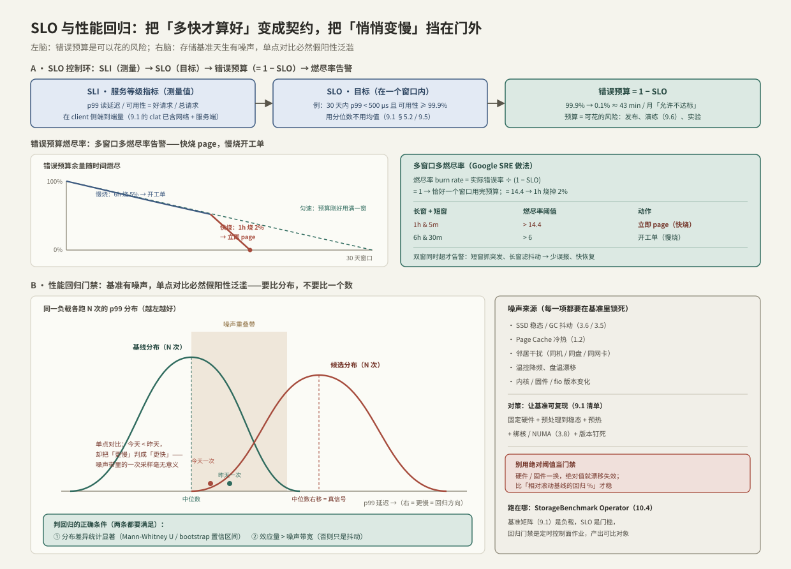

---
tags:
  - 高性能存储/性能观测与可靠性
---
# SLO 与性能回归

> 前面几篇给了你**量**的能力（[[9.1 fio Benchmark Matrix]] 到 [[9.5 p99 毛刺定位]]）和**破坏**的能力（[[9.6 故障注入矩阵]]）。但量出来一个数不等于知道它好不好，破坏一次不等于以后不退化。本篇补上两件事：**「多快才算达标」怎么定义成可度量、可预算、可告警的契约（SLO）**，以及**「悄悄变慢」怎么在合并进主干前就被挡住（性能回归门禁）**。
>
> 这两件事对有并发背景的人各有一个熟悉的锚点。SLO 像一条**不变量（invariant）**，但它是**概率化、带时间窗**的——不是「每次都 < 500 μs」，而是「一个月里 99.9% 的请求 < 500 μs」；剩下的 0.1% 就是**错误预算**，是你可以主动花掉的风险（发布、演练、实验）。性能回归门禁则像一个**会失败构建的性能单测**，只是存储基准天生有噪声（GC、缓存、邻居、温控），naive 的「和昨天比一个数」必然假阳性泛滥——必须换成分布对比。

前置：[[9.1 fio Benchmark Matrix]]（可复现基准与百分位聚合陷阱）、[[9.5 p99 毛刺定位]]（为什么盯尾部）、[[3.6 空盘与稳态性能]]（基准噪声的最大来源）、[[9.6 故障注入矩阵]]（稳态定义即 SLI，注入红线即 SLO）。

---

## 1. SLI / SLO / SLA / 错误预算：四个必须分清的词

| 术语 | 定义 | 例子 |
| --- | --- | --- |
| **SLI**（指标） | 一个**测量出来**的服务质量数字 | p99 读延迟；可用性 = 好请求数 / 总请求数 |
| **SLO**（目标） | SLI 在一个**时间窗**内要达到的目标 | 30 天内 p99 < 500 μs 且 可用性 ≥ 99.9% |
| **SLA**（协议） | 对外的**合同**，违约有赔偿；通常比 SLO 松 | 合同写 99.5%，内部 SLO 定 99.9% |
| **错误预算** | 1 − SLO，即**允许不达标的额度** | 99.9% → 0.1% ≈ 43 min / 月 |

三个关键点【事实】：

1. **SLI 是测量值，不是愿望**。它必须能从遥测里算出来，且算法要固定（在哪测、怎么聚合、窗口多长）——否则不可比，也就不能用于回归。
2. **SLO 一定带窗口和分位数**。没有窗口的「延迟 < 500 μs」不可证伪；用均值的 SLO 会被长尾骗过（[[9.1 fio Benchmark Matrix]] §5.2 的百分位聚合陷阱：多 job 的 p99 不能算术平均）。
3. **错误预算是一种资源**。100% 可靠既不可能也不该追求——把预算花在发布速度、故障演练（[[9.6 故障注入矩阵]]）、架构实验上，是刻意的工程决策，而不是失败。

> [!note] 为什么不追求 100%
> 可靠性每加一个九，成本指数上升，而用户在某个点之后根本感知不到。错误预算把「可靠性 vs 迭代速度」这对矛盾**量化**成一个可以花的账户：预算没烧完就能继续发新特性、搞演练；烧超了就冻结变更、专心补稳定性。这就是把工程优先级和一个可测的数绑定起来。

---

## 2. 给存储选 SLI：在哪测、测什么

选 SLI 的核心问题是「用户真正感知的是什么」。存储有几个容易踩的坑【实现】：

### 2.1 延迟：分位数 + 测量位置

- **用分位数，不用均值**：均值被批处理和长尾掩盖；至少报 p50 / p99 / p99.9（[[9.5 p99 毛刺定位]]）。
- **在 client 侧端到端量**：用户感知的是从发起到完成的全程。服务端只量自己那段，会漏掉客户端排队、网络、重传。[[9.1 fio Benchmark Matrix]] §5.1 已经拆过：`clat` 对网络存储包含客户端协议栈、网络、服务端排队和介质——SLI 要覆盖的正是这条端到端链。

### 2.2 可用性：hung IO 的归属

存储的可用性比无状态服务微妙【事实】：一个**hang 住的 IO** 既不是成功也不是失败，直到超时才「宣判」（[[5.5 Multipath 与故障切换]] §1 的静默死）。所以可用性 SLI 必须先定义**请求截止时间**：超过 deadline 未完成的，计为失败。否则一堆永远不返回的 IO 会让「成功率」虚高——分母都还没算进去。

### 2.3 吞吐是地板，持久性是另一个维度

- **吞吐 / IOPS**：通常作为**下限**（floor）SLI——「带宽不低于 X」，而不是追求越高越好。
- **持久性（durability）**：与可用性不同，衡量的是「已确认的数据不丢」，靠 [[6.1 WAL 与 Crash Consistency]] / [[7.1 副本 vs EC]] 的机制保证，用崩溃 / 故障注入（[[6.10 崩溃注入测试]] / [[9.6 故障注入矩阵]]）验证，而不是靠延迟基准。

> [!tip] AI 存储的终极 SLI 是 GPU 利用率
> 对训练 / 推理集群，用户不关心盘多快，只关心 **GPU 有没有在等数据**。MLPerf Storage 直接把 **AU（accelerator utilization，加速器利用率）** 定成门槛——存储必须让加速器保持在某个忙碌比例（如 ≥ 90%）之上才算合格（[[8.8 MLPerf Storage]]）。这把存储 SLI 和最贵的资源直接挂钩，比任何 IOPS 数字都有说服力（归因见 [[8.7 DataLoader 与 GPU 空闲归因]]）。

---

## 3. 错误预算作为控制机制：多窗口多燃尽率告警

有了错误预算，告警就不该再盯「CPU 90%」这种原因，而应盯**预算烧得多快**这种症状。核心量是**燃尽率（burn rate）**【事实】：

$$
\text{burn} = \frac{\text{error rate}}{1 - \text{SLO}}
$$

burn = 1 表示按这个速度**恰好在一个窗口用完预算**；burn = 14.4 表示烧得快 14.4 倍。它和窗口长度一乘就得到「这段时间烧掉多少预算」：

$$
14.4 \times \frac{1}{720} = 2\%
$$

（30 天 = 720 小时，所以 1 小时按 burn=14.4 烧掉 2% 的月预算。）



**多窗口多燃尽率**（Google SRE 的标准做法）用一张小表把「快烧」和「慢烧」分开处理【方法】：

| 长窗 + 短窗 | 燃尽率阈值 | 消耗预算 | 动作 |
| --- | --- | --- | --- |
| 1h + 5m | > 14.4 | 1h 烧 2% | 立即 page（人要醒） |
| 6h + 30m | > 6 | 6h 烧 5% | 开工单（慢慢查） |

两个设计【实现】：

- **双窗口联合判定**：长窗（1h）决定「是不是真在快烧」，短窗（5m）决定「现在是否还在烧」。两个都超才告警——长窗滤掉瞬时抖动（少误报），短窗保证问题缓解后**快速自动消警**（不用人手动关）。
- **分级响应**：快烧危及本月 SLO，值得半夜叫醒人；慢烧留有余地，开工单白天处理。这直接决定了 [[9.8 Runbook 与可运维产物]] 里哪些告警配 page、哪些配 ticket。

---

## 4. 性能回归：存储基准天生有噪声

SLO 守的是「线上现在够不够好」；性能回归守的是「这次改动有没有让它悄悄变慢」。难点只有一个词：**噪声**。

### 4.1 噪声从哪来

同一份负载、同一台机器，连跑十次结果都不一样。主要来源【事实】：

| 噪声源 | 机制 | 出处 |
| --- | --- | --- |
| SSD 稳态 / GC | 空盘有 SLC 缓存和空闲块，写着写着掉速；GC 抖动随机 | [[3.6 空盘与稳态性能]] / [[3.5 GC 写放大与 Over-Provisioning]] |
| Page Cache 冷热 | 首次跑冷缓存慢，重复跑命中内存快 | [[1.2 Page Cache 命中与未命中]] |
| 邻居干扰 | 同机 / 同盘 / 同网卡的其他负载抢资源 | 共享资源竞争 |
| 温控降频 | 盘温 / CPU 温度到阈值降频 | 硬件 |
| 版本漂移 | 内核 / 固件 / fio 版本变了，路径就变了 | [[9.1 fio Benchmark Matrix]] §8 |

### 4.2 先让基准可复现，再谈比较

回归测试的前提是**把噪声源全锁死**，否则比的是噪声不是代码【前提】。锁法就是 [[9.1 fio Benchmark Matrix]] §8 的实验清单：固定硬件、预处理到稳态、预热（`ramp_time`）、绑核 / NUMA（[[3.8 PCIe 拓扑与 NUMA]]）、钉死内核 / 固件 / fio 版本。把这些写进 manifest，结果才进回归基线。

---

## 5. 统计判定：比分布，不要比一个数

即使锁死了噪声源，单次运行仍有残余抖动。所以回归判定的第一原则【方法】：**不要拿今天一次和昨天一次比**。

- **单点对比**：候选跑一次、基线跑一次，谁大谁小。噪声带里的一次采样毫无意义——今天正好抽到快的一次，会把「实际更慢」误判成「更快」（见图下半部分的两个圆点）。
- **分布对比**：候选和基线**各跑 N 次**，比两个分布。判「回归」要同时满足两条：
  1. **统计显著**：两分布的差异不像是随机噪声。延迟是右偏分布，用非参方法——**Mann-Whitney U 检验**，或对「中位数 / p99 之差」做 **bootstrap 置信区间**；
  2. **效应量够大**：差异幅度超过噪声带宽才算数（比如「p99 回归 > 5% 且置信区间不含 0」）。只显著不够——样本量一大，1% 的无关紧要差异也会「显著」。

对连续跑的时间序列（每天一个点），还可以用**变点检测（change-point detection）** 找出「哪一次提交起指标发生了台阶式漂移」，比固定阈值更能容忍缓慢趋势。

### 5.1 相对基线，不用绝对阈值

> [!warning] 绝对阈值会随硬件漂移失效
> 「p99 必须 < 500 μs」这种绝对门禁，换一批盘、升一次固件就可能整体失守或整体虚松。稳健的做法是比**相对滚动基线的回归百分比**：候选比近期基线中位数慢超过 X%（且统计显著）才判失败。这和 [[9.6 故障注入矩阵]] §4.2 判慢盘用「同伴对比而非绝对值」是同一条原则——**基准会漂移，相对关系才稳定**。

### 5.2 门禁的假阳性 / 假阴性权衡

回归门禁本质是个二分类器，逃不掉那个旋钮【取舍】：

- 阈值太紧（对差异太敏感）→ **假阳性泛滥**：噪声天天报警，工程师学会无视门禁，等于没门禁；
- 阈值太松 → **假阴性**：真回归漏过去，攒几次小回归就是一次大退化。

调这个旋钮和 [[10.6 健康检查与故障摘除]] 的「检测灵敏度 vs 误判率」、[[5.5 Multipath 与故障切换]] 的「快切换 vs 误判抖动」是同一道题：**没有免费的灵敏度**。工程上靠「提高信噪比」（多跑几次、锁死噪声源）来同时改善两端，而不是硬拧阈值。

### 5.3 跑在哪：控制面的定时作业

性能回归不是 CI 里一句 `fio` 就完事的——它需要专用硬件、稳态预处理、多次运行、结果留存。这正是 [[10.4 StorageBenchmark Operator]] 的职责：**基准矩阵（[[9.1 fio Benchmark Matrix]]）是负载，SLO 是门槛，回归门禁是一个定时的控制面作业**，产出可长期比对的结构化结果（[[10.1 数据面与控制面分工]]）。

---

## 6. Modern C++：一个能正确合并的延迟 SLI 记录器

要算全局 p99，绕不开一个多线程事实【实现】：**分位数不能对各线程的 p99 求平均**（[[9.1 fio Benchmark Matrix]] §5.2）。唯一正确的做法是**每线程记直方图，先合并再求分位数**。这就是并发指标采集的标准形状——每线程私有累积、栅栏处汇总，和 [[5.5 Multipath 与故障切换]] 的每路径计数器同一条公理：**宁可每线程一份，不要全局一把锁**。

```cpp
#include <array>
#include <atomic>
#include <cstddef>
#include <cstdint>

// 定长对数分桶直方图：记录纳秒延迟，桶边界几何增长，相对误差有界。
// 关键性质：分位数必须从「合并后的直方图」求，绝不能对各线程 p99 取平均。
class LatencyHistogram {
public:
    static constexpr std::size_t kBuckets = 256;

    // 热路径：每笔 IO 完成后记一次。relaxed 足够——计数不依赖其它内存的顺序
    void record(std::uint64_t ns) noexcept {
        counts_[bucket_of(ns)].fetch_add(1, std::memory_order_relaxed);
    }

    // 汇总：把另一份（如另一线程的）直方图并进来
    void merge(const LatencyHistogram& other) noexcept {
        for (std::size_t i = 0; i < kBuckets; ++i) {
            counts_[i].fetch_add(other.counts_[i].load(std::memory_order_relaxed),
                                 std::memory_order_relaxed);
        }
    }

    // 求分位数：累计占比达到 q 落在哪个桶，返回该桶上界（保守取上界）
    std::uint64_t quantile(double q) const noexcept {
        std::uint64_t total = 0;
        for (const auto& c : counts_) total += c.load(std::memory_order_relaxed);
        if (total == 0) return 0;
        const auto target = static_cast<std::uint64_t>(q * static_cast<double>(total));
        std::uint64_t seen = 0;
        for (std::size_t i = 0; i < kBuckets; ++i) {
            seen += counts_[i].load(std::memory_order_relaxed);
            if (seen >= target) return upper_bound_of(i);
        }
        return upper_bound_of(kBuckets - 1);
    }

private:
    static std::size_t bucket_of(std::uint64_t ns) noexcept;      // 对数映射，实现略
    static std::uint64_t upper_bound_of(std::size_t i) noexcept;  // 桶上界，实现略
    std::array<std::atomic<std::uint64_t>, kBuckets> counts_{};
};

// SLO 判定：p_q 分位数是否在阈值内
struct Slo {
    double quantile;            // 如 0.99
    std::uint64_t threshold_ns; // 如 500'000（500 μs）
};

bool meets(const LatencyHistogram& merged, const Slo& slo) noexcept {
    return merged.quantile(slo.quantile) <= slo.threshold_ns;
}
```

三个要点【实现 / 取舍】：

- **先 `merge` 再 `quantile`**：这是「百分位聚合陷阱」在代码里的正解——把样本合到一起再排位，而不是把各家的位次平均；
- **`record` 用 relaxed**：计数递增不需要和其它内存建立顺序关系，relaxed 最省；真正的极限热路径会进一步**每线程私有 + 定期 merge**，把原子写也省掉（代价是分位数有一个采样窗口的延迟）；
- **对数分桶 = 有界相对误差**：生产级实现是 **HdrHistogram**（High Dynamic Range），能在 1 ns~1 h 跨度上无损保留分位数、误差有界。上面的骨架是它的最小心智模型。

---

## 7. 陷阱与误区

> [!warning] 常见错误
> 1. **SLO 用均值**：均值被长尾骗过，p99 早爆了均值还漂亮（[[9.5 p99 毛刺定位]]）。
> 2. **只在服务端量 SLI**：漏掉客户端排队、网络、重传——用户感知的是端到端（§2.1）。
> 3. **可用性不定义 deadline**：hung IO 既不成功也不失败，成功率虚高（§2.2）。
> 4. **告警盯原因不盯症状**：报「CPU 90%」而不是「预算在快烧」，一堆无动作告警把人淹没（§3）。
> 5. **回归拿单次和昨天比**：噪声带里的一次采样毫无意义，假阳性泛滥（§5）。
> 6. **基准不预处理不预热**：拿空盘 + 冷缓存的成绩当基线，比的是噪声不是代码（§4、[[3.6 空盘与稳态性能]]）。
> 7. **用绝对阈值当门禁**：换硬件 / 升固件就整体失守或虚松，要比相对滚动基线（§5.1）。
> 8. **把错误预算当成「必须清零的 bug」**：预算是用来花的；没烧完说明你发布太保守（§1）。

---

## 8. 关键结论

| 结论 | 性质 |
| --- | --- |
| SLI 是测量值、SLO 是带窗口带分位数的目标、SLA 是对外合同、错误预算 = 1 − SLO | 事实 |
| 错误预算是可以主动花的风险额度（发布 / 演练 / 实验），追求 100% 可靠既不可能也不该 | 实践结论 |
| 存储延迟 SLI 要用分位数、在 client 端到端量；可用性必须先定义请求 deadline | 实现 |
| AI 存储的终极 SLI 是加速器利用率 AU（MLPerf Storage），直接挂钩最贵的资源 | 事实 |
| 告警盯燃尽率（burn = error rate / (1 − SLO)）；多窗口多燃尽率：快烧 page、慢烧工单 | 方法论 |
| 存储基准天生有噪声（GC / 缓存 / 邻居 / 温控 / 版本），回归前必须把噪声源全锁死 | 前提 |
| 回归判定要比分布不比单点：统计显著（Mann-Whitney / bootstrap CI）AND 效应量 > 噪声带 | 方法论 |
| 用相对滚动基线的回归 %，不用绝对阈值——基准会漂移，相对关系才稳定 | 实现 |
| 全局分位数必须先合并直方图再求；对各线程 p99 取平均是错的 | 事实 |

---

## 关联知识

- [[9.1 fio Benchmark Matrix]] - 可复现基准、百分位聚合陷阱、实验 manifest
- [[9.5 p99 毛刺定位]] - 为什么盯尾部；SLI 的延迟分位数从哪来
- [[9.6 故障注入矩阵]] - 稳态定义即 SLI，注入自动中止红线即 SLO
- [[3.6 空盘与稳态性能]] - 回归噪声的最大来源；预处理依据
- [[10.4 StorageBenchmark Operator]] - 回归门禁作为定时控制面作业的载体
- [[10.6 健康检查与故障摘除]] - 灵敏度 vs 误判是同一道旋钮题
- [[8.8 MLPerf Storage]] - AU 作为 AI 存储的 SLO
- [[8.7 DataLoader 与 GPU 空闲归因]] - AU 不达标时归因到存储
- [[9.8 Runbook 与可运维产物]] - 燃尽率分级决定告警配 page 还是 ticket

---

## 参考

- [Google SRE Workbook: Alerting on SLOs（多窗口多燃尽率）](https://sre.google/workbook/alerting-on-slos/)
- [Google SRE Book: Service Level Objectives](https://sre.google/sre-book/service-level-objectives/)
- [HdrHistogram](http://hdrhistogram.org/)
- [MLPerf Storage Benchmark](https://mlcommons.org/benchmarks/storage/)
