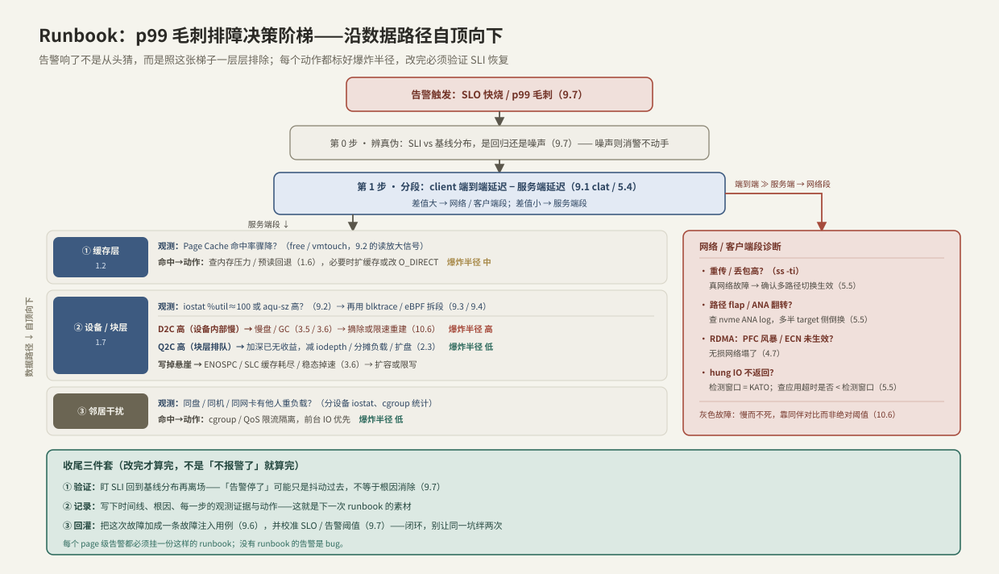

---
tags:
  - 高性能存储/性能观测与可靠性
---
# Runbook 与可运维产物

> 到这里，整个专题的知识已经齐了：会画路径（第 1 章）、会量（[[9.1 fio Benchmark Matrix]] 到 [[9.5 p99 毛刺定位]]）、会破坏（[[9.6 故障注入矩阵]]）、会定契约（[[9.7 SLO 与性能回归]]）。但这些知识现在都在**你的脑子里**——凌晨三点告警响的时候，值班的可能不是你，也可能是睡懵的你。本篇讲怎么把这些知识**打包成产物**，让一个有时间压力、缺上下文的人（或一段自动化代码）也能做对：**Runbook**（把「某个告警响了怎么办」写成可执行的诊断-处置流程）和一整套**可运维产物**（仪表盘、告警、SLO 定义、容量模型、演练记录、事后复盘）。
>
> 对写系统的人，这有个准确的类比：可运维产物是系统与运维者之间的**接口契约**，只不过它描述的不是正常调用，而是**失败时的行为**。而「只有某个工程师才知道怎么修」的系统，本质是一个**单点故障**——那个人休假、离职，或者只是在开会，系统就没人会救。把运维知识产物化，就是消除这个 SPOF。

前置：[[9.5 p99 毛刺定位]]（排障的下钻方法）、[[9.7 SLO 与性能回归]]（告警分级的依据）、[[10.6 健康检查与故障摘除]]（自愈的限速与雪崩）、[[9.2 iostat 指标解读]] / [[9.3 blktrace 与块层生命周期]] / [[9.4 eBPF biolatency biosnoop]]（排障清单里用到的观测工具）。

---

## 1. 概念与边界：「能跑」和「能运维」是两回事

一个系统 benchmark 全绿、SLO 达标，不等于它**可运维（operable）**。可运维指的是【事实】：

- 出问题时，**能被看见**（有覆盖数据路径每一层的遥测）；
- 出问题时，**知道该做什么**（有把诊断和处置写下来的 runbook）；
- 处置动作**有边界、可回滚**（每个动作标了爆炸半径）；
- 这套东西**不依赖某个人的记忆**（是产物，不是口口相传）。

> [!note] Runbook ≠ 文档
> 文档解释「系统怎么工作」，面向学习，可以很长很泛。**Runbook 面向一次具体告警**，回答「这个告警响了，第一步查什么、第二步做什么」，必须**具体、可执行、有决策分支**。一份好的 runbook 是决策树，不是散文——半夜没人读三页背景，只想知道下一步敲什么命令。

这条边界决定了本篇所有产物的判据：**能不能让缺上下文的人在压力下做对**。

---

## 2. 可运维产物栈：把前面每一篇变成一件产物

| 产物 | 是什么 | 由哪篇喂养 |
| --- | --- | --- |
| **仪表盘** | 覆盖数据路径每层的实时遥测 | [[9.2 iostat 指标解读]] / [[9.3 blktrace 与块层生命周期]] / [[9.4 eBPF biolatency biosnoop]] |
| **告警** | 症状触发、分级、每条挂 runbook | [[9.7 SLO 与性能回归]]（燃尽率决定 page / ticket） |
| **Runbook** | 每个告警的诊断-处置-验证流程 | 本篇 §4 / §5 |
| **SLO 定义** | 「多快才算好」的可测契约 | [[9.7 SLO 与性能回归]] |
| **容量模型** | N-1 规划、饱和点、扩容触发线 | [[5.5 Multipath 与故障切换]] §6 |
| **演练记录（game-day）** | 注入过哪些故障、系统怎么反应 | [[9.6 故障注入矩阵]] |
| **事后复盘（post-mortem）** | 每次事故的时间线、根因、改进项 | 本篇 §5 收尾 |

### 2.1 仪表盘：三套通用信号模型

仪表盘不是把所有指标堆上去，而是按成熟的信号模型组织【方法】：

- **四个黄金信号**（Google SRE，面向服务）：延迟、流量、错误、饱和度；
- **USE**（面向资源，如盘 / 网卡 / CPU）：利用率（Utilization）、饱和度（Saturation）、错误（Errors）；
- **RED**（面向请求）：速率（Rate）、错误（Errors）、时延（Duration）。

对存储，最有价值的专用面板是**按数据路径分层的延迟分解**：把端到端延迟拆成 client 排队 / 网络 / 服务端排队 / 块层 / 设备各段（[[9.1 fio Benchmark Matrix]] §5.1 的 `clat` 分解、[[5.4 延迟分解方法论]]）。有了这张分层图，§4 的排障才能「一眼看出瓶颈在哪层」，而不是逐层猜。

---

## 3. 告警纪律：症状触发，条条可动作

告警是运维产物里最容易做坏的一件。三条纪律【方法】：

1. **告症状，不告原因**。「p99 SLO 在快烧」是症状（用户在疼），「某盘 %util 90%」是原因（未必有人疼——高利用率可能完全正常）。盯着原因告警会制造大量**无动作告警**。原因指标留给排障时看，不用来 page。
2. **每条 page 都必须可动作、且挂 runbook**。半夜叫醒人，就得有明确的下一步。收到一条「不知道要干嘛」的告警，是产物缺陷。
3. **分级对应燃尽率**（[[9.7 SLO 与性能回归]] §3）：快烧（1h 烧 2% 预算）→ page 叫醒人；慢烧（6h 烧 5%）→ 开工单白天处理。

> [!warning] 告警疲劳是真实的失效模式
> 告警太多、太吵、太多假阳性，工程师会**学会无视它**——然后真告警也被无视。这和 [[9.7 SLO 与性能回归]] §5.2 的回归门禁假阳性、[[10.6 健康检查与故障摘除]] 的误判是同一个病：**信噪比低于某个线，整个机制就等于关掉了**。少而准，好过多而吵。

---

## 4. Runbook 解剖与可操作排障清单

一份 runbook 的骨架固定【方法】：**触发（哪个告警）→ 稳态（正常长什么样）→ 诊断（决策树）→ 处置（选项 + 爆炸半径）→ 验证（SLI 恢复）→ 升级 / 回滚 → 事后**。

其中「诊断」这一步，对存储有一个天然的结构：**沿数据路径自顶向下排除**。这正是全专题「先画路径」纪律的回报——排障不是撞运气，是照着路径一层层缩小范围。



把这张梯子写成文字清单（**p99 毛刺 runbook**）：

> **触发**：SLO 快烧告警 / p99 毛刺（[[9.5 p99 毛刺定位]]）
>
> **第 0 步 · 辨真伪**：SLI 与基线分布对比，是真回归还是噪声（[[9.7 SLO 与性能回归]]）。是噪声就消警，不动手。
>
> **第 1 步 · 分段**：比较 client 端到端延迟与服务端延迟（[[9.1 fio Benchmark Matrix]] §5.1 / [[5.4 延迟分解方法论]]）。差值大 → 走网络段；差值小 → 走服务端段。
>
> **服务端段（沿路径下钻）**：
> 1. **缓存层**（[[1.2 Page Cache 命中与未命中]]）：命中率骤降？→ 查内存压力 / 预读回退（[[1.6 readahead 与 posix_fadvise]]），必要时扩缓存。`爆炸半径 中`
> 2. **设备 / 块层**：`iostat -x` 看 `%util≈100` 或 `aqu-sz` 高？（[[9.2 iostat 指标解读]]）→ 用 `blktrace` / eBPF 把延迟拆成排队段与设备段（[[9.3 blktrace 与块层生命周期]] / [[9.4 eBPF biolatency biosnoop]]）：
>    - **D2C 高**（设备内部慢）→ 慢盘 / GC（[[3.5 GC 写放大与 Over-Provisioning]] / [[3.6 空盘与稳态性能]]）→ 摘除或限速重建（[[10.6 健康检查与故障摘除]]）。`爆炸半径 高`（会触发重建流量）
>    - **Q2C 高**（块层排队）→ 加深队列已无收益，减 `iodepth` / 分摊负载 / 扩盘（[[2.3 iodepth 与提交完成路径]]）。`爆炸半径 低`
>    - **写掉悬崖** → `ENOSPC` / SLC 缓存耗尽 / 稳态掉速（[[3.6 空盘与稳态性能]]）→ 扩容或限写。
> 3. **邻居干扰**：同盘 / 同机 / 同网卡有他人重负载？→ cgroup / QoS 限流隔离，前台 IO 优先。`爆炸半径 低`
>
> **网络段**：重传 / 丢包高（`ss -ti`）→ 确认多路径切换生效（[[5.5 Multipath 与故障切换]]）；路径 flap / ANA 翻转 → 查 `nvme` ANA log；hung IO 不返回 → 检测窗口 = KATO，检查应用超时是否 < 检测窗口。
>
> **收尾三件套**：① 验证 SLI 回到基线再离场；② 记录时间线、根因、证据；③ 回灌——加一条故障注入用例（[[9.6 故障注入矩阵]]）+ 校准 SLO / 告警（[[9.7 SLO 与性能回归]]）。

【实践】注意每个动作都标了**爆炸半径**：摘除慢盘会触发副本重建（大规模顺序读 + 网络搬运，[[7.1 副本 vs EC]]），是重动作；cgroup 限流只影响本机，是轻动作。半夜处置先选爆炸半径小的。

---

## 5. 三个存储专用 Runbook（可直接照抄的处置骨架）

### 5.1 R1 · 慢盘（灰色故障）

```text
触发：某盘延迟显著高于同伴（同伴对比，非绝对阈值，10.6）
稳态：同批盘 p99 应在同一量级
诊断：iostat 分设备看 aqu-sz/svctm → blktrace 确认 D2C 段高（设备内部慢，3.5/3.6）
处置：① 先降级——把该盘移出读路径（保留副本），观察端到端 p99 是否回落
      ② 确认坏 → 摘除 + 限速重建（backfill throttle，10.6）  爆炸半径 高
验证：端到端 p99 回到基线；重建不把剩余节点拖进饱和（5.5 §6 的 N-1 容量）
陷阱：绝对阈值会误判——高负载下健康盘也会短暂超标（9.6 §4.2）
```

### 5.2 R2 · 路径抖动 / hung IO

```text
触发：NVMe-oF 客户端 IO 超时或延迟毛刺（5.5）
诊断：nvme list-subsys 看 ANA 状态；ss -ti 看重传；区分「有信号的死」与「静默 hang」
处置：静默死只能等检测窗口（KATO）——先确认多路径已切到备用路径
      检查应用超时预算是否 ≥ 检测窗口（否则应用先崩，5.5 §7）
验证：流量切到 optimized 路径；后台重连不影响前台
陷阱：两条路共享物理部件（同网卡/同交换机）= 拓扑冗余、故障域单点（5.5）
```

### 5.3 R3 · 容量 / 写掉悬崖

```text
触发：写延迟阶跃上升 或 ENOSPC 逼近
诊断：df 看容量水位；确认是否进入 SSD 稳态掉速（SLC 缓存耗尽 + GC，3.5/3.6）
处置：① 短期——限写 / 迁移冷数据腾空间，让 GC 追上
      ② 中期——扩容；③ 复盘容量模型的扩容触发线是否定得太晚
验证：写 p99 回落；OP 空间恢复到健康水位
陷阱：用空盘短测成绩做容量规划，忽略稳态掉速（9.1 §4.1）
```

---

## 6. Modern C++：把 Runbook 的关键步骤变成不会泄漏的代码

Runbook 里最危险的一步永远是「先把节点摘掉 / drain 掉再动手」——因为**如果处置中途出错、节点被留在半摘除状态，就是一次自造事故**。这正是 RAII 的主场：把「进入维护 = 停流量、离开维护 = 一定恢复」写进类型系统，无论正常、异常还是提前 return【实现】。

```cpp
#include <chrono>
#include <cstdint>

// 摘除守卫：构造 = 把节点标记 draining（停接新 IO、放行在途）；
// 析构 = 一定恢复到 serving。RAII 保证绝不会留下「半摘除」的节点。
// 「排空在途」= 并发里的 join 语义：不是杀掉在飞的 IO，是等它们落地。
class DrainGuard {
public:
    DrainGuard(ControlPlane& cp, NodeId node, std::chrono::seconds quiesce_timeout)
        : cp_{cp}, node_{node} {
        cp_.set_state(node_, NodeState::draining);        // 停止新流量
        cp_.wait_inflight_quiesced(node_, quiesce_timeout);// 等在途 IO 排空（带超时）
    }

    ~DrainGuard() noexcept {                               // 析构绝不抛
        try {
            cp_.set_state(node_, NodeState::serving);      // 无论如何都恢复
        } catch (...) {
            cp_.alert("drain restore failed, node stuck draining", node_);
        }
    }

    DrainGuard(const DrainGuard&) = delete;
    DrainGuard& operator=(const DrainGuard&) = delete;

private:
    ControlPlane& cp_;
    NodeId node_;
};

// 自愈限速：令牌桶。防止「检测抖动 → 疯狂摘除 → 副本重建 → 更多误判」的雪崩（10.6）。
// now 由调用方传入（可测、可复现），不在类内部读时钟。
class RemediationGate {
public:
    explicit RemediationGate(int burst) : tokens_{burst}, burst_{burst} {}

    bool allow(std::chrono::steady_clock::time_point now) {
        refill(now);
        if (tokens_ <= 0) return false;   // 配额用尽：拒绝，宁可慢一点也不制造风暴
        --tokens_;
        return true;
    }

private:
    void refill(std::chrono::steady_clock::time_point now);  // 按时间补充令牌，实现略
    int tokens_;
    int burst_;
};
```

用法把两者叠起来，就是一条安全的自愈动作【实现】：

```cpp
void maybe_evict_slow_disk(ControlPlane& cp, NodeId node,
                           RemediationGate& gate,
                           std::chrono::steady_clock::time_point now) {
    if (!gate.allow(now)) return;                 // 限速：这一轮不该再摘了（防雪崩）
    DrainGuard guard{cp, node, std::chrono::seconds{30}};
    run_maintenance(cp, node);                    // 即便这里抛异常……
}                                                 // ……guard 析构也会把节点恢复 serving
```

三处呼应全专题的设计公理【实现】：

- **`DrainGuard` 析构恢复** = [[9.6 故障注入矩阵]] §6 的 `ScopedFault` 同一招：把「结束必须清理」从「记得写」升级成「编译器保证」；
- **`wait_inflight_quiesced` = join** = 摘节点不是 `kill -9` 在途 IO，而是像 `std::jthread` 析构那样**等它们干净结束**，避免把在途请求变成半截状态（[[5.5 Multipath 与故障切换]] §5 的 bio 层干净重试是另一种解法）；
- **`RemediationGate` 限速** = [[10.6 健康检查与故障摘除]] 的断路器：自愈动作必须限量，否则「检测系统自己成了最大故障源」。

【取舍】自动化能做**诊断和低爆炸半径动作**（限流、切路径、扩缓存），但**高爆炸半径动作（摘除 + 重建）应保留人工确认或极严格的限速**——自动化在灰色故障下最容易把「忙」误判成「死」而连锁摘除。runbook 里哪几步能自动、哪几步要人拍板，本身就是要写清楚的一格。

---

## 7. 产物质量门：Runbook 会腐烂，必须演练

一份 runbook 写完不是终点，它会随系统演进而**过期**——命令失效、指标改名、架构变了。质量门【方法】：

- [ ] **针对具体告警**，不是泛泛的「系统慢了怎么办」；
- [ ] **是决策树**，每个分支有明确的下一步命令 / 观测；
- [ ] **每个动作标了爆炸半径**和回滚方式；
- [ ] **链到对应仪表盘**（点开就能看，不用现找）；
- [ ] **被演练验证过**：在 game-day（[[9.6 故障注入矩阵]]）里真按它走一遍，走不通就是坏的；
- [ ] **每个 page 级告警都有 runbook**——没有 runbook 的 page 是 bug。

> [!tip] 闭环
> 故障注入（[[9.6 故障注入矩阵]]）制造故障 → 排障时用 runbook → 事后复盘补齐 runbook 的缺口、并把这次故障加成一条新的注入用例 → 下次演练验证 runbook 是否真的管用。**注入、SLO、runbook 三者构成一个自我强化的闭环**，这正是第 9 章「性能观测与可靠性」的收束：观测让你看见，注入让你预演，SLO 让你有标尺，runbook 让知识不随人流失。

---

## 8. 陷阱与误区

> [!warning] 常见错误
> 1. **把文档当 runbook**：三页背景没有决策树，半夜没人读——runbook 要具体可执行（§1）。
> 2. **告警盯原因不盯症状**：`%util 90%` 天天报却没人疼，真症状被淹没（§3）。
> 3. **有 page 没 runbook**：叫醒人却不告诉下一步——这是产物缺陷（§3、§7）。
> 4. **排障不沿路径、凭猜**：放着分层延迟面板不用，逐层试错（§2.1、§4）。
> 5. **动作不标爆炸半径**：半夜第一步就摘盘触发重建风暴（§4、§5.1）。
> 6. **自愈不限速**：检测抖动触发连锁摘除，检测系统成了最大故障源（§6、[[10.6 健康检查与故障摘除]]）。
> 7. **节点半摘除泄漏**：处置中途出错，节点卡在 draining——用 RAII 守卫兜底（§6）。
> 8. **runbook 从不演练**：写完就烂在 wiki 里，真出事发现命令早失效（§7）。
> 9. **「告警停了」就离场**：抖动过去不等于根因消除，要验证 SLI 回到基线（§4 收尾）。

---

## 9. 关键结论

| 结论 | 性质 |
| --- | --- |
| 可运维 = 能被看见 + 知道做什么 + 动作有边界可回滚 + 不依赖某个人的记忆 | 事实 |
| Runbook 面向一次具体告警，是决策树不是散文；文档面向学习，两者不同 | 事实 |
| 可运维产物栈：仪表盘 / 告警 / runbook / SLO / 容量模型 / 演练记录 / 复盘——各由前面某篇喂养 | 方法论 |
| 仪表盘按黄金信号 / USE / RED 组织；存储的核心面板是按数据路径分层的延迟分解 | 方法论 |
| 告警要告症状（SLO 燃尽）不告原因；每条 page 可动作且挂 runbook；分级对应燃尽率 | 方法论 |
| 存储排障的诊断天然沿数据路径自顶向下——这是「先画路径」纪律的回报 | 实践结论 |
| 每个处置动作都要标爆炸半径；半夜先选爆炸半径小的（限流 > 摘除重建） | 实践结论 |
| RAII 守卫保证节点绝不半摘除；摘除 = 等在途排空（join），不是 kill 在途 | 实现 |
| 自愈动作必须限速（令牌桶 / 断路器），否则检测系统自己制造雪崩 | 实现 |
| 注入 + SLO + runbook 构成自我强化闭环；没有 runbook 的 page 告警是 bug | 方法论 |

---

## 关联知识

- [[9.5 p99 毛刺定位]] - 排障决策阶梯的下钻方法
- [[9.7 SLO 与性能回归]] - 告警分级（page / ticket）的燃尽率依据
- [[9.6 故障注入矩阵]] - game-day 演练验证 runbook；事后回灌成注入用例
- [[10.6 健康检查与故障摘除]] - 自愈限速、误摘除雪崩、同伴对比
- [[5.5 Multipath 与故障切换]] - R2 路径抖动 runbook；N-1 容量模型
- [[5.4 延迟分解方法论]] - 分层延迟面板的拆解方法
- [[9.2 iostat 指标解读]] / [[9.3 blktrace 与块层生命周期]] / [[9.4 eBPF biolatency biosnoop]] - 排障清单用到的观测工具
- [[10.1 数据面与控制面分工]] - 自愈动作由控制面执行
- [[7.1 副本 vs EC]] - 摘除慢盘触发的重建流量（爆炸半径的来源）

---

## 参考

- [Google SRE Book: Monitoring Distributed Systems（四个黄金信号）](https://sre.google/sre-book/monitoring-distributed-systems/)
- [Brendan Gregg: The USE Method](https://www.brendangregg.com/usemethod.html)
- [Google SRE Workbook: On-Call & Runbooks](https://sre.google/workbook/on-call/)
- [PagerDuty Incident Response Documentation](https://response.pagerduty.com/)
