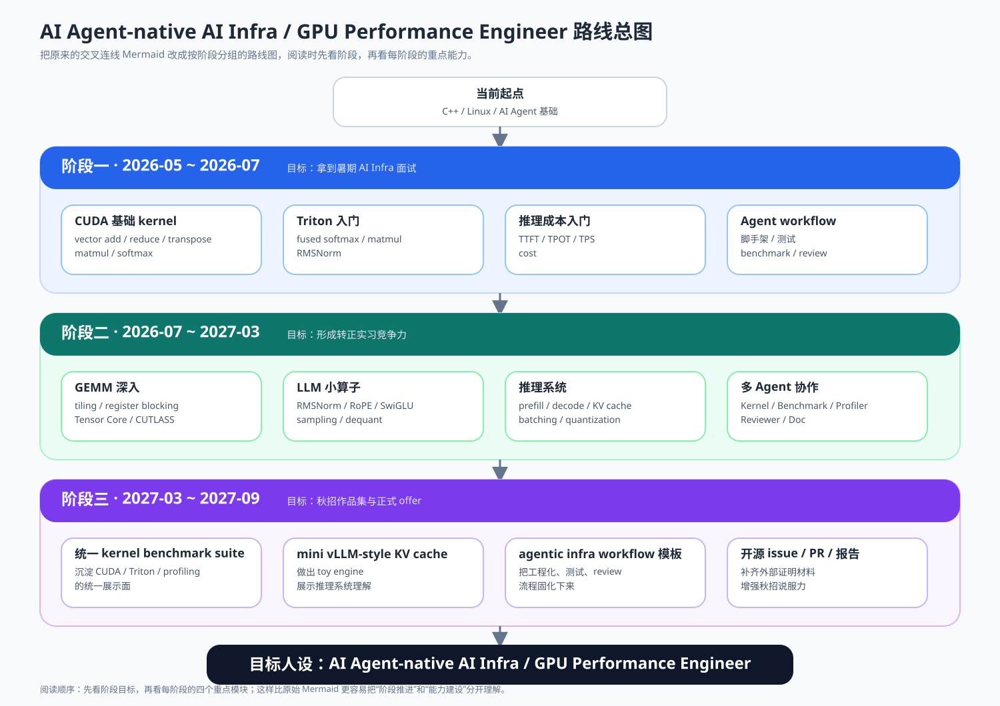
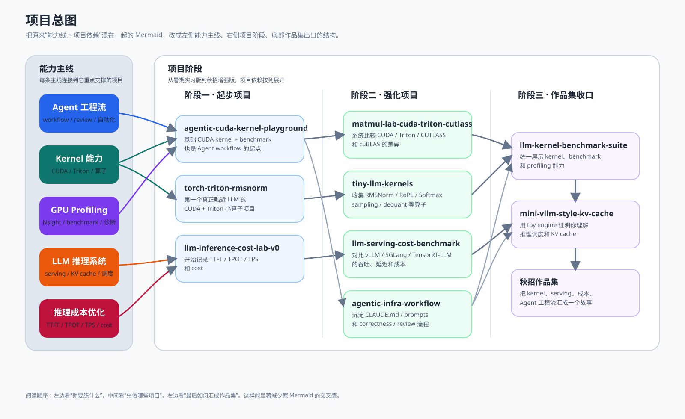

# AI Agent Native 的 AI Infra / GPU Performance Engineer 培养方案

> [!goal] 总目标
> 从“会写 CUDA / Triton kernel，能做 AI Infra 实习”升级为“会用 AI Agent 加速工程开发，但自己能负责 GPU 性能分析、LLM 推理成本优化、kernel 正确性与上线判断”。

这条路线的核心不是放弃 CUDA / Triton，而是把目标从“手写 kernel 的候选人”升级成：

```text
AI Infra Performance Engineer
= AI Agent 工程效率
+ CUDA / Triton / C++ kernel
+ GPU profiling
+ LLM inference engine
+ serving benchmark / observability
+ 推理成本优化
```

普通工程代码会越来越便宜，但以下能力会越来越值钱：

- 性能判断
- 成本判断
- 系统取舍
- 硬件理解
- benchmark 可信度
- 线上推理效率
- serving 指标解释能力
- Agent 生成代码的审查能力

关联笔记：

- [[0.ai 编程/1. claude/1.1 claude code语法|Claude Code 语法]]
- [[0.ai 编程/2. GPT/2.1 codex语法|Codex 语法]]

## 目标升级

原目标：

```text
CUDA / Triton kernel 实习生
```

升级后目标：

```text
AI Agent-native 的 AI Infra / GPU Performance Engineer
```

这意味着你不只是能写 kernel，还要能回答：

- 这个 kernel 为什么慢？
- 它是 memory-bound 还是 compute-bound？
- Nsight 指标能不能支持你的判断？
- 这个优化是否真的降低了 TTFT / TPOT / cost？
- TTFT 变高到底来自 queueing、prefill、decode 还是 KV cache 压力？
- Agent 生成的代码怎么验证 correctness？
- benchmark 数据是否公平、可复现、可解释？
- 这个改动是否值得上线？

> [!important] 核心人设
> 我会用 AI Agent 快速搭工程、生成测试和 benchmark，但 kernel 核心逻辑、correctness、profiling 结论、性能报告和最终上线判断都由我人工验证。

## 为什么补 compiler-aware 视角

这条路线仍然是 **LLM Inference Performance / GPU Infra**，不是转成纯编译器工程师路线。补 compiler-aware 视角，是为了能把高层算子、kernel 实现、profiling 结论、serving 指标和 lowering / codegen correctness 串起来。

不赌 2028 一定是推理爆发年，但按“推理工程链路继续变深、推理成本优化持续重要”来准备；即使赛道节奏变化，kernel + profiling + serving benchmark + compiler-aware 的能力组合仍然可迁移。

AI 可以生成工程代码和初版 kernel，但不能替代以下判断：

- benchmark 是否公平、可信、可复现；
- 性能瓶颈是否被硬件指标支持；
- lowering / codegen 生成的代码是否经过 reference、shape、dtype 和边界条件验证；
- 优化是否真的改善 TTFT / TPOT / TPS / cost，而不是只改善单个 toy benchmark。

## 为什么要把数值分析 / 误差理论接入这条路线

这条路线虽然定位是 **LLM Inference Performance / GPU Infra**，但它不是只拼 CUDA 语法或 vLLM 参数。真正有区分度的地方，是能判断一个 kernel 或 serving 优化在**数值上是否可靠、性能上是否真实、上线后是否可控**。这正好对应 [[第01次课-绪论与误差理论笔记]] 中的四个核心标准：复杂度、精度、稳定性、数值实验。

> [!important] 数值分析在本路线中的定位
> 数值分析不是为了刷积分题，而是为了回答：低精度计算是否稳定？reference test 的误差阈值怎么设？softmax / RMSNorm / reduction 的误差会不会被放大？benchmark 结论是否可信？Agent 生成的 kernel 是否只是“看起来能跑”？

| 误差理论概念 | 在 GPU Performance / 推理 Infra 中的对应问题 | 项目落点 |
|---|---|---|
| 舍入误差 | FP16 / BF16 / FP8 / INT8 下计算结果是否可靠 | RMSNorm、Softmax、MatMul、quantization |
| 截断误差 / 近似替代 | 用低精度、近似 kernel、quantization 替代原始计算时误差是否可接受 | INT8 dequant、FP8/INT4、近似 attention |
| 绝对误差 / 相对误差 | correctness test 不能只看“完全相等”，要设置 `atol / rtol` | PyTorch reference test、多 dtype test |
| 有效数字 | FP32 / FP16 / BF16 的有效精度不同，决定累加策略 | FP16 输入 + FP32 accumulation |
| 误差传播 | reduction、softmax、normalization 中局部误差如何传到输出 | row-wise reduction、stable softmax |
| 条件数 / 病态问题 | 某些输入分布会放大误差，不能只测随机 toy case | 边界 shape、极端值、长序列 |
| 数值稳定性 | 数学等价的写法，工程上可能一个稳定、一个爆炸 | stable softmax、反向/正向递推类比 |
| 数值实验 | 理论判断必须用 benchmark、profiling、correctness 数据闭环 | `benchmark.md`、`profiling.md`、Nsight 证据 |

这会直接改变每个 kernel 项目的验收方式：

- **Softmax**：必须解释为什么要减去 `max(x)`，并用极端输入证明 naive softmax 可能 overflow。
- **RMSNorm**：必须说明为什么 FP16 输入常用 FP32 accumulation，以及 `eps` 对稳定性的影响。
- **Reduction**：必须解释并行归约和 CPU 串行求和结果不完全一致的原因，测试使用合理 `rtol / atol`。
- **MatMul / GEMM**：必须区分 FP32、TF32、FP16、BF16、Tensor Core 路径的精度差异，不只看 TFLOPS。
- **Quantization**：必须记录 scale、zero point、dequant 误差和速度收益，不能只说“INT8 更快”。
- **Serving benchmark**：必须区分性能波动、测量误差和真实优化，避免把一次随机结果当成稳定结论。

### 数值分析进入作品集的最低要求

每个 CUDA / Triton / 推理 benchmark 项目，都要留下一个小节：

```text
Numerical correctness
- Reference: PyTorch / CPU implementation
- Dtypes: FP32 / FP16 / BF16 / INT8 等
- Tolerance: atol / rtol 设置及原因
- Edge cases: 极端值、非对齐 shape、长序列、全 0 / 大值输入
- Stability note: 是否存在 overflow、underflow、相近数相减、大数吃小数等风险
```

### 面试表达

不要只说：

```text
我做了 correctness test。
```

应该说：

```text
我用 PyTorch reference 做 correctness test，并根据 dtype 设置 atol / rtol；对于 softmax 使用 max-shift 保证数值稳定，对于 RMSNorm 使用 FP32 accumulation 控制 FP16 舍入误差；benchmark 结论同时结合 CUDA event、Nsight 指标和多次重复实验，避免把测量噪声当成优化收益。
```


## 能力主线

| 主线 | 要练什么 | 最终简历表达 |
|---|---|---|
| AI Agent 工程流 | Claude Code / Codex / Cursor、MCP、hooks、自动化测试、PR review | 能用 Agent 提高开发效率，但有人工审查和性能验证流程 |
| Transformer / LLM 架构 | decoder-only block、RMSNorm、QKV projection、MHA / GQA / MQA、RoPE、causal mask、Online Softmax、FlashAttention、KV cache、MLP / SwiGLU、MoE、residual、lm_head | 能把一个 Transformer block 拆成 GEMM、attention、norm、activation、KV cache、MoE routing 与 serving bottleneck |
| Kernel 能力 | CUDA、Triton、RMSNorm、Softmax / Online Softmax、MatMul、RoPE、Attention / FlashAttention | 能写并优化 LLM 常见算子 |
| GPU 性能分析 | Nsight Compute、Nsight Systems、CUDA event、roofline、memory-bound / compute-bound | 能解释 kernel 为什么慢、怎么优化 |
| 推理 Infra / 成本优化 | vLLM、SGLang、FlashInfer、TensorRT-LLM、PagedAttention、RadixAttention、Prefix Cache / Prefix Attention、continuous batching、static batching、chunked prefill、PD disaggregation、TP / DP / PP / EP、observability、quantization | 能用 TTFT / TPOT / TPS / RPS / queueing / KV cache / communication / cost per 1M tokens 评估系统 |
| 编译器 / Lowering 认知 | Triton lowering、MLIR basics、IR / pass / backend lowering、codegen correctness、operator fusion | 能解释高层算子如何走到 kernel / codegen，并知道 generated code 的 correctness 与性能风险 |

最低可验证能力：

- 能手写基础 CUDA kernel。
- 能写 Triton softmax / RMSNorm。
- 能接 PyTorch C++ / CUDA extension。
- 能用 CUDA event benchmark。
- 能读 Nsight Compute / Nsight Systems 的关键指标。
- 能画出 decoder-only Transformer 单层推理路径。
- 能根据 `hidden_size` / `num_layers` / `num_attention_heads` / `num_key_value_heads` / `intermediate_size` 推出 QKV、MLP 和 KV cache shape。
- 能区分 MHA、GQA、MQA，并解释它们对 KV cache 体积和 decode 读带宽的影响。
- 能说明 Online Softmax 如何支撑 FlashAttention 的分块精确 attention。
- 能解释 MoE 的 router、top-k experts、dispatch / combine，以及它对 serving latency、负载均衡和显存的影响。
- 能解释 prefill 为什么更偏计算密集，decode 为什么更容易受 KV cache 读带宽和调度限制。
- 能区分 PagedAttention、RadixAttention、Prefix Cache / Prefix Attention 的作用边界。
- 能解释 static batching 和 continuous batching 在 GPU 利用率、排队延迟、tail latency 上的取舍。
- 能解释 chunked prefill 和 PD disaggregation 对 TTFT、TPOT、throughput、KV transfer 的影响。
- 能说明 TP / DP / PP / EP 分别切什么维度，以及 NCCL / RDMA / AllReduce / AllGather / ReduceScatter / All-to-All 可能成为哪些瓶颈。
- 能解释 TTFT / TPOT / ITL / TPS / RPS / queue time / GPU utilization / KV cache usage / cost per 1M tokens。
- 能把 kernel benchmark 的收益接回 serving 指标，而不是只停留在 toy latency。
- 能画出 Triton kernel 到 IR / lowering / PTX 的粗链路，并说明哪些环节会影响 correctness 与性能。
- 能让 Agent 生成脚手架、测试、benchmark，但不让 Agent 决定性能结论。

## 路线总图



*图示说明：按“当前起点 → 三个阶段 → 最终目标”重绘，减少原 Mermaid 的交叉感。*

## 项目总图



*图示说明：左侧是能力主线，中间是项目阶段，右侧是作品集收口，依赖关系更容易顺着看。*

## 项目真实性核验

核验日期：2026-05-06。

> [!warning] 重要区分
> 下表中的开源项目是真实存在的学习对象；作品集项目名是你未来要创建的个人仓库规划，不能在简历或面试中说成“已有开源项目”。

| 名称 | 类型 | 核验结果 | 用途 | 链接 |
|---|---|---|---|---|
| Triton | 真实开源项目 | 已核验 | 学习 kernel DSL、fused softmax、matmul、autotune | [GitHub](https://github.com/triton-lang/triton) |
| vLLM | 真实开源项目 | 已核验 | 学习 PagedAttention、KV cache、serving benchmark | [GitHub](https://github.com/vllm-project/vllm) |
| SGLang | 真实开源项目 | 已核验 | 学习 serving runtime、continuous batching、prefix cache | [GitHub](https://github.com/sgl-project/sglang) |
| FlashInfer | 真实开源项目 | 已核验 | 学习 LLM serving kernels、attention、paged attention | [GitHub](https://github.com/flashinfer-ai/flashinfer) |
| CUTLASS | 真实开源项目 | 已核验 | 学习 GEMM hierarchy、Tensor Core、CUDA 模板库 | [GitHub](https://github.com/NVIDIA/cutlass) |
| TensorRT-LLM | 真实开源项目 | 已核验 | 学习工业级推理优化、paged KV cache、quantization | [GitHub](https://github.com/NVIDIA/TensorRT-LLM) |
| CUDA Best Practices | 官方文档 | 已核验 | 学习 CUDA memory、parallel execution、instruction efficiency、profiling | [Docs](https://docs.nvidia.com/cuda/cuda-c-best-practices-guide/) |
| Nsight Compute | 官方工具文档 | 已核验 | 学习 kernel profiling、memory throughput、occupancy、stall 分析 | [Docs](https://docs.nvidia.com/nsight-compute/) |
| Claude Code Hooks | 官方文档 | 已核验 | 学习 hooks、permissions、工程自动化边界 | [Docs](https://code.claude.com/docs/en/hooks) |
| NVIDIA GenAI-Perf 指标文章 | 官方技术文章 | 已核验 | 学习 TTFT、ITL、TPS、RPS 等推理 benchmark 指标 | [Blog](https://developer.nvidia.com/blog/llm-performance-benchmarking-measuring-nvidia-nim-performance-with-genai-perf/) |
| agentic-cuda-kernel-playground | 拟建作品集项目 | 不是外部开源项目 | 基础 CUDA kernel + Agent workflow | 本人未来创建 |
| torch-triton-rmsnorm | 拟建作品集项目 | 不是外部开源项目 | CUDA + Triton RMSNorm + PyTorch extension | 本人未来创建 |
| llm-inference-cost-lab-v0 | 拟建作品集项目 | 不是外部开源项目 | 小模型 vLLM / SGLang 成本 benchmark | 本人未来创建 |
| llm-serving-benchmark-harness | 拟建作品集项目 | 不是外部开源项目 | 可信 serving benchmark、负载建模、TTFT / TPOT / p95 分析 | 本人未来创建 |
| vllm-observability-lab | 拟建作品集项目 | 不是外部开源项目 | vLLM metrics、Prometheus / Grafana、serving runbook | 本人未来创建 |
| matmul-lab-cuda-triton-cutlass | 拟建作品集项目 | 不是外部开源项目 | 对比 CUDA / Triton / CUTLASS / cuBLAS GEMM | 本人未来创建 |
| tiny-llm-kernels | 拟建作品集项目 | 不是外部开源项目 | LLM 小算子集合 | 本人未来创建 |
| paged-kv-attention-lab | 拟建作品集项目 | 不是外部开源项目 | toy paged KV cache、batch decode attention、FlashInfer baseline | 本人未来创建 |
| llm-serving-cost-benchmark | 拟建作品集项目 | 不是外部开源项目 | vLLM / SGLang / TensorRT-LLM 推理成本对比 | 本人未来创建 |
| prefill-decode-disaggregation-lab | 拟建作品集项目 | 不是外部开源项目 | prefill / decode 分离、KV transfer、调度与 SLO 分析 | 本人未来创建 |
| llm-kernel-benchmark-suite | 拟建作品集项目 | 不是外部开源项目 | 秋招统一 kernel benchmark suite | 本人未来创建 |
| mini-vllm-style-kv-cache | 拟建作品集项目 | 不是外部开源项目 | 简化版推理调度器和 paged KV cache toy model | 本人未来创建 |
| agentic-infra-workflow | 拟建作品集项目 | 不是外部开源项目 | AI Agent 工程流模板和审查流程 | 本人未来创建 |

推理 Infra 官方参考：

- [vLLM bench serve](https://docs.vllm.ai/en/latest/api/vllm/benchmarks/serve/)：request rate、burstiness、max concurrency 等 serving benchmark 参数。
- [vLLM metrics](https://docs.vllm.ai/en/latest/design/metrics/)：Prometheus metrics、TTFT、TPOT、queue interval、GPU cache usage、prefix cache hit rate。
- [vLLM prefix caching](https://docs.vllm.ai/en/stable/design/prefix_caching/)：KV cache block reuse 和 shared prefix workload。
- [vLLM disaggregated prefilling](https://docs.vllm.ai/en/v0.14.0/features/disagg_prefill/)：prefill / decode 分离与 KV transfer。
- [SGLang PD Disaggregation](https://docs.sglang.io/docs/advanced_features/pd_disaggregation)：prefill 计算密集、decode KV cache 访存密集，以及 router / worker 拆分。
- [FlashInfer cascade wrappers](https://docs.flashinfer.ai/api/cascade.html)：shared-prefix paged KV cache wrapper，可作为 paged KV attention baseline。
- [TensorRT-LLM docs](https://nvidia.github.io/TensorRT-LLM/)：KV cache、chunked prefill、in-flight batching、quantization、parallelism 等工业推理能力。
- [NVIDIA GenAI-Perf guide](https://developer.nvidia.com/blog/llm-performance-benchmarking-measuring-nvidia-nim-performance-with-genai-perf/)：TTFT、ITL、TPS、RPS 与 latency-throughput tradeoff。

## 阶段一：现在到 2026 年 7 月

目标：拿到暑期 AI Infra 相关实习面试。

阶段策略：

```text
用 AI Agent 快速搭项目
自己补 CUDA / Triton 核心知识
做出可展示的 benchmark
让简历看起来像 AI Infra 候选人
```

### 学习重点

CUDA / GPU 基础：

- thread / block / grid
- warp / SIMT
- global memory
- shared memory
- register
- memory coalescing
- bank conflict
- occupancy
- CUDA event timing

你必须能解释：

- 为什么相邻线程访问连续地址更快？
- 为什么 shared memory transpose 比 naive transpose 快？
- 为什么 occupancy 高不一定性能高？
- 为什么 vector add 是 memory-bound？
- 为什么 matmul 更偏 compute-bound？

Triton 入门：

- Triton program id
- block pointer
- mask load / store
- `num_warps`
- `BLOCK_SIZE`
- fused softmax
- Triton matmul

Transformer 基础：

- token -> embedding -> decoder-only Transformer block -> logits。
- decoder block 内部路径：RMSNorm -> QKV projection -> RoPE -> causal self-attention -> output projection -> residual -> RMSNorm -> MLP / SwiGLU -> residual。
- Q/K/V 从 hidden state 做 linear projection 得到，本质是 GEMM。
- attention score shape 至少能从 batch、seq_len、num_heads、head_dim 推出来。
- MHA 是每组 Q head 都有对应 K/V head；GQA 是多组 Q head 共享一组 K/V head；MQA 是所有 Q head 共享一组 K/V head。
- causal mask 决定只能看历史 token，RoPE 作用在 Q/K，不作用在 V。
- Online Softmax 通过边扫描边维护 row max 和 denominator，在不一次性保存完整 score 矩阵时仍保持 softmax 数值稳定。
- MLP / SwiGLU 主要由 up / gate / down projection 组成，仍然是 GEMM + activation。
- MoE 把部分 MLP 换成 router + top-k experts，不是每个 token 都激活所有专家。

最小任务：

- 从 Qwen2.5-0.5B / TinyLlama / Llama 3.2 1B 任选一个，读 `config.json`，写出一层 Transformer 的 tensor shape map。

AI Agent 工程流：

```text
Agent 只负责生成 CMake、测试框架、benchmark 脚本、README 初稿。
kernel 核心逻辑必须人工 review。
每次修改后必须跑 correctness test。
Agent 不允许修改 benchmark 结论。
Agent 不允许删除文件。
```

每个项目建议包含：

- `CLAUDE.md` / `AGENTS.md`
- `tasks.md`
- `benchmark.md`
- `profiling.md`
- `agent_log.md`

LLM 推理成本指标：

| 指标 | 含义 | 为什么重要 |
|---|---|---|
| TTFT | Time To First Token | 用户多久看到第一个 token |
| TPOT / ITL | 每个输出 token 间隔 | 流式输出是否顺滑 |
| TPS | tokens per second | 系统吞吐 |
| RPS | requests per second | 服务能力 |
| GPU utilization | GPU 利用率 | 资源是否浪费 |
| cost / 1M tokens | 每百万 token 成本 | 商业价值 |

### 必做项目 1：agentic-cuda-kernel-playground

定位：基础 CUDA kernel + benchmark + Agent 工程流。

实现 6 个基础 kernel：

- vector add
- reduce sum
- matrix transpose
- naive matmul
- tiled matmul
- softmax

Agent 负责：

- `CMakeLists.txt`
- README 框架
- benchmark 脚本
- correctness test
- GitHub Actions
- 代码注释初稿

你自己负责：

- kernel 核心逻辑
- 性能数据判断
- Nsight 结果解释
- 最终 README 结论

验收标准：

- 每个 kernel 都有 correctness test。
- 每个 kernel 都有 CUDA event benchmark。
- 至少解释 vector add、transpose、matmul 的瓶颈。
- README 明确写出哪些部分由 Agent 生成，哪些部分人工验证。

面试问题：

- transpose 为什么要 shared memory？
- matmul tiling 的本质是什么？
- reduce 怎么做 block-level reduction？
- softmax 怎么保证数值稳定？
- 你怎么证明优化有效？

### 必做项目 2：torch-triton-rmsnorm

定位：最接近 LLM kernel 的短期项目。

实现：

```python
y = my_ops.rmsnorm(x, weight, eps)
```

版本：

- CUDA C++ version
- Triton version

技术点：

- PyTorch C++ / CUDA extension
- Triton kernel
- row-wise reduction
- vectorized load
- FP32 / FP16
- correctness test
- benchmark

验收标准：

- 与 PyTorch reference 输出误差在合理范围内。
- 支持至少 FP32 和 FP16。
- benchmark 覆盖不同 batch size 和 hidden size。
- 能解释 RMSNorm 和 LayerNorm 区别。
- 能判断它更偏 memory-bound 还是 compute-bound。

面试问题：

- RMSNorm 和 LayerNorm 区别是什么？
- 这个 kernel 是 memory-bound 还是 compute-bound？
- hidden size 变化时性能为什么变化？
- Triton 版本和 CUDA 版本哪个更快？为什么？

### 必做项目 3：llm-inference-cost-lab-v0

定位：推理成本和服务指标入门。

模型建议：

- Qwen2.5-0.5B / 1.5B
- TinyLlama
- Llama 3.2 1B

记录字段：

- batch size
- concurrency
- input length
- output length
- TTFT
- TPOT
- TPS
- GPU memory
- cost / 1M tokens

输出表：

| 配置 | TTFT | TPOT | TPS | 显存 | cost / 1M tokens | 结论 |
|---|---:|---:|---:|---:|---:|---|
| batch=1 |  |  |  |  |  | 低延迟 |
| batch=8 |  |  |  |  |  | 平衡 |
| batch=32 |  |  |  |  |  | 高吞吐 |

成本公式：

```text
每百万输出 token 成本
= GPU 每小时价格 / 每小时输出 token 数 * 1,000,000

每小时输出 token 数
= output TPS * 3600
```

面试问题：

- 为什么 batch 变大 TPS 上升但 TPOT 变差？
- TTFT 和 TPOT 分别对应什么阶段？
- prefill 和 decode 的瓶颈有什么不同？
- 成本怎么算？

### 阶段一 AI 提效冲刺计划

CUDA 细化任务、必做 kernel 和专题补课清单见 [[CUDA 学习清单]]。

> [!important] 节奏调整
> 原计划按 8 周推进，但如果使用 AI Agent 高强度辅助阅读、代码解释、项目拆解和 benchmark 框架生成，Week 1 的 CUDA Hello World 闭环可以压缩到 1-2 天完成。节省出来的时间不用于跳过验证，而是更早进入 reduction、profiling 和更复杂 kernel。

| 阶段 | 主题 | 产出 |
| ------ | ----------------------------- | ---------------------------------------------------------------------------- |
| Day 1-2 | CUDA + Agent workflow | CUDA 项目模板、vector add、correctness test、benchmark 框架、`CLAUDE.md`、Agent 权限边界 |
| Week 1 剩余时间 | Reduction 预热 + Profiling 准备 | naive reduce、CPU reference、benchmark matrix、Nsight Compute 环境检查 |
| Week 2 | Reduction + Profiling | reduce sum、warp / block reduction、CUDA event、第一次 Nsight Compute |
| Week 3 | Transpose + Memory Coalescing | naive transpose、shared memory transpose、bank conflict padding、`profiling.md` |
| Week 4 | MatMul v0 + Triton 入门 | naive matmul、tiled matmul、cuBLAS 对比、差距解释、Triton program id / mask load-store、`torch-triton-rmsnorm` 起步 |
| Week 5 | [[Week 5 - Serving Benchmark Harness|Serving Benchmark Harness]] | request rate、max concurrency、prompt / output 分布、TTFT / TPOT / p95、`benchmark_config.yaml` |
| Week 6 | [[Week 6 - Observability + Metrics|Observability + Metrics]] | vLLM OpenAI server、Prometheus / Grafana、queue / KV cache / latency dashboard、`runbook.md` |
| Week 7 | [[Week 7 - KV Cache + Prefix Cache + Paged KV|KV Cache + Prefix Cache + Paged KV]] | shared prefix workload、prefix cache on/off、toy paged KV、FlashInfer baseline |
| Week 8 | [[Week 8 - Prefill Decode + Open Source Repro|Prefill Decode + Open Source Repro]] | prefill-heavy / decode-heavy workload、PD disaggregation 调研、issue reproduction / benchmark report |

加速原则：

- AI 可以压缩阅读、脚手架、代码解释和测试框架时间。
- correctness test、benchmark 记录、profiling 结论不能压缩掉。
- 学完一个阶段后必须留下可运行代码、结果表和自己的解释。
- 如果前四周已经完成，不继续横向刷更多基础 CUDA toy kernel，而是进入推理 Infra 桥接期。

### 阶段一验收标准

到 2026 年 7 月，你要达到：

- 能手写基础 CUDA kernel。
- 能写 Triton softmax / RMSNorm。
- 能接 PyTorch extension。
- 能用 Agent 搭工程框架。
- 能用 CUDA event benchmark。
- 能解释 TTFT / TPOT / TPS。
- 能把 benchmark 负载、队列、prefill / decode 和 KV cache 压力拆开解释。
- 能在简历上写 2 到 3 个 AI Infra 项目。

## 阶段 1.5：推理 Infra 桥接期

适用情况：如果阶段一前四周已经完成了 CUDA 基础 kernel、Reduction / Profiling、Transpose / Memory Coalescing 和 MatMul v0，就不要继续横向堆更多 CUDA 入门 kernel。接下来四周的主线改成：

```text
kernel 能力
  ↓
serving benchmark
  ↓
observability / KV cache / prefill-decode
  ↓
可复现报告 / 开源 issue
```

目标：

- 把 CUDA / Triton / profiling 能力接到 LLM serving 指标上。
- 从“会写 kernel”升级到“能解释 serving 指标为什么变化”。
- 提前进入 vLLM / SGLang / TensorRT-LLM 的调度、KV cache、prefill / decode、benchmark 和 observability。
- 产出可以放进简历和面试的 benchmark report、profiling report、runbook 或 issue reproduction。

核心原则：

- 不跳过 correctness、benchmark、profiling 和 README。
- 不把一次 benchmark 当成结论。
- 不只看平均 TPS，必须看 TTFT、TPOT / ITL、p50 / p95 / p99 latency、GPU memory、KV cache 使用率和 failed requests。
- 所有 serving 实验必须记录模型、GPU、CUDA、PyTorch、Triton、vLLM / SGLang 版本、prompt length、output length、request rate、max concurrency、warmup 和测量方式。

### 桥接期四周安排

| 周次 | 主题 | 产出 |
|---|---|---|
| Week 5 | [[Week 5 - Serving Benchmark Harness|Serving Benchmark Harness]] | `benchmark_config.yaml`、`benchmark_results.csv`、`benchmark_report.md`、`reproduce.sh` |
| Week 6 | [[Week 6 - Observability + Metrics|Observability + Metrics]] | `docker-compose.yaml`、`prometheus.yml`、`grafana-dashboard.json`、`runbook.md` |
| Week 7 | [[Week 7 - KV Cache + Prefix Cache + Paged KV|KV / Prefix / Paged KV]] | `prefix_cache_benchmark.md`、`paged_kv_layout.md`、`design_note.md` |
| Week 8 | [[Week 8 - Prefill Decode + Open Source Repro|Prefill / Decode + Open Source Repro]] | `prefill_decode_report.md`、`reproduce.sh`、issue reproduction 或 benchmark report |

### 新增项目 3.5：llm-serving-benchmark-harness

定位：从“能跑 vLLM / SGLang benchmark”升级到“能设计可信 serving benchmark”。

测试对象：

- vLLM
- SGLang
- 可选：TensorRT-LLM / TensorRT-LLM serve

测试维度：

- request rate
- max concurrency
- burstiness
- prompt length distribution
- output length distribution
- shared prefix ratio
- long context ratio
- streaming / non-streaming
- quantization on / off
- prefix caching on / off
- chunked prefill on / off
- static batching vs continuous batching
- request arrival pattern：steady / bursty / mixed

必须记录：

- TTFT p50 / p95 / p99
- TPOT / ITL p50 / p95 / p99
- E2E latency p50 / p95 / p99
- output TPS
- RPS
- GPU memory
- KV cache usage
- failed requests
- cost / 1M tokens

产出：

- `benchmark_config.yaml`
- `benchmark_results.csv`
- `benchmark_report.md`
- `reproduce.sh`
- `serving_metrics.md`

验收标准：

- 至少覆盖低延迟、高吞吐、长上下文、共享 prefix 四类场景。
- 能解释为什么某个配置 TTFT 低但 TPS 不高。
- 能解释为什么 max concurrency 提高后 TPS 上升但 TPOT / p95 latency 变差。
- 能解释固定 batch benchmark 为什么不能代表真实 online serving。
- 能说明 continuous batching、chunked prefill、prefix cache 分别改变哪类指标。
- 能解释 benchmark 中 failed requests 的原因。
- 能说明 benchmark 是否公平、可复现、可解释。

### 新增项目 3.6：vllm-observability-lab

定位：学习 LLM serving 的线上观测和故障定位。

目标：

- 部署 vLLM OpenAI-compatible server。
- 接入 Prometheus / Grafana。
- 记录 server-level metrics 和 request-level metrics。
- 用 dashboard 观察 TTFT、TPOT、queueing、running requests、waiting requests、KV cache usage、GPU cache utilization、tokens/s。
- 写出一份 serving runbook。

实验场景：

- 低并发短 prompt。
- 高并发短 prompt。
- 低并发长 prompt。
- 高并发长 prompt。
- 共享 prefix 场景。
- KV cache 接近满的场景。
- 人为制造 request backlog 的场景。

产出：

- `docker-compose.yaml`
- `prometheus.yml`
- `grafana-dashboard.json`
- `observability_report.md`
- `runbook.md`

runbook 至少回答：

- TTFT 变高时，如何判断是 queueing、prefill、网络还是 KV cache 压力？
- TPOT 变高时，如何判断是 decode 阶段慢还是 batch 太大？
- GPU utilization 高但 TPS 不涨，可能是什么原因？
- KV cache usage 接近满时，应该降低 max model len、降低 concurrency、增加 GPU，还是开启 prefix cache / offloading？

## 阶段二：2026 年 7 月到 2027 年 3 月

目标：从“能投 AI Infra 实习”升级到“转正实习竞争力”。

这个阶段从单个 kernel 进入：

- GEMM
- Attention
- KV cache
- quantization
- inference engine
- cost optimization

### 学习重点

GEMM 深入：

- naive matmul
- shared memory tiled matmul
- register blocking
- warp-level tiling
- Tensor Core
- CUTLASS
- [[3.8.1 cuBLAS GEMM Baseline|cuBLAS baseline]]
- Triton matmul autotune

LLM kernel 深入：

- RMSNorm
- RoPE
- Softmax
- Online Softmax
- fused bias + activation
- top-k / top-p sampling
- dequant + matmul toy version
- FlashAttention toy forward

Transformer 深入：

- MHA / GQA / MQA 的区别：Q heads 不一定等于 KV heads，KV heads 越少，KV cache 越省，decode 阶段读 KV 的带宽压力越小。
- attention FLOPs 和 memory access 分别随 sequence length、head_dim、heads 怎么变化。
- Online Softmax 的核心是分块更新 `m_i` 和 `l_i`，避免直接对长序列 score 做不稳定的 `exp` / `sum`。
- MLP / SwiGLU 通常是大 GEMM，理解 `intermediate_size` 对计算量和显存流量的影响。
- MoE 的关键不是“参数更多所以更强”，而是 router 选择少量 expert；推理 infra 要关心 expert dispatch、load balance、expert parallel、all-to-all 和 batch token 分布。
- prefill 阶段一次处理 prompt，GEMM / attention 计算量大；decode 每步只生成一个 token，更容易被 KV cache 读取、调度和小 batch 限制。
- FlashAttention 用 tiling + Online Softmax 避免把完整 attention score 矩阵物化到 HBM，解决 attention 中间矩阵和显存读写问题。
- PagedAttention 解决 KV cache 分配、碎片和 variable-length batch 管理问题。

推理系统：

- prefill
- decode
- KV cache
- PagedAttention / paged KV cache
- RadixAttention / radix tree prefix matching
- Prefix Cache / Prefix Attention
- continuous batching
- static batching
- chunked prefill
- prefill / decode disaggregation
- speculative decoding
- quantization

Serving engine 深入：

- static batching：固定 batch 做吞吐测试，简单但不能代表真实 online serving 的动态到达。
- continuous batching：每个 decode step 都可以接入新请求，提高 GPU 利用率，但可能带来 queueing 和 tail latency 取舍。
- chunked prefill：把长 prompt prefill 切块，降低对 decode 的阻塞，但会改变 TTFT / TPOT / scheduling tradeoff。
- PagedAttention：通过 block table / page table 管理 KV cache，解决显存碎片、变长请求和 batch decode 访存组织问题。
- RadixAttention：用 radix tree 组织共享 prefix，让 system prompt、tools schema、长文档 prefix 的 KV cache 更容易复用。
- PD disaggregation：拆分 prefill worker 和 decode worker，需要同时评估 TTFT、TPOT、KV transfer、network / NVLink / RDMA 带宽和 worker 配比。

多 GPU 推理并行：

- TP：按权重 / hidden 维度切分 tensor，需要 AllReduce / AllGather / ReduceScatter。
- DP：复制模型副本分摊请求，主要考验 router、负载均衡和成本。
- PP：按层切分 pipeline，关注 bubble、micro-batch 和跨 stage latency。
- EP：MoE expert parallel，关注 expert dispatch、load balance 和 All-to-All。
- NCCL：多 GPU collective 基础，至少能解释 AllReduce、AllGather、ReduceScatter、All-to-All 的用途。
- RDMA：跨机通信基础，先理解它为什么影响多机推理的 KV transfer、expert dispatch 和 tail latency，不要求从零实现网络栈。

Compiler-aware kernel 路线：

- Triton lowering / MLIR basics：理解 Triton kernel 不是黑盒，知道 IR、dialect、pass、lowering 的基本概念。
- TVM 或 IREE 二选一入门：建立 compiler stack 地图感，不把它们同时作为深入主线。
- codegen correctness：generated code 需要 reference test、shape / dtype 覆盖和边界条件验证。
- operator fusion 直觉：fusion 可能减少访存和 launch overhead，也可能带来 register pressure、occupancy、correctness 风险。
- 目标边界：看懂链路、能解释取舍，不从零实现完整编译器 backend。

AI Agent 进阶：

| Agent | 负责内容 | 人工检查点 |
|---|---|---|
| Kernel Agent | 初版 CUDA / Triton 代码 | 算法正确性、边界条件、访存模式 |
| Benchmark Agent | benchmark matrix、脚本、图表 | 测量公平性、warmup、数据可信度 |
| Profiler Agent | 整理 Nsight 输出 | bottleneck 结论是否被指标支持 |
| Reviewer Agent | correctness / performance review | 是否误判、是否过度修改 |
| Doc Agent | README、图表、报告 | 结论是否夸大，是否能被数据支持 |

原则：

```text
Agent 可以生成代码。
Agent 不可以决定性能结论。
Agent 不可以绕过 correctness test。
Agent 不可以改 benchmark 数据。
```

### 必做项目 4：matmul-lab-cuda-triton-cutlass

实现并对比：

- naive CUDA matmul
- shared memory tiled matmul
- register blocking matmul
- Triton matmul
- CUTLASS GEMM
- [[3.8.1 cuBLAS GEMM Baseline|cuBLAS baseline]]

技术点：

- tiling
- shared memory
- register pressure
- occupancy
- Tensor Core
- FP32 / FP16
- roofline thinking

验收标准：

- 每个版本有统一 benchmark。
- benchmark 覆盖多个 M / N / K shape。
- cuBLAS 是 baseline，不把打不过 cuBLAS 解释成失败。
- README 解释每个版本快慢原因。
- Nsight 分析至少包含 memory throughput、occupancy、stall 原因之一。
- 输出一篇 CUDA / Triton / CUTLASS / cuBLAS GEMM comparison report，统一 GPU、shape、dtype、warmup、测量方法，比较性能、可维护性、调优空间、correctness 风险和开发成本。

面试问题：

- 为什么 naive matmul 慢？
- shared memory tile 存什么？
- register blocking 有什么用？
- Tensor Core 为什么快？
- 为什么你的实现打不过 cuBLAS？

### 必做项目 5：tiny-llm-kernels

实现 LLM 推理常见小算子：

- RMSNorm
- RoPE
- Softmax
- Online Softmax
- SwiGLU / GELU
- toy attention / FlashAttention forward skeleton
- top-k sampling
- INT8 dequant toy kernel

技术点：

- row-wise reduction
- warp reduction
- vectorized load
- streaming max / sum update
- `half2`
- kernel fusion
- Triton vs CUDA

验收标准：

- 所有算子都有 PyTorch reference。
- 至少 3 个算子有 CUDA 和 Triton 两个版本。
- 每个算子都要判断 memory-bound / compute-bound。
- 至少用 Online Softmax 写出 toy attention，说明它和普通 softmax 在数值稳定性、显存占用上的差异。
- 产出 `transformer_block_shape_map.md`，把 RMSNorm、QKV projection、RoPE、attention、MLP / SwiGLU 映射到已实现 kernel 或 PyTorch reference。
- 至少写一篇“哪些算子适合 fusion”的总结。
- 可选：实现一个 toy fusion demo，例如 bias + GELU、residual + RMSNorm 或 dequant + matmul 的简化版本，并给出 fusion 前后的 correctness 与 benchmark 对比。

### 新增项目 5.5：paged-kv-attention-lab

定位：把 Attention kernel、paged KV cache 和 serving engine 连接起来。

实现内容：

- toy contiguous KV cache。
- toy paged KV cache。
- page table / block table。
- radix tree prefix matching toy note。
- variable-length sequence batch。
- batch decode attention toy version。
- 可选：调用 FlashInfer paged KV cache attention API 做 baseline。
- 可选：对比 vLLM PagedAttention 设计文档和实际 kernel 入口。

实验对比：

- contiguous KV vs paged KV。
- prefix cache vs RadixAttention mental model。
- fixed length batch vs variable length batch。
- small batch decode vs large batch decode。
- short context vs long context。
- page size 不同对 memory 和 latency 的影响。

必须回答：

- 为什么 decode attention 主要受 KV cache 读带宽影响？
- 为什么 variable-length request 会带来 cache 管理问题？
- paged KV cache 解决的是显存碎片、调度灵活性，还是 attention 本身计算复杂度？
- 为什么 page table / block table 会影响 kernel 访存？
- RadixAttention 和普通 prefix cache 的区别是什么？
- 为什么长上下文下 KV cache 成本会变成主要瓶颈？
- Transformer 的 `num_layers` / `num_attention_heads` / `num_key_value_heads` / `context_length` 如何决定 KV cache 内存压力？

产出：

- `paged_kv_layout.md`
- `radix_prefix_notes.md`
- `attention_decode_benchmark.csv`
- `profiling.md`
- `design_note.md`

### 必做项目 6：llm-serving-cost-benchmark

对比至少两个 serving engine：

- vLLM
- SGLang
- 可选：TensorRT-LLM

测试维度：

- 不同并发
- 不同 prompt 长度
- 不同 output 长度
- 不同 quantization
- 不同 batch 参数
- 不同 KV cache 设置

输出内容：

- 性能表
- 成本表
- 推荐配置
- 哪些场景用 vLLM
- 哪些场景用 SGLang
- 哪些场景需要 TensorRT-LLM

面试问题：

- 什么情况下低 TTFT 比高 TPS 更重要？
- 什么情况下 batch size 应该提高？
- 为什么长上下文会让 KV cache 成为瓶颈？
- quantization 降成本的代价是什么？

### 新增项目 6.5：prefill-decode-disaggregation-lab

定位：理解 prefill / decode 分离、KV cache transfer 和推理系统调度。

学习目标：

- 区分 prefill-bound 和 decode-bound workload。
- 理解为什么长 prompt 会推高 TTFT。
- 理解为什么 decode 阶段更关注 TPOT / ITL。
- 理解 prefill-decode disaggregation 的收益和代价。
- 理解 KV cache transfer 对 latency 和 bandwidth 的影响。
- 理解 chunked prefill 如何缓解长 prompt 阻塞 decode。
- 理解 network / NVLink / RDMA 边界对 PD disaggregation 的影响。

实验路径：

- 轻量版本：用 vLLM / SGLang benchmark 构造长 prompt / 短 output、短 prompt / 长 output、混合负载，分析 TTFT、TPOT、TPS、queueing、GPU memory。
- 对比 chunked prefill on / off，记录 TTFT、TPOT 和 tail latency。
- 进阶版本：尝试 vLLM disaggregated prefill example 或 SGLang PD disaggregation，画出 request router、prefill worker、decode worker、KV transfer、network / NVLink / RDMA boundary 的系统图。

必须回答：

- 什么 workload 适合 prefill / decode disaggregation？
- 什么 workload 不适合？
- KV cache transfer 的开销在哪里？
- prefill worker 和 decode worker 的比例如何估算？
- disaggregation 是提升吞吐、降低 TTFT，还是改善资源隔离？
- disaggregation 什么时候会因为 KV transfer / network overhead 反而不划算？

产出：

- `prefill_decode_report.md`
- `pd_system_diagram.svg`
- `benchmark_results.csv`
- `reproduce.sh`

### 阶段二增强项目

这些项目不必一次全部做完，按面试和作品集需求逐步补：

| 项目 | 定位 | 最低产出 |
|---|---|---|
| `prefix-cache-and-shared-context-lab` | 研究共享 system prompt、tools schema、长文档 prefix、多轮对话对推理成本的影响 | prefix cache on/off benchmark、shared prefix workload、收益解释 |
| `quantization-cost-quality-lab` | 把 quantization 从参数概念变成 serving 成本和质量实验 | FP16 / BF16 vs INT8 / FP8 / INT4 对比、cost / 1M tokens、简单质量检查 |
| `multi-gpu-inference-scaling-lab` | 理解 TP / DP / PP / EP、serving replica、NCCL / RDMA 通信和多 GPU cost tradeoff | 1 GPU vs 2 GPU 对比、TTFT / TPOT / TPS、AllReduce / AllGather / All-to-All 通信开销分析 |

### 阶段二开源学习路线

| 项目 | 学习重点 | 初级贡献 | 中级贡献 |
|---|---|---|---|
| Triton | kernel DSL、softmax、matmul | 修 docs / 补 benchmark | 添加 tutorial / 小 kernel |
| vLLM | PagedAttention、KV cache、benchmark | 复现 issue / 补文档 | benchmark PR / 小 bugfix |
| SGLang | serving runtime、continuous batching | 跑 benchmark / 文档修正 | server 参数实验报告 |
| FlashInfer | attention / PageAttention kernels | examples 复现 | benchmark / API 示例 |
| CUTLASS | GEMM hierarchy、Tensor Core | 跑 examples | 学习笔记 / profiler 对比 |
| TensorRT-LLM | paged KV cache、in-flight batching、quantization | 跑 sample | benchmark 对比报告 |

### 阶段二验收标准

到 2027 年 3 月，你应该能做到：

- 能讲清 GEMM 优化路线。
- 能写 LLM 小算子。
- 能用 Nsight Compute 分析瓶颈。
- 能搭 vLLM / SGLang benchmark。
- 能解释 TTFT / TPOT / ITL / TPS / queueing / KV cache / cost。
- 能区分 prefill-heavy、decode-heavy、shared-prefix、long-context 等 workload。
- 能解释 MHA / GQA / MQA、Online Softmax / FlashAttention、MoE serving 分别影响哪类瓶颈。
- 能说明 prefix cache、paged KV、chunked prefill、PD disaggregation 和 quantization 分别解决什么问题。
- 能画出 Triton / MLIR / backend lowering 的粗链路。
- 能说明 CUDA / Triton / CUTLASS / cuBLAS 在 GEMM 上各自适合什么场景。
- 至少产出 1 篇 GEMM comparison report，而不是只跑 benchmark 数字。
- 能用 AI Agent 快速生成工程代码。
- 能人工 review Agent 生成的性能代码。
- 有 1 到 2 个开源 issue / PR 记录。

## 阶段三：2027 年 3 月到 2027 年 9 月

目标：秋招拿正式 offer。

这个阶段要从“学习项目”变成“面试作品集”。

### 高级学习点

- FlashAttention 思想
- Online Softmax
- PagedAttention
- MHA / GQA / MQA
- MoE serving
- KV cache block manager
- continuous batching
- prefix cache
- speculative decoding
- FP8 / INT8 / INT4 quantization
- Tensor Core
- CUTLASS GEMM
- Nsight Systems timeline
- multi-agent engineering workflow

### 可选高级项目：toy lowering / fusion demo

这个项目是 compiler-aware 加分项，不是阶段三必做主线。fusion pass 和 toy kernel codegen 二选一即可，目标是证明你理解“算子表示 → lowering / codegen → generated kernel → correctness / benchmark”的链路。

可选方向一：toy fusion demo。

- 选择一个小型融合模式，例如 bias + GELU、residual + RMSNorm 或 dequant + matmul toy version。
- 写出 fusion 前后的 PyTorch / NumPy reference。
- 对比 fusion 前后的 correctness、launch overhead、memory traffic 和简单 benchmark。

可选方向二：toy kernel codegen。

- 设计一个极简 AST / IR，只表达 elementwise 或 row-wise reduction。
- 将它 lowering 到 Triton / CUDA kernel skeleton。
- 用 reference test 验证 generated code 的 correctness。
- 用少量 shape benchmark 说明 codegen 结果的性能边界。

面试表达不要说“做了完整编译器”，而是强调：

```text
我通过一个小型 lowering / fusion demo，理解了高层算子表示、kernel 生成、correctness 验证和 benchmark 之间的关系。
```

### 秋招项目 7：llm-kernel-benchmark-suite

把之前做的 kernel 统一成一个 benchmark suite：

- CUDA RMSNorm
- Triton RMSNorm
- CUDA softmax
- Triton softmax
- RoPE
- fused activation
- sampling
- matmul variants
- toy attention

必须有：

- correctness test
- benchmark script
- Nsight Compute 结果
- 多 shape 对比
- 多 dtype 对比
- README 图表
- Agent-assisted development note

面试问题：

- 你怎么保证 benchmark 公平？
- warmup 怎么做？
- 为什么这个 shape 快，那个 shape 慢？
- 这个 kernel 的瓶颈是什么？
- 为什么没有直接用 PyTorch / Triton / cuBLAS？

### 秋招项目 8：mini-vllm-style-kv-cache

实现一个简化版推理调度器：

- request queue
- prefill / decode 区分
- KV cache block table
- paged KV cache toy model
- radix tree prefix matching toy model
- static batching / continuous batching scheduler
- batch decode
- TTFT / TPOT 统计
- cost per 1M tokens 计算

价值：

```text
证明你不只是 kernel 选手，而是理解 inference engine。
```

面试问题：

- KV cache 为什么会成为显存瓶颈？
- paged KV cache 解决什么问题？
- RadixAttention 如何复用共享 prefix？
- prefill 和 decode 为什么瓶颈不同？
- continuous batching 怎么提升 GPU 利用率？
- static batching 和 continuous batching 的 tradeoff 是什么？

### 秋招项目 9：agentic-infra-workflow

整理一套可展示的 AI Agent 工程流。

内容：

- `CLAUDE.md` / `AGENTS.md` 模板
- kernel development prompt
- benchmark prompt
- Nsight report prompt
- PR review prompt
- dangerous command deny list
- GitHub Actions correctness test
- 自动生成 benchmark report

回答面试官时要强调：

> 我用 Agent 生成 boilerplate、测试和 benchmark，但 kernel 核心逻辑、性能结论、Nsight 分析和最终 PR 都由我人工验证。

### 阶段三开源目标

秋招前至少做到以下之一：

- 1 个 merged PR。
- 3 个高质量 issue reproduction。
- 2 篇 benchmark report。
- 1 个 compiler-aware 小作品或高质量报告，能讲清输入表示、lowering / codegen、生成结果、correctness 验证方式和性能验证方式。
- 1 个被项目 maintainer 回复认可的性能分析。

优先级：

```text
Triton > vLLM > SGLang > FlashInfer > PyTorch extension > CUTLASS
```

原因：

- Triton 入门贡献相对友好。
- vLLM / SGLang 更贴近推理系统。
- FlashInfer 更贴近 kernel 但门槛高。
- CUTLASS 适合读和做 benchmark，不适合新手直接改核心。

### 开源贡献冲刺模板

目标：不以“硬改核心代码”为第一步，而是用 benchmark、reproduction、profiling 和文档进入开源社区。

优先切入点：

1. vLLM / SGLang benchmark issue reproduction。
2. Triton tutorial / benchmark / docs 小 PR。
3. FlashInfer example reproduction。
4. TensorRT-LLM benchmark report。
5. CUTLASS profiler 对比报告。

Step 1：Reproduce

- 找一个 issue、discussion 或 benchmark gap。
- 在自己的环境复现。
- 记录版本、命令、GPU、日志和结果。
- 判断是否稳定复现。

Step 2：Minimize

- 缩小到最小模型、最小配置、最小 prompt。
- 去掉无关变量。
- 写 `reproduce.sh`。

Step 3：Analyze

- 如果是性能问题，补 benchmark 表。
- 如果是 kernel 问题，补 Nsight Compute / Systems 证据。
- 如果是 serving 问题，补 TTFT / TPOT / queue / KV cache 指标。
- 如果是文档问题，补正确命令和解释。

Step 4：Contribute

- 发 issue reproduction。
- 发 benchmark report。
- 发 docs PR。
- 发小 bugfix PR。
- 等 maintainer 回复后再尝试更深入修改。

## 最小可行作品集

### 2026 暑期实习版本

至少完成 3 个项目：

1. `agentic-cuda-kernel-playground`
2. `torch-triton-rmsnorm`
3. `llm-serving-benchmark-harness`

表达能力：

```text
我有 CUDA 基础。
我能写真实 LLM 小算子。
我能设计可信 serving benchmark。
我能解释 TTFT / TPOT / queue / KV cache 为什么变化。
我能用 Agent 加速工程，但有人工验证流程。
```

### 2027 秋招加强版本

升级成 7 个项目组合：

1. `llm-kernel-benchmark-suite`
2. `matmul-lab-cuda-triton-cutlass`
3. `tiny-llm-kernels`
4. `paged-kv-attention-lab`
5. `prefill-decode-disaggregation-lab`
6. `mini-vllm-style-kv-cache`
7. `agentic-infra-workflow`

组合表达：

```text
我会用 AI Agent 快速做工程。
我能写 CUDA / Triton kernel。
我能做 Nsight profiling。
我懂 LLM 推理系统。
我能用数据计算推理成本。
我能用 observability / benchmark / reproduction 证明瓶颈。
```

## GPU 最低成本策略

阶段一不需要 A100 / H100。

| 任务 | GPU |
|---|---|
| CUDA 编译测试 | T4 / L4 足够 |
| Triton softmax / RMSNorm | T4 / L4 / A10 |
| matmul 初版 | A10 / 4090 更好 |
| vLLM 小模型 | L4 / A10 / 4090 |
| serving benchmark harness | L4 / A10 / 4090 |
| observability / Grafana | L4 / A10，加本地 Prometheus / Grafana |
| prefix cache / paged KV toy | L4 / A10 / 4090 |
| Nsight profiling | 云主机，能装 Nsight Compute 即可 |

推荐节奏：

```text
每周租 1 次 GPU
每次 4 到 6 小时
平时本地写代码和让 Agent 生成框架
租 GPU 时集中编译、跑 benchmark、截图、记录数据
```

阶段二建议固定一种主力 GPU：

```text
日常开发：L4 / A10 / 4090
最终 benchmark：A100 可选
不要日常租 H100
```

所有 benchmark 必须记录：

- GPU 型号
- CUDA 版本
- PyTorch 版本
- Triton 版本
- batch size
- seq length
- prompt / output length distribution
- request rate / max concurrency
- streaming / non-streaming
- prefix cache / chunked prefill / quantization 配置
- dtype
- warmup 次数
- 测量方式
- failed requests

## 每周执行模板

适用于常规节奏下每天 2 到 4 小时。如果 AI Agent 已经帮助你在 1-2 天内完成某个阶段的阅读、代码理解和脚手架搭建，可以直接把剩余时间投入下一阶段，但必须保留 correctness、benchmark、profiling 和复盘产出。

### 周一：理论 + Agent 任务拆解

- 30 分钟：读 CUDA / Triton / vLLM / SGLang 文档。
- 30 分钟：让 Agent 总结本周任务和代码结构。
- 90 分钟：人工写核心 kernel / serving 实验设计。
- 30 分钟：写 `tasks.md`。

产出：

- 本周目标
- kernel design note 或 serving workload design note
- Agent prompt

### 周二：Coding

- 30 分钟：让 Agent 生成测试框架。
- 90 分钟：你写核心 kernel 或 benchmark harness 关键逻辑。
- 30 分钟：跑 correctness test。
- 30 分钟：让 Agent review 代码。

产出：

- 可运行 kernel 或 serving benchmark
- correctness test
- review notes

### 周三：Benchmark

- 30 分钟：Agent 生成 benchmark matrix。
- 90 分钟：跑不同 shape / dtype / request rate / concurrency。
- 30 分钟：保存结果。
- 30 分钟：人工判断异常数据。

产出：

- `benchmark.csv`
- `benchmark.md`
- `benchmark_config.yaml`

### 周四：Profiling

- 60 分钟：跑 Nsight Compute / Systems 或采集 serving metrics。
- 60 分钟：分析 memory throughput / occupancy / stall / queueing / KV cache usage。
- 30 分钟：让 Agent 整理报告。
- 30 分钟：你修改报告结论。

产出：

- `profiling.md`
- `serving_metrics.md`
- Nsight 截图
- bottleneck 结论

### 周五：优化

- 30 分钟：列出 3 个优化假设。
- 90 分钟：实现其中 1 个。
- 30 分钟：跑 benchmark。
- 30 分钟：决定保留还是 revert。

产出：

- before / after 对比
- 优化结论

### 周六：GPU 集中实验

- 4 到 6 小时租 GPU。
- 集中跑 benchmark。
- 跑 vLLM / SGLang serving。
- 记录 TTFT / TPOT / ITL / TPS / queue / KV cache / cost。

产出：

- 成本表
- 性能图
- README 更新

### 周日：复盘 + 简历化

- 60 分钟：写周报。
- 60 分钟：更新 README。
- 60 分钟：写面试问答。
- 30 分钟：更新简历 bullet。
- 30 分钟：整理下周计划。

产出：

- 一条简历 bullet
- 一篇技术笔记
- 5 个面试 Q&A

## 简历表达

不要写：

```text
熟悉 CUDA，了解 vLLM，会使用 AI 编程工具。
```

应该写：

```text
实现 CUDA / Triton RMSNorm、Softmax、Tiled MatMul 等 LLM 常见算子，使用 CUDA event 与 Nsight Compute 进行性能分析；构建 vLLM / SGLang serving benchmark harness，统计 TTFT、TPOT / ITL、TPS、RPS、queue time、KV cache usage 与 cost / 1M tokens，并通过 request rate、max concurrency、prompt / output length、prefix cache 配置分析延迟-吞吐-成本权衡。
```

架构表达要补上：

```text
能从 decoder-only Transformer block 出发解释 RMSNorm、QKV projection、MHA / GQA / MQA、RoPE、Online Softmax / FlashAttention、MLP / SwiGLU、MoE、KV cache 在推理系统中的位置，并把 kernel 优化、prefill / decode 瓶颈和 serving 指标变化对应起来。
```

再加一句：

```text
使用 Claude Code / Codex 辅助生成工程脚手架、测试与 benchmark，但 kernel 核心逻辑、correctness、profiling 结论和性能报告均人工审查。
```

项目 bullet 模板：

```text
基于 CUDA / Triton 实现 RMSNorm、Softmax、Tiled MatMul 等 LLM 常见算子，使用 PyTorch reference 进行 correctness test，并通过 CUDA event / Nsight Compute 分析 memory throughput、occupancy 与 stall 原因。
```

```text
构建 vLLM / SGLang 小模型 serving benchmark，覆盖不同 request rate、max concurrency、prompt length、output length、shared prefix ratio 与 dtype 配置，统计 TTFT、TPOT / ITL、TPS、RPS、显存占用、KV cache usage 和 cost / 1M tokens，分析延迟、吞吐和成本权衡。
```

```text
设计 AI Agent-assisted kernel development workflow，使用 Claude Code / Codex 生成工程脚手架、测试和 benchmark，并通过权限限制、review checklist、correctness gate 与人工 profiling 结论保证 Agent 代码可审查、可复现、可上线。
```

```text
搭建 vLLM observability lab，接入 Prometheus / Grafana，围绕 running / waiting requests、queue time、TTFT、TPOT、GPU cache usage 和 prefix cache hit rate 编写 serving runbook，用于定位长上下文、共享 prefix 和 request backlog 场景下的瓶颈。
```

## 面试问题清单

### Transformer / LLM 架构

- decoder-only Transformer 单层推理路径是什么？
- Q/K/V 从哪里来，shape 怎么算？
- MHA / GQA / MQA 的区别是什么，为什么 GQA / MQA 能降低 KV cache？
- RoPE 作用在哪些 tensor 上？为什么不是 V？
- causal mask 在 prefill 和 decode 中分别怎么体现？
- Online Softmax 解决什么问题？它如何维护 running max 和 denominator？
- FlashAttention 为什么不需要物化完整 attention score 矩阵？它和 Online Softmax 有什么关系？
- MLP / SwiGLU 为什么主要是 GEMM + elementwise？
- MoE 的 router、top-k experts、dispatch / combine 分别是什么？
- MoE 推理为什么会遇到负载不均、通信和显存问题？
- 如何根据 `num_layers`、`num_key_value_heads`、`head_dim`、`context_length` 和 dtype 估算 KV cache 大小？
- 为什么 Transformer 架构会自然导出 prefill / decode 两种不同瓶颈？

### Kernel

- thread / block / grid 的关系是什么？
- warp 和 SIMT 是什么？
- memory coalescing 为什么重要？
- shared memory transpose 为什么更快？
- bank conflict 是什么，padding 怎么解决？
- occupancy 高一定好吗？
- vector add 为什么是 memory-bound？
- matmul 为什么更偏 compute-bound？
- softmax 如何保证数值稳定？
- RMSNorm 和 LayerNorm 区别是什么？
- RoPE 可以和 attention 前处理融合吗？
- INT8 dequant 为什么常和 matmul 融合？

### Profiling

- CUDA event timing 怎么写？
- warmup 为什么必要？
- benchmark 如何保证公平？
- Nsight Compute 主要看哪些指标？
- memory throughput 低说明什么？
- occupancy 低一定是问题吗？
- stall reason 如何指导优化？
- roofline thinking 怎么判断瓶颈？

### Serving

- TTFT 和 TPOT 分别代表什么？
- prefill 和 decode 的瓶颈有什么不同？
- 为什么 batch size 增大会提升 TPS 但可能恶化 TPOT？
- KV cache 为什么是显存瓶颈？
- paged KV cache 解决什么问题？
- PagedAttention 和普通 paged KV layout 的关系是什么？
- RadixAttention 如何用 radix tree 复用 shared prefix？
- continuous batching 如何提高 GPU 利用率？
- static batching 和 continuous batching 分别适合什么 benchmark？
- prefix cache 适合什么场景？
- chunked prefill 解决什么问题，可能牺牲什么指标？
- TTFT 变高时如何区分 queueing、prefill、网络和 KV cache 压力？
- 什么 workload 适合 prefill / decode disaggregation？
- PD disaggregation 中 KV transfer 的通信瓶颈在哪里？
- TP / DP / PP / EP 分别切什么维度？
- NCCL 中 AllReduce、AllGather、ReduceScatter、All-to-All 分别常出现在什么并行策略里？
- RDMA 对跨机推理的意义是什么？
- 为什么 random prompt benchmark 可能低估 Agent / RAG workload 的优化空间？
- speculative decoding 的收益和代价是什么？
- quantization 降成本的代价是什么？
- cost / 1M tokens 怎么算？

### Agent Workflow

- 哪些代码是 Agent 生成的？
- 哪些结论必须你人工判断？
- 你如何防止 Agent 写错 kernel？
- 你如何防止 Agent 改 benchmark 数据？
- Agent 生成的测试是否可信？
- PR review checklist 包含哪些内容？
- 为什么 AI Agent 会改变 AI Infra 工程师的工作方式？

## 执行原则

### Agent 可以做的事

- 生成项目脚手架。
- 生成 CMake / Python packaging。
- 生成 correctness test。
- 生成 benchmark matrix。
- 生成 README 初稿。
- 整理 Nsight 输出。
- 生成图表脚本。
- 做初步代码 review。

### Agent 不可以替你做的事

- 决定 kernel 核心逻辑是否正确。
- 修改 benchmark 数据。
- 删除或覆盖实验记录。
- 绕过 correctness test。
- 夸大性能结论。
- 把一次随机 benchmark 当成稳定结论。
- 替你判断是否能上线。

### Serving Benchmark 可信度标准

所有 LLM serving benchmark 必须记录环境：

- GPU 型号和数量。
- CUDA / driver 版本。
- PyTorch / Triton 版本。
- vLLM / SGLang / TensorRT-LLM 版本。
- 模型名称、参数量、dtype / quantization、max model len、GPU memory utilization 参数。

必须记录负载：

- prompt length 分布。
- output length 分布。
- request rate。
- max concurrency。
- burstiness。
- streaming / non-streaming。
- shared prefix ratio。
- 数据集来源。
- total requests 和 failed requests。

必须记录指标：

- TTFT p50 / p95 / p99。
- TPOT / ITL p50 / p95 / p99。
- E2E latency p50 / p95 / p99。
- output TPS。
- RPS。
- GPU utilization。
- KV cache usage。
- queue time。
- cost / 1M tokens。

实验规则：

- 至少 1 次 warmup。
- 至少 3 次重复实验。
- 不只报告最好结果。
- 如果结果波动大，必须解释原因。
- benchmark 命令必须可复现。
- 所有图表必须能追溯到原始 CSV / JSON。
- 不允许手动修改 benchmark 数据。

### 每个项目的强制 gate

- correctness test 通过。
- benchmark 命令可复现。
- 记录 GPU / CUDA / PyTorch / Triton / serving engine 版本。
- serving benchmark 必须保留原始 CSV / JSON 和配置文件。
- README 区分 Agent 生成部分和人工验证部分。
- profiling 结论必须有指标支撑。
- 简历 bullet 只写自己能解释清楚的内容。

## 近期行动清单

- [ ] 创建 `agentic-cuda-kernel-playground` 仓库。
- [ ] 写第一版 `AGENTS.md` 和 `CLAUDE.md`。
- [ ] 实现 vector add。
- [ ] 加入 CUDA event benchmark。
- [ ] 写 correctness test。
- [ ] 记录第一篇 `benchmark.md`。
- [ ] 创建 `llm-serving-benchmark-harness` 仓库。
- [ ] 学 vLLM `bench serve` 和 SGLang benchmark 参数。
- [ ] 写 `benchmark_config.yaml`，固定 request rate、max concurrency、prompt / output 分布。
- [ ] 跑第一轮低延迟、高吞吐、长上下文、共享 prefix 场景。
- [ ] 搭 vLLM metrics / Prometheus / Grafana 最小闭环。
- [ ] 写第一版 `serving_metrics.md` 和 `runbook.md`。
- [ ] 整理第一版 serving infra 简历 bullet。

## 一句话定位

```text
我要成为能指挥 AI Agent 快速开发，但自己能验证正确性、分析 GPU 性能、解释 serving 指标、定位 KV cache / prefill / decode 瓶颈并降低 LLM 推理成本的人。
```
