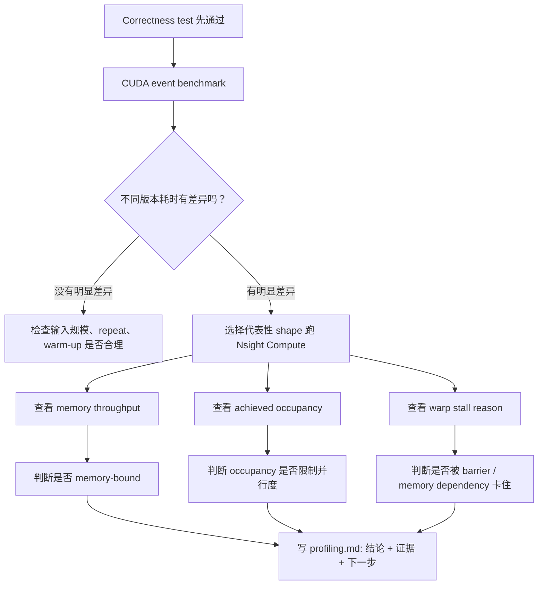
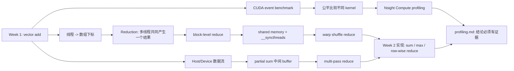

# 3.5 CUDA Week 2 前置知识 - Reduction + Profiling

## 索引

- [[#0. 你现在已经掌握了什么]]
  - [[#0.1 这篇笔记如何对应 Week 2 交付物]]
- [[#1. 从 vector add 到 reduction：问题变了]]
  - [[#为什么等待中的 block 不能先退出 SM 腾位置]]
  - [[#1.1 为什么不让一个线程算完整个 sum]]
  - [[#1.2 kernel launch 后 block 怎么实际运行]]
- [[#2. partial sum：先局部汇总，再全局汇总]]
  - [[#2.1 为什么通常不能一个 kernel 内跨 block 完成全部同步]]
- [[#3. block-level reduce：block 内怎么合作]]
- [[#4. shared memory：block 内共享的临时工作区]]
  - [[#4.1 `__syncthreads()` 到底同步谁]]
  - [[#4.2 为什么 shared memory 不等于一定更快]]
- [[#5. warp 和 warp shuffle：更小范围的协作]]
  - [[#5.1 shuffle reduce 和 shared memory reduce 的关系]]
- [[#6. reduction correctness：正确性比速度先发生]]
  - [[#6.1 非整除长度]]
  - [[#6.2 FP32 误差]]
  - [[#6.3 benchmark 必须保留 check]]
  - [[#6.4 Week 2 最小 benchmark matrix]]
- [[#7. Profiling：先知道多快，再解释为什么]]
  - [[#7.1 CUDA event 和 Nsight Compute 的分工]]
  - [[#7.2 reduction 常看的 Nsight 指标]]
  - [[#7.3 `profiling.md` 证据模板]]
  - [[#7.4 Agent 在 Week 2 可以帮什么]]
- [[#8. Week 2 学习路径图]]
- [[#9. 学完这篇后再去看 Week 2]]
- [[#关联知识]]
- [[#参考]]

## 阅读说明

建议先看 1 到 4 节，把 reduction 的协作模型和 shared memory 直觉搭起来，再看 5 到 7 节把 warp、correctness 和 profiling 连起来。适合在从 vector add 过渡到第一个“多线程合并一个结果”的 CUDA 作业时阅读。

---


> 这篇笔记的目标不是提前实现完整 reduction，而是把你已经搞懂的 `week01/vector add` 迁移到 [[Week 2 - Reduction + Profiling]] 需要的思维模型：多个 GPU 线程不再只是各算各的，而是要协作产出一个结果，并且要能用 benchmark 和 profiler 解释性能。

项目起点：[CUDA_learning/week01](https://github.com/hosendovebelva-boop/CUDA_learning/tree/main/week01)

---

## 0. 你现在已经掌握了什么

如果你已经能讲清楚 `week01` 项目，那么你至少已经掌握了这些基础：

- `std::vector` 在 host memory，`DeviceBuffer<T>` 管理 device memory。
- `cudaMemcpyHostToDevice` 把输入从 CPU 拷到 GPU。
- `kernel<<<grid, block>>>(...)` 在 GPU 上启动大量线程。
- `idx = blockIdx.x * blockDim.x + threadIdx.x` 把线程映射到数组下标。
- `idx < n` 保护最后一个不满的 block。
- `cudaDeviceSynchronize()` 等待 GPU 完成，并暴露异步执行错误。
- CUDA event benchmark 用来测 kernel-only 时间。
- benchmark 必须保留 correctness check。

这些知识在 Week 2 都还会继续用。区别是：`vector add` 里每个线程独立写一个输出，而 reduction 里多个线程要合作得到一个输出。

![[图片/9.培养方案/03.参考资料/1.阶段一/cuda-week2-reduction-prereq-map.svg|955]]

### 0.1 这篇笔记如何对应 Week 2 交付物

这篇前置知识不是单独的理论笔记，而是为 [[Week 2 - Reduction + Profiling]] 的几个交付物做概念预热：

| 前置概念 | Week 2 会落到哪里 | 需要带走的问题 |
|---|---|---|
| `partial sum` | naive reduce / multi-pass reduce | 为什么每个 block 先输出一个局部结果？ |
| shared memory + `__syncthreads()` | shared memory reduce | block 内线程如何安全协作？ |
| warp shuffle | warp shuffle reduce | 什么时候可以减少 shared memory 和 block-level 同步？ |
| 非整除长度 / FP32 tolerance | reduction correctness test | 什么样的测试才能证明结果可信？ |
| CUDA event benchmark | 多版本性能比较 | 如何公平比较 naive / shared / shuffle 版本？ |
| Nsight Compute 指标 | `profiling.md` | 性能结论有没有 memory throughput、occupancy、stall reason 支撑？ |

> [!tip] 阅读方式
> 先用这篇笔记建立概念地图，再去 Week 2 写代码。写代码时遇到“为什么要分阶段”“为什么要同步”“为什么 benchmark 必须带 Check”，再回到对应小节复查。

---

## 1. 从 vector add 到 reduction：问题变了

`vector add` 的计算是：

```cpp
c[i] = a[i] + b[i];
```

每个 `c[i]` 只依赖 `a[i]` 和 `b[i]`，所以 thread `i` 可以独立完成自己的工作。线程之间没有必要互相说话。

`reduction` 的计算是：

```cpp
sum = a[0] + a[1] + ... + a[n - 1];
```

这里最终只有一个 `sum`。如果每个线程都直接写同一个 `sum`，就会出现多个线程同时更新同一块内存的问题。即使用 `atomicAdd` 能保证结果不乱，也会让大量线程排队争抢一个地址，性能通常不好。

![[图片/9.培养方案/03.参考资料/1.阶段一/9_3_5_1.svg|955]]

### 为什么等待中的 block 不能先退出 SM 腾位置

如果真的有一个普通的 `global_syncthreads()`，已经运行的 block 到达这个同步点时，它并不是“完成了”，而是停在 kernel 的中途。它后面还有代码要继续执行，所以必须保留执行现场：

```text
每个线程的寄存器
当前执行到哪条指令
shared memory 内容
warp 状态
线程活跃掩码
局部变量和栈状态
```

这些现场大多绑定在当前 SM 的资源上。普通 CUDA block 的调度模型更接近：

```text
block 被调度到某个 SM
-> 在这个 SM 上运行
-> block 完整结束
-> 释放寄存器、shared memory 等资源
```

它不像操作系统线程那样，可以随时把整个执行现场保存到内存里、从 SM 上换出、让别的 block 先跑、之后再恢复回来。至少在普通 CUDA kernel 的编程模型里，不能依赖这种 block 级抢占和恢复。

所以如果前一批 block 执行到想象中的 `global_syncthreads()`：

```text
已运行的 block：停在同步点，等待还没开始的 block
还没开始的 block：等待 GPU 资源空出来
GPU 资源：被停在同步点的 block 占着
```

这就可能形成死锁。它们不能继续，也不能释放资源；后面的 block 又没有资源启动。

> [!note] 可以这样记
> block 内同步安全，是因为同一个 block 的线程会一起驻留在 SM 上；grid 级同步危险，是因为整个 grid 的所有 block 不保证同时驻留。普通 reduction 因此要用多个 kernel 把阶段切开，让 kernel 边界充当全局同步点。

> [!important] 第一层直觉
> `vector add` 是“每个线程负责一个输出”；`reduction` 是“很多线程共同生产一个输出”。Week 2 的核心就是学习 GPU 线程如何分阶段协作。

### 1.1 为什么不让一个线程算完整个 sum

当然可以写一个 kernel，只让一个线程循环求和：

```cpp
if (threadIdx.x == 0 && blockIdx.x == 0) {
    float sum = 0.0f;
    for (int i = 0; i < n; ++i) {
        sum += a[i];
    }
    out[0] = sum;
}
```

这在结果上是对的，但它把 GPU 变回了“一个线程干活”。GPU 的优势来自大量线程并行处理数据，所以 reduction 必须把求和拆成很多小段，再把小段结果汇总。

### 1.2 kernel launch 后 block 怎么实际运行

`kernel<<<gridDim, blockDim>>>(...)` 在语义上是一次性提交整个 grid。也就是说，程序员看到的是：

```text
总 block 数 = gridDim
每个 block 的线程数 = blockDim
总线程数 = gridDim * blockDim
```

但硬件执行时，不代表所有 block 会同时运行。GPU 会根据当前 SM 数量、每个 block 需要的寄存器、shared memory、线程数等资源，先把一部分 block 调度到 SM 上执行。等某些 block 执行完、释放资源后，再调度剩下的 block。

可以把一次 kernel 执行理解成：

```text
CPU 提交整个 grid
-> GPU 调度器选择一批 block 放到各个 SM 上
-> 这些 block 并行运行
-> 已完成的 block 释放资源
-> 剩余 block 继续被调度
-> 所有 block 完成后，这个 kernel 才完成
```

所以有几个非常重要的结论：

- `kernel launch` 提交的是全部 block，但同时驻留在 GPU 上的通常只是其中一部分。
- 一个 block 一旦被调度到某个 SM 上，通常会在这个 SM 上运行到结束。
- 不同 block 的开始顺序和结束顺序没有稳定保证，不能假设 `block 0` 一定先于 `block 1` 完成。
- 同一个 block 内线程可以用 `__syncthreads()` 同步；不同 block 之间不能用它同步。
- 一个 kernel 完成时，才表示这个 kernel 里的所有 block 都已经完成。

> [!important] 和 reduction 的关系
> 因为不同 block 不一定同时运行，也没有简单的 block 间同步，所以一个 block 不能在同一个 kernel 里可靠地等待其他 block 的 partial sum。最稳的入门做法是：第一个 kernel 让每个 block 写出 `partial[blockIdx.x]`，等整个 kernel 结束后，再启动第二阶段汇总这些 partial sums。

---

## 2. partial sum：先局部汇总，再全局汇总

Week 2 第一个要接受的概念是 `partial sum`，也就是“部分和”。

假设输入有 1024 个数，可以先让每个 block 处理一段数据：

```text
Block 0 处理 a[0..255]      -> partial[0]
Block 1 处理 a[256..511]    -> partial[1]
Block 2 处理 a[512..767]    -> partial[2]
Block 3 处理 a[768..1023]   -> partial[3]
```

然后再把 `partial[0..3]` 汇总成最终结果。

这就是 `multi-pass reduce` 的来源：

```text
原始输入 -> 第一次 kernel 得到 partial sums -> 第二次 kernel 或 CPU 汇总 partial sums
```

> [!tip] 和 week01 的关系
> week01 里 `vector_add_kernel` 输出 `c[i]`。Week 2 的 naive reduce 可以先输出 `partial[blockIdx.x]`。也就是说，输出数组不再和输入一样长，而是和 block 数量有关。

### 2.1 为什么通常不能一个 kernel 内跨 block 完成全部同步

同一个 block 内的线程可以用 `__syncthreads()` 同步，但不同 block 之间没有这种简单同步点。一个 block 不知道其他 block 是否已经算完。

所以入门阶段最稳的做法是：

1. 第一个 kernel：每个 block 写一个 partial sum。
2. kernel 结束天然形成全局完成点。
3. 第二阶段：再处理 partial sum。

kernel launch 虽然有开销，但它提供了清晰的阶段边界。

![[图片/9.培养方案/03.参考资料/1.阶段一/9_3_5_2.svg|955]]

![[图片/9.培养方案/03.参考资料/1.阶段一/9_3_5_3.svg|955]]

---

## 3. block-level reduce：block 内怎么合作

一个 block 里通常有 128 或 256 个线程。如果每个线程先读一个元素，那么 block 内就会有很多局部值。接下来要把这些值压缩成一个 block 的 partial sum。

典型思路是二分归约：

```text
256 个值
-> 128 个值
-> 64 个值
-> 32 个值
-> 16 个值
-> ...
-> 1 个值
```

每一轮让前半部分线程把后半部分的值加到自己身上：

```cpp
if (threadIdx.x < stride) {
    sdata[threadIdx.x] += sdata[threadIdx.x + stride];
}
```

这里的 `sdata` 通常放在 shared memory。

这就是二分法或者折半的思想：每一轮把问题规模减半。只不过这里不是在数组里查找一个值，而是在把一批数折半相加。

用 8 个数举例会更直观。假设 shared memory 里一开始是：

```text
下标:   0   1   2   3   4   5   6   7
值:    a0  a1  a2  a3  a4  a5  a6  a7
```

第一轮 `stride = 4`，前半段线程去加后半段对应位置：

```text
thread 0: sdata[0] += sdata[4]  -> a0 + a4
thread 1: sdata[1] += sdata[5]  -> a1 + a5
thread 2: sdata[2] += sdata[6]  -> a2 + a6
thread 3: sdata[3] += sdata[7]  -> a3 + a7
```

现在有效值只剩前 4 个位置。第二轮 `stride = 2`：

```text
thread 0: sdata[0] += sdata[2]  -> (a0 + a4) + (a2 + a6)
thread 1: sdata[1] += sdata[3]  -> (a1 + a5) + (a3 + a7)
```

现在有效值只剩前 2 个位置。第三轮 `stride = 1`：

```text
thread 0: sdata[0] += sdata[1]
```

最后 `sdata[0]` 就是这个 block 的总和：

```text
sdata[0] = a0 + a1 + a2 + a3 + a4 + a5 + a6 + a7
```

所以 `stride` 可以理解成“当前这一轮要跨多远去拿另一个数”。对于 8 个值是 `4 -> 2 -> 1`，对于 256 个值就是 `128 -> 64 -> 32 -> ... -> 1`。

> [!tip] 记忆方式
> block-level reduce 就是在一个 block 内，把很多线程读到的值像折纸一样一半一半折叠相加，直到只剩 `sdata[0]`。

---

## 4. shared memory：block 内共享的临时工作区

global memory 是所有线程都能访问的显存，但访问延迟较高。shared memory 是同一个 block 内线程共享的一小块片上内存，速度更快，适合做 block 内协作。

可以把它理解成：

| 内存 | 谁能访问 | Week 2 用途 |
|---|---|---|
| global memory | 所有 block、所有线程 | 输入数组、partial sum 输出 |
| shared memory | 同一个 block 内线程 | block 内临时保存和归约 |
| register | 当前线程自己 | 当前线程的局部变量 |

shared memory 的常见 reduction 流程：

```cpp
extern __shared__ float sdata[];

int tid = threadIdx.x;
int idx = blockIdx.x * blockDim.x + threadIdx.x;

sdata[tid] = (idx < n) ? input[idx] : 0.0f;
__syncthreads();

for (int stride = blockDim.x / 2; stride > 0; stride >>= 1) {
    if (tid < stride) {
        sdata[tid] += sdata[tid + stride];
    }
    __syncthreads();
}

if (tid == 0) {
    partial[blockIdx.x] = sdata[0];
}
```

![[图片/9.培养方案/03.参考资料/1.阶段一/9_3_5_4.svg|955]]

循环里每一轮后面都有一次 `__syncthreads()`，原因是：**本轮写出来的 `sdata` 结果，会成为下一轮要读取的输入**。

假设一个 block 有 256 个线程。第一轮 `stride = 128` 时：

```text
thread 0   : sdata[0]   += sdata[128]
thread 1   : sdata[1]   += sdata[129]
...
thread 127 : sdata[127] += sdata[255]
```

第一轮结束后，有效结果在 `sdata[0..127]`。第二轮 `stride = 64` 时：

```text
thread 0  : sdata[0]  += sdata[64]
thread 1  : sdata[1]  += sdata[65]
...
thread 63 : sdata[63] += sdata[127]
```

注意，第二轮要读取的 `sdata[64..127]`，正是第一轮由 `thread 64..127` 刚刚写出来的结果。如果没有同步，就可能出现：

```text
thread 0 已经进入第二轮，准备读取 sdata[64]
thread 64 的第一轮还没写完 sdata[64]
thread 0 读到旧值
最终 sum 错误
```

所以每一轮 reduction 后都需要同步：

```text
256 -> 128，等待 128 个中间结果都写好
128 -> 64，等待 64 个中间结果都写好
64 -> 32，继续等待
...
```

还有一个容易踩的坑：`__syncthreads()` 必须放在 `if` 外面，而不是放在 `if (tid < stride)` 里面。

```cpp
if (tid < stride) {
    sdata[tid] += sdata[tid + stride];
}
__syncthreads(); // 正确：整个 block 的线程都会到达这里
```

不要写成：

```cpp
if (tid < stride) {
    sdata[tid] += sdata[tid + stride];
    __syncthreads(); // 错误：只有部分线程进入 if，可能死锁
}
```

因为 `__syncthreads()` 等待的是整个 block。如果只有一部分线程进入同步点，另一部分线程永远不到这里，进入同步点的线程就可能一直等下去。

### 4.1 `__syncthreads()` 到底同步谁

`__syncthreads()` 只同步同一个 block 内的线程。

它保证：

- 同一个 block 内所有线程都执行到这个点之后，大家才继续往下走。
- 在它之前写入 shared memory 的结果，对同一个 block 内其他线程可见。

它不保证：

- 不同 block 之间互相等待。
- host 侧 CPU 等 GPU 完成。
- 其他 stream 的任务完成。

![[图片/9.培养方案/03.参考资料/1.阶段一/9_3_5_5.svg|955]]

> [!warning] 必须放同步的原因
> 如果 thread 0 要读取 `sdata[128]`，就必须保证 thread 128 已经把自己的输入写进 shared memory。否则 thread 0 可能读到旧值或未初始化值。

### 4.2 为什么 shared memory 不等于一定更快

shared memory 能减少 global memory 访问，但它也带来成本：

- 需要显式搬运数据。
- 每轮归约可能需要 `__syncthreads()`。
- 使用太多 shared memory 会减少每个 SM 上能同时驻留的 block 数量。
- 访问模式不好时可能出现 shared memory bank conflict。

所以 Week 2 不要只问“用了 shared memory 吗”，要问“用了以后 benchmark 是否更快，Nsight 指标是否支持这个解释”。

---

## 5. warp 和 warp shuffle：更小范围的协作

![[图片/9.培养方案/03.参考资料/1.阶段一/cuda-week2-warp-overview.svg|955]]

CUDA 线程不是完全一个一个独立调度的。你在代码里看到的是一个个 thread，但 GPU 硬件实际调度时，通常会把连续的一组 thread 打包成一个 **warp**。

通常可以先记住：

```text
1 warp = 32 个 thread
```

例如一个 block 有 256 个线程，那么它会被硬件分成 8 个 warp：

```text
warp 0: thread 0   ~ 31
warp 1: thread 32  ~ 63
warp 2: thread 64  ~ 95
...
warp 7: thread 224 ~ 255
```

所以三者关系可以理解成：

```text
grid
-> block
   -> warp
      -> thread
```

thread 是你写 kernel 时直接操作的编号；block 是 CUDA 的协作和调度单位；warp 是硬件实际执行指令时更接近的基本单位。一个 warp 内的 32 个线程通常一起取指令、一起执行同一条指令，只是每个线程处理的数据不同。

这里还会遇到一个常用词：**lane**。

lane 可以理解成 **线程在当前 warp 内部的编号**。一个 warp 通常有 32 个线程，所以 lane 编号是：

```text
lane 0, lane 1, lane 2, ..., lane 31
```

如果 `threadIdx.x` 是 block 内的线程编号，那么可以这样算它属于哪个 warp，以及它在这个 warp 里的 lane 编号：

```cpp
int warp_id = threadIdx.x / warpSize;
int lane = threadIdx.x % warpSize;
```

在 CUDA 里 `warpSize` 通常是 32，所以很多代码也会写成：

```cpp
int lane = threadIdx.x % 32;
```

例如一个 block 有 256 个线程：

```text
threadIdx.x 0  ~ 31   -> warp 0, lane 0 ~ 31
threadIdx.x 32 ~ 63   -> warp 1, lane 0 ~ 31
threadIdx.x 64 ~ 95   -> warp 2, lane 0 ~ 31
...
```

例如下面这句：

```cpp
c[idx] = a[idx] + b[idx];
```

warp 0 里的 32 个线程会一起执行这条加法：

```text
thread 0  算 c[0]
thread 1  算 c[1]
thread 2  算 c[2]
...
thread 31 算 c[31]
```

这就是 CUDA 里常说的 SIMT：Single Instruction, Multiple Threads，一条指令由多个线程一起执行。

warp 之所以重要，是因为很多 CUDA 性能问题都发生在 warp 级别：

| 问题 | 和 warp 的关系 |
|---|---|
| 分支发散 | 同一个 warp 内有些线程走 `if`，有些线程走 `else`，硬件通常要分批执行不同路径 |
| 内存合并访问 | 同一个 warp 内线程访问连续地址时，global memory 访问更容易合并 |
| warp shuffle | 同一个 warp 内线程可以直接交换寄存器里的值 |
| reduction 优化 | 当归约范围缩小到 32 个线程以内时，可以用 warp-level reduce 减少 shared memory 和同步 |

在一个 warp 内，线程天然按同一条指令流前进，因此可以使用 warp-level primitive 直接在线程之间交换寄存器里的值。`__shfl_down_sync` 就是 Week 2 会遇到的核心 API。

直觉上，它做的是：

```text
当前线程拿到“后面某个 lane”的值
```

例如：

```cpp
value += __shfl_down_sync(0xffffffff, value, 16);
value += __shfl_down_sync(0xffffffff, value, 8);
value += __shfl_down_sync(0xffffffff, value, 4);
value += __shfl_down_sync(0xffffffff, value, 2);
value += __shfl_down_sync(0xffffffff, value, 1);
```

这段代码让一个 warp 内的值逐步合并。它没有把中间值写进 shared memory，也不需要每一步都做 block-level `__syncthreads()`。

更准确地说：**同一个 warp 内的线程可以通过 shuffle 指令交换寄存器里的值**。

每个 thread 都有自己的寄存器，别的 thread 不能像访问 shared memory 那样随便读它。但是在同一个 warp 内，硬件提供了 warp shuffle 指令，可以让一个 lane 直接拿到另一个 lane 当前寄存器里的变量值。

所以可以先把两种 reduce 的数据通路区分开：

```text
shared memory reduce:
thread register -> shared memory -> other thread register

warp shuffle reduce:
thread register -> another lane's register value
```

注意这个能力只发生在 **同一个 warp 内**。不同 warp 之间不能直接访问彼此的寄存器；如果要跨 warp 汇总，通常还是需要 shared memory、global memory，或者拆成多阶段 kernel。

单独看这一句：

```cpp
value += __shfl_down_sync(0xffffffff, value, 16);
```

它的直觉是：

```text
当前 lane 把“后面第 16 个 lane”的 value 拿过来，加到自己的 value 上。
```

参数可以拆成三部分：

```text
0xffffffff : 参与这次 shuffle 的线程掩码，这里表示 32 个 lane 都参与
value      : 每个 lane 自己寄存器里的当前值
16         : 向后隔 16 个 lane 取值
```

假设一个 warp 里原来有 32 个值：

```text
lane:   0   1   2   3   ...  15  16  17  ... 31
value: a0  a1  a2  a3  ... a15 a16 a17 ... a31
```

执行这一句后，前 16 个 lane 会变成：

```text
lane 0 : a0 + a16
lane 1 : a1 + a17
lane 2 : a2 + a18
...
lane 15: a15 + a31
```

也就是把 32 个数先两两合并成 16 个部分和。后面继续用 offset `8, 4, 2, 1`，就会把 16 个部分和继续合成 8 个、4 个、2 个、1 个，最后 lane 0 拿到整个 warp 的总和。

上面也可以写成 `for` 循环：

```cpp
__device__ float warp_reduce_sum(float value) {
#pragma unroll
    for (int offset = warpSize / 2; offset > 0; offset /= 2) {
        value += __shfl_down_sync(0xffffffff, value, offset);
    }
    return value;
}
```

`warpSize` 在 CUDA 里通常是 32，所以 `warpSize / 2` 就是 16。这个循环依次产生 offset `16, 8, 4, 2, 1`，和手写五行是同一个逻辑。

手写五行更适合教学，因为能直接看出每一轮怎么把 32 个值合并成 16 个、8 个、4 个、2 个、1 个。工程代码里常用 `for + #pragma unroll`，写法更干净，也提醒编译器把这个很短的固定循环展开。

> [!tip] 先记住直觉
> shared memory reduce 是“线程把值放到 block 共享桌面上，再一轮轮合并”。warp shuffle reduce 是“同一个 warp 内的线程直接交换手里的寄存器值”。

### 5.1 shuffle reduce 和 shared memory reduce 的关系

它们不是二选一。常见高效 block reduce 会混合使用：

1. 每个线程先读 global memory，得到自己的局部值。
2. 每个 warp 内用 shuffle 归约，得到一个 warp sum。
3. 每个 warp 的 lane 0 把 warp sum 写入 shared memory。
4. 再用一个 warp 把这些 warp sum 汇总成 block sum。

这样可以减少 shared memory 写入次数和同步次数。

---

## 6. reduction correctness：正确性比速度先发生

Week 2 很容易写出“跑得很快但结果错”的 kernel。下面几个点必须先立住。

### 6.1 非整除长度

输入长度经常不是 block size 的整数倍。读取 global memory 前必须判断：

```cpp
float x = 0.0f;
if (idx < n) {
    x = input[idx];
}
```

对 sum 来说，越界位置可以补 `0.0f`。对 max 来说，越界位置应该补一个足够小的初值，例如 `-infinity`，不能补 `0.0f`，否则全负数输入会被算错。

关键点是：**越界线程不是消失了，它们只是不能读 `input[idx]`，但后面仍然会参与 block 内 reduction**。所以这些线程也必须有一个自己的局部值 `x`，只是这个值要保证不会影响最终结果。

比如要对 5 个数求和：

```text
input = [1, 2, 3, 4, 5]
n = 5
blockDim.x = 8
```

一个 block 启动了 8 个线程，但真实数据只有 5 个：

```text
thread 0 -> idx 0 -> input[0] = 1
thread 1 -> idx 1 -> input[1] = 2
thread 2 -> idx 2 -> input[2] = 3
thread 3 -> idx 3 -> input[3] = 4
thread 4 -> idx 4 -> input[4] = 5
thread 5 -> idx 5 -> 越界
thread 6 -> idx 6 -> 越界
thread 7 -> idx 7 -> 越界
```

这段代码执行后：

```cpp
float x = 0.0f;
if (idx < n) {
    x = input[idx];
}
```

每个线程手里的 `x` 是：

```text
thread 0: x = 1
thread 1: x = 2
thread 2: x = 3
thread 3: x = 4
thread 4: x = 5
thread 5: x = 0
thread 6: x = 0
thread 7: x = 0
```

后面如果做 sum reduction：

```text
1 + 2 + 3 + 4 + 5 + 0 + 0 + 0 = 15
```

补进去的 `0` 不会改变求和结果，因为 `a + 0 = a`。

如果做 max reduction，就不能这样补 `0`。例如真实输入全是负数：

```text
input = [-5, -3, -7]
n = 3
blockDim.x = 8
```

如果越界线程补 `0`，参与 max 的值会变成：

```text
-5, -3, -7, 0, 0, 0, 0, 0
```

最后结果会是：

```text
max(-5, -3, -7, 0, 0, 0, 0, 0) = 0
```

但真实数组里没有 `0`，正确答案应该是 `-3`。所以 max 的越界补位值要用一个“绝对不会赢”的值：

```cpp
float x = -INFINITY;
if (idx < n) {
    x = input[idx];
}
```

这样参与 max 的值是：

```text
-5, -3, -7, -inf, -inf, -inf, -inf, -inf
```

最终结果就是：

```text
max(-5, -3, -7, -inf, -inf, -inf, -inf, -inf) = -3
```

所以可以记住这个规律：

```text
sum 的补位值：0
max 的补位值：-infinity
min 的补位值：+infinity
```

### 6.2 FP32 误差

CPU 串行求和和 GPU 并行求和的加法顺序不同。浮点加法不满足严格结合律，所以结果可能有微小差异。

测试时不要写：

```cpp
assert(gpu_sum == cpu_sum);
```

应该使用容忍误差：

```cpp
std::fabs(gpu_sum - cpu_sum) < tolerance
```

### 6.3 benchmark 必须保留 check

更详细的 benchmark / profiling 操作流程见：[[3.5.1 CUDA Week 2 辅助笔记 - Benchmark + Profiling]]。

错误的 reduction 可能因为少算了一部分数据而更快。所以 benchmark 输出至少要包含：

```text
Version    N    Kernel(ms)    Bandwidth(GB/s)    Check
```

`Check` 不通过的性能数据没有意义。

### 6.4 Week 2 最小 benchmark matrix

前置阶段不要求现在跑出数据，但要先知道 Week 2 的 benchmark 为什么要固定输入规模、版本和输出列。建议最小矩阵如下：

| Version              |   N | Kernel(ms) | GB/s | Check |
| -------------------- | --: | ---------: | ---: | ----- |
| naive partial reduce |  1K |            |      |       |
| naive partial reduce |  1M |            |      |       |
| naive partial reduce | 64M |            |      |       |
| shared memory reduce |  1K |            |      |       |
| shared memory reduce |  1M |            |      |       |
| shared memory reduce | 64M |            |      |       |
| warp shuffle reduce  |  1K |            |      |       |
| warp shuffle reduce  |  1M |            |      |       |
| warp shuffle reduce  | 64M |            |      |       |

这张表的作用不是追求数字好看，而是强迫自己在同一组输入规模、同一套 timing 方法和同一套 correctness check 下比较不同实现。

---

## 7. Profiling：先知道多快，再解释为什么

Week 1 的 benchmark 已经回答了一个问题：kernel 跑多久。

Week 2 需要进一步回答：为什么这个版本快，为什么那个版本慢。



### 7.1 CUDA event 和 Nsight Compute 的分工

| 工具 | 回答的问题 | Week 2 典型输出 |
|---|---|---|
| correctness test | 算得对不对 | PASS / FAIL |
| CUDA event benchmark | 跑得多快 | 平均耗时、最小耗时、带宽 |
| Nsight Compute | 为什么快或慢 | memory throughput、occupancy、stall reason |

> [!important] 判断顺序
> correctness 是门票，benchmark 是事实，profiler 是解释。不要用 profiler 替代 benchmark，也不要在 correctness 失败时讨论性能。

### 7.2 reduction 常看的 Nsight 指标

| 指标 | 你要问的问题 |
|---|---|
| memory throughput | global memory 读写是否接近带宽上限 |
| achieved occupancy | SM 上是否有足够多 warp 可运行 |
| warp stall reason | warp 主要在等内存、等同步，还是被指令依赖卡住 |
| shared memory usage | 每个 block 的 shared memory 是否限制并发 |
| register count | 每线程寄存器是否过多，是否压低 occupancy |

这些指标不是为了堆截图，而是为了支撑一句明确结论：

```text
shared memory 版本比 naive 版本快，因为它减少了 global memory 中间访问；
Nsight 中 memory throughput / stall reason / 实际耗时支持这个判断。
```

### 7.3 `profiling.md` 证据模板

Week 2 的 `profiling.md` 不应该只是截图集合，而应该把 benchmark 事实、Nsight 指标和下一步优化串起来。可以先按这个模板记录：

```text
Kernel:
Shape:
GPU:
CUDA:
Time:
Effective bandwidth:
Nsight key metrics:
Bottleneck:
Next optimization:
```

最小合格结论应该包含三件事：

- **结论**：哪个版本更快，瓶颈更像 memory、sync 还是 occupancy。
- **证据**：CUDA event 时间、effective bandwidth、Nsight memory throughput / occupancy / stall reason。
- **下一步**：保留当前实现、继续优化，还是回退某个复杂但收益不足的版本。

### 7.4 实测 benchmark 记录

测试配置：

```text
Warmup: 5 runs
Repeat: 20 runs per (size, kernel)
Kernels: Naive / Shared / Shuffle
Data types: float / int
Status: 全部 OK
```

`float` 测试结果：

| N | Kernel | Avg(ms) | Min(ms) | Max(ms) | BW(GB/s) | Status |
|---|---|---:|---:|---:|---:|---|
| 1K | Naive | 0.024 | 0.020 | 0.057 | 0.17 | OK |
| 1K | Shared | 0.018 | 0.018 | 0.020 | 0.22 | OK |
| 1K | Shuffle | 0.018 | 0.018 | 0.019 | 0.22 | OK |
| 1M | Naive | 0.223 | 0.219 | 0.232 | 18.78 | OK |
| 1M | Shared | 0.194 | 0.193 | 0.199 | 21.61 | OK |
| 1M | Shuffle | 0.182 | 0.180 | 0.184 | 23.08 | OK |
| 64M | Naive | 6.364 | 6.292 | 6.453 | 42.18 | OK |
| 64M | Shared | 5.481 | 5.040 | 5.727 | 48.98 | OK |
| 64M | Shuffle | 4.450 | 4.420 | 4.506 | 60.32 | OK |

`int` 测试结果：

| N | Kernel | Avg(ms) | Min(ms) | Max(ms) | BW(GB/s) | Status |
|---|---|---:|---:|---:|---:|---|
| 1K | Naive | 0.020 | 0.019 | 0.022 | 0.21 | OK |
| 1K | Shared | 0.017 | 0.017 | 0.019 | 0.24 | OK |
| 1K | Shuffle | 0.017 | 0.017 | 0.018 | 0.24 | OK |
| 1M | Naive | 0.202 | 0.199 | 0.207 | 20.75 | OK |
| 1M | Shared | 0.175 | 0.173 | 0.179 | 23.96 | OK |
| 1M | Shuffle | 0.168 | 0.164 | 0.217 | 24.94 | OK |
| 64M | Naive | 6.256 | 6.240 | 6.298 | 42.91 | OK |
| 64M | Shared | 5.414 | 4.995 | 5.942 | 49.58 | OK |
| 64M | Shuffle | 4.413 | 4.395 | 4.482 | 60.82 | OK |

从结果看，数据规模很小时，三种 kernel 的差距主要被 launch overhead 和计时噪声掩盖；到 `1M` 后，Shared 和 Shuffle 开始稳定快于 Naive；到 `64M` 时差距最明显，Shuffle 版本的有效带宽约为 `60 GB/s`，明显高于 Shared 的约 `49 GB/s` 和 Naive 的约 `42 GB/s`。

这组数据可以支撑一个初步结论：在当前实现和测试环境下，warp shuffle reduce 减少了 shared memory 读写和 block 内同步开销，因此在大规模输入上表现最好。后续如果要写 `profiling.md`，还应该补充 Nsight Compute 的 memory throughput、occupancy 和 stall reason，确认瓶颈是否主要来自 global memory 访问、同步等待或指令依赖。

### 7.5 Agent 在 Week 2 可以帮什么

Agent 可以辅助整理 benchmark matrix、生成测试框架、解释 Nsight 输出和起草 `profiling.md`，但不能替代人工判断 kernel correctness、benchmark 可信度和性能结论。和 Week 1 一样，Agent 生成的测试和报告也要被检查；`Check` 失败的数据、缺少 warm-up 的数据、没有指标支撑的 profiling 结论都不能直接写进最终结论。

---

## 8. Week 2 学习路径图



---

## 9. 学完这篇后再去看 Week 2

这篇笔记只负责把 Week 2 的概念门槛降下来，不负责替代实现笔记。真正写代码时，还要把 `sum` 模式扩展到 `reduce max` 和 `row-wise reduce`：前者训练初值和边界条件意识，后者连接 RMSNorm / Softmax 这类 LLM kernel 的行级归约。

进入 [[Week 2 - Reduction + Profiling]] 前，建议能用自己的话回答下面的问题：

- [ ] `vector add` 为什么可以每个线程独立写输出？
- [ ] reduction 为什么不能简单地让所有线程写同一个 `sum`？
- [ ] `partial sum` 是什么，为什么每个 block 可以先输出一个 partial sum？
- [ ] 为什么跨 block 汇总通常需要多阶段？
- [ ] shared memory 是谁共享的？为什么它适合 block 内归约？
- [ ] `__syncthreads()` 同步的是谁？它不能同步谁？
- [ ] warp 是什么？为什么 warp 内可以用 shuffle 交换值？
- [ ] 为什么 reduction 的 FP32 结果可能和 CPU 串行结果略有差异？
- [ ] 为什么 benchmark 里必须保留 correctness check？
- [ ] CUDA event benchmark 和 Nsight Compute 分别回答什么问题？

如果这些问题都能答出来，再看 Week 2 的 naive reduce、shared memory reduce、warp shuffle reduce 和 profiling.md，就不会像突然跳进一堆陌生术语里。

![[图片/9.培养方案/03.参考资料/1.阶段一/cuda-week2-reduction-summary.svg|860]]

---

## 关联知识

- [[Week 2 - Reduction + Profiling]]
- [[3.1 CUDA Week 1 零基础系统入门|CUDA 零基础系统入门]]
- [[CUDA Week 1 Hello World 项目解析]]
- [[3.2 CUDA Runtime 进阶|CUDA Runtime 进阶]]
- [[3.4 CUDA Nsight Compute 指标速查|CUDA Nsight Compute 指标速查]]
- [[CUDA 学习清单]]

---

## 参考

- [CUDA_learning/week01](https://github.com/hosendovebelva-boop/CUDA_learning/tree/main/week01)
- NVIDIA CUDA C++ Programming Guide
- NVIDIA CUDA C++ Best Practices Guide
- NVIDIA Nsight Compute Documentation
