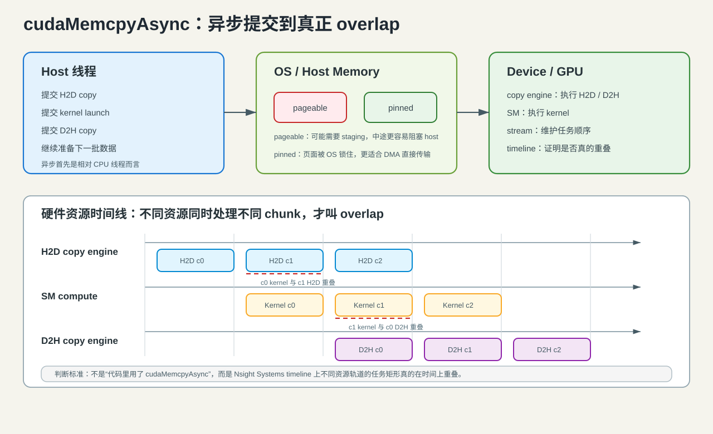
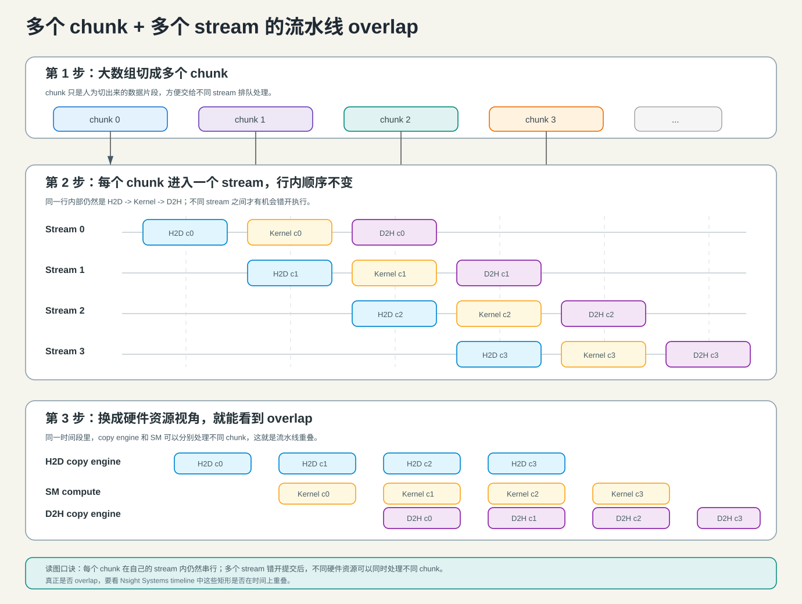

---
title: 3.2 CUDA Runtime 进阶
date: 2026-05-06
tags:
  - infra
  - CUDA
  - 参考资料
aliases:
  - CUDA Runtime API
  - CUDA 并发与同步
status: active
---

# 3.2 CUDA Runtime 进阶

## 索引

- [[#1. 错误处理统一封装]]
- [[#2. 同步模型]]
  - [[#2.1 kernel launch 是异步的]]
  - [[#2.2 block 内同步只能同步同一个 block]]
- [[#3. Stream 基础]]
  - [[#3.1 创建、使用和销毁 stream]]
  - [[#3.2 两个 stream 的最小实验]]
- [[#4. Event 与 Timing]]
  - [[#4.1 kernel-only timing]]
  - [[#4.2 repeat timing]]
  - [[#4.3 在指定 stream 上 timing]]
- [[#5. Pinned Memory 与异步拷贝]]
  - [[#5.0 overlap 是什么]]
  - [[#5.1 `cudaMemcpyAsync` 到底异步在哪里]]
  - [[#5.2 分配 pinned host memory]]
  - [[#5.3 单 stream 异步拷贝]]
  - [[#5.4 多 stream 分块流水线]]
- [[#6. End-to-End Timing：把拷贝也算进去]]
- [[#7. CUDA Graph 基础]]
  - [[#7.1 stream capture toy example]]
- [[#8. Device Query]]
- [[#9. 必做实验]]
- [[#10. 学习验收问题]]
- [[#关键要点总结]]
- [[#关联知识]]

## 阅读说明

建议先看 1 到 5 节，把错误处理、同步、stream、event 和异步拷贝连成一条链，再按需看后面的端到端计时与工程化内容。适合在你已经写出第一个 kernel 之后，用来补齐 Runtime API 的工程直觉。

---


> 这份笔记补齐 `vector add` 之后必须掌握的 Runtime API：错误处理、同步、stream、event timing、pinned memory、异步拷贝、CUDA Graph 和设备信息查询。

Runtime API 的学习不要停留在“知道函数名”。真正要形成的是一条工程直觉：

```text
CUDA API 调用是否检查错误
-> kernel 是否异步
-> 数据拷贝是否真的异步
-> stream 之间是否有依赖
-> event timing 测的到底是哪一段
-> benchmark 结论是否可信
```

---

## 1. 错误处理统一封装

CUDA Runtime API 大多返回 `cudaError_t`。工程里不要把错误检查散落在业务逻辑里，而是用统一封装把 API 名称、文件和行号都带出来。

```cpp
// cuda_check.cuh
#pragma once

#include <cuda_runtime.h>

#include <stdexcept>
#include <string>

inline void check_cuda(cudaError_t status,
                       const char* expr,
                       const char* file,
                       int line) {
    // 所有 CUDA Runtime API 最终都会返回一个状态码。
    // 先判断这次调用是否成功；成功就直接返回，不打断正常路径。
    if (status == cudaSuccess) {
        return;
    }

    // cudaGetErrorString(status) 把错误码转换成可读信息。
    // file/line 用来定位是哪一次 Runtime API 调用失败。
    // expr 则保留原始 API 表达式，方便知道到底是哪一行调用报错。
    throw std::runtime_error(
        std::string("CUDA error: ") + cudaGetErrorString(status) +
        "\n  expr: " + expr +
        "\n  file: " + file +
        "\n  line: " + std::to_string(line));
}

// 把原始调用表达式、文件名和行号自动打包进去。
// 这样写 CUDA_CHECK(cudaMalloc(...)) 时，不需要每次手动补上下文信息。
#define CUDA_CHECK(expr) check_cuda((expr), #expr, __FILE__, __LINE__)
```

kernel launch 本身不会返回 `cudaError_t`，所以要单独检查：

```cpp
some_kernel<<<grid, block>>>(args...);

// 检查 launch 配置错误，例如 block size 超限、参数非法等。
// 这一步检查的是“提交内核时有没有立刻失败”，
// 不是检查 GPU 是否已经把 kernel 跑完。
CUDA_CHECK(cudaGetLastError());

// kernel 默认异步。这里强制等待，可以暴露 device 端执行错误。
// benchmark 中不要随便每次都同步，否则会破坏并发和测量结构。
// 只有在 debug、结果读取前、阶段边界等确实需要完成点时才同步。
CUDA_CHECK(cudaDeviceSynchronize());
```

最低要求：

- [ ] 所有 Runtime API 调用都检查返回值。
- [ ] kernel launch 后检查 `cudaGetLastError()`。
- [ ] debug 阶段用 `cudaDeviceSynchronize()` 暴露异步错误。
- [ ] benchmark 阶段只在必要边界同步。

---

## 2. 同步模型

| 同步方式                      | 范围                  | 用途               |
| ------------------------- | ------------------- | ---------------- |
| `__syncthreads()`         | 同一个 block 内线程       | shared memory 协作 |
| `cudaDeviceSynchronize()` | host 等待 device 全部完成 | debug、全局阶段边界     |
| `cudaStreamSynchronize()` | host 等待某个 stream    | 多 stream 控制      |
| `cudaEventSynchronize()`  | host 等待某个 event     | timing 或阶段完成点    |

### 2.1 kernel launch 是异步的

```cpp
scale_kernel<<<grid, block>>>(d_out, d_in, n, 2.0f);

// 走到这里时，CPU 只是把 kernel launch 提交给 GPU 队列。
// 不代表 GPU 已经执行完成。
// 所以这里 CPU 仍然可以做别的 host 侧工作。
do_cpu_work();

// 如果后续 CPU 要读取结果，必须建立完成点。
// 否则 host 可能在 GPU 还没写完结果时就提前访问数据。
CUDA_CHECK(cudaDeviceSynchronize());
```

### 2.2 block 内同步只能同步同一个 block

```cpp
__global__ void block_sum_kernel(const float* x, float* block_sums, int n) {
    // extern __shared__ 表示这块 shared memory 大小在 launch 时动态决定。
    // 同一个 block 内的线程共享这段片上缓存。
    extern __shared__ float smem[];

    // tid 是当前线程在本 block 内的局部编号。
    int tid = threadIdx.x;
    // idx 是映射到输入数组 x 的全局编号。
    int idx = blockIdx.x * blockDim.x + threadIdx.x;

    // 每个线程先把 global memory 的数据搬进 shared memory。
    // 如果 idx 越界，就补 0，避免无效线程读非法地址。
    smem[tid] = (idx < n) ? x[idx] : 0.0f;

    // 保证同一个 block 内所有线程都完成写入 smem。
    // 它不能同步不同 block，也不能替代全局同步。
    __syncthreads();

    // 经典树形归约：
    // 每轮 stride 减半，让前半部分线程把后半部分的数据累加进来。
    for (int stride = blockDim.x / 2; stride > 0; stride >>= 1) {
        // 只有前半部分线程参与本轮归约，避免重复累加。
        if (tid < stride) {
            smem[tid] += smem[tid + stride];
        }
        // 每轮累加后都要同步，确保下一轮读取到的是更新后的 smem。
        __syncthreads();
    }

    // 归约结束后，smem[0] 持有这个 block 的部分和。
    // 只让 block 内的 0 号线程把结果写回全局内存，避免多线程重复写。
    if (tid == 0) {
        block_sums[blockIdx.x] = smem[0];
    }
}
```

必须理解：

- kernel launch 默认异步。
- `__syncthreads()` 只同步同一个 block。
- `cudaDeviceSynchronize()` 是全 device 完成点，代价较大。
- 过度同步会把本来能 overlap 的任务变成串行。

---

## 3. Stream 基础

Stream 是 GPU 上的任务队列。同一个 stream 内按提交顺序执行，不同 stream 之间有机会并发。

```text
stream A: H2D A -> kernel A -> D2H A
stream B: H2D B -> kernel B -> D2H B
```

如果硬件资源允许，两个 stream 里的 copy / kernel 可能发生 overlap。

### 3.1 创建、使用和销毁 stream

```cpp
#include "cuda_check.cuh"

#include <cuda_runtime.h>
#include <algorithm>
#include <vector>

// 一个最简单的逐元素缩放 kernel。
// 每个 CUDA thread 负责一个下标 idx，对应做：out[idx] = alpha * in[idx]。
__global__ void scale_kernel(float* out, const float* in, int n, float alpha) {
    // 用 block 编号和 thread 编号计算当前线程负责的全局元素下标。
    int idx = blockIdx.x * blockDim.x + threadIdx.x;

    // 最后一个 block 往往不是满的，所以要做边界保护。
    if (idx < n) {
        out[idx] = alpha * in[idx];
    }
}

// 把 kernel 提交到指定 stream。
// 注意：这里是“提交”，不是“执行完再返回”。
void launch_on_stream(float* d_out, const float* d_in, int n, cudaStream_t stream) {
    // 每个 block 放 256 个线程，属于常见的基础配置。
    int block = 256;

    // 向上取整，保证 n 个元素都能被线程覆盖到。
    int grid = (n + block - 1) / block;

    // kernel launch 参数含义：
    // <<<grid, block, shared_mem_bytes, stream>>>
    // 1. grid: 启动多少个 block
    // 2. block: 每个 block 中多少个线程
    // 3. 0: 不额外申请 dynamic shared memory
    // 4. stream: 把这次 kernel 提交到哪个 stream
    scale_kernel<<<grid, block, 0, stream>>>(d_out, d_in, n, 2.0f);

    // 检查 launch 本身有没有出错。
    // 这里只能发现“任务提交配置”问题，比如非法 block size、参数错误等；
    // 不能说明 kernel 已经执行完成。
    CUDA_CHECK(cudaGetLastError());
}

int main() {
    constexpr int n = 1 << 20;
    // bytes 是后面 cudaMalloc / cudaMemcpy 要用的字节数，不是元素个数。
    size_t bytes = n * sizeof(float);

    float* d_in = nullptr;
    float* d_out = nullptr;

    // 在 GPU 显存上分配输入和输出缓冲区。
    CUDA_CHECK(cudaMalloc(&d_in, bytes));
    CUDA_CHECK(cudaMalloc(&d_out, bytes));

    cudaStream_t stream;

    // 创建一个非默认 stream。
    // 后续提交到这个 stream 的任务，会按提交顺序执行。
    CUDA_CHECK(cudaStreamCreate(&stream));

    // 把 kernel 提交到这个 stream。
    // 这一步返回时，通常只是“提交成功”，GPU 可能还在执行。
    // 如果这个 stream 前面还有任务，kernel 会排在那些任务后面运行。
    launch_on_stream(d_out, d_in, n, stream);

    // 只等待这个 stream 里已经提交的任务完成。
    // 它不会等待其他 stream 的任务，是比 cudaDeviceSynchronize 更局部的同步。
    CUDA_CHECK(cudaStreamSynchronize(stream));

    // 先销毁 stream，再释放显存资源。
    // 到这里 stream 中的工作已经完成，所以资源释放是安全的。
    CUDA_CHECK(cudaStreamDestroy(stream));
    CUDA_CHECK(cudaFree(d_out));
    CUDA_CHECK(cudaFree(d_in));
}

```

### 3.2 两个 stream 的最小实验

```cpp
cudaStream_t s0;
cudaStream_t s1;

// 创建两个独立的 stream。
// 后续分别提交到 s0 / s1 的任务，理论上有机会并发。
CUDA_CHECK(cudaStreamCreate(&s0));
CUDA_CHECK(cudaStreamCreate(&s1));

// 这两个 launch 分别进入不同的任务队列。
// 是否真的 overlap，取决于硬件资源、默认 stream 语义和当前 kernel 占用情况。
launch_on_stream(d_out0, d_in0, n, s0);
launch_on_stream(d_out1, d_in1, n, s1);

// 分别等待两个 stream。
// 用 Nsight Systems 看 timeline，判断两个 kernel 是否真的 overlap。
// 这里各自同步，不会因为 s0 未完成就强制等待 s1 之外的其他 stream。
CUDA_CHECK(cudaStreamSynchronize(s0));
CUDA_CHECK(cudaStreamSynchronize(s1));

CUDA_CHECK(cudaStreamDestroy(s0));
CUDA_CHECK(cudaStreamDestroy(s1));
```

> [!warning] Stream 不保证一定并发
> 不同 stream 只是给 GPU 并发机会。是否真的 overlap，取决于 GPU 是否支持 copy/compute overlap、kernel 资源占用、数据规模、默认 stream 语义和依赖关系。最终要用 Nsight Systems timeline 验证。

---

## 4. Event 与 Timing

CUDA event 记录在某个 stream 的 GPU 时间线上，适合测 GPU 任务耗时。它通常用于 kernel-only benchmark。

### 4.1 kernel-only timing

```cpp
float benchmark_kernel(float* d_out, const float* d_in, int n) {
    // start / stop 是 GPU 时间线上的两个打点对象。
    // 它们不是 CPU 墙钟，而是 CUDA event。
    cudaEvent_t start;
    cudaEvent_t stop;
    CUDA_CHECK(cudaEventCreate(&start));
    CUDA_CHECK(cudaEventCreate(&stop));

    int block = 256;
    int grid = (n + block - 1) / block;

    // warm-up 不计入时间，避免第一次运行的初始化、cache、频率变化影响结果。
    scale_kernel<<<grid, block>>>(d_out, d_in, n, 2.0f);
    CUDA_CHECK(cudaGetLastError());
    // 明确等 warm-up 完成，避免 warm-up 和真正计时区间混在一起。
    CUDA_CHECK(cudaDeviceSynchronize());

    // 在默认 stream 的 GPU 时间线上记录起点。
    CUDA_CHECK(cudaEventRecord(start));

    // 真正要测的 kernel。
    scale_kernel<<<grid, block>>>(d_out, d_in, n, 2.0f);
    CUDA_CHECK(cudaGetLastError());

    // stop 会排在 kernel 后面，因此 stop 完成就意味着 kernel 已经完成。
    CUDA_CHECK(cudaEventRecord(stop));
    CUDA_CHECK(cudaEventSynchronize(stop));

    // 计算 start 到 stop 之间的 GPU 耗时，单位是毫秒。
    float ms = 0.0f;
    CUDA_CHECK(cudaEventElapsedTime(&ms, start, stop));

    // event 也是 CUDA 资源，用完后要释放。
    CUDA_CHECK(cudaEventDestroy(stop));
    CUDA_CHECK(cudaEventDestroy(start));
    return ms;
}
```

### 4.2 repeat timing

```cpp
float benchmark_kernel_repeat(float* d_out, const float* d_in, int n, int repeat) {
    cudaEvent_t start;
    cudaEvent_t stop;
    CUDA_CHECK(cudaEventCreate(&start));
    CUDA_CHECK(cudaEventCreate(&stop));

    int block = 256;
    int grid = (n + block - 1) / block;

    scale_kernel<<<grid, block>>>(d_out, d_in, n, 2.0f);
    CUDA_CHECK(cudaGetLastError());
    // 仍然先把 warm-up 跑完并等结束，防止首次启动成本混入统计。
    CUDA_CHECK(cudaDeviceSynchronize());

    // 记录整个 repeat 区间的总耗时，而不是每次单独记录。
    // 这样可以降低 event 本身的测量噪声。
    CUDA_CHECK(cudaEventRecord(start));
    for (int i = 0; i < repeat; ++i) {
        scale_kernel<<<grid, block>>>(d_out, d_in, n, 2.0f);
    }
    CUDA_CHECK(cudaEventRecord(stop));
    CUDA_CHECK(cudaEventSynchronize(stop));

    float total_ms = 0.0f;
    CUDA_CHECK(cudaEventElapsedTime(&total_ms, start, stop));

    CUDA_CHECK(cudaEventDestroy(stop));
    CUDA_CHECK(cudaEventDestroy(start));

    // 返回平均每次 kernel 的耗时，而不是 repeat 次总耗时。
    return total_ms / repeat;
}
```

### 4.3 在指定 stream 上 timing

```cpp
cudaStream_t stream;
CUDA_CHECK(cudaStreamCreate(&stream));

cudaEvent_t start;
cudaEvent_t stop;
CUDA_CHECK(cudaEventCreate(&start));
CUDA_CHECK(cudaEventCreate(&stop));

// event 记录在 stream 的时间线上。
// 这里不是默认 stream，而是显式指定到 stream。
CUDA_CHECK(cudaEventRecord(start, stream));
launch_on_stream(d_out, d_in, n, stream);
CUDA_CHECK(cudaEventRecord(stop, stream));

// 等 stop 完成，等价于 start -> kernel -> stop 这一段已经完成。
// 由于 start/stop 和 kernel 在同一 stream 中，顺序关系是稳定的。
CUDA_CHECK(cudaEventSynchronize(stop));

float ms = 0.0f;
CUDA_CHECK(cudaEventElapsedTime(&ms, start, stop));

CUDA_CHECK(cudaEventDestroy(stop));
CUDA_CHECK(cudaEventDestroy(start));
CUDA_CHECK(cudaStreamDestroy(stream));
```

注意：

- event timing 测的是 GPU 时间线，不包括 CPU 侧准备时间。
- kernel-only timing 不包含 H2D / D2H 拷贝。
- end-to-end timing 应该把 `cudaMemcpy` 或 `cudaMemcpyAsync` 也放进 event 区间。
- 跨 stream timing 必须明确依赖关系，否则测出来的区间可能没有你以为的因果关系。

---

## 5. Pinned Memory 与异步拷贝

普通 host memory 是 pageable memory。GPU 做 DMA 传输时，pageable memory 往往需要额外 staging，异步传输和 overlap 不稳定。要做 H2D/D2H copy 与 kernel overlap，通常需要 pinned / page-locked memory。

```
普通 host memory 会被 OS 分页管理，GPU 不能总是直接稳定地 DMA。
CUDA 可能要先把数据搬到临时 pinned buffer，再传给 GPU。
这会增加开销，也可能破坏真正异步。
如果想让 H2D/D2H copy 和 kernel 同时进行，通常要用 pinned memory。
```
### 5.0 overlap 是什么

**overlap** 可以先理解成：本来按顺序排队做的几段工作，被安排到不同执行资源上，在同一段时间里同时推进。

在最朴素的 CUDA 流程里，H2D 拷贝、kernel 计算、D2H 拷贝是串行的：

```text
H2D copy -> kernel -> D2H copy
```

如果这三段完全串行，总耗时大致是三段时间相加：

```text
total_time = H2D_time + kernel_time + D2H_time
```

而 overlap 的目标是让不同 chunk 的不同阶段同时发生，例如：

```text
chunk 0 正在 kernel 计算时，chunk 1 可以同时做 H2D copy
chunk 0 正在 D2H 拷回时，chunk 1 可以同时 kernel，chunk 2 可以同时 H2D
```

这样端到端时间就不再是所有阶段简单相加，而是更像流水线：前几段填满流水线后，H2D copy engine、SM、D2H copy engine 都尽量保持忙碌。

> [!important] overlap 不是“同一个任务内部乱序”
> 对同一个 chunk 来说，仍然必须保持 `H2D -> kernel -> D2H` 的依赖顺序。overlap 指的是不同 chunk 的不同阶段在不同硬件资源上同时进行。

### 5.1 `cudaMemcpyAsync` 到底异步在哪里

`cudaMemcpyAsync` 的“异步”首先是相对 **host 线程** 来说的：CPU 线程把拷贝任务提交到某个 stream 后，通常可以继续往下提交 kernel、下一次 copy，或者准备下一批数据，而不是一直阻塞到数据搬完。

但这不等于数据已经立刻搬完，也不等于一定能和 kernel 重叠执行。真正的执行会落到 GPU 的 copy engine、SM 和 stream 依赖关系上：

```text
Host 线程：提交任务后可以继续走
Stream：维护任务之间的先后顺序
Copy engine：执行 H2D / D2H 拷贝
SM：执行 kernel
OS：负责 host memory 分页管理；pinned memory 会把页面锁住，方便 DMA 稳定传输
```

所以可以这样理解：

| 条件 | 作用 |
|---|---|
| `cudaMemcpyAsync` | 让 copy 作为 stream 任务提交，host 线程不必同步等待 |
| pinned memory | 让 host 页面固定，减少 pageable memory 的 staging 问题 |
| 多 stream | 给不同 chunk 的 copy / kernel 提供重叠执行机会 |
| 硬件 copy engine | 决定 H2D / D2H 是否有资源和 kernel 并行 |
| Nsight Systems timeline | 最终证明是否真的发生 overlap |



这张图可以按两层读：

- 上半部分说明 `cudaMemcpyAsync` 为什么通常要配合 pinned memory：pageable memory 可能被 OS 换页，DMA 传输前常需要额外 staging；pinned memory 把页面锁住，copy engine 更容易稳定地从 host memory 搬数据。
- 下半部分说明 overlap 的流水线过程：横向是时间，纵向是不同执行资源。`H2D c1` 和 `Kernel c0` 在同一时间段出现，表示 chunk 1 的输入拷贝可以和 chunk 0 的计算重叠；`D2H c0` 和 `Kernel c1` 重叠，表示 chunk 0 的结果拷回可以和 chunk 1 的计算重叠。

所以判断有没有 overlap，不是看代码里有没有 `cudaMemcpyAsync`，而是看 timeline 上不同资源轨道里的矩形是否真的在时间上重叠。

> [!important] overlap 的关键判断
> `cudaMemcpyAsync` 只是把 copy 变成可排队的异步任务；真正的 overlap 通常需要 pinned memory、多 stream、足够大的 chunk、合适的硬件 copy engine，以及没有被过早的同步打断。

### 5.2 分配 pinned host memory

```cpp
float* h_in = nullptr;
float* h_out = nullptr;

size_t bytes = n * sizeof(float);

// cudaMallocHost 分配 page-locked host memory。
// 它适合高吞吐 H2D/D2H 传输，但不能无限多用。
// 这块内存由 CUDA runtime 向 OS 申请并锁页，避免传输时被换页。
CUDA_CHECK(cudaMallocHost(&h_in, bytes));
CUDA_CHECK(cudaMallocHost(&h_out, bytes));

// 像普通 host 数组一样初始化即可。
for (int i = 0; i < n; ++i) {
    h_in[i] = static_cast<float>(i);
}

// pinned memory 用 cudaFreeHost 释放，不是 free/delete。
// 因为这不是普通 malloc/new 得到的内存。
CUDA_CHECK(cudaFreeHost(h_out));
CUDA_CHECK(cudaFreeHost(h_in));
```

### 5.3 单 stream 异步拷贝

```cpp
cudaStream_t stream;
CUDA_CHECK(cudaStreamCreate(&stream));

float *d_in = nullptr;
float *d_out = nullptr;
CUDA_CHECK(cudaMalloc(&d_in, bytes));
CUDA_CHECK(cudaMalloc(&d_out, bytes));

// h_in/h_out 必须是 pinned memory，cudaMemcpyAsync 才适合真正异步传输。
// 这里把 H2D copy 提交到 stream 中；函数返回时 host 通常已经可以继续走。
CUDA_CHECK(cudaMemcpyAsync(d_in, h_in, bytes, cudaMemcpyHostToDevice, stream));

// 同一个 stream 内，kernel 会排在前面的 H2D copy 之后执行。
launch_on_stream(d_out, d_in, n, stream);

// 同一个 stream 内，D2H 会排在 kernel 后面执行。
// 所以单 stream 版本虽然是异步提交，但整体顺序仍然是串起来的。
CUDA_CHECK(cudaMemcpyAsync(h_out, d_out, bytes, cudaMemcpyDeviceToHost, stream));

// 等这个 stream 的 H2D -> kernel -> D2H 全部完成。
// 到这里才能保证 h_out 中的数据已经回到 host。
CUDA_CHECK(cudaStreamSynchronize(stream));

CUDA_CHECK(cudaFree(d_out));
CUDA_CHECK(cudaFree(d_in));
CUDA_CHECK(cudaStreamDestroy(stream));
```

同一个 stream 内仍然是顺序执行：

```text
H2D copy -> kernel -> D2H copy
```

这里的异步是相对于 host 而言：CPU 提交任务后可以继续做别的事。

### 5.4 多 stream 分块流水线

把大数组切成多个 chunk，不同 chunk 放进不同 stream，就有机会让 copy 和 compute overlap。



这张图要分两层看：上半部分按 `stream` 看，每一行都是一个 chunk 的 `H2D -> kernel -> D2H` 顺序；下半部分按硬件资源看，同一时间段里 H2D copy engine、SM、D2H copy engine 可以分别处理不同 chunk。

#### 5.4.1 先明确 chunk 是什么

假设现在有 `1,000,000` 个 `float`：

```text
n = 1,000,000
```

如果不想一次把整段数据全部提交给 GPU，可以先把它切成 4 个 chunk：

```text
chunk0
chunk1
chunk2
chunk3
```

如果平均切分，每个 chunk 就有 `250,000` 个元素：

| chunk 简写 | 数据范围 |
|---|---|
| `c0` | `0 ~ 249999` |
| `c1` | `250000 ~ 499999` |
| `c2` | `500000 ~ 749999` |
| `c3` | `750000 ~ 999999` |

这里的 `c0`、`c1`、`c2`、`c3` 只是图里的简写，分别表示 `chunk0`、`chunk1`、`chunk2`、`chunk3`。

#### 5.4.2 图里的 stream 是怎么工作的

这张图采用的是一种最容易理解的组织方式：

```text
1 个 stream 负责 1 个 chunk
```

对应关系是：

| Stream | 负责的 chunk |
|---|---|
| `Stream 0` | `chunk0 / c0` |
| `Stream 1` | `chunk1 / c1` |
| `Stream 2` | `chunk2 / c2` |
| `Stream 3` | `chunk3 / c3` |

所以图里的每一行不是“一个 GPU 线程”，而是一条 stream 队列。stream 负责把属于这个 chunk 的任务按顺序排好。

#### 5.4.3 为什么一个 stream 里有 H2D、Kernel、D2H

以 `chunk0` 为例，它需要经历完整的 GPU 处理流程：

```text
H2D c0 -> Kernel c0 -> D2H c0
```

第一步是 `H2D c0`。`H2D` 表示 Host to Device，也就是把 `chunk0` 的输入数据从 CPU 内存拷贝到 GPU 显存。

第二步是 `Kernel c0`。这时 GPU 的 SM 开始对 `chunk0` 执行 kernel，例如：

```cpp
out[i] = 2 * in[i];
```

第三步是 `D2H c0`。`D2H` 表示 Device to Host，也就是 `chunk0` 算完之后，把结果从 GPU 显存拷回 CPU 内存。

所以：

```text
H2D c0
Kernel c0
D2H c0
```

其实就是 `chunk0` 的完整生命周期。`chunk1`、`chunk2`、`chunk3` 也一样，只是它们被放进了不同 stream 中，因此有机会和其他 chunk 的阶段发生 overlap。

```cpp
void async_pipeline(float* h_out, const float* h_in, int n) {
    // 把整个任务切成多个 chunk，每个 chunk 交给一个独立 stream。
    // 目的是让不同 chunk 的 H2D / kernel / D2H 尽量形成流水线重叠。
    // num_streams 总共有多个 stream。
    // num_streams：有多少条 stream 队列
    // chunk：每条 stream 处理多少个数据元素
    // block/thread：kernel 内部用多少 CUDA 线程处理这个 chunk
    constexpr int num_streams = 4;
    int chunk = (n + num_streams - 1) / num_streams;

    cudaStream_t streams[num_streams];
    float* d_in[num_streams];
    float* d_out[num_streams];

    for (int s = 0; s < num_streams; ++s) {
        // 每个 stream 都配自己的输入/输出显存缓冲区。
        // 这样不同 chunk 之间就不会抢同一块 device buffer。
        CUDA_CHECK(cudaStreamCreate(&streams[s]));
        CUDA_CHECK(cudaMalloc(&d_in[s], chunk * sizeof(float)));
        CUDA_CHECK(cudaMalloc(&d_out[s], chunk * sizeof(float)));
    }

    for (int s = 0; s < num_streams; ++s) {
        // 当前 chunk 在原始数组中的起始偏移。
        int offset = s * chunk;
        // 最后一个 chunk 可能不足 chunk 大小，所以用 min 做裁剪。
        int count = std::min(chunk, n - offset);
        if (count <= 0) {
            continue;
        }

        size_t bytes = count * sizeof(float);

        // 第 s 个 chunk 的 H2D 拷贝提交到 streams[s]。
        // 源地址 h_in + offset / 目标地址 d_in[s] 只覆盖当前 chunk。
        CUDA_CHECK(cudaMemcpyAsync(d_in[s],
                                   h_in + offset,
                                   bytes,
                                   cudaMemcpyHostToDevice,
                                   streams[s]));

        // 第 s 个 chunk 的 kernel 也进入同一个 stream，
        // 因此会自动排在该 chunk 的 H2D 之后。
        launch_on_stream(d_out[s], d_in[s], count, streams[s]);

        // 同一个 stream 内，D2H 会等前面的 kernel 完成。
        // 但从全局看，stream 0 的 kernel 可能和 stream 1 的 H2D 同时发生，
        // 这正是多 stream 流水线想要利用的 overlap。
        CUDA_CHECK(cudaMemcpyAsync(h_out + offset,
                                   d_out[s],
                                   bytes,
                                   cudaMemcpyDeviceToHost,
                                   streams[s]));
    }

    for (int s = 0; s < num_streams; ++s) {
        // 分别等待每个 stream 完成，确保对应 chunk 已经全部回到 host。
        CUDA_CHECK(cudaStreamSynchronize(streams[s]));

        // 等待完成后再释放该 stream 关联的显存和 stream 对象。
        CUDA_CHECK(cudaFree(d_out[s]));
        CUDA_CHECK(cudaFree(d_in[s]));
        CUDA_CHECK(cudaStreamDestroy(streams[s]));
    }
}
```

> [!important] Pinned memory 的判断标准
> 不是“用了 `cudaMemcpyAsync` 就一定 overlap”，而是 Nsight Systems timeline 里真的看到 H2D、kernel、D2H 有重叠。数据太小、kernel 太短、GPU 资源占满或 host memory 不是 pinned，都可能看不到收益。

注意：

- pinned memory 不是越多越好，会影响系统内存管理。
- 小数据量不一定能看到 overlap 收益。
- H2D / D2H overlap 常常需要足够大的数据、合适的 chunk 和硬件 copy engine 支持。

---

## 6. End-to-End Timing：把拷贝也算进去

kernel-only benchmark 回答“kernel 本身多快”。end-to-end benchmark 回答“从输入在 CPU 到输出回 CPU 总共多快”。

```cpp
float benchmark_end_to_end(float* h_out, const float* h_in, int n) {
    size_t bytes = n * sizeof(float);

    float *d_in = nullptr;
    float *d_out = nullptr;
    CUDA_CHECK(cudaMalloc(&d_in, bytes));
    CUDA_CHECK(cudaMalloc(&d_out, bytes));

    cudaEvent_t start;
    cudaEvent_t stop;
    CUDA_CHECK(cudaEventCreate(&start));
    CUDA_CHECK(cudaEventCreate(&stop));

    // start 在默认 stream 上记录，此后默认 stream 中的 copy / kernel / copy
    // 都会被纳入 end-to-end 计时区间。
    CUDA_CHECK(cudaEventRecord(start));

    // H2D：把输入搬到 device。
    CUDA_CHECK(cudaMemcpy(d_in, h_in, bytes, cudaMemcpyHostToDevice));
    // kernel：执行计算。
    launch_on_stream(d_out, d_in, n, 0);
    // D2H：把结果搬回 host。
    CUDA_CHECK(cudaMemcpy(h_out, d_out, bytes, cudaMemcpyDeviceToHost));

    // stop 排在上面三个操作之后，因此测到的是完整路径的总时间。
    CUDA_CHECK(cudaEventRecord(stop));
    CUDA_CHECK(cudaEventSynchronize(stop));

    float ms = 0.0f;
    CUDA_CHECK(cudaEventElapsedTime(&ms, start, stop));

    CUDA_CHECK(cudaEventDestroy(stop));
    CUDA_CHECK(cudaEventDestroy(start));
    CUDA_CHECK(cudaFree(d_out));
    CUDA_CHECK(cudaFree(d_in));

    // 返回的是“从 host 输入到 host 输出”的端到端耗时。
    return ms;
}
```

对比方式：

| Timing 类型 | 包含内容 | 适合回答 |
|---|---|---|
| kernel-only | kernel 执行时间 | kernel 优化是否有效 |
| copy-only | H2D 或 D2H | PCIe / host memory 传输瓶颈 |
| end-to-end | H2D + kernel + D2H | 整体任务是否值得上 GPU |

---

## 7. CUDA Graph 基础

CUDA Graph 用于把重复的任务序列捕获成图，降低 launch overhead。早期只需要知道它适合固定 shape、固定任务序列、高频重复执行的场景。

### 7.1 stream capture toy example

```cpp
cudaStream_t stream;
CUDA_CHECK(cudaStreamCreate(&stream));

cudaGraph_t graph;
cudaGraphExec_t graph_exec;

// 开始捕获 stream 上提交的任务。
// 从这句开始，到 EndCapture 之间提交到该 stream 的操作，
// 不会立刻按普通方式执行，而是被记录成一张任务图。
CUDA_CHECK(cudaStreamBeginCapture(stream, cudaStreamCaptureModeGlobal));

// 这些操作会以“节点”的形式进入 graph。
CUDA_CHECK(cudaMemcpyAsync(d_in, h_in, bytes, cudaMemcpyHostToDevice, stream));
launch_on_stream(d_out, d_in, n, stream);
CUDA_CHECK(cudaMemcpyAsync(h_out, d_out, bytes, cudaMemcpyDeviceToHost, stream));

// 结束捕获，得到一张 graph。
CUDA_CHECK(cudaStreamEndCapture(stream, &graph));

// 实例化 graph，得到可重复 launch 的执行对象。
// Instantiate 类似“编译好这张任务图”，后面可以反复复用。
CUDA_CHECK(cudaGraphInstantiate(&graph_exec, graph, nullptr, nullptr, 0));

for (int i = 0; i < 100; ++i) {
    // 重复执行同一张 graph，减少每次逐个 launch 的开销。
    // 对固定 shape、固定依赖关系的重复任务特别有价值。
    CUDA_CHECK(cudaGraphLaunch(graph_exec, stream));
}

// 等这一批 graph launch 全部执行完成。
CUDA_CHECK(cudaStreamSynchronize(stream));

// graph exec、graph 本体、stream 都是资源对象，用完后依次释放。
CUDA_CHECK(cudaGraphExecDestroy(graph_exec));
CUDA_CHECK(cudaGraphDestroy(graph));
CUDA_CHECK(cudaStreamDestroy(stream));
```

适合：

- 固定 shape。
- 固定 kernel 序列。
- 高频重复执行。

不适合直接套用：

- shape 每次变。
- 控制流复杂。
- 还在频繁 debug kernel 逻辑。

---

## 8. Device Query

每个 CUDA 实验都应该记录硬件信息，否则 benchmark 结果无法复现和比较。

```cpp
#include "cuda_check.cuh"

#include <cuda_runtime.h>

#include <iostream>

void print_device_info() {
    int device_count = 0;
    // 先查询当前进程可见的 CUDA device 数量。
    CUDA_CHECK(cudaGetDeviceCount(&device_count));

    std::cout << "CUDA device count: " << device_count << "\n";

    for (int dev = 0; dev < device_count; ++dev) {
        // cudaDeviceProp 是 CUDA runtime 填充的设备属性结构体。
        cudaDeviceProp prop{};
        CUDA_CHECK(cudaGetDeviceProperties(&prop, dev));

        std::cout << "Device " << dev << ": " << prop.name << "\n";
        // major.minor 是 compute capability，用来区分架构能力。
        std::cout << "  compute capability: "
                  << prop.major << "." << prop.minor << "\n";
        // multiProcessorCount 是 SM 数量。
        std::cout << "  SM count: " << prop.multiProcessorCount << "\n";
        // warpSize 通常是 32，但最好查询而不是硬编码假设。
        std::cout << "  warp size: " << prop.warpSize << "\n";
        // 一个 block 最多能放多少线程，直接影响 launch 配置上限。
        std::cout << "  max threads per block: "
                  << prop.maxThreadsPerBlock << "\n";
        // shared memory 和 registers 都会影响 occupancy。
        std::cout << "  shared memory per block: "
                  << prop.sharedMemPerBlock / 1024 << " KB\n";
        std::cout << "  registers per block: "
                  << prop.regsPerBlock << "\n";
        // 这些内存参数常用于估算带宽和解释不同 GPU 的差异。
        std::cout << "  memory clock rate: "
                  << prop.memoryClockRate << " kHz\n";
        std::cout << "  memory bus width: "
                  << prop.memoryBusWidth << " bits\n";
    }
}
```

这些信息用于解释：

- block size 上限。
- shared memory 使用量限制。
- register pressure 对 occupancy 的影响。
- 不同 GPU benchmark 为什么不能直接横向比较。

---

## 9. 必做实验

| 实验 | 目标 | 产出 |
|---|---|---|
| error handling wrapper | 统一错误处理 | `cuda_check.cuh` |
| stream launch | 指定 stream 运行 kernel | Nsight Systems timeline 截图 |
| two streams | 两个 stream 并发机会 | 判断是否 overlap |
| event timing | kernel-only benchmark | `benchmark.md` |
| end-to-end timing | H2D + kernel + D2H | 和 kernel-only 对比 |
| pinned async copy | H2D/D2H 异步拷贝 | overlap 记录 |
| chunk pipeline | 多 stream 分块流水线 | copy/compute overlap 观察 |
| device query | 记录 GPU 信息 | `env.md` |
| CUDA Graph toy | 固定任务图 | README 解释 launch overhead |

---

## 10. 学习验收问题

- 为什么 kernel launch 后不能马上认为计算完成？
- `cudaGetLastError()` 和 `cudaDeviceSynchronize()` 分别检查什么？
- `cudaStreamSynchronize()` 和 `cudaDeviceSynchronize()` 有什么区别？
- CUDA event timing 测的是 CPU 时间还是 GPU 时间？
- kernel-only timing 和 end-to-end timing 分别适合回答什么问题？
- 为什么 `cudaMemcpyAsync` 通常要配合 pinned memory？
- 多 stream 一定会并发吗？如何证明？
- CUDA Graph 主要解决什么开销？
- benchmark 结果为什么必须记录 GPU 型号和 CUDA 版本？

---

## 关键要点总结

1. Runtime API 的重点不是背函数，而是建立“提交、依赖、同步、测量”的时间线意识。
2. kernel launch 默认异步，所以错误和耗时都必须通过明确的同步点或 event 来观察。
3. stream 提供并发机会，但是否真的 overlap 要用 Nsight Systems 证明。
4. pinned memory 是高效异步 H2D/D2H 的前提之一，但不是越多越好。
5. CUDA event 适合测 GPU 时间线，benchmark 时要区分 kernel-only 和 end-to-end。
6. CUDA Graph 是后期降低 launch overhead 的工具，早期先理解它的适用边界。

---

## 关联知识

- [[CUDA 学习清单]]
- [[Week 1 - CUDA + Agent workflow]]
- [[Week 2 - Reduction + Profiling]]
- [[3.4 CUDA Nsight Compute 指标速查|CUDA Nsight Compute 指标速查]]
