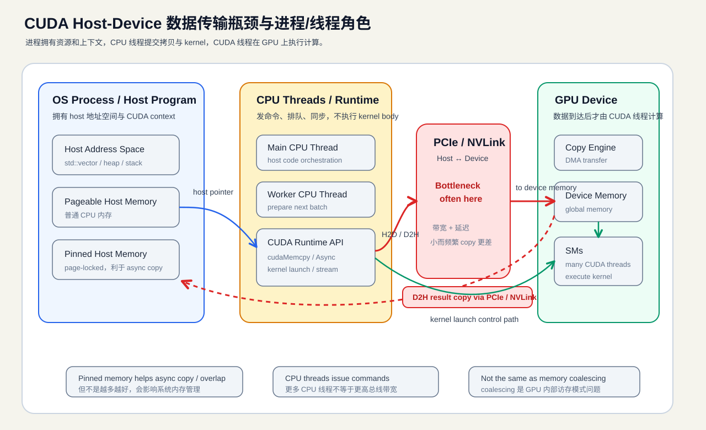

---
title: 3.3 CUDA Host-Device 数据传输瓶颈与进程线程角色
date: 2026-05-09
tags:
  - 培养方案
  - CUDA
  - GPU
  - Runtime
  - Profiling
  - infra
aliases:
  - CUDA CPU↔GPU 数据传输瓶颈
  - CUDA Host Device Transfer
  - CUDA 进程线程角色
status: active
---

# 3.3 CUDA Host-Device 数据传输瓶颈与进程线程角色

> 这篇笔记用于回答一个 CUDA 入门阶段很容易混淆的问题：CPU↔GPU 数据传输为什么经常成为端到端性能瓶颈，以及 OS 进程、CPU 线程、CUDA 线程在这条链路中分别负责什么。

关联笔记：[[3.1 CUDA 零基础系统入门|CUDA 零基础系统入门]]、[[3.2 CUDA Runtime 进阶|CUDA Runtime 进阶]]、[[3.4 CUDA Nsight Compute 指标速查|CUDA Nsight Compute 指标速查]]、[[CUDA 学习清单]]、[[Week 3 - Transpose + Memory Coalescing]]。

---

## 1. 一句话结论

**Host↔Device 数据传输经常是 CUDA 程序的大瓶颈，尤其是计算量小、数据量大、频繁来回拷贝的任务。**

但是它不是所有 CUDA 程序的唯一瓶颈。CUDA 性能至少要分两层看：

| 瓶颈层级 | 发生位置 | 典型问题 |
|---|---|---|
| Host↔Device 传输瓶颈 | CPU 内存和 GPU 显存之间 | H2D/D2H 拷贝、PCIe/NVLink 带宽、过度同步 |
| Device-side 访存/计算瓶颈 | GPU 内部 | global memory coalescing、shared memory bank conflict、occupancy、warp stall |

`vector add` 这类 kernel 计算量很小，端到端时间很容易被 Host↔Device copy 吃掉；而矩阵乘法这类计算密度高的任务，更可能受 GPU 内部算力、数据复用和访存模式影响。

---

## 2. 先分清三个“线程/执行主体”

CUDA 程序同时涉及 OS、CPU 和 GPU 三个层级，最容易混淆的是：**CPU 线程不会变成 CUDA 线程**。

| 层级 | 运行位置 | 主要职责 |
|---|---|---|
| OS 进程 | 操作系统管理的 CPU 程序实例 | 拥有 host 地址空间、CUDA context、device memory、stream/event 等资源边界 |
| CPU 线程 | CPU | 执行 host code，调用 CUDA Runtime API，提交 copy/kernel/sync 任务 |
| CUDA 线程 | GPU SM | kernel launch 后执行 device code，处理 GPU 上的数据 |

关键心智模型：

```text
进程：谁拥有资源
CPU 线程：谁提交任务
CUDA 线程：谁执行 GPU 计算
```

> [!important]
> CPU 线程负责发命令和搬数据，CUDA 线程负责在 GPU 上真正做计算；CPU 线程不会“变成” CUDA 线程。

[[3.1 CUDA 零基础系统入门|CUDA 零基础系统入门]] 中的 Host code / Device code 区分，正是这套模型的入口。

---

## 3. Host-Device 数据路径是什么

典型 CUDA 数据流是：

```text
CPU 准备数据
→ GPU 申请显存
→ Host to Device 拷贝输入
→ GPU kernel 并行计算
→ Device to Host 拷回结果
→ CPU 校验或继续处理
```

这对应 [[3.1 CUDA 零基础系统入门|CUDA 零基础系统入门]] 中的“分配 → 拷贝 → 计算 → 拷回”。



更细一点，Host↔Device copy 通常经过：

```text
Host memory
    │
    │  cudaMemcpy / cudaMemcpyAsync
    ▼
PCIe / NVLink
    │
    ▼
Device global memory
```

其中 Host memory 又要区分：

| Host 内存类型 | 特点 |
|---|---|
| Pageable memory | 普通 CPU 内存，系统可换页，异步传输和 DMA 效率受限 |
| Pinned memory / page-locked memory | 页锁定内存，更适合高效 DMA 和 `cudaMemcpyAsync` |

[[3.2 CUDA Runtime 进阶|CUDA Runtime 进阶]] 中的 pinned memory、异步拷贝、stream，就是围绕这条链路展开的。

---

## 4. 为什么 Host↔Device 传输会成为瓶颈

### 4.1 总线带宽通常低于 GPU 内部吞吐

GPU 内部 global memory 带宽通常远高于 CPU↔GPU 之间的 PCIe 链路带宽。即使使用 NVLink，Host↔Device 传输仍然是跨设备边界的数据移动，不能和 GPU 内部访存混为一谈。

所以有些程序会出现：

```text
kernel 只跑 0.1 ms
H2D + D2H 却花 1 ms
```

这时继续优化 kernel，收益可能很小，因为主要时间已经不在 kernel 内部。

### 4.2 小而频繁的 copy 很伤

性能差的不一定是“大数据传输”，更常见的是：

```text
copy 一点点
launch 一个小 kernel
copy 一点点回来
再 copy 一点点
再 launch 一个小 kernel
```

这种模式的问题是：

- 每次 Runtime API 调用都有调度成本。
- 每次传输都有延迟。
- 小 copy 难以打满带宽。
- 频繁同步会把原本可重叠的任务强行串行化。

### 4.3 端到端时间和 kernel-only 时间必须分开

[[3.4 CUDA Nsight Compute 指标速查|CUDA Nsight Compute 指标速查]] 强调先 benchmark，再用指标解释。CUDA 程序尤其要区分：

| 时间类型 | 包含内容 | 用途 |
|---|---|---|
| kernel-only time | 只测 GPU kernel 执行时间 | 判断 kernel 本身算得快不快 |
| end-to-end time | H2D + kernel + D2H + host 侧开销 | 判断整个程序是否真的快 |

如果只看 kernel-only，很容易得出“GPU 很快”的结论；但用户实际感受到的是 end-to-end 时间。

---

## 5. 进程、CPU 线程、CUDA 线程对瓶颈的影响

### 5.1 进程层：资源和上下文边界

一个 CUDA 程序首先是一个普通 OS 进程。这个进程拥有：

- host 虚拟地址空间
- host memory 中的数据结构
- CUDA context
- device memory allocation
- stream / event
- 与 CUDA Runtime / Driver 的交互状态

所以进程的核心作用是：**提供资源归属和隔离边界**。

多开进程通常不是优化单个 CUDA 任务 H2D/D2H 的首选手段，因为多个进程可能争抢同一张 GPU、同一条 PCIe/NVLink 链路和显存带宽。多进程更适合任务隔离、多用户服务或更复杂的 GPU 资源管理场景。

### 5.2 CPU 线程层：提交、同步和流水线

CPU 线程运行 host code，负责调用：

```cpp
cudaMalloc(...);
cudaMemcpy(...);
cudaMemcpyAsync(...);
kernel<<<grid, block, shared_mem, stream>>>(...);
cudaStreamSynchronize(...);
cudaEventSynchronize(...);
```

CPU 线程对传输瓶颈的影响主要体现在：

| 行为 | 影响 |
|---|---|
| 同步 `cudaMemcpy` | 简单，但容易形成 copy → kernel → copy 的串行链路 |
| `cudaMemcpyAsync` + stream | 有机会让 copy 和 compute overlap |
| 过度 `cudaDeviceSynchronize()` | 破坏并发，把异步任务强行拉回串行 |
| 后台 worker 线程准备数据 | 可以减少 GPU 等待 CPU 预处理的时间 |

> [!warning]
> 更多 CPU 线程不等于更高 Host↔Device 带宽。CPU 线程只能改善任务提交和流水线组织，不能突破 PCIe/NVLink 的物理带宽上限。

### 5.3 CUDA 线程层：数据到 GPU 之后的计算效率

CUDA 线程只在 kernel launch 后存在于 GPU 执行模型中。它们负责：

- 根据 `blockIdx` / `threadIdx` 计算数据下标
- 访问 device global memory / shared memory
- 执行 device code
- 在 block 内使用 `__syncthreads()` 协作

CUDA 线程不负责直接把 CPU 内存搬到 GPU 显存。Host↔Device copy 主要由 Runtime/Driver、DMA/copy engine 和传输链路完成。

所以要分清：

```text
Host↔Device 传输慢：通常看 copy、stream、pinned memory、同步、总线链路
GPU kernel 慢：通常看 coalescing、occupancy、shared memory、warp stall
```

[[Week 3 - Transpose + Memory Coalescing]] 讨论的是第二类问题：数据已经在 GPU 上之后，CUDA 线程如何更高效访问 global memory。

---

## 6. 常见误区

| 误区 | 修正 |
|---|---|
| 开更多 CPU 线程就等于 GPU 更快 | CPU 线程只是提交者，真正计算在 GPU；总线带宽也不会因为线程多而无限增加 |
| CUDA 线程越多，H2D/D2H copy 越快 | CUDA 线程影响 kernel 执行，不直接决定 Host↔Device copy 带宽 |
| kernel 很快就代表 CUDA 程序很快 | 还要看 H2D、D2H、host 预处理、同步等 end-to-end 成本 |
| `cudaMemcpyAsync` 一定会自动 overlap | 通常需要 pinned memory、不同 stream、硬件 copy engine 支持和正确的依赖关系 |
| memory coalescing 和 PCIe 传输瓶颈是一回事 | coalescing 是 GPU 内部 global memory 访问模式；PCIe/NVLink 是 Host↔Device 数据通道 |

---

## 7. 优化方向

### 7.1 减少传输次数

最重要的优化往往不是让 copy 更快，而是让 copy 更少：

```text
不要每个小步骤都把结果拷回 CPU
尽量让中间结果常驻 GPU
多个 kernel 在 GPU 上连续处理
最后只拷回真正需要的结果
```

这也是 CUDA Best Practices 中反复强调的原则：尽量减少 Host 和 Device 之间的数据传输。

### 7.2 合并小 copy

多个小 copy 往往比一个大 copy 更差。能合并时，应优先把小块数据整理成连续 buffer 后再传输。

```text
差：1000 次小 copy
好：1 次批量 copy
```

### 7.3 使用 pinned memory

如果要做高效异步传输，优先考虑 pinned memory：

```cpp
float* h_data = nullptr;
cudaMallocHost(&h_data, bytes);

cudaMemcpyAsync(d_data, h_data, bytes, cudaMemcpyHostToDevice, stream);
```

但 pinned memory 不是越多越好。它会减少操作系统可自由分页的内存，过量使用会影响系统整体内存管理。

### 7.4 使用 stream 做流水线

理想状态下，可以把大数据分块：

```text
chunk 0: H2D → kernel → D2H
chunk 1:      H2D → kernel → D2H
chunk 2:           H2D → kernel → D2H
```

目标是让：

```text
GPU 正在计算一个 chunk
copy engine 正在传输另一个 chunk
CPU 线程正在准备下一批数据
```

这就是 [[3.2 CUDA Runtime 进阶|CUDA Runtime 进阶]] 中 stream、event、pinned memory、async copy 放在一起学习的原因。

---

## 8. 如何验证确实是传输瓶颈

不要只凭感觉判断瓶颈。建议按这个顺序验证：

1. **先测 end-to-end 时间**
   - 包含 H2D、kernel、D2H、必要同步。

2. **再测 kernel-only 时间**
   - 用 CUDA event 只包住 kernel。

3. **比较两者差距**
   - 如果 kernel-only 很短，但 end-to-end 很长，优先怀疑 Host↔Device 传输或 host 侧调度。

4. **看 timeline**
   - H2D、kernel、D2H 是否完全串行？
   - 是否存在 copy/compute overlap？
   - 是否有过度同步？

5. **再进入 kernel profiling**
   - 如果确认瓶颈在 kernel 内部，再看 [[3.4 CUDA Nsight Compute 指标速查|CUDA Nsight Compute 指标速查]] 中的 memory throughput、occupancy、stall reason、bank conflict 等指标。

---

## 9. 面试回答模板

如果被问：**CUDA 中 CPU 到 GPU 的数据传输是不是大瓶颈？进程和线程在其中有什么作用？**

可以这样回答：

> 是的，Host↔Device 数据传输经常是 CUDA 程序的端到端瓶颈，尤其是数据量大、计算量小、频繁来回拷贝的任务。进程主要提供 host 地址空间、CUDA context 和资源隔离边界；CPU 线程负责调用 CUDA Runtime API，提交 H2D/D2H copy、kernel launch 和同步操作；CUDA 线程则是在 kernel 启动后运行在 GPU 上，负责处理 device memory 中的数据。Host↔Device 传输瓶颈主要和 copy、stream、pinned memory、同步以及 PCIe/NVLink 链路有关，而不是 CUDA 线程数量本身决定的。

---

## 10. 关键要点

1. Host↔Device 传输瓶颈是 CUDA end-to-end 性能分析中的第一类大问题。
2. OS 进程负责资源归属和 CUDA context 边界，不是直接计算单位。
3. CPU 线程负责 host code、CUDA API 调用、任务提交和同步控制。
4. CUDA 线程负责 GPU kernel 内部计算，不直接控制 CPU↔GPU 总线传输。
5. `cudaMemcpyAsync` 想发挥作用，通常要结合 pinned memory、stream 和正确的依赖关系。
6. kernel-only benchmark 不能代表端到端性能。
7. Host↔Device 传输优化和 memory coalescing 优化属于不同层级：前者是 CPU/GPU 之间，后者是 GPU 内部。

---

## 关联知识

- [[3.1 CUDA 零基础系统入门|CUDA 零基础系统入门]]
- [[3.2 CUDA Runtime 进阶|CUDA Runtime 进阶]]
- [[3.4 CUDA Nsight Compute 指标速查|CUDA Nsight Compute 指标速查]]
- [[CUDA 学习清单]]
- [[Week 3 - Transpose + Memory Coalescing]]
