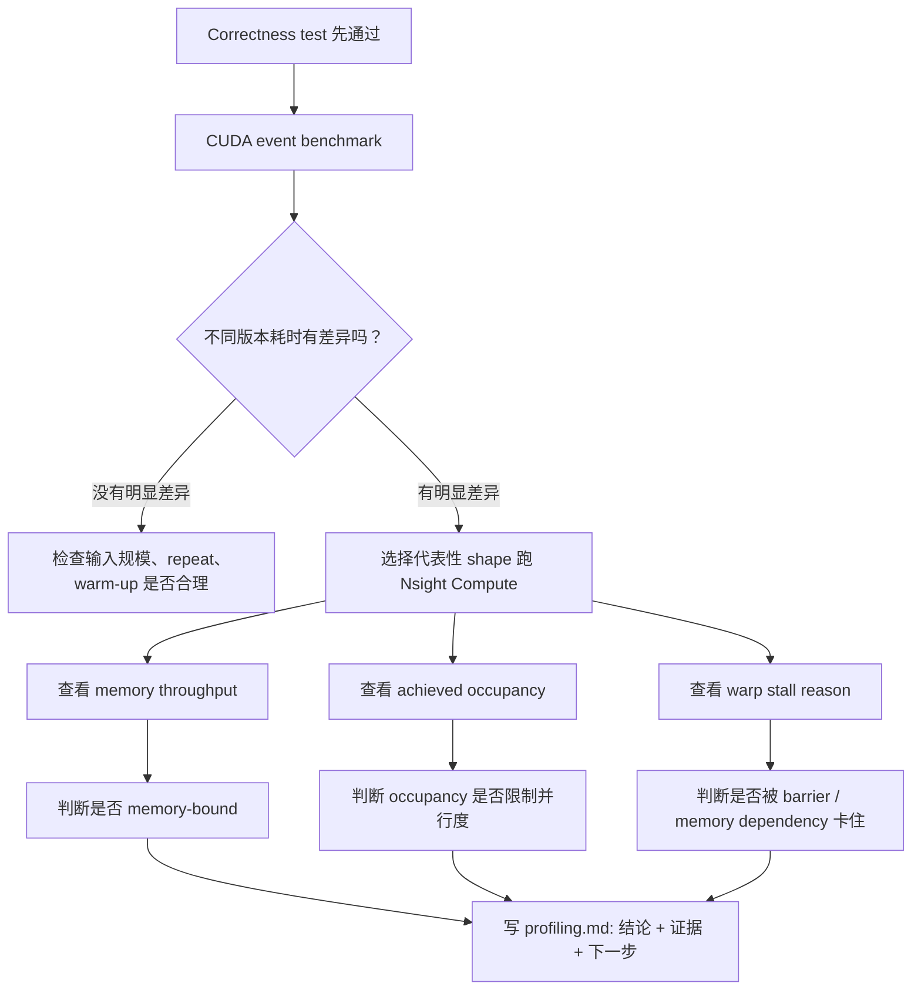
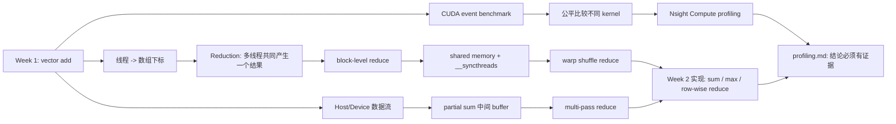

# 3.5 CUDA Week 2 前置知识 - Reduction + Profiling

> 这篇笔记的目标不是提前实现完整 reduction，而是把你已经搞懂的 `week01/vector add` 迁移到 [[Week 2 - Reduction + Profiling]] 需要的思维模型：多个 GPU 线程不再只是各算各的，而是要协作产出一个结果，并且要能用 benchmark 和 profiler 解释性能。

项目起点：[CUDA_learning/week01](https://github.com/hosendovebelva-boop/CUDA_learning/tree/main/week01)

---

## 0. 你现在已经掌握了什么

如果你已经能讲清楚 `week01` 项目，那么你至少已经掌握了这些基础：

- `std::vector` 在 host memory，`DeviceBuffer<T>` 管理 device memory。
- `cudaMemcpyHostToDevice` 把输入从 CPU 拷到 GPU。
- `kernel<<<grid, block>>>(...)` 在 GPU 上启动大量线程。
- `idx = blockIdx.x * blockDim.x + threadIdx.x` 把线程映射到数组下标。
- `idx < n` 保护最后一个不满的 block。
- `cudaDeviceSynchronize()` 等待 GPU 完成，并暴露异步执行错误。
- CUDA event benchmark 用来测 kernel-only 时间。
- benchmark 必须保留 correctness check。

这些知识在 Week 2 都还会继续用。区别是：`vector add` 里每个线程独立写一个输出，而 reduction 里多个线程要合作得到一个输出。

![[图片/SVG/cuda-week2-reduction-prereq-map.svg|955]]

---

## 1. 从 vector add 到 reduction：问题变了

`vector add` 的计算是：

```cpp
c[i] = a[i] + b[i];
```

每个 `c[i]` 只依赖 `a[i]` 和 `b[i]`，所以 thread `i` 可以独立完成自己的工作。线程之间没有必要互相说话。

`reduction` 的计算是：

```cpp
sum = a[0] + a[1] + ... + a[n - 1];
```

这里最终只有一个 `sum`。如果每个线程都直接写同一个 `sum`，就会出现多个线程同时更新同一块内存的问题。即使用 `atomicAdd` 能保证结果不乱，也会让大量线程排队争抢一个地址，性能通常不好。

> [!important] 第一层直觉
> `vector add` 是“每个线程负责一个输出”；`reduction` 是“很多线程共同生产一个输出”。Week 2 的核心就是学习 GPU 线程如何分阶段协作。

### 1.1 为什么不让一个线程算完整个 sum

当然可以写一个 kernel，只让一个线程循环求和：

```cpp
if (threadIdx.x == 0 && blockIdx.x == 0) {
    float sum = 0.0f;
    for (int i = 0; i < n; ++i) {
        sum += a[i];
    }
    out[0] = sum;
}
```

这在结果上是对的，但它把 GPU 变回了“一个线程干活”。GPU 的优势来自大量线程并行处理数据，所以 reduction 必须把求和拆成很多小段，再把小段结果汇总。

### 1.2 kernel launch 后 block 怎么实际运行

`kernel<<<gridDim, blockDim>>>(...)` 在语义上是一次性提交整个 grid。也就是说，程序员看到的是：

```text
总 block 数 = gridDim
每个 block 的线程数 = blockDim
总线程数 = gridDim * blockDim
```

但硬件执行时，不代表所有 block 会同时运行。GPU 会根据当前 SM 数量、每个 block 需要的寄存器、shared memory、线程数等资源，先把一部分 block 调度到 SM 上执行。等某些 block 执行完、释放资源后，再调度剩下的 block。

可以把一次 kernel 执行理解成：

```text
CPU 提交整个 grid
-> GPU 调度器选择一批 block 放到各个 SM 上
-> 这些 block 并行运行
-> 已完成的 block 释放资源
-> 剩余 block 继续被调度
-> 所有 block 完成后，这个 kernel 才完成
```

所以有几个非常重要的结论：

- `kernel launch` 提交的是全部 block，但同时驻留在 GPU 上的通常只是其中一部分。
- 一个 block 一旦被调度到某个 SM 上，通常会在这个 SM 上运行到结束。
- 不同 block 的开始顺序和结束顺序没有稳定保证，不能假设 `block 0` 一定先于 `block 1` 完成。
- 同一个 block 内线程可以用 `__syncthreads()` 同步；不同 block 之间不能用它同步。
- 一个 kernel 完成时，才表示这个 kernel 里的所有 block 都已经完成。

> [!important] 和 reduction 的关系
> 因为不同 block 不一定同时运行，也没有简单的 block 间同步，所以一个 block 不能在同一个 kernel 里可靠地等待其他 block 的 partial sum。最稳的入门做法是：第一个 kernel 让每个 block 写出 `partial[blockIdx.x]`，等整个 kernel 结束后，再启动第二阶段汇总这些 partial sums。

---

## 2. partial sum：先局部汇总，再全局汇总

Week 2 第一个要接受的概念是 `partial sum`，也就是“部分和”。

假设输入有 1024 个数，可以先让每个 block 处理一段数据：

```text
Block 0 处理 a[0..255]      -> partial[0]
Block 1 处理 a[256..511]    -> partial[1]
Block 2 处理 a[512..767]    -> partial[2]
Block 3 处理 a[768..1023]   -> partial[3]
```

然后再把 `partial[0..3]` 汇总成最终结果。

这就是 `multi-pass reduce` 的来源：

```text
原始输入 -> 第一次 kernel 得到 partial sums -> 第二次 kernel 或 CPU 汇总 partial sums
```

> [!tip] 和 week01 的关系
> week01 里 `vector_add_kernel` 输出 `c[i]`。Week 2 的 naive reduce 可以先输出 `partial[blockIdx.x]`。也就是说，输出数组不再和输入一样长，而是和 block 数量有关。

### 2.1 为什么通常不能一个 kernel 内跨 block 完成全部同步

同一个 block 内的线程可以用 `__syncthreads()` 同步，但不同 block 之间没有这种简单同步点。一个 block 不知道其他 block 是否已经算完。

所以入门阶段最稳的做法是：

1. 第一个 kernel：每个 block 写一个 partial sum。
2. kernel 结束天然形成全局完成点。
3. 第二阶段：再处理 partial sum。

kernel launch 虽然有开销，但它提供了清晰的阶段边界。

![[3_5_1.png|849]]

![[3_5_2.png]]

---

## 3. block-level reduce：block 内怎么合作

一个 block 里通常有 128 或 256 个线程。如果每个线程先读一个元素，那么 block 内就会有很多局部值。接下来要把这些值压缩成一个 block 的 partial sum。

典型思路是二分归约：

```text
256 个值
-> 128 个值
-> 64 个值
-> 32 个值
-> 16 个值
-> ...
-> 1 个值
```

每一轮让前半部分线程把后半部分的值加到自己身上：

```cpp
if (threadIdx.x < stride) {
    sdata[threadIdx.x] += sdata[threadIdx.x + stride];
}
```

这里的 `sdata` 通常放在 shared memory。

---

## 4. shared memory：block 内共享的临时工作区

global memory 是所有线程都能访问的显存，但访问延迟较高。shared memory 是同一个 block 内线程共享的一小块片上内存，速度更快，适合做 block 内协作。

可以把它理解成：

| 内存 | 谁能访问 | Week 2 用途 |
|---|---|---|
| global memory | 所有 block、所有线程 | 输入数组、partial sum 输出 |
| shared memory | 同一个 block 内线程 | block 内临时保存和归约 |
| register | 当前线程自己 | 当前线程的局部变量 |

shared memory 的常见 reduction 流程：

```cpp
extern __shared__ float sdata[];

int tid = threadIdx.x;
int idx = blockIdx.x * blockDim.x + threadIdx.x;

sdata[tid] = (idx < n) ? input[idx] : 0.0f;
__syncthreads();

for (int stride = blockDim.x / 2; stride > 0; stride >>= 1) {
    if (tid < stride) {
        sdata[tid] += sdata[tid + stride];
    }
    __syncthreads();
}

if (tid == 0) {
    partial[blockIdx.x] = sdata[0];
}
```

### 4.1 `__syncthreads()` 到底同步谁

`__syncthreads()` 只同步同一个 block 内的线程。

它保证：

- 同一个 block 内所有线程都执行到这个点之后，大家才继续往下走。
- 在它之前写入 shared memory 的结果，对同一个 block 内其他线程可见。

它不保证：

- 不同 block 之间互相等待。
- host 侧 CPU 等 GPU 完成。
- 其他 stream 的任务完成。

> [!warning] 必须放同步的原因
> 如果 thread 0 要读取 `sdata[128]`，就必须保证 thread 128 已经把自己的输入写进 shared memory。否则 thread 0 可能读到旧值或未初始化值。

### 4.2 为什么 shared memory 不等于一定更快

shared memory 能减少 global memory 访问，但它也带来成本：

- 需要显式搬运数据。
- 每轮归约可能需要 `__syncthreads()`。
- 使用太多 shared memory 会减少每个 SM 上能同时驻留的 block 数量。
- 访问模式不好时可能出现 shared memory bank conflict。

所以 Week 2 不要只问“用了 shared memory 吗”，要问“用了以后 benchmark 是否更快，Nsight 指标是否支持这个解释”。

---

## 5. warp 和 warp shuffle：更小范围的协作

CUDA 线程不是完全一个一个独立调度的。硬件通常以 warp 为单位执行线程，一个 warp 通常是 32 个线程。

在一个 warp 内，线程天然按同一条指令流前进，因此可以使用 warp-level primitive 直接在线程之间交换寄存器里的值。`__shfl_down_sync` 就是 Week 2 会遇到的核心 API。

直觉上，它做的是：

```text
当前线程拿到“后面某个 lane”的值
```

例如：

```cpp
value += __shfl_down_sync(0xffffffff, value, 16);
value += __shfl_down_sync(0xffffffff, value, 8);
value += __shfl_down_sync(0xffffffff, value, 4);
value += __shfl_down_sync(0xffffffff, value, 2);
value += __shfl_down_sync(0xffffffff, value, 1);
```

这段代码让一个 warp 内的值逐步合并。它没有把中间值写进 shared memory，也不需要每一步都做 block-level `__syncthreads()`。

> [!tip] 先记住直觉
> shared memory reduce 是“线程把值放到 block 共享桌面上，再一轮轮合并”。warp shuffle reduce 是“同一个 warp 内的线程直接交换手里的寄存器值”。

### 5.1 shuffle reduce 和 shared memory reduce 的关系

它们不是二选一。常见高效 block reduce 会混合使用：

1. 每个线程先读 global memory，得到自己的局部值。
2. 每个 warp 内用 shuffle 归约，得到一个 warp sum。
3. 每个 warp 的 lane 0 把 warp sum 写入 shared memory。
4. 再用一个 warp 把这些 warp sum 汇总成 block sum。

这样可以减少 shared memory 写入次数和同步次数。

---

## 6. reduction correctness：正确性比速度先发生

Week 2 很容易写出“跑得很快但结果错”的 kernel。下面几个点必须先立住。

### 6.1 非整除长度

输入长度经常不是 block size 的整数倍。读取 global memory 前必须判断：

```cpp
float x = 0.0f;
if (idx < n) {
    x = input[idx];
}
```

对 sum 来说，越界位置可以补 `0.0f`。对 max 来说，越界位置应该补一个足够小的初值，例如 `-infinity`，不能补 `0.0f`，否则全负数输入会被算错。

### 6.2 FP32 误差

CPU 串行求和和 GPU 并行求和的加法顺序不同。浮点加法不满足严格结合律，所以结果可能有微小差异。

测试时不要写：

```cpp
assert(gpu_sum == cpu_sum);
```

应该使用容忍误差：

```cpp
std::fabs(gpu_sum - cpu_sum) < tolerance
```

### 6.3 benchmark 必须保留 check

错误的 reduction 可能因为少算了一部分数据而更快。所以 benchmark 输出至少要包含：

```text
Version    N    Kernel(ms)    Bandwidth(GB/s)    Check
```

`Check` 不通过的性能数据没有意义。

---

## 7. Profiling：先知道多快，再解释为什么

Week 1 的 benchmark 已经回答了一个问题：kernel 跑多久。

Week 2 需要进一步回答：为什么这个版本快，为什么那个版本慢。



### 7.1 CUDA event 和 Nsight Compute 的分工

| 工具 | 回答的问题 | Week 2 典型输出 |
|---|---|---|
| correctness test | 算得对不对 | PASS / FAIL |
| CUDA event benchmark | 跑得多快 | 平均耗时、最小耗时、带宽 |
| Nsight Compute | 为什么快或慢 | memory throughput、occupancy、stall reason |

> [!important] 判断顺序
> correctness 是门票，benchmark 是事实，profiler 是解释。不要用 profiler 替代 benchmark，也不要在 correctness 失败时讨论性能。

### 7.2 reduction 常看的 Nsight 指标

| 指标 | 你要问的问题 |
|---|---|
| memory throughput | global memory 读写是否接近带宽上限 |
| achieved occupancy | SM 上是否有足够多 warp 可运行 |
| warp stall reason | warp 主要在等内存、等同步，还是被指令依赖卡住 |
| shared memory usage | 每个 block 的 shared memory 是否限制并发 |
| register count | 每线程寄存器是否过多，是否压低 occupancy |

这些指标不是为了堆截图，而是为了支撑一句明确结论：

```text
shared memory 版本比 naive 版本快，因为它减少了 global memory 中间访问；
Nsight 中 memory throughput / stall reason / 实际耗时支持这个判断。
```

---

## 8. Week 2 学习路径图



---

## 9. 学完这篇后再去看 Week 2

进入 [[Week 2 - Reduction + Profiling]] 前，建议能用自己的话回答下面的问题：

- [ ] `vector add` 为什么可以每个线程独立写输出？
- [ ] reduction 为什么不能简单地让所有线程写同一个 `sum`？
- [ ] `partial sum` 是什么，为什么每个 block 可以先输出一个 partial sum？
- [ ] 为什么跨 block 汇总通常需要多阶段？
- [ ] shared memory 是谁共享的？为什么它适合 block 内归约？
- [ ] `__syncthreads()` 同步的是谁？它不能同步谁？
- [ ] warp 是什么？为什么 warp 内可以用 shuffle 交换值？
- [ ] 为什么 reduction 的 FP32 结果可能和 CPU 串行结果略有差异？
- [ ] 为什么 benchmark 里必须保留 correctness check？
- [ ] CUDA event benchmark 和 Nsight Compute 分别回答什么问题？

如果这些问题都能答出来，再看 Week 2 的 naive reduce、shared memory reduce、warp shuffle reduce 和 profiling.md，就不会像突然跳进一堆陌生术语里。

---

## 关联知识

- [[Week 2 - Reduction + Profiling]]
- [[3.1 CUDA 零基础系统入门|CUDA 零基础系统入门]]
- [[CUDA Week 1 Hello World 项目解析]]
- [[3.2 CUDA Runtime 进阶|CUDA Runtime 进阶]]
- [[3.4 CUDA Nsight Compute 指标速查|CUDA Nsight Compute 指标速查]]
- [[CUDA 学习清单]]

---

## 参考

- [CUDA_learning/week01](https://github.com/hosendovebelva-boop/CUDA_learning/tree/main/week01)
- NVIDIA CUDA C++ Programming Guide
- NVIDIA CUDA C++ Best Practices Guide
- NVIDIA Nsight Compute Documentation
