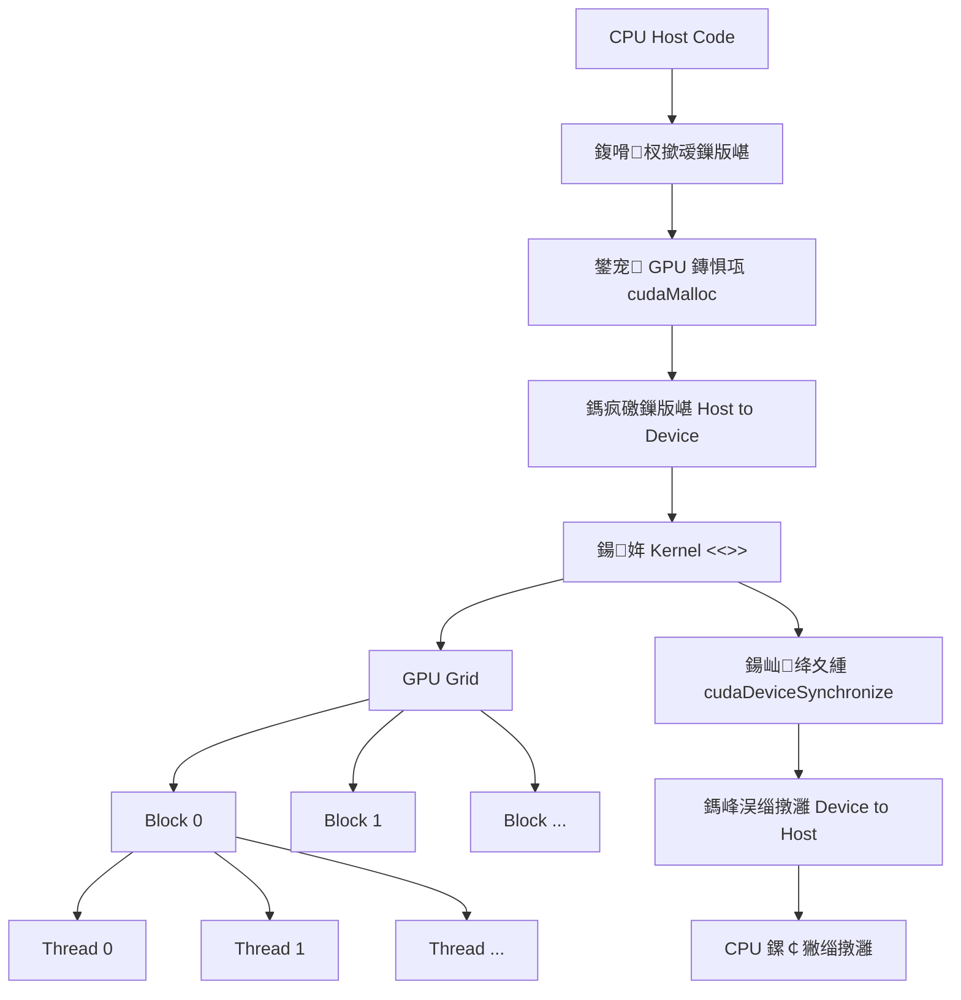

---
title: CUDA 闆跺熀纭€绯荤粺鍏ラ棬
date: 2026-05-06
tags:
  - 鍩瑰吇鏂规
  - CUDA
  - GPU
  - 骞惰璁＄畻
  - infra
aliases:
  - CUDA 鍏ラ棬
  - CUDA 绯荤粺鍏ラ棬
status: active
---

# CUDA 闆跺熀纭€绯荤粺鍏ラ棬

> CUDA 鏄?NVIDIA 鎻愪緵鐨?GPU 閫氱敤璁＄畻骞冲彴锛氬畠璁?C/C++ 绋嬪簭鍙互鎶婇€傚悎骞惰鐨勫ぇ閲忛噸澶嶈绠椾氦缁?GPU 鎵ц锛屼粠鑰岃幏寰楁瘮 CPU 鏇撮珮鐨勫悶鍚愰噺銆?
---

## 0. 鍏堝缓绔嬬洿瑙夛細CUDA 瑙ｅ喅浠€涔堥棶棰?
濡傛灉浣犳病鏈夊杩?CUDA锛屽彲浠ュ厛鎶婂畠鐞嗚В鎴愪竴绉嶁€滄妸寰幆鎷嗙粰寰堝 GPU 绾跨▼鍚屾椂鍋氣€濈殑缂栫▼鏂瑰紡銆?
鏅€?CPU 绋嬪簭甯歌鍐欐硶鏄細

```cpp
for (int i = 0; i < n; ++i) {
    c[i] = a[i] + b[i];
}
```

杩欐浠ｇ爜鍦ㄨ涔変笂鏄竴涓惊鐜紝浣嗘瘡涓?`i` 涔嬮棿浜掍笉渚濊禆銆侰UDA 鐨勬€濊矾鏄細涓嶈璁╀竴涓?CPU 鏍稿績鎸夐『搴忚窇瀹屾墍鏈?`i`锛岃€屾槸璁?GPU 鍚姩澶ч噺绾跨▼锛屾瘡涓嚎绋嬭礋璐ｄ竴涓垨鍑犱釜鍏冪礌銆?
```text
CPU 涓茶鎬濊矾锛氫竴涓伐浜轰粠绗?0 涓厓绱犲仛鍒扮 n-1 涓厓绱?CUDA 骞惰鎬濊矾锛氬緢澶氬伐浜哄悓鏃跺紑宸ワ紝姣忎釜宸ヤ汉澶勭悊鑷繁鐨勫厓绱?```

> [!important] 绗竴鎬у師鐞?> CUDA 閫傚悎鈥滃悓涓€绉嶆搷浣滀綔鐢ㄥ湪澶ч噺鏁版嵁涓娾€濈殑浠诲姟锛屼緥濡傚悜閲忓姞娉曘€佺煩闃典箻娉曘€佸浘鍍忓鐞嗐€佹繁搴﹀涔犵畻瀛愩€傚畠涓嶉€傚悎澶ч噺鍒嗘敮澶嶆潅銆佹暟鎹妯″緢灏忋€佺嚎绋嬩箣闂村己渚濊禆鐨勪换鍔°€?
---

## 1. CUDA 鐨勫熀鏈蹇?
CUDA 绋嬪簭鍚屾椂娑夊強涓ょ被浠ｇ爜锛?
| 鍚嶇О          | 杩愯浣嶇疆 | 鑱岃矗                           |
| ----------- | ---- | ---------------------------- |
| Host code   | CPU  | 鍑嗗鏁版嵁銆佸垎閰嶆樉瀛樸€佸惎鍔?GPU kernel銆佸彇鍥炵粨鏋?|
| Device code | GPU  | 鎵ц鐪熸鐨勫ぇ瑙勬ā骞惰璁＄畻                 |

GPU 涓婅繍琛岀殑鍑芥暟鍙?**kernel**銆侰PU 閫氳繃鐗规畩璇硶鍚姩 kernel锛?
```cpp
my_kernel<<<grid_size, block_size>>>(args...);
```

杩欓噷鐨?`<<<grid_size, block_size>>>` 涓嶆槸鏅€?C++ 鍑芥暟璋冪敤璇硶锛岃€屾槸 CUDA 鎵╁睍璇硶锛岃〃绀衡€滃湪 GPU 涓婂惎鍔ㄥ灏戠嚎绋嬧€濄€?
---

## 2. CUDA 鎵ц妯″瀷锛欸rid / Block / Thread

CUDA 鎶婁竴娆?kernel 鍚姩缁勭粐鎴愪笁灞傦細

```text
Grid
鈹斺攢鈹€ Block
    鈹斺攢鈹€ Thread
```

- **Thread**锛氭渶灏忔墽琛屽崟鍏冿紝閫氬父澶勭悊涓€涓垨鍑犱釜鏁版嵁鍏冪礌銆?- **Block**锛氫竴缁?thread锛屽悓涓€涓?block 鍐呯殑绾跨▼鍙互鍗忎綔銆?- **Grid**锛氫竴娆?kernel launch 浜х敓鐨勬墍鏈?block銆?


### 2.1 Mermaid 鎬昏



### 2.2 绾跨▼濡備綍鐭ラ亾鑷繁璐熻矗鍝釜鍏冪礌

CUDA kernel 閲屽父瑙佺殑绗竴琛屾槸璁＄畻鍏ㄥ眬绾跨▼缂栧彿锛?
```cpp
const int idx = blockIdx.x * blockDim.x + threadIdx.x;
```

**鍚箟鎷嗚В**锛?
- `blockIdx.x`锛氬綋鍓?block 鍦?grid 涓殑缂栧彿銆?- `blockDim.x`锛氭瘡涓?block 涓湁澶氬皯绾跨▼銆?- `threadIdx.x`锛氬綋鍓嶇嚎绋嬪湪 block 鍐呯殑缂栧彿銆?- `idx`锛氬綋鍓嶇嚎绋嬪搴旂殑鍏ㄥ眬鍏冪礌涓嬫爣銆?
```
idx 璁＄畻鍏紡
const int idx = blockIdx.x * blockDim.x + threadIdx.x;
```
鍋囪姣忎釜 block 鏈?256 涓嚎绋嬶細

| blockIdx.x | threadIdx.x | idx |
|---|---:|---:|
| 0 | 0 | 0 |
| 0 | 1 | 1 |
| 0 | 255 | 255 |
| 1 | 0 | 256 |
| 1 | 1 | 257 |

杩欏氨鏄?CUDA 鍏ラ棬鏈€閲嶈鐨勬槧灏勫叧绯伙細**绾跨▼缂栧彿 鈫?鏁版嵁涓嬫爣**銆?
---

## 3. CUDA 绋嬪簭鍏稿瀷鏁版嵁娴侊細鍒嗛厤 鈫?鎷疯礉 鈫?璁＄畻 鈫?鎷峰洖

鍒濆 CUDA 鏃讹紝鏈€閲嶈鐨勪笉鏄厛璁颁綇寰堝 API锛岃€屾槸鍏堝缓绔嬩竴鏉＄ǔ瀹氱殑鏁版嵁娴佸績鏅烘ā鍨嬶細

```text
CPU 鍑嗗鏁版嵁
鈫?GPU 鐢宠鏄惧瓨
鈫?CPU 鏁版嵁鎷疯礉鍒?GPU
鈫?GPU kernel 骞惰璁＄畻
鈫?GPU 缁撴灉鎷峰洖 CPU
鈫?CPU 鏍￠獙缁撴灉
```


杩欐潯閾捐矾鏄嚑涔庢墍鏈?CUDA 绋嬪簭鐨勫熀纭€銆俙vector add` 涔嬫墍浠ラ€傚悎浣滀负 CUDA Hello World锛屾槸鍥犱负瀹冨垰濂借鐩栦簡杩欐潯瀹屾暣娴佺▼锛屼絾绠楁硶鏈韩鍙堣冻澶熺畝鍗曪紝涓嶄細骞叉壈瀵?CUDA 鎵ц妯″瀷鍜屽唴瀛樻ā鍨嬬殑鐞嗚В銆?
> [!important] 鏍稿績鐩磋
> CPU 鍐呭瓨鍜?GPU 鏄惧瓨鏄袱涓笉鍚岀┖闂淬€傛櫘閫?`std::vector` 閲岀殑鏁版嵁鍦?CPU 鍐呭瓨涓紝GPU kernel 涓嶈兘鐩存帴鎶婂畠褰撲綔 device memory 浣跨敤銆傚繀椤诲厛鎶婃暟鎹粠 Host 鎷疯礉鍒?Device锛宬ernel 鎵嶈兘澶勭悊銆?
### 3.1 Host 渚у噯澶囨暟鎹?
CPU 渚т緷鐒朵娇鐢ㄦ櫘閫?Modern C++ 瀹瑰櫒锛屼緥濡?`std::vector`锛?
```cpp
std::vector<float> a(n, 1.0f);
std::vector<float> b(n, 2.0f);
std::vector<float> c(n, 0.0f);
```

杩欓噷鐨勮鑹叉槸锛?
| 鍙橀噺 | 鎵€鍦ㄤ綅缃?| 浣滅敤 |
|---|---|---|
| `a` | CPU 鍐呭瓨 | 杈撳叆鏁扮粍 |
| `b` | CPU 鍐呭瓨 | 杈撳叆鏁扮粍 |
| `c` | CPU 鍐呭瓨 | 鎺ユ敹 GPU 璁＄畻鍚庣殑缁撴灉 |

姝ゆ椂鏁版嵁杩樻病鏈夎繘鍏?GPU銆俙a.data()`銆乣b.data()`銆乣c.data()` 閮芥槸 host pointer锛屽彧鑳借 CPU 渚т唬鐮佺洿鎺ヨ闂€?
> [!warning] 甯歌璇尯
> `std::vector<float> a` 鐨?`a.data()` 鏄?host pointer锛屼笉鏄?device pointer銆傛妸 host pointer 鐩存帴浼犵粰 kernel锛岄€氬父浼氬鑷撮潪娉曞唴瀛樿闂垨閿欒缁撴灉銆?
### 3.2 Device 渚х敵璇锋樉瀛橈細`cudaMalloc`

`cudaMalloc` 鏄渶鍩虹鐨?device memory 鐢宠鎺ュ彛锛?
```cpp
cudaError_t cudaMalloc(void** devPtr, size_t size);
```

鍙傛暟鍚箟锛?
| 鍙傛暟 | 鍚箟 |
|---|---|
| `devPtr` | 杈撳嚭鍙傛暟锛屾垚鍔熷悗鍐欏叆涓€娈?GPU 鏄惧瓨鐨?device pointer |
| `size` | 鐢宠鐨勫瓧鑺傛暟锛岄€氬父鍐欐垚 `n * sizeof(T)` |

杩斿洖鍊?`cudaError_t` 琛ㄧず璋冪敤鏄惁鎴愬姛銆俙cudaMalloc` 鍙礋璐ｇ敵璇?GPU 鏄惧瓨锛屼笉浼氬垵濮嬪寲鍐呭锛屼篃涓嶄細鎶?host 鏁版嵁鎷疯繘鍘汇€?
`devPtr` 鏄?`void**`锛屽洜涓?Runtime API 闇€瑕佹妸鐢宠鍒扮殑 device pointer 鍥炲啓缁欒皟鐢ㄨ€呫€傛瘮濡?`d_a` 鏄?`float*`锛屼紶鍏?`&d_a` 鍚庯紝`cudaMalloc` 鎵嶈兘淇敼 `d_a` 淇濆瓨鐨勫湴鍧€鍊笺€?
GPU kernel 闇€瑕佽闂?GPU 鏄惧瓨锛屾墍浠ヨ鍏堝湪 device memory 涓敵璇风┖闂达細

```cpp
float* d_a = nullptr;
float* d_b = nullptr;
float* d_c = nullptr;

cudaMalloc(&d_a, n * sizeof(float));
cudaMalloc(&d_b, n * sizeof(float));
cudaMalloc(&d_c, n * sizeof(float));
```

杩欓噷鐨?`d_` 琛ㄧず device锛?
| 鍙橀噺 | 鎸囧悜浣嶇疆 | 浣滅敤 |
|---|---|---|
| `d_a` | GPU 鏄惧瓨 | 瀛樻斁杈撳叆 `a` 鐨?device 鍓湰 |
| `d_b` | GPU 鏄惧瓨 | 瀛樻斁杈撳叆 `b` 鐨?device 鍓湰 |
| `d_c` | GPU 鏄惧瓨 | 瀛樻斁杈撳嚭缁撴灉 |

`cudaMalloc` 鍙礋璐ｇ敵璇?GPU 鏄惧瓨锛屼笉璐熻矗鎷疯礉鏁版嵁銆傛墽琛屽畬杩欎竴姝ュ悗锛孏PU 涓婂彧鏄湁浜嗙┖闂达紝`d_a` 鍜?`d_b` 閲岃繕娌℃湁鏈夋晥杈撳叆銆?
### 3.3 Host to Device锛氭妸杈撳叆鎷峰埌 GPU

`cudaMemcpy` 鏄?CUDA Runtime API 涓渶甯哥敤鐨勬暟鎹嫹璐濇帴鍙ｏ細

```cpp
cudaError_t cudaMemcpy(void* dst, const void* src, size_t count, cudaMemcpyKind kind);
```

鍙傛暟鍚箟锛?
| 鍙傛暟 | 鍚箟 |
|---|---|
| `dst` | 鐩爣鍦板潃 |
| `src` | 鏉ユ簮鍦板潃 |
| `count` | 鎷疯礉鐨勫瓧鑺傛暟锛屼笉鏄厓绱犱釜鏁?|
| `kind` | 鎷疯礉鏂瑰悜锛岀敱 `cudaMemcpyKind` 鏋氫妇鎸囧畾 |

鏈妭鏈€甯歌鐨勪袱涓柟鍚戞槸锛?
| 鏂瑰悜 | 鍚箟 |
|---|---|
| `cudaMemcpyHostToDevice` | 浠?CPU 鍐呭瓨鎷疯礉鍒?GPU 鏄惧瓨 |
| `cudaMemcpyDeviceToHost` | 浠?GPU 鏄惧瓨鎷疯礉鍥?CPU 鍐呭瓨 |

鎺ヤ笅鏉ョ敤 `cudaMemcpyHostToDevice` 鎶?CPU 鍐呭瓨涓殑杈撳叆鎷疯礉鍒?GPU 鏄惧瓨锛?
```cpp
cudaMemcpy(d_a, a.data(), n * sizeof(float), cudaMemcpyHostToDevice);
cudaMemcpy(d_b, b.data(), n * sizeof(float), cudaMemcpyHostToDevice);
```

浠ョ涓€琛屼负渚嬶細

```cpp
cudaMemcpy(
    d_a,                    // 鐩爣锛欸PU 鏄惧瓨
    a.data(),               // 鏉ユ簮锛欳PU 鍐呭瓨
    n * sizeof(float),      // 鎷疯礉瀛楄妭鏁?    cudaMemcpyHostToDevice  // 鎷疯礉鏂瑰悜锛欻ost 鈫?Device
);
```

杩欎竴姝ュ畬鎴愬悗锛屽彲浠ョ悊瑙ｆ垚锛?
```text
CPU 鍐呭瓨: a, b 浠嶇劧瀛樺湪
GPU 鏄惧瓨: d_a, d_b 鎷ユ湁 a, b 鐨勫壇鏈?```

瀹冧笉鏄妸 `a`銆乣b` 绉诲姩鍒?GPU锛岃€屾槸澶嶅埗涓€浠藉埌 GPU銆?
### 3.4 Kernel 鎵ц锛欸PU 骞惰璁＄畻

`vector add` 鐨勮绠楅€昏緫闈炲父绠€鍗曪細

```text
c[i] = a[i] + b[i]
```

瀵瑰簲鐨?CUDA kernel 鏄細

```cpp
__global__ void vector_add_kernel(const float* a, const float* b, float* c, int n) {
    const int idx = blockIdx.x * blockDim.x + threadIdx.x;
    if (idx < n) {
        c[idx] = a[idx] + b[idx];
    }
}
```

鍏抽敭鐐癸細

- `__global__` 琛ㄧず杩欎釜鍑芥暟浠?CPU 渚у惎鍔ㄣ€佸湪 GPU 涓婃墽琛屻€?- `a`銆乣b`銆乣c` 蹇呴』鏄?device pointer锛屼篃灏辨槸杩欓噷浼犲叆鐨?`d_a`銆乣d_b`銆乣d_c`銆?- 姣忎釜绾跨▼閫氳繃 `idx` 鎵惧埌鑷繁璐熻矗鐨勬暟缁勫厓绱犮€?- `idx < n` 鏄竟鐣屼繚鎶わ紝鍥犱负鍚姩鐨勭嚎绋嬫暟閫氬父浼氬悜涓婂彇鏁达紝涓嶄竴瀹氬垰濂界瓑浜庡厓绱犱釜鏁般€?
鏈€閲嶈鐨勬槧灏勫叧绯绘槸锛?
```cpp
const int idx = blockIdx.x * blockDim.x + threadIdx.x;
```

鍋囪姣忎釜 block 鏈?256 涓嚎绋嬶細

| blockIdx.x | threadIdx.x | idx |
|---|---:|---:|
| 0 | 0 | 0 |
| 0 | 1 | 1 |
| 0 | 255 | 255 |
| 1 | 0 | 256 |
| 1 | 1 | 257 |

杩欏氨鏄?CUDA 鍏ラ棬鏈€閲嶈鐨勫叧绯伙細**绾跨▼缂栧彿 鈫?鏁版嵁涓嬫爣**銆?
鍚姩 kernel 鐨?host 浠ｇ爜閫氬父鍐欐垚锛?
```cpp
constexpr int threads_per_block = 256;
const int blocks = (n + threads_per_block - 1) / threads_per_block;

vector_add_kernel<<<blocks, threads_per_block>>>(d_a, d_b, d_c, n);
```

鍏朵腑锛?
- `threads_per_block` 琛ㄧず涓€涓?block 鍐呮湁澶氬皯绾跨▼銆?- `blocks` 浣跨敤鍚戜笂鍙栨暣锛岀‘淇濇墍鏈夊厓绱犻兘鏈夌嚎绋嬭鐩栥€?- `<<<blocks, threads_per_block>>>` 鍚姩鐨勬槸 `blocks * threads_per_block` 涓嚎绋嬨€?
> [!tip] 鎬庝箞閫?256锛?> 鍏ラ棬闃舵鍙互鍏堢敤 128 鎴?256 浣滀负 block size銆傜湡姝ｄ紭鍖栨椂瑕佺粨鍚?GPU 鏋舵瀯銆佸瘎瀛樺櫒浣跨敤銆乻hared memory銆乷ccupancy 鍜?profiling 鎸囨爣鍒ゆ柇銆?
### 3.5 绛夊緟 GPU 瀹屾垚锛歚cudaDeviceSynchronize`

kernel launch 榛樿閫氬父鏄紓姝ョ殑銆備篃灏辨槸璇达紝CPU 鍙戝嚭 kernel 鍚姩鍛戒护鍚庯紝涓嶄竴瀹氱瓑 GPU 绠楀畬鎵嶇户缁線涓嬫墽琛屻€?
```cpp
vector_add_kernel<<<blocks, threads_per_block>>>(d_a, d_b, d_c, n);
cudaDeviceSynchronize();
```

`cudaDeviceSynchronize()` 鐨勪綔鐢ㄦ槸璁?host 绛夊緟 device 褰撳墠浠诲姟瀹屾垚銆傚畠涓嶆槸鏁版嵁鎷疯礉锛屽彧鏄竴涓畬鎴愮偣銆?
瀹為檯宸ョ▼涓紝kernel launch 鍚庤繕搴旇妫€鏌ラ敊璇細

```cpp
vector_add_kernel<<<blocks, threads_per_block>>>(d_a, d_b, d_c, n);
check_cuda(cudaGetLastError());
check_cuda(cudaDeviceSynchronize());
```

### 3.6 Device to Host锛氭妸缁撴灉鎷峰洖 CPU

GPU kernel 鍐欏叆鐨勬槸 `d_c`锛屼篃灏辨槸 GPU 鏄惧瓨涓殑杈撳嚭銆侰PU 濡傛灉瑕佹墦鍗般€佹牎楠屾垨缁х画鏅€?C++ 閫昏緫锛屽繀椤绘妸缁撴灉鎷峰洖 host memory锛?
```cpp
cudaMemcpy(c.data(), d_c, n * sizeof(float), cudaMemcpyDeviceToHost);
```

鎷嗗紑鐪嬶細

```cpp
cudaMemcpy(
    c.data(),               // 鐩爣锛欳PU 鍐呭瓨
    d_c,                    // 鏉ユ簮锛欸PU 鏄惧瓨
    n * sizeof(float),      // 鎷疯礉瀛楄妭鏁?    cudaMemcpyDeviceToHost  // 鎷疯礉鏂瑰悜锛欴evice 鈫?Host
);
```

杩欎竴姝ョ粨鏉熷悗锛孋PU 渚х殑 `std::vector c` 鎵嶅寘鍚绠楃粨鏋滐紝娴嬭瘯浠ｇ爜鎵嶈兘妫€鏌ワ細

```cpp
for (int i = 0; i < n; ++i) {
    assert(c[i] == a[i] + b[i]);
}
```

### 3.7 閲婃斁鏄惧瓨锛歚cudaFree`

`cudaFree` 鐢ㄦ潵閲婃斁涔嬪墠鐢宠鐨?device memory锛?
```cpp
cudaError_t cudaFree(void* devPtr);
```

鍙傛暟 `devPtr` 搴旇鏄箣鍓嶇敱 `cudaMalloc` 寰楀埌鐨?device pointer銆傚畠閲婃斁鐨勬槸 GPU 鏄惧瓨锛屼笉鏄?CPU 鍐呭瓨锛涢噴鏀惧悗涓嶅簲缁х画浣跨敤杩欎釜鎸囬拡銆?
鐢?`cudaMalloc` 鐢宠鐨勬樉瀛橈紝鏈€鍚庡繀椤荤敤 `cudaFree` 閲婃斁锛?
```cpp
cudaFree(d_c);
cudaFree(d_b);
cudaFree(d_a);
```

`cudaMalloc` 鍜?`cudaFree` 蹇呴』閰嶅銆傚鏋滀腑閫斿嚭閿欙紝鎵嬪姩閲婃斁寰堝鏄撻仐婕忥紝鎵€浠ュ伐绋嬩唬鐮佸簲浣跨敤 RAII 灏佽 device memory銆?
### 3.8 鐢?RAII 灏佽 device memory

CUDA Runtime API 鏈韩鏄?C 椋庢牸鎺ュ彛锛屼細杩斿洖 `cudaError_t`锛屽苟涓旇姹傛墜鍔ㄩ厤瀵?`cudaMalloc/cudaFree`銆傚湪 C++ 宸ョ▼涓紝寤鸿鍙湪杈圭晫澶勭洿鎺ユ帴瑙﹁繖浜?C API锛岀劧鍚庣敤 RAII 瀵硅薄鎶婅祫婧愮敓鍛藉懆鏈熺鐞嗚捣鏉ャ€?
RAII 鐨勬牳蹇冩€濇兂鏄細

```text
鏋勯€犲嚱鏁拌礋璐ｈ幏鍙栬祫婧?鏋愭瀯鍑芥暟璐熻矗閲婃斁璧勬簮
瀵硅薄鐢熷懡鍛ㄦ湡灏辨槸璧勬簮鐢熷懡鍛ㄦ湡
```

鏀惧埌 CUDA 閲岋紝灏辨槸锛?
```text
cudaMalloc 鈫?鏋勯€犲嚱鏁?cudaFree   鈫?鏋愭瀯鍑芥暟
```

杩欐牱鍙互閬垮厤涓夌被甯歌闂锛?
- **璧勬簮娉勬紡**锛氫腑閫?`return` 鎴栨姏寮傚父鏃跺繕璁?`cudaFree`銆?- **閲嶅閲婃斁**锛氬涓寚閽堣鎸囧悜鍚屼竴鍧?device memory 鍚庨噸澶?`cudaFree`銆?- **閿欒璺緞闅剧淮鎶?*锛氭瘡娆℃柊澧?`cudaMalloc` 閮借灏忓績琛ラ綈鎵€鏈夊け璐ヨ矾寰勪笂鐨勯噴鏀鹃€昏緫銆?
鍙互鎶?`DeviceBuffer<T>` 鐞嗚В鎴?**GPU 鏄惧瓨鐗堟湰鐨?`std::unique_ptr`**锛氬畠鐙崰涓€鍧?device memory锛屼綔鐢ㄥ煙缁撴潫鏃惰嚜鍔ㄩ噴鏀俱€俁AII 鐨勮祫婧愮鐞嗘€濇兂鍙互鍥炵湅 [[鐙韩鏅鸿兘鎸囬拡]]銆?
```cpp
inline void check_cuda(cudaError_t status) {
    if (status != cudaSuccess) {
        throw std::runtime_error(cudaGetErrorString(status));
    }
}

template <typename T>
class DeviceBuffer {
public:
    explicit DeviceBuffer(std::size_t count) : count_(count) {
        check_cuda(cudaMalloc(&ptr_, count_ * sizeof(T)));
    }

    ~DeviceBuffer() {
        cudaFree(ptr_);
    }

    DeviceBuffer(const DeviceBuffer&) = delete;
    DeviceBuffer& operator=(const DeviceBuffer&) = delete;

    T* get() { return ptr_; }
    const T* get() const { return ptr_; }
    std::size_t size() const { return count_; }

private:
    T* ptr_ = nullptr;
    std::size_t count_ = 0;
};
```

杩欐牱鍙互鎶?`cudaMalloc/cudaFree` 缁戝畾鍒板璞＄敓鍛藉懆鏈熶腑锛岄伩鍏嶈祫婧愭硠婕忋€傜姝㈡嫹璐濇槸蹇呰鐨勶紝鍚﹀垯涓や釜 `DeviceBuffer` 浼氭寔鏈夊悓涓€鍧?device memory锛屾瀽鏋勬椂鍙戠敓閲嶅閲婃斁銆?
杩欏嚑涓垚鍛樺嚱鏁板垎鍒搴斾笉鍚岀殑宸ョ▼绾︽潫锛?
| 浠ｇ爜 | 浣滅敤 | 涓轰粈涔堥渶瑕?|
|---|---|---|
| 鏋勯€犲嚱鏁颁腑鐨?`cudaMalloc` | 鐢宠 GPU 鏄惧瓨 | 鍒涘缓瀵硅薄鏃剁珛鍗虫嫢鏈夎祫婧?|
| 鏋愭瀯鍑芥暟涓殑 `cudaFree` | 閲婃斁 GPU 鏄惧瓨 | 绂诲紑浣滅敤鍩熸椂鑷姩娓呯悊 |
| 鍒犻櫎鎷疯礉鏋勯€?/ 鎷疯礉璧嬪€?| 绂佹澶嶅埗鎵€鏈夋潈 | 闃叉涓や釜瀵硅薄閲婃斁鍚屼竴鍧楁樉瀛?|
| `get()` | 鍊熷嚭搴曞眰 device pointer | 渚?`cudaMemcpy` 鍜?kernel launch 浣跨敤 |

> [!warning] `get()` 涓嶈浆绉绘墍鏈夋潈
> `d_a.get()` 鍙槸鎶婂簳灞?device pointer 鍊熺粰 CUDA API 浣跨敤锛宍DeviceBuffer` 浠嶇劧鎷ユ湁杩欏潡鏄惧瓨銆備笉瑕佸 `get()` 杩斿洖鐨勬寚閽堟墜鍔ㄨ皟鐢?`cudaFree`锛屽惁鍒欐瀽鏋勬椂浼氬彂鐢熼噸澶嶉噴鏀俱€?
鏋愭瀯鍑芥暟涓€氬父涓嶅簲璇ユ姏寮傚父銆備笂闈㈢殑绀轰緥鐩存帴璋冪敤 `cudaFree(ptr_)`锛屾槸鍥犱负鏋愭瀯闃舵涓昏鑱岃矗鏄敖鍔涢噴鏀捐祫婧愶紱濡傛灉鏋愭瀯鍑芥暟鍦ㄦ爤灞曞紑杩囩▼涓户缁姏寮傚父锛屽彲鑳藉鑷?`std::terminate`銆傛洿瀹屾暣鐨勫伐绋嬬増鏈彲浠ヨ褰曢噴鏀惧け璐ワ紝浣嗕笉瑕佷粠鏋愭瀯鍑芥暟鎶涘嚭寮傚父銆?
杩欏眰灏佽鐨勭洰鐨勪笉鏄殣钘?CUDA锛岃€屾槸鎶?C 椋庢牸璧勬簮绠＄悊闄愬埗鍦ㄥ緢灏忕殑杈圭晫鍐咃紝璁╀笟鍔′唬鐮佷繚鎸?Modern C++ 椋庢牸锛?
```cpp
DeviceBuffer<float> d_a(a.size());
DeviceBuffer<float> d_b(b.size());
DeviceBuffer<float> d_c(c.size());

check_cuda(cudaMemcpy(d_a.get(), a.data(), a.size() * sizeof(float), cudaMemcpyHostToDevice));

vector_add_kernel<<<blocks, threads_per_block>>>(d_a.get(), d_b.get(), d_c.get(), n);
```

杩欓噷鐨勬牳蹇冨叧绯诲彲浠ヨ鎴愶細

```text
CUDA Runtime API 璐熻矗鐪熸鐢宠鍜岄噴鏀捐祫婧?DeviceBuffer 璐熻矗淇濊瘉鐢宠鍜岄噴鏀句竴瀹氭垚瀵瑰嚭鐜?涓氬姟浠ｇ爜鍙€氳繃瀵硅薄琛ㄨ揪鈥滄垜鎷ユ湁涓€鍧?GPU 鏄惧瓨鈥?```

瀹屾暣鐨?`vector_add` host 灏佽鍙互鍐欐垚锛?
```cpp
std::vector<float> vector_add(const std::vector<float>& a, const std::vector<float>& b) {
    if (a.size() != b.size()) {
        throw std::invalid_argument("input sizes must match");
    }

    const auto n = static_cast<int>(a.size());
    std::vector<float> c(a.size());

    DeviceBuffer<float> d_a(a.size());
    DeviceBuffer<float> d_b(b.size());
    DeviceBuffer<float> d_c(c.size());

    check_cuda(cudaMemcpy(d_a.get(), a.data(), a.size() * sizeof(float), cudaMemcpyHostToDevice));
    check_cuda(cudaMemcpy(d_b.get(), b.data(), b.size() * sizeof(float), cudaMemcpyHostToDevice));

    constexpr int threads_per_block = 256;
    const int blocks = (n + threads_per_block - 1) / threads_per_block;
    vector_add_kernel<<<blocks, threads_per_block>>>(d_a.get(), d_b.get(), d_c.get(), n);
    check_cuda(cudaGetLastError());
    check_cuda(cudaDeviceSynchronize());

    check_cuda(cudaMemcpy(c.data(), d_c.get(), c.size() * sizeof(float), cudaMemcpyDeviceToHost));
    return c;
}
```

### 3.9 杩欎竴鑺傝璁颁綇鐨勬祦绋?
```text
std::vector a, b, c       // Host memory
cudaMalloc d_a, d_b, d_c  // Device memory
cudaMemcpy H2D            // 杈撳叆杩涘叆 GPU
kernel<<<grid, block>>>   // GPU 骞惰璁＄畻
cudaDeviceSynchronize     // Host 绛夊緟 Device 瀹屾垚
cudaMemcpy D2H            // 缁撴灉鍥炲埌 CPU
cudaFree                  // 閲婃斁 GPU 鏄惧瓨
```

绗竴鍛ㄥ彧瑕佹妸杩欐潯閾捐矾璁叉竻妤氾紝骞惰兘鐢?`vector add` 璺戦€氾紝灏卞凡缁忓畬鎴?CUDA 鍏ラ棬鏈€鍏抽敭鐨勪竴姝ャ€?
---

## 4. CUDA 绋嬪簭鐨勭紪璇戯細涓轰粈涔?`.cu` 涓嶇瓑浜庢櫘閫?`.cpp`

CUDA 婧愭枃浠堕€氬父浣跨敤 `.cu` 鍚庣紑銆傚畠閲岄潰鍙兘鍚屾椂鍖呭惈锛?
- CPU 渚?host code銆?- GPU 渚?device code銆?- kernel launch 璇硶銆?
鍥犳瀹冧笉鑳藉畬鍏ㄦ寜鏅€?C++ 鏂囦欢澶勭悊锛岄渶瑕?CUDA 缂栬瘧鍣ㄥ弬涓庛€傜紪璇戝拰閾炬帴鐨勫熀纭€鍙互鍥炵湅 [[1.1 绋嬪簭缂栬瘧涓庨摼鎺ュ師鐞哴]銆?
### 4.1 CMake 涓惎鐢?CUDA

```cmake
cmake_minimum_required(VERSION 3.24)
project(cuda_intro LANGUAGES CXX CUDA)

set(CMAKE_CXX_STANDARD 20)
set(CMAKE_CUDA_STANDARD 17)

add_executable(vector_add main.cu)
```

**鍏抽敭鐐?*锛?
- `LANGUAGES CXX CUDA` 琛ㄧず椤圭洰鍚屾椂浣跨敤 C++ 鍜?CUDA銆?- `main.cu` 浼氫氦缁?CUDA 缂栬瘧閾惧鐞嗐€?- 鏇村畬鏁寸殑椤圭洰妯℃澘鍙互鍙傝€?[[Week 1 - CUDA + Agent workflow]]锛孋Make 鍩虹鍙互鍥炵湅 [[14.3 CMake鍩虹]]銆?
---

## 5. CUDA 鐨勬€ц兘鐩磋

CUDA 鎬ц兘浼樺寲涓嶆槸鈥滅嚎绋嬭秺澶氳秺蹇€濄€傚叆闂ㄩ樁娈靛厛寤虹珛涓夋潯鐩磋銆?
### 5.1 鏁版嵁鎼繍鍙兘姣旇绠楁洿璐?
濡傛灉鍙仛涓€娆＄畝鍗曞姞娉曪細

```text
浠?CPU 鎷峰埌 GPU 鈫?GPU 鍔犳硶 鈫?浠?GPU 鎷峰洖 CPU
```

鐪熸鑰楁椂鍙兘涓昏鍦ㄦ暟鎹嫹璐濓紝鑰屼笉鏄姞娉曟湰韬€傚洜姝?CUDA 鏇撮€傚悎锛?
- 鏁版嵁閲忓緢澶э紱
- 鍚屼竴鎵规暟鎹細鍦?GPU 涓婅繛缁仛寰堝璁＄畻锛?- 璁＄畻瀵嗗害瓒冲楂橈紱
- 鏈€缁堝彧闇€瑕佹妸灏戦噺缁撴灉鎷峰洖 CPU銆?
### 5.2 GPU 鍠滄瑙勫垯璁块棶

GPU 绾跨▼閫氬父鎸夎繛缁紪鍙锋垚缁勬墽琛屻€傚鏋滅嚎绋?0 璁块棶 `a[0]`锛岀嚎绋?1 璁块棶 `a[1]`锛岀嚎绋?2 璁块棶 `a[2]`锛岃繖绉嶈闂洿瀹规槗鍚堝苟鎴愰珮鏁堝唴瀛樹簨鍔°€?
```text
濂斤細thread i 璁块棶 a[i]
宸細thread i 闅忔満璁块棶 a[random[i]]
```

杩欏氨鏄悗缁瀛︿範鐨?**memory coalescing**銆?
### 5.3 鎬ц兘缁撹蹇呴』闈?benchmark 鍜?profiler

CUDA 鎬ц兘缁撹涓嶈兘鍙潬鎰熻銆備竴涓?kernel 鈥滆兘璺戔€濅笉浠ｈ〃鈥滅畻寰楀鈥濓紝涓€娆¤繍琛屸€滅湅璧锋潵寰堝揩鈥濅篃涓嶄唬琛ㄦ€ц兘绋冲畾銆傚叆闂ㄩ樁娈佃嚦灏戣寤虹珛涓夊眰璇佹嵁锛?
```text
correctness test 鈫?璇佹槑缁撴灉姝ｇ‘
CUDA event benchmark 鈫?璇佹槑杩愯鏃堕棿
profiler 鈫?瑙ｉ噴涓轰粈涔堝揩鎴栨參
```

CUDA 鍏ラ棬闃舵鍙互鍏堢敤 CUDA event 娴?kernel 鏃堕棿锛?
```cpp
// CUDA event 鏄褰曞湪 GPU stream 鏃堕棿绾夸笂鐨勪簨浠剁偣銆?// start 鍜?stop 鍒嗗埆琛ㄧず璁℃椂鍖洪棿鐨勮捣鐐瑰拰缁堢偣銆?cudaEvent_t start = nullptr;
cudaEvent_t stop = nullptr;

// 鍒涘缓涓や釜 event 瀵硅薄銆傚伐绋嬩唬鐮佷腑搴旀鏌ヨ繑鍥炲€笺€?cudaEventCreate(&start);
cudaEventCreate(&stop);

// 鍦ㄥ綋鍓?GPU stream 涓褰?start銆?// 瀹冧笉鏄?CPU 褰撳墠鏃堕棿锛岃€屾槸 GPU 浠诲姟闃熷垪涓殑涓€涓椂闂存埑銆?cudaEventRecord(start);

// 鍚姩瑕佹祴閲忕殑 kernel銆?// 杩欓噷娴嬪埌鐨勬槸 start 鍜?stop 涔嬮棿鐨?GPU kernel 鎵ц鏃堕棿銆?vector_add_kernel<<<blocks, threads_per_block>>>(d_a, d_b, d_c, n);

// 鍦?kernel 涔嬪悗璁板綍 stop銆?// GPU stream 涓殑椤哄簭鍙互鐞嗚В涓猴細start event 鈫?kernel 鈫?stop event銆?cudaEventRecord(stop);

// CPU 绛夊緟 stop event 瀹屾垚銆?// 鍚﹀垯 GPU 鍙兘杩樻病鎵ц鍒?stop锛屽氨鍘昏鍙栬€楁椂銆?cudaEventSynchronize(stop);

// 璁＄畻 start 鍜?stop 涔嬮棿鐨勬椂闂村樊锛屽崟浣嶆槸姣銆?float elapsed_ms = 0.0f;
cudaEventElapsedTime(&elapsed_ms, start, stop);

// event 涔熸槸 CUDA 璧勬簮锛岀敤瀹屽悗搴旈攢姣併€?cudaEventDestroy(stop);
cudaEventDestroy(start);
```

**鍏抽敭鐐?*锛?
- CUDA event 璁板綍鐨勬槸 GPU stream 鏃堕棿绾夸笂鐨勬椂闂达紝涓嶆槸 CPU 澧欓挓鏃堕棿銆?- 涓婇潰杩欑鍐欐硶涓昏娴?**kernel-only time**锛屼笉鍖呭惈 `cudaMalloc`銆丠2D 鎷疯礉銆丏2H 鎷疯礉鍜?CPU 鏍￠獙銆?- 濡傛灉瑕佹祴瀹屾暣涓氬姟鑰楁椂锛屽簲鍗曠嫭鍋?**end-to-end benchmark**锛屾妸鏁版嵁鍑嗗銆佹嫹璐濄€乲ernel銆佹嫹鍥為兘绾冲叆锛屽苟鍦ㄧ粨鏋滀腑鏄庣‘鏍囨敞銆?- benchmark 瑕佸厛 warm-up锛屽啀 repeat 澶氭锛岄伩鍏嶇涓€娆?CUDA 鍒濆鍖栧拰鍗曟娉㈠姩璇鍒ゆ柇銆?- 鍙湅涓€娆¤繍琛屾椂闂存病鏈夋剰涔夛紝蹇呴』鍚屾椂妫€鏌?correctness銆傞敊璇?kernel 鍙兘闈炲父蹇紝浣嗙粨鏋滄病鏈変环鍊笺€?- 鍚庣画鎬ц兘鍒嗘瀽瑕佸涔?Nsight Compute / Nsight Systems銆?
### 5.4 鏇村彲闈犵殑 benchmark 缁撴瀯

鍙繍琛屼竴娆?kernel 寰楀埌鐨勬椂闂翠笉绋冲畾銆傛洿鎺ㄨ崘鐨勬渶灏忕粨鏋勬槸锛?
```cpp
constexpr int warmup = 5;
constexpr int repeat = 100;

// 棰勭儹锛氫笉璁″叆鏈€缁堢粨鏋滐紝鐢ㄤ簬閬垮紑棣栨鍚姩銆乧ache銆丟PU 棰戠巼绛夋尝鍔ㄣ€?for (int i = 0; i < warmup; ++i) {
    vector_add_kernel<<<blocks, threads_per_block>>>(d_a, d_b, d_c, n);
}
cudaDeviceSynchronize();

cudaEvent_t start = nullptr;
cudaEvent_t stop = nullptr;
cudaEventCreate(&start);
cudaEventCreate(&stop);

cudaEventRecord(start);
for (int i = 0; i < repeat; ++i) {
    vector_add_kernel<<<blocks, threads_per_block>>>(d_a, d_b, d_c, n);
}
cudaEventRecord(stop);
cudaEventSynchronize(stop);

float elapsed_ms = 0.0f;
cudaEventElapsedTime(&elapsed_ms, start, stop);

const float avg_ms = elapsed_ms / static_cast<float>(repeat);

cudaEventDestroy(stop);
cudaEventDestroy(start);
```

杩欎釜鐗堟湰寰楀埌鐨勬槸骞冲潎姣忔 kernel 鐨勮€楁椂锛?
```text
avg_ms = repeat 娆?kernel 鎬昏€楁椂 / repeat
```

瀵逛簬 `vector add`锛岃繕鍙互璁＄畻鏈夋晥鍐呭瓨甯﹀锛?
```text
bandwidth = 3 * n * sizeof(float) / avg_time
```

杩欓噷鐨?`3` 鏉ヨ嚜涓€娆¤绠楅渶瑕佽鍙?`a`銆佽鍙?`b`銆佸啓鍏?`c`銆?
### 5.5 benchmark 鍜?profiler 鐨勫尯鍒?
| 宸ュ叿 | 鍥炵瓟鐨勯棶棰?| 绀轰緥 |
|---|---|---|
| correctness test | 缁撴灉瀵逛笉瀵?| `c[i] == a[i] + b[i]` |
| CUDA event benchmark | 璺戝蹇?| kernel 骞冲潎鑰楁椂銆佹湁鏁堝甫瀹?|
| Nsight Compute | 鍗曚釜 kernel 涓轰粈涔堝揩鎴栨參 | memory throughput銆乷ccupancy銆乻tall reason |
| Nsight Systems | 鏁翠釜绋嬪簭鏃堕棿绾垮浣?| H2D銆乲ernel銆丏2H 鏄惁涓茶鎴栭噸鍙?|

瀵逛簬 `vector add`锛岀涓€浼樺厛鎸囨爣閫氬父鏄?**memory throughput**锛屽洜涓哄畠姣忎釜鍏冪礌鍙仛涓€娆″姞娉曪紝鍗磋璇讳袱涓暟缁勩€佸啓涓€涓暟缁勶紝閫氬父鏇存帴杩?memory-bound kernel銆?
鍏ラ棬闃舵鍏堣浣忎竴鍙ヨ瘽锛?
```text
benchmark 鍛婅瘔浣犫€滃蹇€濓紝profiler 鍛婅瘔浣犫€滀负浠€涔堣繖涔堝揩鎴栨參鈥濄€?```

---

## 6. CUDA 瀛︿範璺嚎鍥?
```mermaid
graph LR
    A[闆跺熀纭€] --> B[CUDA 鎵ц妯″瀷]
    B --> C[鍏稿瀷鏁版嵁娴乚
    C --> D[閿欒妫€鏌ヤ笌 RAII]
    D --> E[CUDA event benchmark]
    E --> F[shared memory]
    F --> G[memory coalescing]
    G --> H[occupancy / warp]
    H --> I[Nsight profiling]
    I --> J[鐭╅樀涔樻硶 / LLM kernel]
```

寤鸿涓嶈璺崇潃瀛︺€侰UDA 寰堝楂樼骇浼樺寲閮戒緷璧栨渶鍩虹鐨勭嚎绋嬬紪鍙枫€佸唴瀛樻嫹璐濆拰鍚屾姒傚康銆?
---

## 7. CUDA 涓庢櫘閫?C++ 鐨勫叧绯?
| 瑙掑害 | 鏅€?C++ | CUDA C++ |
|---|---|---|
| 涓昏杩愯浣嶇疆 | CPU | CPU + GPU |
| 婧愭枃浠?| `.cpp` | `.cu` |
| 鍑芥暟璋冪敤 | 鏅€氬嚱鏁拌皟鐢?| kernel launch `<<<...>>>` |
| 鍐呭瓨 | 杩涚▼铏氭嫙鍦板潃绌洪棿涓轰富 | host memory + device memory |
| 骞惰鏂瑰紡 | thread / async / SIMD | grid / block / thread / warp |
| 璋冭瘯閲嶇偣 | 閫昏緫銆佺敓鍛藉懆鏈熴€佸苟鍙?| 鍐呭瓨鎷疯礉銆佸悓姝ャ€佽秺鐣屻€佹€ц兘鎸囨爣 |

CUDA 骞朵笉鏄浛浠?C++锛岃€屾槸鍦?C++ 鏃佽竟澧炲姞 GPU 缂栫▼妯″瀷銆俬ost 渚т粛鐒跺簲璇ラ伒寰?Modern C++ 椋庢牸锛氳祫婧愮鐞嗙敤 RAII锛屽鍣ㄤ紭鍏堢敤 STL锛屾瀯寤烘祦绋嬩繚鎸佹竻鏅般€?
---

## 8. 甯歌閿欒

> [!warning] 閿欒 1锛氬繕璁拌竟鐣屽垽鏂?
```cpp
__global__ void bad_kernel(float* c, int n) {
    const int idx = blockIdx.x * blockDim.x + threadIdx.x;
    c[idx] = 0.0f;
}
```

濡傛灉鍚姩绾跨▼鏁板ぇ浜?`n`锛岃繖娈典唬鐮佷細瓒婄晫鍐欏叆銆?
```cpp
__global__ void good_kernel(float* c, int n) {
    const int idx = blockIdx.x * blockDim.x + threadIdx.x;
    if (idx < n) {
        c[idx] = 0.0f;
    }
}
```

**涓轰粈涔堟纭?*锛氭渶鍚庝竴涓?block 寰€寰€涓嶆槸婊＄殑锛宍idx < n` 鍙互淇濇姢鏁扮粍杈圭晫銆?
> [!warning] 閿欒 2锛氭病鏈夋鏌?kernel launch 閿欒

```cpp
vector_add_kernel<<<blocks, threads_per_block>>>(d_a, d_b, d_c, n);
cudaDeviceSynchronize();
```

鏇村ソ鐨勫啓娉曟槸鍦?launch 鍚庢鏌ラ敊璇細

```cpp
vector_add_kernel<<<blocks, threads_per_block>>>(d_a, d_b, d_c, n);
cudaGetLastError();
cudaDeviceSynchronize();
```

瀹為檯宸ョ▼涓笉瑕佷涪寮冭繑鍥炲€硷紝搴斿皝瑁呮垚 `check_cuda(cudaGetLastError())`銆?
> [!warning] 閿欒 3锛氭妸 benchmark 褰撴垚 correctness test

鎬ц兘娴嬭瘯蹇呴』淇濈暀姝ｇ‘鎬ф牎楠屻€傚惁鍒?kernel 鍐欓敊浜嗭紝鍙兘鍙嶈€屾洿蹇€?
---

## 9. 瀛︿範妫€鏌ユ竻鍗?
瀛﹀畬杩欑瘒鍚庯紝涓嶅彧鏄€滅湅杩囨蹇碘€濓紝鑰屾槸鑷冲皯搴旇鑳界敤鑷繁鐨勮瘽鍥炵瓟涓嬮潰杩欎簺闂銆?
| 妫€鏌ラ棶棰?| 绠€鐭瓟妗?|
|---|---|
| CUDA 涓轰粈涔堥€傚悎澶ц妯″苟琛岃绠楋紵 | 鍥犱负瀹冮€傚悎鍚屼竴绉嶆搷浣滀綔鐢ㄥ湪澶ч噺鐙珛鎴栧急渚濊禆鐨勬暟鎹笂锛屼緥濡傚悜閲忓姞娉曘€佺煩闃典箻娉曘€佸浘鍍忓鐞嗗拰娣卞害瀛︿範绠楀瓙銆?|
| host code 鍜?device code 鐨勫尯鍒槸浠€涔堬紵 | host code 鍦?CPU 涓婃墽琛岋紝璐熻矗鍑嗗鏁版嵁銆佺敵璇锋樉瀛樸€佹嫹璐濇暟鎹€佸惎鍔?kernel 鍜屽彇鍥炵粨鏋滐紱device code 鍦?GPU 涓婃墽琛岋紝璐熻矗鐪熸鐨勫ぇ瑙勬ā骞惰璁＄畻銆?|
| `__global__` kernel 鏄粈涔堬紵 | 瀹冩槸鐢?CPU 渚у惎鍔ㄣ€佸湪 GPU 涓婃墽琛岀殑鍑芥暟銆傚嚱鏁板悕鍙互鏀瑰彉锛宍__global__` 琛ㄧず瀹冩槸 CUDA kernel銆?|
| `<<<grid, block>>>` 琛ㄧず浠€涔堬紵 | 瀹冩槸 kernel launch 閰嶇疆锛屽憡璇?GPU 鍚姩澶氬皯涓?block锛屼互鍙婃瘡涓?block 鏈夊灏戜釜 thread銆?|
| `blockIdx.x * blockDim.x + threadIdx.x` 涓轰粈涔堣兘绠楀嚭鍏ㄥ眬涓嬫爣锛?| `blockIdx.x * blockDim.x` 鍏堣烦杩囧墠闈㈡墍鏈?block 鐨勭嚎绋嬫暟閲忥紝鍐嶅姞涓婂綋鍓嶇嚎绋嬪湪 block 鍐呯殑缂栧彿 `threadIdx.x`锛屽緱鍒板綋鍓?thread 瀵瑰簲鐨勫叏灞€鍏冪礌涓嬫爣銆?|
| `cudaMalloc`銆乣cudaMemcpy`銆乣cudaFree` 鍒嗗埆鍋氫粈涔堬紵 | `cudaMalloc` 鐢宠 GPU 鏄惧瓨锛沗cudaMemcpy` 鍦?CPU 鍐呭瓨鍜?GPU 鏄惧瓨涔嬮棿鎷疯礉鏁版嵁锛沗cudaFree` 閲婃斁 GPU 鏄惧瓨銆?|
| 濡備綍璁叉竻 CUDA 鍏稿瀷鏁版嵁娴侊紵 | CPU 鍑嗗鏁版嵁 鈫?GPU 鐢宠鏄惧瓨 鈫?Host to Device 鎷疯礉杈撳叆 鈫?kernel 骞惰璁＄畻 鈫?Device to Host 鎷峰洖缁撴灉 鈫?CPU 鏍￠獙缁撴灉銆傚彲浠ュ帇缂╂垚锛氬垎閰?鈫?鎷疯礉 鈫?璁＄畻 鈫?鎷峰洖銆?|
| 涓轰粈涔?kernel launch 鍚庨€氬父闇€瑕佸悓姝ユ垨閿欒妫€鏌ワ紵 | 鍥犱负 kernel launch 榛樿閫氬父鏄紓姝ョ殑锛孋PU 鍙戝嚭浠诲姟鍚庝笉涓€瀹氱瓑寰?GPU 鎵ц瀹屾垚锛沰ernel launch 閿欒鍜屾墽琛岄敊璇篃鍙兘寤惰繜鏆撮湶锛屾墍浠ラ渶瑕?`cudaGetLastError()` 鍜屽繀瑕佺殑鍚屾銆?|
| 涓轰粈涔?benchmark 瑕?warm-up銆侀噸澶嶈繍琛屻€佷繚鐣欐纭€ф鏌ワ紵 | warm-up 閬垮厤绗竴娆?CUDA 鍒濆鍖栥€乧ache 鍜岄鐜囨尝鍔ㄥ共鎵帮紱repeat 闄嶄綆鍗曟娴嬮噺鍣０锛沜orrectness 闃叉閿欒 kernel 鍥犱负浠€涔堥兘娌″仛鎴栧皯鍋氫簡璁＄畻鑰屸€滅湅璧锋潵寰堝揩鈥濄€?|

濡傛灉杩欎簺闂閮借兘绋冲畾鍥炵瓟锛屽氨璇存槑宸茬粡瀹屾垚 CUDA 鍏ラ棬鐨勭涓€灞傜洰鏍囷細鑳界悊瑙?CUDA 绋嬪簭濡備綍缁勭粐鏁版嵁銆佸惎鍔?kernel銆侀獙璇佺粨鏋滃拰鍒濇娴嬮噺鎬ц兘銆?
---

## 10. 鍏抽敭瑕佺偣鎬荤粨

1. CUDA 鐨勬牳蹇冩槸鎶婂ぇ閲忕嫭绔嬫垨寮变緷璧栫殑璁＄畻鎷嗙粰 GPU 绾跨▼骞惰鎵ц銆?2. CPU 璐熻矗璋冨害鍜屾暟鎹噯澶囷紝GPU 璐熻矗楂樺悶鍚愯绠椼€?3. `Grid 鈫?Block 鈫?Thread` 鏄悊瑙?CUDA kernel 鐨勭涓€寮犲湴鍥俱€?4. CPU 鍐呭瓨鍜?GPU 鏄惧瓨涓嶆槸涓€鍥炰簨锛屾暟鎹渶瑕佹樉寮忔嫹璐濄€?5. 鍏ラ棬椤圭洰浠?`vector add` 寮€濮嬫渶鍚堥€傦紝鍥犱负瀹冭鐩栦簡 CUDA 鐨勫畬鏁村熀鏈祦绋嬨€?6. 鎬ц兘缁撹蹇呴』閫氳繃 benchmark 鍜?profiler 楠岃瘉锛屼笉鑳藉嚟鎰熻鍒ゆ柇銆?
---

## 鍏宠仈鐭ヨ瘑

- [[CUDA 瀛︿範娓呭崟]] - CUDA 鍚庣画瀛︿範浠诲姟銆佸繀鍋?kernel 鍜屼笓棰樼储寮?- [[Week 1 - CUDA + Agent workflow]] - 绗竴鍛?CUDA 椤圭洰妯℃澘銆乿ector add 鍜?benchmark 闂幆
- [[AI Agent Native AI Infra GPU Performance Engineer 鍩瑰吇鏂规]] - CUDA 鍦ㄦ暣浣撳煿鍏昏矾绾夸腑鐨勪綅缃?- [[14.3 CMake鍩虹]] - CUDA 椤圭洰鐨?CMake 鏋勫缓鍩虹
- [[14.1 vector]] - host 渚ц緭鍏ヨ緭鍑哄鍣ㄥ熀纭€
- [[鐙韩鏅鸿兘鎸囬拡]] - 鐞嗚В RAII 璧勬簮绠＄悊鎬濇兂
- [[1.1 绋嬪簭缂栬瘧涓庨摼鎺ュ師鐞哴] - 鐞嗚В `.cu` 缂栬瘧鍜岄摼鎺ョ殑鍓嶇疆鐭ヨ瘑

---

## 鍙傝€?
- NVIDIA CUDA C++ Programming Guide
- NVIDIA CUDA C++ Best Practices Guide
- NVIDIA Nsight Compute Documentation
