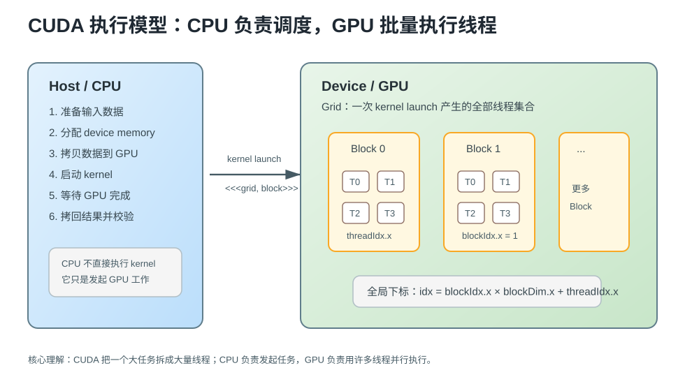
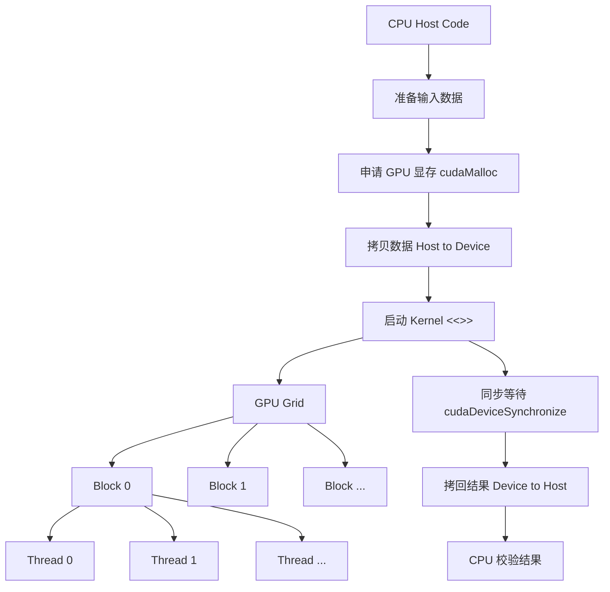
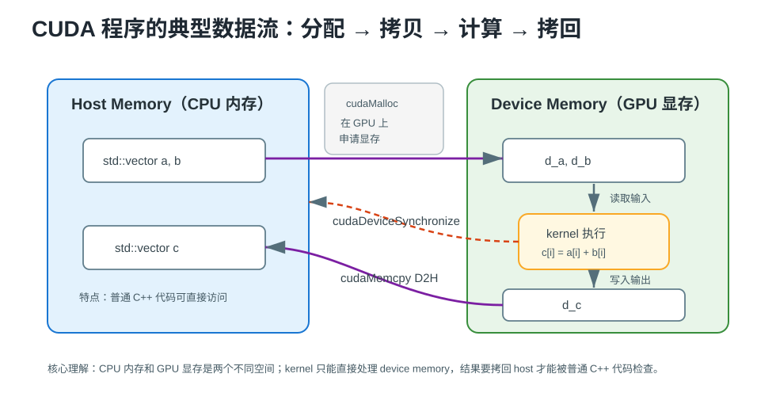

# CUDA 零基础系统入门

> CUDA 是 NVIDIA 提供的 GPU 通用计算平台：它让 C/C++ 程序可以把适合并行的大量重复计算交给 GPU 执行，从而获得比 CPU 更高的吞吐量。

---

## 0. 先建立直觉：CUDA 解决什么问题

如果你没有学过 CUDA，可以先把它理解成一种“把循环拆给很多 GPU 线程同时做”的编程方式。

普通 CPU 程序常见写法是：

```cpp
for (int i = 0; i < n; ++i) {
    c[i] = a[i] + b[i];
}
```

这段代码在语义上是一个循环，但每个 `i` 之间互不依赖。CUDA 的思路是：不要让一个 CPU 核心按顺序跑完所有 `i`，而是让 GPU 启动大量线程，每个线程负责一个或几个元素。

```text
CPU 串行思路：一个工人从第 0 个元素做到第 n-1 个元素
CUDA 并行思路：很多工人同时开工，每个工人处理自己的元素
```

> [!important] 第一性原理
> CUDA 适合“同一种操作作用在大量数据上”的任务，例如向量加法、矩阵乘法、图像处理、深度学习算子。它不适合大量分支复杂、数据规模很小、线程之间强依赖的任务。

---

## 1. CUDA 的基本概念

CUDA 程序同时涉及两类代码：

| 名称 | 运行位置 | 职责 |
|---|---|---|
| Host code | CPU | 准备数据、分配显存、启动 GPU kernel、取回结果 |
| Device code | GPU | 执行真正的大规模并行计算 |

GPU 上运行的函数叫 **kernel**。CPU 通过特殊语法启动 kernel：

```cpp
my_kernel<<<grid_size, block_size>>>(args...);
```

这里的 `<<<grid_size, block_size>>>` 不是普通 C++ 函数调用语法，而是 CUDA 扩展语法，表示“在 GPU 上启动多少线程”。

---

## 2. CUDA 执行模型：Grid / Block / Thread

CUDA 把一次 kernel 启动组织成三层：

```text
Grid
└── Block
    └── Thread
```

- **Thread**：最小执行单元，通常处理一个或几个数据元素。
- **Block**：一组 thread，同一个 block 内的线程可以协作。
- **Grid**：一次 kernel launch 产生的所有 block。



### 2.1 Mermaid 总览



### 2.2 线程如何知道自己负责哪个元素

CUDA kernel 里常见的第一行是计算全局线程编号：

```cpp
const int idx = blockIdx.x * blockDim.x + threadIdx.x;
```

**含义拆解**：

- `blockIdx.x`：当前 block 在 grid 中的编号。
- `blockDim.x`：每个 block 中有多少线程。
- `threadIdx.x`：当前线程在 block 内的编号。
- `idx`：当前线程对应的全局元素下标。

假设每个 block 有 256 个线程：

| blockIdx.x | threadIdx.x | idx |
|---|---:|---:|
| 0 | 0 | 0 |
| 0 | 1 | 1 |
| 0 | 255 | 255 |
| 1 | 0 | 256 |
| 1 | 1 | 257 |

这就是 CUDA 入门最重要的映射关系：**线程编号 → 数据下标**。

---

## 3. CUDA 内存模型：CPU 内存和 GPU 显存是两个空间

初学 CUDA 最容易犯的错误，是把 CPU 内存和 GPU 显存当成同一个东西。普通 `std::vector` 里的数据在 CPU 内存中，GPU kernel 不能直接把它当作 device memory 使用。



典型流程是：

1. CPU 创建输入数组。
2. 使用 `cudaMalloc` 在 GPU 显存中申请空间。
3. 使用 `cudaMemcpyHostToDevice` 把输入拷到 GPU。
4. 启动 kernel 在 GPU 上计算。
5. 使用 `cudaMemcpyDeviceToHost` 把结果拷回 CPU。
6. CPU 校验结果。

> [!warning] 常见误区
> `std::vector<float> a` 的 `a.data()` 是 host pointer，不是 device pointer。把 host pointer 直接传给 kernel，通常会导致非法内存访问或错误结果。

---

## 4. 最小例子：vector add

`vector add` 是 CUDA 的 Hello World。它做的事情非常简单：

```text
c[i] = a[i] + b[i]
```

它适合零基础入门，因为它同时覆盖了 kernel、线程编号、内存拷贝和同步。

### 4.1 Kernel：每个线程处理一个元素

```cpp
__global__ void vector_add_kernel(const float* a, const float* b, float* c, int n) {
    const int idx = blockIdx.x * blockDim.x + threadIdx.x;
    if (idx < n) {
        c[idx] = a[idx] + b[idx];
    }
}
```

**关键点**：

- `__global__` 表示这个函数从 CPU 侧启动、在 GPU 上执行。
- `a`、`b`、`c` 必须指向 GPU 显存。
- `idx < n` 是边界保护，因为启动的线程数通常会向上取整。
- 每个线程只处理一个元素，因此线程之间没有通信需求。

### 4.2 Host 侧启动 kernel

下面代码展示了最核心的启动逻辑，不包含完整错误处理和资源封装。

```cpp
constexpr int threads_per_block = 256;
const int blocks = (n + threads_per_block - 1) / threads_per_block;

vector_add_kernel<<<blocks, threads_per_block>>>(d_a, d_b, d_c, n);
cudaDeviceSynchronize();
```

**关键点**：

- `threads_per_block` 表示一个 block 内有多少线程。
- `blocks` 使用向上取整，确保所有元素都有线程覆盖。
- `<<<blocks, threads_per_block>>>` 启动的是 `blocks * threads_per_block` 个线程。
- `cudaDeviceSynchronize()` 等待 GPU 完成，否则 CPU 可能过早继续执行。

> [!tip] 怎么选 256？
> 入门阶段可以先用 128 或 256 作为 block size。真正优化时要结合 GPU 架构、寄存器使用、shared memory、occupancy 和 profiling 指标判断。

---

## 5. 一个 CUDA 程序完整走一遍

### 5.1 数据准备

CPU 侧依然可以使用普通 Modern C++ 容器。这里的 `std::vector` 只负责 host memory，相关基础可以回看 [[14.1 vector]]。

```cpp
std::vector<float> a(n, 1.0f);
std::vector<float> b(n, 2.0f);
std::vector<float> c(n, 0.0f);
```

**说明**：

- `a` 和 `b` 是输入。
- `c` 是 CPU 侧接收结果的输出数组。
- 这些数据现在还没有进入 GPU。

### 5.2 申请显存并拷贝输入

```cpp
float* d_a = nullptr;
float* d_b = nullptr;
float* d_c = nullptr;

cudaMalloc(&d_a, n * sizeof(float));
cudaMalloc(&d_b, n * sizeof(float));
cudaMalloc(&d_c, n * sizeof(float));

cudaMemcpy(d_a, a.data(), n * sizeof(float), cudaMemcpyHostToDevice);
cudaMemcpy(d_b, b.data(), n * sizeof(float), cudaMemcpyHostToDevice);
```

**说明**：

- `d_a`、`d_b`、`d_c` 是 device pointer，只能给 GPU kernel 使用。
- `cudaMemcpyHostToDevice` 表示从 CPU 内存拷贝到 GPU 显存。
- 入门代码可以先这样写，但工程代码应使用 RAII 封装资源，避免忘记释放；RAII 思想可以回看 [[独享智能指针]]。

### 5.3 启动 kernel 并取回结果

```cpp
vector_add_kernel<<<blocks, threads_per_block>>>(d_a, d_b, d_c, n);
cudaDeviceSynchronize();

cudaMemcpy(c.data(), d_c, n * sizeof(float), cudaMemcpyDeviceToHost);
```

**说明**：

- kernel 执行时，GPU 读取 `d_a`、`d_b`，写入 `d_c`。
- `cudaDeviceSynchronize()` 是一个完成点，确保 kernel 已经结束。
- `cudaMemcpyDeviceToHost` 把结果从 GPU 拷回 `std::vector c`。

### 5.4 释放显存

```cpp
cudaFree(d_c);
cudaFree(d_b);
cudaFree(d_a);
```

**说明**：

- `cudaMalloc` 和 `cudaFree` 必须配对。
- 如果中途出错，手动释放很容易遗漏，所以后续应学习 RAII 封装 device memory。
- CUDA Runtime API 是 C 风格接口，C++ 工程中通常要在边界处做一层安全封装。

---

## 6. CUDA 程序的编译：为什么 `.cu` 不等于普通 `.cpp`

CUDA 源文件通常使用 `.cu` 后缀。它里面可能同时包含：

- CPU 侧 host code。
- GPU 侧 device code。
- kernel launch 语法。

因此它不能完全按普通 C++ 文件处理，需要 CUDA 编译器参与。编译和链接的基础可以回看 [[1.1 程序编译与链接原理]]。

### 6.1 CMake 中启用 CUDA

```cmake
cmake_minimum_required(VERSION 3.24)
project(cuda_intro LANGUAGES CXX CUDA)

set(CMAKE_CXX_STANDARD 20)
set(CMAKE_CUDA_STANDARD 17)

add_executable(vector_add main.cu)
```

**关键点**：

- `LANGUAGES CXX CUDA` 表示项目同时使用 C++ 和 CUDA。
- `main.cu` 会交给 CUDA 编译链处理。
- 更完整的项目模板可以参考 [[Week 1 - CUDA + Agent workflow]]，CMake 基础可以回看 [[14.3 CMake基础]]。

---

## 7. CUDA 的性能直觉

CUDA 性能优化不是“线程越多越快”。入门阶段先建立三条直觉。

### 7.1 数据搬运可能比计算更贵

如果只做一次简单加法：

```text
从 CPU 拷到 GPU → GPU 加法 → 从 GPU 拷回 CPU
```

真正耗时可能主要在数据拷贝，而不是加法本身。因此 CUDA 更适合：

- 数据量很大；
- 同一批数据会在 GPU 上连续做很多计算；
- 计算密度足够高；
- 最终只需要把少量结果拷回 CPU。

### 7.2 GPU 喜欢规则访问

GPU 线程通常按连续编号成组执行。如果线程 0 访问 `a[0]`，线程 1 访问 `a[1]`，线程 2 访问 `a[2]`，这种访问更容易合并成高效内存事务。

```text
好：thread i 访问 a[i]
差：thread i 随机访问 a[random[i]]
```

这就是后续要学习的 **memory coalescing**。

### 7.3 性能结论必须靠 benchmark 和 profiler

CUDA 入门阶段可以用 CUDA event 计时：

```cpp
cudaEvent_t start = nullptr;
cudaEvent_t stop = nullptr;

cudaEventCreate(&start);
cudaEventCreate(&stop);

cudaEventRecord(start);
vector_add_kernel<<<blocks, threads_per_block>>>(d_a, d_b, d_c, n);
cudaEventRecord(stop);
cudaEventSynchronize(stop);

float elapsed_ms = 0.0f;
cudaEventElapsedTime(&elapsed_ms, start, stop);
```

**关键点**：

- CUDA event 记录的是 GPU 时间线上的时间。
- benchmark 要先 warm-up，再重复运行多次。
- 只看一次运行时间没有意义，必须同时检查正确性。
- 后续性能分析要学习 Nsight Compute / Nsight Systems。

---

## 8. CUDA 学习路线图


建议不要跳着学。CUDA 很多高级优化都依赖最基础的线程编号、内存拷贝和同步概念。

---

## 9. CUDA 与普通 C++ 的关系

| 角度 | 普通 C++ | CUDA C++ |
|---|---|---|
| 主要运行位置 | CPU | CPU + GPU |
| 源文件 | `.cpp` | `.cu` |
| 函数调用 | 普通函数调用 | kernel launch `<<<...>>>` |
| 内存 | 进程虚拟地址空间为主 | host memory + device memory |
| 并行方式 | thread / async / SIMD | grid / block / thread / warp |
| 调试重点 | 逻辑、生命周期、并发 | 内存拷贝、同步、越界、性能指标 |

CUDA 并不是替代 C++，而是在 C++ 旁边增加 GPU 编程模型。host 侧仍然应该遵循 Modern C++ 风格：资源管理用 RAII，容器优先用 STL，构建流程保持清晰。

---

## 10. 常见错误

> [!warning] 错误 1：忘记边界判断

```cpp
__global__ void bad_kernel(float* c, int n) {
    const int idx = blockIdx.x * blockDim.x + threadIdx.x;
    c[idx] = 0.0f;
}
```

如果启动线程数大于 `n`，这段代码会越界写入。

```cpp
__global__ void good_kernel(float* c, int n) {
    const int idx = blockIdx.x * blockDim.x + threadIdx.x;
    if (idx < n) {
        c[idx] = 0.0f;
    }
}
```

**为什么正确**：最后一个 block 往往不是满的，`idx < n` 可以保护数组边界。

> [!warning] 错误 2：没有检查 kernel launch 错误

```cpp
vector_add_kernel<<<blocks, threads_per_block>>>(d_a, d_b, d_c, n);
cudaDeviceSynchronize();
```

更好的写法是在 launch 后检查错误：

```cpp
vector_add_kernel<<<blocks, threads_per_block>>>(d_a, d_b, d_c, n);
cudaGetLastError();
cudaDeviceSynchronize();
```

实际工程中不要丢弃返回值，应封装成 `check_cuda(cudaGetLastError())`。

> [!warning] 错误 3：把 benchmark 当成 correctness test

性能测试必须保留正确性校验。否则 kernel 写错了，可能反而更快。

---

## 11. 学习检查清单

学完这篇后，至少应该能解释：

- [ ] CUDA 为什么适合大规模并行计算。
- [ ] host code 和 device code 的区别。
- [ ] `__global__` kernel 是什么。
- [ ] `<<<grid, block>>>` 表示什么。
- [ ] `blockIdx.x * blockDim.x + threadIdx.x` 为什么能算出全局下标。
- [ ] `cudaMalloc`、`cudaMemcpy`、`cudaFree` 分别做什么。
- [ ] 为什么 kernel launch 后通常需要同步或错误检查。
- [ ] 为什么 benchmark 要 warm-up、重复运行、保留正确性检查。

---

## 12. 关键要点总结

1. CUDA 的核心是把大量独立或弱依赖的计算拆给 GPU 线程并行执行。
2. CPU 负责调度和数据准备，GPU 负责高吞吐计算。
3. `Grid → Block → Thread` 是理解 CUDA kernel 的第一张地图。
4. CPU 内存和 GPU 显存不是一回事，数据需要显式拷贝。
5. 入门项目从 `vector add` 开始最合适，因为它覆盖了 CUDA 的完整基本流程。
6. 性能结论必须通过 benchmark 和 profiler 验证，不能凭感觉判断。

---

## 关联知识

- [[CUDA 学习清单]] - CUDA 后续学习任务、必做 kernel 和专题索引
- [[Week 1 - CUDA + Agent workflow]] - 第一周 CUDA 项目模板、vector add 和 benchmark 闭环
- [[AI Agent Native AI Infra GPU Performance Engineer 培养方案]] - CUDA 在整体培养路线中的位置
- [[14.3 CMake基础]] - CUDA 项目的 CMake 构建基础
- [[14.1 vector]] - host 侧输入输出容器基础
- [[独享智能指针]] - 理解 RAII 资源管理思想
- [[1.1 程序编译与链接原理]] - 理解 `.cu` 编译和链接的前置知识

---

## 参考

- NVIDIA CUDA C++ Programming Guide
- NVIDIA CUDA C++ Best Practices Guide
- NVIDIA Nsight Compute Documentation
