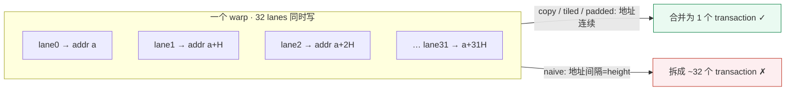
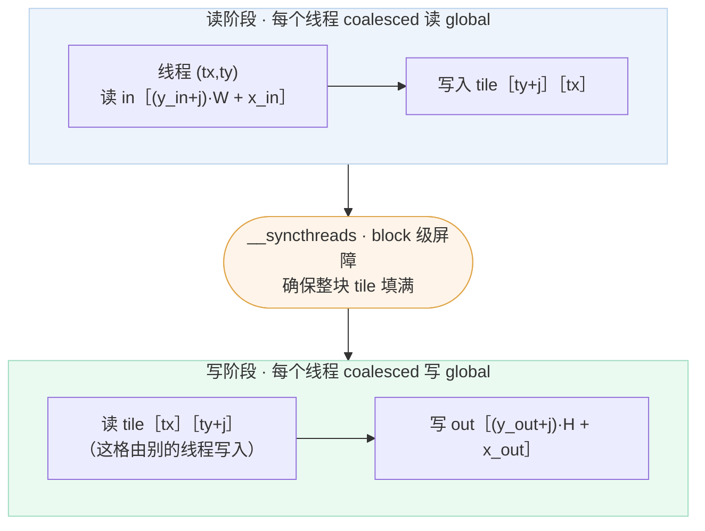
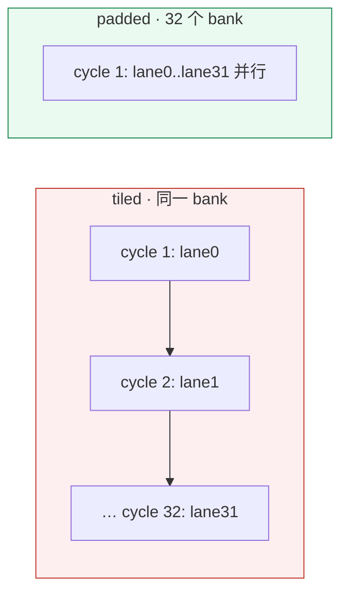
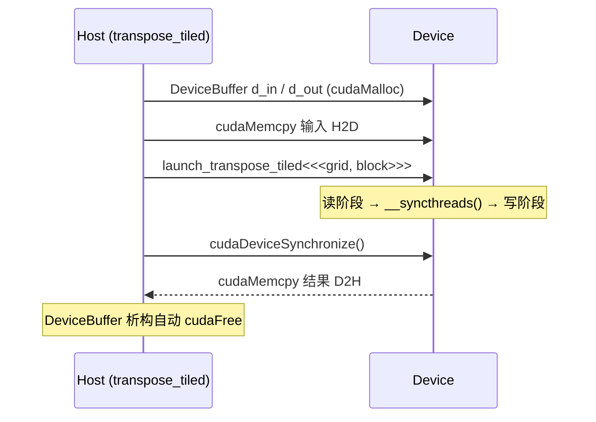

# CUDA Week 3 Transpose 项目解析

> 这个项目是 `CUDA_learning/week03/Transpose`：用矩阵转置这一个最朴素的操作，把 **memory coalescing → shared memory tile → bank conflict → padding** 这条 CUDA 访存优化主线完整走一遍。四个 kernel（copy / naive / tiled / padded）共享同一套 launch 配置和测试基建，只改访存方式，从而把"性能差距全部来自访存模式"这件事隔离出来。

项目地址：[CUDA_learning/week03/Transpose](https://github.com/hosendovebelva-boop/CUDA_learning/tree/main/week03/Transpose)

阶段计划：[[Week 3 - Transpose + Memory Coalescing]]
配套文件：[[9.培养方案/04.项目分析/Week03/exercises|渐进式练习]] · [[9.培养方案/04.项目分析/Week03/profiling|profiling 方法论]] · [[9.培养方案/04.项目分析/Week03/questions|必答题]]

---

## 1. 项目定位

Week 2 的 reduction 解决的是"多线程协作产生一个标量"的问题，瓶颈在 **block 内协作与同步**。Week 3 的 transpose 把焦点移到更基础、却更容易被忽视的一层：**访存地址模式**。

转置在数学上只有一行：

```cpp
out[col * height + row] = in[row * width + col];
```

没有任何算术运算、每个元素只读一次写一次，所以它是**彻底的 memory-bound** 问题。正因为计算被剥得干干净净，它成为观察"访存模式如何决定性能"的最佳实验台：

- 读连续、写可能跨步；
- shared memory 可以把跨步的 global 访问"重排"成连续；
- 但 shared memory 自己又有 bank conflict；
- padding 能在几乎零成本下消除 bank conflict。

这条主线往后直接连到 Week 4 的 MatMul —— tiled MatMul 用的就是同一套 shared memory tiling 思路。

衔接关系：[[CUDA Week 2 Parallel Reduction 项目解析]] → 本篇 → [[CUDA Week 4 MatMul v0 项目解析]]。

---

## 2. 项目架构总览

整个工程是**一个静态库 + 多个消费者**的极简结构：四个 kernel 编译进 `transpose_lib`，四个正确性测试和一个 benchmark 都链接同一个库；`Makefile` 只是 CMake 的便捷包装。

![[图片/9.培养方案/04.项目分析/CUDA Week 3 Transpose 项目解析-01.svg|880]]

目录职责：

| 路径 | 作用 |
|---|---|
| `include/` | 与具体 kernel 无关的公共设施：错误检查、显存 RAII、测试工具 |
| `src/*.cu` | 四个 transpose 实现 + 各自 `.cuh` 声明，编进 `transpose_lib` |
| `tests/` | 每个版本一个可执行，逐元素对比 CPU 参考 |
| `benchmarks/` | 统一 benchmark，输出带宽并附正确性 |
| `docs/profiling.md` | Nsight 结果模板（待填） |

`CMakeLists.txt` 用一个 `foreach` 批量生成四个测试目标，体现"所有版本同一套 API"的设计：

```cmake
add_library(transpose_lib
    src/transpose_copy.cu  src/transpose_naive.cu
    src/transpose_tiled.cu src/transpose_padded.cu)
target_include_directories(transpose_lib PUBLIC include src)

foreach(variant copy naive tiled padded)
    add_executable(test_transpose_${variant} tests/test_transpose_${variant}.cu)
    target_link_libraries(test_transpose_${variant} PRIVATE transpose_lib)
endforeach()
```

构建与运行：

```bash
cmake -S . -B build && cmake --build build   # 或 make
make test     # 四个版本全部正确性测试
make bench    # 带宽对比
make profile-tiled   # 单独 Nsight profiling
```

建议阅读顺序：`cuda_check.cuh → device_buffer.cuh → copy → naive → tiled → padded`。

---

## 3. 核心概念铺垫

读后面代码前，先把四个底层概念钉死，否则只会看到索引、看不到"为什么"。

- **Warp**：GPU 调度的最小单位 = 32 个线程，锁步执行同一条指令。访存性能几乎都以 warp 为单位衡量。
- **Memory coalescing（访存合并）**：当一个 warp 的 32 个线程访问的 global 地址落在同一段连续区间（如一个 128B 段）时，硬件把它们合并成**极少数** memory transaction；若地址分散，则退化成多达 32 个 transaction，有效带宽成倍下降。
- **Memory transaction**：global memory 以 32B / 128B 为粒度搬运。决定性能的不是"读了多少有用字节"，而是"发起了多少个 transaction、其中多少字节被浪费"。
- **Shared memory banks**：shared memory 被切成 **32 个 bank**，每 4 字节落到下一个 bank（`bank = (地址/4) % 32`）。同一 warp 内若多个 lane 访问**同一 bank 的不同地址**，这些访问会被**串行化**，即 bank conflict。

一句话串起来：**global memory 怕"地址分散"（coalescing），shared memory 怕"撞同一个 bank"（bank conflict）**。transpose 把这两个坑依次踩一遍。

---

## 4. 公共基础设施

三个头文件与 kernel 无关，但决定了工程"可测、可读、不泄漏"。

### 4.1 CUDA_CHECK：让错误就地爆炸

CUDA Runtime 是 C 风格、靠返回值报错。不检查的话，错误会延迟到很久之后才暴露，定位成本极高。`cuda_check.cuh` 用一个宏把"表达式 + 文件 + 行号"打包抛异常：

```cpp
inline void check_cuda(cudaError_t status, const char* expr, const char* file, int line) {
    if (status == cudaSuccess) return;
    throw std::runtime_error(std::string("CUDA error: ") + cudaGetErrorString(status) +
        "\n  expression: " + expr + "\n  location: " + file + ":" + std::to_string(line));
}
#define CUDA_CHECK(expr) check_cuda((expr), #expr, __FILE__, __LINE__)
```

`#expr` 把表达式原文转成字符串，`__FILE__/__LINE__` 定位现场。每一次 Runtime 调用都套 `CUDA_CHECK`。

### 4.2 DeviceBuffer：显存的 RAII

裸 `cudaMalloc/cudaFree` 一旦中途抛异常就会泄漏。`DeviceBuffer` 用 RAII 把生命周期绑死，并遵循"**禁拷贝、允移动**"：

```cpp
template <typename T>
class DeviceBuffer {
    explicit DeviceBuffer(std::size_t count) : count_(count) {
        if (count_ > 0) CUDA_CHECK(cudaMalloc(reinterpret_cast<void**>(&ptr_), count_ * sizeof(T)));
    }
    ~DeviceBuffer() { if (ptr_) cudaFree(ptr_); }
    DeviceBuffer(const DeviceBuffer&) = delete;            // 禁拷贝：避免双重 free
    DeviceBuffer(DeviceBuffer&& o) noexcept { /* 接管指针，置空源 */ }
    T* get();  std::size_t bytes() const;
};
```

> [!note] 为什么禁拷贝
> 显存指针是独占资源，拷贝会让两个对象指向同一块显存，析构时 double free。移动语义"接管 + 置空"才是正确的所有权转移。

### 4.3 test_utils：固定种子 + CPU 参考 + 逐元素比对

```cpp
std::vector<float> generate_matrix(int w, int h);            // mt19937(42) 固定种子，可复现
void cpu_transpose(const float* in, float* out, int w, int h); // 黄金参考
bool check_matrix(const float* gpu, const float* cpu, std::size_t n, const char* name); // 1e-5 容差
```

固定种子保证每次输入一致；CPU 转置作为"黄金参考"；`check_matrix` 用 `1e-5` 容差逐元素比对（float 累加无差异，主要防索引写错）。

---

## 5. 版本一：copy baseline

copy kernel **不转置**，只把输入原样搬到输出。它的意义是给出"在当前 block 配置下，纯搬运能达到的带宽上界"——后面所有转置版本都和它对比。

```cpp
static constexpr int TILE_DIM = 32;   // tile 边长 = warp size
static constexpr int BLOCK_ROWS = 8;  // block y 方向线程数

__global__ void copy_kernel(const float* in, float* out, int width, int height) {
    int x = blockIdx.x * TILE_DIM + threadIdx.x;
    int y = blockIdx.y * TILE_DIM + threadIdx.y;
    for (int j = 0; j < TILE_DIM; j += BLOCK_ROWS) {
        if (x < width && (y + j) < height)
            out[(y + j) * width + x] = in[(y + j) * width + x];
    }
}
```

两个关键设计，**四个版本完全一致**，务必记牢：

- **block = (32, 8) = 256 线程**，但 tile 是 32×32。所以每个线程沿 y 方向跳 `BLOCK_ROWS=8`、循环 `TILE_DIM/BLOCK_ROWS = 4` 次，**一个线程处理 4 个元素**。用 256 线程覆盖 1024 个元素，是为了控制每 block 线程数、提升 occupancy。
- `threadIdx.x` 落在**列**方向。相邻 `threadIdx.x` → 相邻列 → `in[(y+j)*width + x]` 地址连续 → 读写都 coalesced。这就是 copy 是带宽上界的原因。

边界判断 `x < width && (y+j) < height` 必不可少：矩阵尺寸不是 32 整数倍时，边缘 tile 的部分线程会越界。

---

## 6. 版本二：naive transpose

naive 直接在 global memory 上转置，一个元素一次搬运：

```cpp
__global__ void transpose_naive_kernel(const float* in, float* out, int width, int height) {
    int x = blockIdx.x * TILE_DIM + threadIdx.x;
    int y = blockIdx.y * TILE_DIM + threadIdx.y;
    for (int j = 0; j < TILE_DIM; j += BLOCK_ROWS) {
        if (x < width && (y + j) < height)
            out[x * height + (y + j)] = in[(y + j) * width + x];   // 读连续，写跨步
    }
}
```

把读写地址摊开看：

- **读** `in[(y+j)*width + x]`：相邻 `threadIdx.x`（即相邻 `x`）→ 地址 +1 → **连续 → coalesced ✓**
- **写** `out[x*height + (y+j)]`：相邻 `threadIdx.x` → `x` 变化 → 地址跨 `height` → **间隔 = height → uncoalesced ✗**

一个 warp 的 32 个 lane 写到 32 个相距 `height` 的地址，几乎每个 lane 都要单独一个 transaction：

![[图片/9.培养方案/04.项目分析/CUDA Week 3 Transpose 项目解析-02.svg|900]]

用 warp 视角看这次"写"的代价：



结论：naive 把**一半访存**（写）做成了最坏情况，因此带宽相对 copy 大幅下滑。这正是 Day 2 必须记录的现象——读 coalesced、写 uncoalesced、和 baseline 的差距有多大。

---

## 7. 版本三：shared memory tiled transpose

核心思路：**不在 global memory 里转置，而是借 shared memory 转置**。让 global 的读和写都保持连续，把"跨步"这件事关进片上的 shared memory。

```cpp
__global__ void transpose_tiled_kernel(const float* in, float* out, int width, int height) {
    __shared__ float tile[TILE_DIM][TILE_DIM];

    // 读阶段：global → shared，连续读
    int x_in = blockIdx.x * TILE_DIM + threadIdx.x;
    int y_in = blockIdx.y * TILE_DIM + threadIdx.y;
    for (int j = 0; j < TILE_DIM; j += BLOCK_ROWS)
        if (x_in < width && (y_in + j) < height)
            tile[threadIdx.y + j][threadIdx.x] = in[(y_in + j) * width + x_in];

    __syncthreads();

    // 写阶段：shared → global，连续写（注意 blockIdx 交换）
    int x_out = blockIdx.y * TILE_DIM + threadIdx.x;
    int y_out = blockIdx.x * TILE_DIM + threadIdx.y;
    for (int j = 0; j < TILE_DIM; j += BLOCK_ROWS)
        if (x_out < height && (y_out + j) < width)
            out[(y_out + j) * height + x_out] = tile[threadIdx.x][threadIdx.y + j];
}
```

三个要点：

1. **shared memory 是"访存模式转换器"**。读阶段 `tile[ty+j][tx] = in[...]`：`threadIdx.x` 走连续地址 → coalesced 读。写阶段 `out[...] = tile[tx][ty+j]`：`threadIdx.x` 又走在输出的连续地址上 → coalesced 写。转置发生在 shared 内部：**写进去是 `tile[ty][tx]`，读出来是 `tile[tx][ty]`**。
2. **blockIdx 在写阶段交换**：输入 tile `(bx,by)` 映射到输出 tile `(by,bx)`。
3. **`__syncthreads()` 不可省**：写阶段一个线程要读的 `tile[tx][...]`，是**别的线程**在读阶段写进去的。必须等全 block 读阶段完成才能开始写。

tile ↔ block 的映射关系：

![[图片/9.培养方案/04.项目分析/CUDA Week 3 Transpose 项目解析-04.svg|900]]

这里发生的本质是**线程间通讯**：shared memory 充当媒介，"我读出来的格子是你写进去的"。两阶段的数据流和同步点：



到这里 global memory 的读写都 coalesced 了，但**新问题出现在 shared memory 内部**——见下一节。

---

## 8. Bank conflict 深入

写阶段读取 `tile[threadIdx.x][threadIdx.y + j]`。盯住一个 warp：`threadIdx.y` 固定、`threadIdx.x = 0..31`。于是这 32 个 lane 访问的是 **同一列、不同行**：`tile[0][c], tile[1][c], …, tile[31][c]`。

在 `tile[32][32]` 里，行距 `stride = 32`，地址 `addr = row*32 + c`，于是：

```text
bank = (row*32 + c) % 32 = c        ← 与 row 无关！
```

**32 个 lane 全部命中同一个 bank c → 32-way bank conflict**，硬件把这一次 shared load 串行化成 32 次。

![[图片/9.培养方案/04.项目分析/CUDA Week 3 Transpose 项目解析-03.svg|920]]

串行化的代价用时间轴看最直观：



> [!warning] 误以为 shared memory 一定更快
> tiled 已经把 global 读写都修成 coalesced，却又在 shared memory 里引入了 32-way conflict。shared memory 是工具不是保证——错误的 tile 布局会把好不容易省下的带宽重新吐回去。

---

## 9. 版本四：padded transpose

padded 和 tiled **逻辑完全相同**，唯一改动是 shared memory 的声明多一列：

```cpp
__shared__ float tile[TILE_DIM][TILE_DIM + 1];   // +1 padding，其余代码一字不变
```

效果：行距从 32 变成 33。

```text
addr = row*33 + c
bank = (row*33 + c) % 32 = (row + c) % 32      ← 33 % 32 = 1
```

当 `threadIdx.x = row` 从 0 走到 31 时，`bank = (row + c) % 32` 取遍 32 个不同值 → **32 个 lane 命中 32 个不同 bank → 无 conflict**（见 -03 右半部分）。

代价：每个 block 多 `32 个 float = 128 字节` shared memory，对几十 KB 的预算来说几乎免费，却把写阶段的 shared load 从 32 次串行降回 1 次并行。这就是"padding 一行换零冲突"的经典手法。

---

## 10. 四版本横向对比

| 版本 | Global Read | Global Write | Shared Memory | Bank Conflict | 预期带宽 |
|---|---|---|---|---|---|
| copy | coalesced | coalesced | 不用 | 无 | 上界（baseline） |
| naive | coalesced | **uncoalesced** | 不用 | 无 | 最低 |
| tiled | coalesced | coalesced | 用 | **32-way** | 中高（被 conflict 拖累） |
| padded | coalesced | coalesced | 用 | **无** | 最高（接近 copy） |

预期性能排序：**copy ≳ padded > tiled ≫ naive**。

推理链：naive 因 uncoalesced 写而垫底；tiled 修好 global 访存、但 shared 端 32-way conflict 吃掉一部分收益；padded 同时摆平 global coalescing 和 shared bank conflict，最接近纯搬运的 copy 上界。

> [!note] 这是定性预测，不是实测
> 仓库 `docs/profiling.md` 目前是空模板。真实数字需在你的 GPU 上 `make bench` / Nsight 实测后回填，见 [[9.培养方案/04.项目分析/Week03/profiling|profiling]]。

---

## 11. benchmark 与 profiling 方法

`bench_transpose.cu` 用 CUDA event 计时，统一对四个版本测有效带宽。

**有效带宽**：转置完整读一遍、写一遍，所以

```cpp
double bytes = 2.0 * width * height * sizeof(float);   // 读 + 写
float bw = bytes / (avg_ms * 1e-3) / 1e9;              // GB/s
```

**计时骨架**（warmup 5 次摊掉冷启动，repeat 20 次取均值/极值）：

```cpp
for (int i = 0; i < warmup; ++i) launch(d_in, d_out, width, height);
CUDA_CHECK(cudaDeviceSynchronize());
for (int i = 0; i < repeat; ++i) {
    cudaEventRecord(start); launch(...); cudaEventRecord(stop);
    cudaEventSynchronize(stop); cudaEventElapsedTime(&ms, start, stop);
}
```

**每次都校验正确性**：benchmark 把 GPU 输出和 CPU 参考逐元素比，输出列里带 `Check = OK/FAIL`——符合仓库 CLAUDE.md"benchmark 必须包含正确性状态、不许为了好看跳过校验"。测试形状覆盖方阵 / 大规模 / 非方阵 / 非 tile 对齐：`1024² · 4096² · 2048×3072 · 1000²`。

**Nsight 该看什么**（对应每个版本的预期）：

| 指标 | 关注点 |
|---|---|
| global load/store throughput & efficiency | naive 的 store efficiency 应显著偏低 |
| shared memory bank conflicts | tiled 有大量 conflict，padded 应趋近 0 |
| achieved occupancy | 四版本应接近，排除"占用率差异"这个混淆变量 |
| warp stall reason | naive 偏 Long Scoreboard（等 global），tiled 偏 shared 相关 stall |

---

## 12. host ↔ device 调用流程

四个 `transpose_*(std::vector)` 主机函数结构一致：分配显存 → 拷入 → launch → 同步 → 拷回。以 tiled 为例：



其中 grid/block 由尺寸推导，所有版本一致：

```cpp
dim3 block(TILE_DIM, BLOCK_ROWS);                                  // (32, 8)
dim3 grid((width + TILE_DIM - 1) / TILE_DIM,
          (height + TILE_DIM - 1) / TILE_DIM);                     // 向上取整覆盖边缘
```

---

## 13. 常见坑

> [!warning] 只测方阵
> 方阵会把"行列映射写反"也算对。必须测非方阵（如 2048×3072）和它的转置形状，才能暴露 `width/height` 用错的 bug。

> [!warning] 忘记边界检查
> 尺寸非 32 整数倍时（如 1000、33×65），边缘 tile 的部分线程越界。读写都要 `if (x < width && (y+j) < height)` 守卫。

> [!warning] 以为 shared memory 总是更快
> tiled 修好 global 访存却引入 bank conflict。shared memory 的收益要靠正确的 tile 布局（padding）兑现，否则可能不如预期。

---

## 14. 面试要点

- **memory coalescing 为什么重要？** warp 内 32 线程同时访存，地址连续可合并成少量 transaction，分散则 transaction 数暴涨。
- **naive transpose 的问题？** 读 coalesced，写 uncoalesced（相邻线程写地址间隔 height）。
- **shared memory 凭什么帮上忙？** 它是访存模式转换器：先 coalesced 读入，再用转置后的索引 coalesced 写回。
- **bank conflict 是什么？** shared memory 32 个 bank，同 warp 多线程撞同一 bank 的不同地址 → 串行化。
- **padding 为什么有效？** 行距 32→33，`33%32=1`，同列元素逐行错开一个 bank。
- **transpose 是 memory-bound 还是 compute-bound？** memory-bound，只有读写没有算术。

完整问答见 [[9.培养方案/04.项目分析/Week03/questions|questions]]。

---

## 15. 关联知识

- [[Week 3 - Transpose + Memory Coalescing]] —— 本项目的阶段计划
- [[3.7 CUDA Week 3 前置知识 - Transpose + Memory Coalescing|CUDA Week 3 前置知识]]
- [[3.4 CUDA Nsight Compute 指标速查|CUDA Nsight Compute 指标速查]]
- [[CUDA Week 2 Parallel Reduction 项目解析]] —— 上一周：block 内协作与同步
- [[CUDA Week 4 MatMul v0 项目解析]] —— 下一周：tiled MatMul 复用同一套 shared memory tiling
- 本目录：[[9.培养方案/04.项目分析/Week03/exercises|exercises]] · [[9.培养方案/04.项目分析/Week03/profiling|profiling]] · [[9.培养方案/04.项目分析/Week03/questions|questions]]
