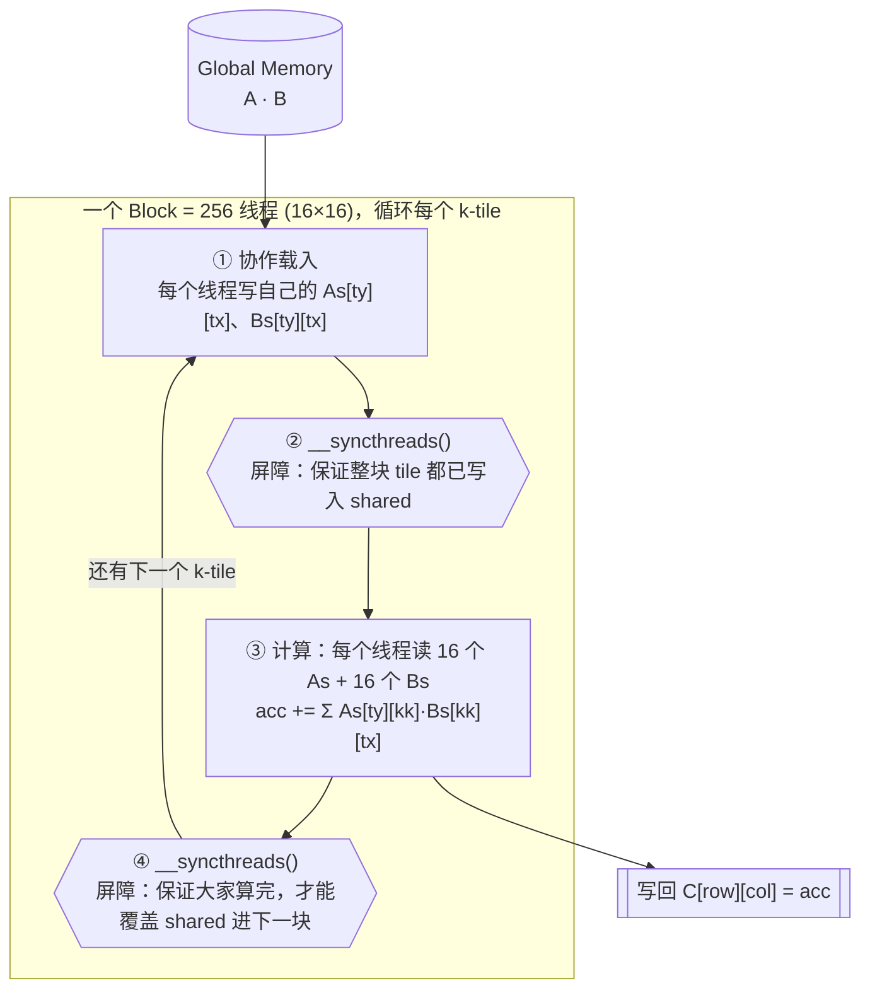
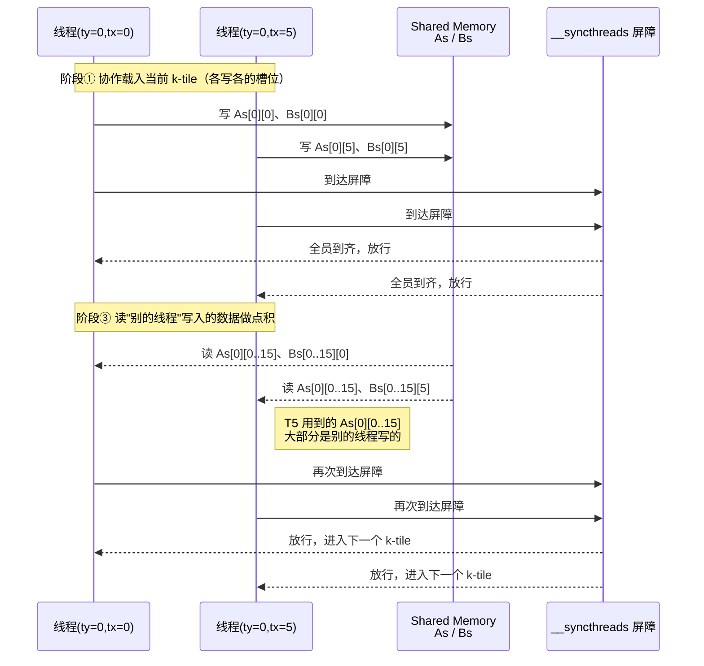
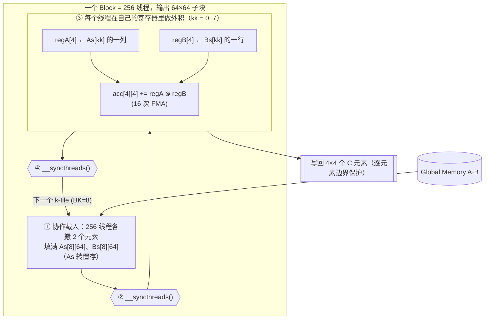

# CUDA Week 4 MatMul v0 项目解析

> 这个项目是 `CUDA_learning/week04/MatMul` 的 Week 4 工程：用 `C[M,N] = A[M,K]·B[K,N]`（row-major, FP32）搭一套**性能分析框架**，从 naive 一路走到 shared memory tiling、register blocking，再用 cuBLAS 做 baseline。重点不是打赢 cuBLAS，而是**能用 Nsight 指标和 roofline 解释每个版本为什么快或慢**。

项目地址：[CUDA_learning/week04/MatMul](https://github.com/hosendovebelva-boop/CUDA_learning/tree/main/week04/MatMul)

配套阶段计划：[[Week 4 - MatMul v0]]

---

## 1. 项目定位

前三周的 kernel 各训练一种能力，到 matmul 是第一次把它们**合并考察**：

| 周次 | Kernel | 算术强度 | 训练点 | 瓶颈归属 |
|---|---|---|---|---|
| Week 1 | vector add | O(1) | 最容易并行：`c[i]=a[i]+b[i]`，无数据依赖 | 永远 memory-bound |
| Week 2 | reduction | O(1) | 线程协作、`__syncthreads`、warp shuffle | memory-bound |
| Week 3 | transpose | O(1) | 访存模式、coalescing、bank conflict | memory-bound |
| **Week 4** | **matmul** | **O(N)** | **tiling + shared memory + register reuse + 库 baseline** | **可被优化到 compute-bound** |

matmul 之所以是 infra 的关键算子，是因为它的算术强度是 O(N)：搬 O(N²) 的数据却要做 O(N³) 的计算。这意味着**只要把访存压下来，计算就能成为主导**，kernel 可以从 memory-bound 走到 compute-bound，逼近 FP32 峰值。vector add / transpose 永远做不到这一点。这也是 GEMM 成为深度学习与 LLM 推理核心算子的根本原因。

本周的目标不是写工业级 GEMM，而是**建立正确的性能分析框架**：每个版本都要能用「数据复用 → 算术强度 → 瓶颈层级」这条线索解释清楚。

---

## 2. 目录结构与整体架构

```text
week04/MatMul/
├── include/                  # 复用基础设施（header-only）
│   ├── cuda_check.cuh        #   CUDA_CHECK 宏：每次 Runtime API 调用都检查
│   ├── device_buffer.cuh     #   DeviceBuffer<T>：显存 RAII（禁拷贝、可移动）
│   └── test_utils.cuh        #   随机矩阵、CPU 参考、相对误差校验
├── src/                      # 四个版本的 kernel + host 封装
│   ├── matmul_naive.cu/.cuh      # v0：每线程一个 C 元素，无复用
│   ├── matmul_tiled.cu/.cuh      # v1：shared memory tile，数据复用
│   ├── matmul_register.cu/.cuh   # v2：tiling + 4×4 register blocking
│   └── matmul_cublas.cu/.cuh     # v3：cuBLAS SGEMM baseline
├── tests/                    # 四个版本各一个正确性测试（对拍 CPU 参考）
│   └── test_matmul_*.cu
├── benchmarks/
│   └── bench_matmul.cu       # 统一 benchmark：多 shape、TFLOPS、profile 钩子
├── docs/
│   ├── benchmark.md          # 实测 TFLOPS 表
│   ├── profiling.md          # Nsight Compute 指标与瓶颈判断
│   ├── triton_intro.md       # Triton 入门（program id / mask / BLOCK_SIZE）
│   └── rmsnorm_kickoff.md    # 下周 RMSNorm 起步任务
├── CMakeLists.txt
└── Makefile                  # make / make test / make bench / make profile-*
```

整个工程是一个**正交分层**结构：四个版本共享同一套基础设施和同一组 host 封装签名，只在 `__global__` kernel 这一层不同。这样 benchmark 才能用一个 `LaunchFunc` 把四者塞进同一张表对比。

![[图片/SVG/Week 4 - MatMul v0 项目解析-01.svg|900]]

> 架构看点：每一列（naive/tiled/register/cuBLAS）都走同一条调用栈 `matmul_X() → launch_X() → __global__ kernel`，host 封装做的事完全一样（H2D 拷贝 → 启动 → D2H 拷回）；唯一变量是最底下那块红色 kernel。基础设施（紫色）被四列共享，这让"版本对比"成为一个干净的受控实验。

---

## 3. 基础设施层：把"正确"和"安全"先固定下来

优化的前提是**正确性可验证、资源不泄漏、错误能立刻暴露**。三个头文件就是干这个的。

### 3.1 `cuda_check.cuh` —— 让错误在第一现场抛出

CUDA Runtime API 是 C 风格接口，出错只返回 `cudaError_t`。不检查的话，错误会在很久之后才以"莫名其妙的结果"暴露，定位成本极高。

```cpp
inline void check_cuda(cudaError_t status, const char* expression, const char* file, int line) {
    if (status == cudaSuccess) return;
    throw std::runtime_error(
        std::string("CUDA error: ") + cudaGetErrorString(status) +
        "\n  expression: " + expression +
        "\n  location: " + file + ":" + std::to_string(line));
}
#define CUDA_CHECK(expr) check_cuda((expr), #expr, __FILE__, __LINE__)
```

关键点：宏里的 `#expr` 把**出错的那行代码原文**也打进异常信息，配合 `__FILE__:__LINE__`，报错直接定位到源。kernel 启动后还会跟一句 `CUDA_CHECK(cudaGetLastError())` 捕获**异步启动错误**（如 grid/block 配置非法）。

### 3.2 `device_buffer.cuh` —— 显存的 RAII

```cpp
template <typename T>
class DeviceBuffer {
public:
    explicit DeviceBuffer(std::size_t count) : count_(count) {
        if (count_ > 0)
            CUDA_CHECK(cudaMalloc(reinterpret_cast<void**>(&ptr_), count_ * sizeof(T)));
    }
    ~DeviceBuffer() { if (ptr_) cudaFree(ptr_); }

    DeviceBuffer(const DeviceBuffer&) = delete;             // 禁止拷贝
    DeviceBuffer& operator=(const DeviceBuffer&) = delete;
    DeviceBuffer(DeviceBuffer&&) noexcept;                  // 允许移动（转移所有权）
    DeviceBuffer& operator=(DeviceBuffer&&) noexcept;

    T* get();  std::size_t size() const;  std::size_t bytes() const;
private:
    T* ptr_ = nullptr;
    std::size_t count_ = 0;
};
```

设计意图：构造即 `cudaMalloc`、析构即 `cudaFree`，**禁拷贝、可移动**。这就是把 C++ 的 RAII 用在 GPU 显存上——无论函数中途抛异常还是正常返回，显存都不会泄漏。移动赋值里先释放自身旧指针再接管对方，并把对方置空，避免 double-free。这是 Week 1 学的栈帧/析构语义在 CUDA 资源管理上的直接应用。

### 3.3 `test_utils.cuh` —— 为什么 matmul 不能用严格相等

```cpp
inline void cpu_matmul(const float* A, const float* B, float* C, int M, int N, int K) {
    for (int m = 0; m < M; ++m)
        for (int n = 0; n < N; ++n) {
            double acc = 0.0;                       // 用 double 累加，让参考尽量准
            for (int k = 0; k < K; ++k)
                acc += static_cast<double>(A[m*K+k]) * static_cast<double>(B[k*N+n]);
            C[m*N+n] = static_cast<float>(acc);
        }
}

inline bool check_matrix(const float* gpu, const float* ref, std::size_t n,
                         const char* name, float rel_tol = 2e-2f) {
    for (std::size_t i = 0; i < n; ++i) {
        float diff  = std::fabs(gpu[i] - ref[i]);
        float denom = std::fabs(ref[i]) + 1e-4f;
        if (diff / denom > rel_tol) { /* 打印 FAIL 细节 */ return false; }
    }
    return true;
}
```

这里有一个**容差判定**的关键认知，也是 matmul 与 transpose 的本质差别：

- transpose 只是搬运数据，逐元素**严格相等**（`1e-5`）即可。
- matmul 在 K 维上做了 K 次浮点累加，FP32 的舍入误差会随 K 累积。K=1024 时绝对误差很容易超过 `1e-5`，用严格阈值会 **false-fail**。
- GPU 和 CPU 的累加**顺序不同**，结果本来就不会逐位相等。所以必须改用**相对误差** `|gpu-ref|/(|ref|+eps) < rel_tol`。

CPU 参考用 `double` 累加来抬高基准精度；随机矩阵取值压在 `[-1,1]`（固定种子 42），降低大 K 累加时的数值膨胀。这套"相对误差判据"是 GEMM/Reduction 这类含浮点归约的算子做正确性验证的通用方法。


---

## 4. 问题建模与指标

计算 `C[M,N] = A[M,K] · B[K,N]`，三者都是 **row-major** FP32。元素定义：

```text
C[m][n] = Σ_{k=0..K-1} A[m][k] · B[k][n]
```

主指标是 **TFLOPS**（每秒万亿次浮点运算）：

```text
FLOPs  = 2 · M · N · K        # 每个输出元素 K 次乘 + K 次加 ≈ 2K
TFLOPS = FLOPs / time_seconds / 1e12
```

本卡（GTX 1660 SUPER, Turing, sm_75）参数：22 SM × 64 FP32 core × 2 × 1.785 GHz ≈ **5.03 TFLOPS** 理论峰值，显存带宽 ≈ 336 GB/s。

**算术强度（arithmetic intensity）= FLOPs / 访存字节数**，是判断瓶颈的核心量。roofline 的 ridge point：

```text
ridge point = 峰值算力 / 峰值带宽 ≈ 5.03 TFLOPS / 336 GB/s ≈ 15 FLOP/Byte
```

算术强度低于 ridge point → memory-bound（受带宽限制）；高于 → compute-bound（受算力限制）。**本周所有优化，本质都是在抬高有效算术强度，把工作点从 ridge point 左边推到右边。**

---

## 5. 主线：存储层级与数据复用

四个版本的差异可以压缩成一句话：**同一份 A/B 数据，到底被搬到哪一层存储、被复用多少次。** 越靠近 ALU 的存储（寄存器 > shared > global）越快、越小，优化就是把高频访问的数据往上搬。

![[图片/SVG/Week 4 - MatMul v0 项目解析-02.svg|900]]

| 版本 | A/B 住在哪 | 每个 global 元素被复用 | 计算/访存比 | 工作点 |
|---|---|---|---|---|
| naive | 直接从 global 反复读 | 1（几乎不复用） | 低 | memory-bound |
| tiled | global → **shared** | TILE = 16 次 | 中 | 跨过 ridge 中段 |
| register | global → shared → **寄存器** | shared 值再被寄存器复用 | 高（2:1） | 趋向 compute-bound |
| cuBLAS | 多层 tiling | 库内部多级复用 | 接近峰值 | compute-bound |

下面逐个版本拆。每个版本都回答三个问题：**kernel 怎么映射线程 → 数据在哪复用 → Nsight 看到的瓶颈是什么。**

---

## 6. v0 · naive：每线程一个 C 元素

### 6.1 完整源码

```cpp
static constexpr int BLOCK = 16;  // 16x16 = 256 threads / block

__global__ void matmul_naive_kernel(const float* __restrict__ A,
                                    const float* __restrict__ B,
                                    float* __restrict__ C,
                                    int M, int N, int K) {
    int row = blockIdx.y * blockDim.y + threadIdx.y;
    int col = blockIdx.x * blockDim.x + threadIdx.x;
    if (row >= M || col >= N) return;

    float acc = 0.0f;
    for (int k = 0; k < K; ++k)
        acc += A[row * K + k] * B[k * N + col];   // 每个 k 都重新从 global 取
    C[row * N + col] = acc;
}

void launch_matmul_naive(const float* dA, const float* dB, float* dC, int M, int N, int K) {
    dim3 block(BLOCK, BLOCK);
    dim3 grid((N + BLOCK - 1) / BLOCK, (M + BLOCK - 1) / BLOCK);
    matmul_naive_kernel<<<grid, block>>>(dA, dB, dC, M, N, K);
    CUDA_CHECK(cudaGetLastError());
}
```

### 6.2 线程映射

`grid` 用 `blockIdx.y/x` 铺满整个 `C`，每个线程负责一个 `C[row][col]`，沿 K 维做内积。注意 `grid.x` 对应 N（列）、`grid.y` 对应 M（行），与 `(row, col)` 的对应要拧清楚——这是 CUDA 里最容易写反的地方。`__restrict__` 告诉编译器 A/B/C 不重叠，允许更激进的访存优化。

### 6.3 访存分析（warp 视角，这是面试高频点）

同一个 warp 内 `threadIdx.x` 连续 → `col` 连续：

- **读 `B[k*N + col]`**：连续线程读连续地址 → **coalesced**（合并访存）✓
- **读 `A[row*K + k]`**：同一 warp 内 `row` 相同、`k` 相同 → 32 个线程读**同一地址** → broadcast ✓

访存模式本身并不坏，**真正的问题是没有缓存复用**：每次循环 k 都重新从 global memory 取数。

```text
A 的每一行被同一行的 N 个输出列重复读了 N 次
B 的每一列被同一列的 M 个输出行重复读了 M 次
```

算术强度极低，带宽被严重浪费。Nsight 实测：achieved occupancy ≈ 99%（线程驻留满），但每个 warp 平均 **29.9 cycles 卡在 LG（local/global）memory queue**，issue slot busy 只有 17.93%。

> [!important] naive 慢的根因不是 occupancy 不够，而是数据复用太差
> 占用率已经接近 100%，再堆线程也没用。瓶颈是重复的 global load 把执行拖进 memory pipeline stall。**唯一出路是提高数据复用**——这正是 tiled 版本要做的事。


---

## 7. v1 · tiled：shared memory 数据复用

### 7.1 完整源码

```cpp
static constexpr int TILE = 16;  // block = 16x16 = 256 threads，一个 block 算一个 16x16 C tile

__global__ void matmul_tiled_kernel(const float* __restrict__ A,
                                    const float* __restrict__ B,
                                    float* __restrict__ C,
                                    int M, int N, int K) {
    __shared__ float As[TILE][TILE];
    __shared__ float Bs[TILE][TILE];

    int tx = threadIdx.x, ty = threadIdx.y;
    int row = blockIdx.y * TILE + ty;
    int col = blockIdx.x * TILE + tx;
    float acc = 0.0f;

    int num_tiles = (K + TILE - 1) / TILE;
    for (int t = 0; t < num_tiles; ++t) {
        int a_col = t * TILE + tx;   // A 当前 tile 的列
        int b_row = t * TILE + ty;   // B 当前 tile 的行

        // ① 协作载入（越界补 0）
        As[ty][tx] = (row < M && a_col < K) ? A[row * K + a_col] : 0.0f;
        Bs[ty][tx] = (b_row < K && col < N) ? B[b_row * N + col] : 0.0f;

        __syncthreads();                       // ② 屏障：等 tile 全部载入

        #pragma unroll
        for (int kk = 0; kk < TILE; ++kk)      // ③ 用 shared 里的 tile 累加部分积
            acc += As[ty][kk] * Bs[kk][tx];

        __syncthreads();                       // ④ 屏障：等大家算完再覆盖 tile
    }
    if (row < M && col < N) C[row * N + col] = acc;
}
```

### 7.2 核心思想：把 K 切块，逐块复用

一个 block 负责输出 C 的一个 `TILE×TILE` 子块。沿 K 维把 K 切成 `ceil(K/TILE)` 个 k-tile，逐块累加。关键在于：**block 内 256 个线程先协作把 A、B 的当前小方块搬进 shared memory，然后所有线程从 shared 反复读。**

每个从 global 读进来的元素，会被 block 内 `TILE` 个线程复用：`As[ty][kk]` 在内层循环里被同一行的 16 个线程用到，`Bs[kk][tx]` 被同一列的 16 个线程用到。于是 **global 访问量降为 naive 的 1/TILE**。

### 7.3 边界处理

M/N/K 不是 TILE 整数倍时，越界的 shared 槽位**补 0**。这样点积里多出来的项是 `0 × something = 0`，不影响结果，也避免读越界。测试里专门用了 `130×70×90`、`17×33×65` 这种非对齐 shape 来验证这条路径。

### 7.4 线程通讯图：block 内如何"通讯"

CUDA 线程之间**不直接传消息**，它们通过 **shared memory + `__syncthreads()` 屏障**间接通讯：一个线程写进 shared 的数据，要被别的线程读到，中间必须隔一道屏障。下图是一个 block 处理一个 k-tile 的生命周期：



下面这张时序图聚焦"通讯"本身：线程 A 写入的数据，正是线程 B 在屏障后要读的数据——**屏障是两次通讯之间的同步点，缺了它就会读到半成品**。



> [!warning] 两个 `__syncthreads()` 一个都不能少
> 第一个（②）防止"还没载入完就开始算"（读到旧数据）；第二个（④）防止"有人还在算，就被别人覆盖了 shared"（写后读冲突）。漏掉任意一个都会得到**间歇性错误结果**——而且往往小 shape 测不出来，大 shape 才暴露。

### 7.5 收益与新瓶颈

Nsight 实测：耗时从 naive 的 5.64 ms 降到 3.52 ms，SM throughput 从 61.5% 升到 73.9%，DRAM throughput 从 15.3% 升到 24.4%。但主要 stall 从"LG memory queue"**转移**为 **MIO/shared memory queue**（15.4 cycles，占 45.9%）。

这说明瓶颈被往后推了一层：**从"等 DRAM"变成"等 shared memory / 同步"**。shared memory 带宽和 `__syncthreads` 开销成了新的天花板——这正是 register blocking 要解决的。


---

## 8. v2 · register：register blocking（4×4 micro-tile）

### 8.1 参数与布局

```cpp
static constexpr int BM = 64, BN = 64, BK = 8;   // block tile：一个 block 算 64×64，沿 K 每次 8
static constexpr int TM = 4,  TN = 4;            // thread tile：一个线程算 4×4 = 16 个输出
static constexpr int THREADS = (BM/TM) * (BN/TN); // = 16 × 16 = 256
```

相比 tiled 的"一个线程一个输出"，这里**一个线程算 16 个输出**（一个 4×4 micro-tile），16 个累加器全放寄存器。block 仍是 256 线程，但每个 block 负责的 C 子块从 16×16 放大到 64×64。

shared memory 布局有个关键技巧——**`As` 转置存放**：

```cpp
__shared__ float As[BK][BM];   // 行=k，列=m（转置！方便内层按 k 取一整列 A）
__shared__ float Bs[BK][BN];   // 行=k，列=n
```

`As[BK][BM]` 让内层循环按固定 `kk` 取 `As[kk][...]` 时，A 的一列在 shared 里是**连续**的，避免 bank conflict 并便于向量化。

### 8.2 协作载入：256 线程搬 512 个元素

`As`、`Bs` 各有 `BK×BM = 8×64 = 512` 个元素，256 个线程每人搬 2 个，用线性线程号 `tid` 摊平索引：

```cpp
int tid = ty * (BN/TN) + tx;   // 0..255

#pragma unroll
for (int i = 0; i < (BK*BM)/THREADS; ++i) {   // 512/256 = 2 趟
    int idx = tid + i * THREADS;   // 0..511
    int k = idx / BM, m = idx % BM;
    int g_row = block_row + m;     // A 的全局行
    int g_col = t * BK + k;        // A 的全局列
    As[k][m] = (g_row < M && g_col < K) ? A[g_row*K + g_col] : 0.0f;
}
// Bs 同理
```

注意载入用的 `tid` 索引和计算用的 `(ty,tx)` micro-tile 索引是**两套独立映射**：载入时只关心"把 512 个元素均匀摊给 256 线程"，计算时才回到"我负责哪个 4×4 块"。

### 8.3 内层：寄存器外积累加

```cpp
float acc[TM][TN] = {};   // 16 个累加器，住在寄存器
float regA[TM], regB[TN];

#pragma unroll
for (int kk = 0; kk < BK; ++kk) {
    #pragma unroll
    for (int i = 0; i < TM; ++i) regA[i] = As[kk][row_in_block + i];  // 取 4 个 A
    #pragma unroll
    for (int j = 0; j < TN; ++j) regB[j] = Bs[kk][col_in_block + j];  // 取 4 个 B

    #pragma unroll
    for (int i = 0; i < TM; ++i)
        #pragma unroll
        for (int j = 0; j < TN; ++j)
            acc[i][j] += regA[i] * regB[j];   // 8 次 shared load → 16 次 FMA
}
```

这是整个项目最精华的几行。每个 `kk`：从 shared 读 **4 个 A + 4 个 B（8 次 shared load）**，做 **4×4 = 16 次乘加**。计算/访存比从 tiled 的 ~1:2 提升到 **2:1**——`regA[i]`、`regB[j]` 一旦进了寄存器，就在 4 次 FMA 里被复用，shared memory 带宽不再是瓶颈。

![[图片/SVG/Week 4 - MatMul v0 项目解析-03.svg|820]]

> 外积视角：`regA` 是一列（4×1），`regB` 是一行（1×4），它们的外积正好填满 4×4 的 `acc` 网格。把内层 `kk` 累加起来，就得到这个 micro-tile 的完整结果。这就是所有高性能 GEMM 的核心 pattern：**用寄存器把内积变外积，最大化复用。**

### 8.4 线程内/块内的协作流程



### 8.5 收益与代价：occupancy 的权衡

Nsight 实测：耗时降到 1.68 ms，FP32 roofline 达到 26%（≈1.4 TFLOPS）。**代价是 reg/thread 升到 64、achieved occupancy 从 ~99% 掉到 92.4%。**

> [!important] register pressure 为什么可能反而变慢
> 累加器 + 临时寄存器占用很多寄存器。每线程寄存器越多，一个 SM 能同时驻留的 warp 越少 → occupancy 下降 → 掩盖访存/指令延迟的能力变弱。**复用收益和 occupancy 损失之间存在一个平衡点**：4×4 在这张卡上是收益仍大于损失的点，再往上加 micro-tile（如 8×8）可能因为 occupancy 跌太多而得不偿失。Nsight 还提示这一版有 global load/store coalescing 不理想和 partial wave tail，是下一步优化方向。

---

## 9. v3 · cuBLAS：baseline 与 row/column-major 转换

### 9.1 复用 handle，避免污染计时

```cpp
static cublasHandle_t get_handle() {
    static cublasHandle_t handle = nullptr;
    if (handle == nullptr) CUBLAS_CHECK(cublasCreate(&handle));
    return handle;   // 函数内 static 单例：创建/销毁 handle 有固定开销，不能每次重建
}
```

### 9.2 核心难点：cuBLAS 是 column-major，我们是 row-major

cuBLAS 沿用 Fortran/BLAS 的 **column-major** 约定，而 C++ 数组是 **row-major**。直接调用会算错。这个项目用一个**不做任何显式转置**的技巧绕过：

```text
关键恒等式：row-major 的 M×N 矩阵，在内存里和 column-major 的 N×M 矩阵逐字节一致。
即： 「row-major C」 == 「column-major Cᵀ」

而 Cᵀ = (A·B)ᵀ = Bᵀ·Aᵀ

把 row-major 的 B(K×N) 直接当 column-major 读 → 它就是 Bᵀ(N×K)，lda = N
把 row-major 的 A(M×K) 直接当 column-major 读 → 它就是 Aᵀ(K×M)，ldb = K
column-major 下算 (N×K)·(K×M) = (N×M) = Cᵀ
写回 dC（ld = N）后按 row-major 读出来，正好是 M×N 的 C ✓
```

落到 API（注意 m/n 互换、A/B 参数互换）：

```cpp
void launch_matmul_cublas(const float* dA, const float* dB, float* dC, int M, int N, int K) {
    const float alpha = 1.0f, beta = 0.0f;
    CUBLAS_CHECK(cublasSgemm(get_handle(),
                 CUBLAS_OP_N, CUBLAS_OP_N,   // 都不转置
                 N, M, K,                    // m=N, n=M, k=K
                 &alpha,
                 dB, N,                      // A 参数填 dB，lda=N
                 dA, K,                      // B 参数填 dA，ldb=K
                 &beta,
                 dC, N));                    // C 参数 dC，ldc=N
}
```

> [!warning] 这是 baseline 对比的第一道坑
> 不理清 row/column-major，cuBLAS 结果会和自研 kernel 对不上，让人误以为自己的 kernel 写错了。本项目用"把 row-major 当 column-major 就是转置"的恒等式，零拷贝零转置地解决，是工程上最干净的写法。

### 9.3 cuBLAS 为什么是合理的 baseline

cuBLAS 在本卡跑出 2.92 TFLOPS（峰值 58%），内部 kernel 是 `volta_sgemm_32x128_nn`。它用了多层 tiling（block/warp/thread）、double buffering、向量化访存、精细指令调度和针对每个架构的调优。我们的 toy 只做了单层 shared tiling + 一层 register tiling，**打不过是工程深度的差距，不是失败**。把它当天花板，用来量化"我们还差多少、差在哪"。


---

## 10. benchmark harness：把四个版本塞进同一张表

`benchmarks/bench_matmul.cu` 的设计要点：

- **统一接口**：用 `std::function<void(const float*,const float*,float*,int,int,int)>` 把四个 `launch_*` 抽象成 `LaunchFunc`，循环跑同一套计时逻辑。
- **cudaEvent 计时**：`cudaEventRecord` 包住 launch，`cudaEventElapsedTime` 取毫秒；warmup 多次后 repeat 多次取 avg/min/max。
- **正确性参考用 cuBLAS 而非 CPU**：大 shape（4096³）跑 CPU 三重循环要 ~1.3e11 次乘加，太慢。所以先用 cuBLAS 在 device 上算一份 ground truth，再让每个 kernel 和它按相对误差 `2e-2` 比。
- **profile 钩子**：`--profile --kernel X` 模式下，warmup 后用 `cudaProfilerStart/Stop` 只圈住目标 kernel 的一次 launch，避免 Nsight 把其它 shape/kernel 混进报告。
- **峰值算力运行时算**：CUDA 13 移除了 `cudaDeviceProp::clockRate`，改用 `cudaDeviceGetAttribute(cudaDevAttrClockRate)` 查询。

```cpp
// shape 矩阵（大 shape 用更少 repeat 控制总时长）
run_benchmark(128,  128,  128,  10, 50, true);
run_benchmark(256,  256,  256,  10, 50, true);
run_benchmark(1024, 1024, 1024, 5,  20, true);
run_benchmark(1024, 4096, 4096, 3,  10, true);   // LLM-like：M 小，N/K 大
run_benchmark(4096, 4096, 4096, 2,  5,  false);  // 大规模：naive 太慢，跳过
```

### 实测结果（1024³，GTX 1660 SUPER）

| Kernel | Avg(ms) | TFLOPS | 相对 cuBLAS | 相对峰值 |
|---|---:|---:|---:|---:|
| naive | 6.6449 | 0.32 | 11% | 6% |
| tiled | 3.6260 | 0.59 | 20% | 12% |
| register | 1.5572 | 1.38 | 47% | 27% |
| cuBLAS | 0.7345 | 2.92 | 100% | 58% |

排序在所有有意义的 shape 上都稳定：**cuBLAS > register > tiled > naive**。每一步把 TFLOPS 抬一截：naive→tiled（shared 把 global 访存降到 1/TILE，≈+84%）、tiled→register（计算/访存比翻倍，≈×2.3）、register→cuBLAS（剩 ~2× 来自库级工程优化）。

> [!note] 小 shape 的 TFLOPS 没有参考意义
> 128³ 下 kernel launch + 调度开销远大于实际计算，register 版本甚至最慢（64×64 block tile 对 128×128 只有 4 个 block，几乎没并行度）。从 1024³ 起各版本才进入稳态。**评估吞吐必须用足够大的 shape。**

---

## 11. Nsight profiling 与 roofline 判断

把结论建立在 metric 上，而不是只看 TFLOPS。1024³ 实测：

| Kernel | Duration | SM tput% | Achieved occ% | DRAM tput% | Reg/thread | Shmem/block | 主要 stall |
|---|---:|---:|---:|---:|---:|---:|---|
| naive | 5.64 ms | 61.5 | 99.1 | 15.3 | 52 | 0 B | LG memory queue 29.9cyc / 67.8% |
| tiled | 3.52 ms | 73.9 | 99.3 | 24.4 | 39 | 2.05 KB | MIO/shared 15.4cyc / 45.9% |
| register | 1.68 ms | 26.6 | 92.4 | 9.8 | 64 | 4.10 KB | MIO/shared 17.8cyc / 46.7% |
| cuBLAS | 0.78 ms | 55.3 | 91.0 | 17.6 | 57 | 16.38 KB | MIO/shared 8.7cyc / 47.4% |

读这张表的方式：

- **naive**：occupancy 拉满但卡在 global memory queue → 经典的低复用 memory-bound。增线程无用，必须提复用。
- **tiled**：stall 从 DRAM 等待转到 shared/同步，证明 shared tiling 确实把瓶颈往后推了一层。
- **register**：occupancy 因 reg/thread=64 下降到 92.4%，但 FP32 roofline 升到 26%，整体更快——复用收益盖过了 occupancy 损失。
- **cuBLAS**：每次 issue 间隔仅 18.3 cycles（toy register 是 38.2），指令调度成熟度的差距一目了然。

### roofline 判据

```text
ridge point ≈ 5.03 TFLOPS / 336 GB/s ≈ 15 FLOP/Byte
naive 的有效算术强度 ≪ ridge point  → memory-bound 区
tiling + register blocking 把有效算术强度逐步推过 ridge point → 走向 compute-bound
cuBLAS 基本工作在 compute 屋顶下
```

**一句话总结优化本质：提升数据复用 → 抬高算术强度 → 把瓶颈从带宽换到算力。**

> [!note] SM throughput% ≠ FP32 利用率
> Nsight 的 `Compute (SM) Throughput` 把所有 pipe 算进去，不是纯 FP32 占峰值比。对应的 FP32 roofline 分别约为 naive 8%、tiled 12%、register 26%、cuBLAS 55%——这才是和 TFLOPS 表对得上的口径。

---

## 12. 四版本横向对比总表

| 维度 | naive | tiled | register | cuBLAS |
|---|---|---|---|---|
| 每线程输出 | 1 个 | 1 个 | 4×4 = 16 个 | — |
| block 负责的 C 子块 | 16×16 | 16×16 | 64×64 | — |
| shared memory | 不用 | 2 KB | 4 KB | 16.4 KB |
| 累加器 | 1 | 1 | 16（寄存器） | — |
| global 复用 | 无 | tile 内 ×16 | tile + 寄存器 | 多层 |
| 计算/访存比 | 低 | 中 | 高（2:1） | 接近峰值 |
| 1024³ TFLOPS | 0.32 | 0.59 | 1.38 | 2.92 |
| 主要瓶颈 | global memory queue | shared/同步 | 寄存器压力 / occupancy | compute（屋顶下） |
| 工作点 | memory-bound | 过渡 | 趋向 compute-bound | compute-bound |

---

## 13. 常见坑（来自阶段计划与实现）

> [!warning] row-major / column-major 搞反
> cuBLAS 默认 column-major，baseline 对比前必须确认矩阵布局，否则会误判自研 kernel 写错了。本项目用"row-major 当 column-major = 转置"的恒等式零成本解决。

> [!warning] 只测方阵
> LLM 里常见 shape 不是方阵（如 `1024×4096×4096`，M 小 N/K 大）。必须覆盖多个 M/N/K，否则结论不可靠。

> [!warning] 只看 TFLOPS
> TFLOPS 是结果指标。解释性能还要看 Nsight 的 occupancy、throughput、stall reason，否则说不清"为什么快/慢"。

> [!warning] 漏掉 `__syncthreads()`
> tiled/register 里两个屏障一个都不能少，缺了会间歇出错且小 shape 测不出来。

> [!warning] 急着上 Tensor Core
> 先把 FP32 naive/tiled 的数据复用讲清楚，再进 Tensor Core / CUTLASS。本卡（GTX 1660 SUPER）无可用 Tensor Core，cuBLAS 走 FP32 SGEMM。

---

## 14. 面试速答

- **naive 为什么慢？** 每线程算一个 `C[row][col]`，沿 K 直接读 global。A 的每行被读 N 次、B 的每列被读 M 次，算术强度极低、带宽浪费，是 memory-bound。occupancy 已满，根因是复用差。
- **shared memory tile 存什么？** A、B 各一个 `TILE×TILE` 小方块。block 内 256 线程共享，每个 global 元素被复用 TILE 次，global 访问降为 1/TILE。
- **register blocking 干嘛的？** 让一个线程算 4×4=16 个输出，累加器放寄存器。内层 8 次 shared load 做 16 次 FMA，计算/访存比从 ~1:2 升到 2:1，A/B 值在寄存器复用。
- **register pressure 为何可能变慢？** 寄存器多 → SM 驻留 warp 少 → occupancy 降 → 掩盖延迟能力弱。复用收益与 occupancy 有平衡点。
- **Tensor Core 为何快？** 专门做小矩阵块 MMA 的硬件单元，一条指令完成一块矩阵乘加，吞吐远高于标量 FMA。
- **为何打不过 cuBLAS？** cuBLAS 多层 tiling + double buffering + 向量化访存 + 指令调度 + 架构调优；toy 只有单层 shared + 一层 register。差距是工程深度。
- **matmul 为何更 compute-bound？** 算术强度 O(N)：搬 O(N²) 数据做 O(N³) 计算。tiling 压下访存后计算成为主导，可逼近峰值；vector add/transpose 只有 O(1) 强度，永远 memory-bound。
- **roofline 怎么判瓶颈？** 算 kernel 的算术强度（FLOP/Byte），和 ridge point（峰值算力/峰值带宽 ≈15）比：左边 memory-bound，右边 compute-bound。优化目标是把工作点推过 ridge point。

---

## 15. 关联知识与下一步

- [[Week 4 - MatMul v0]] —— 本项目对应的阶段计划
- [[CUDA Week 2 Parallel Reduction 项目解析]] —— 线程协作 + `__syncthreads` 的前置训练
- [[Week 3 - Transpose + Memory Coalescing]] —— coalescing / 访存模式
- [[3.4 CUDA Nsight Compute 指标速查|CUDA Nsight Compute 指标速查]]
- [[3.6 CUDA 生态工具清单|CUDA 生态工具清单]]
- [[Week 5 - Serving Benchmark Harness]]

**下一步优化方向**（本卡范围内）：增大 register tile / 做 warp-tiling、shared memory double buffering、`float4` 向量化访存、修 global coalescing。要再逼近 cuBLAS 需要 Tensor Core（本卡不支持）或 CUTLASS。工程之外，本周还衔接 Triton 入门（program id / mask / BLOCK_SIZE）和下周的 `torch-triton-rmsnorm` 起步。
