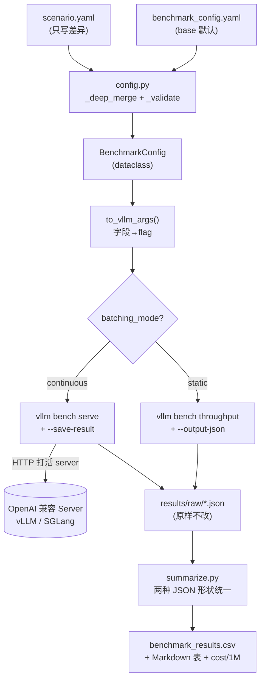
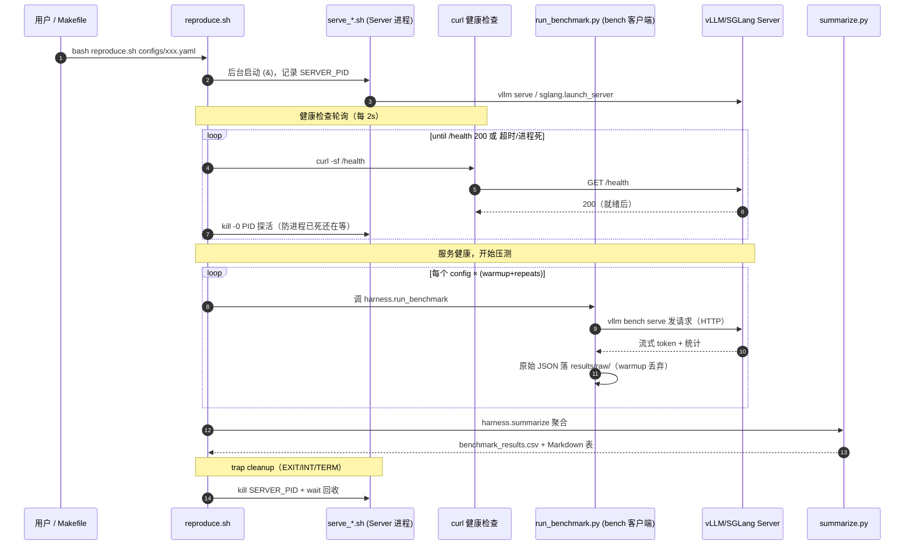
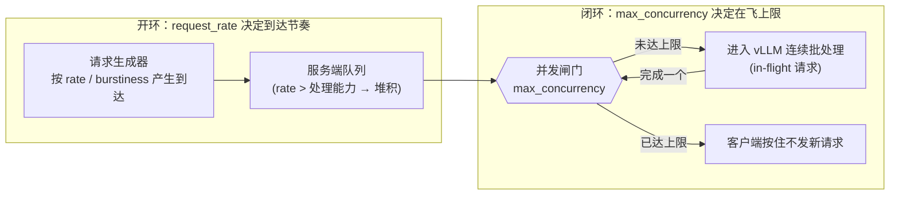

# Week 5 ServingBench 服务基准测试框架 项目解析

> 这个项目是 `CUDA_learning/week05/ServingBench` 的 Week 5 工程：从前四周的 CUDA toy kernel 切到 **LLM serving**。目标不是"把 vLLM 跑起来"，而是搭一套**配置驱动、可复现**的 serving benchmark harness——设计五类负载、运行 benchmark、保存原始数据、解释 TTFT / TPOT / ITL / TPS / RPS / p95 / KV cache / cost 的变化。

项目地址：[CUDA_learning/week05/ServingBench](https://github.com/hosendovebelva-boop/CUDA_learning/tree/main/week05/ServingBench)

配套阶段计划：[[Week 5 - Serving Benchmark Harness]]

主线一句话：

```text
负载设计 → 运行 benchmark → 保存原始数据 → 解释指标变化 → 写可复现报告
```

---

## 1. 项目定位：从"算子"到"系统"

前四周（[[Week 4 - MatMul v0]] 及之前）都在训练单个 CUDA kernel 的能力：vector add、reduction、transpose、matmul。Week 5 是第一次**把视角从单个 kernel 抬到整个推理服务系统**：不再问"这个 kernel 多少 TFLOPS"，而是问"这个服务在某种真实流量下，用户首 token 多久、打字多快、系统每秒吐多少 token、最差的那批请求体验如何、一百万 token 要花多少钱"。

| 维度 | Week 1-4（kernel 视角） | Week 5（serving 视角） |
|---|---|---|
| 被测对象 | 单个 `__global__` kernel | 整个 OpenAI 兼容推理服务 |
| 核心指标 | TFLOPS、occupancy、带宽利用率 | TTFT、TPOT/ITL、TPS、RPS、p95、cost/1M |
| 工具 | Nsight Compute / cudaEvent | `vllm bench serve` / `throughput` |
| "快慢"由谁决定 | 数据复用 / 算术强度 | prefill/decode、batching、排队、KV cache |
| 关键陷阱 | 漏 `__syncthreads`、只测方阵 | 只看平均 TPS、固定 prompt、不可复现 |

> [!note] CUDA 仍是支撑能力，不是主线
> 这周仍要用 GPU busy、memory bandwidth、batching、kernel launch 这些概念去**理解**为什么指标这样变，但主线已经是 serving。所以这个项目几乎没有 CUDA 代码——它是一层薄 Python，把可信的官方 benchmark 包装成可复现实验。

---

## 2. 目录结构与整体架构

```text
week05/ServingBench/
├── configs/                    # ① 配置驱动：base + 5 场景（只写差异）+ smoke 缩小版
│   ├── benchmark_config.yaml       #   基准模板（0.5B / fp16，适配 6 GB Turing）
│   ├── low_latency / high_throughput / long_context / shared_prefix / batching_compare.yaml
│   └── smoke_*.yaml                #   缩小版，已在本机真实跑通
├── harness/                    # ② 轻量 Python，wrap vllm bench
│   ├── config.py                   #   YAML → dataclass + 合并 + to_vllm_args（映射唯一来源）
│   ├── datasets.py                 #   生成 shared-prefix / long-context 自定义 JSONL
│   ├── run_benchmark.py            #   config → 命令 → 跑 → 存原始 JSON
│   └── summarize.py                #   原始 JSON → benchmark_results.csv + Markdown 表
├── scripts/                    # ③ 启动引擎（仅此处区分 vLLM / SGLang）
│   ├── serve_vllm.sh  serve_sglang.sh
├── reproduce.sh                # 编排：启动→健康检查→benchmark→聚合→关闭
├── results/                    # ⑤ 原始 JSON（results/raw/）+ 聚合 CSV
├── docs/                       # serving_metrics / workload_design / benchmark_report / test_results
├── Makefile  requirements.txt  .gitignore
```

整个工程是一个**五层正交结构**：配置层定义"测什么"，harness 层把配置翻译成命令并保存产物，引擎层启动被测服务，可信测量层（vllm bench）真正算指标，产物层落地原始数据与聚合。各层之间靠 `reproduce.sh` / `Makefile` 串成一条命令。

![[图片/9.培养方案/04.项目分析/Week05/Week 5 - Serving Benchmark Harness 项目解析-01.svg|960]]

> 架构看点：最关键的是那条红色**信任边界**。边界以上（configs + harness）是项目自己写的代码，职责仅限"配置 → 命令 → 保存 → 聚合"；边界以下（引擎 + vllm bench）是官方可信组件，**指标计算完全交给 vLLM**。harness 不自己算延迟/吞吐、不改一个数。这让"benchmark 是否公平可信"这件事，归约成"配置是否固定、命令是否记录"，而不依赖一段易错的自研统计代码。

---

## 3. 设计哲学：三条铁律

整个项目的可信度建立在三条铁律上，读代码时处处能看到它们的影子。

> [!important] 铁律一：配置是实验的唯一真相来源
> 每个实验必须能**仅凭一个 YAML 文件**重建，绝不依赖临时敲的命令行。`benchmark_config.yaml` 连 `environment`（GPU/CUDA/driver/pytorch/triton 版本）、`cost.gpu_hourly_usd`、`seed` 都写进去了。

> [!important] 铁律二：包装可信指标，不自己算
> harness 调 `vllm bench serve` / `vllm bench throughput`（复用其经过验证的指标数学），把原始 JSON **原样**存下。`run_benchmark.py` 注释写得很直白："deliberately does NOT compute latency/throughput itself"。

> [!important] 铁律三：原始数据不落地改
> `results/raw/*.json` 是 vllm bench 的原样输出，summarize 只读不写它；聚合结果单独落到 CSV。Agent（或人）可以生成脚本、生成表格，但**不改 benchmark 数据，也不替你下性能结论**。

这三条对应 plan 的验收问题"benchmark 怎样才公平、可复现、可解释"。下面逐层拆。

---

## 4. 配置层：base + 场景覆盖 + 深合并

### 4.1 dataclass 镜像 schema

`config.py` 用一组 `@dataclass` 把 plan §3 的 schema 固化成类型化结构，每个字段都有默认值：

```python
@dataclass
class WorkloadCfg:
    total_requests: int = 256
    request_rate: float | str = 4          # 数字或 "inf"
    max_concurrency: int | None = 32
    burstiness: float = 1.0
    prompt_length_distribution: str = "fixed_512"
    output_length_distribution: str = "fixed_128"
    shared_prefix_ratio: float = 0.0       # 仅描述性，写进报告/CSV
    long_context_ratio: float = 0.0
    dataset_name: str = "random"           # random | custom | sharegpt | sonnet
    dataset_path: str | None = None        # dataset_name==custom 时必填
    shared_prefix_tokens: int = 0          # -> --random-prefix-len

@dataclass
class BenchmarkConfig:
    scenario: str = "base"
    model: ModelCfg = field(default_factory=ModelCfg)
    engine: EngineCfg = field(default_factory=EngineCfg)
    environment: EnvironmentCfg = field(default_factory=EnvironmentCfg)
    workload: WorkloadCfg = field(default_factory=WorkloadCfg)
    measurement: MeasurementCfg = field(default_factory=MeasurementCfg)
    cost: CostCfg = field(default_factory=CostCfg)
```

注意 `shared_prefix_ratio` / `long_context_ratio` 是**纯描述性**字段——它们不映射成任何 flag，只是为了在报告里显式记录"这个场景的长上下文/共享前缀占比是多少"，对应 plan 验收里"避免把长上下文场景只写成文字描述"那条。

### 4.2 base + 场景：只写差异

场景文件极简，只写与 base 不同的键。例如 `low_latency.yaml` 全文只有：

```yaml
scenario: low_latency
workload:
  total_requests: 128
  request_rate: 1
  max_concurrency: 4
  prompt_length_distribution: fixed_128
  output_length_distribution: fixed_128
```

加载时与 `benchmark_config.yaml` 做**递归深合并**，场景值覆盖 base 值：

```python
def _deep_merge(base: dict, override: dict) -> dict:
    out = dict(base)
    for k, v in (override or {}).items():
        if isinstance(v, dict) and isinstance(out.get(k), dict):
            out[k] = _deep_merge(out[k], v)   # dict 递归合并
        else:
            out[k] = v                         # 标量直接覆盖
    return out
```

合并 → 映射 → 分叉的完整数据整形管线如下：

![[图片/9.培养方案/04.项目分析/Week05/Week 5 - Serving Benchmark Harness 项目解析-02.svg|960]]

### 4.3 防御式构造与提前校验

`_build_section` 用 dataclass 字段名过滤未知键（拼错的键会 warning 而不是静默吞掉），`_validate` 在跑之前就把非法组合拦下来：

```python
def _validate(cfg: BenchmarkConfig) -> None:
    if cfg.engine.name not in ("vllm", "sglang"):
        raise ValueError(...)
    if cfg.engine.batching_mode not in ("continuous", "static"):
        raise ValueError(...)
    if cfg.workload.dataset_name == "custom" and not cfg.workload.dataset_path:
        raise ValueError("dataset_name=custom requires dataset_path")
    if cfg.workload.total_requests <= 0:
        raise ValueError("total_requests must be > 0")
```

> [!note] 为什么校验值得单独写
> serving benchmark 跑一次成本很高（要起 server、占满 GPU 几分钟）。把"custom 却没给 dataset_path"这类错误在解析阶段就抛出来，避免起完 server 才失败、白白浪费一轮显存和时间。

### 4.4 长度分布解析：把 `fixed_512` 翻译成 vLLM 的"均值+幅度"

vLLM 的 `random` 数据集按"均值 ± 幅度比"采样长度，所以 harness 要把人类友好的 `fixed_N` / `uniform_LO_HI` 翻成 `(mean, range_ratio)`：

```python
def parse_dist(spec: str) -> tuple[int, float]:
    # vLLM 在 [mean*(1-r), mean*(1+r)] 采样
    parts = str(spec).split("_")
    if parts[0] == "fixed":
        return int(parts[1]), 0.0                       # 定长 → 幅度 0
    if parts[0] == "uniform":
        lo, hi = int(parts[1]), int(parts[2])
        mean = max(1, (lo + hi) // 2)
        return mean, round(1.0 - lo / mean, 4)          # 反推幅度比
```

---

## 5. 映射层：`to_vllm_args` —— 字段→flag 的唯一来源

这是整个 harness 的"翻译核心"，把配置翻成 `vllm bench serve` 之后的 argv。它是**唯一**做这件事的地方，所以 docs 和实际行为不会漂移。

```python
def to_vllm_args(cfg: BenchmarkConfig) -> list[str]:
    w = cfg.workload
    # SGLang 走 OpenAI 兼容端点，vllm bench 这里认 "openai" 而不是 "sglang"
    backend = "vllm" if cfg.engine.name == "vllm" else "openai"
    args = [
        "--backend", backend,
        "--model", cfg.model.name,
        "--base-url", cfg.base_url,
        "--endpoint", cfg.engine.endpoint,
        "--num-prompts", str(w.total_requests),
        "--seed", str(cfg.measurement.seed),
        "--percentile-metrics", cfg.measurement.percentile_metrics,
        "--metric-percentiles", cfg.measurement.metric_percentiles,
    ]
    # 到达模型：到达率 + 突发度 + 并发上限
    args += ["--request-rate", str(w.request_rate)]
    args += ["--burstiness", str(w.burstiness)]
    if w.max_concurrency is not None:
        args += ["--max-concurrency", str(w.max_concurrency)]

    # 负载形状：custom JSONL 还是 random
    if w.dataset_name == "custom":
        args += ["--dataset-name", "custom", "--dataset-path", str(w.dataset_path)]
        out_len, _ = parse_dist(w.output_length_distribution)
        args += ["--custom-output-len", str(out_len)]
    else:
        in_len, in_r = parse_dist(w.prompt_length_distribution)
        out_len, _   = parse_dist(w.output_length_distribution)
        args += ["--dataset-name", "random",
                 "--random-input-len", str(in_len),
                 "--random-output-len", str(out_len),
                 "--random-range-ratio", str(in_r)]
        if w.shared_prefix_tokens > 0:
            args += ["--random-prefix-len", str(w.shared_prefix_tokens)]

    if not w.streaming:
        args += ["--ignore-eos"]   # 固定输出长度，避免提前 EOS
    return args
```

几个值得记住的设计点：

- **SGLang 复用同一套 harness**：SGLang 提供 OpenAI 兼容 API，所以同一个 `vllm bench serve` 通过 `--backend openai --base-url` 就能打它。引擎差异**只**体现在 `scripts/serve_*.sh` 启动脚本里，benchmark 客户端一行不用改。
- **输出路径不在这里**：`--save-result / --result-dir / --result-filename` 由 `run_benchmark.py` 负责。映射层只管"测什么"，不管"存哪"，职责单一。
- **`--ignore-eos` 的妙用**：非流式时加它，强制模型吐满 `random-output-len` 个 token 才停，保证不同请求输出长度一致、指标可比。

---

## 6. 执行层：`run_benchmark.py`

### 6.1 continuous / static 分叉

`build_command` 根据 `batching_mode` 走两条完全不同的命令：

```python
def build_command(cfg, result_dir, result_filename) -> list[str]:
    if cfg.engine.batching_mode == "static":
        # 离线 / 静态 batching 基线：无 live server，固定 batch
        in_len, _  = parse_dist(cfg.workload.prompt_length_distribution)
        out_len, _ = parse_dist(cfg.workload.output_length_distribution)
        return ["vllm", "bench", "throughput",
                "--model", cfg.model.name, "--dtype", cfg.model.dtype,
                "--dataset-name", "random",
                "--random-input-len", str(in_len),
                "--random-output-len", str(out_len),
                "--random-range-ratio", "0.0",
                "--num-prompts", str(cfg.workload.total_requests),
                "--gpu-memory-utilization", str(cfg.engine.gpu_memory_utilization),
                "--max-model-len", str(cfg.model.max_model_len),
                "--seed", str(cfg.measurement.seed),
                "--output-json", str(result_dir / result_filename)]

    cmd = ["vllm", "bench", "serve"]          # 在线 / continuous
    cmd += to_vllm_args(cfg)
    cmd += ["--save-result", "--result-dir", str(result_dir),
            "--result-filename", result_filename]
    return cmd
```

并且 static 模式禁止配 `--engine sglang`（离线吞吐只能用 vllm bench throughput）：

```python
def _apply_engine_override(cfg, engine):
    ...
    if cfg.engine.batching_mode == "static" and engine != "vllm":
        raise ValueError("batching_mode=static uses `vllm bench throughput`; "
                         "do not run it with --engine sglang")
```

### 6.2 warmup 丢弃 + repeats

总跑 `warmup + repeats` 次，warmup 的产物**主动删掉**，绝不污染聚合：

```python
total_runs = warmup + repeats
for i in range(total_runs):
    is_warmup = i < warmup
    tag = "warmup" if is_warmup else f"rep{i - warmup}"
    fname = f"{cfg.scenario}_{label}_{tag}.json"
    cmd = build_command(cfg, result_dir, fname)
    print("  " + " ".join(cmd))      # 先打印命令 → 可复制复现
    if dry_run:
        continue
    proc = subprocess.run(cmd, cwd=REPO_ROOT)
    if proc.returncode != 0:
        rc = proc.returncode; break
    if is_warmup:
        (result_dir / fname).unlink(missing_ok=True)   # 丢弃预热产物
```

> [!note] 没装 vLLM 也能离线自检
> 如果 PATH 上找不到 `vllm`，`run` 会自动降级成 dry-run 只打印命令；`make check` 把每个 config 都解析成真实 argv 而不执行。这让"配置/映射对不对"可以在**无 GPU、无 vLLM**的环境下验证——CI 友好。

### 6.3 端到端数据流

把前面几层连起来，一次 benchmark 的数据流如下：



---

## 7. 编排层：`reproduce.sh` 的进程通讯

`reproduce.sh` 是"一键复现"的入口，它在 shell 层面编排了**多个进程之间的通讯与生命周期**：后台拉起 server 进程、轮询健康检查、前台跑 benchmark 客户端、最后用 `trap` 兜底清理。这是本项目里最接近"线程/进程通讯"的部分。

核心片段：

```bash
# 后台启动 server，记下 PID
HOST="$HOST" PORT="$PORT" bash "scripts/serve_${ENGINE}.sh" >"$SERVER_LOG" 2>&1 &
SERVER_PID=$!

# trap：无论正常退出还是 Ctrl-C / 被杀，都回收 server 进程
cleanup() {
  if [[ -n "$SERVER_PID" ]] && kill -0 "$SERVER_PID" 2>/dev/null; then
    kill "$SERVER_PID" 2>/dev/null || true
    wait "$SERVER_PID" 2>/dev/null || true
  fi
}
trap cleanup EXIT INT TERM

# 轮询健康检查：直到 /health 通，或进程死，或超时
deadline=$(( $(date +%s) + HEALTH_TIMEOUT ))
until curl -sf "http://${HOST}:${PORT}/health" >/dev/null 2>&1; do
  if ! kill -0 "$SERVER_PID" 2>/dev/null; then        # 进程已死 → 打日志退出
    tail -n 30 "$SERVER_LOG" >&2; exit 1
  fi
  if [[ $(date +%s) -ge $deadline ]]; then exit 1; fi  # 超时
  sleep 2
done

for cfg in "${CONFIGS[@]}"; do                         # 逐个场景跑
  ENGINE="$ENGINE" "$PYTHON" -m harness.run_benchmark \
    --config "$cfg" --engine "$ENGINE" --repeats "$REPEATS" --label "$LABEL"
done
"$PYTHON" -m harness.summarize                         # 聚合
```

进程间的时序与通讯如下：



> [!warning] 两个容易踩的健康检查细节
> 1）光等 `/health` 不够，还要 `kill -0 PID` 探活——否则 server **进程已经崩了**，脚本会傻等到超时；本项目在循环里同时检查进程存活并 `tail` 日志，能立刻暴露启动失败原因。
> 2）`trap cleanup EXIT INT TERM` 保证即使中途 Ctrl-C，也不会留下一个**占着 6 GB 显存的孤儿 server 进程**——这在小显存机器上尤其重要。

---

## 8. 请求并发模型：request rate vs max concurrency

这是 serving benchmark 最核心、也最容易混的一对概念，plan 把它列为必答题。它本质是**客户端如何向服务端"通讯"（发请求）**的两个独立旋钮。

| 旋钮 | 含义 | 控制论类比 | 配置字段 |
|---|---|---|---|
| **request rate** | 每秒**发出**多少请求 | 开环：来多快，不管服务端处理得过来与否 | `request_rate`（数字或 `inf`） |
| **max concurrency** | 同时**在飞**请求上限 | 闭环：到上限就不再发新请求 | `max_concurrency` |
| **burstiness** | 到达抖动 | `1.0`=Poisson，`<1`更突发，`>1`更平滑 | `burstiness` |



要点：

- `request_rate` 决定"来多快"，`max_concurrency` 决定"同时最多几个"。固定 rate 但 concurrency 太低，会**人为**限制吞吐。
- `request_rate=inf` + `max_concurrency=N` ≈ "稳态 N 路并发压测"——`high_throughput.yaml` 正是这么配的（`inf` / `64`）。
- 扫描方法：固定 prompt/output，分别扫 rate ∈ {低,中,inf}、concurrency ∈ {低,中,高}，找 **p95 开始恶化的拐点**。

---

## 9. 自定义数据集：`datasets.py`

`vllm bench --dataset-name random --random-prefix-len N` 能给每个请求加**相同的 N 个随机 token** 前缀，已经能压 prefix cache。但 plan 的 Day-5 想要更**真实**的共享前缀（system prompt、tools schema、长文档），于是 `datasets.py` 生成自定义 JSONL，经 `--dataset-name custom` 喂进去。

```python
# 共享前缀：相同 system prompt(+tools schema) + 每请求小幅变化的用户问题
def gen_shared_prefix(num, prefix_tokens, with_tools) -> list[dict]:
    prefix = _SYSTEM_PROMPT + (_TOOLS_SCHEMA if with_tools else "")
    prefix = prefix + _filler(max(0, prefix_tokens - _approx_tokens(prefix)), salt=0) + "\n\n"
    records = []
    for i in range(num):
        q = _QUESTIONS[i % len(_QUESTIONS)]
        tail = f" (request #{i}, vary={_filler(8, salt=i)})"   # 防止请求完全相同
        prompt = prefix + "User: " + q + tail + "\nAssistant:"
        records.append({"prompt": prompt, "prompt_len": _approx_tokens(prompt)})
    return records

# 长上下文：长共享文档前缀 + 短问题（prefill-heavy）
def gen_long_context(num, doc_tokens) -> list[dict]:
    doc = "DOCUMENT:\n" + _filler(doc_tokens, salt=7) + "\n\n"
    ...
```

设计细节：

- **确定性**：用固定 `_WORDS` 词池 + `salt` 生成 filler，不用 `Random()`，保证不同机器跑出**同样的数据集**（可复现铁律）。
- **每请求微扰**：共享前缀后面加 `(request #i, vary=...)`，让请求不完全相同——这才像真实 Agent/RAG 流量（共享 system prompt，但用户问题各异）。
- **诚实标注局限**：token 数是 `chars ≈ 4×tokens` 的粗估，注释明确写"真实 token 数以 vLLM 跑后的 metrics 为准"。

---

## 10. 聚合层：`summarize.py`

`summarize.py` 把 `results/raw/*.json` 聚合成一张宽 CSV + 一张 Markdown 表，并派生 cost/1M tokens。最有意思的是它要**兼容两种 JSON 形状**。

### 10.1 两种 JSON 形状

```python
is_serve = "request_throughput" in d or "mean_ttft_ms" in d
if is_serve:
    # vllm bench serve（在线）：有延迟分位 + 吞吐
    row["failed"] = int(num_prompts - completed)
    for m, col in (("ttft","ttft"),("tpot","tpot"),("itl","itl"),("e2el","e2e")):
        for p in ("50","95","99"):
            row[f"{col}_p{p}_ms"] = _pct(d, m, p)
    row["output_tps"]  = d.get("output_throughput")
    row["request_rps"] = d.get("request_throughput")
else:
    # vllm bench throughput（离线）：只有 tokens/s 和 requests/s
    row["failed"] = 0
    # 离线 JSON 不直接给 output token 数，用 config 的 output_len 反推
    out_len, _ = parse_dist(cfg["output_length_distribution"])
    inferred_output_tokens = int(num_requests * out_len)
    ...
```

在线 JSON 含 `mean_ttft_ms` / `request_throughput` 等；离线 throughput JSON 只有 `tokens_per_second` / `requests_per_second`，连 output token 数都要靠 config 的 `output_length_distribution` 反推。`summarize` 用一个 `is_serve` 判断分流，最后落进同一套 CSV 列。

### 10.2 cost/1M tokens 派生

成本不是测出来的，是基于 `gpu_hourly_usd` 假设算出来的：

```python
if gpu_price:
    usd_per_sec = gpu_price / 3600.0
    if otps:  # output tokens/s
        row["cost_per_1m_output_usd"] = round(usd_per_sec / otps * 1e6, 4)
    if ttps:  # total tokens/s
        row["cost_per_1m_total_usd"]  = round(usd_per_sec / ttps * 1e6, 4)
```

直觉：每秒成本 ÷ 每秒产出 token = 每 token 成本，再 ×1e6 得每百万 token 成本。**吞吐越高，单 token 越便宜**——这把延迟-吞吐权衡直接换算成钱。

> [!note] 容错命名：`_pct` 兼容 p50 / median
> vLLM 不同版本对中位数有时叫 `p50_ttft_ms`、有时叫 `median_ttft_ms`。`_pct` 同时试两种 key，避免版本升级后悄悄丢列。这是"包装外部工具"必须处理的版本漂移。

---

## 11. 五类必做场景

| 场景 | config | 负载特征 | 主要观察 | 模拟的真实流量 |
|---|---|---|---|---|
| 低延迟 | `low_latency.yaml` | 低 rate(1)、低并发(4)、短 prompt/output(128) | TTFT/TPOT 是否稳定低 | 单用户聊天 |
| 高吞吐 | `high_throughput.yaml` | rate=inf、并发 64、中等长度(512/256) | TPS↑ 时 p95 如何恶化 | 批量 API 服务 |
| 长上下文 | `long_context.yaml` | 长 prompt(3072)、短 output、并发=2 | TTFT、显存、KV cache | 长文档摘要 / RAG |
| 共享 prefix | `shared_prefix.yaml` | 800-token 共享前缀、不同问题、ratio≈0.86 | prefix cache 对 TTFT/成本 | Agent / 编码助手 |
| batching 对比 | `batching_compare.yaml` + `high_throughput.yaml` | static 离线 vs continuous 在线 | TPS/TPOT/tail | 离线评测 vs 在线服务 |

`shared_prefix.yaml` 的设计尤其点题：

```yaml
workload:
  prompt_length_distribution: fixed_128   # 变化的用户问题部分
  shared_prefix_tokens: 800               # 每请求相同的前缀 token
  shared_prefix_ratio: 0.86               # 800/(800+128)≈0.86，写进报告
```

要测 prefix cache 效果，就用同一个场景**翻转 `prefix_caching` 跑两次**（`--label nocache` vs `--label cache`），对比 TTFT。引擎差异由 `serve_vllm.sh` 的 `--enable-prefix-caching` / SGLang 的 `--disable-radix-cache` 控制。

---

## 12. 指标体系与"必须能解释的现象"

### 12.1 四个延迟指标

| 指标 | 全称 | 由谁决定 | 看什么 |
|---|---|---|---|
| **TTFT** | Time To First Token | **prefill**（处理 prompt） | "开始响应有多快" |
| **TPOT** | Time Per Output Token | **decode** | "打字速度"稳不稳 |
| **ITL** | Inter-Token Latency | 相邻 token 间隔 | tail 卡顿（TPOT 是 ITL 的平均口径） |
| **E2E** | End-to-End | `≈ TTFT + (out_len-1)·TPOT` | 用户感知总时长 |

每个都记 **p50 / p95 / p99**，不是只记均值。

### 12.2 为什么平均 TPS 不够

平均 TPS 是**系统总吞吐**，掩盖**单请求体验**。高并发下典型权衡：TPS↑ 但 TPOT/p95↑——更多请求批在一起，单请求每个 token 等得更久。所以报告必须同时写"系统总吞吐 (TPS/RPS)"和"单请求体验 (TTFT/TPOT 的 p95/p99)"。

### 12.3 四个必答现象

> [!important] plan 验收要求能解释的四个现象
> - **TTFT 低但 TPS 不高**：单请求首 token 快（prefill 轻 / 并发低），但同时在跑的请求少，系统总吞吐自然不高。低延迟 ≠ 高吞吐。
> - **TPS 上升但 TPOT/p95 变差**：并发/batch 变大 → GPU 算得更满（TPS↑），但每个请求的 decode 要和更多请求争 GPU，单 token 间隔变长。这是延迟-吞吐权衡的本质。
> - **长 prompt 推高 TTFT**：prefill 计算量随 prompt 长度增长，首 token 前要先处理完整个 prompt；但 decode 阶段的 TPOT 受 prompt 长度影响小。长上下文是 prefill-heavy。
> - **failed requests 原因**：(a) 超 `max_model_len`；(b) KV cache/显存不足（6 GB 上尤其易 OOM）；(c) 超时/连接被并发压垮；(d) `rate=inf` 且无 `max_concurrency` 时排队过深。

---

## 13. 真实 smoke 数据解读（2026-05-31）

本机 GTX 1660 SUPER 6 GB / Turing(sm_75)，vLLM 0.22.0 / PyTorch 2.11.0+cu130，模型 Qwen2.5-0.5B-Instruct fp16，cost 假设 1.20 USD/h。五类 workload 形状都用缩小版 smoke 真实跑通：

| 场景 | completed | failed | TTFT p95(ms) | TPOT p95(ms) | E2E p95(ms) | output TPS | cost/1M out |
|---|---:|---:|---:|---:|---:|---:|---:|
| smoke_low_latency | 8 | 0 | 131.3 | 7.3 | 356.8 | 30.66 | 10.87 |
| smoke_high_throughput | 16 | 0 | 1046.9 | 133.2 | 4774.9 | 27.09 | 12.30 |
| smoke_long_context | 4 | 0 | 1478.6 | 6.9 | 1693.7 | 17.01 | 19.60 |
| smoke_shared_prefix | 8 | 0 | 551.8 | 126.2 | 4463.0 | 15.19 | 21.94 |
| smoke_batching_compare | 16 | 0 | n/a | n/a | n/a | 73.15 | 4.56 |

数据正好印证了三个现象：

- **低延迟**：TTFT/TPOT 都很低很稳（131/7.3 ms），但并发低，output TPS 只有 30.66——典型"TTFT 低但 TPS 不高"。
- **长上下文**：3072-token prompt 把 TTFT p95 推到 1478.6 ms，但 TPOT p95 仍只有 6.9 ms——干净的 prefill-heavy 证据（首 token 慢，但后续打字不慢）。
- **static batching 最便宜**：离线 throughput 跑出 73.15 TPS / 4.56 美元每百万 token，远好于在线 smoke——但它**没有** TTFT/TPOT/tail 指标，下一节解释为何不能直接拿来代表线上。

---

## 14. static vs continuous batching

| | continuous（在线） | static（离线基线） |
|---|---|---|
| 命令 | `vllm bench serve`（打活 server） | `vllm bench throughput`（无 live server） |
| 请求到达 | 按到达率陆续进，动态拼 batch，完成即让位 | 一次性给定固定 batch，无逐请求到达 |
| 能得到的指标 | TPS **和** TTFT/TPOT/p95 | **仅**峰值 tokens/s |
| 代表性 | 反映真实延迟-吞吐权衡 | 偏乐观 |

> [!warning] 为什么固定 batch ≠ 真实在线服务
> 离线吞吐假设所有请求同时就绪、长度一致、没有排队和到达抖动，因此 tokens/s 偏乐观。在线服务里请求陆续到达、长短不一，只有 continuous batching 才能反映真实的延迟-吞吐权衡。报告里必须**并列两者并说明差异**——这正是 smoke 数据里 static(73 TPS) 远高于在线 smoke 的原因，但它不能单独拿来下结论。

补充两个可选维度：

- **prefix caching**：命中共享前缀时跳过该段 prefill → 主要降 **TTFT**（和 prefill 成本），对纯 decode 的 TPOT 影响小。
- **chunked prefill**：把长 prompt 的 prefill 切块、与 decode 交错调度 → 改善高并发下 decode 的 **TPOT/ITL（更平滑）**，但可能略推高单条长 prompt 的 TTFT。

---

## 15. 常见坑

> [!warning] 只看平均 TPS
> 高并发下 TPS↑ 但 TPOT/p95↑ 是常见权衡。必须同时报系统吞吐和单请求 p95/p99。

> [!warning] 用固定 prompt 当真实负载
> 真实流量有 prompt/output 长度分布、shared prefix、long context。本项目用五类场景 + `shared_prefix_ratio`/`long_context_ratio` 显式建模，避免把长上下文只写成文字描述。

> [!warning] 拿离线吞吐当线上结论
> static `vllm bench throughput` 没有 TTFT/TPOT/tail，偏乐观，只能作基线对照。

> [!warning] 自己算指标
> harness 故意不算指标，全交给 `vllm bench`。一旦自己写统计代码，"公平可信"就退化成"相信我这段代码没 bug"。

> [!warning] 忘了记环境
> GPU/CUDA/driver/pytorch/triton 版本、seed、cost 假设都写进 `benchmark_config.yaml`。换机器复现时这些是第一手依据。

> [!warning] 健康检查只等 /health
> server 进程崩了还在等 `/health` 会傻等到超时。要同时 `kill -0 PID` 探活并 `tail` 日志。

---

## 16. 面试速答

- **TTFT 和 TPOT 分别代表什么？** TTFT 是首 token 延迟，由 prefill（处理 prompt）决定，看"开始响应多快"；TPOT 是后续每 token 平均延迟，由 decode 决定，看"打字速度"。
- **request rate 和 max concurrency 的区别？** rate 是每秒发出多少（开环，可超过处理能力→排队）；concurrency 是同时在飞上限（闭环，到上限就不发新请求）。rate 决定"来多快"，concurrency 决定"同时几个"。
- **为什么不能只报平均 TPS？** 平均 TPS 是系统总吞吐，掩盖单请求体验；高并发下 TPS↑ 常伴随 TPOT/p95↑，必须补 p50/p95/p99 和 failed。
- **为什么长 prompt 推高 TTFT 但不太影响 TPOT？** prefill 计算量随 prompt 长度增长，首 token 前要处理完整个 prompt；decode 阶段每步只生成一个 token，受 prompt 长度影响小。长上下文是 prefill-heavy。
- **static 和 continuous batching 区别？为什么固定 batch 不能代表线上？** static 是离线固定 batch、无逐请求到达，只测峰值 tokens/s；continuous 按到达率动态拼 batch，能同时报吞吐和延迟。固定 batch 假设请求同时就绪、等长、无排队，偏乐观。
- **prefix cache / chunked prefill 各改善什么？** prefix cache 命中共享前缀跳过 prefill，主要降 TTFT；chunked prefill 把长 prompt 切块与 decode 交错，改善高并发 TPOT/ITL，可能略升单条 TTFT。
- **random prompt 和 Agent/RAG workload 差在哪？** random 是均匀随机 token；Agent/RAG 有长共享前缀（system prompt/tools/文档）+ 各异的用户问题，`datasets.py` 正是生成这种结构。
- **怎么证明 benchmark 可复现？** 固定模型/版本/GPU/dtype/seed/prompt-output 分布/rate/concurrency/warmup，全写进一个 YAML；存原始 JSON + 命令 + 环境；`reproduce.sh` 一键重跑。
- **Agent 生成脚本时如何防止它改数据？** harness 不自己算指标、`results/raw/*.json` 原样不改、聚合单独落 CSV——Agent 只能生成脚本/表格，下结论的是人。

---

## 17. 关联知识与下一步

- [[Week 5 - Serving Benchmark Harness]] —— 本项目对应的阶段计划
- [[CUDA Week 4 MatMul v0 项目解析]] —— 前置：CUDA/GPU 支撑能力（batching、带宽、kernel launch）
- [[Week 6 - Observability + Metrics]] —— 下一步：把这些指标接到可观测性/监控
- [[Week 7 - KV Cache + Prefix Cache + Paged KV]] —— 深入 KV cache / prefix cache 机制
- [[Week 8 - Prefill Decode + Open Source Repro]] —— prefill/decode 拆解与开源复现
- [vLLM bench serve](https://docs.vllm.ai/en/latest/api/vllm/benchmarks/serve/) · [NVIDIA GenAI-Perf](https://developer.nvidia.com/blog/llm-performance-benchmarking-measuring-nvidia-nim-performance-with-genai-perf/)

**面试一句话表达**：构建 vLLM / SGLang serving benchmark harness，覆盖 request rate、max concurrency、prompt/output length、shared prefix workload，统计 TTFT、TPOT/ITL、TPS、RPS、p95 latency、KV cache usage 和 cost/1M tokens，并分析延迟-吞吐-成本权衡。

**下一步**（本项目范围内）：补跑正式五类场景矩阵（非 smoke）、补 prefix cache on/off 对比、安装 SGLang 产出第二引擎数据、可选 quantization 成本专项。
