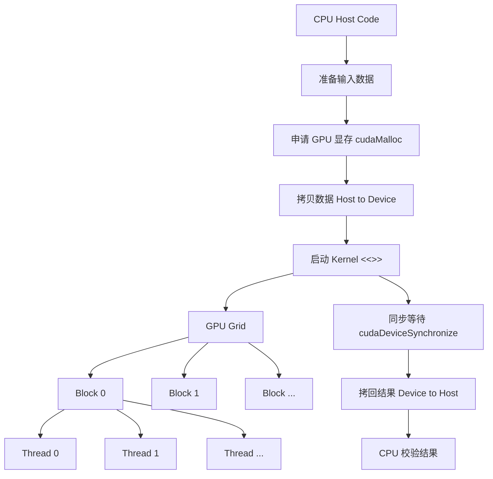

---
tags:
  - AI-infra/素材库-GPU与推理方向/前置知识/阶段一
---
---
title: 3.1 CUDA 零基础系统入门
date: 2026-05-06
tags:
  - infra
  - CUDA
  - 参考资料
aliases:
  - CUDA 入门
  - CUDA 系统入门
status: active
---

# 3.1 CUDA 零基础系统入门

## 索引

- [[#0. 先建立直觉：CUDA 解决什么问题]]
- [[#1. CUDA 的基本概念]]
- [[#2. CUDA 执行模型：Grid / Block / Thread]]
  - [[#2.1 Mermaid 总览]]
  - [[#2.1.1 Stream / Event / Device / Block 关系]]
  - [[#2.2 线程如何知道自己负责哪个元素]]
  - [[#2.3 launch 配置如何决定内建变量]]
  - [[#2.4 从 1D 扩展到 2D / 3D]]
- [[#3. CUDA 程序典型数据流：分配 → 拷贝 → 计算 → 拷回]]
  - [[#3.1 Host 侧准备数据]]
  - [[#3.2 Device 侧申请显存：`cudaMalloc`]]
  - [[#3.3 Host to Device：把输入拷到 GPU]]
  - [[#3.4 Kernel 执行：GPU 并行计算]]
  - [[#3.5 等待 GPU 完成：`cudaDeviceSynchronize`]]
  - [[#3.6 Device to Host：把结果拷回 CPU]]
  - [[#3.7 释放显存：`cudaFree`]]
  - [[#3.8 用 RAII 封装 device memory]]
  - [[#3.9 这一节要记住的流程]]
- [[#4. CUDA 程序的编译：为什么 `.cu` 不等于普通 `.cpp`]]
  - [[#4.1 CMake 中启用 CUDA]]
- [[#5. CUDA 的性能直觉]]
  - [[#5.1 数据搬运可能比计算更贵]]
  - [[#5.2 GPU 喜欢规则访问]]
  - [[#5.3 性能结论必须靠 benchmark 和 profiler]]
  - [[#5.4 更可靠的 benchmark 结构]]
  - [[#5.5 benchmark 和 profiler 的区别]]
- [[#6. CUDA 学习路线图]]
- [[#7. CUDA 与普通 C++ 的关系]]
- [[#8. 常见错误]]
- [[#9. 学习检查清单]]
- [[#10. 关键要点总结]]
- [[#关联知识]]
- [[#参考]]

## 阅读说明

建议先看 0 到 3 节，把执行模型和数据流串起来，再回到后面理解编译、内存与最小工程骨架。把这篇当作 CUDA 入门总导航，先抓住“线程怎么映射数据、host/device 怎么配合”这条主线。

---


> CUDA 是 NVIDIA 提供的 GPU 通用计算平台：它让 C/C++ 程序可以把适合并行的大量重复计算交给 GPU 执行，从而获得比 CPU 更高的吞吐量。

---

## 0. 先建立直觉：CUDA 解决什么问题

如果你没有学过 CUDA，可以先把它理解成一种“把循环拆给很多 GPU 线程同时做”的编程方式。

普通 CPU 程序常见写法是：

```cpp
for (int i = 0; i < n; ++i) {
    c[i] = a[i] + b[i];
}
```

这段代码在语义上是一个循环，但每个 `i` 之间互不依赖。CUDA 的思路是：不要让一个 CPU 核心按顺序跑完所有 `i`，而是让 GPU 启动大量线程，每个线程负责一个或几个元素。

```text
CPU 串行思路：一个工人从第 0 个元素做到第 n-1 个元素
CUDA 并行思路：很多工人同时开工，每个工人处理自己的元素
```

> [!important] 第一性原理
> CUDA 适合“同一种操作作用在大量数据上”的任务，例如向量加法、矩阵乘法、图像处理、深度学习算子。它不适合大量分支复杂、数据规模很小、线程之间强依赖的任务。

---

## 1. CUDA 的基本概念

CUDA 程序同时涉及两类代码：

| 名称 | 运行位置 | 职责 |
|---|---|---|
| Host code | CPU | 准备数据、分配显存、启动 GPU kernel、取回结果 |
| Device code | GPU | 执行真正的大规模并行计算 |

GPU 上运行的函数叫 **kernel**。CPU 通过特殊语法启动 kernel：

```cpp
my_kernel<<<grid_size, block_size>>>(args...);
```

这里的 `<<<grid_size, block_size>>>` 不是普通 C++ 函数调用语法，而是 CUDA 扩展语法，表示“在 GPU 上启动多少线程”。

---

## 2. CUDA 执行模型：Grid / Block / Thread

CUDA 把一次 kernel 启动组织成三层：

```text
Grid
└── Block
    └── Thread
```

- **Thread**：最小执行单元，通常处理一个或几个数据元素。
- **Block**：一组 thread，同一个 block 内的线程可以协作。
- **Grid**：一次 kernel launch 产生的所有 block。
)

### 2.1 Mermaid 总览



### 2.1.1 Stream / Event / Device / Block 关系

如果把一次 CUDA 执行过程拆开看，可以分成两层：

- **提交层**：Host 把 H2D copy、kernel、D2H copy 等任务提交到某个 stream。
- **执行层**：Device 按 stream 中的顺序执行任务；kernel 真正运行时，会展开成 grid，再拆成多个 block 和 thread。
)

这几个概念的关系可以这样记：

| 概念 | 所在层级 | 作用 |
|---|---|---|
| `device` | GPU 硬件与 CUDA 执行资源 | 真正执行 kernel、管理显存、运行 stream 中的任务 |
| `stream` | device 上的任务队列 | 保证同一 stream 内任务按提交顺序执行，不同 stream 有机会并发 |
| `event` | stream 时间线上的标记点 | 用来记录某个任务点，可用于同步、计时和建立依赖 |
| `block` | kernel 展开后的执行组织单元 | 一组 CUDA thread，同一个 block 内的线程可以用 `__syncthreads()` 协作 |

> [!important] 不要混淆层级
> `stream` 和 `event` 描述的是任务提交与时间线；`block` 和 `thread` 描述的是 kernel 内部如何并行执行。CPU 线程负责提交任务，CUDA thread 负责在 GPU kernel 中处理数据。

### 2.2 线程如何知道自己负责哪个元素

CUDA kernel 里常见的第一行是计算全局线程编号：

```cpp
const int idx = blockIdx.x * blockDim.x + threadIdx.x;
```

**含义拆解**：

- `blockIdx.x`：当前 block 在 grid 中的编号。
- `blockDim.x`：每个 block 中有多少线程。
- `threadIdx.x`：当前线程在 block 内的编号。
- `idx`：当前线程对应的全局元素下标。

假设每个 block 有 256 个线程：

| blockIdx.x | threadIdx.x | idx |
|---|---:|---:|
| 0 | 0 | 0 |
| 0 | 1 | 1 |
| 0 | 255 | 255 |
| 1 | 0 | 256 |
| 1 | 1 | 257 |

这就是 CUDA 入门最重要的映射关系：**线程编号 → 数据下标**。

### 2.3 launch 配置如何决定内建变量

这些变量不是你手动传进 kernel 的，而是 CUDA 在每个 GPU 线程执行时自动提供的内建变量。

例如：

```cpp
vector_add_kernel<<<blocks, threads_per_block>>>(d_a, d_b, d_c, n);
```

在 1D launch 中，它们的对应关系是：

| Host 侧 launch 参数 | Kernel 内建变量 | 含义 |
|---|---|---|
| `blocks` | `gridDim.x` | 当前 grid 在 x 方向上一共有多少个 block |
| `threads_per_block` | `blockDim.x` | 每个 block 在 x 方向上一共有多少个 thread |
| CUDA 自动分配 | `blockIdx.x` | 当前线程所在 block 的编号 |
| CUDA 自动分配 | `threadIdx.x` | 当前线程在 block 内的编号 |

因此，如果：

```cpp
constexpr int threads_per_block = 256;
const int blocks = (n + threads_per_block - 1) / threads_per_block;
vector_add_kernel<<<blocks, threads_per_block>>>(d_a, d_b, d_c, n);
```

那么 kernel 内部看到的是：

```text
blockDim.x == 256
gridDim.x  == blocks
```

编号范围是：

| 变量 | 取值范围 |
|---|---|
| `blockIdx.x` | `0 ~ gridDim.x - 1` |
| `threadIdx.x` | `0 ~ blockDim.x - 1` |

所以：

```cpp
const int idx = blockIdx.x * blockDim.x + threadIdx.x;
```

本质是在说：**先跳过前面所有 block 的线程数，再加上当前线程在本 block 内的位置**。

### 2.4 从 1D 扩展到 2D / 3D

`blockIdx`、`blockDim`、`threadIdx`、`gridDim` 不只有 `.x`，它们也可以使用 `.y` 和 `.z`。CUDA 的 grid 和 block 都可以是一维、二维或三维结构。

对于图像、矩阵这类二维数据，常见写法是分别计算 `x` 和 `y`：

```cpp
const int x = blockIdx.x * blockDim.x + threadIdx.x;
const int y = blockIdx.y * blockDim.y + threadIdx.y;
```

这里：

- `blockIdx.x / blockIdx.y`：当前 block 在二维 grid 中的位置。
- `threadIdx.x / threadIdx.y`：当前 thread 在二维 block 中的位置。
- `blockDim.x / blockDim.y`：每个 block 在两个方向上的线程数量。
- `gridDim.x / gridDim.y`：整个 grid 在两个方向上的 block 数量。

三维情况同理，只是再加上 `.z`：

```cpp
const int z = blockIdx.z * blockDim.z + threadIdx.z;
```

无论是 1D、2D 还是 3D，本质都是同一个思想：**用 block 坐标和 thread 坐标共同确定当前线程负责的数据位置**。

---

## 3. CUDA 程序典型数据流：分配 → 拷贝 → 计算 → 拷回

初学 CUDA 时，最重要的不是先记住很多 API，而是先建立一条稳定的数据流心智模型：

```text
CPU 准备数据
→ GPU 申请显存
→ CPU 数据拷贝到 GPU
→ GPU kernel 并行计算
→ GPU 结果拷回 CPU
→ CPU 校验结果
```
)

这条链路是几乎所有 CUDA 程序的基础。`vector add` 之所以适合作为 CUDA Hello World，是因为它刚好覆盖了这条完整流程，但算法本身又足够简单，不会干扰对 CUDA 执行模型和内存模型的理解。

> [!important] 核心直觉
> CPU 内存和 GPU 显存是两个不同空间。普通 `std::vector` 里的数据在 CPU 内存中，GPU kernel 不能直接把它当作 device memory 使用。必须先把数据从 Host 拷贝到 Device，kernel 才能处理。

### 3.1 Host 侧准备数据

CPU 侧依然使用普通 Modern C++ 容器，例如 `std::vector`：

```cpp
std::vector<float> a(n, 1.0f);
std::vector<float> b(n, 2.0f);
std::vector<float> c(n, 0.0f);
```

这里的角色是：

| 变量 | 所在位置 | 作用 |
|---|---|---|
| `a` | CPU 内存 | 输入数组 |
| `b` | CPU 内存 | 输入数组 |
| `c` | CPU 内存 | 接收 GPU 计算后的结果 |

此时数据还没有进入 GPU。`a.data()`、`b.data()`、`c.data()` 都是 host pointer，只能被 CPU 侧代码直接访问。

> [!warning] 常见误区
> `std::vector<float> a` 的 `a.data()` 是 host pointer，不是 device pointer。把 host pointer 直接传给 kernel，通常会导致非法内存访问或错误结果。

### 3.2 Device 侧申请显存：`cudaMalloc`

`cudaMalloc` 是最基础的 device memory 申请接口：

```cpp
cudaError_t cudaMalloc(void** devPtr, size_t size);
```

参数含义：

| 参数 | 含义 |
|---|---|
| `devPtr` | 输出参数，成功后写入一段 GPU 显存的 device pointer |
| `size` | 申请的字节数，通常写成 `n * sizeof(T)` |

返回值 `cudaError_t` 表示调用是否成功。`cudaMalloc` 只负责申请 GPU 显存，不会初始化内容，也不会把 host 数据拷进去。

`devPtr` 是 `void**`，因为 Runtime API 需要把申请到的 device pointer 回写给调用者。比如 `d_a` 是 `float*`，传入 `&d_a` 后，`cudaMalloc` 才能修改 `d_a` 保存的地址值。

GPU kernel 需要访问 GPU 显存，所以要先在 device memory 中申请空间：

```cpp
float* d_a = nullptr;
float* d_b = nullptr;
float* d_c = nullptr;

cudaMalloc(&d_a, n * sizeof(float));
cudaMalloc(&d_b, n * sizeof(float));
cudaMalloc(&d_c, n * sizeof(float));
```

这里的 `d_` 表示 device：

| 变量 | 指向位置 | 作用 |
|---|---|---|
| `d_a` | GPU 显存 | 存放输入 `a` 的 device 副本 |
| `d_b` | GPU 显存 | 存放输入 `b` 的 device 副本 |
| `d_c` | GPU 显存 | 存放输出结果 |

`cudaMalloc` 只负责申请 GPU 显存，不负责拷贝数据。执行完这一步后，GPU 上只是有了空间，`d_a` 和 `d_b` 里还没有有效输入。

### 3.3 Host to Device：把输入拷到 GPU

`cudaMemcpy` 是 CUDA Runtime API 中最常用的数据拷贝接口：

```cpp
cudaError_t cudaMemcpy(void* dst, const void* src, size_t count, cudaMemcpyKind kind);
```

参数含义：

| 参数 | 含义 |
|---|---|
| `dst` | 目标地址 |
| `src` | 来源地址 |
| `count` | 拷贝的字节数，不是元素个数 |
| `kind` | 拷贝方向，由 `cudaMemcpyKind` 枚举指定 |

本节最常见的两个方向是：

| 方向 | 含义 |
|---|---|
| `cudaMemcpyHostToDevice` | 从 CPU 内存拷贝到 GPU 显存 |
| `cudaMemcpyDeviceToHost` | 从 GPU 显存拷贝回 CPU 内存 |

接下来用 `cudaMemcpyHostToDevice` 把 CPU 内存中的输入拷贝到 GPU 显存：

```cpp
cudaMemcpy(d_a, a.data(), n * sizeof(float), cudaMemcpyHostToDevice);
cudaMemcpy(d_b, b.data(), n * sizeof(float), cudaMemcpyHostToDevice);
```

以第一行为例：

```cpp
cudaMemcpy(
    d_a,                    // 目标：GPU 显存
    a.data(),               // 来源：CPU 内存
    n * sizeof(float),      // 拷贝字节数
    cudaMemcpyHostToDevice  // 拷贝方向：Host → Device
);
```

这一步完成后，可以理解成：

```text
CPU 内存: a, b 仍然存在
GPU 显存: d_a, d_b 拥有 a, b 的副本
```

它不是把 `a`、`b` 移动到 GPU，而是复制一份到 GPU。

### 3.4 Kernel 执行：GPU 并行计算

`vector add` 的计算逻辑非常简单：

```text
c[i] = a[i] + b[i]
```

对应的 CUDA kernel 是：

```cpp
__global__ void vector_add_kernel(const float* a, const float* b, float* c, int n) {
    const int idx = blockIdx.x * blockDim.x + threadIdx.x;
    if (idx < n) {
        c[idx] = a[idx] + b[idx];
    }
}
```

关键点：

- `__global__` 表示这个函数从 CPU 侧启动、在 GPU 上执行。
- `a`、`b`、`c` 必须是 device pointer，也就是这里传入的 `d_a`、`d_b`、`d_c`。
- 每个线程通过 `idx` 找到自己负责的数组元素。
- `idx < n` 是边界保护，因为启动的线程数通常会向上取整，不一定刚好等于元素个数。

最重要的映射关系是：

```cpp
const int idx = blockIdx.x * blockDim.x + threadIdx.x;
```

这就是 CUDA 入门最重要的关系：**线程编号 → 数据下标**。

启动 kernel 的 host 代码通常写成：

```cpp
constexpr int threads_per_block = 256;
const int blocks = (n + threads_per_block - 1) / threads_per_block;

vector_add_kernel<<<blocks, threads_per_block>>>(d_a, d_b, d_c, n);
```

其中：

- `threads_per_block` 表示一个 block 内有多少线程。
- `blocks` 使用向上取整，确保所有元素都有线程覆盖。
- `<<<blocks, threads_per_block>>>` 启动的是 `blocks * threads_per_block` 个线程。

> [!tip] 怎么选 256？
> 入门阶段可以先用 128 或 256 作为 block size。真正优化时要结合 GPU 架构、寄存器使用、shared memory、occupancy 和 profiling 指标判断。

### 3.5 等待 GPU 完成：`cudaDeviceSynchronize`

kernel launch 默认通常是异步的。也就是说，CPU 发出 kernel 启动命令后，不一定等 GPU 算完才继续往下执行。

```cpp
vector_add_kernel<<<blocks, threads_per_block>>>(d_a, d_b, d_c, n);
cudaDeviceSynchronize();
```

`cudaDeviceSynchronize()` 的作用是让 host 等待 device 当前任务完成。它不是数据拷贝，只是一个完成点。

实际工程中，kernel launch 后还应该检查错误：

```cpp
vector_add_kernel<<<blocks, threads_per_block>>>(d_a, d_b, d_c, n);
check_cuda(cudaGetLastError());
check_cuda(cudaDeviceSynchronize());
```

### 3.6 Device to Host：把结果拷回 CPU

GPU kernel 写入的是 `d_c`，也就是 GPU 显存中的输出。CPU 如果要打印、校验或继续普通 C++ 逻辑，必须把结果拷回 host memory：

```cpp
cudaMemcpy(c.data(), d_c, n * sizeof(float), cudaMemcpyDeviceToHost);
```

拆开看：

```cpp
cudaMemcpy(
    c.data(),               // 目标：CPU 内存
    d_c,                    // 来源：GPU 显存
    n * sizeof(float),      // 拷贝字节数
    cudaMemcpyDeviceToHost  // 拷贝方向：Device → Host
);
```

这一步结束后，CPU 侧的 `std::vector c` 才包含计算结果，测试代码才能检查：

```cpp
for (int i = 0; i < n; ++i) {
    assert(c[i] == a[i] + b[i]);
}
```

### 3.7 释放显存：`cudaFree`

用 `cudaMalloc` 申请的显存，最后必须用 `cudaFree` 释放：

```cpp
cudaFree(d_c);
cudaFree(d_b);
cudaFree(d_a);
```

`cudaMalloc` 和 `cudaFree` 必须配对。如果中途出错，手动释放很容易遗漏，所以工程代码应使用 RAII 封装 device memory。

### 3.8 用 RAII 封装 device memory

CUDA Runtime API 本身是 C 风格接口，会返回 `cudaError_t`，并且要求手动配对 `cudaMalloc/cudaFree`。在 C++ 工程中，建议只在边界处直接接触这些 C API，然后用 RAII 对象把资源生命周期管理起来。

RAII 的核心思想是：

```text
构造函数负责获取资源
析构函数负责释放资源
对象生命周期就是资源生命周期
```

放到 CUDA 里，就是：

```text
cudaMalloc → 构造函数
cudaFree   → 析构函数
```

这样可以避免三类常见问题：

- **资源泄漏**：中途 `return` 或抛异常时忘记 `cudaFree`。
- **重复释放**：多个指针误指向同一块 device memory 后重复 `cudaFree`。
- **错误路径难维护**：每次新增 `cudaMalloc` 都要小心补齐所有失败路径上的释放逻辑。

可以把 `DeviceBuffer<T>` 理解成 **GPU 显存版本的 `std::unique_ptr`**：它独占一块 device memory，作用域结束时自动释放。RAII 的资源管理思想可以回看 [[独享智能指针]]。

```cpp
inline void check_cuda(cudaError_t status) {
    if (status != cudaSuccess) {
        throw std::runtime_error(cudaGetErrorString(status));
    }
}

template <typename T>
class DeviceBuffer {
public:
    explicit DeviceBuffer(std::size_t count) : count_(count) {
        check_cuda(cudaMalloc(&ptr_, count_ * sizeof(T)));
    }

    ~DeviceBuffer() {
        cudaFree(ptr_);
    }

    DeviceBuffer(const DeviceBuffer&) = delete;
    DeviceBuffer& operator=(const DeviceBuffer&) = delete;

    T* get() { return ptr_; }
    const T* get() const { return ptr_; }
    std::size_t size() const { return count_; }

private:
    T* ptr_ = nullptr;
    std::size_t count_ = 0;
};
```

这样可以把 `cudaMalloc/cudaFree` 绑定到对象生命周期中，避免资源泄漏。禁止拷贝是必要的，否则两个 `DeviceBuffer` 会持有同一块 device memory，析构时发生重复释放。

这几个成员函数分别对应不同的工程约束：

| 代码 | 作用 | 为什么需要 |
|---|---|---|
| 构造函数中的 `cudaMalloc` | 申请 GPU 显存 | 创建对象时立即拥有资源 |
| 析构函数中的 `cudaFree` | 释放 GPU 显存 | 离开作用域时自动清理 |
| 删除拷贝构造 / 拷贝赋值 | 禁止复制所有权 | 防止两个对象释放同一块显存 |
| `get()` | 借出底层 device pointer | 供 `cudaMemcpy` 和 kernel launch 使用 |

> [!warning] `get()` 不转移所有权
> `d_a.get()` 只是把底层 device pointer 借给 CUDA API 使用，`DeviceBuffer` 仍然拥有这块显存。不要对 `get()` 返回的指针手动调用 `cudaFree`，否则析构时会发生重复释放。

析构函数中通常不应该抛异常。上面的示例直接调用 `cudaFree(ptr_)`，是因为析构阶段主要职责是尽力释放资源；如果析构函数在栈展开过程中继续抛异常，可能导致 `std::terminate`。更完整的工程版本可以记录释放失败，但不要从析构函数抛出异常。

这层封装的目的不是隐藏 CUDA，而是把 C 风格资源管理限制在很小的边界内，让业务代码保持 Modern C++ 风格：

```cpp
DeviceBuffer<float> d_a(a.size());
DeviceBuffer<float> d_b(b.size());
DeviceBuffer<float> d_c(c.size());

check_cuda(cudaMemcpy(d_a.get(), a.data(), a.size() * sizeof(float), cudaMemcpyHostToDevice));

vector_add_kernel<<<blocks, threads_per_block>>>(d_a.get(), d_b.get(), d_c.get(), n);
```

这里的核心关系可以记成：

```text
CUDA Runtime API 负责真正申请和释放资源
DeviceBuffer 负责保证申请和释放一定成对出现
业务代码只通过对象表达“我拥有一块 GPU 显存”
```

### 3.9 这一节要记住的流程

```text
std::vector a, b, c       // Host memory
cudaMalloc d_a, d_b, d_c  // Device memory
cudaMemcpy H2D            // 输入进入 GPU
kernel<<<grid, block>>>   // GPU 并行计算
cudaDeviceSynchronize     // Host 等待 Device 完成
cudaMemcpy D2H            // 结果回到 CPU
cudaFree                  // 释放 GPU 显存
```

第一阶段只要把这条链路讲清楚，并能用 `vector add` 跑通，就已经完成 CUDA 入门最关键的一步。

---

## 4. CUDA 程序的编译：为什么 `.cu` 不等于普通 `.cpp`

CUDA 源文件通常使用 `.cu` 后缀。它里面可能同时包含：

- CPU 侧 host code。
- GPU 侧 device code。
- kernel launch 语法。

因此它不能完全按普通 C++ 文件处理，需要 CUDA 编译器参与。编译和链接的基础可以回看 [[1.1 程序编译与链接原理]]。

### 4.1 CMake 中启用 CUDA

```cmake
cmake_minimum_required(VERSION 3.24)
project(cuda_intro LANGUAGES CXX CUDA)

set(CMAKE_CXX_STANDARD 20)
set(CMAKE_CUDA_STANDARD 17)

add_executable(vector_add main.cu)
```

**关键点**：

- `LANGUAGES CXX CUDA` 表示项目同时使用 C++ 和 CUDA。
- `main.cu` 会交给 CUDA 编译链处理。
- 更完整的项目模板可以参考 [[Week 1 - CUDA + Agent workflow]]，CMake 基础可以回看 [[14.3 CMake基础]]。

---

## 5. CUDA 的性能直觉

CUDA 性能优化不是“线程越多越快”。入门阶段先建立三条直觉。

### 5.1 数据搬运可能比计算更贵

如果只做一次简单加法：

```text
从 CPU 拷到 GPU → GPU 加法 → 从 GPU 拷回 CPU
```

真正耗时可能主要在数据拷贝，而不是加法本身。因此 CUDA 更适合：

- 数据量很大；
- 同一批数据会在 GPU 上连续做很多计算；
- 计算密度足够高；
- 最终只需要把少量结果拷回 CPU。

### 5.2 GPU 喜欢规则访问

GPU 线程通常按连续编号成组执行。如果线程 0 访问 `a[0]`，线程 1 访问 `a[1]`，线程 2 访问 `a[2]`，这种访问更容易合并成高效内存事务。

```text
好：thread i 访问 a[i]
差：thread i 随机访问 a[random[i]]
```

这就是后续要学习的 **memory coalescing**。

### 5.3 性能结论必须靠 benchmark 和 profiler

CUDA 性能结论不能只靠感觉。一个 kernel “能跑”不代表“算得对”，一次运行“看起来很快”也不代表性能稳定。入门阶段至少要建立三层证据：

```text
correctness test → 证明结果正确
CUDA event benchmark → 证明运行时间
profiler → 解释为什么快或慢
```

CUDA 入门阶段可以先用 CUDA event 测 kernel 时间：

```cpp
// CUDA event 是记录在 GPU stream 时间线上的事件点。
// start 和 stop 分别表示计时区间的起点和终点。
cudaEvent_t start = nullptr;
cudaEvent_t stop = nullptr;

// 创建两个 event 对象。工程代码中应检查返回值。
cudaEventCreate(&start);
cudaEventCreate(&stop);

// 在当前 GPU stream 中记录 start。
// 它不是 CPU 当前时间，而是 GPU 任务队列中的一个时间戳。
cudaEventRecord(start);

// 启动要测量的 kernel。
// 这里测到的是 start 和 stop 之间的 GPU kernel 执行时间。
vector_add_kernel<<<blocks, threads_per_block>>>(d_a, d_b, d_c, n);

// 在 kernel 之后记录 stop。
// GPU stream 中的顺序可以理解为：start event → kernel → stop event。
// 这里不是 CPU 立刻记下当前时间，而是把“记录 stop 事件”这件事排进 GPU stream。
// GPU 真正执行到这里时，stop 才会被标记为已发生，并对应一个时间点。
cudaEventRecord(stop);

// CPU 等待 stop event 完成。
// 否则 GPU 可能还没执行到 stop，就去读取耗时。
// 可以把它理解为：CPU 阻塞到 GPU 真正执行完 stop 为止，而不是只等“提交了 stop 命令”。
cudaEventSynchronize(stop);

// 计算 start 和 stop 之间的时间差，单位是毫秒。
float elapsed_ms = 0.0f;
cudaEventElapsedTime(&elapsed_ms, start, stop);

// event 也是 CUDA 资源，用完后应销毁。
cudaEventDestroy(stop);
cudaEventDestroy(start);
```

**关键点**：

- CUDA event 记录的是 GPU stream 时间线上的时间，不是 CPU 墙钟时间。
- 上面这种写法主要测 **kernel-only time**，不包含 `cudaMalloc`、H2D 拷贝、D2H 拷贝和 CPU 校验。
- 如果要测完整业务耗时，应单独做 **end-to-end benchmark**，把数据准备、拷贝、kernel、拷回都纳入，并在结果中明确标注。
- benchmark 要先 warm-up，再 repeat 多次，避免第一次 CUDA 初始化和单次波动误导判断。
- 只看一次运行时间没有意义，必须同时检查 correctness。错误 kernel 可能非常快，但结果没有价值。
- 后续性能分析要学习 Nsight Compute / Nsight Systems。

### 5.4 更可靠的 benchmark 结构

只运行一次 kernel 得到的时间不稳定。更推荐的最小结构是：

```cpp
constexpr int warmup = 5;
constexpr int repeat = 100;

// 预热：不计入最终结果，用于避开首次启动、cache、GPU 频率等波动。
for (int i = 0; i < warmup; ++i) {
    vector_add_kernel<<<blocks, threads_per_block>>>(d_a, d_b, d_c, n);
}
cudaDeviceSynchronize();

cudaEvent_t start = nullptr;
cudaEvent_t stop = nullptr;
cudaEventCreate(&start);
cudaEventCreate(&stop);

cudaEventRecord(start);
for (int i = 0; i < repeat; ++i) {
    vector_add_kernel<<<blocks, threads_per_block>>>(d_a, d_b, d_c, n);
}
cudaEventRecord(stop);
cudaEventSynchronize(stop);

float elapsed_ms = 0.0f;
cudaEventElapsedTime(&elapsed_ms, start, stop);

const float avg_ms = elapsed_ms / static_cast<float>(repeat);

cudaEventDestroy(stop);
cudaEventDestroy(start);
```

这个版本得到的是平均每次 kernel 的耗时：

```text
avg_ms = repeat 次 kernel 总耗时 / repeat
```

对于 `vector add`，还可以计算有效内存带宽：

```text
bandwidth = 3 * n * sizeof(float) / avg_time
```

这里的 `3` 来自一次计算需要读取 `a`、读取 `b`、写入 `c`。

### 5.5 benchmark 和 profiler 的区别

| 工具 | 回答的问题 | 示例 |
|---|---|---|
| correctness test | 结果对不对 | `c[i] == a[i] + b[i]` |
| CUDA event benchmark | 跑多快 | kernel 平均耗时、有效带宽 |
| Nsight Compute | 单个 kernel 为什么快或慢 | memory throughput、occupancy、stall reason |
| Nsight Systems | 整个程序时间线如何 | H2D、kernel、D2H 是否串行或重叠 |

对于 `vector add`，第一优先指标通常是 **memory throughput**，因为它每个元素只做一次加法，却要读两个数组、写一个数组，通常更接近 memory-bound kernel。

入门阶段先记住一句话：

```text
benchmark 告诉你“多快”，profiler 告诉你“为什么这么快或慢”。
```

---

## 6. CUDA 学习路线图


建议不要跳着学。CUDA 很多高级优化都依赖最基础的线程编号、内存拷贝和同步概念。

---

## 7. CUDA 与普通 C++ 的关系

| 角度 | 普通 C++ | CUDA C++ |
|---|---|---|
| 主要运行位置 | CPU | CPU + GPU |
| 源文件 | `.cpp` | `.cu` |
| 函数调用 | 普通函数调用 | kernel launch `<<<...>>>` |
| 内存 | 进程虚拟地址空间为主 | host memory + device memory |
| 并行方式 | thread / async / SIMD | grid / block / thread / warp |
| 调试重点 | 逻辑、生命周期、并发 | 内存拷贝、同步、越界、性能指标 |

CUDA 并不是替代 C++，而是在 C++ 旁边增加 GPU 编程模型。host 侧仍然应该遵循 Modern C++ 风格：资源管理用 RAII，容器优先用 STL，构建流程保持清晰。

---

## 8. 常见错误

> [!warning] 错误 1：忘记边界判断

```cpp
__global__ void bad_kernel(float* c, int n) {
    const int idx = blockIdx.x * blockDim.x + threadIdx.x;
    c[idx] = 0.0f;
}
```

如果启动线程数大于 `n`，这段代码会越界写入。

```cpp
__global__ void good_kernel(float* c, int n) {
    const int idx = blockIdx.x * blockDim.x + threadIdx.x;
    if (idx < n) {
        c[idx] = 0.0f;
    }
}
```

**为什么正确**：最后一个 block 往往不是满的，`idx < n` 可以保护数组边界。

> [!warning] 错误 2：没有检查 kernel launch 错误

```cpp
vector_add_kernel<<<blocks, threads_per_block>>>(d_a, d_b, d_c, n);
cudaDeviceSynchronize();
```

更好的写法是在 launch 后检查错误：

```cpp
vector_add_kernel<<<blocks, threads_per_block>>>(d_a, d_b, d_c, n);
cudaGetLastError();
cudaDeviceSynchronize();
```

实际工程中不要丢弃返回值，应封装成 `check_cuda(cudaGetLastError())`。

> [!warning] 错误 3：把 benchmark 当成 correctness test

性能测试必须保留正确性校验。否则 kernel 写错了，可能反而更快。

---

## 9. 学习检查清单

学完这篇后，不只是“看过概念”，而是至少应该能用自己的话回答下面这些问题。

| 检查问题 | 简短答案 |
|---|---|
| CUDA 为什么适合大规模并行计算？ | 因为它适合同一种操作作用在大量独立或弱依赖的数据上，例如向量加法、矩阵乘法、图像处理和深度学习算子。 |
| host code 和 device code 的区别是什么？ | host code 在 CPU 上执行，负责准备数据、申请显存、拷贝数据、启动 kernel 和取回结果；device code 在 GPU 上执行，负责真正的大规模并行计算。 |
| `__global__` kernel 是什么？ | 它是由 CPU 侧启动、在 GPU 上执行的函数。函数名可以改变，`__global__` 表示它是 CUDA kernel。 |
| `<<<grid, block>>>` 表示什么？ | 它是 kernel launch 配置，告诉 GPU 启动多少个 block，以及每个 block 有多少个 thread。 |
| `blockIdx.x * blockDim.x + threadIdx.x` 为什么能算出全局下标？ | `blockIdx.x * blockDim.x` 先跳过前面所有 block 的线程数量，再加上当前线程在 block 内的编号 `threadIdx.x`，得到当前 thread 对应的全局元素下标。 |
| `cudaMalloc`、`cudaMemcpy`、`cudaFree` 分别做什么？ | `cudaMalloc` 申请 GPU 显存；`cudaMemcpy` 在 CPU 内存和 GPU 显存之间拷贝数据；`cudaFree` 释放 GPU 显存。 |
| 如何讲清 CUDA 典型数据流？ | CPU 准备数据 → GPU 申请显存 → Host to Device 拷贝输入 → kernel 并行计算 → Device to Host 拷回结果 → CPU 校验结果。可以压缩成：分配 → 拷贝 → 计算 → 拷回。 |
| 为什么 kernel launch 后通常需要同步或错误检查？ | 因为 kernel launch 默认通常是异步的，CPU 发出任务后不一定等待 GPU 执行完成；kernel launch 错误和执行错误也可能延迟暴露，所以需要 `cudaGetLastError()` 和必要的同步。 |
| 为什么 benchmark 要 warm-up、重复运行、保留正确性检查？ | warm-up 避免第一次 CUDA 初始化、cache 和频率波动干扰；repeat 降低单次测量噪声；correctness 防止错误 kernel 因为什么都没做或少做了计算而“看起来很快”。 |

如果这些问题都能稳定回答，就说明已经完成 CUDA 入门的第一层目标：能理解 CUDA 程序如何组织数据、启动 kernel、验证结果和初步测量性能。

---

## 10. 关键要点总结

1. CUDA 的核心是把大量独立或弱依赖的计算拆给 GPU 线程并行执行。
2. CPU 负责调度和数据准备，GPU 负责高吞吐计算。
3. `Grid → Block → Thread` 是理解 CUDA kernel 的第一张地图。
4. CPU 内存和 GPU 显存不是一回事，数据需要显式拷贝。
5. 入门项目从 `vector add` 开始最合适，因为它覆盖了 CUDA 的完整基本流程。
6. 性能结论必须通过 benchmark 和 profiler 验证，不能凭感觉判断。

---

## 关联知识

- [[CUDA 学习清单]] - CUDA 后续学习任务、必做 kernel 和专题索引
- [[Week 1 - CUDA + Agent workflow]] - 第一周 CUDA 项目模板、vector add 和 benchmark 闭环
- [[AI Agent Native AI Infra GPU Performance Engineer 培养方案]] - CUDA 在整体培养路线中的位置
- [[14.3 CMake基础]] - CUDA 项目的 CMake 构建基础
- [[5.1.1 vector]] - host 侧输入输出容器基础
- [[独享智能指针]] - 理解 RAII 资源管理思想
- [[1.1 程序编译与链接原理]] - 理解 `.cu` 编译和链接的前置知识

---

## 参考

- NVIDIA CUDA C++ Programming Guide
- NVIDIA CUDA C++ Best Practices Guide
- NVIDIA Nsight Compute Documentation
