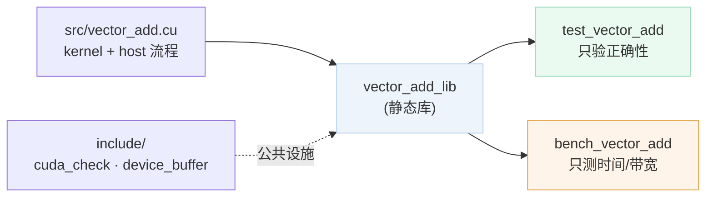
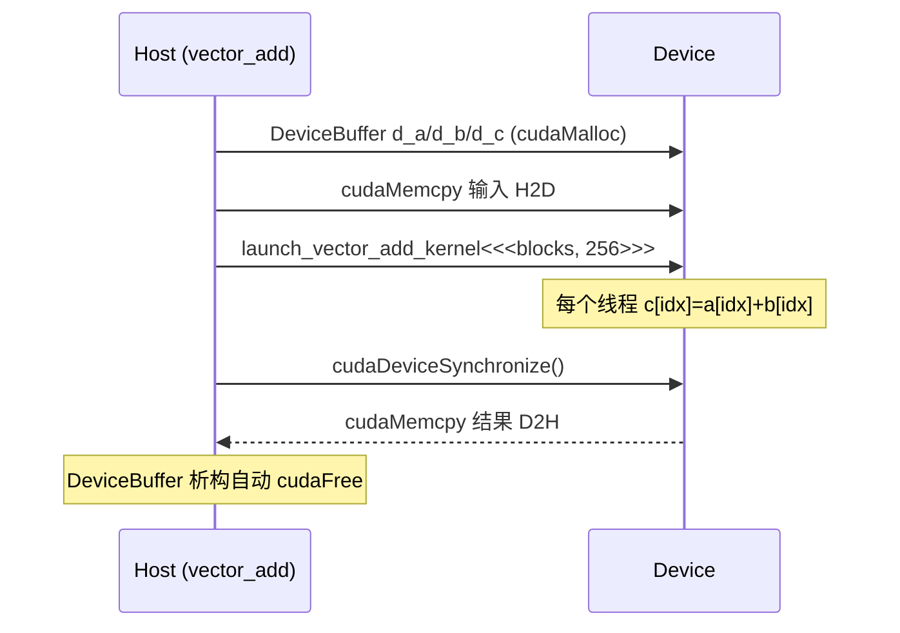

# CUDA Week 1 Hello World 项目解析

> 这个项目是 `CUDA_learning/week01`：用 `vector add` 这一个最简单的并行算子，把 **CMake 构建 → 错误检查 → 显存 RAII → kernel launch → correctness test → CUDA event benchmark → Agent workflow 约束** 这条 CUDA 工程闭环完整走一遍。kernel 本身只有一行加法，真正的内容是它周围的工程骨架——这套骨架后面 Week 2/3/4 会原样复用。

项目地址：[CUDA_learning/week01](https://github.com/hosendovebelva-boop/CUDA_learning/tree/main/week01)

阶段计划：[[Week 1 - CUDA + Agent workflow]]
配套文件：[[9.培养方案/90.素材库-GPU与推理方向/04.项目分析/Week01/exercises|渐进式练习]] · [[9.培养方案/90.素材库-GPU与推理方向/04.项目分析/Week01/profiling|profiling 方法论]] · [[9.培养方案/90.素材库-GPU与推理方向/04.项目分析/Week01/questions|必答题]]

---

## 1. 项目定位

`vector add` 是 CUDA 里**最容易并行**的一类问题：

```cpp
c[i] = a[i] + b[i];
```

每个输出元素只依赖同位置的两个输入，线程之间**零依赖、零通讯**。正因为算法本身没有难点，Week 1 的重点根本不在 kernel，而在**怎么把一个 CUDA kernel 工程化地包起来**：错误怎么暴露、显存谁来释放、测试和 benchmark 如何共享同一份实现、Agent 改代码的边界在哪。

这条主线往后直接连到 Week 2：reduction 把焦点从"每个线程独立做一件事"升级到"多个线程协作产生一个标量"，开始引入 shared memory 和线程同步——但用的还是 Week 1 这套 `cuda_check / DeviceBuffer / 测试+benchmark` 骨架。

衔接关系：本篇 → [[CUDA Week 2 Parallel Reduction 项目解析]] → [[CUDA Week 3 Transpose 项目解析]]。

一句话概括：**这是 CUDA 入门的"工程化 Hello World"——kernel 是配角，工程闭环才是主角。**

---

## 2. 项目架构总览

整个工程是**一个静态库 + 两个消费者**的极简结构：kernel 与 host 流程编进 `vector_add_lib`，correctness test 和 benchmark 都链接同一个库，从而保证"测的代码"和"跑的代码"是同一份。



目录职责：

| 路径 | 作用 |
|---|---|
| `CMakeLists.txt` | 启用 CUDA 语言、定义库与可执行目标 |
| `Makefile` | CMake 的便捷包装（`make` / `make test` / `make bench`） |
| `CLAUDE.md` | 约束 Agent 可做 / 需确认 / 禁止的操作 |
| `include/` | 与具体 kernel 无关的公共设施：错误检查、显存 RAII |
| `src/vector_add.{cu,cuh}` | kernel、launch 封装、host 完整流程，编进 `vector_add_lib` |
| `tests/` | correctness test，逐元素对比 CPU 参考 |
| `benchmarks/` | CUDA event benchmark，输出时间 + 有效带宽 + 正确性 |
| `docs/` | profiling 结果（待填） |

构建与运行：

```bash
cmake -S . -B build && cmake --build build   # 或直接 make
make test     # correctness test
make bench    # kernel 时间 + 有效带宽
```

建议阅读顺序：`CLAUDE.md → cuda_check.cuh → device_buffer.cuh → vector_add.cuh → vector_add.cu → test → bench`。这个顺序从工程约束出发，先工具封装、再核心实现、最后测试与性能。

---

## 3. 核心概念铺垫

读后面代码前，先把几个执行模型概念钉死，否则只会看到 `blockIdx.x * blockDim.x` 这串索引、看不到"为什么"。

- **kernel（`__global__`）**：由 host（CPU）发起、在 device（GPU）上并行执行的函数。一次 launch 会产生**大量线程**，每个线程跑同一份代码、处理不同数据（SIMT 模型）。
- **grid / block / thread**：launch 时写成 `kernel<<<blocks, threads_per_block>>>`。线程按 block 分组，block 组成 grid。线程靠 `blockIdx.x * blockDim.x + threadIdx.x` 算出自己负责的全局下标。
- **Host ↔ Device 数据流**：GPU 有独立显存，CPU 数据必须显式 `cudaMemcpy` 拷过去（H2D）、算完再拷回来（D2H）。这条"分配 → 拷入 → 计算 → 拷回"是所有 CUDA 程序的骨架。
- **memory-bound**：`vector add` 每个元素只做一次加法、却要读两次写一次。算术强度极低，性能几乎完全由显存带宽决定——所以 benchmark 关心的是**有效带宽**而非 FLOPS。

一句话串起来：**Week 1 把"一个 CPU 循环"翻译成"n 个 GPU 线程各做一次"，难点不在加法，而在跨越 Host/Device 边界的资源管理与错误处理。**

---

## 4. 公共基础设施

两个头文件与具体 kernel 无关，但决定了工程"可测、不泄漏、错误就地暴露"。这两个文件 Week 2/3 会**原样复用**。

### 4.1 CUDA_CHECK：让错误就地爆炸

CUDA Runtime 是 C 风格、靠返回值报错。不检查的话，错误会延迟到很久之后的某次同步/拷贝才暴露，定位成本极高。`cuda_check.cuh` 用一个宏把"表达式 + 文件 + 行号"打包抛异常：

```cpp
inline void check_cuda(cudaError_t status, const char* expr, const char* file, int line) {
    if (status == cudaSuccess) return;
    throw std::runtime_error(std::string("CUDA error: ") + cudaGetErrorString(status) +
        "\n  expression: " + expr + "\n  location: " + file + ":" + std::to_string(line));
}
#define CUDA_CHECK(expr) check_cuda((expr), #expr, __FILE__, __LINE__)
```

`#expr` 把表达式原文转成字符串，`__FILE__/__LINE__` 定位现场，`cudaGetErrorString` 给出人类可读信息。每一次 Runtime 调用都套 `CUDA_CHECK`：

```cpp
CUDA_CHECK(cudaMemcpy(d_a.get(), a.data(), d_a.bytes(), cudaMemcpyHostToDevice));
CUDA_CHECK(cudaDeviceSynchronize());
```

### 4.2 DeviceBuffer：显存的 RAII

裸 `cudaMalloc/cudaFree` 一旦中途 `return` 或抛异常就会泄漏，多个指针误指向同一块显存还会 double free。`DeviceBuffer<T>` 用 RAII 把生命周期绑死，并遵循"**禁拷贝、允移动**"：

```cpp
template <typename T>
class DeviceBuffer {
public:
    explicit DeviceBuffer(std::size_t count) : count_(count) {
        if (count_ > 0) CUDA_CHECK(cudaMalloc(reinterpret_cast<void**>(&ptr_), count_ * sizeof(T)));
    }
    ~DeviceBuffer() { if (ptr_) cudaFree(ptr_); }              // 析构自动释放，且不抛异常
    DeviceBuffer(const DeviceBuffer&) = delete;                // 禁拷贝：避免 double free
    DeviceBuffer& operator=(const DeviceBuffer&) = delete;
    DeviceBuffer(DeviceBuffer&& o) noexcept                    // 允移动：转移所有权
        : ptr_(o.ptr_), count_(o.count_) { o.ptr_ = nullptr; o.count_ = 0; }
    T* get();  std::size_t size() const;  std::size_t bytes() const;
};
```

> [!note] 为什么禁拷贝、却允移动
> 显存指针是独占资源。拷贝会让两个对象指向同一块显存，析构时 double free——所以删掉拷贝。移动语义"接管指针 + 置空源"是正确的所有权转移，和 `std::unique_ptr` 完全同构。RAII 思想可回看 [[独享智能指针]]。

`get()` 只是**借出**底层指针给 `cudaMemcpy` 或 kernel，不转移所有权，绝不能对它手动 `cudaFree`；`bytes()` 避免手写 `size() * sizeof(T)` 出错。

---

## 5. 核心实现：kernel 与 launch

### 5.1 kernel：每个线程处理一个元素

```cpp
__global__ void vector_add_kernel(const float* a, const float* b, float* c, int n) {
    const int idx = blockIdx.x * blockDim.x + threadIdx.x;
    if (idx < n) c[idx] = a[idx] + b[idx];
}
```

把 CPU 与 CUDA 两种写法摆在一起，思路一目了然：

```text
CPU：  一个线程做 n 次加法          for (i=0..n) c[i]=a[i]+b[i];
CUDA： n 个线程各做一次加法         idx = 全局下标; c[idx]=a[idx]+b[idx];
```

两个关键点：

- **`idx` 是全局下标**：`blockIdx.x * blockDim.x + threadIdx.x` 把"第几个 block × 每 block 多少线程 + block 内第几个线程"折算成数组下标。这是 CUDA 一维索引的标准式子。
- **`if (idx < n)` 不可省**：线程总数是 block 的整数倍，几乎总会多出一些线程，没有这个守卫它们会越界访问非法地址。

### 5.2 launch：计算 block 数并启动

```cpp
void launch_vector_add_kernel(const float* d_a, const float* d_b, float* d_c,
                              int n, int threads_per_block = 256) {
    const int blocks = (n + threads_per_block - 1) / threads_per_block;   // 向上取整
    vector_add_kernel<<<blocks, threads_per_block>>>(d_a, d_b, d_c, n);
    CUDA_CHECK(cudaGetLastError());                                       // 抓 launch 配置错误
}
```

`blocks = ceil(n / threads_per_block)` 是整数向上取整的惯用写法。以 `n=1000, threads_per_block=256` 为例：

```text
blocks = (1000 + 255) / 256 = 4
总线程数 = 4 × 256 = 1024 > 1000
多出的 24 个线程被 kernel 里的 if (idx < n) 拦下
```

> [!note] cudaGetLastError vs cudaDeviceSynchronize
> kernel launch 是**异步**的。`cudaGetLastError()` 只能抓到**launch 配置错误**（如 block 维度非法）；kernel 执行期的运行时错误要等后面的 `cudaDeviceSynchronize()` 才会暴露。两者职责不同，都要查。

### 5.3 host 侧完整流程

```cpp
std::vector<float> vector_add(const std::vector<float>& a, const std::vector<float>& b) {
    if (a.size() != b.size()) throw std::invalid_argument("size mismatch");
    if (a.empty()) return {};

    const int n = static_cast<int>(a.size());
    std::vector<float> c(a.size(), 0.0f);

    DeviceBuffer<float> d_a(a.size()), d_b(b.size()), d_c(c.size());      // 分配显存（RAII）
    CUDA_CHECK(cudaMemcpy(d_a.get(), a.data(), d_a.bytes(), cudaMemcpyHostToDevice));  // H2D
    CUDA_CHECK(cudaMemcpy(d_b.get(), b.data(), d_b.bytes(), cudaMemcpyHostToDevice));

    launch_vector_add_kernel(d_a.get(), d_b.get(), d_c.get(), n);        // 计算
    CUDA_CHECK(cudaDeviceSynchronize());                                 // 等 GPU 完成

    CUDA_CHECK(cudaMemcpy(c.data(), d_c.get(), d_c.bytes(), cudaMemcpyDeviceToHost));  // D2H
    return c;     // d_a/d_b/d_c 在此自动析构 cudaFree
}
```

这就是所有 CUDA 程序的标准数据流。用时序图看 Host 与 Device 的交互与同步点：



对应 [[3.1 CUDA Week 1 零基础系统入门|CUDA 零基础系统入门]] 的"分配 → 拷贝 → 计算 → 拷回"。注意：`vector_add` 把 H2D/计算/D2H 全包了，适合 `tests/`；benchmark 则需要**只测 kernel**，所以另有 `launch_vector_add_kernel` 这层只吃 device pointer 的封装（见 §7）。

---

## 6. Correctness Test

`tests/test_vector_add.cu` 只回答一件事：**结果对不对**。核心是把 GPU 输出逐元素对比 CPU 参考 `a[i]+b[i]`：

```cpp
void run_case(const std::vector<float>& a, const std::vector<float>& b) {
    const std::vector<float> c = vector_add(a, b);
    if (c.size() != a.size()) throw std::runtime_error("size mismatch");
    for (std::size_t i = 0; i < c.size(); ++i)
        expect_close(c[i], a[i] + b[i], static_cast<int>(i));
}
```

三个测试 case 各有针对性：

| Case | 规模 | 想暴露什么 |
|---|---|---|
| `{1,2,3}+{4,5,6}` | 极小 | 基本功能：结果应为 `{5,7,9}` |
| `1000` | 非 block 对齐 | `1000 % 256 ≠ 0`，检验 `if (idx < n)` 是否守住边界 |
| `1 << 20` | ~100 万 | 接近真实并行规模，验证大数据下仍正确 |

非对齐长度这个 case 是重点——它是唯一能抓出"忘记边界守卫"bug 的输入。

---

## 7. Benchmark 方法

`benchmarks/bench_vector_add.cu` 和 test 分开：test 关心对错，benchmark 关心**kernel 时间和有效带宽**。但 benchmark 仍保留最小正确性检查——"算错但很快"毫无意义。

### 7.1 只测 kernel，不含拷贝

```cpp
float benchmark_kernel_once(DeviceBuffer<float>& d_a, DeviceBuffer<float>& d_b,
                            DeviceBuffer<float>& d_c, int n, int repeat);
```

它接收**已经准备好的 device memory**，计时区间里只反复调 `launch_vector_add_kernel`，因此测的是 kernel-only 时间，**不含 H2D/D2H**。这是公平测 kernel 的前提。

### 7.2 warm-up + CUDA event 计时

```cpp
launch_vector_add_kernel(...); CUDA_CHECK(cudaDeviceSynchronize());   // warm-up：摊掉冷启动

CUDA_CHECK(cudaEventRecord(start));
for (int i = 0; i < repeat; ++i) launch_vector_add_kernel(...);
CUDA_CHECK(cudaEventRecord(stop));
CUDA_CHECK(cudaEventSynchronize(stop));
return elapsed_ms / static_cast<float>(repeat);                       // 平均单次时间
```

- **warm-up**：第一次 launch 含 CUDA context 初始化、cache 预热、GPU 升频等一次性开销，必须排除。
- **CUDA event** 记录的是 GPU stream 时间线，比 CPU 端 `std::chrono` 更准确地反映 kernel 真实执行时间。
- **repeat 取均值** 抹平抖动。

### 7.3 有效带宽

`vector add` 每个元素读 2 次（`a`、`b`）+ 写 1 次（`c`）= 3 次 4 字节访存：

```cpp
const double bytes = 3.0 * n * sizeof(float);            // 读 a + 读 b + 写 c
const double bandwidth_gbs = bytes / (kernel_ms / 1000.0) / 1e9;   // GB/s
```

因为算术只有一次加法、访存却有三次，`vector add` 是典型 **memory-bound**：有效带宽（而非 FLOPS）才是衡量它的指标。输出列为 `N | Kernel(ms) | Bandwidth(GB/s) | Check`，正好对应 Week 1 的 benchmark 验收。具体方法论与待填表格见 [[9.培养方案/90.素材库-GPU与推理方向/04.项目分析/Week01/profiling|profiling]]。

---

## 8. 常见坑

> [!warning] 忘记 `if (idx < n)` 边界守卫
> 线程总数是 block 的整数倍，几乎总有多余线程。没有守卫，它们越界读写非法地址 → 结果错或非法内存访问。测试必须包含**非 block 对齐长度**（如 1000）才能抓到。

> [!warning] 把 H2D/D2H 计入 kernel 计时
> 若在计时区间里包含 `cudaMemcpy`，测到的是"拷贝 + 计算"，掩盖 kernel 真实性能。benchmark 必须提前备好 device memory、只对 launch 计时。

> [!warning] 跳过 warm-up
> 第一次 launch 的 context 初始化开销可达毫秒级，会把均值严重拉高。必须先空跑一次并同步。

> [!warning] benchmark 不校验正确性
> 性能数字只有结果正确时才有意义。benchmark 输出必须带 `Check` 列——这也是仓库 CLAUDE.md 的硬性要求。

> [!warning] 不检查 Runtime 返回值
> CUDA 错误会延迟暴露。每个 Runtime 调用都套 `CUDA_CHECK`，kernel launch 后查 `cudaGetLastError()` + `cudaDeviceSynchronize()`。

---

## 9. 面试要点

- **CUDA 执行模型是什么？** host 启动 kernel，GPU 产生大量线程，每个线程跑同一份代码处理不同数据（SIMT）。线程按 block 分组、block 组成 grid。
- **全局下标怎么算？** `idx = blockIdx.x * blockDim.x + threadIdx.x`。
- **为什么需要 `if (idx < n)`？** 线程总数向上取整到 block 整数倍，多余线程必须被拦下，否则越界。
- **`blocks` 为什么向上取整？** 必须覆盖所有 n 个元素，`(n + tpb - 1) / tpb` 保证至少有 n 个线程。
- **DeviceBuffer 为什么禁拷贝、允移动？** 显存是独占资源，拷贝会 double free；移动是合法的所有权转移。
- **vector add 是 memory-bound 还是 compute-bound？** memory-bound——3 次访存只对应 1 次加法，性能由带宽决定。
- **benchmark 为什么要 warm-up、为什么只测 kernel？** 排除 context 初始化等一次性开销；排除 H2D/D2H 拷贝才能公平反映 kernel 本身。
- **`cudaGetLastError` 和 `cudaDeviceSynchronize` 区别？** 前者抓 launch 配置错误，后者抓 kernel 执行期错误。

完整问答见 [[9.培养方案/90.素材库-GPU与推理方向/04.项目分析/Week01/questions|questions]]。

---

## 10. Week 1 验收目标

- [ ] 能用 CMake 构建 CUDA 项目，解释 `include/src/tests/benchmarks` 的职责分工。
- [ ] 能解释 `CUDA_CHECK` 如何把 C 风格错误码转成带上下文的异常。
- [ ] 能解释 `DeviceBuffer<T>` 如何用 RAII 管理显存、为什么禁拷贝允移动。
- [ ] 能解释 `vector_add_kernel` 中每个线程只处理一个元素、`idx` 怎么算、为何要 `if (idx < n)`。
- [ ] 能解释 `blocks = (n + tpb - 1) / tpb` 的向上取整意义。
- [ ] 能跑通极小 / 非对齐 / 大规模三种 correctness test。
- [ ] 能用 warm-up + CUDA event 得到 kernel 平均时间，并计算有效带宽。

---

## 11. 关联知识

- [[Week 1 - CUDA + Agent workflow]] —— 本项目对应的阶段计划
- [[3.1 CUDA Week 1 零基础系统入门|CUDA 零基础系统入门]] —— CUDA 执行模型、典型数据流与 benchmark 入门
- [[CUDA Week 2 Parallel Reduction 项目解析]] —— 下一周：从独立处理升级到线程协作 + shared memory
- [[CUDA Week 3 Transpose 项目解析]] —— 第三周：访存合并与 bank conflict
- [[独享智能指针]] —— 理解 `DeviceBuffer<T>` 的 RAII 与独占所有权
- [[14.3 CMake基础]] —— 理解 CUDA 项目的 CMake 构建
- [[3.2 CUDA Runtime 进阶|CUDA Runtime 进阶]] —— event、stream、pinned memory 与 Runtime API
- [[3.4 CUDA Nsight Compute 指标速查|CUDA Nsight Compute 指标速查]] —— 后续解释 kernel 性能瓶颈
- 本目录：[[9.培养方案/90.素材库-GPU与推理方向/04.项目分析/Week01/exercises|exercises]] · [[9.培养方案/90.素材库-GPU与推理方向/04.项目分析/Week01/profiling|profiling]] · [[9.培养方案/90.素材库-GPU与推理方向/04.项目分析/Week01/questions|questions]]

---

## 参考

- NVIDIA CUDA C++ Programming Guide
- NVIDIA CUDA C++ Best Practices Guide
- 《Effective C++》Item 13：以对象管理资源
- 《Effective Modern C++》Item 18：使用 `std::unique_ptr` 管理独占所有权资源
