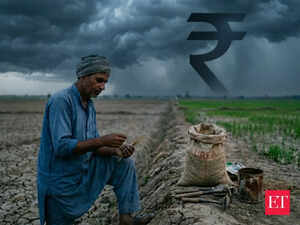

# A ₹3 lakh crore rain check? India’s monsoon now comes with a Hormuz fine print

[monsoon](https://economictimes.indiatimes.com/topic/monsoon)clouds, the market is keeping the other on a choke point more than 2,000 kilometres away. For an industry used to praying for rain, praying for peace in the
[Strait of Hormuz](https://economictimes.indiatimes.com/topic/strait-of-hormuz)is a fresh headache nobody wanted.
India's
[fertiliser](https://economictimes.indiatimes.com/topic/fertiliser)supplies are under pressure after disruptions to shipping routes due to the
[West Asia war](https://economictimes.indiatimes.com/topic/west-asia-war), raising concerns about lower farm produce and higher food prices. The crisis exposes India's heavy dependence on foreign agricultural inputs. As the world's second-largest fertiliser user, India relies on the Gulf for raw materials and finished products. Most of these vital shipments must pass directly through the volatile Strait of Hormuz.
ALSO READ |
[India trims fertiliser demand for kharif season as weak monsoon outlook triggers reassessment](https://economictimes.indiatimes.com/news/economy/agriculture/india-trims-fertiliser-demand-for-kharif-season-as-weak-monsoon-outlook-triggers-reassessment/articleshow/131448532.cms?from=mdr)
The timing of this bottleneck could not be worse for Indian farmers. The India Meteorological Department (IMD) delivered a sobering update last Friday by maintaining its forecast for a below-average monsoon in 2026. The weather watchdog warned that the weather pattern called
[El Niño](https://economictimes.indiatimes.com/topic/el-ni%C3%B1o)(which literally means 'the child') is rapidly locking into place across the equatorial Pacific Ocean with a staggering 92% probability of dominating the crucial June to September season. With cumulative rainfall projected at just 90% of the long term average, the nation is staring at its weakest monsoon in over a decade.
Pressure on rupee
Now, sowing for vital summer crops like rice, corn, and soybeans begins this month. To meet this seasonal demand, the government must secure urea through global tenders immediately.ALSO READ |
[India issues tender for 1.7 mn tonnes of urea ahead of sowing season](https://economictimes.indiatimes.com/industry/indl-goods/svs/chem-/-fertilisers/india-issues-tender-for-1-7-mn-tonnes-of-urea-ahead-of-sowing-season/articleshow/131357731.cms?from=mdr)
However, global urea prices have surged because 45% of world supplies transit through the Persian Gulf, as per Bloomberg. India recently bought 2.5 million tonnes of urea at nearly double pre-conflict prices.
This fiscal strain explains Prime Minister Narendra Modi's recent austerity appeal where he did not just ask citizens to cut petrol and diesel consumption. He also urged farmers to halve their use of chemical fertilisers. The Prime Minister pushed for an immediate transition to natural farming practices to protect long-term soil health.
The appeal highlights a sobering reality for the national economy. It is no longer just gold and crude oil bloating India's import bill. Foreign fertilisers are swelling the trade deficit just as heavily.
India faces a ‘vicious’ cycle, according to Manas Majumdar, Leader Oil & Gas, Fuels & Resources, PwC India.
The skyrocketing fertiliser import costs are swelling India’s import bill in addition to the fertiliser subsidy burden and widening the trade deficit which is weighing on the rupee, Majumdar told ET Online in an email response. “India’s total fertiliser-related foreign exchange outgo was about $27 billion in FY25-26, and this could surge to over $33 billion, if the West Asia crisis persists through the year.”
He painted a grim picture of India's mounting financial strain. The rising fertiliser bill is compounded by severe pressure from oil imports. Every $10 increase in the price of a barrel of oil adds $18 billion to India's import bill. Consequently, the Current Account Deficit (CAD) is projected to double to 1.5–2.0% of GDP this fiscal year. This deficit is worsened by $17 billion to $18 billion in foreign capital outflows. As a result, India faces a projected Balance of Payments deficit of $50 billion to $65 billion. This marks a rare and troubling third consecutive year in the red.
The rupee has already weakened significantly over the past year. The currency dropped from about ₹85 to over ₹95 against the US dollar. The prolonged conflict will only worsen the currency slide. “If the West Asia conflict continues, the USD/INR exchange rate is projected to head toward ₹100, further raising the cost of essential imports and adding to inflationary pressures,” Majumdar said.
A hefty Rs 3 lakh crore bill
Buying expensive fertiliser is only half the fiscal challenge; shielding farmers from those prices is the other. Because the government fixes retail prices to protect farmers, the Centre has to eat the difference when international markets spike. This growing burden makes it tough for India to meet its fiscal deficit target of 4.3% of GDP, especially since the previous year's deficit was already sitting at around ₹15–₹16 lakh crore.The ongoing West Asia crisis is driving up import costs across the board. Recent urea and DAP (di-ammonium phosphate) import prices have shot up to nearly $950 per metric tonne, representing a 123% jump for urea and a 39% rise for DAP compared to pre-conflict days, as per Crisil Intelligence.
Energy prices are further twisting the blade. Majumdar pointed out that LNG prices shooting up to $20/MMBTU have caused monthly subsidy payouts to run at double their projected speed. If these high prices drag on through the four-month monsoon season, Majumdar expects an extra ₹40,000–₹60,000 crore hit in this short window alone.
Tallying up the damage, experts ET Online spoke to arrive at a grim ₹3 lakh crore picture. Pushan Sharma, Director at Crisil Intelligence, noted that these elevated raw material costs are expected to drive total fertiliser subsidy expenditure to the tune of ₹2.75–₹3 lakh crore, completely overshadowing the budgeted estimate of ₹1.7 lakh crore. “This could lead to an additional fiscal burden of ₹1 lakh crore this fiscal, putting pressure on the fiscal deficit compared to the previous year,” Sharma warned.
Majumdar agreed that over a full year, the total subsidy bill will easily breach that ₹3 lakh crore mark—a staggering 75% above budget. He cautioned that this will be further compounded by Brent crude averaging $95–100 per barrel, which will cut into dividends from state-owned oil companies. When the dust settles, Majumdar projects the overall fiscal deficit will slip by 50 basis points, pushing the final deficit to 4.7%–4.8% of GDP.
[ICRA](https://economictimes.indiatimes.com/icra-ltd/stocks/companyid-1311.cms)expects the budgeted fertiliser subsidy bill of ₹1.71 trillion for FY27 to be overshot by approximately ₹50,000 crore. This is likely to be almost entirely offset by the additional collections on account of the hike in customs duty on gold and silver, as per Aditi Nayar, Chief Economist,
[ICRA Ltd](https://economictimes.indiatimes.com/icra-ltd/stocks/companyid-1311.cms).
The Indian government has historically shielded farmers from geopolitical shocks. For instance, in FY23, fertiliser subsidy expenditure rose by 63% to ₹2.51 lakh crore during the Russia-Ukraine conflict.
The current situation is more challenging as the government is also supporting fuel prices, stabilising the USD-INR exchange rate, and ensuring fertiliser availability, Sharma explained. Despite these pressures, he said, it is likely to continue subsidising farmers by absorbing higher costs.
Echoing a similar opinion, Nayar also said that unlike in the case of fuels, ICRA does not expect the government to hike fertiliser prices to pass on the increased costs to consumers.
Kitchen budget
While the government fights this battle on its balance sheet, the ultimate casualty of a prolonged crisis could be the kitchen budget.Majumdar said, a potential fertiliser price increase along with prolonged fertiliser import shortfall could stoke food inflation in coming months, which could be compounded further if El Nino leads to weak monsoon – as seen when a monsoon shortfall drove food inflation to 11.5% in 2023. “For now, the government’s fertiliser subsidy is managing prices and further the government has boosted domestic fertiliser supply from its stocks, by approximately 12% year-on-year to nearly 200 LMT.”
In this context, he stated that the upcoming Kharif sowing cycle sees “severe double-sided pressure.” On the climate front, the IMD has projected a below-normal southwest monsoon at 90% of the Long Period Average (LPA)
On the logistics front, the blockade of the Strait of
[Hormuz](https://economictimes.indiatimes.com/topic/hormuz)has caused a 95% collapse in shipping traffic, stalling 3-4 million tonnes of fertiliser trade per month, which, according to him, is not coming to India and hence would significantly impact the sowing season if fertiliser availability does not improve soon.
Fortunately, India's current buffer stocks mean the panic button doesn't need to be pushed just yet, though the clock is ticking. ICRA’s Nayar, said that the current stock of fertilisers seems adequate for the upcoming kharif sowing cycle. However, “we are concerned around the availability for the rabi season, especially if the West Asia conflict persists for an extended duration.”
Much now rests on how long the hostilities persist, as analysts expect supply chains to stabilise within weeks once shipping flows normalise.

