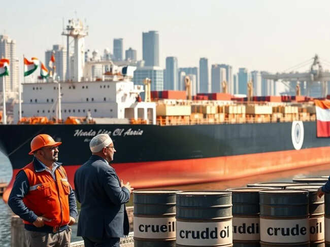

# Why Asia's oil lifeline can't survive on US crude alone

However, more U.S. oil is on the way, with Kpler tracking arrivals of 2.32 million bpd in June and 3.07 million bpd in July.
This is more than double the average of 1.37 million bpd of U.S. crude that Asia imported in the three months to the end of February.
Also Read:
[Ship operators urge clear rules to return Hormuz to normal](https://economictimes.indiatimes.com/small-biz/trade/exports/insights/ship-operators-urge-clear-rules-to-return-hormuz-to-normal/articleshow/131454889.cms?from=mdr)
The United States and Israel attacked Iran on February 28 and Tehran retaliated by effectively closing the Strait of Hormuz, through which about 20% of global crude oil and refined products moved prior to the start of the conflict.
While some Middle Eastern exporters such as Saudi Arabia and the United Arab Emirates have managed to re-route some oil exports to ports outside the strait, at least 10 million bpd of supply remains unavailable as the Iran conflict drags on.
About 1.2 million bpd of crude reached Asia in May through the Strait of Hormuz as some vessels secured Iranian approval to transit, but this is down from the average of 13.54 million bpd in the three months ended February.
The scale of the loss of cargoes through the strait overwhelms the additional volumes Asia has secured from the United States, as well as from other exporters in the Americas and Africa.
Asia's seaborne crude arrivals in May were 19.47 million bpd, up from 18.7 million bpd in April, which was the lowest in more than 10 years, according to Kpler data.
However, even May's higher arrivals were still 22% down from the average of 24.82 million bpd for the three months to the end of February.
It's this loss of more than 5 million bpd in supplies that will ultimately lead to tough choices for Asia's refiners.
So far they have managed to keep plants operating by a combination of using up commercial and in some cases strategic stockpiles, while also reducing processing rates.
Also Read:
[Refiners adjust to new crude mix as Hormuz crisis tightens supply](https://economictimes.indiatimes.com/industry/energy/oil-gas/refiners-adjust-to-new-crude-mix-as-hormuz-crisis-tightens-supply/articleshow/131427699.cms?from=mdr)
But there are now questions being asked as to how much longer the world can continue to deplete inventories before refiners are forced to significantly cut back throughput amid crude shortages.
CRUNCH COMING?
There is an emerging consensus among most analysts and oil executives that the clock is ticking louder.It's likely that the process won't be spread evenly across the world, with some regions likely to be able to continue producing and refining oil at usual rates, but others struggling to secure supply.
Ultimately, if the Strait of Hormuz doesn't reopen within the coming weeks and doesn't remain open on a sustainable basis, it's likely that prices for refined fuels will have to increase in order to force a reduction in demand.
Asia, which took about 80% of the usual volumes through the Strait of Hormuz, is the most exposed and it's likely that less well-developed, fuel-importing countries such as Bangladesh, the Philippines and Pakistan will experience the pain soonest.
There are also likely to be increasing questions asked in the United States about the rapid depletion of inventories amid record crude and product exports.
U.S. politicians from both major parties tend to focus heavily on domestic issues and it isn't hard to see them increasingly opposing oil and fuel exports in the mistaken belief that this will somehow lower retail prices at home.
Enjoying this column? Check out Reuters Open Interest (ROI), your essential new source for global financial commentary. ROI delivers thought-provoking, data-driven analysis of everything from swap rates to soybeans. Markets are moving faster than ever. ROI can help you keep up. Follow ROI on LinkedIn and X.
The views expressed here are those of the author, a columnist for Reuters.
(Catch all the [Business News](https://economictimes.indiatimes.com/news), [Breaking News](https://economictimes.indiatimes.com/breakingnewslist.cms) and [Latest News](https://economictimes.indiatimes.com/news/latest-news) Updates on [The Economic Times](https://economictimes.indiatimes.com/).)
Subscribe to [The Economic Times Prime](https://buy.indiatimes.com/ET/plans) and read the [ET ePaper](https://epaper.indiatimes.com/timesepaper/publication-the-economic-times,city-delhi.cms) online.
(Catch all the [Business News](https://economictimes.indiatimes.com/news), [Breaking News](https://economictimes.indiatimes.com/breakingnewslist.cms) and [Latest News](https://economictimes.indiatimes.com/news/latest-news) Updates on [The Economic Times](https://economictimes.indiatimes.com/).)
Subscribe to [The Economic Times Prime](https://buy.indiatimes.com/ET/plans) and read the [ET ePaper](https://epaper.indiatimes.com/timesepaper/publication-the-economic-times,city-delhi.cms) online.

