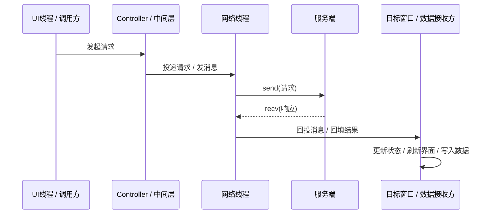
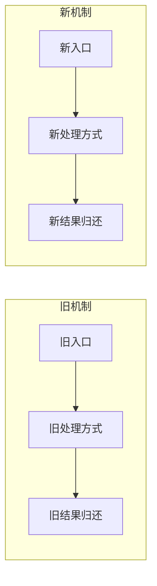

---
tags:
  - 项目/远控系统
git: ""
git_msg: ""
---

# {{title}}

> 基于提交 `commit_hash`（手动替换）。先用 1-2 句话说清楚：这次改动主要解决了什么、把哪条链路往前推进了一步、当前版本的准确定位是什么。

<!--
使用说明
1. 这个模板默认按“教学文档”来写，不要上来就堆改动清单。
2. 推荐顺序：
   - 先说这次改了什么
   - 再说和上一版是什么关系
   - 然后把整条链路讲顺
   - 最后再落到关键代码和 API
3. 语言要求：
   - 直白、好懂、像带着读者走一遍
   - 不要太死板，不要故作高深
   - 不要用奇怪的比喻
4. 如果这次提交同时包含 bug 修复：
   - 主笔记里只保留必要的结论和入口
   - 详细 bug 过程下沉到 `Bug目录` 或 `0. Debug日志`
   - 主笔记与 bug 笔记要互相链接
5. 不相关的章节直接删掉，不要留下空标题。
6. `git` / `git_msg` 建议与正文中的 `commit_hash` 同步填写。
-->

---

## 先看清楚，这次改了什么

| 变化点 | 代码表现 | 真正含义 |
|------|------|------|
| 变化 1 | 具体改了哪段代码 / 哪个函数 | 这个改动解决的核心问题 |
| 变化 2 | 具体改了哪条链路 / 哪个接口 | 这个改动把系统推进到了哪一步 |
| 变化 3 | 如果有稳定性 / 可维护性改动，也写出来 | 不只是“能跑”，而是“更稳 / 更清楚” |

<!--
这一节要让读者先建立全局印象。
不要把所有细节都塞在表里，表格只负责“先看明白大方向”。
-->

---

## 和上一版是什么关系

> 上一版的核心结论是：一句话概括，不要长。

| 维度 | 上一版状态 | 这次状态 |
|------|------|------|
| 请求怎么发 | 旧状态 | 新状态 |
| 响应怎么回 | 旧状态 | 新状态 |
| 哪个问题还没解决 | 旧状态 | 这次补到了哪一步 |

<!--
如果这是系列笔记，读者最关心的通常不是“你改了几行”，而是“和上一节相比，现在到底前进了什么”。
-->

---

## 先把主链路讲顺

<!--
这是模板里最重要的一节。
先用自然语言把“请求 -> 网络线程 -> 响应 -> UI/业务处理”讲顺，再放图。
如果这篇没有明显的链路，可以把本节标题改成“先把核心思路讲顺”。
-->

先用 2-4 段短文字，把这次最重要的一条链路讲清楚：

1. 谁发起请求
2. 请求交给谁处理
3. 响应从哪回来
4. 最后是谁把结果落到 UI / 状态 / 文件 / 数据结构里

### 链路时序图



### 结构流程图


### 如果这次同时在对比“旧机制 vs 新机制”



<!--
对比图里要让读者一眼看懂：
- 谁会阻塞
- 谁不再阻塞
- 响应最终归谁处理
-->

---

## 核心实现

<!--
这一节才开始进代码。
不要一口气贴很长代码，按“函数 / 责任点”拆小块。
代码块里建议带简短注释，顺序要从“这段代码整体在做什么”讲到“具体步骤为什么这样写”。
-->

### 1. 函数 / 机制名称

> 📁 `文件路径` : 函数名 (行 XX-XX)

```cpp
ReturnType FunctionName(...)
{
    // ===== 1. 这一步在整条链路里的作用 =====
    // 先说明“它负责什么”，不要一上来就掉进局部细节

    // ===== 2. 关键处理步骤 =====
    // 这里再解释为什么这样写、依赖了什么状态或 API

    // ===== 3. 容易出错的细节 =====
    // 如果这里和线程、消息、生命周期、协议边界有关，要直接点出来
}
```

**这段代码在做什么**：

一句话说清楚它在整条链路里的位置。

**代码分析建议**：

先按下面这个顺序讲，不要一上来就只解释某一行：

1. **整体职责**：这个函数在整条请求/响应链路中负责哪一段
2. **输入和输出**：它接收什么，最终把结果交给谁
3. **关键步骤**：代码内部按顺序做了哪几件事
4. **实现细节**：哪些局部写法最值得单独解释
5. **风险点**：这里最容易出 bug 的地方是什么

**关键点解析**：

1. 为什么这一步要放在这里
2. 它依赖了什么机制（Win32 / MFC / Winsock / 状态同步 / 请求-响应协议）
3. 哪些参数或状态最值得注意
4. 如果这里写错，最容易错成什么样

### 如果某个局部细节很绕，可以单独加“代码分析”

适合补一小段专项说明的场景：

- 某个状态位是怎么在多处函数之间流转的
- 某个对象的所有权在谁手里、什么时候转移
- 一段 `switch` / 回调 / 消息分发为什么会命中或命不中
- 一段缓冲区、内存布局、包结构处理为什么这样搬移

必要时可以用**简短 ASCII** 辅助说明局部结构，但只适合小范围讲解，不要拿 ASCII 代替整张机制图。

示例：

```text
请求发出后：
  UI线程
    -> PostThreadMessage
    -> 网络线程
    -> SendMessage 回到窗口
    -> 窗口函数接手结果
```

### 2. 函数 / 机制名称

> 📁 `文件路径` : 函数名 (行 XX-XX)

```cpp
// 继续按“小代码块 + 讲解”的方式写
```

<!--
主笔记更像“带读代码”，不是代码仓库导出。
-->

---

## 如果这次还带了 bug

<!--
如果本次提交同时修 bug，推荐保留本节。
如果没有，直接删掉。
-->

这一节不要把所有调试过程都塞进来，只保留：

- bug 是什么
- 它卡住了哪条链路
- 这次是怎么修的

详细的现象、排查过程、错误代码和修复过程，放到单独的 bug 笔记里。

### 本次相关 bug

- [[Bug目录/某个 Bug 笔记]] — 讲具体错误是怎么发生的
- [[Debug-XXX 某个全局调试日志]] — 如果这个 bug 值得进入全局索引，也补这里

---

## 当前版本的准确结论

### 已经做对的部分

- 完成项 1
- 完成项 2
- 这次最值得记住的设计变化

### 还没完全收口的部分

- 还残留的旧逻辑
- 当前写法的边角风险
- 下一步最自然应该收的那一段

> 本次提交的准确定位：**用一句话总结它在整个重构过程中的位置。**

---

## Win32 / Winsock / MFC 关键机制

<!--
不要把这一节写成“API 词典”。
只讲本篇真正需要的 API，并讲清楚：
- 它在当前项目里的角色
- 为什么用它，而不是旁边那个相似 API
-->

### API / 机制名称

```cpp
返回类型 FunctionName(参数列表);
```

| 参数 | 当前项目里的作用 |
|------|------|
| `参数1` | 在这条链路里扮演什么角色 |
| `参数2` | 和线程 / 生命周期 / 协议有什么关系 |

| 返回值 | 在这篇场景里意味着什么 |
|--------|------|
| 成功值 | 成功之后谁继续处理 |
| 失败值 | 失败之后谁负责兜底 |

### 和相邻 API 的区别（可选）

| API | 区别 | 这篇为什么选它 |
|------|------|------|
| `API A` | 和 `API B` 的核心差别 | 当前设计为什么更适合它 |

---

## 易错点与调试

> [!warning] 用一句话提醒读者：这类问题最容易在哪个地方想错。

### 1. 易错模式名称

```cpp
// ❌ 错误写法
错误代码;

// ✅ 更稳的写法
正确代码;
```

**为什么容易错**：

一句话说明误区。

### 2. 易错模式名称

```cpp
// ❌ 错误写法
错误代码;

// ✅ 正确写法
正确代码;
```

---

## 关联知识

- [[相关笔记 1]] - 这篇和它是什么关系
- [[相关笔记 2]] - 哪个概念已经在别处讲过
- [[Bug目录/相关 bug 笔记]] - 如果想看更细的错误过程，去这里

---

## 代码索引

| 功能 | 文件 | 位置 |
|------|------|------|
| 核心功能 | `路径/文件名.cpp` | 函数名 (行 XX-XX) |
| 关键回调 | `路径/文件名.cpp` | 函数名 (行 XX-XX) |
| 关键状态 / 成员 | `路径/文件名.h` | 成员变量 / 方法 |

---

## 更新记录

| 日期 | 变更 |
|------|------|
| {{date:YYYY-MM-DD}} | 初始版本：基于提交 `commit_hash`，按教学讲法整理主链路、关键代码和 bug 入口 |
